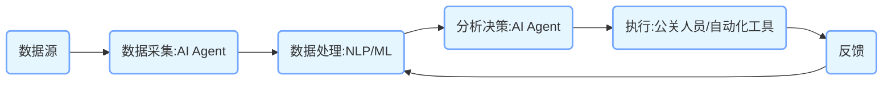

# AI Agent在企业舆情监测与危机公关中的应用

> 关键词：AI Agent、企业舆情监测、危机公关、自然语言处理、机器学习

> 摘要：本文深入探讨了AI Agent在企业舆情监测与危机公关中的应用。首先介绍了相关背景，包括目的、预期读者、文档结构和术语表。接着阐述了AI Agent、企业舆情监测和危机公关的核心概念及其联系，并给出了相应的文本示意图和Mermaid流程图。详细讲解了AI Agent用于舆情监测和危机公关的核心算法原理，结合Python源代码进行说明。同时给出了相关的数学模型和公式，并举例说明。通过项目实战，展示了开发环境搭建、源代码实现和代码解读。分析了AI Agent在企业舆情监测与危机公关中的实际应用场景。推荐了学习资源、开发工具框架和相关论文著作。最后总结了未来发展趋势与挑战，提供了常见问题解答和扩展阅读参考资料。

## 1. 背景介绍 
### 1.1 目的和范围
在当今数字化时代，企业面临着海量的舆情信息，如何快速、准确地监测舆情并及时进行危机公关成为企业生存和发展的关键。本文的目的在于详细探讨AI Agent在企业舆情监测与危机公关中的应用，包括其原理、算法、实际案例等，旨在为企业提供有效的技术手段和解决方案。范围涵盖了AI Agent的基本概念、核心算法、数学模型，以及在企业舆情监测和危机公关中的具体应用场景。

### 1.2 预期读者
本文预期读者包括企业的公关部门人员、市场营销人员、信息技术人员，以及对AI Agent和企业舆情管理感兴趣的研究人员和学者。对于公关和营销人员，本文将帮助他们了解如何利用AI Agent提升舆情监测和危机公关的效率和效果；对于信息技术人员，本文将提供技术实现的思路和方法；对于研究人员和学者，本文将为他们的研究提供参考和借鉴。

### 1.3 文档结构概述
本文将按照以下结构进行组织：首先介绍背景信息，包括目的、预期读者、文档结构和术语表；然后阐述核心概念及其联系，给出文本示意图和Mermaid流程图；接着详细讲解核心算法原理和具体操作步骤，结合Python源代码进行说明；再给出相关的数学模型和公式，并举例说明；通过项目实战展示开发环境搭建、源代码实现和代码解读；分析实际应用场景；推荐学习资源、开发工具框架和相关论文著作；最后总结未来发展趋势与挑战，提供常见问题解答和扩展阅读参考资料。

### 1.4 术语表
#### 1.4.1 核心术语定义
- **AI Agent**：即人工智能代理，是一种能够感知环境、自主决策并采取行动以实现特定目标的软件实体。它可以模拟人类的智能行为，与环境进行交互，完成各种任务。
- **企业舆情监测**：指对与企业相关的各种舆情信息进行收集、整理、分析和评估的过程，旨在及时了解公众对企业的看法、态度和评价，发现潜在的危机和机遇。
- **危机公关**：是指企业在面临危机时，通过采取一系列的沟通、协调和处理措施，以减少危机对企业的负面影响，恢复企业的声誉和形象。

#### 1.4.2 相关概念解释
- **自然语言处理（NLP）**：是AI Agent用于处理舆情信息的关键技术之一，它涉及到对人类语言的理解、分析和生成。通过NLP技术，AI Agent可以对文本信息进行情感分析、主题分类、关键词提取等操作。
- **机器学习（ML）**：是AI Agent实现智能决策的重要手段，它通过对大量数据的学习和训练，构建模型来预测和分类。在舆情监测和危机公关中，机器学习可以用于预测舆情的发展趋势、识别危机事件等。

#### 1.4.3 缩略词列表
- **NLP**：Natural Language Processing（自然语言处理）
- **ML**：Machine Learning（机器学习）
- **AI**：Artificial Intelligence（人工智能）

## 2. 核心概念与联系 
### 核心概念原理
#### AI Agent
AI Agent的基本原理是基于感知、决策和行动的循环。它通过传感器感知环境信息，将其转化为内部表示，然后根据预设的目标和规则进行决策，最后通过执行器采取相应的行动。在企业舆情监测与危机公关中，AI Agent可以通过网络爬虫等工具感知舆情信息，利用自然语言处理和机器学习技术进行分析和决策，最后向企业公关人员提供建议或自动执行一些公关行动。

#### 企业舆情监测
企业舆情监测的原理是通过收集各种渠道的舆情信息，如新闻媒体、社交媒体、论坛等，然后对这些信息进行筛选、分类和分析，以了解公众对企业的态度和评价。监测的内容包括企业的品牌形象、产品质量、服务水平、市场竞争等方面。

#### 危机公关
危机公关的原理是在企业面临危机时，及时采取有效的沟通和处理措施，以减少危机对企业的负面影响。危机公关的关键在于快速响应、准确判断、有效沟通和积极处理。通过与公众、媒体和相关利益者进行沟通，企业可以解释事件的原因、表明态度、采取措施，以恢复公众的信任和支持。

### 架构的文本示意图
```
企业舆情监测与危机公关系统架构

数据源层：
- 新闻媒体网站
- 社交媒体平台
- 论坛和博客

数据采集层：
- AI Agent（网络爬虫）

数据处理层：
- 自然语言处理（NLP）
- 机器学习（ML）

分析决策层：
- AI Agent（舆情分析、危机预警、决策建议）

执行层：
- 企业公关人员
- 自动化公关工具
```

### Mermaid流程图


## 3. 核心算法原理 & 具体操作步骤 
### 核心算法原理
#### 情感分析算法
情感分析是舆情监测中的重要环节，其目的是判断文本信息的情感倾向，如积极、消极或中性。常用的情感分析算法有基于词典的方法和基于机器学习的方法。

基于词典的方法是通过预先定义一个情感词典，将文本中的词汇与词典进行匹配，根据匹配结果计算文本的情感得分。例如，使用Python实现基于词典的情感分析：

```python
import jieba

# 定义情感词典
positive_dict = {'好': 1, '棒': 1, '优秀': 1}
negative_dict = {'坏': -1, '差': -1, '糟糕': -1}

def sentiment_analysis(text):
    words = jieba.lcut(text)
    score = 0
    for word in words:
        if word in positive_dict:
            score += positive_dict[word]
        elif word in negative_dict:
            score += negative_dict[word]
    if score > 0:
        return '积极'
    elif score < 0:
        return '消极'
    else:
        return '中性'

text = "这个产品真好"
result = sentiment_analysis(text)
print(result)
```

基于机器学习的方法是通过训练一个分类模型来判断文本的情感倾向。常用的机器学习算法有朴素贝叶斯、支持向量机等。以下是使用Python和Scikit-learn库实现基于朴素贝叶斯的情感分析：

```python
from sklearn.feature_extraction.text import TfidfVectorizer
from sklearn.naive_bayes import MultinomialNB
from sklearn.pipeline import Pipeline

# 训练数据
train_data = ['这个产品真好', '那个服务太差了', '东西还不错']
train_labels = ['积极', '消极', '积极']

# 构建模型
model = Pipeline([
    ('vectorizer', TfidfVectorizer()),
    ('classifier', MultinomialNB())
])

# 训练模型
model.fit(train_data, train_labels)

# 测试数据
test_data = ['这个东西挺好的']
result = model.predict(test_data)
print(result[0])
```

#### 主题分类算法
主题分类是将文本信息归类到不同的主题类别中，以便更好地了解舆情的分布和趋势。常用的主题分类算法有基于规则的方法和基于机器学习的方法。

基于规则的方法是通过定义一系列的规则来判断文本的主题类别。例如，如果文本中包含“产品质量”相关的词汇，则将其归类到“产品质量”主题。

基于机器学习的方法是通过训练一个分类模型来进行主题分类。以下是使用Python和Scikit-learn库实现基于支持向量机的主题分类：

```python
from sklearn.feature_extraction.text import TfidfVectorizer
from sklearn.svm import SVC
from sklearn.pipeline import Pipeline

# 训练数据
train_data = ['这个产品质量很好', '公司的营销策略很棒', '员工的服务态度不错']
train_labels = ['产品质量', '营销策略', '服务态度']

# 构建模型
model = Pipeline([
    ('vectorizer', TfidfVectorizer()),
    ('classifier', SVC())
])

# 训练模型
model.fit(train_data, train_labels)

# 测试数据
test_data = ['产品的质量有待提高']
result = model.predict(test_data)
print(result[0])
```

### 具体操作步骤
#### 数据采集
使用AI Agent（网络爬虫）从新闻媒体网站、社交媒体平台、论坛和博客等数据源采集与企业相关的舆情信息。可以使用Python的`requests`和`BeautifulSoup`库来实现网络爬虫。

```python
import requests
from bs4 import BeautifulSoup

url = 'https://example.com/news'
response = requests.get(url)
soup = BeautifulSoup(response.text, 'html.parser')
articles = soup.find_all('article')
for article in articles:
    title = article.find('h2').text
    content = article.find('p').text
    print(title, content)
```

#### 数据预处理
对采集到的舆情信息进行预处理，包括去除噪声、分词、去除停用词等操作。可以使用Python的`jieba`库进行分词，使用`nltk`库去除停用词。

```python
import jieba
import nltk
from nltk.corpus import stopwords

nltk.download('stopwords')
stop_words = set(stopwords.words('chinese'))

text = "这个产品真好，值得购买"
words = jieba.lcut(text)
filtered_words = [word for word in words if word not in stop_words]
print(filtered_words)
```

#### 数据分析
使用情感分析和主题分类算法对预处理后的舆情信息进行分析，得到舆情的情感倾向和主题类别。

#### 决策建议
根据数据分析的结果，AI Agent可以为企业公关人员提供决策建议，如是否需要进行危机公关、采取何种公关策略等。

## 4. 数学模型和公式 & 详细讲解 & 举例说明 
### 情感分析的数学模型和公式
#### 基于词典的情感分析
基于词典的情感分析的数学模型可以表示为：

$$S = \sum_{i=1}^{n} w_i \times s_i$$

其中，$S$ 表示文本的情感得分，$n$ 表示文本中的词汇数量，$w_i$ 表示第 $i$ 个词汇的权重（通常为1），$s_i$ 表示第 $i$ 个词汇的情感得分（根据情感词典确定）。

例如，对于文本“这个产品真好”，分词后得到“这个”、“产品”、“真”、“好”，其中“好”的情感得分 $s = 1$，其他词汇的情感得分 $s = 0$，则文本的情感得分 $S = 1$，情感倾向为积极。

#### 基于机器学习的情感分析
基于机器学习的情感分析通常使用分类模型，如朴素贝叶斯分类器。朴素贝叶斯分类器的数学原理基于贝叶斯定理：

$$P(C|X) = \frac{P(X|C) \times P(C)}{P(X)}$$

其中，$P(C|X)$ 表示在给定文本特征 $X$ 的情况下，文本属于类别 $C$ 的概率；$P(X|C)$ 表示在类别 $C$ 下，文本特征 $X$ 出现的概率；$P(C)$ 表示类别 $C$ 的先验概率；$P(X)$ 表示文本特征 $X$ 出现的概率。

在实际应用中，为了简化计算，通常假设文本中的特征是相互独立的，即朴素贝叶斯假设。则有：

$$P(X|C) = \prod_{i=1}^{n} P(x_i|C)$$

其中，$x_i$ 表示文本中的第 $i$ 个特征。

### 主题分类的数学模型和公式
主题分类通常使用支持向量机（SVM）等分类模型。支持向量机的目标是找到一个最优的超平面，将不同类别的数据分开。

对于二分类问题，支持向量机的数学模型可以表示为：

$$f(x) = \text{sign}(\sum_{i=1}^{n} \alpha_i y_i K(x_i, x) + b)$$

其中，$f(x)$ 表示分类结果，$\alpha_i$ 表示拉格朗日乘子，$y_i$ 表示样本的类别标签，$K(x_i, x)$ 表示核函数，$b$ 表示偏置项。

核函数的作用是将低维空间中的数据映射到高维空间中，使得数据在高维空间中更容易分开。常用的核函数有线性核、多项式核、高斯核等。

例如，使用线性核的支持向量机的核函数为：

$$K(x_i, x) = x_i^T x$$

### 举例说明
假设我们有一个包含100条舆情信息的数据集，其中50条为积极情感，50条为消极情感。我们使用朴素贝叶斯分类器进行情感分析，训练模型后，对一条新的舆情信息“这个服务太差劲了”进行分类。

首先，将文本进行分词和预处理，得到特征向量。然后，使用训练好的模型计算该文本属于积极情感和消极情感的概率。假设计算得到 $P(\text{积极}|X) = 0.2$，$P(\text{消极}|X) = 0.8$，则根据概率大小，将该文本分类为消极情感。

## 5. 项目实战：代码实际案例和详细解释说明 
### 5.1  开发环境搭建
#### 安装Python
首先，需要安装Python环境。可以从Python官方网站（https://www.python.org/downloads/）下载适合自己操作系统的Python版本，并按照安装向导进行安装。

#### 安装必要的库
在命令行中使用`pip`命令安装必要的库，如`jieba`、`scikit-learn`、`requests`、`beautifulsoup4`等。

```bash
pip install jieba scikit-learn requests beautifulsoup4
```

### 5.2  源代码详细实现和代码解读
以下是一个完整的企业舆情监测与危机公关的Python代码示例：

```python
import requests
from bs4 import BeautifulSoup
import jieba
import nltk
from nltk.corpus import stopwords
from sklearn.feature_extraction.text import TfidfVectorizer
from sklearn.naive_bayes import MultinomialNB
from sklearn.pipeline import Pipeline

# 下载停用词
nltk.download('stopwords')
stop_words = set(stopwords.words('chinese'))

# 数据采集
def collect_data(url):
    response = requests.get(url)
    soup = BeautifulSoup(response.text, 'html.parser')
    articles = soup.find_all('article')
    data = []
    for article in articles:
        title = article.find('h2').text
        content = article.find('p').text
        data.append(title + ' ' + content)
    return data

# 数据预处理
def preprocess_data(data):
    preprocessed_data = []
    for text in data:
        words = jieba.lcut(text)
        filtered_words = [word for word in words if word not in stop_words]
        preprocessed_text = ' '.join(filtered_words)
        preprocessed_data.append(preprocessed_text)
    return preprocessed_data

# 训练情感分析模型
def train_sentiment_model(train_data, train_labels):
    model = Pipeline([
        ('vectorizer', TfidfVectorizer()),
        ('classifier', MultinomialNB())
    ])
    model.fit(train_data, train_labels)
    return model

# 进行情感分析
def sentiment_analysis(model, data):
    results = model.predict(data)
    return results

# 主函数
def main():
    # 采集数据
    url = 'https://example.com/news'
    raw_data = collect_data(url)
    
    # 数据预处理
    preprocessed_data = preprocess_data(raw_data)
    
    # 训练数据
    train_data = ['这个产品真好', '那个服务太差了', '东西还不错']
    train_labels = ['积极', '消极', '积极']
    
    # 训练情感分析模型
    sentiment_model = train_sentiment_model(train_data, train_labels)
    
    # 进行情感分析
    sentiment_results = sentiment_analysis(sentiment_model, preprocessed_data)
    
    # 输出结果
    for i in range(len(raw_data)):
        print(f"原文: {raw_data[i]}")
        print(f"情感倾向: {sentiment_results[i]}")
        print()

if __name__ == "__main__":
    main()
```

### 5.3  代码解读与分析
#### 数据采集
`collect_data`函数使用`requests`库发送HTTP请求，获取网页内容，然后使用`BeautifulSoup`库解析网页，提取新闻标题和内容。

#### 数据预处理
`preprocess_data`函数使用`jieba`库进行分词，使用`nltk`库去除停用词，将处理后的词汇拼接成字符串。

#### 训练情感分析模型
`train_sentiment_model`函数使用`TfidfVectorizer`将文本转换为TF-IDF特征向量，使用`MultinomialNB`训练朴素贝叶斯分类器。

#### 进行情感分析
`sentiment_analysis`函数使用训练好的模型对预处理后的数据进行情感分析，得到情感倾向结果。

#### 主函数
`main`函数调用上述函数，完成数据采集、预处理、模型训练和情感分析的整个流程，并输出结果。

## 6. 实际应用场景 
### 实时舆情监测
AI Agent可以实时监测新闻媒体、社交媒体等渠道的舆情信息，及时发现与企业相关的热点话题和负面舆情。例如，当企业推出新产品时，AI Agent可以实时监测公众对产品的评价和反馈，及时发现产品存在的问题和不足。

### 危机预警
通过对舆情信息的分析，AI Agent可以预测潜在的危机事件，并提前发出预警。例如，当某个地区出现大量关于企业产品质量问题的负面舆情时，AI Agent可以及时提醒企业公关人员采取措施，避免危机的扩大。

### 危机公关决策支持
在企业面临危机时，AI Agent可以为公关人员提供决策支持。例如，分析危机事件的原因、影响范围和公众态度，提供相应的公关策略和建议。同时，AI Agent还可以模拟不同公关策略的效果，帮助公关人员选择最优方案。

### 声誉管理
AI Agent可以长期监测企业的声誉状况，分析企业在公众心目中的形象和地位。通过对舆情信息的分析，企业可以了解自身的优势和不足，采取相应的措施来提升声誉。例如，加强品牌建设、改进产品质量、提高服务水平等。

## 7. 工具和资源推荐
### 7.1 学习资源推荐
#### 7.1.1 书籍推荐
- 《自然语言处理入门》：介绍了自然语言处理的基本概念、算法和技术，适合初学者学习。
- 《机器学习实战》：通过实际案例介绍了机器学习的常用算法和应用，有助于读者深入理解机器学习。
- 《Python数据分析实战》：讲解了使用Python进行数据分析的方法和技巧，包括数据采集、清洗、分析和可视化等。

#### 7.1.2 在线课程
- Coursera上的“Natural Language Processing Specialization”：由斯坦福大学教授授课，系统地介绍了自然语言处理的理论和实践。
- edX上的“Artificial Intelligence”：涵盖了人工智能的各个领域，包括机器学习、深度学习、自然语言处理等。
- 中国大学MOOC上的“Python语言程序设计”：适合初学者学习Python编程语言。

#### 7.1.3 技术博客和网站
- 机器之心：提供人工智能领域的最新技术、研究成果和应用案例。
- 知乎：有很多关于人工智能和自然语言处理的讨论和分享，可以从中获取不同的观点和思路。
- GitHub：是开源代码的托管平台，可以找到很多与舆情监测和危机公关相关的开源项目。

### 7.2 开发工具框架推荐
#### 7.2.1 IDE和编辑器
- PyCharm：是一款专业的Python集成开发环境，提供了丰富的功能和工具，如代码编辑、调试、版本控制等。
- Visual Studio Code：是一款轻量级的代码编辑器，支持多种编程语言，具有丰富的插件和扩展功能。

#### 7.2.2 调试和性能分析工具
- PDB：是Python自带的调试工具，可以帮助开发者定位和解决代码中的问题。
- cProfile：是Python的性能分析工具，可以分析代码的运行时间和内存使用情况，帮助开发者优化代码性能。

#### 7.2.3 相关框架和库
- Scikit-learn：是一个常用的机器学习库，提供了丰富的机器学习算法和工具，如分类、回归、聚类等。
- TensorFlow：是一个开源的深度学习框架，可用于构建和训练深度学习模型，如神经网络、卷积神经网络等。
- PyTorch：也是一个流行的深度学习框架，具有动态图和易于使用的特点，适合快速开发和实验。

### 7.3 相关论文著作推荐
#### 7.3.1 经典论文
- “A Mathematical Theory of Communication”：由Claude E. Shannon发表，奠定了信息论的基础，对自然语言处理和机器学习有重要的影响。
- “The Nature of Statistical Language Learning”：探讨了统计语言学习的基本原理和方法，是自然语言处理领域的经典论文之一。
- “Support-Vector Networks”：介绍了支持向量机的基本原理和算法，是机器学习领域的重要论文。

#### 7.3.2 最新研究成果
- 每年的ACM SIGKDD会议、NeurIPS会议、ACL会议等都会发表很多关于人工智能、机器学习和自然语言处理的最新研究成果，可以关注这些会议的论文。
- 一些知名的学术期刊，如Journal of Artificial Intelligence Research（JAIR）、Artificial Intelligence等，也会发表高质量的研究论文。

#### 7.3.3 应用案例分析
- 一些商业咨询公司和研究机构会发布关于企业舆情监测和危机公关的应用案例分析报告，可以从中了解实际应用中的经验和教训。
- 企业自身也可以总结和分享在舆情监测和危机公关方面的实践经验，为其他企业提供参考。

## 8. 总结：未来发展趋势与挑战
### 未来发展趋势
#### 多模态融合
未来的AI Agent将不仅处理文本信息，还将融合图像、视频、语音等多模态信息，以更全面地了解舆情态势。例如，通过分析社交媒体上的图片和视频，可以获取更多关于企业产品和活动的信息。

#### 智能化决策
AI Agent将具备更强的智能化决策能力，能够根据复杂的舆情场景自动制定和执行公关策略。例如，在危机事件发生时，AI Agent可以自动与媒体和公众进行沟通，发布信息，缓解危机。

#### 个性化服务
随着大数据和人工智能技术的发展，AI Agent将能够为企业提供个性化的舆情监测和危机公关服务。根据企业的行业特点、品牌定位和目标受众，定制专属的监测方案和公关策略。

### 挑战
#### 数据质量和隐私问题
舆情数据的质量和隐私问题是一个重要的挑战。一方面，数据中可能存在噪声、虚假信息和偏见，影响分析结果的准确性；另一方面，企业在采集和使用舆情数据时需要遵守相关的法律法规，保护用户的隐私。

#### 模型解释性
深度学习等复杂模型在舆情监测和危机公关中取得了很好的效果，但这些模型往往缺乏解释性，难以理解其决策过程和依据。在实际应用中，企业需要能够解释模型的决策，以便更好地信任和使用模型。

#### 人机协作
虽然AI Agent可以提高舆情监测和危机公关的效率和效果，但在某些情况下，仍然需要人类的专业知识和判断力。如何实现人机协作，充分发挥人和机器的优势，是一个需要解决的问题。

## 9. 附录：常见问题与解答
### 问题1：AI Agent能否完全替代企业公关人员？
答：不能。虽然AI Agent可以在舆情监测、分析和预警等方面发挥重要作用，但在危机公关中，人类的专业知识、判断力和沟通能力仍然是不可或缺的。例如，在处理复杂的危机事件时，需要公关人员根据具体情况制定个性化的公关策略，并与媒体和公众进行有效的沟通。

### 问题2：如何保证AI Agent分析结果的准确性？
答：可以从以下几个方面保证分析结果的准确性：一是提高数据质量，采集和使用准确、可靠的舆情数据；二是选择合适的算法和模型，并进行充分的训练和调优；三是进行人工验证和评估，对AI Agent的分析结果进行审核和修正。

### 问题3：使用AI Agent进行舆情监测和危机公关需要多少成本？
答：成本因企业的需求和规模而异。主要成本包括数据采集和存储成本、算法和模型开发成本、硬件和软件设备成本等。对于小型企业，可以选择使用开源的工具和平台，降低成本；对于大型企业，可以考虑定制化开发，以满足特定的需求。

## 10. 扩展阅读 & 参考资料
### 扩展阅读
- 《舆情管理与危机公关》：深入探讨了舆情管理和危机公关的理论和实践，为企业提供了全面的指导。
- 《人工智能时代的企业管理》：介绍了人工智能在企业管理中的应用和挑战，有助于企业了解如何利用AI Agent提升竞争力。

### 参考资料
- 相关的学术论文和研究报告，如ACM SIGKDD会议论文、NeurIPS会议论文等。
- 行业新闻和资讯，如36氪、虎嗅网等。
- 企业的官方网站和年报，了解企业在舆情监测和危机公关方面的实践经验。

作者：AI天才研究院/AI Genius Institute & 禅与计算机程序设计艺术 /Zen And The Art of Computer Programming