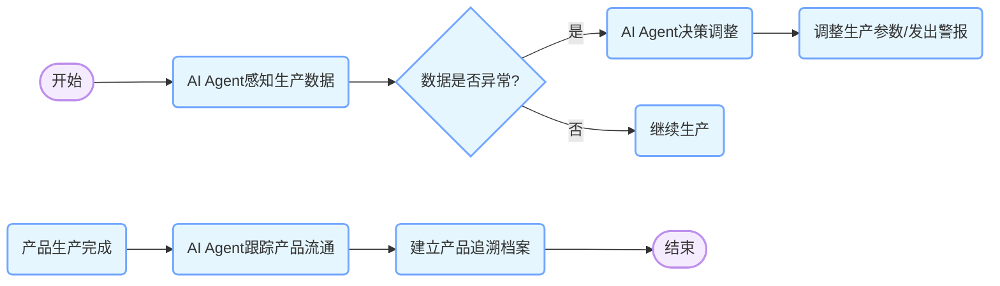

# AI Agent在企业质量控制与产品追溯中的应用

> 关键词：AI Agent、企业质量控制、产品追溯、人工智能、质量管理系统

> 摘要：本文深入探讨了AI Agent在企业质量控制与产品追溯领域的应用。首先介绍了相关背景知识，包括目的范围、预期读者等。接着阐述了AI Agent的核心概念及与质量控制和产品追溯的联系，详细讲解了其核心算法原理与操作步骤，并给出数学模型和公式进行说明。通过实际项目案例，展示了如何搭建开发环境、实现源代码及对代码进行解读分析。同时列举了AI Agent在企业中的实际应用场景，推荐了学习资源、开发工具框架和相关论文著作。最后总结了未来发展趋势与挑战，并对常见问题进行了解答。

## 1. 背景介绍 
### 1.1 目的和范围
在当今竞争激烈的市场环境下，企业对产品质量的要求越来越高，同时产品追溯也成为保障消费者权益和企业信誉的重要手段。AI Agent作为一种智能化的技术手段，能够为企业质量控制与产品追溯提供强大的支持。本文的目的在于详细介绍AI Agent在企业质量控制与产品追溯中的应用原理、方法和实际案例，帮助企业更好地理解和应用这一技术。范围涵盖了AI Agent的基本概念、相关算法、数学模型，以及在实际项目中的开发和应用。

### 1.2 预期读者
本文预期读者包括企业质量管理人员、产品追溯系统开发人员、人工智能技术爱好者、相关领域的研究人员以及对企业数字化转型感兴趣的人员。这些读者可以从本文中获取关于AI Agent在质量控制与产品追溯方面的专业知识和实践经验。

### 1.3 文档结构概述
本文将按照以下结构进行阐述：首先介绍背景知识，包括目的、预期读者和文档结构；接着讲解AI Agent的核心概念及其与质量控制和产品追溯的联系；然后详细介绍核心算法原理和具体操作步骤，并给出数学模型和公式；通过实际项目案例展示AI Agent的应用；列举实际应用场景；推荐相关的学习资源、开发工具框架和论文著作；最后总结未来发展趋势与挑战，解答常见问题并提供扩展阅读和参考资料。

### 1.4 术语表
#### 1.4.1 核心术语定义
- **AI Agent**：即人工智能代理，是一种能够感知环境、自主决策并采取行动以实现特定目标的智能实体。它可以根据预设的规则和学习到的知识，在不同的环境中执行任务。
- **企业质量控制**：指企业为确保产品或服务质量符合规定标准而采取的一系列措施和活动，包括质量策划、质量保证和质量改进等。
- **产品追溯**：通过记录产品从原材料采购、生产加工、流通销售到消费使用的全过程信息，实现对产品质量和流向的跟踪和查询，以便在出现质量问题时能够及时召回和处理。

#### 1.4.2 相关概念解释
- **机器学习**：是AI Agent实现智能决策的重要技术之一，它让计算机通过数据学习模式和规律，从而进行预测和决策。例如，在质量控制中，机器学习可以通过分析生产数据来预测产品质量。
- **物联网（IoT）**：是连接物理设备和传感器的网络，为AI Agent提供了丰富的环境感知数据。在产品追溯中，物联网设备可以实时采集产品的位置、状态等信息。

#### 1.4.3 缩略词列表
- **AI**：Artificial Intelligence，人工智能
- **ML**：Machine Learning，机器学习
- **IoT**：Internet of Things，物联网

## 2. 核心概念与联系 

### 2.1 AI Agent的核心概念
AI Agent是一种具有自主性、反应性、社会性和适应性的智能实体。自主性意味着它能够在没有人类干预的情况下自主决策和行动；反应性表示它可以感知环境变化并及时做出响应；社会性体现了它可以与其他Agent或人类进行交互；适应性则指它能够根据环境变化和经验学习来调整自己的行为。

### 2.2 AI Agent与企业质量控制和产品追溯的联系
在企业质量控制中，AI Agent可以通过感知生产环境中的各种数据，如设备运行状态、原材料质量等，运用机器学习算法进行实时分析和预测。当检测到质量异常时，AI Agent可以自主决策并采取相应的措施，如调整生产参数、发出警报等。在产品追溯方面，AI Agent可以跟踪产品在整个供应链中的流动，收集和整理相关信息，建立完整的产品追溯档案。当出现质量问题时，能够快速定位问题产品的来源和流向，实现精准召回。

### 2.3 文本示意图
```plaintext
企业质量控制与产品追溯系统
|-- AI Agent
|   |-- 感知模块（收集生产和供应链数据）
|   |-- 决策模块（机器学习算法分析）
|   |-- 行动模块（调整生产、发出警报、建立追溯档案）
|-- 生产环节（原材料采购、生产加工）
|-- 流通环节（仓储、运输）
|-- 销售环节（终端销售）
```

### 2.4 Mermaid流程图


## 3. 核心算法原理 & 具体操作步骤 

### 3.1 核心算法原理
在AI Agent应用于企业质量控制与产品追溯中，常用的核心算法包括机器学习算法，如决策树、神经网络等。以决策树算法为例，它是一种基于树结构进行决策的算法，通过对历史数据的学习，构建决策树模型，根据输入的特征数据进行分类和预测。

### 3.2 Python源代码详细阐述
以下是一个使用Python和Scikit-learn库实现简单决策树分类的示例代码：
```python
from sklearn.datasets import load_iris
from sklearn.model_selection import train_test_split
from sklearn.tree import DecisionTreeClassifier
from sklearn.metrics import accuracy_score

# 加载鸢尾花数据集
iris = load_iris()
X = iris.data  # 特征数据
y = iris.target  # 标签数据

# 划分训练集和测试集
X_train, X_test, y_train, y_test = train_test_split(X, y, test_size=0.2, random_state=42)

# 创建决策树分类器
clf = DecisionTreeClassifier()

# 训练模型
clf.fit(X_train, y_train)

# 进行预测
y_pred = clf.predict(X_test)

# 计算准确率
accuracy = accuracy_score(y_test, y_pred)
print(f"模型准确率: {accuracy}")
```
### 3.3 具体操作步骤
1. **数据收集**：收集企业生产和供应链中的相关数据，如生产设备的运行参数、原材料的质量指标、产品的检验结果等。
2. **数据预处理**：对收集到的数据进行清洗、转换和归一化等处理，以提高数据质量和算法的性能。
3. **模型选择**：根据问题的特点和数据的类型，选择合适的机器学习算法，如决策树、神经网络等。
4. **模型训练**：使用预处理后的数据对模型进行训练，调整模型的参数以提高预测的准确性。
5. **模型评估**：使用测试数据对训练好的模型进行评估，计算模型的准确率、召回率等指标。
6. **模型部署**：将训练好的模型部署到实际系统中，让AI Agent根据模型的预测结果进行决策和行动。

## 4. 数学模型和公式 & 详细讲解 & 举例说明 

### 4.1 决策树算法的数学模型
决策树算法的核心是信息增益，信息增益用于衡量在某个特征上进行划分后，数据集的纯度提高了多少。信息增益的计算公式如下：
$$
IG(D, A) = H(D) - \sum_{v \in Values(A)} \frac{|D^v|}{|D|} H(D^v)
$$
其中，$IG(D, A)$ 表示在数据集 $D$ 上使用特征 $A$ 进行划分的信息增益，$H(D)$ 表示数据集 $D$ 的信息熵，$Values(A)$ 表示特征 $A$ 的所有可能取值，$D^v$ 表示特征 $A$ 取值为 $v$ 时的子集，$|D|$ 和 $|D^v|$ 分别表示数据集 $D$ 和子集 $D^v$ 的样本数量。

### 4.2 信息熵的计算公式
信息熵用于衡量数据集的纯度，计算公式为：
$$
H(D) = - \sum_{k = 1}^{|Y|} p_k \log_2 p_k
$$
其中，$H(D)$ 表示数据集 $D$ 的信息熵，$|Y|$ 表示数据集 $D$ 中不同类别的数量，$p_k$ 表示第 $k$ 类样本在数据集 $D$ 中所占的比例。

### 4.3 详细讲解
信息熵的值越大，表示数据集的纯度越低，即数据越混乱；信息熵的值越小，表示数据集的纯度越高，即数据越有序。信息增益则是通过比较划分前后数据集的信息熵，来确定哪个特征对分类最有帮助。在决策树的构建过程中，每次选择信息增益最大的特征进行划分，直到满足停止条件。

### 4.4 举例说明
假设我们有一个数据集 $D$，包含 10 个样本，其中 6 个属于类别 1，4 个属于类别 2。则数据集 $D$ 的信息熵为：
$$
H(D) = - \frac{6}{10} \log_2 \frac{6}{10} - \frac{4}{10} \log_2 \frac{4}{10} \approx 0.971
$$
假设我们有一个特征 $A$，有两个取值 $A_1$ 和 $A_2$，划分后得到两个子集 $D^{A_1}$ 和 $D^{A_2}$，其中 $D^{A_1}$ 包含 4 个样本，3 个属于类别 1，1 个属于类别 2；$D^{A_2}$ 包含 6 个样本，3 个属于类别 1，3 个属于类别 2。则子集 $D^{A_1}$ 和 $D^{A_2}$ 的信息熵分别为：
$$
H(D^{A_1}) = - \frac{3}{4} \log_2 \frac{3}{4} - \frac{1}{4} \log_2 \frac{1}{4} \approx 0.811
$$
$$
H(D^{A_2}) = - \frac{3}{6} \log_2 \frac{3}{6} - \frac{3}{6} \log_2 \frac{3}{6} = 1
$$
使用特征 $A$ 进行划分的信息增益为：
$$
IG(D, A) = H(D) - \frac{4}{10} H(D^{A_1}) - \frac{6}{10} H(D^{A_2}) \approx 0.971 - \frac{4}{10} \times 0.811 - \frac{6}{10} \times 1 \approx 0.046
$$

## 5. 项目实战：代码实际案例和详细解释说明 

### 5.1  开发环境搭建
1. **安装Python**：从Python官方网站（https://www.python.org/downloads/）下载并安装Python 3.x版本。
2. **安装必要的库**：使用pip命令安装Scikit-learn、Pandas、Numpy等库，命令如下：
```sh
pip install scikit-learn pandas numpy
```
3. **选择开发工具**：可以选择PyCharm、Jupyter Notebook等开发工具。

### 5.2  源代码详细实现和代码解读
以下是一个模拟企业质量控制的项目案例，使用决策树算法预测产品是否合格：
```python
import pandas as pd
from sklearn.model_selection import train_test_split
from sklearn.tree import DecisionTreeClassifier
from sklearn.metrics import accuracy_score

# 加载数据集
data = pd.read_csv('quality_control_data.csv')

# 提取特征和标签
X = data.drop('quality', axis=1)
y = data['quality']

# 划分训练集和测试集
X_train, X_test, y_train, y_test = train_test_split(X, y, test_size=0.2, random_state=42)

# 创建决策树分类器
clf = DecisionTreeClassifier()

# 训练模型
clf.fit(X_train, y_train)

# 进行预测
y_pred = clf.predict(X_test)

# 计算准确率
accuracy = accuracy_score(y_test, y_pred)
print(f"模型准确率: {accuracy}")
```
### 代码解读：
1. **数据加载**：使用Pandas库的`read_csv`函数加载数据集，数据集文件名为`quality_control_data.csv`。
2. **特征和标签提取**：使用`drop`方法提取特征数据，`quality`列作为标签数据。
3. **数据集划分**：使用`train_test_split`函数将数据集划分为训练集和测试集，测试集占比为20%。
4. **模型创建和训练**：创建决策树分类器`DecisionTreeClassifier`，并使用训练集数据进行训练。
5. **模型预测和评估**：使用训练好的模型对测试集数据进行预测，并计算预测的准确率。

### 5.3  代码解读与分析
- **数据预处理**：在实际项目中，可能需要对数据进行更复杂的预处理，如处理缺失值、异常值等。
- **模型选择和调优**：决策树算法有一些参数可以调整，如树的深度、最小样本分割数等，可以通过网格搜索等方法进行调优。
- **模型评估**：除了准确率，还可以使用其他评估指标，如召回率、F1值等，来全面评估模型的性能。

## 6. 实际应用场景 
### 6.1 生产过程质量控制
在生产过程中，AI Agent可以实时监测生产设备的运行状态、原材料的质量指标等数据，通过机器学习算法分析数据，预测产品质量是否合格。当检测到质量异常时，AI Agent可以及时调整生产参数、发出警报，避免不合格产品的产生。

### 6.2 原材料质量追溯
AI Agent可以跟踪原材料从供应商采购到进入生产环节的全过程，记录原材料的来源、批次、质量检验结果等信息。当产品出现质量问题时，可以通过追溯原材料信息，快速定位问题的根源，采取相应的措施，如召回原材料、追究供应商责任等。

### 6.3 产品流通和销售追溯
在产品流通和销售过程中，AI Agent可以实时跟踪产品的位置、状态等信息，建立完整的产品追溯档案。消费者可以通过扫描产品二维码等方式，查询产品的生产、流通和销售信息，提高产品的透明度和可信度。

### 6.4 质量改进和决策支持
AI Agent可以对大量的质量数据进行分析和挖掘，发现质量问题的规律和趋势，为企业的质量改进和决策提供支持。例如，通过分析不同批次产品的质量数据，找出影响产品质量的关键因素，采取针对性的措施进行改进。

## 7. 工具和资源推荐
### 7.1 学习资源推荐
#### 7.1.1 书籍推荐
- 《机器学习》（周志华著）：介绍了机器学习的基本概念、算法和应用，是机器学习领域的经典教材。
- 《Python机器学习实战》（Sebastian Raschka著）：通过实际案例介绍了如何使用Python实现机器学习算法，适合初学者。
- 《人工智能：一种现代的方法》（Stuart Russell、Peter Norvig著）：全面介绍了人工智能的理论、算法和应用，是人工智能领域的权威书籍。

#### 7.1.2 在线课程
- Coursera上的“机器学习”课程（Andrew Ng教授主讲）：是一门非常经典的机器学习入门课程，介绍了机器学习的基本概念和算法。
- edX上的“人工智能基础”课程：系统介绍了人工智能的基本理论和方法。
- 中国大学MOOC上的“Python数据分析与应用”课程：介绍了如何使用Python进行数据分析和处理，对AI Agent开发有很大帮助。

#### 7.1.3 技术博客和网站
- Medium：有很多关于人工智能、机器学习的技术博客文章，涵盖了最新的研究成果和应用案例。
- Towards Data Science：专注于数据科学和机器学习领域的技术博客，提供了很多实用的教程和案例。
- Kaggle：是一个数据科学竞赛平台，上面有很多优秀的数据分析和机器学习项目，可以学习和参考。

### 7.2 开发工具框架推荐
#### 7.2.1 IDE和编辑器
- PyCharm：是一款专业的Python集成开发环境，提供了丰富的代码编辑、调试和项目管理功能。
- Jupyter Notebook：是一个交互式的编程环境，适合进行数据探索和模型开发。
- Visual Studio Code：是一款轻量级的代码编辑器，支持多种编程语言，有丰富的插件扩展。

#### 7.2.2 调试和性能分析工具
- PDB：是Python自带的调试工具，可以帮助开发者定位代码中的问题。
- cProfile：是Python的性能分析工具，可以分析代码的运行时间和函数调用情况。
- TensorBoard：是TensorFlow的可视化工具，可以用于可视化模型的训练过程和性能指标。

#### 7.2.3 相关框架和库
- Scikit-learn：是一个简单易用的机器学习库，提供了各种机器学习算法和工具，适合初学者和快速开发。
- TensorFlow：是一个开源的深度学习框架，广泛应用于图像识别、自然语言处理等领域。
- PyTorch：是另一个流行的深度学习框架，具有动态图和易于使用的特点。

### 7.3 相关论文著作推荐
#### 7.3.1 经典论文
- “A Decision-Theoretic Generalization of On-Line Learning and an Application to Boosting”（Yoav Freund、Robert E. Schapire著）：介绍了提升算法的理论和应用，是机器学习领域的经典论文。
- “ImageNet Classification with Deep Convolutional Neural Networks”（Alex Krizhevsky、Ilya Sutskever、Geoffrey E. Hinton著）：提出了AlexNet卷积神经网络，开启了深度学习在图像识别领域的应用热潮。
- “Attention Is All You Need”（Ashish Vaswani等著）：提出了Transformer模型，在自然语言处理领域取得了巨大成功。

#### 7.3.2 最新研究成果
- 关注顶级学术会议，如NeurIPS（神经信息处理系统大会）、ICML（国际机器学习会议）、CVPR（计算机视觉与模式识别会议）等，这些会议上会发布很多最新的研究成果。
- 查阅学术期刊，如Journal of Artificial Intelligence Research（JAIR）、Artificial Intelligence等，了解人工智能领域的最新研究动态。

#### 7.3.3 应用案例分析
- 可以参考一些企业的技术博客和报告，了解AI Agent在实际企业中的应用案例和经验分享。例如，谷歌、微软等公司会发布一些关于人工智能应用的技术文章。

## 8. 总结：未来发展趋势与挑战
### 8.1 未来发展趋势
- **智能化程度不断提高**：AI Agent将具备更强的自主学习和决策能力，能够在复杂的环境中更好地完成质量控制和产品追溯任务。
- **与物联网深度融合**：通过与物联网设备的紧密结合，AI Agent可以获取更丰富的实时数据，实现更精准的质量控制和产品追溯。
- **跨领域应用拓展**：AI Agent将不仅仅应用于企业质量控制和产品追溯领域，还将拓展到医疗、金融、交通等更多领域。

### 8.2 挑战
- **数据隐私和安全问题**：AI Agent需要处理大量的企业和消费者数据，如何保障数据的隐私和安全是一个重要挑战。
- **算法可解释性**：一些复杂的机器学习算法，如深度学习算法，其决策过程难以解释，这在企业质量控制和产品追溯中可能会带来信任问题。
- **人才短缺**：AI Agent的开发和应用需要具备人工智能、机器学习、软件工程等多方面知识的复合型人才，目前这类人才相对短缺。

## 9. 附录：常见问题与解答
### 9.1 AI Agent在企业质量控制中的准确率如何保证？
可以通过以下方法保证AI Agent在企业质量控制中的准确率：
- 收集大量高质量的数据进行模型训练，确保数据的多样性和代表性。
- 选择合适的机器学习算法，并对算法进行调优，以提高模型的性能。
- 定期对模型进行评估和更新，根据实际情况调整模型参数。

### 9.2 AI Agent在产品追溯中的应用是否会增加企业成本？
在短期内，AI Agent在产品追溯中的应用可能会增加企业的成本，如购买物联网设备、开发追溯系统等。但从长期来看，它可以提高企业的质量控制水平，减少质量问题带来的损失，同时提高产品的透明度和可信度，增强企业的竞争力，从而带来更大的经济效益。

### 9.3 如何选择适合企业的AI Agent开发框架和工具？
选择适合企业的AI Agent开发框架和工具需要考虑以下因素：
- 企业的技术水平和开发能力：如果企业的技术人员对某种框架和工具比较熟悉，可以优先选择。
- 项目的需求和规模：如果项目规模较小，可以选择简单易用的框架和工具；如果项目规模较大，需要考虑框架和工具的性能和可扩展性。
- 社区支持和文档资源：选择社区活跃、文档丰富的框架和工具，便于开发过程中遇到问题时能够及时解决。

## 10. 扩展阅读 & 参考资料
### 10.1 扩展阅读
- 《大数据时代》（维克托·迈尔 - 舍恩伯格、肯尼斯·库克耶著）：介绍了大数据的概念、应用和影响，对理解AI Agent的数据驱动特性有帮助。
- 《失控：全人类的最终命运和结局》（凯文·凯利著）：探讨了人工智能、生物系统等领域的发展趋势和规律，具有很高的前瞻性和启发性。

### 10.2 参考资料
- 相关学术论文和研究报告，可以从学术数据库如IEEE Xplore、ACM Digital Library等获取。
- 企业的技术文档和白皮书，了解企业在AI Agent应用方面的实践经验。

作者：AI天才研究院/AI Genius Institute & 禅与计算机程序设计艺术 /Zen And The Art of Computer Programming