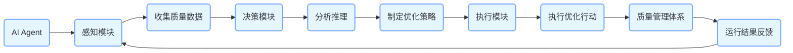

# AI Agent在企业质量管理体系优化中的应用

> 关键词：AI Agent、企业质量管理体系、优化、智能决策、质量控制

> 摘要：本文深入探讨了AI Agent在企业质量管理体系优化中的应用。首先介绍了相关背景知识，包括目的、预期读者、文档结构等内容。接着阐述了AI Agent与企业质量管理体系的核心概念及联系，详细讲解了其核心算法原理与具体操作步骤，同时给出了相应的数学模型和公式并举例说明。通过项目实战展示了AI Agent在质量管理体系优化中的代码实现和详细解读。分析了其实际应用场景，推荐了相关的工具和资源。最后总结了未来发展趋势与挑战，提供了常见问题解答和扩展阅读参考资料。旨在为企业利用AI Agent提升质量管理水平提供全面而深入的技术指导和理论支持。

## 1. 背景介绍 
### 1.1 目的和范围
在当今竞争激烈的商业环境中，企业的质量管理体系对于其生存和发展至关重要。传统的质量管理方法往往依赖于人工经验和规则，效率低下且难以应对复杂多变的生产环境和质量问题。AI Agent作为一种智能的自主系统，具有学习、推理和决策的能力，能够为企业质量管理体系的优化提供新的思路和方法。

本文的目的在于深入探讨AI Agent在企业质量管理体系优化中的应用，从理论原理到实际操作，全面介绍如何利用AI Agent提高质量管理的效率和准确性，降低成本，提升企业的竞争力。范围涵盖了AI Agent的基本概念、相关算法、数学模型，以及在企业质量管理中的具体应用案例和实际场景分析。

### 1.2 预期读者
本文预期读者包括企业的质量管理人员、IT技术人员、软件开发者、质量体系咨询师以及对AI和质量管理领域感兴趣的研究人员。对于质量管理人员，本文可以帮助他们了解如何利用AI Agent改进现有的质量管理流程；对于IT技术人员和软件开发者，本文提供了具体的算法实现和代码示例，有助于他们进行相关的开发工作；对于质量体系咨询师，可以将本文的内容作为为企业提供优化建议的参考；对于研究人员，本文的理论分析和应用案例可以为他们的研究提供新的视角和思路。

### 1.3 文档结构概述
本文将按照以下结构进行组织：
- 核心概念与联系：介绍AI Agent和企业质量管理体系的核心概念，以及它们之间的联系，并通过文本示意图和Mermaid流程图进行展示。
- 核心算法原理 & 具体操作步骤：详细讲解AI Agent在质量管理体系优化中所涉及的核心算法原理，并给出Python源代码示例和具体操作步骤。
- 数学模型和公式 & 详细讲解 & 举例说明：建立相关的数学模型，给出数学公式，并通过具体例子进行详细讲解。
- 项目实战：代码实际案例和详细解释说明：通过一个实际项目案例，展示如何搭建开发环境，实现AI Agent在质量管理体系优化中的源代码，并对代码进行详细解读和分析。
- 实际应用场景：分析AI Agent在企业质量管理体系中的实际应用场景。
- 工具和资源推荐：推荐相关的学习资源、开发工具框架和论文著作。
- 总结：未来发展趋势与挑战：总结AI Agent在企业质量管理体系优化中的应用现状，分析未来的发展趋势和面临的挑战。
- 附录：常见问题与解答：解答读者在阅读和实践过程中可能遇到的常见问题。
- 扩展阅读 & 参考资料：提供相关的扩展阅读材料和参考资料。

### 1.4 术语表
#### 1.4.1 核心术语定义
- **AI Agent（人工智能智能体）**：是一种能够感知环境、根据感知信息进行决策并执行相应动作的智能系统。它可以通过学习和推理不断优化自己的行为，以实现特定的目标。
- **企业质量管理体系**：是企业为了实现质量目标而建立的一系列相互关联和相互作用的要素，包括质量方针、质量目标、质量策划、质量控制、质量保证和质量改进等活动。
- **质量控制**：是质量管理的一部分，致力于满足质量要求。通过采取一系列的措施和方法，对产品或服务的质量进行监控和调整，确保其符合规定的标准。
- **智能决策**：是指利用人工智能技术，对大量的数据进行分析和处理，以做出最优的决策。在质量管理中，智能决策可以帮助企业快速准确地识别质量问题，并采取有效的措施进行解决。

#### 1.4.2 相关概念解释
- **机器学习**：是AI Agent实现学习能力的重要手段，它通过对大量数据的学习和分析，自动发现数据中的规律和模式，并利用这些规律和模式进行预测和决策。
- **深度学习**：是机器学习的一个分支，它通过构建深度神经网络，模拟人类大脑的神经元结构和工作方式，能够处理复杂的非线性问题，在图像识别、语音识别等领域取得了显著的成果。
- **强化学习**：是一种通过智能体与环境进行交互，根据环境反馈的奖励信号来学习最优策略的机器学习方法。在质量管理中，强化学习可以用于优化质量控制策略。

#### 1.4.3 缩略词列表
- **AI**：Artificial Intelligence（人工智能）
- **ML**：Machine Learning（机器学习）
- **DL**：Deep Learning（深度学习）
- **RL**：Reinforcement Learning（强化学习）
- **QMS**：Quality Management System（质量管理体系）

## 2. 核心概念与联系 
### 2.1 AI Agent核心概念
AI Agent是一个具有自主性、反应性、社会性和学习性的智能实体。自主性意味着它能够在没有人类干预的情况下独立地完成任务；反应性表示它能够感知环境的变化，并及时做出相应的反应；社会性体现为它可以与其他智能体或人类进行交互和协作；学习性则是指它能够通过不断地学习和经验积累来改进自己的性能。

AI Agent通常由感知模块、决策模块和执行模块组成。感知模块负责收集环境信息，决策模块根据感知到的信息进行推理和决策，执行模块则将决策结果转化为具体的动作。

### 2.2 企业质量管理体系核心概念
企业质量管理体系是企业管理的重要组成部分，它是一个系统性的框架，旨在确保企业的产品或服务满足客户的需求和期望。质量管理体系包括质量方针、质量目标、质量策划、质量控制、质量保证和质量改进等要素。

质量方针是企业在质量方面的宗旨和方向，质量目标是质量方针的具体体现。质量策划是为了实现质量目标而制定的计划和措施，质量控制是对产品或服务的质量进行监控和调整的过程，质量保证是为了提供足够的信任，表明企业的产品或服务能够满足规定的质量要求，质量改进则是不断提高质量管理体系有效性和效率的活动。

### 2.3 核心概念联系的文本示意图
AI Agent与企业质量管理体系的联系可以通过以下文本示意图来表示：

AI Agent通过感知模块收集企业质量管理体系中的各种数据，如产品质量数据、生产过程数据、客户反馈数据等。决策模块利用这些数据进行分析和推理，制定出优化质量管理体系的策略和方案。执行模块将这些策略和方案转化为具体的行动，如调整生产参数、改进工艺流程、加强质量检验等。同时，质量管理体系的运行结果又会反馈给AI Agent，AI Agent根据反馈信息不断学习和调整自己的决策，形成一个闭环的优化过程。

### 2.4 Mermaid流程图


## 3. 核心算法原理 & 具体操作步骤 
### 3.1 核心算法原理
在AI Agent应用于企业质量管理体系优化中，常用的算法包括机器学习算法和强化学习算法。

#### 3.1.1 机器学习算法
以决策树算法为例，决策树是一种基于树结构进行决策的机器学习算法。它通过对训练数据的学习，构建一个决策树模型，每个内部节点表示一个属性上的测试，每个分支表示一个测试输出，每个叶节点表示一个类别或值。

在质量管理中，决策树可以用于分类和预测质量问题。例如，根据产品的特征数据，预测产品是否合格；根据生产过程中的参数数据，判断是否存在质量隐患。

以下是一个简单的决策树算法的Python实现示例：
```python
from sklearn.datasets import load_iris
from sklearn.model_selection import train_test_split
from sklearn.tree import DecisionTreeClassifier
from sklearn.metrics import accuracy_score

# 加载数据集
iris = load_iris()
X = iris.data
y = iris.target

# 划分训练集和测试集
X_train, X_test, y_train, y_test = train_test_split(X, y, test_size=0.3, random_state=42)

# 创建决策树分类器
clf = DecisionTreeClassifier()

# 训练模型
clf.fit(X_train, y_train)

# 预测
y_pred = clf.predict(X_test)

# 计算准确率
accuracy = accuracy_score(y_test, y_pred)
print(f"Accuracy: {accuracy}")
```

#### 3.1.2 强化学习算法
强化学习是一种通过智能体与环境进行交互，根据环境反馈的奖励信号来学习最优策略的机器学习方法。在质量管理中，强化学习可以用于优化质量控制策略。

以Q学习算法为例，Q学习是一种无模型的强化学习算法，它通过不断更新Q值（状态-动作值）来学习最优策略。Q值表示在某个状态下采取某个动作所能获得的期望累积奖励。

以下是一个简单的Q学习算法的Python实现示例：
```python
import numpy as np

# 定义环境参数
num_states = 5
num_actions = 2
gamma = 0.9  # 折扣因子
alpha = 0.1  # 学习率

# 初始化Q表
Q = np.zeros((num_states, num_actions))

# 定义奖励函数
rewards = np.array([[0, 1], [0, 0], [1, 0], [0, 1], [1, 0]])

# 训练过程
num_episodes = 100
for episode in range(num_episodes):
    state = np.random.randint(0, num_states)
    done = False
    while not done:
        # 选择动作
        action = np.argmax(Q[state, :])
        
        # 执行动作，获取下一个状态和奖励
        next_state = np.random.randint(0, num_states)
        reward = rewards[state, action]
        
        # 更新Q值
        Q[state, action] = Q[state, action] + alpha * (reward + gamma * np.max(Q[next_state, :]) - Q[state, action])
        
        # 判断是否结束
        if next_state == num_states - 1:
            done = True
        else:
            state = next_state

print("Final Q table:")
print(Q)
```

### 3.2 具体操作步骤
#### 3.2.1 数据收集与预处理
首先，需要收集企业质量管理体系中的各种数据，包括产品质量数据、生产过程数据、客户反馈数据等。然后，对收集到的数据进行预处理，包括数据清洗、数据归一化、特征选择等操作，以提高数据的质量和可用性。

#### 3.2.2 模型选择与训练
根据具体的质量管理问题，选择合适的AI算法模型，如决策树、神经网络、Q学习等。使用预处理后的数据对模型进行训练，调整模型的参数，以提高模型的性能。

#### 3.2.3 策略制定与优化
根据训练好的模型，制定质量管理的策略和方案。例如，根据决策树模型的预测结果，制定质量控制的规则；根据强化学习模型的最优策略，调整生产过程中的参数。同时，不断根据实际运行结果对策略进行优化。

#### 3.2.4 系统集成与部署
将训练好的AI Agent模型集成到企业的质量管理系统中，并进行部署。确保AI Agent能够与现有的质量管理系统进行有效的交互和协作，实现质量管理的自动化和智能化。

#### 3.2.5 监控与评估
对AI Agent在质量管理体系中的运行情况进行监控和评估。收集运行数据，分析AI Agent的性能和效果，及时发现问题并进行调整和改进。

## 4. 数学模型和公式 & 详细讲解 & 举例说明 
### 4.1 决策树算法的数学模型和公式
#### 4.1.1 信息熵
信息熵是衡量数据不确定性的一个指标，其计算公式为：
$$H(X)=-\sum_{i=1}^{n}p(x_i)\log_2p(x_i)$$
其中，$X$ 是一个随机变量，$p(x_i)$ 是 $X$ 取值为 $x_i$ 的概率，$n$ 是 $X$ 可能取值的个数。

信息熵越大，数据的不确定性就越大；信息熵越小，数据的确定性就越大。

#### 4.1.2 信息增益
信息增益是指在使用某个属性进行划分后，数据的信息熵减少的程度。其计算公式为：
$$IG(D,A)=H(D)-\sum_{v\in V(A)}\frac{|D^v|}{|D|}H(D^v)$$
其中，$D$ 是数据集，$A$ 是属性，$V(A)$ 是属性 $A$ 的取值集合，$D^v$ 是 $D$ 中属性 $A$ 取值为 $v$ 的子集，$|D|$ 和 $|D^v|$ 分别表示数据集 $D$ 和子集 $D^v$ 的样本数量。

信息增益越大，说明使用该属性进行划分能够更好地降低数据的不确定性，即该属性对分类的贡献越大。

#### 4.1.3 举例说明
假设有一个数据集 $D$，包含 10 个样本，分为两类（正类和负类），其中正类有 6 个样本，负类有 4 个样本。则数据集 $D$ 的信息熵为：
$$H(D)=-\frac{6}{10}\log_2\frac{6}{10}-\frac{4}{10}\log_2\frac{4}{10}\approx0.971$$

假设有一个属性 $A$，其取值为 $a_1$ 和 $a_2$，$D$ 中属性 $A$ 取值为 $a_1$ 的子集 $D^{a_1}$ 有 4 个样本，其中正类有 3 个，负类有 1 个；属性 $A$ 取值为 $a_2$ 的子集 $D^{a_2}$ 有 6 个样本，其中正类有 3 个，负类有 3 个。则子集 $D^{a_1}$ 和 $D^{a_2}$ 的信息熵分别为：
$$H(D^{a_1})=-\frac{3}{4}\log_2\frac{3}{4}-\frac{1}{4}\log_2\frac{1}{4}\approx0.811$$
$$H(D^{a_2})=-\frac{3}{6}\log_2\frac{3}{6}-\frac{3}{6}\log_2\frac{3}{6}=1$$

使用属性 $A$ 进行划分后的信息增益为：
$$IG(D,A)=H(D)-\frac{4}{10}H(D^{a_1})-\frac{6}{10}H(D^{a_2})\approx0.971-\frac{4}{10}\times0.811-\frac{6}{10}\times1\approx0.046$$

### 4.2 Q学习算法的数学模型和公式
#### 4.2.1 Q值更新公式
Q学习算法通过不断更新Q值来学习最优策略，其Q值更新公式为：
$$Q(s,a)=Q(s,a)+\alpha[r+\gamma\max_{a'}Q(s',a')-Q(s,a)]$$
其中，$Q(s,a)$ 表示在状态 $s$ 下采取动作 $a$ 的Q值，$\alpha$ 是学习率，$r$ 是执行动作 $a$ 后获得的奖励，$\gamma$ 是折扣因子，$s'$ 是执行动作 $a$ 后转移到的下一个状态，$\max_{a'}Q(s',a')$ 表示在下一个状态 $s'$ 下采取最优动作所能获得的最大Q值。

#### 4.2.2 举例说明
假设有一个简单的环境，状态集合 $S=\{s_1,s_2,s_3\}$，动作集合 $A=\{a_1,a_2\}$，初始Q表如下：
| 状态 | $a_1$ | $a_2$ |
| --- | --- | --- |
| $s_1$ | 0 | 0 |
| $s_2$ | 0 | 0 |
| $s_3$ | 0 | 0 |

假设当前状态 $s=s_1$，选择动作 $a=a_1$，执行动作后获得奖励 $r=1$，转移到下一个状态 $s'=s_2$。学习率 $\alpha = 0.1$，折扣因子 $\gamma = 0.9$。

根据Q值更新公式，更新 $Q(s_1,a_1)$ 的值：
$$Q(s_1,a_1)=Q(s_1,a_1)+\alpha[r+\gamma\max_{a'}