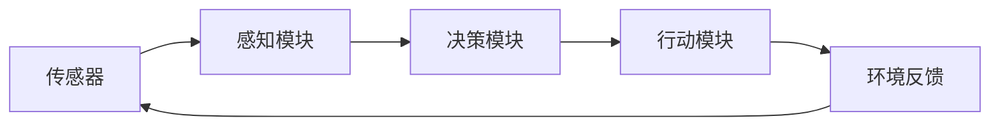

# AI Agent在动物保护中的应用：行为分析与栖息地管理

> 关键词：AI Agent、动物保护、行为分析、栖息地管理、人工智能

> 摘要：本文聚焦于AI Agent在动物保护领域的应用，尤其是在动物行为分析和栖息地管理方面。首先介绍了相关背景知识，包括目的、预期读者、文档结构和术语表。接着阐述了AI Agent的核心概念及其与动物保护的联系，并给出了原理和架构的文本示意图与Mermaid流程图。详细讲解了核心算法原理，使用Python源代码进行了说明，同时介绍了相关的数学模型和公式。通过项目实战展示了如何在实际中应用AI Agent进行动物保护，包括开发环境搭建、源代码实现和代码解读。还探讨了AI Agent在动物保护中的实际应用场景，推荐了学习资源、开发工具框架和相关论文著作。最后总结了未来发展趋势与挑战，并提供了常见问题解答和扩展阅读参考资料。

## 1. 背景介绍 
### 1.1 目的和范围
随着全球生物多样性面临的威胁日益加剧，动物保护成为了至关重要的议题。AI Agent作为人工智能领域的重要技术，为动物保护提供了新的手段和方法。本文的目的在于深入探讨AI Agent在动物保护中的具体应用，特别是在动物行为分析和栖息地管理方面。通过对AI Agent技术的介绍和实际案例的分析，帮助读者了解如何利用该技术来提高动物保护的效率和效果。文章的范围涵盖了AI Agent的基本概念、核心算法、数学模型，以及在实际项目中的应用和相关工具资源的推荐。

### 1.2 预期读者
本文的预期读者包括动物保护领域的研究人员、从业者，人工智能领域的开发者和研究人员，以及对动物保护和人工智能交叉领域感兴趣的学生和爱好者。对于动物保护工作者，本文可以提供新的技术思路和方法；对于人工智能开发者，本文展示了AI Agent在实际应用中的场景和挑战；对于学生和爱好者，本文可以作为了解这一交叉领域的入门资料。

### 1.3 文档结构概述
本文按照以下结构进行组织：首先介绍背景知识，包括目的、预期读者、文档结构和术语表；接着阐述AI Agent的核心概念及其与动物保护的联系；然后详细讲解核心算法原理和具体操作步骤，同时介绍相关的数学模型和公式；通过项目实战展示AI Agent在动物保护中的应用；探讨实际应用场景；推荐学习资源、开发工具框架和相关论文著作；最后总结未来发展趋势与挑战，提供常见问题解答和扩展阅读参考资料。

### 1.4 术语表
#### 1.4.1 核心术语定义
- **AI Agent**：人工智能代理，是一种能够感知环境、根据内部状态和目标进行决策，并执行相应动作的软件实体。它可以自主地与环境进行交互，以实现特定的目标。
- **动物行为分析**：对动物的各种行为模式、活动规律、社交互动等进行观察、记录和分析的过程，旨在了解动物的生活习性、需求和健康状况。
- **栖息地管理**：对动物生存和繁衍的自然环境进行规划、保护和改善的一系列措施，包括栖息地的监测、评估、修复和保护等。

#### 1.4.2 相关概念解释
- **机器学习**：是一门多领域交叉学科，涉及概率论、统计学、逼近论、凸分析、算法复杂度理论等多门学科。它专门研究计算机怎样模拟或实现人类的学习行为，以获取新的知识或技能，重新组织已有的知识结构使之不断改善自身的性能。
- **计算机视觉**：是一门研究如何使机器“看”的科学，更进一步的说，就是指用摄影机和电脑代替人眼对目标进行识别、跟踪和测量等机器视觉，并进一步做图形处理，使电脑处理成为更适合人眼观察或传送给仪器检测的图像。在动物保护中，计算机视觉可用于识别动物个体、监测动物行为等。

#### 1.4.3 缩略词列表
- **AI**：Artificial Intelligence，人工智能
- **ML**：Machine Learning，机器学习
- **CV**：Computer Vision，计算机视觉

## 2. 核心概念与联系 

### 核心概念原理
AI Agent的核心原理基于感知 - 决策 - 行动的循环。它通过传感器感知环境信息，将这些信息输入到决策模块中。决策模块根据预设的目标和内部状态，运用算法进行推理和计算，生成相应的决策。最后，行动模块根据决策执行相应的动作，对环境产生影响。在动物保护中，AI Agent可以利用各种传感器（如摄像头、麦克风、传感器网络等）收集动物的行为数据和栖息地的环境数据，然后通过数据分析和决策算法，为动物保护提供决策支持，例如判断动物是否处于危险状态、栖息地是否需要改善等。

### 架构的文本示意图
```plaintext
+----------------+       +-----------------+       +----------------+
|    传感器     | ----> |    感知模块     | ----> |    决策模块    |
+----------------+       +-----------------+       +----------------+
                                                         |
                                                         v
                                                   +----------------+
                                                   |    行动模块    |
                                                   +----------------+
                                                         |
                                                         v
                                                   +----------------+
                                                   |    环境反馈    |
                                                   +----------------+
                                                         |
                                                         v
                                                   +----------------+
                                                   |    传感器     |
                                                   +----------------+
```

### Mermaid流程图


## 3. 核心算法原理 & 具体操作步骤 

### 核心算法原理
在动物行为分析和栖息地管理中，常用的核心算法包括机器学习算法和深度学习算法。以动物行为识别为例，我们可以使用卷积神经网络（Convolutional Neural Network, CNN）来对动物的图像或视频进行分类和识别。CNN是一种专门用于处理具有网格结构数据（如图像）的深度学习模型，它通过卷积层、池化层和全连接层的组合，自动提取图像的特征，并进行分类。

### Python源代码详细阐述
以下是一个使用Python和Keras库实现简单CNN模型进行动物图像分类的示例代码：

```python
import numpy as np
from keras.models import Sequential
from keras.layers import Conv2D, MaxPooling2D, Flatten, Dense
from keras.preprocessing.image import ImageDataGenerator

# 定义CNN模型
model = Sequential()

# 添加卷积层
model.add(Conv2D(32, (3, 3), activation='relu', input_shape=(150, 150, 3)))
model.add(MaxPooling2D(pool_size=(2, 2)))

model.add(Conv2D(64, (3, 3), activation='relu'))
model.add(MaxPooling2D(pool_size=(2, 2)))

model.add(Conv2D(128, (3, 3), activation='relu'))
model.add(MaxPooling2D(pool_size=(2, 2)))

# 展平层
model.add(Flatten())

# 全连接层
model.add(Dense(128, activation='relu'))
model.add(Dense(1, activation='sigmoid'))

# 编译模型
model.compile(optimizer='adam', loss='binary_crossentropy', metrics=['accuracy'])

# 数据预处理
train_datagen = ImageDataGenerator(rescale=1./255, shear_range=0.2, zoom_range=0.2, horizontal_flip=True)
test_datagen = ImageDataGenerator(rescale=1./255)

train_generator = train_datagen.flow_from_directory('train_data', target_size=(150, 150), batch_size=32, class_mode='binary')
test_generator = test_datagen.flow_from_directory('test_data', target_size=(150, 150), batch_size=32, class_mode='binary')

# 训练模型
model.fit_generator(train_generator, steps_per_epoch=train_generator.samples // 32, epochs=10, validation_data=test_generator, validation_steps=test_generator.samples // 32)

# 评估模型
loss, accuracy = model.evaluate_generator(test_generator, steps=test_generator.samples // 32)
print(f"Test loss: {loss}, Test accuracy: {accuracy}")
```

### 具体操作步骤
1. **数据收集**：收集动物的图像或视频数据，将其分为训练集和测试集。
2. **数据预处理**：对收集到的数据进行预处理，包括图像的缩放、归一化、增强等操作，以提高模型的泛化能力。
3. **模型定义**：使用Keras库定义CNN模型的结构，包括卷积层、池化层、全连接层等。
4. **模型编译**：选择合适的优化器、损失函数和评估指标，对模型进行编译。
5. **模型训练**：使用训练集对模型进行训练，设置训练的轮数和批次大小。
6. **模型评估**：使用测试集对训练好的模型进行评估，计算模型的损失和准确率。

## 4. 数学模型和公式 & 详细讲解 & 举例说明 

### 卷积操作的数学模型
卷积操作是CNN的核心操作之一，它通过卷积核与输入图像进行卷积运算，提取图像的特征。设输入图像为 $X \in \mathbb{R}^{H \times W \times C}$，其中 $H$ 是图像的高度，$W$ 是图像的宽度，$C$ 是图像的通道数。卷积核为 $K \in \mathbb{R}^{h \times w \times C}$，其中 $h$ 和 $w$ 分别是卷积核的高度和宽度。卷积操作的输出特征图 $Y \in \mathbb{R}^{H' \times W' \times C'}$ 可以通过以下公式计算：

$$
Y_{i,j,k} = \sum_{m=0}^{h-1} \sum_{n=0}^{w-1} \sum_{c=0}^{C-1} K_{m,n,c} \cdot X_{i+m,j+n,c} + b_k
$$

其中，$i = 0, 1, \cdots, H' - 1$，$j = 0, 1, \cdots, W' - 1$，$k = 0, 1, \cdots, C' - 1$，$b_k$ 是偏置项。

### 举例说明
假设输入图像是一个 $3 \times 3$ 的灰度图像 $X$：

$$
X = \begin{bmatrix}
1 & 2 & 3 \\
4 & 5 & 6 \\
7 & 8 & 9
\end{bmatrix}
$$

卷积核是一个 $2 \times 2$ 的矩阵 $K$：

$$
K = \begin{bmatrix}
1 & 0 \\
0 & 1
\end{bmatrix}
$$

卷积操作的步长为 1，不使用填充。则卷积操作的输出特征图 $Y$ 可以通过以下计算得到：

$$
Y_{0,0} = K_{0,0} \cdot X_{0,0} + K_{0,1} \cdot X_{0,1} + K_{1,0} \cdot X_{1,0} + K_{1,1} \cdot X_{1,1} = 1 \cdot 1 + 0 \cdot 2 + 0 \cdot 4 + 1 \cdot 5 = 6
$$

$$
Y_{0,1} = K_{0,0} \cdot X_{0,1} + K_{0,1} \cdot X_{0,2} + K_{1,0} \cdot X_{1,1} + K_{1,1} \cdot X_{1,2} = 1 \cdot 2 + 0 \cdot 3 + 0 \cdot 5 + 1 \cdot 6 = 8
$$

$$
Y_{1,0} = K_{0,0} \cdot X_{1,0} + K_{0,1} \cdot X_{1,1} + K_{1,0} \cdot X_{2,0} + K_{1,1} \cdot X_{2,1} = 1 \cdot 4 + 0 \cdot 5 + 0 \cdot 7 + 1 \cdot 8 = 12
$$

$$
Y_{1,1} = K_{0,0} \cdot X_{1,1} + K_{0,1} \cdot X_{1,2} + K_{1,0} \cdot X_{2,1} + K_{1,1} \cdot X_{2,2} = 1 \cdot 5 + 0 \cdot 6 + 0 \cdot 8 + 1 \cdot 9 = 14
$$

因此，输出特征图 $Y$ 为：

$$
Y = \begin{bmatrix}
6 & 8 \\
12 & 14
\end{bmatrix}
$$

### 池化操作的数学模型
池化操作通常用于减少特征图的尺寸，同时保留重要的特征信息。常见的池化操作有最大池化和平均池化。以最大池化为例，设输入特征图为 $X \in \mathbb{R}^{H \times W \times C}$，池化窗口的大小为 $h_p \times w_p$，步长为 $s$。则最大池化操作的输出特征图 $Y \in \mathbb{R}^{H' \times W' \times C}$ 可以通过以下公式计算：

$$
Y_{i,j,k} = \max_{m=0}^{h_p-1} \max_{n=0}^{w_p-1} X_{i \cdot s + m, j \cdot s + n, k}
$$

其中，$i = 0, 1, \cdots, H' - 1$，$j = 0, 1, \cdots, W' - 1$，$k = 0, 1, \cdots, C - 1$。

## 5. 项目实战：代码实际案例和详细解释说明 

### 5.1  开发环境搭建
#### 安装Python
首先，需要安装Python 3.x版本。可以从Python官方网站（https://www.python.org/downloads/）下载并安装适合自己操作系统的Python版本。

#### 安装必要的库
使用pip命令安装以下必要的库：
```sh
pip install numpy keras tensorflow opencv-python
```

#### 准备数据
收集动物的图像数据，并将其分为训练集和测试集。训练集和测试集分别放在不同的文件夹中，每个文件夹下再按照不同的类别创建子文件夹。

### 5.2  源代码详细实现和代码解读
以下是一个完整的项目代码示例，用于动物图像分类：

```python
import numpy as np
from keras.models import Sequential
from keras.layers import Conv2D, MaxPooling2D, Flatten, Dense
from keras.preprocessing.image import ImageDataGenerator
import cv2

# 定义CNN模型
def create_model():
    model = Sequential()
    model.add(Conv2D(32, (3, 3), activation='relu', input_shape=(150, 150, 3)))
    model.add(MaxPooling2D(pool_size=(2, 2)))

    model.add(Conv2D(64, (3, 3), activation='relu'))
    model.add(MaxPooling2D(pool_size=(2, 2)))

    model.add(Conv2D(128, (3, 3), activation='relu'))
    model.add(MaxPooling2D(pool_size=(2, 2)))

    model.add(Flatten())
    model.add(Dense(128, activation='relu'))
    model.add(Dense(1, activation='sigmoid'))

    model.compile(optimizer='adam', loss='binary_crossentropy', metrics=['accuracy'])
    return model

# 数据预处理
def preprocess_data():
    train_datagen = ImageDataGenerator(rescale=1./255, shear_range=0.2, zoom_range=0.2, horizontal_flip=True)
    test_datagen = ImageDataGenerator(rescale=1./255)

    train_generator = train_datagen.flow_from_directory('train_data', target_size=(150, 150), batch_size=32, class_mode='binary')
    test_generator = test_datagen.flow_from_directory('test_data', target_size=(150, 150), batch_size=32, class_mode='binary')
    return train_generator, test_generator

# 训练模型
def train_model(model, train_generator, test_generator):
    model.fit_generator(train_generator, steps_per_epoch=train_generator.samples // 32, epochs=10, validation_data=test_generator, validation_steps=test_generator.samples // 32)
    return model

# 评估模型
def evaluate_model(model, test_generator):
    loss, accuracy = model.evaluate_generator(test_generator, steps=test_generator.samples // 32)
    print(f"Test loss: {loss}, Test accuracy: {accuracy}")

# 预测新图像
def predict_image(model, image_path):
    img = cv2.imread(image_path)
    img = cv2.resize(img, (150, 150))
    img = np.expand_dims(img, axis=0)
    img = img / 255.0

    prediction = model.predict(img)
    if prediction[0][0] > 0.5:
        print("这是一只目标动物")
    else:
        print("这不是目标动物")

if __name__ == "__main__":
    # 创建模型
    model = create_model()

    # 数据预处理
    train_generator, test_generator = preprocess_data()

    # 训练模型
    model = train_model(model, train_generator, test_generator)

    # 评估模型
    evaluate_model(model, test_generator)

    # 预测新图像
    predict_image(model, 'new_image.jpg')
```

### 5.3  代码解读与分析
- **create_model函数**：定义了一个简单的CNN模型，包括卷积层、池化层、全连接层等。使用`Sequential`模型依次添加各层，并使用`compile`方法编译模型，指定优化器、损失函数和评估指标。
- **preprocess_data函数**：使用`ImageDataGenerator`对训练集和测试集的数据进行预处理，包括图像的缩放、归一化、增强等操作。使用`flow_from_directory`方法从文件夹中读取图像数据，并将其转换为适合模型输入的格式。
- **train_model函数**：使用`fit_generator`方法对模型进行训练，指定训练的轮数和批次大小。
- **evaluate_model函数**：使用`evaluate_generator`方法对训练好的模型进行评估，计算模型的损失和准确率。
- **predict_image函数**：读取一张新的图像，对其进行预处理，然后使用训练好的模型进行预测，输出预测结果。

## 6. 实际应用场景 
### 动物行为分析
- **识别动物种类**：通过对动物的图像或视频进行分析，使用AI Agent可以准确地识别动物的种类，为动物保护和监测提供基础数据。
- **监测动物活动规律**：可以实时监测动物的活动轨迹、活动时间、活动范围等信息，了解动物的生活习性和行为模式。例如，通过监测候鸟的迁徙路线和停留地点，为候鸟的保护提供决策支持。
- **分析动物社交行为**：观察动物之间的社交互动，如交配、争斗、合作等行为，有助于了解动物的社会结构和生态关系。

### 栖息地管理
- **栖息地监测**：利用传感器网络和AI Agent实时监测栖息地的环境参数，如温度、湿度、光照、水质等，及时发现栖息地的变化和异常情况。
- **栖息地评估**：通过对栖息地的生态数据进行分析，评估栖息地的质量和适宜性，为栖息地的保护和修复提供科学依据。
- **栖息地保护规划**：根据栖息地的监测和评估结果，制定合理的栖息地保护规划，包括栖息地的修复、扩建、隔离等措施。

## 7. 工具和资源推荐
### 7.1 学习资源推荐
#### 7.1.1 书籍推荐
- 《深度学习》（Deep Learning）：由Ian Goodfellow、Yoshua Bengio和Aaron Courville所著，是深度学习领域的经典教材，全面介绍了深度学习的基本概念、算法和应用。
- 《Python机器学习》（Python Machine Learning）：由Sebastian Raschka所著，以Python为工具，详细介绍了机器学习的各种算法和应用。
- 《计算机视觉：算法与应用》（Computer Vision: Algorithms and Applications）：由Richard Szeliski所著，系统地介绍了计算机视觉的基本算法和应用，包括图像滤波、特征提取、目标检测等。

#### 7.1.2 在线课程
- Coursera上的“深度学习专项课程”（Deep Learning Specialization）：由Andrew Ng教授授课，涵盖了深度学习的各个方面，包括神经网络、卷积神经网络、循环神经网络等。
- edX上的“人工智能导论”（Introduction to Artificial Intelligence）：由麻省理工学院（MIT）的Patrick Winston教授授课，介绍了人工智能的基本概念、算法和应用。
- Udemy上的“Python计算机视觉实战”（Python Computer Vision for Beginners）：通过实际项目，介绍了如何使用Python和OpenCV进行计算机视觉开发。

#### 7.1.3 技术博客和网站
- Medium：是一个知名的技术博客平台，上面有很多关于人工智能、机器学习、计算机视觉等领域的优秀文章。
- Towards Data Science：专注于数据科学和人工智能领域的技术博客，提供了很多实用的教程和案例分析。
- arXiv：是一个预印本服务器，上面有很多最新的学术研究论文，涵盖了人工智能、机器学习、计算机视觉等各个领域。

### 7.2 开发工具框架推荐
#### 7.2.1 IDE和编辑器
- PyCharm：是一款专门为Python开发设计的集成开发环境（IDE），提供了丰富的功能和插件，方便开发者进行代码编写、调试和管理。
- Jupyter Notebook：是一个基于Web的交互式计算环境，支持多种编程语言，特别适合进行数据探索、模型训练和可视化。
- Visual Studio Code：是一款轻量级的代码编辑器，支持多种编程语言和插件，具有良好的扩展性和用户体验。

#### 7.2.2 调试和性能分析工具
- TensorBoard：是TensorFlow的可视化工具，可以帮助开发者监控模型的训练过程、可视化模型的结构和性能指标。
- Py-Spy：是一个Python性能分析工具，可以实时监测Python程序的CPU使用率和函数调用情况，帮助开发者找出性能瓶颈。
- cProfile：是Python标准库中的一个性能分析模块，可以统计Python程序中各个函数的调用次数和执行时间，帮助开发者优化代码性能。

#### 7.2.3 相关框架和库
- TensorFlow：是一个开源的机器学习框架，由Google开发，提供了丰富的工具和库，支持各种深度学习模型的开发和训练。
- PyTorch：是一个开源的深度学习框架，由Facebook开发，具有动态图和易于使用的特点，广泛应用于学术界和工业界。
- OpenCV：是一个开源的计算机视觉库，提供了丰富的图像处理和计算机视觉算法，支持多种编程语言。

### 7.3 相关论文著作推荐
#### 7.3.1 经典论文
- “ImageNet Classification with Deep Convolutional Neural Networks”：由Alex Krizhevsky、Ilya Sutskever和Geoffrey E. Hinton发表于2012年的NeurIPS会议上，提出了AlexNet模型，开创了深度学习在计算机视觉领域的应用先河。
- “You Only Look Once: Unified, Real-Time Object Detection”：由Joseph Redmon等人发表于2016年的CVPR会议上，提出了YOLO目标检测算法，实现了实时的目标检测。
- “Long Short-Term Memory”：由Sepp Hochreiter和Jürgen Schmidhuber发表于1997年的Neural Computation期刊上，提出了长短期记忆网络（LSTM），解决了传统循环神经网络的梯度消失问题。

#### 7.3.2 最新研究成果
- 在arXiv上搜索“AI Agent in Animal Conservation”可以找到很多关于AI Agent在动物保护领域的最新研究成果。
- 关注顶级学术会议如CVPR、ICCV、NeurIPS等，这些会议上会有很多关于人工智能和动物保护交叉领域的最新研究论文。

#### 7.3.3 应用案例分析
- 一些动物保护组织的官方网站会分享他们使用AI Agent进行动物保护的实际案例和经验，例如世界自然基金会（WWF）、国际爱护动物基金会（IFAW）等。
- 相关的技术博客和论坛也会有一些开发者分享他们在动物保护项目中的应用案例和代码实现。

## 8. 总结：未来发展趋势与挑战
### 未来发展趋势
- **多模态数据融合**：未来的AI Agent将不仅利用图像和视频数据，还会融合声音、气味、传感器数据等多模态信息，更全面地了解动物的行为和栖息地环境。
- **智能决策系统**：AI Agent将与专家系统和决策支持系统相结合，实现更智能的决策，为动物保护提供更科学的建议和方案。
- **自主学习和进化**：AI Agent将具备更强的自主学习能力，能够在不断变化的环境中自动调整策略和模型，提高动物保护的效果和效率。

### 挑战
- **数据获取和标注困难**：动物行为和栖息地数据的获取需要耗费大量的时间和人力，而且数据的标注也非常困难，需要专业的知识和经验。
- **模型可解释性**：深度学习模型通常是黑盒模型，难以解释其决策过程和结果，这在动物保护领域可能会影响决策的可信度和有效性。
- **技术成本和应用门槛**：AI Agent技术的开发和应用需要一定的技术和资金投入，对于一些小型的动物保护组织来说，可能难以承担。

## 9. 附录：常见问题与解答
### 1. AI Agent在动物保护中的应用需要哪些硬件设备？
AI Agent在动物保护中的应用需要各种传感器设备，如摄像头、麦克风、温度传感器、湿度传感器等，用于收集动物的行为数据和栖息地的环境数据。此外，还需要服务器或云计算平台来进行数据处理和模型训练。

### 2. 如何提高AI Agent在动物行为分析中的准确率？
可以通过以下方法提高AI Agent在动物行为分析中的准确率：
- 收集更多的高质量数据，并进行充分的数据预处理和增强。
- 选择合适的模型和算法，并进行调优和优化。
- 采用多模态数据融合的方法，综合利用图像、视频、声音等多种信息。

### 3. AI Agent在动物保护中的应用是否会对动物造成干扰？
在设计和应用AI Agent时，需要充分考虑对动物的影响，尽量选择非侵入式的传感器和监测方法，避免对动物的正常生活造成干扰。例如，可以使用远程摄像头和传感器网络进行监测，而不是直接接触动物。

## 10. 扩展阅读 & 参考资料
### 扩展阅读
- 《人工智能时代的动物保护》：探讨了人工智能技术在动物保护领域的应用前景和挑战。
- 《动物行为学》：介绍了动物行为的基本原理和研究方法，有助于深入理解动物的行为模式。

### 参考资料
- Goodfellow, I., Bengio, Y., & Courville, A. (2016). Deep Learning. MIT Press.
- Raschka, S. (2015). Python Machine Learning. Packt Publishing.
- Szeliski, R. (2010). Computer Vision: Algorithms and Applications. Springer.

作者：AI天才研究院/AI Genius Institute & 禅与计算机程序设计艺术 /Zen And The Art of Computer Programming