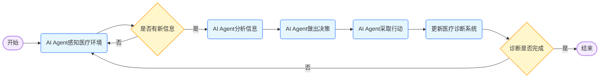

# AI Agent在医疗诊断中的应用：挑战与机遇

> 关键词：AI Agent、医疗诊断、挑战、机遇、人工智能

> 摘要：本文深入探讨了AI Agent在医疗诊断领域的应用，详细阐述了其核心概念、算法原理、数学模型等内容。通过实际案例展示了AI Agent在医疗诊断中的具体应用方式，并分析了其面临的挑战与蕴含的机遇。同时，为读者提供了学习、开发相关的工具和资源推荐，最后对未来发展趋势与挑战进行了总结。

## 1. 背景介绍 
### 1.1 目的和范围
随着人工智能技术的飞速发展，AI Agent在各个领域的应用越来越广泛，医疗诊断领域也不例外。本文旨在全面探讨AI Agent在医疗诊断中的应用，分析其带来的挑战和机遇。范围涵盖AI Agent的基本概念、在医疗诊断中的具体应用场景、相关算法原理、实际案例分析以及未来发展趋势等方面。

### 1.2 预期读者
本文预期读者包括医疗行业从业者、人工智能领域的研究人员和开发者、对医疗科技感兴趣的投资者以及相关专业的学生等。这些读者可能希望了解AI Agent在医疗诊断中的应用现状、技术细节以及未来发展方向，以便在各自的领域中做出更明智的决策。

### 1.3 文档结构概述
本文将按照以下结构进行阐述：首先介绍核心概念与联系，包括AI Agent和医疗诊断的基本概念以及它们之间的关系；接着讲解核心算法原理和具体操作步骤，并给出Python源代码示例；然后介绍数学模型和公式，并结合具体例子进行说明；之后通过项目实战展示代码实际案例并进行详细解释；再分析实际应用场景；推荐相关的工具和资源；最后总结未来发展趋势与挑战，并提供常见问题解答和扩展阅读参考资料。

### 1.4 术语表
#### 1.4.1 核心术语定义
- **AI Agent（人工智能代理）**：是一种能够感知环境、自主决策并采取行动以实现特定目标的人工智能实体。它可以根据预设的规则或通过学习不断优化自己的行为。
- **医疗诊断**：医生通过对患者的症状、体征、检查结果等信息进行综合分析，判断患者所患疾病的过程。

#### 1.4.2 相关概念解释
- **机器学习**：是一门多领域交叉学科，涉及概率论、统计学、逼近论、凸分析、算法复杂度理论等多门学科。它专门研究计算机怎样模拟或实现人类的学习行为，以获取新的知识或技能，重新组织已有的知识结构使之不断改善自身的性能。
- **深度学习**：是机器学习的一个分支领域，它是一种基于对数据进行表征学习的方法。深度学习通过构建具有很多层的神经网络模型，自动从大量数据中学习到复杂的模式和特征。

#### 1.4.3 缩略词列表
- **AI**：Artificial Intelligence，人工智能
- **ML**：Machine Learning，机器学习
- **DL**：Deep Learning，深度学习

## 2. 核心概念与联系 

### 2.1 AI Agent的概念原理
AI Agent可以看作是一个具有自主性、反应性、社会性和主动性的实体。自主性意味着它能够在没有人类直接干预的情况下运行；反应性表示它能够感知环境的变化并做出相应的反应；社会性体现了它可以与其他Agent或人类进行交互；主动性则是指它能够主动采取行动以实现目标。

AI Agent通常由感知模块、决策模块和行动模块组成。感知模块负责收集环境信息，决策模块根据感知到的信息进行推理和决策，行动模块则执行决策结果。

### 2.2 医疗诊断的概念原理
医疗诊断是一个复杂的过程，需要医生综合考虑患者的病史、症状、体征以及各种检查结果等多方面信息。医生首先通过问诊了解患者的基本情况和症状，然后进行体格检查，获取患者的体征信息。接着，可能会安排一系列的实验室检查和影像学检查，如血液检查、X光、CT等。最后，医生根据这些信息进行综合分析，做出诊断。

### 2.3 AI Agent与医疗诊断的联系
AI Agent可以在医疗诊断中发挥重要作用。它可以利用其强大的计算能力和学习能力，对大量的医疗数据进行分析和处理，辅助医生进行诊断。例如，AI Agent可以通过分析患者的病历、影像资料等，发现潜在的疾病特征和规律，为医生提供诊断建议。同时，AI Agent还可以实时监测患者的生命体征，及时发现异常情况并提醒医生。

### 2.4 文本示意图
```plaintext
          +----------------+
          |    AI Agent    |
          |----------------|
          | 感知模块       |
          | 决策模块       |
          | 行动模块       |
          +----------------+
                   |
                   | 交互
                   v
          +----------------+
          |   医疗诊断系统 |
          |----------------|
          | 患者信息输入   |
          | 检查结果输入   |
          | 诊断结果输出   |
          +----------------+
```

### 2.5 Mermaid流程图


## 3. 核心算法原理 & 具体操作步骤 

### 3.1 机器学习算法原理
在AI Agent用于医疗诊断中，常用的机器学习算法有决策树、支持向量机和神经网络等。

#### 3.1.1 决策树算法
决策树是一种基于树结构进行决策的算法。它通过对数据的特征进行划分，构建一棵决策树，每个内部节点表示一个特征上的测试，每个分支表示一个测试输出，每个叶节点表示一个类别或值。

以下是一个简单的决策树算法的Python实现：
```python
from sklearn.datasets import load_iris
from sklearn.model_selection import train_test_split
from sklearn.tree import DecisionTreeClassifier
from sklearn.metrics import accuracy_score

# 加载鸢尾花数据集
iris = load_iris()
X = iris.data
y = iris.target

# 划分训练集和测试集
X_train, X_test, y_train, y_test = train_test_split(X, y, test_size=0.3, random_state=42)

# 创建决策树分类器
clf = DecisionTreeClassifier()

# 训练模型
clf.fit(X_train, y_train)

# 预测
y_pred = clf.predict(X_test)

# 计算准确率
accuracy = accuracy_score(y_test, y_pred)
print(f"决策树模型的准确率: {accuracy}")
```

#### 3.1.2 支持向量机算法
支持向量机是一种二分类模型，它的基本思想是在特征空间中找到一个最优的超平面，使得不同类别的样本能够被最大程度地分开。

以下是一个支持向量机算法的Python实现：
```python
from sklearn.datasets import load_iris
from sklearn.model_selection import train_test_split
from sklearn.svm import SVC
from sklearn.metrics import accuracy_score

# 加载鸢尾花数据集
iris = load_iris()
X = iris.data
y = iris.target

# 划分训练集和测试集
X_train, X_test, y_train, y_test = train_test_split(X, y, test_size=0.3, random_state=42)

# 创建支持向量机分类器
clf = SVC()

# 训练模型
clf.fit(X_train, y_train)

# 预测
y_pred = clf.predict(X_test)

# 计算准确率
accuracy = accuracy_score(y_test, y_pred)
print(f"支持向量机模型的准确率: {accuracy}")
```

#### 3.1.3 神经网络算法
神经网络是一种模仿人类神经系统的计算模型，它由大量的神经元组成，通过多层神经元之间的连接和信息传递来进行学习和决策。

以下是一个简单的神经网络算法的Python实现：
```python
import tensorflow as tf
from sklearn.datasets import load_iris
from sklearn.model_selection import train_test_split
from sklearn.preprocessing import OneHotEncoder
import numpy as np

# 加载鸢尾花数据集
iris = load_iris()
X = iris.data
y = iris.target

# 对标签进行独热编码
encoder = OneHotEncoder(sparse=False)
y = encoder.fit_transform(y.reshape(-1, 1))

# 划分训练集和测试集
X_train, X_test, y_train, y_test = train_test_split(X, y, test_size=0.3, random_state=42)

# 构建神经网络模型
model = tf.keras.Sequential([
    tf.keras.layers.Dense(10, input_shape=(4,), activation='relu'),
    tf.keras.layers.Dense(3, activation='softmax')
])

# 编译模型
model.compile(optimizer='adam', loss='categorical_crossentropy', metrics=['accuracy'])

# 训练模型
model.fit(X_train, y_train, epochs=100, batch_size=16, verbose=1)

# 评估模型
_, accuracy = model.evaluate(X_test, y_test)
print(f"神经网络模型的准确率: {accuracy}")
```

### 3.2 具体操作步骤
#### 3.2.1 数据收集
收集医疗领域的相关数据，包括患者的病历、检查结果、影像资料等。数据的质量和数量对模型的性能有重要影响，因此需要确保数据的准确性和完整性。

#### 3.2.2 数据预处理
对收集到的数据进行预处理，包括数据清洗、特征提取和特征选择等。数据清洗可以去除噪声和缺失值，特征提取可以从原始数据中提取出有价值的特征，特征选择可以选择对模型性能影响较大的特征。

#### 3.2.3 模型训练
选择合适的机器学习算法，使用预处理后的数据对模型进行训练。在训练过程中，需要调整模型的参数，以提高模型的性能。

#### 3.2.4 模型评估
使用测试数据对训练好的模型进行评估，评估指标可以包括准确率、召回率、F1值等。根据评估结果，对模型进行调整和优化。

#### 3.2.5 模型部署
将训练好的模型部署到实际的医疗诊断系统中，让AI Agent能够实时处理患者的信息并提供诊断建议。

## 4. 数学模型和公式 & 详细讲解 & 举例说明 

### 4.1 决策树的数学模型和公式
决策树的构建过程通常基于信息增益或基尼不纯度等指标。

#### 4.1.1 信息增益
信息增益是衡量特征对分类结果影响程度的指标，它表示在使用某个特征进行划分后，数据集的信息熵减少的程度。信息熵的计算公式为：
$$H(X)=-\sum_{i=1}^{n}p(x_i)\log_2p(x_i)$$
其中，$X$ 是数据集，$p(x_i)$ 是数据集 $X$ 中第 $i$ 类样本的概率。

信息增益的计算公式为：
$$IG(X,A)=H(X)-H(X|A)$$
其中，$IG(X,A)$ 表示使用特征 $A$ 对数据集 $X$ 进行划分后的信息增益，$H(X|A)$ 表示在已知特征 $A$ 的条件下，数据集 $X$ 的条件熵。

例如，假设有一个数据集 $X$ 包含 10 个样本，其中 6 个属于类别 1，4 个属于类别 2。则数据集 $X$ 的信息熵为：
$$H(X)=-\frac{6}{10}\log_2\frac{6}{10}-\frac{4}{10}\log_2\frac{4}{10}\approx 0.971$$
假设我们使用特征 $A$ 对数据集 $X$ 进行划分，划分后得到两个子集 $X_1$ 和 $X_2$，$X_1$ 包含 4 个样本，其中 3 个属于类别 1，1 个属于类别 2；$X_2$ 包含 6 个样本，其中 3 个属于类别 1，3 个属于类别 2。则 $X_1$ 的信息熵为：
$$H(X_1)=-\frac{3}{4}\log_2\frac{3}{4}-\frac{1}{4}\log_2\frac{1}{4}\approx 0.811$$
$X_2$ 的信息熵为：
$$H(X_2)=-\frac{3}{6}\log_2\frac{3}{6}-\frac{3}{6}\log_2\frac{3}{6}=1$$
条件熵 $H(X|A)$ 为：
$$H(X|A)=\frac{4}{10}H(X_1)+\frac{6}{10}H(X_2)=\frac{4}{10}\times0.811+\frac{6}{10}\times1\approx 0.924$$
信息增益 $IG(X,A)$ 为：
$$IG(X,A)=H(X)-H(X|A)=0.971 - 0.924 = 0.047$$

#### 4.1.2 基尼不纯度
基尼不纯度也是衡量数据集不纯度的指标，它表示从数据集中随机选取两个样本，它们属于不同类别的概率。基尼不纯度的计算公式为：
$$Gini(X)=1-\sum_{i=1}^{n}p(x_i)^2$$
其中，$X$ 是数据集，$p(x_i)$ 是数据集 $X$ 中第 $i$ 类样本的概率。

### 4.2 支持向量机的数学模型和公式
支持向量机的目标是找到一个最优的超平面，使得不同类别的样本能够被最大程度地分开。假设我们有一个二分类问题，数据集为 $\{(x_1,y_1),(x_2,y_2),\cdots,(x_n,y_n)\}$，其中 $x_i\in\mathbb{R}^d$ 是样本特征，$y_i\in\{-1,1\}$ 是样本标签。

超平面的方程可以表示为：
$$w^Tx + b = 0$$
其中，$w\in\mathbb{R}^d$ 是超平面的法向量，$b\in\mathbb{R}$ 是偏置项。

支持向量机的优化目标是最小化以下目标函数：
$$\min_{w,b}\frac{1}{2}\|w\|^2 + C\sum_{i=1}^{n}\xi_i$$
$$s.t. y_i(w^Tx_i + b)\geq 1 - \xi_i, \xi_i\geq 0, i = 1,2,\cdots,n$$
其中，$C$ 是惩罚参数，$\xi_i$ 是松弛变量，用于处理线性不可分的情况。

### 4.3 神经网络的数学模型和公式
神经网络由多个神经元组成，每个神经元的输出可以表示为：
$$y = f(\sum_{i=1}^{n}w_ix_i + b)$$
其中，$x_i$ 是输入特征，$w_i$ 是权重，$b$ 是偏置项，$f$ 是激活函数。

常见的激活函数有 sigmoid 函数、ReLU 函数等。sigmoid 函数的计算公式为：
$$f(x)=\frac{1}{1 + e^{-x}}$$
ReLU 函数的计算公式为：
$$f(x)=\max(0,x)$$

在神经网络的训练过程中，通常使用反向传播算法来更新权重和偏置项。反向传播算法基于链式法则，通过计算损失函数对权重和偏置项的梯度，来更新它们的值。

例如，假设我们使用均方误差损失函数：
$$L=\frac{1}{2}\sum_{i=1}^{n}(y_i - \hat{y}_i)^2$$
其中，$y_i$ 是真实标签，$\hat{y}_i$ 是模型的预测输出。

通过反向传播算法，我们可以计算出损失函数对权重和偏置项的梯度，然后使用梯度下降法来更新它们的值：
$$w_{new}=w_{old}-\eta\frac{\partial L}{\partial w}$$
$$b_{new}=b_{old}-\eta\frac{\partial L}{\partial b}$$
其中，$\eta$ 是学习率。

## 5. 项目实战：代码实际案例和详细解释说明 

### 5.1  开发环境搭建
#### 5.1.1 安装Python
首先，需要安装Python环境。可以从Python官方网站（https://www.python.org/downloads/）下载适合自己操作系统的Python版本，并按照安装向导进行安装。

#### 5.1.2 安装必要的库
安装以下必要的Python库：
```bash
pip install numpy pandas scikit-learn tensorflow matplotlib
```
- `numpy`：用于数值计算。
- `pandas`：用于数据处理和分析。
- `scikit-learn`：提供了丰富的机器学习算法和工具。
- `tensorflow`：用于构建和训练神经网络模型。
- `matplotlib`：用于数据可视化。

### 5.2  源代码详细实现和代码解读
#### 5.2.1 数据加载和预处理
```python
import pandas as pd
from sklearn.preprocessing import StandardScaler
from sklearn.model_selection import train_test_split

# 加载数据集
data = pd.read_csv('medical_data.csv')

# 分离特征和标签
X = data.drop('diagnosis', axis=1)
y = data['diagnosis']

# 数据标准化
scaler = StandardScaler()
X = scaler.fit_transform(X)

# 划分训练集和测试集
X_train, X_test, y_train, y_test = train_test_split(X, y, test_size=0.2, random_state=42)
```
代码解读：
- 使用 `pandas` 库的 `read_csv` 函数加载医疗数据集。
- 使用 `drop` 方法分离特征和标签。
- 使用 `StandardScaler` 对特征数据进行标准化处理，使得数据具有零均值和单位方差。
- 使用 `train_test_split` 函数将数据集划分为训练集和测试集。

#### 5.2.2 构建和训练神经网络模型
```python
import tensorflow as tf
from tensorflow.keras.models import Sequential
from tensorflow.keras.layers import Dense

# 构建神经网络模型
model = Sequential([
    Dense(64, input_shape=(X_train.shape[1],), activation='relu'),
    Dense(32, activation='relu'),
    Dense(1, activation='sigmoid')
])

# 编译模型
model.compile(optimizer='adam', loss='binary_crossentropy', metrics=['accuracy'])

# 训练模型
history = model.fit(X_train, y_train, epochs=50, batch_size=32, validation_split=0.1)
```
代码解读：
- 使用 `Sequential` 模型构建一个简单的神经网络，包含两个隐藏层和一个输出层。
- 使用 `adam` 优化器和 `binary_crossentropy` 损失函数进行模型编译。
- 使用 `fit` 方法对模型进行训练，设置训练轮数为 50，批次大小为 32，并使用 10% 的训练数据作为验证集。

#### 5.2.3 模型评估和可视化
```python
import matplotlib.pyplot as plt

# 评估模型
_, accuracy = model.evaluate(X_test, y_test)
print(f"模型在测试集上的准确率: {accuracy}")

# 绘制训练和验证损失曲线
plt.plot(history.history['loss'], label='Training Loss')
plt.plot(history.history['val_loss'], label='Validation Loss')
plt.xlabel('Epochs')
plt.ylabel('Loss')
plt.legend()
plt.show()

# 绘制训练和验证准确率曲线
plt.plot(history.history['accuracy'], label='Training Accuracy')
plt.plot(history.history['val_accuracy'], label='Validation Accuracy')
plt.xlabel('Epochs')
plt.ylabel('Accuracy')
plt.legend()
plt.show()
```
代码解读：
- 使用 `evaluate` 方法对模型在测试集上的性能进行评估。
- 使用 `matplotlib` 库绘制训练和验证损失曲线以及训练和验证准确率曲线，以便观察模型的训练过程。

### 5.3  代码解读与分析
通过上述代码，我们完成了一个简单的医疗诊断模型的构建、训练和评估。在数据预处理阶段，我们对数据进行了标准化处理，这有助于提高模型的训练效果。在模型构建阶段，我们使用了一个简单的神经网络，包含两个隐藏层和一个输出层。在训练过程中，我们使用了 `adam` 优化器和 `binary_crossentropy` 损失函数，这是二分类问题中常用的优化器和损失函数。通过绘制训练和验证损失曲线以及训练和验证准确率曲线，我们可以观察模型的训练过程，判断模型是否过拟合或欠拟合。

## 6. 实际应用场景 
### 6.1 疾病辅助诊断
AI Agent可以分析患者的症状、病史、检查结果等信息，辅助医生进行疾病诊断。例如，在影像诊断中，AI Agent可以对X光、CT、MRI等影像进行分析，检测出病变区域，并提供可能的诊断建议。在心电图诊断中，AI Agent可以分析心电图信号，识别出心律失常等异常情况。

### 6.2 疾病预测
AI Agent可以根据患者的基因数据、生活习惯、健康状况等信息，预测患者患某种疾病的风险。例如，通过分析患者的基因数据，预测患者患癌症、心脏病等疾病的概率。医生可以根据预测结果，为患者制定个性化的预防措施和健康管理方案。

### 6.3 医疗质量评估
AI Agent可以对医疗过程和结果进行评估，帮助医院提高医疗质量。例如，AI Agent可以分析手术记录、病历等数据，评估手术的成功率、并发症发生率等指标。医院可以根据评估结果，发现医疗过程中存在的问题，并采取相应的改进措施。

### 6.4 药物研发
AI Agent可以在药物研发过程中发挥重要作用。它可以分析大量的生物数据和药物信息，筛选出有潜力的药物靶点和化合物。同时，AI Agent还可以预测药物的疗效和副作用，为药物研发提供决策支持。

## 7. 工具和资源推荐
### 7.1 学习资源推荐
#### 7.1.1 书籍推荐
- 《Python机器学习》：本书详细介绍了Python在机器学习领域的应用，包括各种机器学习算法的原理和实现。
- 《深度学习》：由深度学习领域的三位顶尖专家编写，全面介绍了深度学习的理论和实践。
- 《医疗大数据与人工智能》：结合医疗领域的实际需求，介绍了大数据和人工智能在医疗中的应用。

#### 7.1.2 在线课程
- Coursera上的“机器学习”课程：由斯坦福大学教授Andrew Ng主讲，是机器学习领域的经典课程。
- edX上的“深度学习”课程：由多家知名高校和企业联合推出，系统地介绍了深度学习的知识和技能。
- 中国大学MOOC上的“人工智能基础”课程：适合初学者入门，介绍了人工智能的基本概念和方法。

#### 7.1.3 技术博客和网站
- Medium：上面有很多关于人工智能和医疗科技的技术文章和案例分享。
- Towards Data Science：专注于数据科学和机器学习领域，提供了大量的优质文章和教程。
- AI医学社：专注于人工智能在医疗领域的应用，分享了很多最新的研究成果和行业动态。

### 7.2 开发工具框架推荐
#### 7.2.1 IDE和编辑器
- PyCharm：是一款专业的Python集成开发环境，提供了丰富的代码编辑、调试和项目管理功能。
- Jupyter Notebook：是一个交互式的开发环境，适合进行数据探索和模型实验。
- Visual Studio Code：是一款轻量级的代码编辑器，支持多种编程语言，并且有丰富的插件扩展。

#### 7.2.2 调试和性能分析工具
- TensorBoard：是TensorFlow提供的可视化工具，可以用于监控模型的训练过程、分析模型的性能等。
- Py-Spy：是一个Python性能分析工具，可以实时监测Python程序的性能瓶颈。
- Numba：是一个用于加速Python代码的工具，可以将Python代码编译成机器码，提高代码的执行效率。

#### 7.2.3 相关框架和库
- TensorFlow：是一个开源的深度学习框架，提供了丰富的工具和接口，用于构建和训练各种深度学习模型。
- PyTorch：是另一个流行的深度学习框架，具有动态图机制，易于使用和调试。
- Scikit-learn：是一个简单易用的机器学习库，提供了各种机器学习算法和工具，适合初学者和快速原型开发。

### 7.3 相关论文著作推荐
#### 7.3.1 经典论文
- “ImageNet Classification with Deep Convolutional Neural Networks”：介绍了AlexNet，开启了深度学习在计算机视觉领域的应用热潮。
- “Long Short-Term Memory”：提出了LSTM模型，解决了传统循环神经网络中的梯度消失和梯度爆炸问题。
- “Generative Adversarial Nets”：提出了生成对抗网络（GAN），为生成式模型的发展做出了重要贡献。

#### 7.3.2 最新研究成果
- 可以关注顶级学术会议如NeurIPS、ICML、CVPR等上发表的关于人工智能在医疗诊断领域的研究论文，了解最新的技术和方法。
- 一些知名学术期刊如Nature、Science、The Lancet等也会发表相关的研究成果。

#### 7.3.3 应用案例分析
- 可以查阅一些关于AI Agent在医疗诊断中的实际应用案例分析报告，了解其在实际场景中的应用效果和挑战。例如，一些医院或科研机构发布的关于AI辅助诊断系统的应用报告。

## 8. 总结：未来发展趋势与挑战
### 8.1 未来发展趋势
#### 8.1.1 多模态数据融合
未来，AI Agent将能够融合更多模态的数据，如文本、图像、音频、视频等，进行更全面的医疗诊断。例如，结合患者的病历文本、影像资料和语音描述，提高诊断的准确性。

#### 8.1.2 个性化医疗
AI Agent将根据患者的个体差异，如基因数据、生活习惯、健康状况等，提供个性化的医疗诊断和治疗方案。这将有助于提高治疗效果，减少副作用。

#### 8.1.3 与物联网结合
AI Agent将与物联网技术相结合，实现对患者的实时监测和远程医疗。例如，通过可穿戴设备收集患者的生命体征数据，AI Agent可以实时分析数据，及时发现异常情况并提醒医生。

#### 8.1.4 智能医疗机器人
未来，智能医疗机器人将得到更广泛的应用。AI Agent可以控制医疗机器人进行手术、护理等操作，提高医疗服务的效率和质量。

### 8.2 挑战
#### 8.2.1 数据隐私和安全
医疗数据包含大量的个人隐私信息，如何保障数据的隐私和安全是一个重要的挑战。在使用AI Agent进行医疗诊断时，需要采取有效的数据加密、访问控制等措施，防止数据泄露。

#### 8.2.2 模型可解释性
目前，许多深度学习模型是黑盒模型，难以解释其决策过程。在医疗诊断中，医生和患者需要了解模型的决策依据，因此提高模型的可解释性是一个亟待解决的问题。

#### 8.2.3 法律法规和伦理问题
AI Agent在医疗诊断中的应用涉及到许多法律法规和伦理问题，如医疗责任界定、数据使用合规性等。需要建立相应的法律法规和伦理准则，规范AI Agent的应用。

#### 8.2.4 专业人才短缺
AI Agent在医疗诊断中的应用需要既懂人工智能又懂医学的复合型人才。目前，这类专业人才短缺，限制了AI Agent在医疗领域的发展。

## 9. 附录：常见问题与解答
### 9.1 AI Agent在医疗诊断中的准确性如何保证？
可以通过以下方法保证AI Agent在医疗诊断中的准确性：
- 使用高质量、大规模的医疗数据进行模型训练。
- 采用合适的机器学习算法和模型架构，并进行充分的调优。
- 对模型进行严格的评估和验证，使用多种评估指标来衡量模型的性能。
- 结合医生的专业知识和经验，对AI Agent的诊断结果进行综合判断。

### 9.2 AI Agent能否完全替代医生进行医疗诊断？
目前，AI Agent还不能完全替代医生进行医疗诊断。虽然AI Agent在某些方面具有优势，如处理大量数据、发现潜在模式等，但医疗诊断是一个复杂的过程，需要医生的临床经验、人文关怀和综合判断能力。AI Agent可以作为医生的辅助工具，帮助医生提高诊断效率和准确性。

### 9.3 如何解决AI Agent在医疗诊断中的数据隐私和安全问题？
可以采取以下措施解决数据隐私和安全问题：
- 对医疗数据进行加密处理，确保数据在传输和存储过程中的安全性。
- 建立严格的访问控制机制，只有授权人员才能访问医疗数据。
- 采用匿名化和脱敏技术，去除数据中的个人敏感信息。
- 遵守相关的法律法规和行业标准，确保数据的合法使用。

### 9.4 AI Agent在医疗诊断中的应用面临哪些伦理问题？
AI Agent在医疗诊断中的应用面临以下伦理问题：
- 医疗责任界定：当AI Agent的诊断结果出现错误时，责任应由谁承担。
- 数据使用合规性：如何确保医疗数据的收集、使用和共享符合伦理和法律要求。
- 公平性和可及性：如何确保AI Agent的应用不会加剧医疗资源分配的不公平。
- 患者自主权：如何保障患者对AI Agent诊断结果的知情权和选择权。

## 10. 扩展阅读 & 参考资料
### 10.1 扩展阅读
- 《人工智能时代的医疗革命》：深入探讨了人工智能在医疗领域的应用和发展趋势。
- 《医疗人工智能：技术与应用》：详细介绍了医疗人工智能的技术原理和实际应用案例。
- 《智能医疗：AI重塑医疗未来》：阐述了AI Agent在医疗领域的应用前景和挑战。

### 10.2 参考资料
- 相关学术论文和研究报告。
- 医疗行业的标准和规范。
- 人工智能和机器学习领域的开源代码和文档。

作者：AI天才研究院/AI Genius Institute & 禅与计算机程序设计艺术 /Zen And The Art of Computer Programming