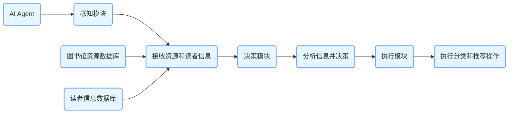

# AI Agent在图书馆管理中的应用：资源分类与推荐

> 关键词：AI Agent、图书馆管理、资源分类、资源推荐、智能系统

> 摘要：本文深入探讨了AI Agent在图书馆管理中资源分类与推荐方面的应用。首先介绍了相关背景，包括目的、预期读者等内容。接着阐述了AI Agent、资源分类与推荐的核心概念及它们之间的联系，并给出了原理和架构的示意图与流程图。详细讲解了核心算法原理，用Python代码进行具体说明，同时给出了相关数学模型和公式并举例。通过项目实战，展示了开发环境搭建、源代码实现及解读。分析了实际应用场景，推荐了学习资源、开发工具框架和相关论文著作。最后总结了未来发展趋势与挑战，还提供了常见问题解答和扩展阅读参考资料，旨在为图书馆利用AI Agent提升管理效率和服务质量提供全面的技术指导。

## 1. 背景介绍 
### 1.1 目的和范围
在当今数字化时代，图书馆的资源数量呈爆炸式增长，包括纸质书籍、电子图书、期刊、数据库等多种类型。传统的图书馆管理方式在资源分类和推荐方面面临着巨大的挑战，效率低下且难以满足读者个性化的需求。本文章的目的在于探讨如何利用AI Agent技术来优化图书馆的资源分类和推荐系统，提高图书馆管理的效率和服务质量。

文章的范围涵盖了AI Agent的基本概念、核心算法原理、在图书馆资源分类与推荐中的具体应用步骤、实际案例分析以及相关工具和资源的推荐等方面。通过对这些内容的详细阐述，为图书馆管理人员、技术开发者以及相关研究人员提供全面的技术指导和参考。

### 1.2 预期读者
本文的预期读者主要包括以下几类人群：
1. **图书馆管理人员**：希望通过引入新技术提升图书馆管理水平和服务质量，了解如何利用AI Agent优化资源分类和推荐系统。
2. **技术开发者**：对AI Agent技术在图书馆领域的应用感兴趣，想要学习相关算法和开发实现的具体步骤。
3. **研究人员**：从事图书馆学、人工智能等相关领域的研究，关注AI Agent在图书馆管理中的应用现状和未来发展趋势。
4. **图书馆用户**：了解图书馆如何利用先进技术为自己提供更精准的资源推荐，提高获取信息的效率。

### 1.3 文档结构概述
本文将按照以下结构进行组织：
1. **背景介绍**：阐述文章的目的、范围、预期读者和文档结构概述，并给出相关术语的定义和解释。
2. **核心概念与联系**：介绍AI Agent、资源分类与推荐的核心概念，以及它们之间的联系，同时给出原理和架构的示意图与流程图。
3. **核心算法原理 & 具体操作步骤**：详细讲解用于资源分类和推荐的核心算法原理，并用Python代码进行具体说明。
4. **数学模型和公式 & 详细讲解 & 举例说明**：给出相关的数学模型和公式，并进行详细讲解和举例说明。
5. **项目实战：代码实际案例和详细解释说明**：通过实际项目案例，展示开发环境搭建、源代码实现及代码解读。
6. **实际应用场景**：分析AI Agent在图书馆资源分类与推荐中的实际应用场景。
7. **工具和资源推荐**：推荐学习资源、开发工具框架和相关论文著作。
8. **总结：未来发展趋势与挑战**：总结AI Agent在图书馆管理中应用的未来发展趋势和面临的挑战。
9. **附录：常见问题与解答**：解答读者在阅读过程中可能遇到的常见问题。
10. **扩展阅读 & 参考资料**：提供相关的扩展阅读材料和参考资料。

### 1.4 术语表
#### 1.4.1 核心术语定义
- **AI Agent（人工智能代理）**：是一种能够感知环境、自主决策并采取行动以实现特定目标的智能实体。在图书馆管理中，AI Agent可以通过分析图书馆资源和读者行为数据，完成资源分类和推荐等任务。
- **资源分类**：将图书馆的各种资源按照一定的规则和标准进行划分和归类，以便于管理和检索。
- **资源推荐**：根据读者的兴趣、历史借阅记录等信息，为读者推荐符合其需求的图书馆资源。
- **机器学习**：是一门多领域交叉学科，涉及概率论、统计学、逼近论、凸分析、算法复杂度理论等多门学科。它专门研究计算机怎样模拟或实现人类的学习行为，以获取新的知识或技能，重新组织已有的知识结构使之不断改善自身的性能。
- **深度学习**：是机器学习的一个分支领域，它是一种基于对数据进行表征学习的方法。深度学习通过构建具有很多层的神经网络模型，自动从大量数据中学习特征和模式。

#### 1.4.2 相关概念解释
- **本体论**：在图书馆领域，本体论用于定义图书馆资源的概念、属性和关系，为资源分类提供语义基础。
- **协同过滤**：是一种常用的推荐算法，通过分析用户之间的相似性或物品之间的相似性来进行推荐。
- **内容推荐**：根据资源的内容特征，如主题、关键词等，为用户推荐相关的资源。

#### 1.4.3 缩略词列表
- **AI**：Artificial Intelligence，人工智能
- **ML**：Machine Learning，机器学习
- **DL**：Deep Learning，深度学习
- **CF**：Collaborative Filtering，协同过滤

## 2. 核心概念与联系 
### 核心概念原理
#### AI Agent
AI Agent是一个具有感知、决策和行动能力的智能实体。在图书馆管理中，AI Agent可以通过多种传感器（如网络接口、数据库接口等）感知图书馆的资源信息和读者的行为信息。它内部包含决策模块，根据预设的规则或通过机器学习算法对感知到的信息进行分析和处理，做出资源分类和推荐的决策。最后，AI Agent通过执行器（如更新数据库、向读者推送信息等）采取相应的行动。

#### 资源分类
资源分类是将图书馆的各种资源按照一定的标准和规则进行划分和归类的过程。常见的分类标准包括学科领域、文献类型、出版时间等。资源分类的目的是为了方便图书馆管理人员对资源进行管理和维护，同时也便于读者快速找到自己需要的资源。

#### 资源推荐
资源推荐是根据读者的兴趣、历史借阅记录、搜索行为等信息，为读者推荐符合其需求的图书馆资源。资源推荐的方法主要包括协同过滤推荐、内容推荐、基于知识的推荐等。通过资源推荐，可以提高读者发现感兴趣资源的效率，提升图书馆的服务质量。

### 架构的文本示意图
```plaintext
+---------------------+
|      AI Agent       |
| +-----------------+ |
| | 感知模块        | |
| | 接收资源和读者信息 | |
| +-----------------+ |
| +-----------------+ |
| | 决策模块        | |
| | 分析信息并决策  | |
| +-----------------+ |
| +-----------------+ |
| | 执行模块        | |
| | 执行分类和推荐操作 | |
| +-----------------+ |
+---------------------+
         |
         |
+---------------------+
| 图书馆资源数据库    |
| 存储各种资源信息    |
+---------------------+
         |
         |
+---------------------+
| 读者信息数据库      |
| 存储读者行为信息    |
+---------------------+
```

### Mermaid流程图


## 3. 核心算法原理 & 具体操作步骤 
### 资源分类算法原理 - 朴素贝叶斯分类器
朴素贝叶斯分类器是一种基于贝叶斯定理的简单概率分类器，它假设特征之间相互独立。在图书馆资源分类中，可以将资源的关键词、主题等作为特征，通过训练朴素贝叶斯分类器来对资源进行分类。

#### Python代码实现
```python
import numpy as np
from sklearn.feature_extraction.text import CountVectorizer
from sklearn.naive_bayes import MultinomialNB

# 示例数据
documents = [
    "This is a book about computer science",
    "A novel about love and adventure",
    "A research paper on artificial intelligence",
    "A cookbook with delicious recipes"
]
labels = ["Computer Science", "Literature", "Artificial Intelligence", "Cooking"]

# 特征提取
vectorizer = CountVectorizer()
X = vectorizer.fit_transform(documents)

# 训练模型
clf = MultinomialNB()
clf.fit(X, labels)

# 测试数据
test_document = ["A new book on machine learning"]
test_X = vectorizer.transform(test_document)

# 预测分类
predicted_label = clf.predict(test_X)
print("Predicted label:", predicted_label[0])
```
#### 代码解释
1. **数据准备**：定义了一个包含多个文档的列表`documents`和对应的分类标签列表`labels`。
2. **特征提取**：使用`CountVectorizer`将文档转换为词频向量。
3. **模型训练**：使用`MultinomialNB`训练朴素贝叶斯分类器。
4. **预测**：对测试文档进行特征提取，并使用训练好的模型进行预测。

### 资源推荐算法原理 - 基于用户的协同过滤
基于用户的协同过滤算法通过计算用户之间的相似度，找到与目标用户相似的用户，然后根据相似用户的借阅记录为目标用户推荐资源。

#### Python代码实现
```python
import numpy as np

# 用户借阅记录矩阵
user_item_matrix = np.array([
    [1, 1, 0, 0],
    [1, 0, 1, 0],
    [0, 1, 1, 0],
    [0, 0, 1, 1]
])

# 计算用户之间的相似度（余弦相似度）
def cosine_similarity(user1, user2):
    dot_product = np.dot(user1, user2)
    norm_user1 = np.linalg.norm(user1)
    norm_user2 = np.linalg.norm(user2)
    return dot_product / (norm_user1 * norm_user2)

# 目标用户
target_user = 0

# 计算目标用户与其他用户的相似度
similarities = []
for i in range(len(user_item_matrix)):
    if i!= target_user:
        similarity = cosine_similarity(user_item_matrix[target_user], user_item_matrix[i])
        similarities.append((i, similarity))

# 按相似度排序
similarities.sort(key=lambda x: x[1], reverse=True)

# 选择最相似的用户
top_similar_users = [user[0] for user in similarities[:2]]

# 推荐资源
recommended_items = []
for item in range(len(user_item_matrix[0])):
    if user_item_matrix[target_user][item] == 0:
        for similar_user in top_similar_users:
            if user_item_matrix[similar_user][item] == 1:
                recommended_items.append(item)
                break

print("Recommended items:", recommended_items)
```
#### 代码解释
1. **数据准备**：定义了一个用户借阅记录矩阵`user_item_matrix`，其中每行表示一个用户，每列表示一个资源，1表示借阅过，0表示未借阅过。
2. **相似度计算**：使用余弦相似度计算目标用户与其他用户之间的相似度。
3. **选择相似用户**：选择与目标用户最相似的几个用户。
4. **推荐资源**：对于目标用户未借阅过的资源，如果相似用户借阅过，则将该资源推荐给目标用户。

## 4. 数学模型和公式 & 详细讲解 & 举例说明 
### 朴素贝叶斯分类器的数学模型和公式
#### 贝叶斯定理
贝叶斯定理是朴素贝叶斯分类器的基础，其公式为：
$$P(C|X)=\frac{P(X|C)P(C)}{P(X)}$$
其中，$P(C|X)$ 表示在特征 $X$ 出现的条件下类别 $C$ 发生的概率，$P(X|C)$ 表示在类别 $C$ 发生的条件下特征 $X$ 出现的概率，$P(C)$ 表示类别 $C$ 发生的先验概率，$P(X)$ 表示特征 $X$ 出现的概率。

#### 朴素贝叶斯分类器的假设
朴素贝叶斯分类器假设特征之间相互独立，即：
$$P(X|C)=\prod_{i=1}^{n}P(x_i|C)$$
其中，$X=(x_1,x_2,\cdots,x_n)$ 是特征向量。

#### 分类决策规则
朴素贝叶斯分类器的分类决策规则是选择后验概率最大的类别作为预测结果，即：
$$\hat{C}=\arg\max_{C}P(C|X)=\arg\max_{C}\frac{P(X|C)P(C)}{P(X)}=\arg\max_{C}P(X|C)P(C)$$

#### 举例说明
假设有三个类别 $C_1$、$C_2$、$C_3$，特征向量 $X=(x_1,x_2)$。已知：
- $P(C_1)=0.3$，$P(C_2)=0.5$，$P(C_3)=0.2$
- $P(x_1|C_1)=0.2$，$P(x_2|C_1)=0.3$
- $P(x_1|C_2)=0.4$，$P(x_2|C_2)=0.6$
- $P(x_1|C_3)=0.1$，$P(x_2|C_3)=0.7$

首先计算 $P(X|C_i)P(C_i)$ ：
- $P(X|C_1)P(C_1)=P(x_1|C_1)P(x_2|C_1)P(C_1)=0.2\times0.3\times0.3 = 0.018$
- $P(X|C_2)P(C_2)=P(x_1|C_2)P(x_2|C_2)P(C_2)=0.4\times0.6\times0.5 = 0.12$
- $P(X|C_3)P(C_3)=P(x_1|C_3)P(x_2|C_3)P(C_3)=0.1\times0.7\times0.2 = 0.014$

然后根据分类决策规则，选择后验概率最大的类别，即 $\hat{C}=C_2$。

### 基于用户的协同过滤的数学模型和公式
#### 余弦相似度
余弦相似度用于计算两个向量之间的相似度，其公式为：
$$\text{sim}(u,v)=\frac{\mathbf{u}\cdot\mathbf{v}}{\|\mathbf{u}\|\|\mathbf{v}\|}$$
其中，$\mathbf{u}$ 和 $\mathbf{v}$ 是两个用户的借阅记录向量，$\cdot$ 表示向量的点积，$\|\cdot\|$ 表示向量的模。

#### 推荐得分计算
对于目标用户 $u$ 和资源 $i$，推荐得分的计算公式为：
$$\text{score}(u,i)=\sum_{v\in N(u)} \text{sim}(u,v)r_{v,i}$$
其中，$N(u)$ 是与目标用户 $u$ 最相似的用户集合，$r_{v,i}$ 表示用户 $v$ 对资源 $i$ 的评分（在借阅记录中可以用 1 表示借阅过，0 表示未借阅过）。

#### 举例说明
假设有三个用户 $u_1$、$u_2$、$u_3$，四个资源 $i_1$、$i_2$、$i_3$、$i_4$，用户借阅记录矩阵如下：
$$
\begin{bmatrix}
1 & 1 & 0 & 0 \\
1 & 0 & 1 & 0 \\
0 & 1 & 1 & 0
\end{bmatrix}
$$
目标用户为 $u_1$，计算 $u_1$ 与 $u_2$、$u_3$ 的余弦相似度：
- $\mathbf{u}_1=(1,1,0,0)$，$\mathbf{u}_2=(1,0,1,0)$，$\mathbf{u}_3=(0,1,1,0)$
- $\text{sim}(u_1,u_2)=\frac{\mathbf{u}_1\cdot\mathbf{u}_2}{\|\mathbf{u}_1\|\|\mathbf{u}_2\|}=\frac{1\times1 + 1\times0 + 0\times1 + 0\times0}{\sqrt{1^2 + 1^2}\sqrt{1^2 + 0^2 + 1^2 + 0^2}}=\frac{1}{\sqrt{2}\sqrt{2}} = 0.5$
- $\text{sim}(u_1,u_3)=\frac{\mathbf{u}_1\cdot\mathbf{u}_3}{\|\mathbf{u}_1\|\|\mathbf{u}_3\|}=\frac{1\times0 + 1\times1 + 0\times1 + 0\times0}{\sqrt{1^2 + 1^2}\sqrt{0^2 + 1^2 + 1^2 + 0^2}}=\frac{1}{\sqrt{2}\sqrt{2}} = 0.5$

选择与 $u_1$ 最相似的用户 $u_2$ 和 $u_3$，对于资源 $i_3$，$u_1$ 未借阅过，$u_2$ 和 $u_3$ 都借阅过，推荐得分：
$$\text{score}(u_1,i_3)=\text{sim}(u_1,u_2)r_{u_2,i_3}+\text{sim}(u_1,u_3)r_{u_3,i_3}=0.5\times1 + 0.5\times1 = 1$$

## 5. 项目实战：代码实际案例和详细解释说明 
### 5.1  开发环境搭建
#### 操作系统
可以选择Windows、Linux（如Ubuntu）或macOS等常见的操作系统。本项目推荐使用Ubuntu 20.04 LTS，因为它是一个开源的、稳定的操作系统，并且对Python开发有很好的支持。

#### Python环境
安装Python 3.8或更高版本。可以通过以下命令在Ubuntu上安装Python 3.8：
```bash
sudo apt update
sudo apt install python3.8
```

#### 虚拟环境
为了避免不同项目之间的依赖冲突，建议使用虚拟环境。可以使用`venv`模块创建虚拟环境：
```bash
python3.8 -m venv library_ai_agent_env
source library_ai_agent_env/bin/activate
```

#### 依赖库安装
安装项目所需的依赖库，包括`scikit-learn`、`numpy`等：
```bash
pip install scikit-learn numpy
```

### 5.2  源代码详细实现和代码解读
#### 资源分类模块
```python
import numpy as np
from sklearn.feature_extraction.text import TfidfVectorizer
from sklearn.naive_bayes import MultinomialNB

# 加载数据集
def load_dataset():
    # 这里可以从文件或数据库中加载实际的图书馆资源数据
    documents = [
        "This is a book about computer programming",
        "A novel about historical events",
        "A research paper on data mining",
        "A cookbook with Italian recipes"
    ]
    labels = ["Computer Science", "Literature", "Data Science", "Cooking"]
    return documents, labels

# 特征提取
def extract_features(documents):
    vectorizer = TfidfVectorizer()
    X = vectorizer.fit_transform(documents)
    return X, vectorizer

# 训练模型
def train_model(X, labels):
    clf = MultinomialNB()
    clf.fit(X, labels)
    return clf

# 预测分类
def predict_category(clf, vectorizer, new_document):
    new_X = vectorizer.transform([new_document])
    predicted_label = clf.predict(new_X)
    return predicted_label[0]

# 主函数
if __name__ == "__main__":
    documents, labels = load_dataset()
    X, vectorizer = extract_features(documents)
    clf = train_model(X, labels)
    new_document = "A new book on machine learning"
    category = predict_category(clf, vectorizer, new_document)
    print("Predicted category:", category)
```
#### 代码解读
1. **加载数据集**：`load_dataset`函数用于加载图书馆资源数据和对应的分类标签。在实际应用中，可以从文件或数据库中加载真实的数据。
2. **特征提取**：`extract_features`函数使用`TfidfVectorizer`将文档转换为TF-IDF向量，TF-IDF可以反映一个词在文档中的重要程度。
3. **训练模型**：`train_model`函数使用`MultinomialNB`训练朴素贝叶斯分类器。
4. **预测分类**：`predict_category`函数对新的文档进行特征提取，并使用训练好的模型进行预测。

#### 资源推荐模块
```python
import numpy as np

# 用户借阅记录矩阵
user_item_matrix = np.array([
    [1, 1, 0, 0],
    [1, 0, 1, 0],
    [0, 1, 1, 0],
    [0, 0, 1, 1]
])

# 计算用户之间的相似度（余弦相似度）
def cosine_similarity(user1, user2):
    dot_product = np.dot(user1, user2)
    norm_user1 = np.linalg.norm(user1)
    norm_user2 = np.linalg.norm(user2)
    return dot_product / (norm_user1 * norm_user2)

# 推荐资源
def recommend_resources(target_user, user_item_matrix, top_n=2):
    # 计算目标用户与其他用户的相似度
    similarities = []
    for i in range(len(user_item_matrix)):
        if i!= target_user:
            similarity = cosine_similarity(user_item_matrix[target_user], user_item_matrix[i])
            similarities.append((i, similarity))

    # 按相似度排序
    similarities.sort(key=lambda x: x[1], reverse=True)

    # 选择最相似的用户
    top_similar_users = [user[0] for user in similarities[:top_n]]

    # 推荐资源
    recommended_items = []
    for item in range(len(user_item_matrix[0])):
        if user_item_matrix[target_user][item] == 0:
            for similar_user in top_similar_users:
                if user_item_matrix[similar_user][item] == 1:
                    recommended_items.append(item)
                    break

    return recommended_items

# 主函数
if __name__ == "__main__":
    target_user = 0
    recommended_items = recommend_resources(target_user, user_item_matrix)
    print("Recommended items:", recommended_items)
```
#### 代码解读
1. **用户借阅记录矩阵**：`user_item_matrix`表示用户的借阅记录，每行表示一个用户，每列表示一个资源。
2. **相似度计算**：`cosine_similarity`函数计算两个用户之间的余弦相似度。
3. **推荐资源**：`recommend_resources`函数根据用户之间的相似度，为目标用户推荐未借阅过的资源。

### 5.3  代码解读与分析
#### 资源分类模块
- **优点**：朴素贝叶斯分类器简单易懂，训练速度快，对于文本分类任务有较好的效果。TF-IDF特征提取可以有效地反映文档的特征。
- **缺点**：朴素贝叶斯分类器假设特征之间相互独立，在实际应用中可能不成立。对于一些复杂的文本分类任务，可能需要更复杂的模型。

#### 资源推荐模块
- **优点**：基于用户的协同过滤算法简单直观，易于实现。可以根据用户的历史行为进行个性化推荐。
- **缺点**：数据稀疏性问题可能会影响推荐效果，当用户的借阅记录较少时，相似度计算可能不准确。同时，该算法的可扩展性较差，当用户和资源数量增加时，计算复杂度会显著提高。

## 6. 实际应用场景 
### 资源分类场景
#### 新书入库分类
当图书馆有新书入库时，AI Agent可以自动对新书进行分类。通过提取新书的标题、摘要、关键词等信息，使用训练好的分类模型对新书进行分类，将其归入相应的类别中，方便图书馆管理人员进行上架和管理。

#### 数字资源分类
随着图书馆数字化资源的不断增加，如电子图书、期刊、数据库等，AI Agent可以对这些数字资源进行分类。通过对数字资源的元数据进行分析，如主题、作者、出版时间等，将数字资源分类到不同的学科领域或资源类型中，提高数字资源的检索效率。

#### 资源整合与清理
图书馆在长期的运营过程中，可能会积累大量的资源，其中可能存在一些重复、过时或错误分类的资源。AI Agent可以对图书馆的资源进行整合和清理，通过分类算法识别出重复的资源，将其进行合并或删除；对于过时的资源，可以将其标记为历史资源；对于错误分类的资源，进行重新分类。

### 资源推荐场景
#### 读者登录推荐
当读者登录图书馆系统时，AI Agent可以根据读者的历史借阅记录、搜索记录等信息，为读者推荐符合其兴趣的资源。例如，读者之前借阅过关于计算机编程的书籍，AI Agent可以推荐最新的计算机编程书籍、相关的研究论文等。

#### 资源浏览推荐
当读者在图书馆系统中浏览资源时，AI Agent可以根据读者当前浏览的资源，推荐与之相关的其他资源。例如，读者正在浏览一本关于人工智能的书籍，AI Agent可以推荐关于机器学习、深度学习等相关领域的书籍和论文。

#### 个性化推送
AI Agent可以定期为读者推送个性化的资源推荐信息。通过分析读者的兴趣和行为模式，为读者定制专属的资源推荐列表，并通过邮件、短信或图书馆系统的消息通知等方式推送给读者。

## 7. 工具和资源推荐
### 7.1 学习资源推荐
#### 7.1.1 书籍推荐
- 《机器学习》（周志华著）：这本书是机器学习领域的经典教材，全面介绍了机器学习的基本概念、算法和应用，对于理解AI Agent中使用的机器学习算法有很大的帮助。
- 《Python机器学习实战》（Sebastian Raschka著）：本书通过大量的Python代码实例，详细介绍了如何使用Python实现各种机器学习算法，适合初学者快速上手。
- 《人工智能：一种现代的方法》（Stuart Russell和Peter Norvig著）：这是人工智能领域的权威教材，涵盖了人工智能的各个方面，包括搜索算法、知识表示、机器学习、自然语言处理等，对于深入理解AI Agent的原理和应用有重要的参考价值。

#### 7.1.2 在线课程
- Coursera上的“机器学习”课程（Andrew Ng教授主讲）：这是一门非常经典的机器学习课程，通过视频讲解、编程作业和测验等方式，系统地介绍了机器学习的基本概念和算法。
- edX上的“人工智能基础”课程：该课程由麻省理工学院（MIT）的教授主讲，涵盖了人工智能的基础知识、搜索算法、知识表示、机器学习等内容。
- 中国大学MOOC上的“Python语言程序设计”课程：适合初学者学习Python编程语言，为后续使用Python实现AI Agent的相关算法打下基础。

#### 7.1.3 技术博客和网站
- Medium：这是一个技术博客平台，上面有很多关于人工智能、机器学习、深度学习等领域的优质文章，可以及时了解最新的技术动态和研究成果。
- arXiv：这是一个预印本论文库，提供了大量的计算机科学、物理学、数学等领域的研究论文，可以获取最新的学术研究成果。
- 开源中国：这是一个国内的技术社区，上面有很多关于软件开发、人工智能等领域的技术文章和项目分享，可以学习到实际的开发经验和技巧。

### 7.2 开发工具框架推荐
#### 7.2.1 IDE和编辑器
- PyCharm：这是一款专门为Python开发设计的集成开发环境（IDE），具有代码自动补全、调试、版本控制等功能，提高开发效率。
- Jupyter Notebook：这是一个交互式的开发环境，适合进行数据探索、模型训练和可视化等工作。可以在浏览器中编写和运行Python代码，并实时查看代码的执行结果。
- Visual Studio Code：这是一款轻量级的代码编辑器，支持多种编程语言，具有丰富的插件生态系统，可以通过安装Python相关的插件来进行Python开发。

#### 7.2.2 调试和性能分析工具
- pdb：这是Python自带的调试器，可以在代码中设置断点，逐行执行代码，查看变量的值，帮助定位和解决代码中的问题。
- cProfile：这是Python的性能分析工具，可以统计代码中各个函数的执行时间和调用次数，帮助找出代码中的性能瓶颈。
- TensorBoard：这是TensorFlow提供的可视化工具，可以用于可视化模型的训练过程、损失函数的变化、模型的结构等，方便进行模型的调试和优化。

#### 7.2.3 相关框架和库
- scikit-learn：这是一个开源的机器学习库，提供了丰富的机器学习算法和工具，如分类、回归、聚类、降维等，方便实现AI Agent中的分类和推荐算法。
- TensorFlow：这是一个开源的深度学习框架，由Google开发，广泛应用于图像识别、自然语言处理、语音识别等领域。可以用于构建和训练更复杂的深度学习模型。
- PyTorch：这是另一个开源的深度学习框架，由Facebook开发，具有动态图的特点，易于使用和调试。在学术界和工业界都有广泛的应用。

### 7.3 相关论文著作推荐
#### 7.3.1 经典论文
- “A Bayesian Approach to Relevance Feedback in Information Retrieval”（David Heckerman等著）：该论文介绍了贝叶斯方法在信息检索中的相关性反馈中的应用，对于理解朴素贝叶斯分类器在图书馆资源分类中的应用有重要的参考价值。
- “Item-based Collaborative Filtering Recommendation Algorithms”（Badrul Sarwar等著）：这篇论文提出了基于物品的协同过滤推荐算法，是协同过滤领域的经典论文之一，对于理解和实现资源推荐算法有很大的帮助。

#### 7.3.2 最新研究成果
- 可以关注每年的ACM SIGIR（国际信息检索研究与发展会议）、KDD（知识发现与数据挖掘会议）等会议上发表的论文，这些会议涵盖了信息检索、数据挖掘、机器学习等领域的最新研究成果。
- 可以在学术数据库如IEEE Xplore、ACM Digital Library等上搜索关于AI Agent在图书馆管理中的应用的最新研究论文。

#### 7.3.3 应用案例分析
- 可以参考一些图书馆管理系统的官方文档和技术博客，了解他们在实际应用中如何使用AI Agent进行资源分类和推荐。例如，国家图书馆、高校图书馆等的相关技术报告和案例分享。

## 8. 总结：未来发展趋势与挑战
### 未来发展趋势
#### 智能化程度不断提高
随着人工智能技术的不断发展，AI Agent在图书馆管理中的智能化程度将不断提高。未来的AI Agent将能够更加准确地理解读者的需求，提供更加个性化的资源分类和推荐服务。例如，通过结合自然语言处理技术，AI Agent可以理解读者的自然语言查询，提供更加精准的搜索结果和推荐资源。

#### 多模态信息处理
图书馆的资源不仅包括文本信息，还包括图像、音频、视频等多模态信息。未来的AI Agent将能够处理多模态信息，对不同类型的资源进行分类和推荐。例如，对于一本带有插图的书籍，AI Agent可以同时分析文本内容和图像信息，提供更加全面的分类和推荐服务。

#### 与其他系统的集成
AI Agent将与图书馆的其他系统进行更加紧密的集成，如馆藏管理系统、借阅系统、读者服务系统等。通过与这些系统的集成，AI Agent可以获取更多的信息，为读者提供更加便捷的服务。例如，当读者借阅一本书时，AI Agent可以根据读者的借阅记录，实时推荐相关的资源。

#### 基于知识图谱的应用
知识图谱可以将图书馆的各种资源和知识进行整合和关联，形成一个庞大的知识网络。未来的AI Agent将可以利用知识图谱进行资源分类和推荐，提供更加智能化的服务。例如，通过知识图谱，AI Agent可以发现资源之间的隐含关系，为读者推荐更加相关的资源。

### 挑战
#### 数据质量和隐私问题
AI Agent的性能和效果很大程度上依赖于数据的质量。图书馆需要确保资源数据和读者行为数据的准确性、完整性和一致性。同时，在收集和使用读者数据时，需要注意保护读者的隐私，遵守相关的法律法规。

#### 技术复杂度和可扩展性
随着图书馆资源和读者数量的不断增加，AI Agent需要处理的数据量也会越来越大。这就要求AI Agent的算法和系统具有良好的可扩展性，能够处理大规模的数据。同时，AI Agent所使用的技术也越来越复杂，需要图书馆管理人员和技术开发者具备更高的技术水平。

#### 读者接受度
读者对于AI Agent提供的服务可能存在一定的接受度问题。一些读者可能习惯于传统的图书馆服务方式，对新的技术和服务方式存在疑虑。图书馆需要加强对读者的宣传和培训，提高读者对AI Agent服务的认知和接受度。

#### 技术更新换代快
人工智能技术发展迅速，新的算法和模型不断涌现。图书馆需要及时跟进技术的发展，不断更新和优化AI Agent的算法和系统，以保持其竞争力和先进性。

## 9. 附录：常见问题与解答
### 问题1：AI Agent在图书馆管理中的应用是否会取代图书馆管理人员？
解答：不会。AI Agent在图书馆管理中的应用主要是为了提高管理效率和服务质量，辅助图书馆管理人员完成一些繁琐的工作，如资源分类和推荐等。但图书馆管理人员在读者服务、资源采购、图书馆运营等方面仍然发挥着重要的作用。例如，在与读者进行沟通、解答读者的复杂问题、组织图书馆活动等方面，图书馆管理人员的专业知识和经验是不可替代的。

### 问题2：如何确保AI Agent推荐的资源符合读者的兴趣？
解答：为了确保AI Agent推荐的资源符合读者的兴趣，可以采取以下措施：
1. **收集丰富的读者数据**：收集读者的历史借阅记录、搜索记录、收藏记录等信息，以便更全面地了解读者的兴趣。
2. **使用多种推荐算法**：结合协同过滤、内容推荐、基于知识的推荐等多种算法，从不同的角度进行推荐，提高推荐的准确性。
3. **持续优化模型**：根据读者的反馈和评价，不断调整和优化推荐模型，提高推荐的质量。
4. **个性化设置**：允许读者进行个性化设置，如设置自己的兴趣标签、排除不感兴趣的资源等，以提高推荐的针对性。

### 问题3：AI Agent在处理多语言资源时会遇到哪些问题？
解答：AI Agent在处理多语言资源时可能会遇到以下问题：
1. **语言理解问题**：不同语言的语法、词汇、语义等存在差异，AI Agent需要具备处理不同语言的能力。例如，在进行文本分类和信息提取时，需要对不同语言的文本进行正确的解析和理解。
2. **数据稀缺问题**：对于一些小语种的资源，可能存在数据稀缺的问题，导致训练模型的效果不佳。
3. **文化差异问题**：不同语言背后的文化背景不同，一些词汇和表达方式在不同文化中有不同的含义。AI Agent需要考虑这些文化差异，以避免误解和错误的推荐。

### 问题4：如何评估AI Agent在图书馆资源分类和推荐中的性能？
解答：可以从以下几个方面评估AI Agent在图书馆资源分类和推荐中的性能：
1. **分类准确率**：对于资源分类任务，可以使用分类准确率、召回率、F1值等指标来评估分类的准确性。
2. **推荐准确率**：对于资源推荐任务，可以使用准确率、召回率、平均准确率均值（MAP）、归一化折损累计增益（NDCG）等指标来评估推荐的准确性。
3. **用户满意度**：通过问卷调查、用户反馈等方式了解读者对推荐资源的满意度，评估AI Agent的服务质量。
4. **系统性能**：评估AI Agent的处理速度、响应时间、稳定性等系统性能指标，确保系统能够满足图书馆的实际需求。

## 10. 扩展阅读 & 参考资料
### 扩展阅读
- 《图书馆学概论》：可以帮助读者更深入地了解图书馆学的基本概念、理论和方法，为理解AI Agent在图书馆管理中的应用提供背景知识。
- 《信息检索导论》：介绍了信息检索的基本原理、算法和技术，对于理解图书馆资源分类和推荐中的信息处理过程有很大的帮助。
- 《深度学习实战》：深入介绍了深度学习的原理和应用，包括卷积神经网络、循环神经网络等，对于想要进一步探索使用深度学习技术改进AI Agent性能的读者有一定的参考价值。

### 参考资料
- 《图书馆自动化系统设计与实现》：提供了图书馆自动化系统的设计思路和实现方法，对于开发基于AI Agent的图书馆管理系统有一定的借鉴作用。
- 相关的学术期刊，如《中国图书馆学报》、《大学图书馆学报》等，上面发表了很多关于图书馆管理、信息技术应用等方面的研究论文，可以作为参考资料。
- 图书馆管理系统的官方文档和技术报告，如Libsys、汇文等图书馆管理系统的相关文档，了解这些系统的功能和实现方式。

作者：AI天才研究院/AI Genius Institute & 禅与计算机程序设计艺术 /Zen And The Art of Computer Programming