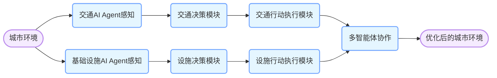

# AI Agent在城市规划中的应用：智能交通与基础设施优化

> 关键词：AI Agent、城市规划、智能交通、基础设施优化、多智能体系统

> 摘要：本文聚焦于AI Agent在城市规划中智能交通与基础设施优化方面的应用。首先介绍了相关背景知识，包括目的范围、预期读者等内容。接着详细阐述了AI Agent的核心概念及其与城市规划的联系，给出了原理和架构的文本示意图及Mermaid流程图。然后讲解了核心算法原理并结合Python源代码说明具体操作步骤，同时介绍了相关的数学模型和公式。通过项目实战，展示了AI Agent在实际应用中的代码实现和详细解读。还探讨了其实际应用场景，推荐了学习资源、开发工具框架和相关论文著作。最后总结了未来发展趋势与挑战，并提供了常见问题解答和扩展阅读参考资料，旨在为城市规划领域引入AI Agent技术提供全面的技术指导和理论支持。

## 1. 背景介绍 
### 1.1 目的和范围
随着城市化进程的加速，城市面临着交通拥堵、基础设施建设不合理等诸多问题。传统的城市规划方法在处理复杂的城市系统时逐渐显得力不从心。AI Agent作为一种具有自主决策和学习能力的智能实体，为城市规划带来了新的思路和方法。本文的目的在于探讨AI Agent如何应用于城市规划中的智能交通与基础设施优化，范围涵盖AI Agent的基本原理、算法实现、实际应用案例以及相关工具资源等方面。

### 1.2 预期读者
本文预期读者包括城市规划师、交通工程师、计算机科学家、AI研究者以及对城市智能化发展感兴趣的相关人员。城市规划师可以从中了解如何利用AI Agent技术改善城市交通和基础设施布局；计算机科学家和AI研究者可以深入研究AI Agent在城市领域的算法优化和模型构建；交通工程师则能获取关于智能交通系统设计和优化的新思路。

### 1.3 文档结构概述
本文共分为十个部分。第一部分为背景介绍，阐述了文章的目的、预期读者和文档结构。第二部分介绍AI Agent的核心概念以及与城市规划的联系。第三部分讲解核心算法原理并给出Python源代码示例。第四部分介绍相关的数学模型和公式，并举例说明。第五部分通过项目实战展示代码实现和详细解读。第六部分探讨AI Agent在城市规划中的实际应用场景。第七部分推荐学习资源、开发工具框架和相关论文著作。第八部分总结未来发展趋势与挑战。第九部分为附录，提供常见问题与解答。第十部分列出扩展阅读和参考资料。

### 1.4 术语表
#### 1.4.1 核心术语定义
- **AI Agent（人工智能智能体）**：是一种能够感知环境、自主决策并采取行动以实现特定目标的智能实体。它可以是软件程序、机器人或其他具有智能行为的系统。
- **城市规划**：是对一定时期内城市的经济和社会发展、土地利用、空间布局以及各项建设的综合部署、具体安排和实施管理。
- **智能交通**：是将先进的信息技术、数据通信传输技术、电子传感技术、控制技术及计算机技术等有效地集成运用于整个地面交通管理系统而建立的一种在大范围内、全方位发挥作用的，实时、准确、高效的综合交通运输管理系统。
- **基础设施优化**：指对城市中的交通、能源、供水、排水等基础设施进行合理规划和调整，以提高其运行效率和服务质量。
- **多智能体系统（Multi - Agent System，MAS）**：由多个AI Agent组成的系统，这些智能体之间可以相互协作、竞争或通信，以实现共同或各自的目标。

#### 1.4.2 相关概念解释
- **环境感知**：AI Agent通过各种传感器收集环境信息的过程，例如交通流量传感器可以收集道路上的车辆数量和速度信息。
- **决策制定**：AI Agent根据感知到的环境信息和自身的目标，选择合适的行动方案的过程。
- **行动执行**：AI Agent将决策制定的结果转化为实际行动的过程，例如交通信号灯根据决策调整信号时长。

#### 1.4.3 缩略词列表
- **AI**：Artificial Intelligence，人工智能
- **MAS**：Multi - Agent System，多智能体系统
- **ITS**：Intelligent Transportation System，智能交通系统

## 2. 核心概念与联系 

### 核心概念原理
AI Agent的核心原理基于感知、决策和行动三个主要环节。首先，AI Agent通过传感器感知周围环境的状态，例如在城市规划中，交通AI Agent可以感知道路上的车辆密度、速度等信息。然后，根据感知到的信息和预设的目标，AI Agent运用一定的算法进行决策，确定下一步的行动方案。最后，AI Agent将决策结果转化为实际行动，对环境产生影响。例如，智能交通信号灯Agent根据交通流量信息调整信号灯的时长，以优化交通流畅性。

在城市规划中，多个AI Agent可以组成一个多智能体系统（MAS）。每个智能体负责不同的任务或区域，它们之间通过通信机制进行信息交换和协作。例如，交通AI Agent可以与基础设施建设AI Agent进行通信，共同优化城市的交通和基础设施布局。

### 架构的文本示意图
以下是一个简单的AI Agent在城市规划中的架构文本示意图：

```plaintext
                      ┌─────────────────────┐
                      │     城市环境        │
                      │ (交通、基础设施等) │
                      └─────────────────────┘
                               │
                               ▼
┌─────────────────────┐   ┌─────────────────────┐
│  交通AI Agent       │   │  基础设施AI Agent  │
│ (感知交通信息)      │   │ (感知设施状态)     │
└─────────────────────┘   └─────────────────────┘
       │                            │
       │                            │
       ▼                            ▼
┌─────────────────────┐   ┌─────────────────────┐
│  交通决策模块       │   │  设施决策模块       │
│ (优化交通方案)      │   │ (优化设施布局)     │
└─────────────────────┘   └─────────────────────┘
       │                            │
       │                            │
       ▼                            ▼
┌─────────────────────┐   ┌─────────────────────┐
│  交通行动执行模块   │   │  设施行动执行模块   │
│ (调整信号灯等)      │   │ (规划建设等)       │
└─────────────────────┘   └─────────────────────┘
       │                            │
       │                            │
       └────────────┬──────────────┘
                    ▼
              ┌─────────────────────┐
              │    多智能体协作     │
              │ (信息交换、协作)    │
              └─────────────────────┘
```

### Mermaid流程图


这个流程图展示了AI Agent在城市规划中的工作流程。首先，交通AI Agent和基础设施AI Agent分别感知城市环境中的交通和基础设施信息。然后，各自的决策模块根据感知信息进行决策，生成行动方案。接着，行动执行模块将决策结果转化为实际行动。最后，多智能体协作模块促进不同智能体之间的信息交换和协作，以实现城市环境的优化。

## 3. 核心算法原理 & 具体操作步骤 

### 核心算法原理
在AI Agent应用于城市规划的智能交通与基础设施优化中，常用的算法包括强化学习算法和遗传算法。

#### 强化学习算法
强化学习是一种通过智能体与环境进行交互，不断尝试不同的行动并根据环境反馈的奖励信号来学习最优策略的算法。在智能交通中，交通AI Agent可以将不同的信号灯控制方案作为行动，将交通流畅度作为奖励信号。例如，当交通拥堵缓解时，给予正奖励；当交通拥堵加剧时，给予负奖励。智能体通过不断尝试不同的信号灯控制方案，学习到能够获得最大累积奖励的最优策略。

#### 遗传算法
遗传算法是一种模拟自然选择和遗传机制的优化算法。在基础设施优化中，可以将不同的基础设施布局方案看作是种群中的个体，每个个体有一个适应度值，代表该方案的优劣。通过选择、交叉和变异等操作，不断进化种群，直到找到最优的基础设施布局方案。

### 具体操作步骤及Python源代码

#### 强化学习算法示例（使用OpenAI Gym模拟交通环境）
```python
import gym
import numpy as np
import random

# 创建一个简单的交通环境（假设使用自定义的交通环境，这里以OpenAI Gym的简单环境为例）
env = gym.make('CartPole-v0')  # 这里只是示例，实际需要自定义交通环境

# 初始化Q表
state_space_size = env.observation_space.n  # 假设状态空间是离散的
action_space_size = env.action_space.n
q_table = np.zeros((state_space_size, action_space_size))

# 超参数设置
num_episodes = 1000
max_steps_per_episode = 100
learning_rate = 0.1
discount_rate = 0.99
exploration_rate = 1
max_exploration_rate = 1
min_exploration_rate = 0.01
exploration_decay_rate = 0.001

# 训练过程
for episode in range(num_episodes):
    state = env.reset()
    done = False
    for step in range(max_steps_per_episode):
        # 探索与利用平衡
        exploration_rate_threshold = random.uniform(0, 1)
        if exploration_rate_threshold > exploration_rate:
            action = np.argmax(q_table[state, :])
        else:
            action = env.action_space.sample()

        new_state, reward, done, info = env.step(action)

        # 更新Q表
        q_table[state, action] = q_table[state, action] * (1 - learning_rate) + \
                                 learning_rate * (reward + discount_rate * np.max(q_table[new_state, :]))

        state = new_state

        if done == True:
            break

    # 探索率衰减
    exploration_rate = min_exploration_rate + \
                       (max_exploration_rate - min_exploration_rate) * np.exp(-exploration_decay_rate * episode)

# 测试训练好的策略
state = env.reset()
done = False
for step in range(max_steps_per_episode):
    action = np.argmax(q_table[state, :])
    new_state, reward, done, info = env.step(action)
    state = new_state
    if done == True:
        break

env.close()
```

#### 代码解释
1. **环境初始化**：使用`gym.make`创建一个简单的环境（实际应用中需要自定义交通环境）。
2. **Q表初始化**：Q表用于存储每个状态下每个行动的价值。
3. **超参数设置**：包括训练的回合数、每回合的最大步数、学习率、折扣率、探索率等。
4. **训练过程**：在每个回合中，智能体根据探索率选择行动，与环境交互得到新的状态和奖励，并更新Q表。探索率随着回合数的增加而衰减。
5. **测试过程**：使用训练好的Q表进行测试，选择价值最大的行动。

#### 遗传算法示例（优化基础设施布局）
```python
import random

# 定义基础设施布局方案的基因长度
gene_length = 10
# 定义种群大小
population_size = 50
# 定义迭代次数
generations = 100
# 定义交叉概率和变异概率
crossover_rate = 0.8
mutation_rate = 0.01

# 初始化种群
def initialize_population():
    population = []
    for _ in range(population_size):
        individual = [random.randint(0, 1) for _ in range(gene_length)]
        population.append(individual)
    return population

# 定义适应度函数（这里简单假设适应度是基因中1的个数）
def fitness_function(individual):
    return sum(individual)

# 选择操作（轮盘赌选择）
def selection(population):
    fitness_values = [fitness_function(individual) for individual in population]
    total_fitness = sum(fitness_values)
    selection_probabilities = [fitness / total_fitness for fitness in fitness_values]
    selected_indices = random.choices(range(population_size), weights=selection_probabilities, k=2)
    return [population[i] for i in selected_indices]

# 交叉操作
def crossover(parent1, parent2):
    if random.random() < crossover_rate:
        crossover_point = random.randint(1, gene_length - 1)
        child1 = parent1[:crossover_point] + parent2[crossover_point:]
        child2 = parent2[:crossover_point] + parent1[crossover_point:]
        return child1, child2
    else:
        return parent1, parent2

# 变异操作
def mutation(individual):
    for i in range(gene_length):
        if random.random() < mutation_rate:
            individual[i] = 1 - individual[i]
    return individual

# 遗传算法主循环
population = initialize_population()
for generation in range(generations):
    new_population = []
    for _ in range(population_size // 2):
        parents = selection(population)
        child1, child2 = crossover(parents[0], parents[1])
        child1 = mutation(child1)
        child2 = mutation(child2)
        new_population.extend([child1, child2])
    population = new_population

# 找到最优个体
best_individual = max(population, key=fitness_function)
print("最优基础设施布局方案:", best_individual)
```

#### 代码解释
1. **种群初始化**：随机生成一定数量的基础设施布局方案作为初始种群。
2. **适应度函数**：定义每个方案的适应度，这里简单地将基因中1的个数作为适应度。
3. **选择操作**：使用轮盘赌选择方法选择父代个体。
4. **交叉操作**：以一定的概率对父代个体进行交叉，生成子代个体。
5. **变异操作**：以一定的概率对子代个体进行变异。
6. **遗传算法主循环**：不断进行选择、交叉和变异操作，更新种群，直到达到指定的迭代次数。
7. **找到最优个体**：从最终的种群中找到适应度最高的个体作为最优的基础设施布局方案。

## 4. 数学模型和公式 & 详细讲解 & 举例说明 

### 强化学习数学模型和公式
#### Q - learning算法公式
Q - learning是一种常用的强化学习算法，其核心是更新Q表的公式：

$$
Q(s, a) \leftarrow Q(s, a) + \alpha \left[ r + \gamma \max_{a'} Q(s', a') - Q(s, a) \right]
$$

其中：
- $Q(s, a)$ 表示在状态 $s$ 下采取行动 $a$ 的Q值。
- $\alpha$ 是学习率，控制新信息对旧Q值的更新程度。
- $r$ 是从环境中获得的即时奖励。
- $\gamma$ 是折扣率，用于权衡即时奖励和未来奖励的重要性。
- $s'$ 是采取行动 $a$ 后转移到的新状态。
- $\max_{a'} Q(s', a')$ 表示在新状态 $s'$ 下所有可能行动中最大的Q值。

#### 详细讲解
Q - learning算法的目标是通过不断与环境交互，更新Q表，使得智能体能够学习到最优的行动策略。学习率 $\alpha$ 决定了新信息对旧Q值的影响程度。如果 $\alpha$ 较大，新信息的影响就较大；如果 $\alpha$ 较小，旧Q值就更稳定。折扣率 $\gamma$ 用于权衡即时奖励和未来奖励。如果 $\gamma$ 接近1，智能体更注重未来的长期奖励；如果 $\gamma$ 接近0，智能体更注重即时奖励。

#### 举例说明
假设一个交通AI Agent在某个路口，当前状态 $s$ 是交通拥堵，行动 $a$ 是将信号灯时长调整为30秒。采取行动后，获得即时奖励 $r = -10$（表示交通状况没有改善），转移到新状态 $s'$ 仍然是交通拥堵。假设 $Q(s, a) = 20$，$\alpha = 0.1$，$\gamma = 0.9$，且 $\max_{a'} Q(s', a') = 15$。则更新后的Q值为：

$$
\begin{align*}
Q(s, a) &\leftarrow 20 + 0.1 \left[ -10 + 0.9 \times 15 - 20 \right] \\
&= 20 + 0.1 \left[ -10 + 13.5 - 20 \right] \\
&= 20 + 0.1 \times (-16.5) \\
&= 20 - 1.65 \\
&= 18.35
\end{align*}
$$

### 遗传算法数学模型和公式
#### 适应度函数
适应度函数 $f(x)$ 用于评估每个个体 $x$ 的优劣。在基础设施优化中，适应度函数可以根据具体的优化目标来定义，例如：

$$
f(x) = \sum_{i=1}^{n} w_i \cdot g_i(x)
$$

其中：
- $x$ 表示一个基础设施布局方案。
- $n$ 是评估指标的数量。
- $w_i$ 是第 $i$ 个评估指标的权重。
- $g_i(x)$ 是第 $i$ 个评估指标的得分。

#### 选择概率
在轮盘赌选择中，每个个体被选中的概率 $P(x)$ 为：

$$
P(x) = \frac{f(x)}{\sum_{j=1}^{N} f(x_j)}
$$

其中：
- $N$ 是种群的大小。
- $x_j$ 是种群中的第 $j$ 个个体。

#### 详细讲解
适应度函数是遗传算法的核心，它决定了个体的优劣和进化的方向。权重 $w_i$ 可以根据不同评估指标的重要性进行调整。轮盘赌选择方法根据个体的适应度值来确定其被选中的概率，适应度值越高的个体被选中的概率越大。

#### 举例说明
假设种群中有3个个体 $x_1$、$x_2$、$x_3$，其适应度值分别为 $f(x_1) = 20$，$f(x_2) = 30$，$f(x_3) = 50$。则每个个体被选中的概率为：

$$
\begin{align*}
P(x_1) &= \frac{20}{20 + 30 + 50} = 0.2 \\
P(x_2) &= \frac{30}{20 + 30 + 50} = 0.3 \\
P(x_3) &= \frac{50}{20 + 30 + 50} = 0.5
\end{align*}
$$

## 5. 项目实战：代码实际案例和详细解释说明 

### 5.1  开发环境搭建
#### 操作系统
可以选择Windows、Linux（如Ubuntu）或macOS等主流操作系统。

#### 编程语言和库
- **Python**：作为主要的编程语言，版本建议使用Python 3.6及以上。
- **NumPy**：用于数值计算，安装命令：`pip install numpy`
- **OpenAI Gym**：如果使用强化学习算法，需要安装OpenAI Gym库，安装命令：`pip install gym`

#### 开发工具
可以使用Visual Studio Code、PyCharm等集成开发环境（IDE）。

### 5.2  源代码详细实现和代码解读
#### 智能交通信号灯控制项目

```python
import numpy as np
import random

# 定义交通环境类
class TrafficEnvironment:
    def __init__(self):
        # 假设有4个信号灯，每个信号灯有2种状态（绿灯和红灯）
        self.num_traffic_lights = 4
        self.action_space = [i for i in range(2**self.num_traffic_lights)]
        self.state_space = [i for i in range(10)]  # 假设状态空间有10种状态
        self.reset()

    def reset(self):
        self.current_state = random.choice(self.state_space)
        return self.current_state

    def step(self, action):
        # 简单模拟交通状况的变化
        next_state = random.choice(self.state_space)
        # 简单定义奖励函数，根据状态和行动计算奖励
        if action % 2 == 0:  # 假设偶数行动有更好的交通效果
            reward = 1
        else:
            reward = -1
        done = False
        return next_state, reward, done, {}

# 定义Q - learning智能体类
class QLearningAgent:
    def __init__(self, state_space_size, action_space_size, learning_rate=0.1, discount_rate=0.99):
        self.state_space_size = state_space_size
        self.action_space_size = action_space_size
        self.learning_rate = learning_rate
        self.discount_rate = discount_rate
        self.q_table = np.zeros((state_space_size, action_space_size))

    def choose_action(self, state, exploration_rate):
        exploration_rate_threshold = random.uniform(0, 1)
        if exploration_rate_threshold > exploration_rate:
            action = np.argmax(self.q_table[state, :])
        else:
            action = random.choice(range(self.action_space_size))
        return action

    def update_q_table(self, state, action, reward, next_state):
        self.q_table[state, action] = self.q_table[state, action] * (1 - self.learning_rate) + \
                                     self.learning_rate * (reward + self.discount_rate * np.max(self.q_table[next_state, :]))

# 训练智能体
env = TrafficEnvironment()
agent = QLearningAgent(len(env.state_space), len(env.action_space))

num_episodes = 1000
max_steps_per_episode = 100
exploration_rate = 1
max_exploration_rate = 1
min_exploration_rate = 0.01
exploration_decay_rate = 0.001

for episode in range(num_episodes):
    state = env.reset()
    done = False
    for step in range(max_steps_per_episode):
        action = agent.choose_action(state, exploration_rate)
        next_state, reward, done, _ = env.step(action)
        agent.update_q_table(state, action, reward, next_state)
        state = next_state
        if done:
            break
    exploration_rate = min_exploration_rate + \
                       (max_exploration_rate - min_exploration_rate) * np.exp(-exploration_decay_rate * episode)

# 测试智能体
state = env.reset()
done = False
total_reward = 0
for step in range(max_steps_per_episode):
    action = np.argmax(agent.q_table[state, :])
    next_state, reward, done, _ = env.step(action)
    total_reward += reward
    state = next_state
    if done:
        break

print("测试总奖励:", total_reward)
```

#### 代码解读
1. **交通环境类（`TrafficEnvironment`）**：
    - `__init__` 方法：初始化交通环境，包括信号灯数量、行动空间和状态空间，并调用 `reset` 方法重置环境。
    - `reset` 方法：随机选择一个初始状态并返回。
    - `step` 方法：根据行动模拟交通状况的变化，返回下一个状态、奖励和是否结束的标志。

2. **Q - learning智能体类（`QLearningAgent`）**：
    - `__init__` 方法：初始化Q表、学习率和折扣率。
    - `choose_action` 方法：根据探索率选择行动，探索率高时随机选择行动，探索率低时选择Q值最大的行动。
    - `update_q_table` 方法：根据Q - learning公式更新Q表。

3. **训练过程**：
    - 在每个回合中，智能体与环境交互，选择行动，更新Q表。
    - 探索率随着回合数的增加而衰减。

4. **测试过程**：
    - 使用训练好的Q表选择行动，计算测试总奖励。

### 5.3  代码解读与分析
#### 优点
- **模块化设计**：代码将交通环境和智能体分别封装成类，提高了代码的可维护性和可扩展性。
- **探索与利用平衡**：使用探索率来平衡探索新行动和利用已学习到的知识，有助于智能体在训练过程中找到更优的策略。
- **Q - learning算法**：Q - learning算法简单易懂，能够有效地处理离散状态和行动空间的问题。

#### 缺点
- **简单的奖励函数**：奖励函数的定义比较简单，可能无法准确反映实际的交通状况。
- **离散状态和行动空间**：假设状态和行动空间是离散的，对于实际复杂的交通系统可能不够灵活。

#### 改进方向
- **复杂的奖励函数**：根据实际交通指标（如交通流量、平均车速等）设计更复杂的奖励函数。
- **连续状态和行动空间**：使用深度学习方法处理连续状态和行动空间的问题，如深度Q网络（DQN）。

## 6. 实际应用场景 
### 智能交通
#### 交通信号灯控制
AI Agent可以根据实时交通流量信息动态调整信号灯的时长。例如，在交通高峰期，增加主干道的绿灯时长，减少次干道的绿灯时长，以提高交通流畅性。通过多智能体协作，不同路口的信号灯可以协同工作，形成绿波带，使车辆能够更顺畅地通过多个路口。

#### 交通流量预测
AI Agent可以收集历史交通数据和实时交通信息，运用机器学习算法预测未来的交通流量。例如，在大型活动举办前，预测周边道路的交通流量，提前做好交通疏导计划。交通管理部门可以根据预测结果，合理分配警力和调整交通策略。

#### 智能公交系统
AI Agent可以优化公交路线和调度计划。根据乘客的实时需求和交通状况，动态调整公交车辆的行驶路线和发车间隔。例如，在客流高峰期增加公交车辆的投放，提高公交服务的效率和质量。同时，AI Agent还可以为乘客提供实时的公交位置和到达时间信息，方便乘客出行。

### 基础设施优化
#### 城市供水系统
AI Agent可以监测城市供水系统的压力、流量等参数，实时调整水泵的运行状态和管道的阀门开度，以实现水资源的合理分配和节能。例如，在用水高峰期增加水泵的功率，确保供水充足；在用水低谷期降低水泵的功率，减少能源消耗。

#### 城市能源系统
AI Agent可以优化城市能源的生产、传输和分配。根据不同时间段的能源需求和能源价格，合理调整发电设备的运行状态，优先使用清洁能源。例如，在太阳能充足的白天，增加太阳能发电设备的发电量；在用电高峰期，合理调度储能设备，确保能源供应的稳定性。

#### 城市建筑布局
AI Agent可以根据城市的功能需求、地形地貌等因素，优化城市建筑的布局。例如，通过模拟不同建筑布局方案对城市通风、采光等环境因素的影响，选择最优的建筑布局方案，提高城市居民的生活质量。

## 7. 工具和资源推荐
### 7.1 学习资源推荐
#### 7.1.1 书籍推荐
- 《人工智能：一种现代的方法》（Artificial Intelligence: A Modern Approach）：这是一本经典的人工智能教材，涵盖了AI的各个领域，包括搜索算法、知识表示、机器学习、自然语言处理等内容，对于理解AI Agent的基本原理和算法有很大的帮助。
- 《强化学习：原理与Python实现》：详细介绍了强化学习的基本概念、算法和应用，通过Python代码示例帮助读者理解和实现强化学习算法，对于学习AI Agent在城市规划中的应用非常有价值。
- 《遗传算法原理及应用》：系统地阐述了遗传算法的基本原理、操作方法和应用案例，对于掌握遗传算法在基础设施优化中的应用有很大的帮助。

#### 7.1.2 在线课程
- Coursera上的“人工智能基础”（Foundations of Artificial Intelligence）课程：由知名高校的教授授课，内容涵盖人工智能的基本概念、算法和应用，课程质量高，适合初学者学习。
- edX上的“强化学习”（Reinforcement Learning）课程：深入讲解强化学习的理论和实践，通过实际项目让学生掌握强化学习算法的实现和应用。
- Udemy上的“遗传算法实战”（Genetic Algorithms in Action）课程：通过实际案例介绍遗传算法的应用，帮助学生快速掌握遗传算法的编程实现。

#### 7.1.3 技术博客和网站
- Medium上的AI相关博客：有很多AI领域的专家和爱好者分享最新的研究成果和实践经验，关注一些知名的AI博主可以及时了解行业动态。
- arXiv：一个开放的预印本平台，提供了大量的AI研究论文，涵盖了各个领域的最新研究成果。
- AI Stack Exchange：一个问答社区，用户可以在这里提问、解答和讨论AI相关的问题，是学习和交流的好平台。

### 7.2 开发工具框架推荐
#### 7.2.1 IDE和编辑器
- Visual Studio Code：一款轻量级的开源代码编辑器，支持多种编程语言和插件扩展，具有丰富的代码编辑和调试功能，适合Python开发。
- PyCharm：专业的Python集成开发环境，提供了代码自动补全、调试、版本控制等功能，对于大型Python项目的开发非常方便。
- Jupyter Notebook：一种交互式的开发环境，支持Python代码的实时运行和可视化展示，适合进行数据探索和算法实验。

#### 7.2.2 调试和性能分析工具
- PDB：Python自带的调试工具，可以在代码中设置断点，逐步执行代码，查看变量的值和程序的执行流程，帮助定位和解决代码中的问题。
- cProfile：Python的性能分析工具，可以统计代码中各个函数的执行时间和调用次数，帮助优化代码的性能。
- TensorBoard：一个可视化工具，主要用于深度学习模型的训练过程监控和可视化，对于调试和优化强化学习模型非常有用。

#### 7.2.3 相关框架和库
- OpenAI Gym：一个用于开发和比较强化学习算法的工具包，提供了各种模拟环境，方便开发者测试和验证强化学习算法的性能。
- Stable Baselines：一个基于OpenAI Gym的强化学习库，提供了多种预训练的强化学习算法和模型，方便开发者快速上手和应用。
- DEAP：一个用于实现遗传算法和进化计算的Python库，提供了丰富的遗传算法操作和工具，简化了遗传算法的实现过程。

### 7.3 相关论文著作推荐
#### 7.3.1 经典论文
- “Q - learning”：由Christopher J. C. H. Watkins和Peter Dayan发表的经典论文，首次提出了Q - learning算法，是强化学习领域的重要基础。
- “Genetic algorithms in search, optimization, and machine learning”：由David E. Goldberg撰写的经典著作，系统地介绍了遗传算法的基本原理、操作方法和应用领域，对遗传算法的发展产生了深远的影响。
- “Multi - agent systems: A modern approach to distributed artificial intelligence”：介绍了多智能体系统的基本概念、理论和应用，对于理解AI Agent在城市规划中的协作机制有很大的帮助。

#### 7.3.2 最新研究成果
- 关注ACM SIGKDD、NeurIPS、ICML等顶级学术会议上关于AI Agent在城市规划领域的最新研究论文，了解该领域的前沿技术和研究动态。
- 一些知名学术期刊如《Artificial Intelligence》、《Journal of Artificial Intelligence Research》等也会发表相关的研究成果。

#### 7.3.3 应用案例分析
- 可以查阅一些城市规划领域的实际应用案例报告，了解AI Agent在智能交通和基础设施优化中的具体应用场景、实施方法和效果评估。例如，某些城市的智能交通系统建设报告、城市能源管理优化案例等。

## 8. 总结：未来发展趋势与挑战
### 未来发展趋势
#### 融合多学科技术
AI Agent在城市规划中的应用将与地理信息系统（GIS）、物联网（IoT）、大数据等多学科技术深度融合。通过GIS技术，可以更准确地分析城市的地理空间信息，为基础设施布局和交通规划提供更科学的依据。物联网技术可以实现城市中各种设备和传感器的互联互通，为AI Agent提供更丰富的实时数据。大数据技术可以对海量的城市数据进行分析和挖掘，帮助AI Agent更好地理解城市系统的运行规律。

#### 增强智能体的协作能力
未来的AI Agent将具备更强的协作能力，能够在复杂的城市环境中与其他智能体进行高效的通信和协作。例如，交通AI Agent可以与建筑规划AI Agent、能源管理AI Agent等进行协作，共同优化城市的整体布局和运行效率。多智能体系统将采用更先进的协作机制和算法，实现智能体之间的任务分配、资源共享和冲突解决。

#### 走向智能化决策
随着AI技术的不断发展，AI Agent将从单纯的信息处理和决策辅助走向智能化决策。AI Agent可以根据城市的实时状态和发展目标，自动生成最优的城市规划方案和决策建议。例如，在城市面临自然灾害或突发事件时，AI Agent可以快速分析情况，制定应急响应策略，为城市管理者提供决策支持。

### 挑战
#### 数据隐私和安全问题
AI Agent在城市规划中的应用需要大量的城市数据，包括居民的出行信息、能源消耗信息等。这些数据涉及到居民的隐私和安全问题。如何在保证数据安全和隐私的前提下，合理利用这些数据是一个亟待解决的问题。需要采用先进的加密技术、数据脱敏技术和访问控制技术来保护数据的安全和隐私。

#### 算法的可解释性和可靠性
AI Agent通常采用复杂的机器学习和深度学习算法，这些算法的决策过程往往是黑盒的，缺乏可解释性。在城市规划这样的重要领域，决策的可解释性和可靠性至关重要。例如，城市管理者需要了解AI Agent为什么做出这样的决策，以及决策的风险和影响。因此，需要研究和开发具有可解释性和可靠性的算法，提高AI Agent决策的透明度和可信度。

#### 社会接受度问题
AI Agent在城市规划中的应用可能会对社会产生一定的影响，例如可能会导致部分工作岗位的减少，或者改变人们的生活方式和习惯。因此，需要提高社会对AI Agent的接受度，加强公众对AI技术的认知和理解。同时，需要制定相应的政策和法规，规范AI Agent的应用，保障社会的公平和稳定。

## 9. 附录：常见问题与解答
### 1. AI Agent在城市规划中的应用是否会取代城市规划师的工作？
不会。AI Agent可以为城市规划师提供数据支持、决策建议和优化方案，但城市规划不仅仅是技术问题，还涉及到社会、文化、政治等多个方面的因素。城市规划师具有丰富的专业知识和实践经验，能够综合考虑各种因素，做出更符合城市发展需求和居民利益的规划决策。AI Agent是城市规划师的辅助工具，而不是取代者。

### 2. AI Agent在城市规划中应用的成本高吗？
AI Agent在城市规划中的应用成本取决于多个因素，如数据采集和处理成本、算法开发和训练成本、硬件设备和软件平台成本等。在初期，可能需要投入一定的资金进行系统建设和技术研发。但从长期来看，AI Agent的应用可以提高城市规划的效率和质量，减少资源浪费和成本支出。例如，通过优化交通信号灯控制可以减少交通拥堵，降低能源消耗和环境污染治理成本。因此，综合考虑，AI Agent的应用具有较高的性价比。

### 3. 如何确保AI Agent在城市规划中的决策是公正和公平的？
为了确保AI Agent在城市规划中的决策公正和公平，需要从多个方面入手。首先，在算法设计阶段，要避免算法中存在偏见和歧视。例如，在训练数据的选择上要保证数据的多样性和代表性，避免因数据偏差导致的决策偏差。其次，要建立透明的决策机制，让城市管理者和公众能够了解AI Agent的决策过程和依据。此外，还需要建立监督和评估机制，对AI Agent的决策结果进行评估和审查，及时发现和纠正不公正和不公平的决策。

### 4. AI Agent在城市规划中的应用对数据质量有什么要求？
AI Agent在城市规划中的应用对数据质量有较高的要求。数据必须准确、完整、及时和一致。不准确的数据可能会导致AI Agent做出错误的决策；不完整的数据可能会影响AI Agent对城市系统的全面理解；不及时的数据可能会导致决策的滞后性；不一致的数据可能会干扰AI Agent的分析和判断。因此，需要建立完善的数据采集、处理和管理机制，确保数据的质量。

## 10. 扩展阅读 & 参考资料
### 扩展阅读
- 《智慧城市：技术与应用》：介绍了智慧城市的概念、技术和应用案例，对于了解AI Agent在城市规划中的更广泛应用有很大的帮助。
- 《城市交通与土地利用》：探讨了城市交通和土地利用之间的相互关系，为AI Agent在城市规划中的应用提供了理论基础。
- 《人工智能与未来城市》：分析了人工智能技术对未来城市发展的影响，包括城市规划、交通管理、基础设施建设等方面。

### 参考资料
- [OpenAI Gym官方文档](https://gym.openai.com/docs/)
- [Stable Baselines官方文档](https://stable-baselines.readthedocs.io/en/master/)
- [DEAP官方文档](https://deap.readthedocs.io/en/master/)

作者：AI天才研究院/AI Genius Institute & 禅与计算机程序设计艺术 /Zen And The Art of Computer Programming