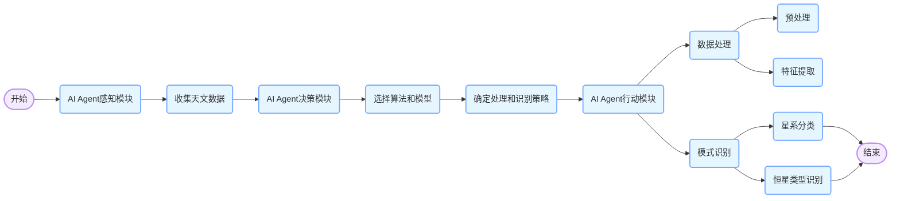

# AI Agent在天文学中的应用：数据处理与模式识别

> 关键词：AI Agent、天文学、数据处理、模式识别、天体研究

> 摘要：本文聚焦于AI Agent在天文学领域的数据处理与模式识别应用。详细阐述了AI Agent的核心概念、算法原理，通过数学模型解释其工作机制。结合实际项目案例，展示了如何在天文学研究中运用AI Agent进行数据处理与模式识别。同时，探讨了其在天文学中的实际应用场景，推荐了相关学习资源、开发工具和论文著作。最后，对AI Agent在天文学未来的发展趋势与挑战进行了总结，并解答了常见问题，为天文学研究者和相关从业者提供全面的技术参考。

## 1. 背景介绍 
### 1.1 目的和范围
随着天文学观测技术的飞速发展，天文数据呈现出爆炸式增长。海量的天文数据包含了丰富的天体信息，但同时也给数据处理和分析带来了巨大挑战。传统的数据处理和分析方法在处理如此大规模、复杂的数据时显得力不从心。本文章旨在探讨AI Agent在天文学数据处理与模式识别中的应用，介绍其核心原理、算法实现、实际应用场景等内容，为天文学研究提供新的思路和方法。本文的范围涵盖了AI Agent在天文学数据处理的各个环节，包括数据清洗、特征提取、分类识别等，以及在天体模式识别中的应用，如星系分类、恒星演化阶段识别等。

### 1.2 预期读者
本文预期读者主要包括天文学研究者、天文数据分析师、人工智能领域对天文学应用感兴趣的开发者以及相关专业的学生。对于天文学研究者，本文可以提供利用AI Agent解决实际研究中数据处理和模式识别问题的方法和思路；对于天文数据分析师，有助于提升其数据处理和分析的效率和准确性；对于人工智能开发者，能让他们了解天文学领域的数据特点和需求，拓展AI Agent的应用场景；对于相关专业学生，可作为学习AI Agent在天文学应用的参考资料。

### 1.3 文档结构概述
本文将按照以下结构进行阐述：首先介绍AI Agent和天文学相关的核心概念及其联系；接着详细讲解AI Agent在数据处理与模式识别中的核心算法原理，并给出具体的Python操作步骤；然后通过数学模型和公式深入分析其工作机制，并举例说明；再通过项目实战展示代码实际案例和详细解释；之后探讨AI Agent在天文学中的实际应用场景；推荐相关的学习资源、开发工具和论文著作；最后总结AI Agent在天文学中的未来发展趋势与挑战，解答常见问题，并提供扩展阅读和参考资料。

### 1.4 术语表
#### 1.4.1 核心术语定义
- **AI Agent（人工智能代理）**：是一种能够感知环境、根据感知信息进行决策并采取行动以实现特定目标的智能实体。在天文学中，AI Agent可以根据天文数据进行分析、处理和模式识别等操作。
- **天文学数据处理**：指对天文观测所得到的数据进行清洗、转换、特征提取等操作，以提高数据质量和可用性，便于后续的分析和研究。
- **模式识别**：是指对数据中隐藏的模式、规律进行识别和分类的过程。在天文学中，模式识别可用于星系分类、恒星类型识别等。
- **天体**：宇宙中各种物质的存在形式，如恒星、行星、星系等。

#### 1.4.2 相关概念解释
- **机器学习**：是一门多领域交叉学科，涉及概率论、统计学、逼近论、凸分析、算法复杂度理论等多门学科。它专门研究计算机怎样模拟或实现人类的学习行为，以获取新的知识或技能，重新组织已有的知识结构使之不断改善自身的性能。在天文学中，机器学习算法可用于训练AI Agent进行数据处理和模式识别。
- **深度学习**：是机器学习的一个分支领域，它是一种基于对数据进行表征学习的方法。深度学习通过构建具有多个层次的神经网络模型，自动从数据中学习特征和模式。在天文学中，深度学习可用于处理复杂的天文图像和光谱数据。

#### 1.4.3 缩略词列表
- **CNN（Convolutional Neural Network）**：卷积神经网络，是一种专门为处理具有网格结构数据（如图像）而设计的深度学习模型。
- **RNN（Recurrent Neural Network）**：循环神经网络，是一种能够处理序列数据的神经网络模型，常用于处理时间序列数据。
- **ML（Machine Learning）**：机器学习。
- **DL（Deep Learning）**：深度学习。

## 2. 核心概念与联系 

### 2.1 AI Agent核心概念
AI Agent是一个能够自主感知环境、做出决策并执行行动的智能实体。它由感知模块、决策模块和行动模块组成。感知模块负责收集环境信息，在天文学中，这些信息可以是天文望远镜观测到的数据，如光谱数据、图像数据等。决策模块根据感知到的信息进行分析和推理，确定合适的行动方案。行动模块则根据决策模块的结果执行相应的操作，如对数据进行处理、分类等。

### 2.2 天文学数据处理与模式识别概念
天文学数据处理是对天文观测数据进行预处理、特征提取和数据转换的过程。预处理包括数据清洗、去噪等操作，以去除数据中的噪声和错误信息。特征提取则是从数据中提取出有代表性的特征，以便后续的分析和识别。模式识别是在处理后的数据中寻找特定的模式和规律，如星系的形状、恒星的光谱特征等。

### 2.3 三者之间的联系
AI Agent在天文学数据处理与模式识别中起着关键作用。AI Agent可以利用其感知模块收集天文数据，然后通过决策模块选择合适的算法和模型对数据进行处理和分析，最后通过行动模块执行相应的操作，如分类、预测等。在数据处理过程中，AI Agent可以根据数据的特点和需求，自动调整处理方法和参数，提高数据处理的效率和准确性。在模式识别方面，AI Agent可以学习和识别不同天体的模式和特征，从而实现对天体的分类和识别。

### 2.4 文本示意图
```plaintext
AI Agent
├── 感知模块
│   └── 收集天文数据（光谱、图像等）
├── 决策模块
│   ├── 选择算法和模型
│   └── 确定处理和识别策略
└── 行动模块
    ├── 数据处理（清洗、特征提取等）
    └── 模式识别（分类、预测等）

天文学数据处理与模式识别
├── 数据处理
│   ├── 预处理（清洗、去噪）
│   └── 特征提取
└── 模式识别
    ├── 星系分类
    └── 恒星类型识别
```

### 2.5 Mermaid流程图


## 3. 核心算法原理 & 具体操作步骤 

### 3.1 核心算法原理
在天文学数据处理与模式识别中，常用的AI Agent算法包括机器学习和深度学习算法。下面以卷积神经网络（CNN）为例，介绍其在天文图像模式识别中的原理。

#### 3.1.1 卷积神经网络原理
卷积神经网络是一种专门为处理具有网格结构数据（如图像）而设计的深度学习模型。它主要由卷积层、池化层和全连接层组成。

- **卷积层**：卷积层通过卷积核在输入图像上滑动，进行卷积操作，提取图像的局部特征。卷积核是一个小的矩阵，它与输入图像的局部区域进行点积运算，得到一个特征图。不同的卷积核可以提取不同类型的特征，如边缘、纹理等。

- **池化层**：池化层用于减少特征图的尺寸，降低计算量，同时增强模型的鲁棒性。常用的池化方法有最大池化和平均池化。最大池化是在每个池化窗口中选择最大值作为输出，平均池化则是计算池化窗口内所有值的平均值作为输出。

- **全连接层**：全连接层将池化层输出的特征图展开成一维向量，然后通过全连接的方式与输出层相连。全连接层用于对提取的特征进行分类和预测。

### 3.2 具体操作步骤（Python实现）

#### 3.2.1 数据准备
首先，我们需要准备天文图像数据集。假设我们有一个包含星系图像的数据集，并且已经将其划分为训练集和测试集。

```python
import tensorflow as tf
from tensorflow.keras.preprocessing.image import ImageDataGenerator

# 数据增强
train_datagen = ImageDataGenerator(
    rescale=1./255,
    shear_range=0.2,
    zoom_range=0.2,
    horizontal_flip=True
)

test_datagen = ImageDataGenerator(rescale=1./255)

# 加载数据集
train_generator = train_datagen.flow_from_directory(
    'train_data_directory',
    target_size=(150, 150),
    batch_size=32,
    class_mode='categorical'
)

test_generator = test_datagen.flow_from_directory(
    'test_data_directory',
    target_size=(150, 150),
    batch_size=32,
    class_mode='categorical'
)
```

#### 3.2.2 构建CNN模型
```python
from tensorflow.keras.models import Sequential
from tensorflow.keras.layers import Conv2D, MaxPooling2D, Flatten, Dense

model = Sequential([
    Conv2D(32, (3, 3), activation='relu', input_shape=(150, 150, 3)),
    MaxPooling2D(2, 2),
    Conv2D(64, (3, 3), activation='relu'),
    MaxPooling2D(2, 2),
    Conv2D(128, (3, 3), activation='relu'),
    MaxPooling2D(2, 2),
    Flatten(),
    Dense(128, activation='relu'),
    Dense(train_generator.num_classes, activation='softmax')
])

# 编译模型
model.compile(optimizer='adam',
              loss='categorical_crossentropy',
              metrics=['accuracy'])
```

#### 3.2.3 训练模型
```python
# 训练模型
history = model.fit(
    train_generator,
    steps_per_epoch=train_generator.samples // train_generator.batch_size,
    epochs=10,
    validation_data=test_generator,
    validation_steps=test_generator.samples // test_generator.batch_size
)
```

#### 3.2.4 模型评估
```python
# 评估模型
test_loss, test_acc = model.evaluate(test_generator)
print(f"Test accuracy: {test_acc}")
```

## 4. 数学模型和公式 & 详细讲解 & 举例说明 

### 4.1 卷积操作的数学模型
卷积操作是卷积神经网络的核心操作，其数学公式如下：

设输入图像为 $X \in \mathbb{R}^{H \times W \times C}$，其中 $H$ 是图像的高度，$W$ 是图像的宽度，$C$ 是图像的通道数。卷积核为 $K \in \mathbb{R}^{h \times w \times C \times N}$，其中 $h$ 和 $w$ 是卷积核的高度和宽度，$N$ 是卷积核的数量。卷积操作的输出特征图为 $Y \in \mathbb{R}^{H' \times W' \times N}$，其中 $H'$ 和 $W'$ 是输出特征图的高度和宽度。

卷积操作的数学公式为：

$$Y_{i,j,k} = \sum_{m=0}^{h-1} \sum_{n=0}^{w-1} \sum_{c=0}^{C-1} K_{m,n,c,k} \cdot X_{i+m,j+n,c}$$

其中，$i = 0, 1, \cdots, H' - 1$，$j = 0, 1, \cdots, W' - 1$，$k = 0, 1, \cdots, N - 1$。

### 4.2 详细讲解
卷积操作的本质是对输入图像进行局部特征提取。卷积核在输入图像上滑动，每次与输入图像的局部区域进行点积运算，得到一个输出值。通过不同的卷积核，可以提取出不同类型的特征，如边缘、纹理等。

### 4.3 举例说明
假设我们有一个输入图像 $X$ 是一个 $3 \times 3$ 的矩阵：

$$X = \begin{bmatrix}
1 & 2 & 3 \\
4 & 5 & 6 \\
7 & 8 & 9
\end{bmatrix}$$

卷积核 $K$ 是一个 $2 \times 2$ 的矩阵：

$$K = \begin{bmatrix}
1 & 0 \\
0 & 1
\end{bmatrix}$$

我们以步长为 1 进行卷积操作。首先，卷积核与输入图像的左上角 $2 \times 2$ 区域进行点积运算：

$$Y_{0,0} = 1 \times 1 + 0 \times 2 + 0 \times 4 + 1 \times 5 = 6$$

然后，卷积核向右滑动一个单位，与输入图像的下一个 $2 \times 2$ 区域进行点积运算：

$$Y_{0,1} = 1 \times 2 + 0 \times 3 + 0 \times 5 + 1 \times 6 = 8$$

以此类推，最终得到输出特征图 $Y$：

$$Y = \begin{bmatrix}
6 & 8 \\
12 & 14
\end{bmatrix}$$

### 4.4 池化操作的数学模型
以最大池化为例，设输入特征图为 $X \in \mathbb{R}^{H \times W}$，池化窗口的大小为 $p \times p$，步长为 $s$。输出特征图为 $Y \in \mathbb{R}^{H' \times W'}$，其中 $H' = \lfloor \frac{H - p}{s} \rfloor + 1$，$W' = \lfloor \frac{W - p}{s} \rfloor + 1$。

最大池化操作的数学公式为：

$$Y_{i,j} = \max_{m=0}^{p-1} \max_{n=0}^{p-1} X_{i \cdot s + m, j \cdot s + n}$$

其中，$i = 0, 1, \cdots, H' - 1$，$j = 0, 1, \cdots, W' - 1$。

### 4.5 池化操作举例说明
假设我们有一个输入特征图 $X$ 是一个 $4 \times 4$ 的矩阵：

$$X = \begin{bmatrix}
1 & 2 & 3 & 4 \\
5 & 6 & 7 & 8 \\
9 & 10 & 11 & 12 \\
13 & 14 & 15 & 16
\end{bmatrix}$$

池化窗口的大小为 $2 \times 2$，步长为 2。则输出特征图 $Y$ 为：

$$Y = \begin{bmatrix}
6 & 8 \\
14 & 16
\end{bmatrix}$$

例如，$Y_{0,0}$ 是输入特征图左上角 $2 \times 2$ 区域的最大值，即 $\max\{1, 2, 5, 6\} = 6$。

## 5. 项目实战：代码实际案例和详细解释说明 

### 5.1  开发环境搭建
#### 5.1.1 操作系统
可以选择 Windows、Linux 或 macOS 操作系统。这里以 Ubuntu 20.04 为例进行说明。

#### 5.1.2 Python 环境
安装 Python 3.8 或更高版本。可以使用以下命令进行安装：

```bash
sudo apt update
sudo apt install python3.8 python3.8-venv
```

#### 5.1.3 创建虚拟环境
为了避免不同项目之间的依赖冲突，建议使用虚拟环境。创建并激活虚拟环境的命令如下：

```bash
python3.8 -m venv myenv
source myenv/bin/activate
```

#### 5.1.4 安装依赖库
安装项目所需的依赖库，包括 TensorFlow、NumPy、Pandas 等：

```bash
pip install tensorflow numpy pandas matplotlib
```

### 5.2  源代码详细实现和代码解读

#### 5.2.1 数据加载和预处理
```python
import tensorflow as tf
from tensorflow.keras.preprocessing.image import ImageDataGenerator
import numpy as np

# 数据增强
train_datagen = ImageDataGenerator(
    rescale=1./255,
    shear_range=0.2,
    zoom_range=0.2,
    horizontal_flip=True
)

test_datagen = ImageDataGenerator(rescale=1./255)

# 加载数据集
train_generator = train_datagen.flow_from_directory(
    'train_data_directory',
    target_size=(150, 150),
    batch_size=32,
    class_mode='categorical'
)

test_generator = test_datagen.flow_from_directory(
    'test_data_directory',
    target_size=(150, 150),
    batch_size=32,
    class_mode='categorical'
)
```

**代码解读**：
- `ImageDataGenerator` 用于对图像数据进行增强和预处理。`rescale` 参数将图像像素值缩放到 0 到 1 之间，`shear_range` 用于随机错切变换，`zoom_range` 用于随机缩放，`horizontal_flip` 用于随机水平翻转。
- `flow_from_directory` 方法从指定目录中加载图像数据，并将其转换为适合模型训练的格式。`target_size` 指定图像的大小，`batch_size` 指定每个批次的样本数量，`class_mode` 指定分类模式。

#### 5.2.2 构建 CNN 模型
```python
from tensorflow.keras.models import Sequential
from tensorflow.keras.layers import Conv2D, MaxPooling2D, Flatten, Dense

model = Sequential([
    Conv2D(32, (3, 3), activation='relu', input_shape=(150, 150, 3)),
    MaxPooling2D(2, 2),
    Conv2D(64, (3, 3), activation='relu'),
    MaxPooling2D(2, 2),
    Conv2D(128, (3, 3), activation='relu'),
    MaxPooling2D(2, 2),
    Flatten(),
    Dense(128, activation='relu'),
    Dense(train_generator.num_classes, activation='softmax')
])

# 编译模型
model.compile(optimizer='adam',
              loss='categorical_crossentropy',
              metrics=['accuracy'])
```

**代码解读**：
- `Sequential` 模型是一个线性堆叠的模型，通过依次添加层来构建神经网络。
- `Conv2D` 层用于进行卷积操作，`32` 表示卷积核的数量，`(3, 3)` 表示卷积核的大小，`activation='relu'` 表示使用 ReLU 激活函数。
- `MaxPooling2D` 层用于进行最大池化操作，`(2, 2)` 表示池化窗口的大小。
- `Flatten` 层将多维的特征图展开成一维向量。
- `Dense` 层是全连接层，`128` 表示神经元的数量，`activation='relu'` 表示使用 ReLU 激活函数。最后一层的 `activation='softmax'` 用于多分类问题。
- `compile` 方法用于编译模型，指定优化器、损失函数和评估指标。

#### 5.2.3 训练模型
```python
# 训练模型
history = model.fit(
    train_generator,
    steps_per_epoch=train_generator.samples // train_generator.batch_size,
    epochs=10,
    validation_data=test_generator,
    validation_steps=test_generator.samples // test_generator.batch_size
)
```

**代码解读**：
- `fit` 方法用于训练模型，`train_generator` 是训练数据集，`steps_per_epoch` 指定每个 epoch 中的步数，`epochs` 指定训练的轮数，`validation_data` 是验证数据集，`validation_steps` 指定验证时的步数。

#### 5.2.4 模型评估
```python
# 评估模型
test_loss, test_acc = model.evaluate(test_generator)
print(f"Test accuracy: {test_acc}")
```

**代码解读**：
- `evaluate` 方法用于评估模型在测试数据集上的性能，返回损失值和准确率。

### 5.3  代码解读与分析
#### 5.3.1 数据增强的作用
数据增强可以增加训练数据的多样性，提高模型的泛化能力。通过随机错切、缩放、翻转等操作，可以模拟不同的观测条件，使模型能够学习到更鲁棒的特征。

#### 5.3.2 卷积层和池化层的作用
卷积层用于提取图像的局部特征，不同的卷积核可以提取不同类型的特征。池化层用于减少特征图的尺寸，降低计算量，同时增强模型的鲁棒性。

#### 5.3.3 全连接层的作用
全连接层将提取的特征进行整合和分类，通过多层的全连接层，可以学习到更复杂的特征表示，从而实现准确的分类。

#### 5.3.4 模型训练和评估
通过多次迭代训练模型，可以使模型逐渐学习到数据中的模式和规律。评估模型在测试数据集上的性能可以验证模型的泛化能力，如果测试准确率较低，可能需要调整模型结构或超参数。

## 6. 实际应用场景 
### 6.1 星系分类
星系具有不同的形状和结构，如椭圆星系、螺旋星系等。传统的星系分类方法主要依靠天文学家的人工判断，效率较低且容易受到主观因素的影响。AI Agent可以通过学习大量的星系图像数据，自动识别星系的类型。例如，使用卷积神经网络对星系图像进行分类，能够快速准确地判断星系的类型，为星系演化研究提供重要的数据支持。

### 6.2 恒星演化阶段识别
恒星在其生命周期中会经历不同的演化阶段，如主序星、红巨星、白矮星等。不同演化阶段的恒星具有不同的光谱特征。AI Agent可以分析恒星的光谱数据，识别其所处的演化阶段。通过对大量恒星光谱数据的学习，AI Agent能够发现光谱特征与恒星演化阶段之间的关系，帮助天文学家更好地理解恒星的演化过程。

### 6.3 超新星爆发预测
超新星爆发是宇宙中极其剧烈的天体物理现象，对研究宇宙的演化和结构具有重要意义。AI Agent可以通过监测天体的亮度变化、光谱特征等数据，预测超新星爆发的可能性。通过分析历史超新星爆发的数据，AI Agent可以学习到超新星爆发前的特征模式，从而提前发出预警，为天文学家争取更多的观测时间。

### 6.4 小行星监测与识别
小行星对地球的安全构成潜在威胁，因此对小行星的监测和识别至关重要。AI Agent可以处理天文望远镜拍摄的图像数据，识别出小行星的位置、轨道等信息。通过对大量图像数据的分析，AI Agent能够快速准确地发现小行星，并对其轨道进行预测，为小行星的防御提供支持。

## 7. 工具和资源推荐
### 7.1 学习资源推荐
#### 7.1.1 书籍推荐
- 《深度学习》（Deep Learning）：由 Ian Goodfellow、Yoshua Bengio 和 Aaron Courville 所著，是深度学习领域的经典教材，全面介绍了深度学习的理论和实践。
- 《Python 机器学习》（Python Machine Learning）：作者是 Sebastian Raschka 和 Vahid Mirjalili，详细介绍了使用 Python 进行机器学习的方法和技巧。
- 《天文学基础》（Fundamentals of Astronomy）：帮助读者了解天文学的基本概念和知识，为在天文学中应用 AI 提供基础。

#### 7.1.2 在线课程
- Coursera 上的“深度学习专项课程”（Deep Learning Specialization）：由 Andrew Ng 教授授课，涵盖了深度学习的各个方面，包括神经网络、卷积神经网络、循环神经网络等。
- edX 上的“天文学导论”（Introduction to Astronomy）：提供了天文学的基础知识，适合初学者入门。
- Kaggle 上的机器学习和深度学习教程：通过实际案例和竞赛，帮助学习者提高实践能力。

#### 7.1.3 技术博客和网站
- Towards Data Science：是一个专注于数据科学和机器学习的博客平台，提供了大量的技术文章和案例分析。
- arXiv：是一个预印本服务器，包含了大量的天文学和人工智能领域的研究论文，能够及时了解最新的研究动态。
- Astronomy Stack Exchange：是一个天文学问答社区，用户可以在这里提出问题、分享经验和交流知识。

### 7.2 开发工具框架推荐
#### 7.2.1 IDE和编辑器
- PyCharm：是一款专业的 Python 集成开发环境，提供了丰富的代码编辑、调试和分析功能，适合开发大规模的 Python 项目。
- Jupyter Notebook：是一个交互式的开发环境，支持代码、文本、图像等多种形式的展示，非常适合进行数据分析和模型实验。
- Visual Studio Code：是一款轻量级的代码编辑器，支持多种编程语言，具有丰富的插件生态系统，可以满足不同的开发需求。

#### 7.2.2 调试和性能分析工具
- TensorBoard：是 TensorFlow 提供的可视化工具，可以用于监控模型的训练过程、查看模型的结构和性能指标等。
- Py-Spy：是一个轻量级的 Python 性能分析工具，可以帮助开发者找出代码中的性能瓶颈。
- Numba：是一个用于加速 Python 代码的编译器，可以将 Python 代码转换为机器码，提高代码的执行效率。

#### 7.2.3 相关框架和库
- TensorFlow：是一个开源的机器学习框架，提供了丰富的工具和接口，支持深度学习模型的构建、训练和部署。
- PyTorch：是另一个流行的深度学习框架，具有动态图机制，易于使用和调试。
- Scikit-learn：是一个用于机器学习的 Python 库，提供了各种机器学习算法和工具，适合初学者入门。

### 7.3 相关论文著作推荐
#### 7.3.1 经典论文
- “ImageNet Classification with Deep Convolutional Neural Networks”：介绍了 AlexNet 模型，开启了深度学习在图像识别领域的革命。
- “Long Short-Term Memory”：提出了长短期记忆网络（LSTM），解决了循环神经网络中的梯度消失问题。
- “Astronomical Data Mining”：探讨了数据挖掘技术在天文学中的应用。

#### 7.3.2 最新研究成果
- 在 arXiv 上搜索“AI in Astronomy”可以找到最新的关于 AI 在天文学中应用的研究论文。这些论文涵盖了星系分类、恒星演化、超新星预测等多个方面的研究成果。

#### 7.3.3 应用案例分析
- Kaggle 上有许多关于天文学数据处理和模式识别的竞赛和案例，通过分析这些案例可以了解实际应用中的问题和解决方案。

## 8. 总结：未来发展趋势与挑战
### 8.1 未来发展趋势
#### 8.1.1 多模态数据融合
未来，天文学数据将不仅仅局限于图像和光谱数据，还将包括引力波数据、中微子数据等多模态数据。AI Agent将能够融合这些不同类型的数据，进行更全面、深入的分析和研究，从而揭示更多的天体物理现象和规律。

#### 8.1.2 强化学习的应用
强化学习可以使 AI Agent在天文学研究中更加主动地进行探索和决策。例如，在望远镜的观测调度中，AI Agent可以通过强化学习算法，根据不同的科学目标和观测条件，自动调整望远镜的指向和观测参数，提高观测效率和科学产出。

#### 8.1.3 与其他领域的交叉融合
AI Agent在天文学中的应用将与其他领域，如物理学、计算机科学、数学等进行更深入的交叉融合。跨学科的研究将为天文学带来新的理论和方法，推动天文学的发展。

### 8.2 挑战
#### 8.2.1 数据质量和标注问题
天文数据往往存在噪声、缺失值等问题，影响数据的质量。此外，一些天文数据的标注工作非常困难，需要天文学家的专业知识和大量的时间。如何处理低质量的数据和解决数据标注问题是一个挑战。

#### 8.2.2 模型解释性问题
深度学习模型通常是一个“黑匣子”，难以解释其决策过程和结果。在天文学研究中，天文学家需要了解模型的决策依据，以便更好地理解天体物理现象。因此，提高模型的解释性是一个重要的挑战。

#### 8.2.3 计算资源需求
处理大规模的天文数据和训练复杂的深度学习模型需要大量的计算资源。如何有效地利用计算资源，降低计算成本，是一个需要解决的问题。

## 9. 附录：常见问题与解答
### 9.1 如何选择合适的AI Agent算法用于天文学数据处理和模式识别？
选择合适的算法需要考虑数据的特点和任务的需求。如果是处理图像数据，卷积神经网络（CNN）是一个不错的选择；如果是处理序列数据，如时间序列的天文观测数据，循环神经网络（RNN）或长短期记忆网络（LSTM）可能更合适。此外，还可以根据数据的规模和复杂度选择合适的机器学习算法，如决策树、支持向量机等。

### 9.2 AI Agent在天文学中的应用是否会取代天文学家的工作？
不会。AI Agent可以帮助天文学家处理大量的数据和进行模式识别，提高工作效率和准确性。但天文学研究还需要天文学家的专业知识和创造力，如提出科学问题、设计观测方案、解释研究结果等。AI Agent是天文学家的工具和助手，而不是取代者。

### 9.3 如何评估AI Agent在天文学中的性能？
可以使用多种指标来评估AI Agent的性能，如准确率、召回率、F1值等。对于分类任务，可以计算分类准确率；对于回归任务，可以计算均方误差（MSE）、均方根误差（RMSE）等。此外，还可以通过与天文学家的人工标注结果进行比较，评估AI Agent的性能。

### 9.4 如何处理天文学数据中的噪声和缺失值？
处理噪声可以使用滤波、去噪等方法，如高斯滤波、中值滤波等。对于缺失值，可以使用插值法进行填充，如线性插值、样条插值等。此外，还可以使用机器学习算法对缺失值进行预测和填充。

## 10. 扩展阅读 & 参考资料
### 10.1 扩展阅读
- 《天体物理学前沿与观测》：深入介绍了天体物理学的前沿研究和观测技术。
- 《人工智能：一种现代的方法》：全面介绍了人工智能的理论和方法。
- 《数据挖掘：概念与技术》：详细讲解了数据挖掘的技术和应用。

### 10.2 参考资料
- 相关的天文学研究论文和报告。
- TensorFlow、PyTorch等深度学习框架的官方文档。
- Kaggle上的天文学竞赛和案例。

作者：AI天才研究院/AI Genius Institute & 禅与计算机程序设计艺术 /Zen And The Art of Computer Programming