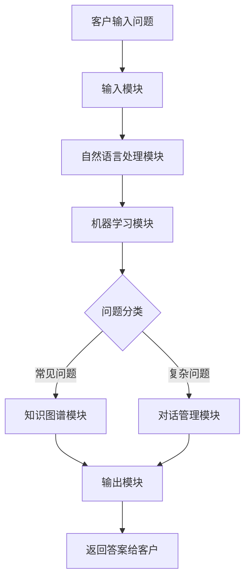

# AI Agent在客户服务中的应用

> 关键词：AI Agent、客户服务、自然语言处理、智能交互、机器学习

> 摘要：本文深入探讨了AI Agent在客户服务领域的应用。详细介绍了AI Agent的核心概念、工作原理和架构，通过Python代码阐述了相关算法。同时，结合数学模型和公式对其原理进行剖析，并给出了项目实战案例，包括开发环境搭建、代码实现和解读。还分析了AI Agent在客户服务中的实际应用场景，推荐了学习资源、开发工具和相关论文。最后总结了其未来发展趋势与挑战，解答了常见问题，并提供了扩展阅读和参考资料。

## 1. 背景介绍 

### 1.1 目的和范围
本文章旨在全面介绍AI Agent在客户服务中的应用，涵盖AI Agent的基本概念、核心算法、数学模型、实际应用案例等方面。通过详细的阐述，让读者深入了解AI Agent如何在客户服务中发挥作用，以及如何进行相关的开发和应用。范围包括AI Agent在不同类型客户服务场景中的应用，如在线客服、电话客服等，同时涉及到相关技术的原理和实现细节。

### 1.2 预期读者
本文预期读者包括从事客户服务行业的专业人员，如客服经理、客服代表等，他们可以通过本文了解如何利用AI Agent提升客户服务的效率和质量。同时，对于从事人工智能、软件开发等领域的技术人员，本文提供了详细的技术原理和实现方法，有助于他们进行相关的研究和开发工作。此外，对人工智能应用感兴趣的普通读者也可以通过本文了解AI Agent在客户服务中的应用现状和发展趋势。

### 1.3 文档结构概述
本文首先介绍了AI Agent在客户服务应用的背景信息，包括目的、预期读者和文档结构。接着阐述了AI Agent的核心概念与联系，通过文本示意图和Mermaid流程图进行展示。然后详细讲解了核心算法原理和具体操作步骤，使用Python源代码进行说明。之后给出了数学模型和公式，并结合具体例子进行讲解。再通过项目实战，展示了代码实际案例和详细解释。随后分析了AI Agent在客户服务中的实际应用场景。推荐了相关的工具和资源，包括学习资源、开发工具框架和论文著作。最后总结了未来发展趋势与挑战，解答了常见问题，并提供了扩展阅读和参考资料。

### 1.4 术语表

#### 1.4.1 核心术语定义
- **AI Agent**：即人工智能代理，是一种能够感知环境、自主决策并采取行动以实现特定目标的软件实体。在客户服务中，AI Agent可以理解客户的问题并提供相应的解决方案。
- **自然语言处理（NLP）**：是人工智能的一个重要领域，主要研究如何让计算机理解、处理和生成人类语言。在AI Agent中，NLP技术用于对客户的自然语言问题进行分析和理解。
- **机器学习（ML）**：是一门多领域交叉学科，涉及概率论、统计学、逼近论、凸分析、算法复杂度理论等多门学科。它专门研究计算机怎样模拟或实现人类的学习行为，以获取新的知识或技能，重新组织已有的知识结构使之不断改善自身的性能。在AI Agent中，机器学习用于训练模型，使其能够更好地理解和处理客户问题。
- **知识图谱**：是一种语义网络，用于表示实体之间的关系和知识。在客户服务中，知识图谱可以帮助AI Agent更准确地理解客户问题，并提供更全面的解决方案。

#### 1.4.2 相关概念解释
- **对话管理**：是AI Agent在与客户进行交互时，对对话流程进行管理和控制的过程。包括识别客户意图、生成回复、处理多轮对话等。
- **情感分析**：是指通过自然语言处理技术，对文本中表达的情感进行分析和判断。在客户服务中，情感分析可以帮助AI Agent了解客户的情绪状态，从而提供更合适的服务。
- **多模态交互**：是指结合多种交互方式，如文本、语音、图像等，与客户进行交互。在客户服务中，多模态交互可以提高客户的交互体验。

#### 1.4.3 缩略词列表
- **AI**：Artificial Intelligence，人工智能
- **NLP**：Natural Language Processing，自然语言处理
- **ML**：Machine Learning，机器学习
- **RNN**：Recurrent Neural Network，循环神经网络
- **LSTM**：Long Short-Term Memory，长短期记忆网络
- **CNN**：Convolutional Neural Network，卷积神经网络

## 2. 核心概念与联系 

### 核心概念原理
AI Agent在客户服务中的核心原理是通过自然语言处理技术理解客户的问题，利用机器学习模型对问题进行分类和解答，并通过对话管理技术与客户进行交互。具体来说，当客户提出问题时，AI Agent首先对问题进行文本预处理，包括分词、词性标注、命名实体识别等操作，将问题转化为计算机能够理解的形式。然后，使用训练好的机器学习模型对问题进行分类，确定问题的类型和意图。最后，根据问题的类型和意图，从知识库中查找相应的答案，并将答案返回给客户。

### 架构的文本示意图
AI Agent在客户服务中的架构主要包括以下几个部分：
1. **输入模块**：负责接收客户的问题，可以是文本、语音等形式。
2. **自然语言处理模块**：对客户的问题进行预处理和分析，包括分词、词性标注、命名实体识别、句法分析等操作。
3. **机器学习模块**：使用训练好的模型对问题进行分类和解答，常见的模型包括神经网络、决策树、支持向量机等。
4. **知识图谱模块**：存储和管理与客户服务相关的知识，包括常见问题解答、产品信息、业务流程等。
5. **对话管理模块**：对对话流程进行管理和控制，包括识别客户意图、生成回复、处理多轮对话等。
6. **输出模块**：将答案返回给客户，可以是文本、语音等形式。

### Mermaid流程图


## 3. 核心算法原理 & 具体操作步骤 

### 核心算法原理
在AI Agent中，常用的核心算法包括自然语言处理算法和机器学习算法。以下是一些常见算法的介绍：

#### 自然语言处理算法
- **分词算法**：将文本分割成一个个独立的词语。常见的分词算法有基于规则的分词算法、基于统计的分词算法和基于深度学习的分词算法。例如，结巴分词是一种基于统计的分词算法，它使用了隐马尔可夫模型（HMM）来进行分词。
- **词性标注算法**：为每个词语标注其词性，如名词、动词、形容词等。常见的词性标注算法有基于规则的词性标注算法、基于统计的词性标注算法和基于深度学习的词性标注算法。例如，HanLP是一种基于深度学习的词性标注工具，它使用了双向长短时记忆网络（BiLSTM）和条件随机场（CRF）来进行词性标注。
- **命名实体识别算法**：识别文本中的命名实体，如人名、地名、组织机构名等。常见的命名实体识别算法有基于规则的命名实体识别算法、基于统计的命名实体识别算法和基于深度学习的命名实体识别算法。例如，BERT是一种基于深度学习的预训练模型，它可以用于命名实体识别任务。

#### 机器学习算法
- **分类算法**：将问题分类到不同的类别中。常见的分类算法有决策树、支持向量机、神经网络等。例如，使用决策树算法可以将客户的问题分类为产品咨询、订单查询、投诉建议等类别。
- **回归算法**：预测一个连续的数值。在客户服务中，回归算法可以用于预测客户的满意度、投诉率等。例如，使用线性回归算法可以根据客户的历史数据预测其未来的满意度。
- **聚类算法**：将相似的问题聚集在一起。常见的聚类算法有K-Means聚类算法、层次聚类算法等。例如，使用K-Means聚类算法可以将客户的问题聚类成不同的主题，以便更好地进行管理和处理。

### 具体操作步骤

#### 数据收集和预处理
首先，需要收集与客户服务相关的数据，包括客户的问题、答案、历史对话记录等。然后，对数据进行预处理，包括清洗、标注、分词等操作。以下是一个使用Python进行数据清洗和分词的示例代码：
```python
import re
import jieba

def clean_text(text):
    # 去除特殊字符
    text = re.sub(r'[^\u4e00-\u9fa5a-zA-Z0-9]', ' ', text)
    # 去除多余空格
    text = re.sub(r'\s+', ' ', text).strip()
    return text

def tokenize_text(text):
    # 使用结巴分词进行分词
    tokens = jieba.lcut(text)
    return tokens

# 示例文本
text = "你好，我想咨询一下你们的产品。"
cleaned_text = clean_text(text)
tokens = tokenize_text(cleaned_text)
print("清洗后的文本:", cleaned_text)
print("分词结果:", tokens)
```

#### 模型训练
使用预处理后的数据对机器学习模型进行训练。以下是一个使用Scikit-learn库进行决策树分类模型训练的示例代码：
```python
from sklearn.feature_extraction.text import TfidfVectorizer
from sklearn.tree import DecisionTreeClassifier
from sklearn.model_selection import train_test_split
import pandas as pd

# 假设已经有了一个包含问题和类别的数据集
data = pd.read_csv('customer_service_data.csv')
X = data['question']
y = data['category']

# 文本向量化
vectorizer = TfidfVectorizer()
X_vectorized = vectorizer.fit_transform(X)

# 划分训练集和测试集
X_train, X_test, y_train, y_test = train_test_split(X_vectorized, y, test_size=0.2, random_state=42)

# 训练决策树分类模型
model = DecisionTreeClassifier()
model.fit(X_train, y_train)

# 评估模型
accuracy = model.score(X_test, y_test)
print("模型准确率:", accuracy)
```

#### 模型部署和预测
将训练好的模型部署到生产环境中，用于对客户的问题进行预测。以下是一个使用训练好的模型进行预测的示例代码：
```python
# 新的问题
new_question = "这个产品的价格是多少？"
new_question_cleaned = clean_text(new_question)
new_question_tokens = tokenize_text(new_question_cleaned)
new_question_vectorized = vectorizer.transform([' '.join(new_question_tokens)])

# 预测类别
predicted_category = model.predict(new_question_vectorized)
print("预测的类别:", predicted_category[0])
```

## 4. 数学模型和公式 & 详细讲解 & 举例说明 

### 自然语言处理中的数学模型

#### 隐马尔可夫模型（HMM）
隐马尔可夫模型是一种用于处理序列数据的统计模型，常用于分词、词性标注等自然语言处理任务。HMM由三个要素组成：状态转移概率矩阵 $A$、观测概率矩阵 $B$ 和初始状态概率向量 $\pi$。

设 $Q = \{q_1, q_2, \cdots, q_N\}$ 是所有可能的状态集合，$V = \{v_1, v_2, \cdots, v_M\}$ 是所有可能的观测集合。$A = [a_{ij}]_{N\times N}$ 是状态转移概率矩阵，其中 $a_{ij} = P(q_{t+1}=q_j|q_t=q_i)$ 表示在时刻 $t$ 处于状态 $q_i$ 的条件下，在时刻 $t+1$ 转移到状态 $q_j$ 的概率。$B = [b_{j}(k)]_{N\times M}$ 是观测概率矩阵，其中 $b_{j}(k) = P(o_t = v_k|q_t = q_j)$ 表示在时刻 $t$ 处于状态 $q_j$ 的条件下，观测到 $v_k$ 的概率。$\pi = (\pi_1, \pi_2, \cdots, \pi_N)$ 是初始状态概率向量，其中 $\pi_i = P(q_1 = q_i)$ 表示在时刻 $t = 1$ 处于状态 $q_i$ 的概率。

给定一个观测序列 $O = (o_1, o_2, \cdots, o_T)$，HMM的目标是找到一个状态序列 $S = (s_1, s_2, \cdots, s_T)$，使得 $P(S|O)$ 最大。可以使用维特比算法来求解这个问题。

**举例说明**：假设我们要进行中文分词，状态集合 $Q$ 可以表示为 {B（词首）, M（词中）, E（词尾）, S（单字词）}，观测集合 $V$ 是所有的中文字符。我们可以通过大量的标注数据来估计 $A$、$B$ 和 $\pi$ 的值，然后使用维特比算法对新的文本进行分词。

#### 条件随机场（CRF）
条件随机场是一种用于处理序列数据的概率图模型，常用于词性标注、命名实体识别等自然语言处理任务。与HMM不同，CRF是一种判别式模型，它直接对条件概率 $P(S|O)$ 进行建模。

设 $X$ 是观测序列，$Y$ 是状态序列。CRF定义了一个条件概率分布：
$$P(Y|X) = \frac{1}{Z(X)}\exp\left(\sum_{i=1}^{n}\sum_{k=1}^{K}\lambda_kf_k(y_{i-1}, y_i, X, i)\right)$$
其中，$Z(X)$ 是归一化因子，$f_k(y_{i-1}, y_i, X, i)$ 是特征函数，$\lambda_k$ 是特征函数的权重。

**举例说明**：在命名实体识别任务中，观测序列 $X$ 是输入的文本，状态序列 $Y$ 是每个词的命名实体标签。我们可以定义一些特征函数，如词的本身、词的前后文等，然后通过训练数据来估计特征函数的权重 $\lambda_k$。

### 机器学习中的数学模型

#### 决策树
决策树是一种基于树结构进行决策的机器学习模型，常用于分类和回归任务。决策树的每个内部节点是一个属性上的测试，每个分支是一个测试输出，每个叶节点是一个类别或值。

决策树的构建过程是一个递归的过程，通过选择最优的属性来划分数据集，直到满足停止条件。常用的划分标准有信息增益、信息增益比、基尼指数等。

**信息增益**：设数据集 $D$ 的熵为 $H(D)$，属性 $A$ 对数据集 $D$ 的信息增益为：
$$Gain(D, A) = H(D) - \sum_{v=1}^{V}\frac{|D^v|}{|D|}H(D^v)$$
其中，$V$ 是属性 $A$ 的取值个数，$D^v$ 是数据集 $D$ 中属性 $A$ 取值为 $v$ 的子集。

**举例说明**：假设我们要根据客户的年龄、性别、购买金额等属性来预测客户是否会再次购买。我们可以使用信息增益来选择最优的属性进行划分，构建决策树模型。

#### 神经网络
神经网络是一种模仿人类神经系统的机器学习模型，由多个神经元组成。每个神经元接收输入信号，经过加权求和和非线性激活函数处理后，输出一个信号。

设输入层有 $n$ 个神经元，隐藏层有 $m$ 个神经元，输出层有 $k$ 个神经元。第 $j$ 个隐藏层神经元的输入为：
$$z_j = \sum_{i=1}^{n}w_{ij}x_i + b_j$$
其中，$w_{ij}$ 是输入层第 $i$ 个神经元到隐藏层第 $j$ 个神经元的权重，$x_i$ 是输入层第 $i$ 个神经元的输入，$b_j$ 是隐藏层第 $j$ 个神经元的偏置。

经过激活函数 $\sigma$ 处理后，隐藏层第 $j$ 个神经元的输出为：
$$a_j = \sigma(z_j)$$

输出层第 $l$ 个神经元的输入为：
$$z_l = \sum_{j=1}^{m}w_{jl}a_j + b_l$$
输出层第 $l$ 个神经元的输出为：
$$y_l = \sigma(z_l)$$

**举例说明**：在客户服务中，我们可以使用神经网络来对客户的问题进行分类。将客户的问题表示为向量作为输入，经过神经网络的处理后，输出问题的类别。

## 5. 项目实战：代码实际案例和详细解释说明 

### 5.1  开发环境搭建
#### 安装Python
首先，需要安装Python环境。可以从Python官方网站（https://www.python.org/downloads/）下载适合自己操作系统的Python安装包，然后按照安装向导进行安装。

#### 安装必要的库
在命令行中使用以下命令安装必要的库：
```bash
pip install numpy pandas scikit-learn jieba tensorflow keras
```
其中，`numpy` 和 `pandas` 用于数据处理，`scikit-learn` 用于机器学习模型的训练和评估，`jieba` 用于中文分词，`tensorflow` 和 `keras` 用于深度学习模型的开发。

### 5.2  源代码详细实现和代码解读
#### 数据加载和预处理
```python
import pandas as pd
import jieba

# 加载数据集
data = pd.read_csv('customer_service_data.csv')
questions = data['question'].tolist()
labels = data['category'].tolist()

# 数据预处理
def preprocess_text(text):
    # 去除特殊字符
    text = re.sub(r'[^\u4e00-\u9fa5a-zA-Z0-9]', ' ', text)
    # 去除多余空格
    text = re.sub(r'\s+', ' ', text).strip()
    # 分词
    tokens = jieba.lcut(text)
    return ' '.join(tokens)

preprocessed_questions = [preprocess_text(question) for question in questions]
```
代码解读：首先使用 `pandas` 库加载数据集，将问题和类别分别存储在 `questions` 和 `labels` 列表中。然后定义了一个 `preprocess_text` 函数，用于对文本进行预处理，包括去除特殊字符、多余空格和分词操作。最后将预处理后的问题存储在 `preprocessed_questions` 列表中。

#### 文本向量化
```python
from sklearn.feature_extraction.text import TfidfVectorizer

# 文本向量化
vectorizer = TfidfVectorizer()
X = vectorizer.fit_transform(preprocessed_questions)
```
代码解读：使用 `TfidfVectorizer` 类将预处理后的文本转换为TF-IDF向量表示。`fit_transform` 方法会先拟合数据，然后将文本转换为向量。

#### 模型训练
```python
from sklearn.model_selection import train_test_split
from sklearn.tree import DecisionTreeClassifier

# 划分训练集和测试集
X_train, X_test, y_train, y_test = train_test_split(X, labels, test_size=0.2, random_state=42)

# 训练决策树分类模型
model = DecisionTreeClassifier()
model.fit(X_train, y_train)
```
代码解读：使用 `train_test_split` 函数将数据集划分为训练集和测试集，测试集占比为20%。然后使用 `DecisionTreeClassifier` 类训练决策树分类模型。

#### 模型评估
```python
from sklearn.metrics import accuracy_score

# 模型预测
y_pred = model.predict(X_test)

# 计算准确率
accuracy = accuracy_score(y_test, y_pred)
print("模型准确率:", accuracy)
```
代码解读：使用训练好的模型对测试集进行预测，然后使用 `accuracy_score` 函数计算模型的准确率。

### 5.3  代码解读与分析
- **数据预处理**：数据预处理是机器学习中非常重要的一步，它可以提高模型的性能。在本项目中，我们对文本进行了去除特殊字符、多余空格和分词操作，将文本转换为计算机能够理解的形式。
- **文本向量化**：文本向量化是将文本转换为向量表示的过程，常用的方法有词袋模型、TF-IDF等。在本项目中，我们使用了TF-IDF方法，它可以反映一个词在文档中的重要程度。
- **模型训练和评估**：我们使用了决策树分类模型进行训练和评估。决策树是一种简单而有效的机器学习模型，它可以直观地表示决策过程。通过划分训练集和测试集，我们可以评估模型的性能，确保模型具有较好的泛化能力。

## 6. 实际应用场景 
### 在线客服
AI Agent可以作为在线客服系统的核心，实时回答客户的问题。当客户在网站或APP上发起咨询时，AI Agent可以快速理解客户的问题，并从知识库中查找相应的答案。例如，电商平台的在线客服系统可以使用AI Agent来回答客户关于商品信息、订单状态、售后服务等方面的问题。

### 电话客服
AI Agent也可以应用于电话客服场景。通过语音识别技术，将客户的语音问题转换为文本，然后使用AI Agent进行处理和回答。最后，通过语音合成技术将答案转换为语音反馈给客户。例如，银行的客服热线可以使用AI Agent来处理客户的常见问题，如账户查询、密码重置等。

### 智能聊天机器人
智能聊天机器人是AI Agent在客户服务中的一种常见应用形式。它可以在社交媒体、即时通讯工具等平台上与客户进行交互，提供个性化的服务。例如，企业可以在微信公众号上部署智能聊天机器人，与客户进行实时沟通，解答客户的疑问。

### 客户反馈分析
AI Agent可以对客户的反馈信息进行分析和处理，挖掘客户的需求和意见。通过对客户反馈的文本进行情感分析、主题分类等操作，企业可以了解客户的满意度和痛点，从而改进产品和服务。例如，酒店可以使用AI Agent对客户的评价进行分析，发现服务中存在的问题，及时进行改进。

## 7. 工具和资源推荐
### 7.1 学习资源推荐
#### 7.1.1 书籍推荐
- 《人工智能：一种现代的方法》：这是一本经典的人工智能教材，全面介绍了人工智能的各个领域，包括自然语言处理、机器学习、知识表示等。
- 《Python自然语言处理》：本书详细介绍了使用Python进行自然语言处理的方法和技术，包括分词、词性标注、命名实体识别等。
- 《机器学习》：由周志华教授编写，是一本系统介绍机器学习的教材，涵盖了各种机器学习算法的原理和应用。

#### 7.1.2 在线课程
- Coursera上的“机器学习”课程：由Andrew Ng教授授课，是一门非常经典的机器学习课程，适合初学者学习。
- edX上的“自然语言处理”课程：该课程由哈佛大学和麻省理工学院联合开设，深入介绍了自然语言处理的理论和实践。
- 阿里云天池平台上的人工智能实战课程：提供了丰富的人工智能实战项目和案例，帮助学习者提高实践能力。

#### 7.1.3 技术博客和网站
- 机器之心：专注于人工智能领域的技术资讯和深度报道，提供了大量的前沿技术文章和案例分析。
- 开源中国：一个开源技术社区，有很多关于人工智能的技术文章和代码分享。
- Kaggle：一个数据科学竞赛平台，上面有很多关于人工智能和机器学习的竞赛和数据集，可以帮助学习者提高实践能力。

### 7.2 开发工具框架推荐
#### 7.2.1 IDE和编辑器
- PyCharm：一款专业的Python集成开发环境，提供了丰富的代码编辑、调试、测试等功能。
- Jupyter Notebook：一个交互式的编程环境，适合进行数据分析和模型开发。
- Visual Studio Code：一款轻量级的代码编辑器，支持多种编程语言，有丰富的插件扩展。

#### 7.2.2 调试和性能分析工具
- TensorBoard：TensorFlow的可视化工具，可以用于可视化模型的训练过程、性能指标等。
- Py-Spy：一个Python性能分析工具，可以帮助开发者找出代码中的性能瓶颈。
- Pylint：一个Python代码检查工具，可以检查代码的语法错误、代码风格等问题。

#### 7.2.3 相关框架和库
- TensorFlow：一个开源的深度学习框架，广泛应用于图像识别、自然语言处理等领域。
- PyTorch：另一个流行的深度学习框架，具有动态图的优势，适合快速开发和实验。
- Scikit-learn：一个简单而有效的机器学习库，提供了各种机器学习算法和工具。

### 7.3 相关论文著作推荐
#### 7.3.1 经典论文
- “Attention Is All You Need”：提出了Transformer模型，是自然语言处理领域的重要突破。
- “ImageNet Classification with Deep Convolutional Neural Networks”：介绍了AlexNet模型，开启了深度学习在计算机视觉领域的应用。
- “Long Short-Term Memory”：提出了LSTM模型，解决了循环神经网络中的梯度消失和梯度爆炸问题。

#### 7.3.2 最新研究成果
- 在ACL（Association for Computational Linguistics）、EMNLP（Conference on Empirical Methods in Natural Language Processing）等自然语言处理领域的顶级会议上，每年都会有很多关于AI Agent和客户服务的最新研究成果发表。
- 在KDD（Knowledge Discovery and Data Mining）、ICML（International Conference on Machine Learning）等机器学习领域的顶级会议上，也有很多与AI Agent相关的研究。

#### 7.3.3 应用案例分析
- 《人工智能应用案例精选》：收集了人工智能在各个领域的应用案例，包括客户服务、医疗、金融等。
- 各大科技公司的官方博客，如Google AI Blog、Microsoft Research等，会分享一些AI Agent在客户服务中的实际应用案例和经验。

## 8. 总结：未来发展趋势与挑战
### 未来发展趋势
- **多模态交互**：未来的AI Agent将支持更多的交互方式，如语音、图像、手势等，提供更加自然和便捷的客户服务体验。
- **个性化服务**：通过对客户的历史数据和行为进行分析，AI Agent可以为客户提供更加个性化的服务和推荐，提高客户的满意度和忠诚度。
- **与其他系统的集成**：AI Agent将与企业的其他系统，如CRM系统、ERP系统等进行集成，实现数据的共享和业务流程的自动化。
- **智能决策**：除了回答客户的问题，AI Agent还将具备智能决策的能力，帮助企业做出更加科学和合理的决策。

### 挑战
- **自然语言理解的准确性**：尽管自然语言处理技术取得了很大的进展，但仍然存在一些挑战，如语义理解、上下文感知等问题，需要进一步提高AI Agent对自然语言的理解准确性。
- **数据隐私和安全**：在客户服务中，AI Agent需要处理大量的客户数据，如个人信息、交易记录等，如何保障数据的隐私和安全是一个重要的挑战。
- **模型的可解释性**：深度学习模型通常是黑盒模型，难以解释其决策过程和结果。在客户服务中，需要模型具有较好的可解释性，以便客户和企业能够理解和信任AI Agent的决策。
- **人机协作**：如何实现AI Agent与人类客服的有效协作，发挥各自的优势，是一个需要解决的问题。例如，在处理复杂问题时，如何让AI Agent及时将问题转接给人类客服。

## 9. 附录：常见问题与解答
### 1. AI Agent能否完全替代人类客服？
目前，AI Agent还不能完全替代人类客服。虽然AI Agent可以处理大量的常见问题，提高服务效率，但在处理复杂问题、情感交流等方面，人类客服仍然具有不可替代的优势。未来，AI Agent将与人类客服实现更好的协作，共同为客户提供优质的服务。

### 2. 如何提高AI Agent的回答准确率？
可以从以下几个方面提高AI Agent的回答准确率：
- 收集更多高质量的数据进行模型训练，提高模型的泛化能力。
- 优化自然语言处理算法，提高对客户问题的理解能力。
- 建立完善的知识库，确保知识库中的答案准确、全面。
- 对模型进行持续的评估和优化，不断调整模型的参数和结构。

### 3. AI Agent在处理多轮对话时存在哪些挑战？
AI Agent在处理多轮对话时存在以下挑战：
- 上下文理解：需要准确理解客户在多轮对话中的上下文信息，以便做出正确的回答。
- 对话管理：需要合理管理对话流程，避免出现对话混乱或中断的情况。
- 情感处理：在多轮对话中，需要及时感知客户的情感变化，并做出相应的回应。

### 4. 如何保障AI Agent处理客户数据的安全？
可以采取以下措施保障AI Agent处理客户数据的安全：
- 采用加密技术对客户数据进行加密存储和传输，防止数据泄露。
- 建立严格的访问控制机制，只有授权人员才能访问客户数据。
- 定期对数据进行备份，以防止数据丢失。
- 遵守相关的数据保护法规和标准，如GDPR等。

## 10. 扩展阅读 & 参考资料
### 扩展阅读
- 《深度学习》：由Ian Goodfellow、Yoshua Bengio和Aaron Courville编写，深入介绍了深度学习的理论和实践。
- 《自然语言处理入门》：何晗著，适合初学者快速入门自然语言处理。
- 《大数据时代：生活、工作与思维的大变革》：维克托·迈尔 - 舍恩伯格和肯尼斯·库克耶著，探讨了大数据对社会和生活的影响。

### 参考资料
- 《人工智能技术在客户服务中的应用研究》：一篇关于AI Agent在客户服务中应用的学术论文。
- 《客户服务数字化转型白皮书》：由某咨询机构发布，分析了客户服务数字化转型的趋势和策略。
- 各大科技公司的官方文档和技术博客，如Google、Microsoft、百度等公司的相关资料。

作者：AI天才研究院/AI Genius Institute & 禅与计算机程序设计艺术 /Zen And The Art of Computer Programming