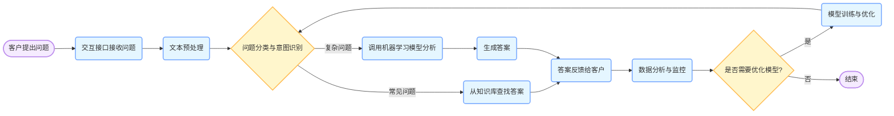

# AI Agent在客户服务领域的应用实践

> 关键词：AI Agent、客户服务、应用实践、智能交互、服务效率

> 摘要：本文聚焦于AI Agent在客户服务领域的应用实践，深入探讨了其核心概念、算法原理、数学模型等内容。通过详细的项目实战案例，展示了AI Agent在客户服务中的具体实现和优势。同时，分析了其实际应用场景，推荐了相关的工具和资源，最后总结了未来发展趋势与挑战，并对常见问题进行了解答。旨在为读者全面呈现AI Agent在客户服务领域的应用全貌，为相关从业者提供有价值的参考。

## 1. 背景介绍 
### 1.1 目的和范围
随着人工智能技术的飞速发展，AI Agent在各个领域的应用越来越广泛，客户服务领域也不例外。本文的目的在于深入探讨AI Agent在客户服务领域的应用实践，包括其核心原理、实现步骤、实际案例以及未来发展趋势等方面。范围涵盖了从理论到实践的多个层面，旨在为读者提供一个全面、系统的了解AI Agent在客户服务中应用的视角。

### 1.2 预期读者
本文预期读者主要包括客户服务行业的从业者，如客服经理、客服代表等，他们可以从中了解如何利用AI Agent提升客户服务质量和效率；人工智能领域的开发者和研究人员，能够获取AI Agent在客户服务场景中的具体应用思路和技术实现方法；企业管理者和决策者，有助于他们评估AI Agent在企业客户服务中的应用价值和可行性。

### 1.3 文档结构概述
本文将按照以下结构进行阐述：首先介绍核心概念与联系，明确AI Agent和客户服务相关概念及其关系；接着讲解核心算法原理和具体操作步骤，通过Python代码详细说明；然后给出数学模型和公式，并举例说明；再通过项目实战展示代码实际案例和详细解释；之后分析实际应用场景；推荐相关的工具和资源；总结未来发展趋势与挑战；解答常见问题；最后提供扩展阅读和参考资料。

### 1.4 术语表
#### 1.4.1 核心术语定义
- **AI Agent（人工智能代理）**：是一种能够感知环境、自主决策并采取行动以实现特定目标的人工智能实体。在客户服务领域，AI Agent可以理解客户的问题并提供相应的解决方案。
- **客户服务**：指企业为满足客户需求，通过各种方式为客户提供的一系列服务活动，包括咨询解答、问题解决、投诉处理等。
- **自然语言处理（NLP）**：是人工智能的一个重要分支，主要研究如何让计算机理解和处理人类语言，在AI Agent中用于理解客户的自然语言问题。
- **机器学习（ML）**：是一门多领域交叉学科，涉及概率论、统计学、逼近论、凸分析、算法复杂度理论等多门学科。它专门研究计算机怎样模拟或实现人类的学习行为，以获取新的知识或技能，重新组织已有的知识结构使之不断改善自身的性能。在AI Agent中用于训练模型以提高服务质量。

#### 1.4.2 相关概念解释
- **对话管理**：在AI Agent与客户的交互过程中，对话管理负责维护对话的上下文，确保对话的连贯性和逻辑性。例如，当客户询问多个相关问题时，对话管理能够正确理解问题之间的关系并做出合适的回应。
- **知识图谱**：是一种语义网络，用于表示实体之间的关系和知识。在客户服务中，知识图谱可以帮助AI Agent更好地理解客户问题，并从丰富的知识资源中找到准确的答案。

#### 1.4.3 缩略词列表
- **NLP**：Natural Language Processing（自然语言处理）
- **ML**：Machine Learning（机器学习）
- **RNN**：Recurrent Neural Network（循环神经网络）
- **LSTM**：Long Short-Term Memory（长短期记忆网络）

## 2. 核心概念与联系 
### 核心概念原理
AI Agent在客户服务领域的核心原理是通过自然语言处理技术理解客户的问题，利用机器学习算法对问题进行分类和分析，然后根据预先设定的规则或训练好的模型生成合适的回答。具体来说，当客户提出问题时，AI Agent首先对问题进行文本预处理，包括分词、去除停用词等操作，然后将处理后的文本输入到训练好的模型中进行分类和意图识别，最后根据识别结果从知识库中提取相应的答案并反馈给客户。

### 架构的文本示意图
```plaintext
客户 <-> 交互接口 <-> AI Agent核心模块 <-> 知识库
|                                      |
|                                      |
V                                      V
数据分析与监控                      模型训练与优化
```
在这个架构中，客户通过交互接口（如网页聊天窗口、手机APP等）与AI Agent进行沟通。AI Agent核心模块负责处理客户的问题，包括自然语言处理、意图识别、对话管理等。知识库存储了大量的客户服务相关知识，为AI Agent提供答案来源。数据分析与监控模块对客户与AI Agent的交互数据进行分析，以便评估服务质量和发现问题。模型训练与优化模块则根据数据分析的结果对AI Agent的模型进行更新和优化。

### Mermaid流程图


## 3. 核心算法原理 & 具体操作步骤 
### 核心算法原理
在AI Agent中，常用的核心算法包括自然语言处理算法和机器学习算法。以下以文本分类和意图识别为例，介绍具体的算法原理。

#### 文本分类算法 - TF-IDF与朴素贝叶斯
TF-IDF（Term Frequency-Inverse Document Frequency）是一种用于信息检索与文本挖掘的常用加权技术。TF表示词频，即某个词在文档中出现的频率；IDF表示逆文档频率，用于衡量一个词的普遍重要性。通过计算TF-IDF值，可以将文本转换为向量表示。

朴素贝叶斯算法是一种基于贝叶斯定理和特征条件独立假设的分类算法。在文本分类中，假设每个词的出现是独立的，根据训练数据计算每个类别的先验概率和每个词在每个类别下的条件概率，然后根据贝叶斯公式计算文本属于每个类别的后验概率，选择后验概率最大的类别作为分类结果。

#### 意图识别算法 - LSTM
LSTM（Long Short-Term Memory）是一种特殊的循环神经网络（RNN），能够处理序列数据中的长距离依赖问题。在意图识别中，将客户的文本问题作为输入序列，通过LSTM网络学习序列中的语义信息，最后输出问题的意图类别。

### 具体操作步骤
#### 步骤1：数据收集与预处理
收集客户服务领域的历史对话数据，包括问题和对应的答案。对数据进行清洗，去除噪声和无效信息，然后进行分词、去除停用词等预处理操作。

#### 步骤2：特征提取
使用TF-IDF算法将预处理后的文本转换为向量表示，作为机器学习模型的输入特征。

#### 步骤3：模型训练
使用朴素贝叶斯算法或LSTM网络对训练数据进行训练，调整模型的参数以提高分类和意图识别的准确率。

#### 步骤4：模型评估
使用测试数据对训练好的模型进行评估，计算准确率、召回率、F1值等指标，评估模型的性能。

#### 步骤5：部署与应用
将训练好的模型部署到AI Agent系统中，实现客户问题的分类和意图识别功能。

### Python源代码详细阐述
```python
import numpy as np
from sklearn.feature_extraction.text import TfidfVectorizer
from sklearn.naive_bayes import MultinomialNB
from sklearn.model_selection import train_test_split
from sklearn.metrics import accuracy_score

# 步骤1：数据收集与预处理
# 假设我们有以下训练数据
corpus = [
    "我想查询订单状态",
    "如何修改收货地址",
    "商品什么时候发货",
    "我要退货",
    "我要换货"
]
labels = [0, 1, 2, 3, 4]

# 步骤2：特征提取
vectorizer = TfidfVectorizer()
X = vectorizer.fit_transform(corpus)

# 步骤3：模型训练
X_train, X_test, y_train, y_test = train_test_split(X, labels, test_size=0.2, random_state=42)
clf = MultinomialNB()
clf.fit(X_train, y_train)

# 步骤4：模型评估
y_pred = clf.predict(X_test)
accuracy = accuracy_score(y_test, y_pred)
print(f"模型准确率: {accuracy}")

# 步骤5：部署与应用
new_text = ["我想查询一下我的订单状态"]
new_text_vector = vectorizer.transform(new_text)
predicted_label = clf.predict(new_text_vector)
print(f"预测结果: {predicted_label}")
```

## 4. 数学模型和公式 & 详细讲解 & 举例说明 
### TF-IDF公式
TF-IDF的计算公式如下：
$$TF - IDF(t, d, D) = TF(t, d) \times IDF(t, D)$$
其中，$TF(t, d)$ 表示词 $t$ 在文档 $d$ 中的词频，计算公式为：
$$TF(t, d) = \frac{词t在文档d中出现的次数}{文档d中的总词数}$$
$IDF(t, D)$ 表示词 $t$ 的逆文档频率，计算公式为：
$$IDF(t, D) = \log(\frac{文档总数}{包含词t的文档数 + 1})$$

### 举例说明
假设有以下3个文档：
- 文档1：“苹果 香蕉 橙子”
- 文档2：“苹果 草莓”
- 文档3：“香蕉 葡萄”

计算词“苹果”的TF-IDF值：
- 文档1中，词“苹果”的词频 $TF(苹果, 文档1) = \frac{1}{3}$
- 包含词“苹果”的文档数为2，文档总数为3，词“苹果”的逆文档频率 $IDF(苹果, D) = \log(\frac{3}{2 + 1}) = \log(1) = 0$
- 词“苹果”在文档1中的TF-IDF值 $TF - IDF(苹果, 文档1, D) = \frac{1}{3} \times 0 = 0$

### 朴素贝叶斯公式
朴素贝叶斯分类器基于贝叶斯定理，对于一个文本 $x$，其属于类别 $c$ 的后验概率计算公式为：
$$P(c|x) = \frac{P(x|c)P(c)}{P(x)}$$
其中，$P(c)$ 是类别 $c$ 的先验概率，$P(x|c)$ 是在类别 $c$ 下文本 $x$ 出现的条件概率，$P(x)$ 是文本 $x$ 出现的概率。由于 $P(x)$ 对于所有类别都是相同的，因此在分类时可以忽略，只需要比较 $P(x|c)P(c)$ 的大小即可。

### 举例说明
假设有两个类别：“查询订单”和“修改信息”，训练数据如下：
| 文本 | 类别 |
| ---- | ---- |
| 我想查询订单状态 | 查询订单 |
| 如何修改收货地址 | 修改信息 |

先验概率计算：
- $P(查询订单) = \frac{1}{2}$
- $P(修改信息) = \frac{1}{2}$

假设新的文本为“我要查询我的订单进度”，计算其属于每个类别的后验概率：
- 假设在“查询订单”类别下，该文本出现的条件概率 $P(我要查询我的订单进度|查询订单) = 0.8$
- 在“修改信息”类别下，该文本出现的条件概率 $P(我要查询我的订单进度|修改信息) = 0.1$

计算后验概率：
- $P(查询订单|我要查询我的订单进度) = P(我要查询我的订单进度|查询订单) \times P(查询订单) = 0.8 \times \frac{1}{2} = 0.4$
- $P(修改信息|我要查询我的订单进度) = P(我要查询我的订单进度|修改信息) \times P(修改信息) = 0.1 \times \frac{1}{2} = 0.05$

由于 $P(查询订单|我要查询我的订单进度) > P(修改信息|我要查询我的订单进度)$，因此该文本的分类结果为“查询订单”。

## 5. 项目实战：代码实际案例和详细解释说明 
### 5.1  开发环境搭建
#### 操作系统
推荐使用Linux系统，如Ubuntu 18.04及以上版本，也可以使用Windows 10系统。

#### 编程语言和库
- **Python**：版本3.6及以上。
- **TensorFlow**：用于深度学习模型的构建和训练。
- **Scikit-learn**：提供了丰富的机器学习算法和工具。
- **NLTK**：自然语言处理工具包，用于文本预处理。

#### 安装步骤
```bash
# 创建虚拟环境
python -m venv ai_agent_env
source ai_agent_env/bin/activate

# 安装所需库
pip install tensorflow scikit-learn nltk
```

### 5.2  源代码详细实现和代码解读
```python
import tensorflow as tf
from tensorflow.keras.preprocessing.text import Tokenizer
from tensorflow.keras.preprocessing.sequence import pad_sequences
from tensorflow.keras.models import Sequential
from tensorflow.keras.layers import Embedding, LSTM, Dense
import numpy as np

# 步骤1：数据准备
corpus = [
    "我想查询订单状态",
    "如何修改收货地址",
    "商品什么时候发货",
    "我要退货",
    "我要换货"
]
labels = [0, 1, 2, 3, 4]

# 分词和编码
tokenizer = Tokenizer()
tokenizer.fit_on_texts(corpus)
total_words = len(tokenizer.word_index) + 1
sequences = tokenizer.texts_to_sequences(corpus)
max_sequence_length = max([len(seq) for seq in sequences])
padded_sequences = pad_sequences(sequences, maxlen=max_sequence_length)

# 标签编码
labels = np.array(labels)

# 步骤2：模型构建
model = Sequential()
model.add(Embedding(total_words, 100, input_length=max_sequence_length))
model.add(LSTM(100))
model.add(Dense(5, activation='softmax'))

model.compile(loss='sparse_categorical_crossentropy', optimizer='adam', metrics=['accuracy'])

# 步骤3：模型训练
model.fit(padded_sequences, labels, epochs=100, verbose=1)

# 步骤4：模型预测
new_text = ["我想查询一下我的订单状态"]
new_sequences = tokenizer.texts_to_sequences(new_text)
new_padded_sequences = pad_sequences(new_sequences, maxlen=max_sequence_length)
predictions = model.predict(new_padded_sequences)
predicted_label = np.argmax(predictions)
print(f"预测结果: {predicted_label}")
```

### 代码解读与分析
#### 数据准备部分
- `Tokenizer` 用于将文本分词并编码为数字序列。
- `pad_sequences` 用于将序列填充到相同的长度，方便模型处理。

#### 模型构建部分
- `Embedding` 层将输入的数字序列转换为向量表示。
- `LSTM` 层用于处理序列数据，学习文本中的语义信息。
- `Dense` 层作为输出层，使用 `softmax` 激活函数输出每个类别的概率。

#### 模型训练部分
使用 `fit` 方法对模型进行训练，指定训练数据、训练轮数等参数。

#### 模型预测部分
将新的文本转换为数字序列并填充，然后使用训练好的模型进行预测，最后选择概率最大的类别作为预测结果。

## 6. 实际应用场景 
### 在线客服
AI Agent可以作为在线客服，实时响应客户的咨询和问题。通过自然语言处理技术，AI Agent能够理解客户的问题，并从知识库中快速找到答案，提供准确的解决方案。例如，电商平台的在线客服系统，客户可以通过聊天窗口与AI Agent交流，查询订单状态、了解商品信息等。

### 智能语音客服
结合语音识别和合成技术，AI Agent可以实现智能语音客服功能。客户可以通过语音与AI Agent进行交互，无需手动输入文字。智能语音客服在电话客服、智能音箱等场景中应用广泛，提高了客户服务的便捷性和效率。

### 客户反馈处理
AI Agent可以自动收集和分析客户的反馈信息，识别客户的满意度和问题类型。根据分析结果，AI Agent可以及时将问题反馈给相关部门，并提供处理建议，帮助企业改进产品和服务质量。

### 个性化推荐
通过对客户历史数据的分析，AI Agent可以了解客户的偏好和需求，为客户提供个性化的产品推荐和服务建议。例如，在线旅游平台的AI Agent可以根据客户的旅游历史和偏好，推荐合适的旅游目的地和酒店。

## 7. 工具和资源推荐
### 7.1 学习资源推荐
#### 7.1.1 书籍推荐
- 《自然语言处理入门》：介绍了自然语言处理的基本概念、算法和应用，适合初学者入门。
- 《机器学习》：周志华著，系统地介绍了机器学习的基本原理和方法，是机器学习领域的经典教材。
- 《深度学习》：Ian Goodfellow等著，深入讲解了深度学习的理论和实践，是深度学习领域的权威书籍。

#### 7.1.2 在线课程
- Coursera上的“Natural Language Processing Specialization”：由顶尖大学的教授授课，涵盖了自然语言处理的各个方面。
- edX上的“Introduction to Artificial Intelligence”：介绍了人工智能的基本概念和算法，包括机器学习、深度学习等。
- 阿里云天池的AI实战营：提供了丰富的AI实战项目和课程，帮助学习者提升实践能力。

#### 7.1.3 技术博客和网站
- Medium：有很多AI领域的专家和从业者分享最新的技术文章和研究成果。
- Towards Data Science：专注于数据科学和机器学习领域，提供了大量的技术教程和案例分析。
- 机器之心：国内领先的人工智能媒体，报道了AI领域的最新动态和技术进展。

### 7.2 开发工具框架推荐
#### 7.2.1 IDE和编辑器
- PyCharm：专业的Python集成开发环境，提供了丰富的代码编辑、调试和部署功能。
- Jupyter Notebook：交互式的开发环境，适合进行数据探索和模型实验。
- Visual Studio Code：轻量级的代码编辑器，支持多种编程语言和插件扩展。

#### 7.2.2 调试和性能分析工具
- TensorBoard：TensorFlow的可视化工具，用于监控模型训练过程和分析模型性能。
- Py-Spy：Python性能分析工具，可以实时监测Python程序的CPU使用率和函数调用情况。
- PDB：Python自带的调试器，用于调试Python代码。

#### 7.2.3 相关框架和库
- TensorFlow：开源的深度学习框架，提供了丰富的深度学习模型和工具。
- PyTorch：另一个流行的深度学习框架，具有简洁易用的特点。
- SpaCy：高效的自然语言处理库，提供了多种语言的处理功能。

### 7.3 相关论文著作推荐
#### 7.3.1 经典论文
- “Attention Is All You Need”：提出了Transformer架构，是自然语言处理领域的重要突破。
- “Long Short-Term Memory”：介绍了LSTM网络的原理和应用，是循环神经网络领域的经典论文。
- “A Neural Probabilistic Language Model”：提出了神经网络语言模型的概念，为自然语言处理的发展奠定了基础。

#### 7.3.2 最新研究成果
- 关注顶级学术会议如ACL（Association for Computational Linguistics）、EMNLP（Conference on Empirical Methods in Natural Language Processing）等的最新论文，了解自然语言处理领域的最新研究进展。

#### 7.3.3 应用案例分析
- 可以参考一些知名企业如谷歌、亚马逊、微软等在客户服务领域应用AI Agent的案例分析报告，学习他们的实践经验和技术应用。

## 8. 总结：未来发展趋势与挑战
### 未来发展趋势
#### 多模态交互
未来的AI Agent将不仅仅局限于文本和语音交互，还将支持图像、视频等多模态交互方式。例如，客户可以通过上传图片来咨询商品问题，AI Agent能够识别图片中的信息并提供相应的解决方案。

#### 知识图谱融合
知识图谱将与AI Agent更加紧密地结合，为AI Agent提供更加丰富和准确的知识支持。通过知识图谱，AI Agent可以更好地理解客户问题的语义和上下文，提供更加智能的回答。

#### 个性化服务增强
随着对客户数据的深入分析和挖掘，AI Agent将能够提供更加个性化的服务。根据客户的历史行为、偏好和需求，AI Agent可以为客户提供定制化的解决方案和推荐，提高客户满意度。

#### 与人类客服协作
AI Agent将与人类客服实现更加高效的协作。AI Agent可以处理一些常见的、简单的问题，将复杂的问题转接给人类客服，提高客户服务的效率和质量。

### 挑战
#### 数据质量和隐私问题
AI Agent的性能很大程度上依赖于高质量的数据。然而，数据的收集、标注和管理过程中可能存在质量问题，同时还需要考虑数据的隐私和安全问题。

#### 语义理解的局限性
虽然自然语言处理技术取得了很大的进展，但AI Agent在语义理解方面仍然存在一定的局限性。例如，对于一些模糊、歧义的问题，AI Agent可能无法准确理解客户的意图。

#### 模型可解释性
深度学习模型通常是黑盒模型，难以解释其决策过程和结果。在客户服务领域，模型的可解释性非常重要，客户需要了解AI Agent为什么给出这样的回答。

#### 技术更新换代快
人工智能技术发展迅速，新的算法和模型不断涌现。AI Agent的开发者需要不断学习和更新技术，以跟上技术发展的步伐。

## 9. 附录：常见问题与解答
### 问题1：AI Agent能否完全替代人类客服？
答：目前AI Agent还不能完全替代人类客服。虽然AI Agent在处理常见问题和提高服务效率方面具有优势，但在处理复杂问题、理解情感和提供个性化服务等方面，人类客服仍然具有不可替代的作用。未来，AI Agent将与人类客服实现协作，共同为客户提供更好的服务。

### 问题2：如何提高AI Agent的准确率和性能？
答：可以从以下几个方面提高AI Agent的准确率和性能：
- 收集更多高质量的数据进行模型训练。
- 选择合适的算法和模型，并进行调优。
- 不断更新和完善知识库，提高答案的准确性。
- 进行模型评估和优化，根据评估结果调整模型参数。

### 问题3：AI Agent的开发成本高吗？
答：AI Agent的开发成本取决于多个因素，如开发团队的技术水平、使用的技术和工具、项目的复杂度等。一般来说，开发一个简单的AI Agent成本相对较低，但如果需要实现复杂的功能和高性能的模型，开发成本会相应增加。

### 问题4：如何确保AI Agent的安全性和可靠性？
答：可以采取以下措施确保AI Agent的安全性和可靠性：
- 对数据进行加密和保护，防止数据泄露。
- 进行严格的模型测试和验证，确保模型的准确性和稳定性。
- 建立监控和预警机制，及时发现和处理异常情况。
- 定期对AI Agent进行更新和维护，修复潜在的安全漏洞。

## 10. 扩展阅读 & 参考资料
### 扩展阅读
- 《人工智能：现代方法》：全面介绍了人工智能的各个领域和方法，适合深入学习人工智能的读者。
- 《智能时代》：吴军著，探讨了人工智能对社会和经济的影响，以及未来的发展趋势。

### 参考资料
- 相关学术论文和研究报告，可以从IEEE Xplore、ACM Digital Library等学术数据库中获取。
- 各大科技公司的官方文档和技术博客，如谷歌、亚马逊、微软等。

作者：AI天才研究院/AI Genius Institute & 禅与计算机程序设计艺术 /Zen And The Art of Computer Programming