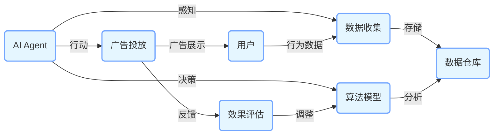

# AI Agent在广告投放中的精准定位

> 关键词：AI Agent、广告投放、精准定位、用户画像、算法模型

> 摘要：本文深入探讨了AI Agent在广告投放精准定位方面的应用。首先介绍了相关背景，包括目的范围、预期读者等内容。接着阐述了AI Agent、广告投放精准定位等核心概念及其联系，给出了相应的原理和架构示意图。详细讲解了核心算法原理和具体操作步骤，并结合Python代码进行说明。分析了其中涉及的数学模型和公式，通过实际案例进行举例。在项目实战部分，介绍了开发环境搭建、源代码实现与解读。探讨了AI Agent在广告投放精准定位的实际应用场景，推荐了学习资源、开发工具框架和相关论文著作。最后总结了未来发展趋势与挑战，解答了常见问题，并提供了扩展阅读和参考资料。

## 1. 背景介绍 
### 1.1 目的和范围
在当今数字化营销时代，广告投放面临着诸多挑战，如如何提高广告的精准度、降低成本、提高转化率等。AI Agent作为一种智能技术，为广告投放的精准定位提供了新的解决方案。本文的目的是深入研究AI Agent在广告投放精准定位中的应用原理、方法和实践，探讨其在提高广告效果方面的潜力和价值。

本文的范围涵盖了AI Agent的基本概念、核心算法、数学模型，以及在广告投放精准定位中的具体应用。包括用户画像构建、广告投放策略制定、投放效果评估等方面，同时涉及相关的开发环境搭建、代码实现和实际案例分析。

### 1.2 预期读者
本文预期读者包括广告行业从业者，如广告策划师、投放专员等，他们可以通过本文了解如何利用AI Agent提升广告投放的精准度和效果；人工智能领域的开发者和研究人员，能够从中获取关于AI Agent在广告场景应用的思路和技术细节；市场营销专业的学生和研究人员，有助于他们深入理解数字化营销中智能技术的应用原理和方法。

### 1.3 文档结构概述
本文共分为十个部分。第一部分为背景介绍，阐述了文章的目的、范围、预期读者和文档结构；第二部分介绍核心概念与联系，包括AI Agent和广告投放精准定位的原理、架构及它们之间的关系；第三部分讲解核心算法原理和具体操作步骤，并给出Python代码示例；第四部分分析数学模型和公式，通过实例进行详细说明；第五部分进行项目实战，包括开发环境搭建、源代码实现和代码解读；第六部分探讨实际应用场景；第七部分推荐相关的学习资源、开发工具框架和论文著作；第八部分总结未来发展趋势与挑战；第九部分解答常见问题；第十部分提供扩展阅读和参考资料。

### 1.4 术语表
#### 1.4.1 核心术语定义
- **AI Agent**：人工智能代理，是一种能够感知环境、自主决策并执行相应动作的智能实体。它可以根据预设的目标和规则，在特定环境中自主地完成任务。
- **广告投放精准定位**：指根据目标受众的特征、兴趣、行为等信息，将广告准确地投放到合适的用户群体面前，以提高广告的效果和转化率。
- **用户画像**：是对用户特征、行为、兴趣等信息的抽象和建模，通过一系列的标签和数据来描述用户的全貌，为广告投放精准定位提供依据。

#### 1.4.2 相关概念解释
- **机器学习**：是一门多领域交叉学科，涉及概率论、统计学、逼近论、凸分析、算法复杂度理论等多门学科。它专门研究计算机怎样模拟或实现人类的学习行为，以获取新的知识或技能，重新组织已有的知识结构使之不断改善自身的性能。在AI Agent和广告投放精准定位中，机器学习用于训练模型，以实现对用户的预测和分类。
- **深度学习**：是机器学习的一个分支领域，它是一种基于对数据进行表征学习的方法。深度学习通过构建具有多个层次的神经网络，自动从大量数据中学习特征和模式，在图像识别、语音识别、自然语言处理等领域取得了显著的成果。在广告投放精准定位中，深度学习可用于处理复杂的用户数据，提高定位的准确性。

#### 1.4.3 缩略词列表
- **ML**：Machine Learning，机器学习
- **DL**：Deep Learning，深度学习
- **CTR**：Click - Through Rate，点击率
- **CVR**：Conversion Rate，转化率

## 2. 核心概念与联系 

### 核心概念原理
#### AI Agent原理
AI Agent的核心原理基于感知、决策和行动三个环节。感知环节，AI Agent通过各种传感器或数据接口获取环境信息，例如在广告投放场景中，它可以收集用户的浏览历史、搜索记录、购买行为等数据。决策环节，AI Agent利用内置的算法和模型对感知到的信息进行分析和处理，根据预设的目标和规则做出决策，如确定广告投放的目标用户群体、投放时间和投放渠道等。行动环节，AI Agent根据决策结果执行相应的动作，将广告投放到目标用户面前。

#### 广告投放精准定位原理
广告投放精准定位的原理是基于对用户特征和行为的深入分析。通过收集用户的多维度数据，如年龄、性别、地域、兴趣爱好、消费习惯等，构建用户画像。然后根据广告的目标和特点，将广告与合适的用户画像进行匹配，从而实现精准投放。例如，一款针对年轻女性的时尚化妆品广告，可以通过分析用户画像，将广告投放到年龄在18 - 35岁、对时尚美妆感兴趣的女性用户群体中。

### 架构示意图


这个架构图展示了AI Agent在广告投放精准定位中的工作流程。AI Agent首先通过数据收集模块感知用户的行为数据，并将其存储在数据仓库中。然后利用算法模型对数据进行分析和决策，确定广告投放策略。最后通过广告投放模块将广告展示给用户，并对投放效果进行评估。根据评估结果，对算法模型进行调整，以不断优化广告投放的精准度。

### 核心概念联系
AI Agent是实现广告投放精准定位的关键技术手段。AI Agent通过感知用户数据、运用算法模型进行决策，能够准确地识别目标用户群体，制定合适的广告投放策略，从而实现广告的精准定位。而广告投放精准定位为AI Agent提供了应用场景和目标，促使AI Agent不断优化自身的算法和决策能力，以提高广告投放的效果。

## 3. 核心算法原理 & 具体操作步骤 

### 核心算法原理
在AI Agent进行广告投放精准定位时，常用的算法包括逻辑回归、决策树、神经网络等。这里以逻辑回归算法为例进行详细讲解。

逻辑回归是一种广义线性模型，用于解决二分类问题。在广告投放精准定位中，可以将用户是否会点击广告作为二分类问题，即点击（1）和不点击（0）。逻辑回归通过对输入特征进行线性组合，然后通过逻辑函数将线性组合的结果映射到[0, 1]区间，得到用户点击广告的概率。

逻辑函数的公式为：
$$\sigma(z)=\frac{1}{1 + e^{-z}}$$
其中，$z$ 是输入特征的线性组合，即 $z = \theta_0 + \theta_1x_1 + \theta_2x_2 + \cdots + \theta_nx_n$，$\theta_i$ 是模型的参数，$x_i$ 是输入特征。

### 具体操作步骤
#### 步骤1：数据准备
收集用户的多维度数据，包括年龄、性别、地域、浏览历史、搜索记录等。对数据进行清洗和预处理，去除缺失值、异常值，对数据进行归一化处理。

#### 步骤2：特征选择
从预处理后的数据中选择与广告投放相关的特征。可以使用相关性分析、特征重要性排序等方法进行特征选择，以减少特征维度，提高模型的训练效率和准确性。

#### 步骤3：模型训练
将数据集划分为训练集和测试集，使用训练集对逻辑回归模型进行训练。通过最小化损失函数来更新模型的参数 $\theta_i$。常用的损失函数是对数损失函数：
$$L(\theta)=-\frac{1}{m}\sum_{i = 1}^{m}[y^{(i)}\log(\sigma(z^{(i)}))+(1 - y^{(i)})\log(1 - \sigma(z^{(i)}))]$$
其中，$m$ 是样本数量，$y^{(i)}$ 是第 $i$ 个样本的真实标签，$\sigma(z^{(i)})$ 是第 $i$ 个样本的预测概率。

#### 步骤4：模型评估
使用测试集对训练好的模型进行评估，计算模型的准确率、召回率、F1值等指标，以评估模型的性能。

#### 步骤5：广告投放决策
根据模型预测的用户点击广告的概率，制定广告投放策略。例如，将概率大于某个阈值的用户作为目标用户，将广告投放到这些用户面前。

### Python代码实现
```python
import numpy as np
from sklearn.linear_model import LogisticRegression
from sklearn.model_selection import train_test_split
from sklearn.metrics import accuracy_score

# 生成示例数据
np.random.seed(0)
X = np.random.randn(100, 5)
y = np.random.randint(0, 2, 100)

# 划分训练集和测试集
X_train, X_test, y_train, y_test = train_test_split(X, y, test_size=0.2, random_state=42)

# 创建逻辑回归模型
model = LogisticRegression()

# 模型训练
model.fit(X_train, y_train)

# 模型预测
y_pred = model.predict(X_test)

# 模型评估
accuracy = accuracy_score(y_test, y_pred)
print(f"模型准确率: {accuracy}")
```

在这段代码中，首先生成了示例数据，然后将数据划分为训练集和测试集。接着创建了逻辑回归模型，并使用训练集对模型进行训练。最后使用测试集对模型进行预测，并计算模型的准确率。

## 4. 数学模型和公式 & 详细讲解 & 举例说明 

### 逻辑回归数学模型
逻辑回归的数学模型可以表示为：
$$P(y = 1|x)=\frac{1}{1 + e^{-(\theta_0+\theta_1x_1+\theta_2x_2+\cdots+\theta_nx_n)}}$$
其中，$P(y = 1|x)$ 表示在输入特征 $x=(x_1,x_2,\cdots,x_n)$ 的条件下，用户点击广告（$y = 1$）的概率。$\theta_0,\theta_1,\cdots,\theta_n$ 是模型的参数，需要通过训练数据进行学习。

### 损失函数推导
为了学习模型的参数 $\theta_i$，需要定义一个损失函数来衡量模型预测结果与真实标签之间的差异。对数损失函数是逻辑回归中常用的损失函数，其推导过程如下：

假设样本的真实标签为 $y\in\{0, 1\}$，模型预测的概率为 $P(y = 1|x)=\hat{y}$，则样本的损失函数可以表示为：
$$l(\hat{y},y)=-y\log(\hat{y})-(1 - y)\log(1 - \hat{y})$$
当 $y = 1$ 时，$l(\hat{y},y)=-\log(\hat{y})$，表示预测概率 $\hat{y}$ 越接近 1，损失越小；当 $y = 0$ 时，$l(\hat{y},y)=-\log(1 - \hat{y})$，表示预测概率 $\hat{y}$ 越接近 0，损失越小。

对于整个训练数据集，损失函数为所有样本损失的平均值：
$$L(\theta)=-\frac{1}{m}\sum_{i = 1}^{m}[y^{(i)}\log(\sigma(z^{(i)}))+(1 - y^{(i)})\log(1 - \sigma(z^{(i)}))]$$
其中，$m$ 是样本数量，$y^{(i)}$ 是第 $i$ 个样本的真实标签，$\sigma(z^{(i)})$ 是第 $i$ 个样本的预测概率。

### 梯度下降法更新参数
为了最小化损失函数 $L(\theta)$，可以使用梯度下降法来更新模型的参数 $\theta_i$。梯度下降法的更新公式为：
$$\theta_j:=\theta_j-\alpha\frac{\partial L(\theta)}{\partial\theta_j}$$
其中，$\alpha$ 是学习率，控制参数更新的步长。$\frac{\partial L(\theta)}{\partial\theta_j}$ 是损失函数 $L(\theta)$ 关于参数 $\theta_j$ 的偏导数。

对损失函数 $L(\theta)$ 求偏导数：
$$\frac{\partial L(\theta)}{\partial\theta_j}=\frac{1}{m}\sum_{i = 1}^{m}(\sigma(z^{(i)})-y^{(i)})x_j^{(i)}$$

### 举例说明
假设我们有一个简单的广告投放数据集，包含两个特征：用户的年龄 $x_1$ 和浏览时长 $x_2$，以及用户是否点击广告的标签 $y$。数据集如下：

| 年龄 $x_1$ | 浏览时长 $x_2$ | 是否点击广告 $y$ |
| --- | --- | --- |
| 25 | 10 | 1 |
| 30 | 5 | 0 |
| 20 | 15 | 1 |
| 35 | 3 | 0 |

首先，对数据进行预处理，将年龄和浏览时长进行归一化处理。然后，使用逻辑回归模型进行训练。假设初始参数 $\theta_0 = 0$，$\theta_1 = 0$，$\theta_2 = 0$，学习率 $\alpha = 0.1$。

在第一次迭代中，计算 $z^{(i)}=\theta_0+\theta_1x_1^{(i)}+\theta_2x_2^{(i)}$ 和 $\sigma(z^{(i)})$，然后根据梯度下降法更新参数 $\theta_j$。重复这个过程，直到损失函数收敛或达到最大迭代次数。

最后，得到训练好的模型参数 $\theta_0$，$\theta_1$，$\theta_2$，可以用于预测新用户是否会点击广告。

## 5. 项目实战：代码实际案例和详细解释说明 

### 5.1  开发环境搭建
#### 操作系统
建议使用Linux系统，如Ubuntu 18.04及以上版本，因为Linux系统在开发和部署方面具有良好的稳定性和兼容性。

#### 编程语言
使用Python 3.7及以上版本，Python具有丰富的科学计算库和机器学习库，非常适合用于AI Agent和广告投放精准定位的开发。

#### 开发工具
可以使用Anaconda来管理Python环境和安装相关库。Anaconda是一个开源的Python发行版本，包含了Python、conda和许多常用的科学计算库。安装Anaconda后，可以创建一个新的虚拟环境：
```bash
conda create -n ad_agent python=3.8
conda activate ad_agent
```

#### 相关库安装
在虚拟环境中安装必要的库，包括`pandas`用于数据处理，`scikit-learn`用于机器学习模型训练和评估，`matplotlib`用于数据可视化：
```bash
pip install pandas scikit-learn matplotlib
```

### 5.2  源代码详细实现和代码解读
以下是一个完整的广告投放精准定位项目的Python代码示例：

```python
import pandas as pd
from sklearn.model_selection import train_test_split
from sklearn.linear_model import LogisticRegression
from sklearn.metrics import accuracy_score, confusion_matrix
import matplotlib.pyplot as plt

# 读取数据集
data = pd.read_csv('ad_data.csv')

# 数据预处理
# 假设数据集包含特征列 'age', 'gender', 'browse_time', 'purchase_history' 和目标列 'click'
X = data[['age', 'gender', 'browse_time', 'purchase_history']]
y = data['click']

# 处理分类特征
X = pd.get_dummies(X, columns=['gender'])

# 划分训练集和测试集
X_train, X_test, y_train, y_test = train_test_split(X, y, test_size=0.2, random_state=42)

# 创建逻辑回归模型
model = LogisticRegression()

# 模型训练
model.fit(X_train, y_train)

# 模型预测
y_pred = model.predict(X_test)

# 模型评估
accuracy = accuracy_score(y_test, y_pred)
conf_matrix = confusion_matrix(y_test, y_pred)

print(f"模型准确率: {accuracy}")
print(f"混淆矩阵:\n{conf_matrix}")

# 可视化混淆矩阵
plt.imshow(conf_matrix, interpolation='nearest', cmap=plt.cm.Blues)
plt.title('Confusion matrix')
plt.colorbar()
tick_marks = [0, 1]
plt.xticks(tick_marks, ['Not Click', 'Click'])
plt.yticks(tick_marks, ['Not Click', 'Click'])

thresh = conf_matrix.max() / 2.
for i in range(conf_matrix.shape[0]):
    for j in range(conf_matrix.shape[1]):
        plt.text(j, i, format(conf_matrix[i, j], 'd'),
                 horizontalalignment="center",
                 color="white" if conf_matrix[i, j] > thresh else "black")

plt.tight_layout()
plt.ylabel('True label')
plt.xlabel('Predicted label')
plt.show()
```

### 代码解读与分析
#### 数据读取和预处理
```python
data = pd.read_csv('ad_data.csv')
X = data[['age', 'gender', 'browse_time', 'purchase_history']]
y = data['click']
X = pd.get_dummies(X, columns=['gender'])
```
这段代码首先使用`pandas`库读取数据集`ad_data.csv`。然后将特征列和目标列分别赋值给`X`和`y`。对于分类特征`gender`，使用`pd.get_dummies`函数进行独热编码，将其转换为数值特征。

#### 数据集划分
```python
X_train, X_test, y_train, y_test = train_test_split(X, y, test_size=0.2, random_state=42)
```
使用`train_test_split`函数将数据集划分为训练集和测试集，测试集占比为20%。

#### 模型创建和训练
```python
model = LogisticRegression()
model.fit(X_train, y_train)
```
创建逻辑回归模型，并使用训练集对模型进行训练。

#### 模型预测和评估
```python
y_pred = model.predict(X_test)
accuracy = accuracy_score(y_test, y_pred)
conf_matrix = confusion_matrix(y_test, y_pred)
```
使用训练好的模型对测试集进行预测，并计算模型的准确率和混淆矩阵。

#### 可视化混淆矩阵
```python
plt.imshow(conf_matrix, interpolation='nearest', cmap=plt.cm.Blues)
# 后续代码省略
```
使用`matplotlib`库可视化混淆矩阵，直观地展示模型的预测结果。

## 6. 实际应用场景 
### 搜索引擎广告
在搜索引擎广告中，AI Agent可以根据用户的搜索关键词、搜索历史、地理位置等信息，精准地定位目标用户。例如，当用户在搜索引擎中输入“运动鞋”时，AI Agent可以分析用户的搜索意图和特征，将相关的运动鞋广告投放到该用户的搜索结果页面中。同时，AI Agent可以实时调整广告投放策略，根据用户的点击行为和转化率，优化广告的展示顺序和出价，提高广告的效果和投资回报率。

### 社交媒体广告
社交媒体平台拥有大量的用户数据，包括用户的个人信息、兴趣爱好、社交关系等。AI Agent可以利用这些数据构建用户画像，实现广告的精准定位。例如，在Facebook、Instagram等社交媒体平台上，AI Agent可以根据用户的兴趣标签，将化妆品、时尚服饰等广告推送给感兴趣的用户。此外，AI Agent还可以通过分析用户的社交互动行为，如点赞、评论、分享等，进一步优化广告投放策略，提高广告的传播效果。

### 电商平台广告
在电商平台上，AI Agent可以根据用户的浏览历史、购买记录、收藏夹等信息，为用户推荐个性化的商品广告。例如，当用户在淘宝、京东等电商平台上浏览了某一款手机后，AI Agent可以将相关的手机配件、手机保护套等广告推荐给该用户。同时，AI Agent可以根据用户的购物车情况，在用户即将结算时，推送优惠券、满减活动等广告，提高用户的购买转化率。

### 视频广告
在视频平台上，AI Agent可以根据用户的观看历史、视频偏好、观看时长等信息，实现广告的精准投放。例如，在抖音、爱奇艺等视频平台上，AI Agent可以将汽车、旅游等广告推送给喜欢观看相关视频的用户。此外，AI Agent还可以根据视频内容进行广告匹配，在视频播放过程中插入与视频内容相关的广告，提高广告的相关性和用户体验。

## 7. 工具和资源推荐
### 7.1 学习资源推荐
#### 7.1.1 书籍推荐
- 《Python机器学习》：本书详细介绍了Python在机器学习领域的应用，包括数据预处理、模型选择、评估和优化等方面的内容，适合初学者入门。
- 《深度学习》：由深度学习领域的三位先驱Ian Goodfellow、Yoshua Bengio和Aaron Courville撰写，是深度学习领域的经典教材，涵盖了深度学习的基本原理、算法和应用。
- 《广告营销：数字时代的策略与实践》：本书介绍了数字时代广告营销的理论和实践，包括广告投放策略、用户洞察、效果评估等方面的内容，有助于读者了解广告投放的业务知识。

#### 7.1.2 在线课程
- Coursera上的“机器学习”课程：由斯坦福大学教授Andrew Ng授课，是机器学习领域的经典课程，涵盖了机器学习的基本算法和应用。
- edX上的“深度学习微硕士学位项目”：提供了深度学习的系统学习课程，包括神经网络、卷积神经网络、循环神经网络等内容。
- Udemy上的“Python for Data Science and Machine Learning Bootcamp”：该课程结合Python和机器学习库，讲解数据科学和机器学习的实际应用，适合初学者学习。

#### 7.1.3 技术博客和网站
- Medium：是一个技术博客平台，上面有许多关于人工智能、机器学习和广告投放的优质文章。
- Towards Data Science：专注于数据科学和机器学习领域的技术博客，提供了许多实用的教程和案例分析。
- AdExchanger：是一个广告技术行业的资讯网站，提供了广告投放、广告技术、市场趋势等方面的最新信息。

### 7.2 开发工具框架推荐
#### 7.2.1 IDE和编辑器
- PyCharm：是一款专业的Python集成开发环境，具有代码编辑、调试、版本控制等功能，适合Python开发。
- Jupyter Notebook：是一个交互式的开发环境，支持Python、R等多种编程语言，适合数据探索和模型开发。
- Visual Studio Code：是一款轻量级的代码编辑器，支持多种编程语言和插件，具有良好的扩展性。

#### 7.2.2 调试和性能分析工具
- TensorBoard：是TensorFlow提供的可视化工具，可以用于监控模型的训练过程、可视化模型结构和分析模型性能。
- Scikit-learn的`cross_val_score`函数：可以用于交叉验证模型的性能，评估模型的稳定性和泛化能力。
- Py-Spy：是一个Python性能分析工具，可以实时监控Python程序的CPU使用率和内存占用情况，帮助开发者找出性能瓶颈。

#### 7.2.3 相关框架和库
- TensorFlow：是一个开源的机器学习框架，提供了丰富的工具和接口，支持深度学习模型的开发和训练。
- PyTorch：是另一个流行的深度学习框架，具有动态图机制，易于使用和调试。
- Scikit-learn：是一个简单易用的机器学习库，提供了多种机器学习算法和工具，适合初学者和快速开发。

### 7.3 相关论文著作推荐
#### 7.3.1 经典论文
- “The Elements of Statistical Learning”：介绍了统计学习的基本理论和方法，是机器学习领域的经典著作。
- “Neural Networks and Deep Learning”：由Michael Nielsen撰写，详细介绍了神经网络和深度学习的原理和应用。
- “Click-Through Rate Prediction for Sponsored Search Advertising in Taobao”：该论文介绍了淘宝在搜索引擎广告中点击率预测的方法和实践。

#### 7.3.2 最新研究成果
- 在ACM SIGKDD、NeurIPS、ICML等顶级学术会议上，有许多关于人工智能、机器学习和广告投放的最新研究成果。可以关注这些会议的论文集，了解最新的技术和方法。
- 一些知名的学术期刊，如Journal of Machine Learning Research、Artificial Intelligence等，也会发表相关的研究论文。

#### 7.3.3 应用案例分析
- 《AI in Marketing: Real-World Strategies for Data-Driven Growth》：本书介绍了人工智能在市场营销中的应用案例和策略，包括广告投放、用户细分、个性化推荐等方面的内容。
- 一些科技公司的官方博客，如Google、Facebook、阿里巴巴等，会分享他们在广告投放和人工智能应用方面的实践经验和案例分析。

## 8. 总结：未来发展趋势与挑战
### 未来发展趋势
#### 多模态数据融合
未来，AI Agent在广告投放精准定位中将越来越多地融合多模态数据，如文本、图像、音频、视频等。通过对多模态数据的分析和处理，可以更全面地了解用户的特征和兴趣，提高广告投放的精准度。例如，结合用户在社交媒体上发布的图片和文字信息，分析用户的生活方式和消费偏好，为用户推送更符合其需求的广告。

#### 强化学习应用
强化学习作为一种能够在动态环境中进行决策的机器学习方法，将在广告投放中得到更广泛的应用。AI Agent可以通过强化学习不断优化广告投放策略，根据广告投放的实时反馈调整投放参数，以最大化广告的收益。例如，在广告投放过程中，AI Agent可以根据用户的点击、转化等行为，实时调整广告的出价和展示位置。

#### 隐私保护下的精准定位
随着用户对隐私保护的关注度不断提高，未来AI Agent需要在保护用户隐私的前提下实现广告投放的精准定位。差分隐私、联邦学习等技术将被广泛应用，确保在不泄露用户敏感信息的情况下，利用用户数据进行广告投放。例如，通过联邦学习技术，多个广告投放平台可以在不共享用户原始数据的情况下，共同训练模型，提高广告投放的效果。

### 挑战
#### 数据质量和多样性
广告投放精准定位依赖于大量高质量、多样化的数据。然而，实际应用中往往存在数据质量不高、数据缺失、数据偏差等问题。此外，不同平台和数据源的数据格式和标准不一致，也给数据整合和分析带来了挑战。因此，如何提高数据质量、增加数据多样性，是未来需要解决的重要问题。

#### 模型解释性
深度学习模型在广告投放精准定位中取得了良好的效果，但这些模型往往是黑盒模型，缺乏解释性。广告投放决策需要向广告主和监管机构进行解释，因此如何提高模型的解释性，让模型的决策过程可理解、可解释，是当前面临的挑战之一。

#### 竞争和市场变化
广告投放市场竞争激烈，技术和市场环境变化快速。新的广告形式、投放渠道和竞争对手不断涌现，AI Agent需要不断适应市场变化，优化自身的算法和策略，以保持竞争力。同时，广告投放的法律法规和监管政策也在不断完善，如何遵守相关规定，确保广告投放的合法性和合规性，也是需要面对的挑战。

## 9. 附录：常见问题与解答
### 问题1：AI Agent在广告投放精准定位中需要哪些数据？
AI Agent在广告投放精准定位中需要多维度的数据，包括用户的基本信息（如年龄、性别、地域等）、行为数据（如浏览历史、搜索记录、购买行为等）、兴趣爱好（如关注的话题、喜欢的品牌等）。此外，还可以结合上下文数据，如广告投放的时间、地点、场景等，提高广告投放的精准度。

### 问题2：如何评估AI Agent在广告投放精准定位中的效果？
可以从多个方面评估AI Agent在广告投放精准定位中的效果。常用的指标包括点击率（CTR）、转化率（CVR）、广告投资回报率（ROI）等。点击率反映了广告被用户点击的比例，转化率衡量了用户从点击广告到完成目标行为（如购买、注册等）的比例，广告投资回报率则评估了广告投放的收益与成本的关系。此外，还可以通过用户反馈、市场调研等方式，了解用户对广告的满意度和认可度。

### 问题3：AI Agent在广告投放精准定位中会侵犯用户隐私吗？
AI Agent本身不会侵犯用户隐私，但在数据收集和使用过程中需要遵循相关的法律法规和隐私政策。在收集用户数据时，需要获得用户的明确授权，并采取必要的安全措施保护用户数据的安全。同时，可以采用差分隐私、联邦学习等技术，在保护用户隐私的前提下进行广告投放精准定位。

### 问题4：如何选择适合的AI Agent算法和模型？
选择适合的AI Agent算法和模型需要考虑多个因素，包括数据的特点、问题的复杂度、计算资源的限制等。对于简单的二分类问题，可以选择逻辑回归、决策树等算法；对于复杂的非线性问题，可以选择神经网络、深度学习模型等。此外，还可以通过交叉验证、模型评估等方法，比较不同算法和模型的性能，选择最优的模型。

## 10. 扩展阅读 & 参考资料
### 扩展阅读
- 《人工智能时代的营销革命》：本书探讨了人工智能在营销领域的应用和变革，包括广告投放、客户关系管理、营销自动化等方面的内容。
- 《数据驱动的营销：从洞察到行动》：介绍了如何利用数据驱动营销决策，包括数据收集、分析、挖掘和应用等方面的方法和技巧。
- 《营销大数据：方法与实践》：详细讲解了营销大数据的处理和分析方法，以及在广告投放、市场细分、客户画像等方面的应用案例。

### 参考资料
- 《Python数据分析实战》：提供了Python在数据分析领域的实践案例和代码示例，有助于读者掌握数据处理和分析的方法。
- 《机器学习实战》：通过实际案例介绍了机器学习算法的实现和应用，适合初学者学习机器学习。
- 相关学术期刊和会议论文，如ACM SIGKDD、NeurIPS、ICML等会议的论文集，以及Journal of Machine Learning Research、Artificial Intelligence等期刊的文章。

作者：AI天才研究院/AI Genius Institute & 禅与计算机程序设计艺术 /Zen And The Art of Computer Programming