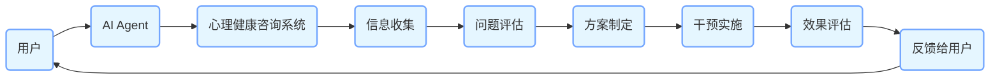

# AI Agent在心理健康咨询中的应用与局限

> 关键词：AI Agent、心理健康咨询、应用、局限、自然语言处理

> 摘要：本文深入探讨了AI Agent在心理健康咨询领域的应用与局限。首先介绍了研究的背景、目的、预期读者等信息，接着阐述了AI Agent及心理健康咨询的核心概念与联系，详细讲解了相关核心算法原理及具体操作步骤，分析了其中涉及的数学模型和公式。通过项目实战展示了AI Agent在心理健康咨询中的代码实现与解读。同时探讨了其实际应用场景，推荐了相关的学习资源、开发工具框架和论文著作。最后总结了未来发展趋势与挑战，并对常见问题进行了解答，为进一步研究和应用AI Agent于心理健康咨询提供了全面的参考。

## 1. 背景介绍 
### 1.1 目的和范围
随着社会压力的不断增大，心理健康问题日益受到关注。传统的心理健康咨询服务面临着资源有限、成本较高等问题。AI Agent作为一种新兴技术，具有快速响应、可随时提供服务等优势，有望为心理健康咨询带来新的解决方案。本文旨在深入研究AI Agent在心理健康咨询中的应用，分析其优势和局限性，探讨其未来发展方向。研究范围涵盖AI Agent的核心技术、在心理健康咨询中的具体应用场景、相关算法和数学模型，以及实际项目中的代码实现等方面。

### 1.2 预期读者
本文预期读者包括心理健康领域的专业人士，如心理咨询师、心理治疗师等，他们可以通过了解AI Agent的应用，为其咨询工作提供新的思路和工具；计算机科学领域的研究人员和开发者，他们可以从本文中获取AI Agent在心理健康咨询领域的具体应用场景和技术需求，为进一步的技术研发提供参考；对心理健康和人工智能交叉领域感兴趣的普通读者，通过阅读本文可以了解该领域的前沿动态和发展趋势。

### 1.3 文档结构概述
本文共分为十个部分。第一部分为背景介绍，包括目的和范围、预期读者、文档结构概述和术语表。第二部分阐述核心概念与联系，介绍AI Agent和心理健康咨询的相关概念及其之间的联系，并通过文本示意图和Mermaid流程图进行说明。第三部分讲解核心算法原理及具体操作步骤，结合Python源代码进行详细阐述。第四部分分析数学模型和公式，通过具体例子进行说明。第五部分进行项目实战，包括开发环境搭建、源代码详细实现和代码解读。第六部分探讨实际应用场景。第七部分推荐相关的学习资源、开发工具框架和论文著作。第八部分总结未来发展趋势与挑战。第九部分为附录，解答常见问题。第十部分提供扩展阅读和参考资料。

### 1.4 术语表
#### 1.4.1 核心术语定义
- **AI Agent（人工智能代理）**：是一种能够感知环境、进行决策并采取行动以实现特定目标的人工智能实体。它可以通过自然语言处理技术与用户进行交互，为用户提供信息和服务。
- **心理健康咨询**：是指运用心理学的方法，对心理适应方面出现问题并企求解决问题的求询者提供心理援助的过程。
- **自然语言处理（NLP）**：是计算机科学、人工智能和语言学交叉领域的一个重要研究方向，主要研究如何让计算机理解和处理人类语言。

#### 1.4.2 相关概念解释
- **情感分析**：是自然语言处理中的一项重要任务，旨在识别文本中表达的情感倾向，如积极、消极或中性。在心理健康咨询中，情感分析可以帮助AI Agent了解用户的情绪状态。
- **知识图谱**：是一种语义网络，用于表示实体之间的关系和知识。在心理健康咨询中，知识图谱可以存储心理健康领域的专业知识，为AI Agent提供决策支持。

#### 1.4.3 缩略词列表
- **NLP**：Natural Language Processing（自然语言处理）
- **ML**：Machine Learning（机器学习）
- **DL**：Deep Learning（深度学习）

## 2. 核心概念与联系 

### 2.1 AI Agent的概念原理
AI Agent是一种基于人工智能技术的智能实体，它具有感知、决策和行动的能力。AI Agent通过传感器感知环境信息，然后根据预设的目标和规则进行决策，最后通过执行器采取相应的行动。在心理健康咨询中，AI Agent可以通过自然语言处理技术感知用户的问题和情绪，根据心理健康领域的知识和算法进行决策，为用户提供咨询建议和心理支持。

### 2.2 心理健康咨询的概念原理
心理健康咨询是一个专业的过程，咨询师通过与来访者建立良好的关系，运用心理学的理论和方法，帮助来访者了解自己的心理问题，找到解决问题的方法，提高心理健康水平。心理健康咨询的过程包括收集信息、评估问题、制定方案、实施干预和评估效果等环节。

### 2.3 AI Agent与心理健康咨询的联系
AI Agent可以为心理健康咨询提供支持和补充。一方面，AI Agent可以通过自然语言处理技术与用户进行交互，收集用户的信息，为咨询师提供参考。另一方面，AI Agent可以根据心理健康领域的知识和算法，为用户提供初步的咨询建议和心理支持，缓解用户的心理压力。同时，AI Agent还可以通过大数据分析和机器学习技术，为心理健康咨询提供个性化的服务。

### 2.4 文本示意图
```plaintext
           +------------------+
           |    AI Agent      |
           |------------------|
           | 自然语言处理     |
           | 知识图谱         |
           | 机器学习算法     |
           +------------------+
                  |
                  |
                  v
           +------------------+
           | 心理健康咨询系统 |
           |------------------|
           | 信息收集         |
           | 问题评估         |
           | 方案制定         |
           | 干预实施         |
           | 效果评估         |
           +------------------+
                  |
                  |
                  v
           +------------------+
           |    用户           |
           |------------------|
           | 心理问题咨询     |
           | 情绪表达         |
           | 反馈与评价       |
           +------------------+
```

### 2.5 Mermaid流程图


## 3. 核心算法原理 & 具体操作步骤 

### 3.1 自然语言处理算法原理
自然语言处理是AI Agent在心理健康咨询中实现与用户交互的关键技术。常见的自然语言处理算法包括词法分析、句法分析、语义分析和情感分析等。

#### 3.1.1 词法分析
词法分析是将文本拆分成一个个单词或词元的过程。在Python中，可以使用`jieba`库进行中文词法分析。以下是一个简单的示例代码：
```python
import jieba

text = "我最近心情很不好"
words = jieba.lcut(text)
print(words)
```
#### 3.1.2 句法分析
句法分析是分析句子的语法结构，确定句子中各个成分之间的关系。在Python中，可以使用`stanfordnlp`库进行句法分析。以下是一个简单的示例代码：
```python
import stanfordnlp

nlp = stanfordnlp.Pipeline(lang='zh')
doc = nlp("我最近心情很不好")
for sentence in doc.sentences:
    for word in sentence.words:
        print(f'词: {word.text}, 词性: {word.upos}, 依存关系: {word.dependency_relation}')
```
#### 3.1.3 语义分析
语义分析是理解文本的含义，确定文本所表达的主题和意图。在Python中，可以使用`Word2Vec`模型进行语义分析。以下是一个简单的示例代码：
```python
from gensim.models import Word2Vec

sentences = [["我", "最近", "心情", "很", "不好"], ["我", "需要", "一些", "心理", "支持"]]
model = Word2Vec(sentences, min_count=1)
similar_words = model.wv.most_similar('心情')
print(similar_words)
```
#### 3.1.4 情感分析
情感分析是识别文本中表达的情感倾向，如积极、消极或中性。在Python中，可以使用`snownlp`库进行情感分析。以下是一个简单的示例代码：
```python
from snownlp import SnowNLP

text = "我最近心情很不好"
s = SnowNLP(text)
sentiment = s.sentiments
if sentiment > 0.5:
    print("积极情感")
elif sentiment < 0.5:
    print("消极情感")
else:
    print("中性情感")
```

### 3.2 机器学习算法原理
机器学习算法可以帮助AI Agent从大量的数据中学习规律，提高其在心理健康咨询中的决策能力。常见的机器学习算法包括决策树、支持向量机、神经网络等。

#### 3.2.1 决策树算法
决策树是一种基于树结构进行决策的机器学习算法。在Python中，可以使用`scikit-learn`库实现决策树算法。以下是一个简单的示例代码：
```python
from sklearn.datasets import load_iris
from sklearn.tree import DecisionTreeClassifier
from sklearn.model_selection import train_test_split

# 加载数据集
iris = load_iris()
X = iris.data
y = iris.target

# 划分训练集和测试集
X_train, X_test, y_train, y_test = train_test_split(X, y, test_size=0.3, random_state=42)

# 创建决策树分类器
clf = DecisionTreeClassifier()

# 训练模型
clf.fit(X_train, y_train)

# 预测
y_pred = clf.predict(X_test)

# 评估模型
from sklearn.metrics import accuracy_score
accuracy = accuracy_score(y_test, y_pred)
print(f"准确率: {accuracy}")
```
#### 3.2.2 支持向量机算法
支持向量机是一种用于分类和回归分析的监督学习算法。在Python中，可以使用`scikit-learn`库实现支持向量机算法。以下是一个简单的示例代码：
```python
from sklearn.datasets import load_iris
from sklearn.svm import SVC
from sklearn.model_selection import train_test_split

# 加载数据集
iris = load_iris()
X = iris.data
y = iris.target

# 划分训练集和测试集
X_train, X_test, y_train, y_test = train_test_split(X, y, test_size=0.3, random_state=42)

# 创建支持向量机分类器
clf = SVC()

# 训练模型
clf.fit(X_train, y_train)

# 预测
y_pred = clf.predict(X_test)

# 评估模型
from sklearn.metrics import accuracy_score
accuracy = accuracy_score(y_test, y_pred)
print(f"准确率: {accuracy}")
```
#### 3.2.3 神经网络算法
神经网络是一种模仿人类神经系统的机器学习算法。在Python中，可以使用`TensorFlow`或`PyTorch`库实现神经网络算法。以下是一个使用`TensorFlow`实现简单神经网络的示例代码：
```python
import tensorflow as tf
from tensorflow.keras.datasets import mnist
from tensorflow.keras.models import Sequential
from tensorflow.keras.layers import Dense, Flatten

# 加载数据集
(x_train, y_train), (x_test, y_test) = mnist.load_data()

# 数据预处理
x_train = x_train / 255.0
x_test = x_test / 255.0

# 创建神经网络模型
model = Sequential([
    Flatten(input_shape=(28, 28)),
    Dense(128, activation='relu'),
    Dense(10, activation='softmax')
])

# 编译模型
model.compile(optimizer='adam',
              loss='sparse_categorical_crossentropy',
              metrics=['accuracy'])

# 训练模型
model.fit(x_train, y_train, epochs=5)

# 评估模型
test_loss, test_acc = model.evaluate(x_test, y_test)
print(f"测试准确率: {test_acc}")
```

### 3.3 具体操作步骤
#### 3.3.1 数据收集
收集心理健康咨询领域的相关数据，包括咨询记录、案例分析、心理学文献等。这些数据可以用于训练AI Agent的模型。

#### 3.3.2 数据预处理
对收集到的数据进行预处理，包括清洗、标注、分词等操作。数据预处理可以提高数据的质量，为模型训练提供更好的输入。

#### 3.3.3 模型训练
选择合适的机器学习算法，使用预处理后的数据对模型进行训练。在训练过程中，需要调整模型的参数，以提高模型的性能。

#### 3.3.4 模型评估
使用测试数据集对训练好的模型进行评估，计算模型的准确率、召回率、F1值等指标。根据评估结果，对模型进行优化和改进。

#### 3.3.5 部署和应用
将训练好的模型部署到实际的心理健康咨询系统中，让AI Agent与用户进行交互，为用户提供咨询服务。

## 4. 数学模型和公式 & 详细讲解 & 举例说明 

### 4.1 线性回归模型
线性回归是一种用于预测连续数值的机器学习模型。其数学模型可以表示为：
$$y = \theta_0 + \theta_1x_1 + \theta_2x_2 + \cdots + \theta_nx_n + \epsilon$$
其中，$y$ 是预测值，$x_1, x_2, \cdots, x_n$ 是特征变量，$\theta_0, \theta_1, \theta_2, \cdots, \theta_n$ 是模型的参数，$\epsilon$ 是误差项。

线性回归的目标是找到一组最优的参数 $\theta$，使得预测值 $y$ 与真实值之间的误差最小。通常使用最小二乘法来求解最优参数。最小二乘法的目标函数可以表示为：
$$J(\theta) = \frac{1}{2m}\sum_{i=1}^{m}(h_{\theta}(x^{(i)}) - y^{(i)})^2$$
其中，$m$ 是样本数量，$h_{\theta}(x^{(i)})$ 是第 $i$ 个样本的预测值，$y^{(i)}$ 是第 $i$ 个样本的真实值。

为了求解最优参数 $\theta$，可以对目标函数 $J(\theta)$ 求偏导数，并令其等于零。具体求解过程可以使用梯度下降法等优化算法。

以下是一个使用Python实现线性回归的示例代码：
```python
import numpy as np
import matplotlib.pyplot as plt

# 生成数据集
X = 2 * np.random.rand(100, 1)
y = 4 + 3 * X + np.random.randn(100, 1)

# 添加偏置项
X_b = np.c_[np.ones((100, 1)), X]

# 使用正规方程求解最优参数
theta_best = np.linalg.inv(X_b.T.dot(X_b)).dot(X_b.T).dot(y)

# 绘制数据和拟合直线
plt.plot(X, y, "b.")
plt.plot(X, X_b.dot(theta_best), "r-")
plt.xlabel("$x_1$")
plt.ylabel("$y$")
plt.show()
```

### 4.2 逻辑回归模型
逻辑回归是一种用于分类的机器学习模型。其数学模型可以表示为：
$$h_{\theta}(x) = \frac{1}{1 + e^{-\theta^Tx}}$$
其中，$h_{\theta}(x)$ 是预测值，$\theta$ 是模型的参数，$x$ 是特征变量。

逻辑回归的目标是找到一组最优的参数 $\theta$，使得预测值 $h_{\theta}(x)$ 与真实值之间的误差最小。通常使用对数损失函数来衡量误差。对数损失函数可以表示为：
$$J(\theta) = -\frac{1}{m}\sum_{i=1}^{m}[y^{(i)}\log(h_{\theta}(x^{(i)})) + (1 - y^{(i)})\log(1 - h_{\theta}(x^{(i)}))]$$
其中，$m$ 是样本数量，$y^{(i)}$ 是第 $i$ 个样本的真实值。

为了求解最优参数 $\theta$，可以对目标函数 $J(\theta)$ 求偏导数，并使用梯度下降法等优化算法进行迭代更新。

以下是一个使用Python实现逻辑回归的示例代码：
```python
import numpy as np
import matplotlib.pyplot as plt
from sklearn.datasets import make_classification
from sklearn.linear_model import LogisticRegression

# 生成数据集
X, y = make_classification(n_samples=100, n_features=2, n_informative=2, n_redundant=0, random_state=42)

# 创建逻辑回归模型
clf = LogisticRegression()

# 训练模型
clf.fit(X, y)

# 绘制决策边界
x_min, x_max = X[:, 0].min() - 0.5, X[:, 0].max() + 0.5
y_min, y_max = X[:, 1].min() - 0.5, X[:, 1].max() + 0.5
xx, yy = np.meshgrid(np.arange(x_min, x_max, 0.02),
                     np.arange(y_min, y_max, 0.02))
Z = clf.predict(np.c_[xx.ravel(), yy.ravel()])
Z = Z.reshape(xx.shape)
plt.contourf(xx, yy, Z, alpha=0.4)
plt.scatter(X[:, 0], X[:, 1], c=y, edgecolors='k')
plt.xlabel('Feature 1')
plt.ylabel('Feature 2')
plt.show()
```

### 4.3 神经网络模型
神经网络是一种由多个神经元组成的复杂模型。一个简单的神经网络可以表示为：
$$z^{(l)} = W^{(l)}a^{(l-1)} + b^{(l)}$$
$$a^{(l)} = f(z^{(l)})$$
其中，$z^{(l)}$ 是第 $l$ 层的加权输入，$W^{(l)}$ 是第 $l$ 层的权重矩阵，$a^{(l-1)}$ 是第 $l-1$ 层的输出，$b^{(l)}$ 是第 $l$ 层的偏置向量，$a^{(l)}$ 是第 $l$ 层的输出，$f$ 是激活函数。

神经网络的训练过程通常使用反向传播算法来更新权重和偏置。反向传播算法的核心思想是通过计算损失函数对权重和偏置的梯度，然后使用梯度下降法等优化算法进行更新。

以下是一个使用Python和`TensorFlow`实现简单神经网络的示例代码：
```python
import tensorflow as tf
from tensorflow.keras.datasets import mnist
from tensorflow.keras.models import Sequential
from tensorflow.keras.layers import Dense, Flatten

# 加载数据集
(x_train, y_train), (x_test, y_test) = mnist.load_data()

# 数据预处理
x_train = x_train / 255.0
x_test = x_test / 255.0

# 创建神经网络模型
model = Sequential([
    Flatten(input_shape=(28, 28)),
    Dense(128, activation='relu'),
    Dense(10, activation='softmax')
])

# 编译模型
model.compile(optimizer='adam',
              loss='sparse_categorical_crossentropy',
              metrics=['accuracy'])

# 训练模型
model.fit(x_train, y_train, epochs=5)

# 评估模型
test_loss, test_acc = model.evaluate(x_test, y_test)
print(f"测试准确率: {test_acc}")
```

## 5. 项目实战：代码实际案例和详细解释说明 

### 5.1  开发环境搭建
#### 5.1.1 安装Python
首先需要安装Python环境，建议使用Python 3.7及以上版本。可以从Python官方网站（https://www.python.org/downloads/）下载并安装。

#### 5.1.2 安装必要的库
在项目中，需要使用一些Python库，如`jieba`、`stanfordnlp`、`gensim`、`snownlp`、`scikit-learn`、`TensorFlow`等。可以使用`pip`命令进行安装，例如：
```sh
pip install jieba stanfordnlp gensim snownlp scikit-learn tensorflow
```

### 5.2  源代码详细实现和代码解读
以下是一个简单的AI Agent在心理健康咨询中的示例代码：
```python
import jieba
from snownlp import SnowNLP

# 心理健康知识图谱（简单示例）
knowledge_graph = {
    "心情不好": "可以尝试做一些自己喜欢的事情，如听音乐、看电影等，来缓解情绪。",
    "压力大": "可以通过运动、冥想等方式来减轻压力。",
    "失眠": "保持规律的作息时间，睡前避免使用电子设备。"
}

def analyze_sentiment(text):
    """
    情感分析函数
    :param text: 输入的文本
    :return: 情感倾向（积极、消极、中性）
    """
    s = SnowNLP(text)
    sentiment = s.sentiments
    if sentiment > 0.5:
        return "积极情感"
    elif sentiment < 0.5:
        return "消极情感"
    else:
        return "中性情感"

def get_response(text):
    """
    获取回复函数
    :param text: 输入的文本
    :return: 回复内容
    """
    words = jieba.lcut(text)
    for word in words:
        if word in knowledge_graph:
            return knowledge_graph[word]
    return "抱歉，我暂时无法回答你的问题。"

# 主程序
while True:
    user_input = input("请输入你的问题（输入q退出）：")
    if user_input.lower() == 'q':
        break
    sentiment = analyze_sentiment(user_input)
    print(f"情感倾向: {sentiment}")
    response = get_response(user_input)
    print(f"回复: {response}")
```

### 5.3  代码解读与分析
#### 5.3.1 知识图谱
`knowledge_graph` 是一个简单的心理健康知识图谱，存储了一些常见心理问题的解决方案。在实际应用中，可以使用更复杂的知识图谱，如基于图数据库的知识图谱。

#### 5.3.2 情感分析函数
`analyze_sentiment` 函数使用`SnowNLP`库对输入的文本进行情感分析，返回情感倾向（积极、消极、中性）。

#### 5.3.3 获取回复函数
`get_response` 函数使用`jieba`库对输入的文本进行分词，然后在知识图谱中查找匹配的关键词。如果找到匹配的关键词，则返回相应的解决方案；否则，返回默认回复。

#### 5.3.4 主程序
主程序通过一个无限循环，不断接收用户的输入。当用户输入`q`时，程序退出。在每次循环中，首先调用`analyze_sentiment`函数进行情感分析，然后调用`get_response`函数获取回复，并将结果输出。

## 6. 实际应用场景 
### 6.1 在线心理咨询平台
AI Agent可以集成到在线心理咨询平台中，为用户提供24小时不间断的咨询服务。用户可以通过文字、语音等方式与AI Agent进行交互，AI Agent可以根据用户的问题和情绪，提供初步的咨询建议和心理支持。同时，AI Agent还可以将用户的信息和咨询记录发送给专业的心理咨询师，为咨询师提供参考。

### 6.2 心理健康教育
AI Agent可以作为心理健康教育的工具，为学生、员工等群体提供心理健康知识和技能培训。AI Agent可以通过问答、案例分析等方式，帮助用户了解心理健康的重要性，掌握应对心理问题的方法和技巧。

### 6.3 心理危机干预
在心理危机事件发生时，AI Agent可以快速响应，为受影响的人群提供心理支持和干预。AI Agent可以通过实时监测用户的情绪状态，及时发现潜在的心理危机，并采取相应的措施进行干预，如提供紧急心理援助、引导用户寻求专业帮助等。

### 6.4 心理健康评估
AI Agent可以通过与用户的交互，收集用户的心理信息，对用户的心理健康状况进行评估。AI Agent可以使用心理学量表和模型，对用户的情绪、压力、焦虑等方面进行评估，并生成评估报告。评估报告可以为用户提供个性化的心理健康建议和干预方案。

## 7. 工具和资源推荐
### 7.1 学习资源推荐
#### 7.1.1 书籍推荐
- 《人工智能：一种现代的方法》：这是一本经典的人工智能教材，全面介绍了人工智能的各个领域，包括自然语言处理、机器学习、知识表示等。
- 《Python自然语言处理》：这本书详细介绍了使用Python进行自然语言处理的方法和技术，包括词法分析、句法分析、语义分析等。
- 《机器学习》：这是一本关于机器学习的经典教材，介绍了机器学习的基本概念、算法和应用。

#### 7.1.2 在线课程
- Coursera上的“人工智能基础”课程：由斯坦福大学教授吴恩达讲授，介绍了人工智能的基本概念和技术。
- edX上的“自然语言处理”课程：由华盛顿大学教授讲授，详细介绍了自然语言处理的方法和应用。
- 中国大学MOOC上的“机器学习”课程：由清华大学教授讲授，系统介绍了机器学习的基本理论和算法。

#### 7.1.3 技术博客和网站
- Medium：一个技术博客平台，上面有很多关于人工智能、自然语言处理等领域的文章。
- Towards Data Science：一个专注于数据科学和机器学习的网站，提供了很多实用的教程和案例。
- AI研习社：一个国内的人工智能社区，提供了丰富的学习资源和技术交流平台。

### 7.2 开发工具框架推荐
#### 7.2.1 IDE和编辑器
- PyCharm：一个专业的Python集成开发环境，提供了丰富的功能和插件，适合开发Python项目。
- Jupyter Notebook：一个交互式的开发环境，适合进行数据分析和模型训练。
- Visual Studio Code：一个轻量级的代码编辑器，支持多种编程语言，具有丰富的插件生态系统。

#### 7.2.2 调试和性能分析工具
- TensorBoard：一个用于可视化TensorFlow模型训练过程的工具，可以帮助开发者监控模型的性能和调试模型。
- Py-Spy：一个用于分析Python程序性能的工具，可以帮助开发者找出程序中的性能瓶颈。
- pdb：Python自带的调试工具，可以帮助开发者调试Python代码。

#### 7.2.3 相关框架和库
- TensorFlow：一个开源的机器学习框架，广泛应用于深度学习领域。
- PyTorch：一个开源的深度学习框架，具有动态图的优势，适合快速开发和实验。
- scikit-learn：一个简单易用的机器学习库，提供了多种机器学习算法和工具。

### 7.3 相关论文著作推荐
#### 7.3.1 经典论文
- "Attention Is All You Need"：这篇论文提出了Transformer模型，是自然语言处理领域的重要突破。
- "Deep Residual Learning for Image Recognition"：这篇论文提出了残差网络（ResNet），解决了深度学习中的梯度消失问题。
- "Generative Adversarial Nets"：这篇论文提出了生成对抗网络（GAN），开创了生成式模型的新纪元。

#### 7.3.2 最新研究成果
- 关注顶级学术会议如NeurIPS、ICML、ACL等的最新研究成果，了解AI Agent在心理健康咨询领域的最新进展。
- 阅读相关领域的学术期刊，如Journal of Artificial Intelligence Research、Artificial Intelligence等。

#### 7.3.3 应用案例分析
- 研究一些实际应用案例，了解AI Agent在心理健康咨询中的具体应用和效果。可以参考一些相关的行业报告和案例分析文章。

## 8. 总结：未来发展趋势与挑战
### 8.1 未来发展趋势
#### 8.1.1 个性化服务
未来，AI Agent将能够根据用户的个性化需求和特征，提供更加精准和个性化的心理健康咨询服务。通过对用户的历史数据、行为模式、心理特征等进行分析，AI Agent可以为用户制定个性化的咨询方案和干预措施。

#### 8.1.2 多模态交互
除了文字和语音交互外，未来的AI Agent将支持更多的交互方式，如手势、表情、眼神等多模态交互。这将使AI Agent与用户的交互更加自然和便捷，提高用户的体验感。

#### 8.1.3 与专业咨询师的协作
AI Agent将与专业的心理咨询师形成更加紧密的协作关系。AI Agent可以为咨询师提供辅助支持，如收集用户信息、进行初步评估等；咨询师则可以对AI Agent的决策进行审核和调整，确保咨询服务的质量和安全性。

#### 8.1.4 跨领域融合
AI Agent在心理健康咨询中的应用将与其他领域进行更加深入的融合，如医学、心理学、社会学等。通过跨领域的合作，可以更好地理解用户的心理问题，提供更加全面和有效的解决方案。

### 8.2 挑战
#### 8.2.1 数据质量和隐私问题
AI Agent的训练需要大量的高质量数据，但心理健康数据往往涉及用户的隐私和敏感信息。如何保护用户的隐私和数据安全，同时保证数据的质量和可用性，是一个亟待解决的问题。

#### 8.2.2 模型解释性问题
深度学习模型通常是黑盒模型，难以解释其决策过程和结果。在心理健康咨询中，用户和咨询师需要了解AI Agent的决策依据，以便做出合理的判断和决策。因此，提高模型的解释性是一个重要的挑战。

#### 8.2.3 伦理和法律问题
AI Agent在心理健康咨询中的应用涉及到一系列伦理和法律问题，如责任归属、咨询效果评估、数据滥用等。如何制定相应的伦理和法律规范，确保AI Agent的合法、合规和负责任使用，是一个需要关注的问题。

#### 8.2.4 专业知识和技能不足
AI Agent的开发和应用需要具备跨学科的专业知识和技能，包括人工智能、心理学、医学等领域。目前，相关领域的专业人才相对匮乏，如何培养和吸引更多的专业人才，是推动AI Agent在心理健康咨询中应用的关键。

## 9. 附录：常见问题与解答
### 9.1 AI Agent能否完全替代专业心理咨询师？
目前，AI Agent还不能完全替代专业心理咨询师。虽然AI Agent可以提供一些初步的咨询建议和心理支持，但它缺乏人类的情感理解和同理心，无法进行深入的心理诊断和治疗。在面对复杂的心理问题时，仍然需要专业心理咨询师的介入。

### 9.2 AI Agent的咨询效果如何评估？
AI Agent的咨询效果可以通过多种方式进行评估，如用户反馈、心理量表评估、行为观察等。同时，可以与专业心理咨询师的咨询效果进行对比，以验证AI Agent的有效性和可靠性。

### 9.3 如何保证AI Agent的安全性和可靠性？
为了保证AI Agent的安全性和可靠性，需要采取一系列措施，如数据加密、访问控制、模型评估和验证等。同时，需要建立健全的监督和管理机制，对AI Agent的开发和应用进行规范和监督。

### 9.4 AI Agent的应用是否会导致心理健康咨询行业的失业？
AI Agent的应用不会导致心理健康咨询行业的失业，反而会为该行业带来新的发展机遇。AI Agent可以为咨询师提供辅助支持，减轻咨询师的工作负担，使咨询师能够更加专注于复杂的心理问题和个性化的咨询服务。同时，AI Agent的应用也需要专业的技术人员进行开发和维护，创造了新的就业机会。

## 10. 扩展阅读 & 参考资料
- 《人工智能时代的心理与教育变革》
- 《自然语言处理入门》
- 相关领域的学术论文和研究报告

作者：AI天才研究院/AI Genius Institute & 禅与计算机程序设计艺术 /Zen And The Art of Computer Programming