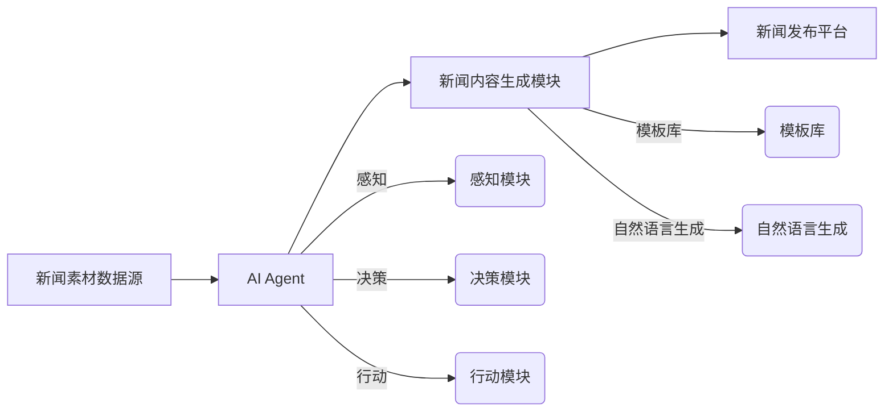

# AI Agent在新闻媒体中的内容生成应用

> 关键词：AI Agent、新闻媒体、内容生成、自然语言处理、自动化写作

> 摘要：本文聚焦于AI Agent在新闻媒体内容生成领域的应用。首先介绍了研究的背景、目的、预期读者、文档结构及相关术语。接着阐述了AI Agent和新闻媒体内容生成的核心概念及联系，给出了相应的原理和架构示意图与流程图。详细讲解了核心算法原理，并用Python代码进行了示例。深入探讨了相关的数学模型和公式，通过具体例子进行说明。结合项目实战，展示了开发环境搭建、源代码实现及代码解读。分析了AI Agent在新闻媒体中的实际应用场景，推荐了学习资源、开发工具框架以及相关论文著作。最后总结了未来发展趋势与挑战，提供了常见问题解答和扩展阅读参考资料，旨在全面深入地探讨AI Agent在新闻媒体内容生成中的应用情况。

## 1. 背景介绍 
### 1.1 目的和范围
随着人工智能技术的飞速发展，AI Agent在各个领域的应用日益广泛，新闻媒体行业也不例外。本文章的目的在于深入探讨AI Agent在新闻媒体内容生成方面的应用，详细分析其原理、算法、实际应用场景等，为新闻媒体从业者、技术开发者以及对该领域感兴趣的人士提供全面且深入的了解。范围涵盖了从AI Agent的基础概念到具体的新闻内容生成实现，包括相关的算法原理、数学模型、项目实战等方面。

### 1.2 预期读者
本文预期读者包括新闻媒体行业的从业者，如记者、编辑等，他们可以了解如何借助AI Agent提高新闻内容生成的效率和质量；计算机科学领域的技术开发者，特别是从事自然语言处理、人工智能开发的人员，可从中获取关于AI Agent在新闻媒体应用的技术细节和实现思路；对人工智能和新闻媒体交叉领域感兴趣的研究者和爱好者，能够通过本文全面了解该领域的发展现状和趋势。

### 1.3 文档结构概述
本文将按照以下结构展开：首先介绍核心概念与联系，明确AI Agent和新闻媒体内容生成的相关概念及其内在联系；接着详细讲解核心算法原理和具体操作步骤，并用Python代码进行示例；然后阐述相关的数学模型和公式，并举例说明；通过项目实战展示代码的实际应用和详细解释；分析AI Agent在新闻媒体中的实际应用场景；推荐相关的学习资源、开发工具框架和论文著作；最后总结未来发展趋势与挑战，提供常见问题解答和扩展阅读参考资料。

### 1.4 术语表
#### 1.4.1 核心术语定义
- **AI Agent（人工智能代理）**：是一种能够感知环境、根据内部的决策机制进行推理，并采取行动以实现特定目标的人工智能实体。在新闻媒体内容生成中，AI Agent可以接收新闻素材、分析信息，然后生成符合要求的新闻内容。
- **新闻媒体内容生成**：指的是利用各种技术手段，包括人工和自动化方式，创建新闻报道、评论、专题等各种类型的新闻内容。

#### 1.4.2 相关概念解释
- **自然语言处理（NLP）**：是人工智能的一个重要分支，主要研究如何让计算机理解、处理和生成人类语言。在AI Agent进行新闻内容生成时，自然语言处理技术用于对新闻素材进行语义分析、文本生成等操作。
- **机器学习**：是一门多领域交叉学科，涉及概率论、统计学、逼近论、凸分析、算法复杂度理论等多门学科。它专门研究计算机怎样模拟或实现人类的学习行为，以获取新的知识或技能，重新组织已有的知识结构使之不断改善自身的性能。在新闻媒体内容生成中，机器学习算法可用于训练AI Agent，使其能够更好地理解和生成新闻内容。

#### 1.4.3 缩略词列表
- **NLP**：自然语言处理（Natural Language Processing）
- **ML**：机器学习（Machine Learning）

## 2. 核心概念与联系 

### 核心概念原理
#### AI Agent原理
AI Agent的基本原理是基于感知、决策和行动的循环。它通过传感器感知环境信息，然后将这些信息输入到决策模块。决策模块根据内部的知识和算法进行推理，生成相应的行动策略。最后，AI Agent通过执行器采取行动。在新闻媒体内容生成中，AI Agent的传感器可以是数据接口，用于获取新闻素材，如新闻事件的相关数据、图片、视频等；决策模块则是基于自然语言处理和机器学习算法，对新闻素材进行分析和处理，生成新闻内容的框架和结构；执行器则是将生成的新闻内容输出到相应的平台，如网站、报纸、社交媒体等。

#### 新闻媒体内容生成原理
新闻媒体内容生成的原理是根据新闻事件的相关信息，按照一定的新闻写作规范和风格，组织和表达内容。传统的新闻内容生成主要依靠记者和编辑的人工创作，他们通过采访、调查等方式获取新闻素材，然后进行整理、撰写和编辑。而在引入AI Agent后，新闻内容生成可以实现部分自动化。AI Agent可以利用自然语言处理技术对新闻素材进行分析和理解，提取关键信息，然后根据预设的模板和算法生成新闻内容。

### 架构的文本示意图
```plaintext
AI Agent在新闻媒体内容生成中的架构

|-------------------|
| 新闻素材数据源    |
| （如数据库、API等）|
|-------------------|
         |
         v
|-------------------|
| AI Agent          |
| - 感知模块        |
| - 决策模块        |
| - 行动模块        |
|-------------------|
         |
         v
|-------------------|
| 新闻内容生成模块  |
| - 模板库          |
| - 自然语言生成    |
|-------------------|
         |
         v
|-------------------|
| 新闻发布平台      |
| （如网站、报纸等）|
|-------------------|
```

### Mermaid流程图


## 3. 核心算法原理 & 具体操作步骤 

### 核心算法原理
在AI Agent进行新闻媒体内容生成时，主要涉及到的核心算法包括文本分类、信息提取和自然语言生成。

#### 文本分类
文本分类是将新闻素材按照不同的主题或类别进行划分的过程。常用的文本分类算法有朴素贝叶斯算法、支持向量机（SVM）和深度学习算法，如卷积神经网络（CNN）和循环神经网络（RNN）。以朴素贝叶斯算法为例，它基于贝叶斯定理，通过计算文本属于各个类别的概率，将文本分类到概率最大的类别中。

#### 信息提取
信息提取是从新闻素材中提取关键信息的过程，如人物、时间、地点、事件等。常用的信息提取算法有命名实体识别（NER）和关系抽取。命名实体识别用于识别文本中的人名、地名、组织机构名等实体，关系抽取用于识别实体之间的关系。

#### 自然语言生成
自然语言生成是根据提取的关键信息和预设的模板，生成自然流畅的新闻内容的过程。常用的自然语言生成算法有基于规则的方法和基于机器学习的方法。基于规则的方法通过定义一系列的语法规则和模板来生成文本，基于机器学习的方法则通过训练模型来学习文本的生成规律。

### 具体操作步骤
#### 步骤1：数据收集与预处理
首先，需要从各种数据源收集新闻素材，如新闻网站、社交媒体、数据库等。然后对收集到的数据进行预处理，包括清洗、分词、去除停用词等操作，以便后续的算法处理。

#### 步骤2：文本分类
使用训练好的文本分类模型对预处理后的新闻素材进行分类，确定新闻的主题或类别。

#### 步骤3：信息提取
使用命名实体识别和关系抽取算法从分类后的新闻素材中提取关键信息。

#### 步骤4：自然语言生成
根据提取的关键信息和预设的模板，使用自然语言生成算法生成新闻内容。

#### 步骤5：内容审核与发布
对生成的新闻内容进行审核，确保内容的准确性和合法性。审核通过后，将新闻内容发布到相应的平台。

### Python源代码示例
```python
import nltk
from nltk.corpus import stopwords
from nltk.tokenize import word_tokenize
from sklearn.feature_extraction.text import TfidfVectorizer
from sklearn.naive_bayes import MultinomialNB
from sklearn.pipeline import Pipeline

# 数据预处理
def preprocess_text(text):
    tokens = word_tokenize(text.lower())
    stop_words = set(stopwords.words('english'))
    filtered_tokens = [token for token in tokens if token.isalpha() and token not in stop_words]
    return " ".join(filtered_tokens)

# 训练文本分类模型
def train_text_classifier(train_data, train_labels):
    pipeline = Pipeline([
        ('tfidf', TfidfVectorizer()),
        ('clf', MultinomialNB())
    ])
    pipeline.fit(train_data, train_labels)
    return pipeline

# 示例数据
train_data = [
    "This is a sports news about a football game.",
    "The latest technology news shows a new invention."
]
train_labels = ["sports", "technology"]

# 预处理数据
preprocessed_train_data = [preprocess_text(text) for text in train_data]

# 训练模型
classifier = train_text_classifier(preprocessed_train_data, train_labels)

# 测试数据
test_data = ["A new basketball game is coming."]
preprocessed_test_data = [preprocess_text(text) for text in test_data]

# 进行分类预测
predictions = classifier.predict(preprocessed_test_data)
print("Predicted category:", predictions[0])
```

## 4. 数学模型和公式 & 详细讲解 & 举例说明 

### 文本分类中的朴素贝叶斯算法
#### 数学模型和公式
朴素贝叶斯算法基于贝叶斯定理，其公式为：

$$P(C|X)=\frac{P(X|C)P(C)}{P(X)}$$

其中，$P(C|X)$ 表示在给定文本特征 $X$ 的情况下，文本属于类别 $C$ 的概率；$P(X|C)$ 表示在类别 $C$ 下出现文本特征 $X$ 的概率；$P(C)$ 表示类别 $C$ 出现的先验概率；$P(X)$ 表示文本特征 $X$ 出现的概率。

在文本分类中，通常假设文本中的各个特征是相互独立的，即朴素贝叶斯假设。因此，$P(X|C)$ 可以表示为：

$$P(X|C)=\prod_{i=1}^{n}P(x_i|C)$$

其中，$x_i$ 表示文本中的第 $i$ 个特征。

#### 详细讲解
在训练阶段，需要计算每个类别的先验概率 $P(C)$ 和每个特征在每个类别下的条件概率 $P(x_i|C)$。在预测阶段，对于一个新的文本，计算它属于各个类别的概率 $P(C|X)$，并将文本分类到概率最大的类别中。

#### 举例说明
假设有两个类别：体育（$C_1$）和科技（$C_2$），有以下训练数据：

| 文本 | 类别 |
|------|------|
| "Football game is exciting" | 体育 |
| "New smartphone technology" | 科技 |

计算先验概率：

$P(C_1)=\frac{1}{2}$，$P(C_2)=\frac{1}{2}$

计算条件概率：

对于特征 "football"，$P("football"|C_1)=\frac{1}{3}$，$P("football"|C_2)=0$

对于特征 "new"，$P("new"|C_1)=0$，$P("new"|C_2)=\frac{1}{3}$

对于一个新的文本 "Football match today"，计算它属于各个类别的概率：

$P(C_1|X)\propto P(X|C_1)P(C_1)=\frac{1}{3}\times\frac{1}{2}$

$P(C_2|X)\propto P(X|C_2)P(C_2)=0\times\frac{1}{2}$

因为 $P(C_1|X)>P(C_2|X)$，所以将该文本分类到体育类别。

### 命名实体识别中的条件随机场（CRF）
#### 数学模型和公式
条件随机场是一种判别式概率图模型，用于序列标注问题，如命名实体识别。其数学模型可以表示为：

$$P(y|x)=\frac{1}{Z(x)}\exp\left(\sum_{i=1}^{n}\sum_{k=1}^{K}\lambda_kf_k(y_{i-1},y_i,x,i)\right)$$

其中，$x$ 表示输入序列，$y$ 表示输出序列，$Z(x)$ 是归一化因子，$\lambda_k$ 是特征函数 $f_k$ 的权重，$f_k(y_{i-1},y_i,x,i)$ 是特征函数，用于描述输入序列 $x$ 在位置 $i$ 处的输出标签 $y_i$ 与前一个输出标签 $y_{i-1}$ 之间的关系。

#### 详细讲解
在训练阶段，通过最大似然估计来学习特征函数的权重 $\lambda_k$。在预测阶段，使用维特比算法来找到使得 $P(y|x)$ 最大的输出序列 $y$。

#### 举例说明
假设输入序列 $x$ 是 "John went to New York"，需要识别其中的人名和地名。特征函数可以定义为：

$f_1(y_{i-1},y_i,x,i)$：如果 $y_i$ 是人名且 $x_i$ 以大写字母开头，则该特征函数的值为 1，否则为 0。

$f_2(y_{i-1},y_i,x,i)$：如果 $y_i$ 是地名且 $x_i$ 包含 "York"，则该特征函数的值为 1，否则为 0。

通过训练得到特征函数的权重后，使用维特比算法可以得到输出序列 $y$，如 "PERSON O O LOCATION LOCATION"，表示 "John" 是人名，"New York" 是地名。

## 5. 项目实战：代码实际案例和详细解释说明 

### 5.1  开发环境搭建
#### 操作系统
可以选择Windows、Linux或macOS等操作系统。这里以Ubuntu 20.04为例进行说明。

#### Python环境
安装Python 3.8或以上版本。可以使用以下命令安装：

```bash
sudo apt update
sudo apt install python3.8
```

#### 依赖库安装
安装项目所需的依赖库，如NLTK、Scikit-learn等。可以使用以下命令安装：

```bash
pip install nltk scikit-learn
```

同时，需要下载NLTK的数据：

```python
import nltk
nltk.download('punkt')
nltk.download('stopwords')
```

### 5.2  源代码详细实现和代码解读
```python
import nltk
from nltk.corpus import stopwords
from nltk.tokenize import word_tokenize
from sklearn.feature_extraction.text import TfidfVectorizer
from sklearn.naive_bayes import MultinomialNB
from sklearn.pipeline import Pipeline

# 数据预处理函数
def preprocess_text(text):
    # 将文本转换为小写
    tokens = word_tokenize(text.lower())
    # 获取停用词列表
    stop_words = set(stopwords.words('english'))
    # 过滤掉非字母字符和停用词
    filtered_tokens = [token for token in tokens if token.isalpha() and token not in stop_words]
    # 将过滤后的词重新组合成文本
    return " ".join(filtered_tokens)

# 训练文本分类器函数
def train_text_classifier(train_data, train_labels):
    # 创建一个Pipeline，包含TF-IDF向量化和朴素贝叶斯分类器
    pipeline = Pipeline([
        ('tfidf', TfidfVectorizer()),
        ('clf', MultinomialNB())
    ])
    # 训练模型
    pipeline.fit(train_data, train_labels)
    return pipeline

# 示例数据
train_data = [
    "This is a sports news about a football game.",
    "The latest technology news shows a new invention."
]
train_labels = ["sports", "technology"]

# 预处理训练数据
preprocessed_train_data = [preprocess_text(text) for text in train_data]

# 训练模型
classifier = train_text_classifier(preprocessed_train_data, train_labels)

# 测试数据
test_data = ["A new basketball game is coming."]
# 预处理测试数据
preprocessed_test_data = [preprocess_text(text) for text in test_data]

# 进行分类预测
predictions = classifier.predict(preprocessed_test_data)
print("Predicted category:", predictions[0])
```

### 5.3  代码解读与分析
#### 数据预处理部分
`preprocess_text` 函数的作用是对输入的文本进行预处理。首先将文本转换为小写，然后使用 `word_tokenize` 函数将文本分词。接着，过滤掉非字母字符和停用词，最后将过滤后的词重新组合成文本。这样做的目的是减少文本中的噪声，提高后续算法的准确性。

#### 训练文本分类器部分
`train_text_classifier` 函数使用 `Pipeline` 来创建一个包含TF-IDF向量化和朴素贝叶斯分类器的模型。TF-IDF向量化将文本转换为向量表示，朴素贝叶斯分类器根据向量进行分类。使用 `fit` 方法对模型进行训练。

#### 预测部分
对测试数据进行预处理后，使用训练好的模型进行预测，最后输出预测结果。

## 6. 实际应用场景 
### 体育新闻生成
AI Agent可以实时收集体育赛事的数据，如比赛比分、球员数据、比赛统计等。根据这些数据，AI Agent可以快速生成体育新闻报道，包括比赛结果、球员表现分析、赛事回顾等。例如，在一场足球比赛结束后，AI Agent可以在几分钟内生成一篇详细的比赛报道，为球迷提供及时的信息。

### 财经新闻生成
在财经领域，AI Agent可以收集股票市场数据、公司财报、宏观经济指标等信息。根据这些信息，AI Agent可以生成财经新闻，如股票分析、市场趋势预测、公司业绩解读等。例如，当一家公司发布财报时，AI Agent可以迅速分析财报数据，生成一篇关于该公司业绩的新闻报道。

### 突发事件新闻生成
对于突发事件，如自然灾害、恐怖袭击等，AI Agent可以通过社交媒体、新闻网站等渠道实时收集相关信息。然后，根据这些信息生成新闻报道，及时向公众传达事件的最新情况。例如，在地震发生后，AI Agent可以快速收集地震的震级、地点、受灾情况等信息，生成一篇关于地震的新闻报道。

### 专题新闻生成
AI Agent可以根据特定的主题，如科技、文化、娱乐等，收集相关的新闻素材。然后，对这些素材进行整合和分析，生成专题新闻报道。例如，对于科技领域的某个热门话题，AI Agent可以收集相关的研究成果、企业动态等信息，生成一篇关于该话题的专题报道。

## 7. 工具和资源推荐
### 7.1 学习资源推荐
#### 7.1.1 书籍推荐
- 《自然语言处理入门》：这本书详细介绍了自然语言处理的基础知识和常用算法，适合初学者入门。
- 《深度学习》：由Ian Goodfellow、Yoshua Bengio和Aaron Courville三位深度学习领域的顶尖专家撰写，全面介绍了深度学习的理论和应用。
- 《Python自然语言处理》：以Python为工具，介绍了自然语言处理的各种技术和应用，包含大量的代码示例。

#### 7.1.2 在线课程
- Coursera上的“Natural Language Processing Specialization”：由顶尖大学的教授授课，系统地介绍了自然语言处理的各个方面。
- edX上的“Introduction to Artificial Intelligence”：涵盖了人工智能的基础知识，包括机器学习、自然语言处理等内容。
- 网易云课堂上的“Python数据分析与挖掘实战”：通过实际案例介绍了Python在数据分析和挖掘中的应用，对理解AI Agent的应用有帮助。

#### 7.1.3 技术博客和网站
- Medium：上面有很多关于人工智能和自然语言处理的技术文章，作者来自世界各地的专业人士。
- arXiv：提供了大量的学术论文，涵盖了人工智能、机器学习等领域的最新研究成果。
- 开源中国：国内的技术社区，有很多关于人工智能和自然语言处理的技术分享和讨论。

### 7.2 开发工具框架推荐
#### 7.2.1 IDE和编辑器
- PyCharm：功能强大的Python集成开发环境，提供了代码编辑、调试、版本控制等功能，适合开发Python项目。
- Visual Studio Code：轻量级的代码编辑器，支持多种编程语言，有丰富的插件扩展，可用于开发AI Agent项目。
- Jupyter Notebook：交互式的开发环境，适合进行数据分析和模型实验，方便展示代码和结果。

#### 7.2.2 调试和性能分析工具
- PDB：Python自带的调试器，可以帮助开发者定位代码中的问题。
- cProfile：Python的性能分析工具，可以分析代码的运行时间和函数调用情况，帮助优化代码性能。
- TensorBoard：用于可视化深度学习模型的训练过程和结果，方便开发者监控模型的性能。

#### 7.2.3 相关框架和库
- NLTK：自然语言处理工具包，提供了丰富的语料库和工具，可用于文本处理、分类、信息提取等任务。
- Scikit-learn：机器学习工具包，包含了各种机器学习算法和工具，可用于模型训练和评估。
- PyTorch：深度学习框架，提供了高效的张量计算和自动求导功能，适合开发深度学习模型。

### 7.3 相关论文著作推荐
#### 7.3.1 经典论文
- "A Neural Probabilistic Language Model"：提出了神经网络语言模型的概念，为自然语言处理的深度学习方法奠定了基础。
- "Long Short-Term Memory"：介绍了长短期记忆网络（LSTM），解决了循环神经网络中的梯度消失问题，在序列建模任务中取得了很好的效果。
- "Attention Is All You Need"：提出了Transformer模型，引入了注意力机制，在自然语言处理领域取得了巨大的成功。

#### 7.3.2 最新研究成果
- 关注ACL（Association for Computational Linguistics）、EMNLP（Conference on Empirical Methods in Natural Language Processing）等自然语言处理领域的顶级会议，这些会议上会发表很多最新的研究成果。
- 在arXiv上搜索关于AI Agent在新闻媒体内容生成方面的最新论文，了解该领域的前沿研究动态。

#### 7.3.3 应用案例分析
- 可以在ACM Digital Library、IEEE Xplore等数据库中搜索关于AI Agent在新闻媒体行业应用的案例分析论文，学习实际应用中的经验和技巧。

## 8. 总结：未来发展趋势与挑战
### 未来发展趋势
#### 个性化新闻生成
随着用户对个性化信息的需求不断增加，AI Agent将能够根据用户的兴趣、偏好和历史行为，生成个性化的新闻内容。例如，为每个用户定制专属的新闻推送，提高用户的阅读体验。

#### 多模态新闻生成
未来的新闻内容将不仅仅局限于文本，还将包括图片、视频、音频等多种模态。AI Agent将能够综合处理这些多模态信息，生成更加丰富、生动的新闻报道。例如，在体育新闻中，除了文字报道，还可以添加比赛视频片段和球员采访音频。

#### 实时新闻生成
随着互联网和传感器技术的发展，新闻事件的发生和传播速度越来越快。AI Agent将能够实时收集和处理新闻素材，实现实时新闻生成。例如，在重大事件发生时，AI Agent可以在瞬间生成相关的新闻报道，及时向公众传达信息。

#### 人机协作新闻生成
虽然AI Agent在新闻内容生成方面具有高效、准确的优势，但人类记者的专业知识、判断力和创造力仍然不可替代。未来，AI Agent将与人类记者实现更加紧密的协作，共同完成新闻报道的创作。例如，AI Agent可以为人类记者提供数据支持和内容初稿，人类记者则进行审核、修改和深度挖掘。

### 挑战
#### 新闻质量和真实性
AI Agent生成的新闻内容可能存在质量不高、信息不准确的问题。由于AI Agent主要基于数据和算法进行内容生成，可能会出现对新闻事件理解不深入、信息解读错误等情况。因此，如何保证AI Agent生成的新闻内容的质量和真实性是一个重要的挑战。

#### 伦理和法律问题
AI Agent在新闻媒体中的应用可能会引发一系列的伦理和法律问题。例如，AI Agent生成的新闻内容可能会侵犯他人的隐私权、名誉权等；AI Agent的算法可能存在偏见，导致新闻报道的不公平性。如何解决这些伦理和法律问题，需要制定相应的规范和法律法规。

#### 技术瓶颈
虽然自然语言处理和人工智能技术取得了很大的进展，但仍然存在一些技术瓶颈。例如，在自然语言生成方面，生成的文本可能缺乏逻辑性和连贯性；在信息提取方面，对于一些复杂的语义信息还难以准确提取。如何突破这些技术瓶颈，提高AI Agent的性能，是未来需要解决的问题。

#### 公众接受度
公众对AI Agent生成的新闻内容的接受度也是一个挑战。一些人可能对AI生成的新闻存在疑虑，认为其缺乏人情味和深度。如何提高公众对AI Agent生成的新闻内容的接受度，需要加强对公众的宣传和教育。

## 9. 附录：常见问题与解答
### 问题1：AI Agent生成的新闻内容是否能够替代人类记者？
答：目前来看，AI Agent生成的新闻内容还不能完全替代人类记者。虽然AI Agent在数据处理和信息整合方面具有优势，但人类记者的专业知识、判断力、创造力和人际交往能力是不可替代的。在新闻报道中，人类记者可以进行深入的调查采访，挖掘新闻背后的故事，表达情感和观点。未来，AI Agent将与人类记者实现人机协作，共同提高新闻报道的效率和质量。

### 问题2：如何保证AI Agent生成的新闻内容的质量和真实性？
答：可以采取以下措施来保证AI Agent生成的新闻内容的质量和真实性：
- 数据源的可靠性：确保AI Agent获取的新闻素材来自可靠的数据源，如权威的新闻机构、官方网站等。
- 算法的优化：不断优化AI Agent的算法，提高其对新闻事件的理解和分析能力，减少信息解读错误。
- 人工审核：在AI Agent生成新闻内容后，由人类编辑进行审核，确保内容的准确性和合法性。
- 模型的评估和监控：定期对AI Agent的模型进行评估和监控，及时发现和纠正模型中的问题。

### 问题3：AI Agent在新闻媒体内容生成中的应用是否会导致大量记者失业？
答：虽然AI Agent在新闻媒体内容生成中的应用可能会对记者的工作产生一定的影响，但不会导致大量记者失业。相反，AI Agent的应用可以为记者提供更多的工具和支持，帮助他们提高工作效率。例如，AI Agent可以帮助记者快速收集和整理新闻素材，生成内容初稿，让记者有更多的时间和精力进行深度报道和分析。同时，随着新闻媒体行业的发展，对记者的专业素质和综合能力的要求也在不断提高，记者可以通过学习和转型，适应新的工作需求。

### 问题4：AI Agent生成的新闻内容是否存在版权问题？
答：AI Agent生成的新闻内容可能存在版权问题。如果AI Agent在生成新闻内容时使用了受版权保护的素材，如图片、视频、文字等，需要获得相应的授权。此外，对于AI Agent生成的新闻内容本身的版权归属也存在争议。目前，不同国家和地区的法律对此有不同的规定。在实际应用中，需要遵守相关的法律法规，确保新闻内容的版权合规。

## 10. 扩展阅读 & 参考资料
### 扩展阅读
- 《智能时代：大数据与智能革命重新定义未来》：这本书介绍了人工智能和大数据技术对各个行业的影响，包括新闻媒体行业，有助于读者了解智能时代的发展趋势。
- 《人工智能简史》：回顾了人工智能的发展历程，介绍了人工智能的主要技术和应用领域，对于理解AI Agent的发展背景有帮助。
- 《新闻的十大基本原则》：阐述了新闻行业的基本原则和价值观，即使在AI Agent应用的背景下，这些原则仍然具有重要的指导意义。

### 参考资料
- 相关的学术论文和研究报告，如在ACM Digital Library、IEEE Xplore、arXiv等数据库中搜索到的关于AI Agent在新闻媒体内容生成方面的论文。
- 新闻媒体行业的相关网站和博客，如CNN、BBC、人民日报等媒体的官方网站，以及一些媒体行业的研究博客。
- 开源项目和代码库，如GitHub上关于自然语言处理和AI Agent的开源项目，这些项目可以提供实际的代码示例和实现思路。

作者：AI天才研究院/AI Genius Institute & 禅与计算机程序设计艺术 /Zen And The Art of Computer Programming