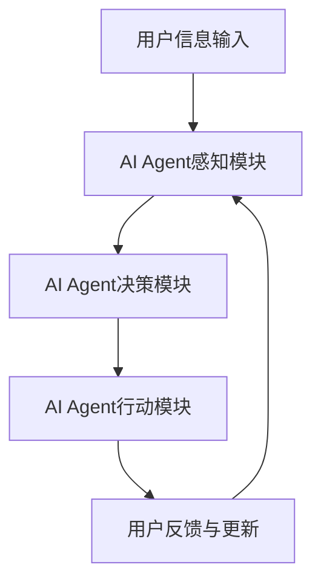

# AI Agent在智能个性化职业规划中的应用

> 关键词：AI Agent、智能个性化、职业规划、人工智能、职业发展、个性化推荐、智能决策

> 摘要：本文深入探讨了AI Agent在智能个性化职业规划中的应用。首先介绍了相关背景，包括目的范围、预期读者等内容。接着阐述了AI Agent及智能个性化职业规划的核心概念与联系，给出了原理和架构的示意图及流程图。详细讲解了核心算法原理和具体操作步骤，结合Python代码进行说明，还介绍了相关的数学模型和公式。通过项目实战，展示了开发环境搭建、源代码实现与解读。分析了AI Agent在智能个性化职业规划中的实际应用场景，推荐了相关的学习资源、开发工具框架和论文著作。最后总结了未来发展趋势与挑战，并提供了常见问题解答和扩展阅读参考资料，旨在全面展现AI Agent在该领域的应用价值和潜力。

## 1. 背景介绍 
### 1.1 目的和范围
在当今竞争激烈且快速变化的职场环境中，个人需要更精准、个性化的职业规划来提升自身竞争力和实现职业目标。传统的职业规划方式往往缺乏针对性和实时性，难以满足个体多样化的需求。本文章的目的在于深入探讨AI Agent在智能个性化职业规划中的应用，研究如何利用AI Agent的智能特性，为个人提供定制化的职业规划建议和决策支持。

文章的范围涵盖了AI Agent的基本概念、相关算法原理、在职业规划中的具体应用场景、项目实践案例以及相关工具和资源的推荐等方面。通过全面的研究和分析，旨在为读者提供一个系统的关于AI Agent在智能个性化职业规划中应用的知识体系。

### 1.2 预期读者
本文预期读者包括对人工智能技术在职业发展领域应用感兴趣的研究人员、从事职业规划咨询的专业人士、希望借助技术手段进行自我职业规划的职场人士以及相关专业的学生等。对于研究人员，可以从中获取关于AI Agent在职业规划应用方面的最新研究思路和方法；职业规划专业人士可以借鉴AI Agent的技术优势，提升职业规划服务的质量和效率；职场人士和学生可以了解如何利用相关技术来制定更符合自身需求的职业规划。

### 1.3 文档结构概述
本文将按照以下结构展开：首先介绍背景信息，包括目的、预期读者等；接着阐述AI Agent和智能个性化职业规划的核心概念与联系，通过示意图和流程图进行直观展示；然后详细讲解核心算法原理和具体操作步骤，结合Python代码进行说明；介绍相关的数学模型和公式，并举例说明；通过项目实战展示开发环境搭建、源代码实现与解读；分析实际应用场景；推荐相关的学习资源、开发工具框架和论文著作；总结未来发展趋势与挑战；提供常见问题解答和扩展阅读参考资料。

### 1.4 术语表
#### 1.4.1 核心术语定义
- **AI Agent（人工智能代理）**：是一种能够感知环境、根据内部状态和目标进行推理，并采取行动以实现目标的智能实体。它可以自主地或在人类的指导下执行各种任务。
- **智能个性化职业规划**：是指利用人工智能技术，结合个体的兴趣、技能、价值观、职业目标等多方面因素，为个人量身定制的、具有针对性和实时性的职业发展规划。

#### 1.4.2 相关概念解释
- **职业画像**：是对个人职业特征的综合描述，包括个人的技能水平、工作经验、教育背景、职业兴趣等信息，用于全面了解个人的职业现状和潜力。
- **职业图谱**：是对职业领域的一种结构化表示，包含了不同职业之间的关系、职业所需的技能和知识、职业发展路径等信息，为职业规划提供了宏观的视角。

#### 1.4.3 缩略词列表
- **AI**：Artificial Intelligence，人工智能
- **ML**：Machine Learning，机器学习
- **NLP**：Natural Language Processing，自然语言处理

## 2. 核心概念与联系 

### 核心概念原理
AI Agent是人工智能领域中的一个重要概念，它基于感知、决策和行动的循环来实现智能行为。在智能个性化职业规划中，AI Agent的感知模块负责收集个体的各种信息，如教育背景、工作经历、技能水平、兴趣爱好等。这些信息可以通过用户输入、在线简历、社交媒体数据等多种渠道获取。

决策模块是AI Agent的核心部分，它利用机器学习、自然语言处理等技术对收集到的信息进行分析和处理。通过对大量职业数据的学习和分析，AI Agent可以了解不同职业的要求、发展趋势和薪资水平等信息。结合个体的信息，决策模块可以生成个性化的职业规划建议，包括适合的职业方向、技能提升计划、职业发展路径等。

行动模块则负责将决策模块生成的建议转化为具体的行动方案。例如，为用户推荐相关的培训课程、实习机会、招聘信息等，帮助用户实现职业规划目标。

### 架构的文本示意图
```plaintext
           +-----------------+
           |  用户信息输入  |
           +-----------------+
                    |
                    v
           +-----------------+
           |  AI Agent 感知模块  |
           +-----------------+
                    |
                    v
           +-----------------+
           |  AI Agent 决策模块  |
           +-----------------+
                    |
                    v
           +-----------------+
           |  AI Agent 行动模块  |
           +-----------------+
                    |
                    v
           +-----------------+
           |  用户反馈与更新  |
           +-----------------+
```

### Mermaid 流程图


## 3. 核心算法原理 & 具体操作步骤 

### 核心算法原理
在AI Agent进行智能个性化职业规划的过程中，主要涉及到机器学习和自然语言处理等算法。以下是一些常见的算法及其原理：

#### 聚类算法
聚类算法用于将相似的职业或个体进行分组。例如，K-Means算法是一种常用的聚类算法，它通过计算数据点之间的距离，将数据点划分为不同的簇。在职业规划中，可以将具有相似技能要求、工作内容和职业发展路径的职业聚类在一起，帮助用户更好地了解不同职业群体的特点。

#### 推荐算法
推荐算法用于根据用户的兴趣和行为，为用户推荐相关的职业和发展机会。协同过滤算法是一种常见的推荐算法，它通过分析用户之间的相似性，为目标用户推荐其他相似用户感兴趣的职业。深度学习推荐算法则可以利用神经网络对用户的信息进行深度挖掘，提高推荐的准确性和个性化程度。

#### 自然语言处理算法
自然语言处理算法用于处理用户输入的文本信息，如简历、职业描述等。词嵌入算法可以将文本转化为向量表示，方便计算机进行处理。命名实体识别算法可以识别文本中的人名、地名、组织机构名等实体，提取有用的信息。

### 具体操作步骤
#### 数据收集
首先，需要收集用户的各种信息，包括教育背景、工作经历、技能水平、兴趣爱好等。可以通过在线问卷、用户输入、社交媒体数据等方式获取这些信息。

#### 数据预处理
对收集到的数据进行预处理，包括数据清洗、特征提取和归一化等操作。数据清洗用于去除噪声数据和缺失值，特征提取用于从原始数据中提取有用的特征，归一化用于将不同特征的数据缩放到相同的范围。

#### 模型训练
使用预处理后的数据对机器学习和自然语言处理模型进行训练。选择合适的算法和模型结构，调整模型的参数，以提高模型的性能和准确性。

#### 职业规划生成
将用户的信息输入到训练好的模型中，模型根据用户的信息生成个性化的职业规划建议。建议包括适合的职业方向、技能提升计划、职业发展路径等。

#### 行动方案推荐
根据生成的职业规划建议，为用户推荐相关的培训课程、实习机会、招聘信息等行动方案，帮助用户实现职业规划目标。

### Python源代码示例
```python
# 示例：使用K-Means算法进行职业聚类
from sklearn.cluster import KMeans
import numpy as np

# 假设我们有一些职业的特征数据
# 每个职业用一个向量表示，向量的每个维度表示一个特征
job_features = np.array([
    [1, 2, 3],
    [4, 5, 6],
    [7, 8, 9],
    [10, 11, 12],
    [13, 14, 15]
])

# 设定聚类的数量
n_clusters = 2

# 创建K-Means模型
kmeans = KMeans(n_clusters=n_clusters)

# 训练模型
kmeans.fit(job_features)

# 获取每个职业的聚类标签
labels = kmeans.labels_

print("每个职业的聚类标签:", labels)
```

## 4. 数学模型和公式 & 详细讲解 & 举例说明 

### 聚类算法的数学模型和公式
#### K-Means算法
K-Means算法的目标是将 $n$ 个数据点划分到 $k$ 个簇中，使得每个数据点到其所属簇的中心点的距离之和最小。

设数据集为 $X = \{x_1, x_2, ..., x_n\}$，其中 $x_i \in \mathbb{R}^d$ 表示第 $i$ 个数据点，$d$ 表示数据点的维度。$C = \{c_1, c_2, ..., c_k\}$ 表示 $k$ 个簇的中心点，其中 $c_j \in \mathbb{R}^d$ 表示第 $j$ 个簇的中心点。

K-Means算法的目标函数可以表示为：
$$
J(C) = \sum_{i=1}^{n} \min_{j=1}^{k} \|x_i - c_j\|^2
$$
其中 $\|x_i - c_j\|$ 表示数据点 $x_i$ 到中心点 $c_j$ 的欧几里得距离。

K-Means算法的具体步骤如下：
1. 随机初始化 $k$ 个中心点 $C = \{c_1, c_2, ..., c_k\}$。
2. 对于每个数据点 $x_i$，计算其到每个中心点的距离 $\|x_i - c_j\|$，将 $x_i$ 分配到距离最近的中心点所在的簇中。
3. 重新计算每个簇的中心点，即该簇中所有数据点的平均值。
4. 重复步骤2和3，直到中心点不再变化或达到最大迭代次数。

#### 举例说明
假设有以下数据集：
$$
X = \{[1, 2], [2, 3], [8, 9], [9, 10]\}
$$
我们要将这些数据点划分为2个簇，即 $k = 2$。

随机初始化两个中心点：
$$
c_1 = [1, 2], c_2 = [8, 9]
$$

计算每个数据点到中心点的距离：
- 对于 $x_1 = [1, 2]$，$\|x_1 - c_1\| = 0$，$\|x_1 - c_2\| = \sqrt{(1 - 8)^2 + (2 - 9)^2} = \sqrt{49 + 49} = \sqrt{98}$，所以 $x_1$ 属于簇1。
- 对于 $x_2 = [2, 3]$，$\|x_2 - c_1\| = \sqrt{(2 - 1)^2 + (3 - 2)^2} = \sqrt{2}$，$\|x_2 - c_2\| = \sqrt{(2 - 8)^2 + (3 - 9)^2} = \sqrt{36 + 36} = \sqrt{72}$，所以 $x_2$ 属于簇1。
- 对于 $x_3 = [8, 9]$，$\|x_3 - c_1\| = \sqrt{(8 - 1)^2 + (9 - 2)^2} = \sqrt{49 + 49} = \sqrt{98}$，$\|x_3 - c_2\| = 0$，所以 $x_3$ 属于簇2。
- 对于 $x_4 = [9, 10]$，$\|x_4 - c_1\| = \sqrt{(9 - 1)^2 + (10 - 2)^2} = \sqrt{64 + 64} = \sqrt{128}$，$\|x_4 - c_2\| = \sqrt{(9 - 8)^2 + (10 - 9)^2} = \sqrt{2}$，所以 $x_4$ 属于簇2。

重新计算中心点：
- 簇1的中心点：$c_1 = \frac{[1, 2] + [2, 3]}{2} = [1.5, 2.5]$
- 簇2的中心点：$c_2 = \frac{[8, 9] + [9, 10]}{2} = [8.5, 9.5]$

重复上述步骤，直到中心点不再变化。

### 推荐算法的数学模型和公式
#### 协同过滤算法
协同过滤算法基于用户之间的相似性来进行推荐。假设我们有 $m$ 个用户和 $n$ 个物品，用户 $u$ 对物品 $i$ 的评分表示为 $r_{ui}$。

用户之间的相似性可以用皮尔逊相关系数来计算：
$$
sim(u, v) = \frac{\sum_{i \in I_{uv}} (r_{ui} - \bar{r}_u)(r_{vi} - \bar{r}_v)}{\sqrt{\sum_{i \in I_{uv}} (r_{ui} - \bar{r}_u)^2 \sum_{i \in I_{uv}} (r_{vi} - \bar{r}_v)^2}}
$$
其中 $I_{uv}$ 表示用户 $u$ 和用户 $v$ 都评分过的物品集合，$\bar{r}_u$ 和 $\bar{r}_v$ 分别表示用户 $u$ 和用户 $v$ 的平均评分。

对于用户 $u$，预测其对物品 $i$ 的评分可以表示为：
$$
\hat{r}_{ui} = \bar{r}_u + \frac{\sum_{v \in N(u)} sim(u, v)(r_{vi} - \bar{r}_v)}{\sum_{v \in N(u)} |sim(u, v)|}
$$
其中 $N(u)$ 表示与用户 $u$ 最相似的 $k$ 个用户集合。

#### 举例说明
假设有以下用户-物品评分矩阵：
| 用户 | 物品1 | 物品2 | 物品3 |
| --- | --- | --- | --- |
| 用户1 | 5 | 3 | 2 |
| 用户2 | 4 | 3 | 1 |
| 用户3 | 2 | 1 | 4 |

我们要预测用户1对物品3的评分。

首先计算用户1和用户2、用户3的相似性：
- 对于用户1和用户2：
  - $\bar{r}_1 = \frac{5 + 3 + 2}{3} = \frac{10}{3}$
  - $\bar{r}_2 = \frac{4 + 3 + 1}{3} = \frac{8}{3}$
  - $I_{12} = \{物品1, 物品2, 物品3\}$
  - $\sum_{i \in I_{12}} (r_{1i} - \bar{r}_1)(r_{2i} - \bar{r}_2) = (5 - \frac{10}{3})(4 - \frac{8}{3}) + (3 - \frac{10}{3})(3 - \frac{8}{3}) + (2 - \frac{10}{3})(1 - \frac{8}{3}) = \frac{5}{3} \times \frac{4}{3} + \frac{-1}{3} \times \frac{1}{3} + \frac{-4}{3} \times \frac{-5}{3} = \frac{20}{9} - \frac{1}{9} + \frac{20}{9} = \frac{39}{9}$
  - $\sum_{i \in I_{12}} (r_{1i} - \bar{r}_1)^2 = (5 - \frac{10}{3})^2 + (3 - \frac{10}{3})^2 + (2 - \frac{10}{3})^2 = \frac{25}{9} + \frac{1}{9} + \frac{16}{9} = \frac{42}{9}$
  - $\sum_{i \in I_{12}} (r_{2i} - \bar{r}_2)^2 = (4 - \frac{8}{3})^2 + (3 - \frac{8}{3})^2 + (1 - \frac{8}{3})^2 = \frac{16}{9} + \frac{1}{9} + \frac{25}{9} = \frac{42}{9}$
  - $sim(1, 2) = \frac{\frac{39}{9}}{\sqrt{\frac{42}{9} \times \frac{42}{9}}} = \frac{39}{42} \approx 0.93$
- 同理可计算用户1和用户3的相似性 $sim(1, 3) \approx -0.93$

假设 $k = 2$，则 $N(1) = \{用户