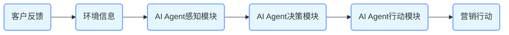

# AI Agent在智能个性化营销中的应用

> 关键词：AI Agent、智能个性化营销、客户画像、营销策略、营销自动化

> 摘要：本文深入探讨了AI Agent在智能个性化营销中的应用。首先介绍了相关背景，包括目的、预期读者等。接着阐述了核心概念及联系，分析了AI Agent在个性化营销中的架构。详细讲解了核心算法原理和操作步骤，并给出了Python代码示例。通过数学模型和公式进一步剖析其原理，还进行了项目实战，包含开发环境搭建、代码实现与解读。探讨了实际应用场景，推荐了相关工具和资源。最后总结了未来发展趋势与挑战，解答了常见问题，并提供了扩展阅读和参考资料，旨在为读者全面呈现AI Agent在智能个性化营销中的应用全貌。

## 1. 背景介绍 
### 1.1 目的和范围
随着互联网技术的飞速发展和市场竞争的日益激烈，传统的营销方式已难以满足企业的需求。智能个性化营销成为了企业提升竞争力、提高客户满意度和增加销售额的重要手段。AI Agent作为一种具有自主学习和决策能力的智能体，能够在智能个性化营销中发挥重要作用。本文的目的在于深入探讨AI Agent在智能个性化营销中的应用，包括其核心概念、算法原理、实际应用场景等，为企业和相关从业者提供理论和实践指导。范围涵盖了AI Agent的基本原理、在个性化营销中的具体应用方式、相关算法和技术，以及实际案例分析等方面。

### 1.2 预期读者
本文预期读者包括市场营销人员、企业管理人员、数据分析师、人工智能开发者以及对智能个性化营销和AI Agent感兴趣的研究人员。市场营销人员可以从本文中了解如何利用AI Agent实现更精准的营销；企业管理人员可以获取关于智能个性化营销战略规划的思路；数据分析师能够学习到相关的数据分析和算法应用；人工智能开发者可以借鉴文中的算法和代码实现；研究人员则可以在本文的基础上开展更深入的研究。

### 1.3 文档结构概述
本文将按照以下结构进行组织：首先介绍核心概念与联系，明确AI Agent和智能个性化营销的定义、原理和架构；接着阐述核心算法原理和具体操作步骤，并给出Python代码示例；然后通过数学模型和公式进一步解释其原理，并举例说明；进行项目实战，包括开发环境搭建、源代码实现和代码解读；探讨实际应用场景；推荐相关的工具和资源；最后总结未来发展趋势与挑战，解答常见问题，并提供扩展阅读和参考资料。

### 1.4 术语表
#### 1.4.1 核心术语定义
- **AI Agent（人工智能智能体）**：是一种能够感知环境、自主学习和决策，并采取行动以实现特定目标的智能程序或系统。
- **智能个性化营销**：是指企业利用先进的信息技术和数据分析手段，根据客户的个性化特征和需求，为客户提供定制化的营销内容和服务，以提高营销效果和客户满意度。
- **客户画像**：是通过对客户的人口统计学特征、消费行为、兴趣爱好等多方面数据进行分析和建模，构建出的客户的虚拟形象，用于精准营销和个性化服务。
- **营销策略**：是企业为了实现营销目标而制定的一系列计划和行动方案，包括目标市场选择、产品定位、价格策略、促销策略等。
- **营销自动化**：是指利用软件和技术手段，自动执行营销任务和流程，如邮件营销、社交媒体营销、客户关系管理等，以提高营销效率和效果。

#### 1.4.2 相关概念解释
- **机器学习**：是一门多领域交叉学科，涉及概率论、统计学、逼近论、凸分析、算法复杂度理论等多门学科。它专门研究计算机怎样模拟或实现人类的学习行为，以获取新的知识或技能，重新组织已有的知识结构使之不断改善自身的性能。在AI Agent中，机器学习用于让智能体从数据中学习规律和模式，从而做出更准确的决策。
- **深度学习**：是机器学习的一个分支领域，它试图使用包含复杂结构或由多重非线性变换构成的多个处理层对数据进行高层抽象的算法。深度学习在图像识别、语音识别、自然语言处理等领域取得了巨大的成功，在AI Agent中也被广泛应用于处理复杂的营销数据。
- **自然语言处理**：是计算机科学领域与人工智能领域中的一个重要方向。它研究能实现人与计算机之间用自然语言进行有效通信的各种理论和方法。在智能个性化营销中，自然语言处理可用于分析客户的文本数据，如评论、反馈等，以了解客户的需求和情感。

#### 1.4.3 缩略词列表
- **AI**：Artificial Intelligence，人工智能
- **ML**：Machine Learning，机器学习
- **DL**：Deep Learning，深度学习
- **NLP**：Natural Language Processing，自然语言处理
- **CRM**：Customer Relationship Management，客户关系管理

## 2. 核心概念与联系 

### 核心概念原理
#### AI Agent原理
AI Agent的核心原理基于感知、决策和行动三个主要步骤。感知是指智能体通过传感器或接口获取环境信息，例如在智能个性化营销中，AI Agent可以通过数据分析平台获取客户的浏览记录、购买历史等信息。决策是指智能体根据感知到的信息，运用一定的算法和模型进行分析和推理，以确定最佳的行动方案。例如，AI Agent可以根据客户的特征和偏好，决定向客户推荐哪些产品或服务。行动是指智能体根据决策结果采取相应的行动，例如向客户发送个性化的营销邮件、推送广告等。

#### 智能个性化营销原理
智能个性化营销的原理是基于客户的个性化特征和需求，为客户提供定制化的营销内容和服务。企业首先需要收集客户的多方面数据，包括人口统计学特征、消费行为、兴趣爱好等，然后通过数据分析和建模技术，构建客户画像。根据客户画像，企业可以制定个性化的营销策略，如推荐个性化的产品、提供专属的优惠活动等，以提高客户的参与度和购买转化率。

### 架构示意图


该架构图展示了AI Agent在智能个性化营销中的工作流程。环境信息包括客户的各种数据，AI Agent通过感知模块获取这些信息，然后决策模块根据感知到的信息进行分析和决策，最后行动模块根据决策结果采取营销行动。客户的反馈又会作为新的环境信息输入到系统中，形成一个闭环的反馈机制。

## 3. 核心算法原理 & 具体操作步骤 

### 核心算法原理
在AI Agent用于智能个性化营销中，常用的算法包括协同过滤算法、深度学习算法等。这里以协同过滤算法为例进行详细讲解。

协同过滤算法的核心思想是基于用户的行为数据，找到与目标用户兴趣相似的其他用户，然后根据这些相似用户的偏好来为目标用户推荐产品或服务。协同过滤算法主要分为基于用户的协同过滤和基于物品的协同过滤。

#### 基于用户的协同过滤算法原理
基于用户的协同过滤算法首先计算目标用户与其他所有用户之间的相似度，通常使用余弦相似度等方法。然后选择与目标用户相似度较高的K个用户，称为邻居用户。最后根据邻居用户的购买历史和评分信息，为目标用户推荐他们喜欢但目标用户尚未购买的产品。

#### 基于物品的协同过滤算法原理
基于物品的协同过滤算法则是计算物品之间的相似度，根据目标用户已经购买的物品，找到与之相似的其他物品，然后将这些相似物品推荐给目标用户。这种算法的优点是计算效率较高，适用于物品数量相对较少而用户数量较多的场景。

### 具体操作步骤
#### 步骤1：数据收集
收集客户的行为数据，包括购买记录、浏览记录、评分信息等。这些数据可以来自企业的电商平台、网站日志、CRM系统等。

#### 步骤2：数据预处理
对收集到的数据进行清洗、转换和归一化处理，以去除噪声数据和异常值，确保数据的质量和一致性。

#### 步骤3：相似度计算
根据数据预处理后的结果，计算用户之间或物品之间的相似度。以基于用户的协同过滤为例，使用余弦相似度公式计算用户之间的相似度：

```python
import numpy as np

def cosine_similarity(user1, user2):
    dot_product = np.dot(user1, user2)
    norm_user1 = np.linalg.norm(user1)
    norm_user2 = np.linalg.norm(user2)
    if norm_user1 == 0 or norm_user2 == 0:
        return 0
    return dot_product / (norm_user1 * norm_user2)

# 示例数据
user1 = np.array([1, 0, 1, 0])
user2 = np.array([0, 1, 1, 0])
similarity = cosine_similarity(user1, user2)
print("用户1和用户2的余弦相似度：", similarity)
```

#### 步骤4：邻居选择
根据相似度计算的结果，选择与目标用户相似度较高的K个邻居用户。

#### 步骤5：推荐生成
根据邻居用户的购买历史和评分信息，为目标用户推荐他们喜欢但目标用户尚未购买的产品。

```python
import pandas as pd

# 示例数据：用户-物品评分矩阵
ratings = pd.DataFrame({
    'user1': [5, 3, 0, 1],
    'user2': [4, 0, 0, 1],
    'user3': [1, 1, 0, 5],
    'user4': [1, 0, 0, 4]
}, index=['item1', 'item2', 'item3', 'item4'])

target_user = 'user1'
k = 2

# 计算目标用户与其他用户的相似度
similarities = {}
for user in ratings.columns:
    if user!= target_user:
        similarities[user] = cosine_similarity(ratings[target_user], ratings[user])

# 选择K个邻居用户
neighbors = sorted(similarities.items(), key=lambda x: x[1], reverse=True)[:k]

# 生成推荐列表
recommendations = []
for item in ratings.index:
    if ratings.loc[item, target_user] == 0:
        total_score = 0
        total_similarity = 0
        for neighbor, similarity in neighbors:
            if ratings.loc[item, neighbor]!= 0:
                total_score += ratings.loc[item, neighbor] * similarity
                total_similarity += similarity
        if total_similarity!= 0:
            predicted_score = total_score / total_similarity
            recommendations.append((item, predicted_score))

# 按预测评分排序
recommendations.sort(key=lambda x: x[1], reverse=True)

print("为用户1的推荐列表：", recommendations)
```

## 4. 数学模型和公式 & 详细讲解 & 举例说明 

### 余弦相似度公式
余弦相似度是一种常用的计算向量相似度的方法，其公式为：

$$
\cos(\theta) = \frac{\mathbf{A} \cdot \mathbf{B}}{\|\mathbf{A}\| \|\mathbf{B}\|} = \frac{\sum_{i=1}^{n} A_i B_i}{\sqrt{\sum_{i=1}^{n} A_i^2} \sqrt{\sum_{i=1}^{n} B_i^2}}
$$

其中，$\mathbf{A}$ 和 $\mathbf{B}$ 是两个向量，$A_i$ 和 $B_i$ 分别是向量 $\mathbf{A}$ 和 $\mathbf{B}$ 的第 $i$ 个元素，$n$ 是向量的维度。

### 详细讲解
余弦相似度的取值范围是 $[-1, 1]$。当余弦相似度为 1 时，表示两个向量完全相同；当余弦相似度为 -1 时，表示两个向量完全相反；当余弦相似度为 0 时，表示两个向量正交，即没有相关性。在协同过滤算法中，我们使用余弦相似度来衡量用户之间或物品之间的相似程度。

### 举例说明
假设有两个用户的购买记录向量分别为 $\mathbf{A} = [1, 0, 1, 0]$ 和 $\mathbf{B} = [0, 1, 1, 0]$，则根据余弦相似度公式计算它们的相似度：

$$
\cos(\theta) = \frac{1 \times 0 + 0 \times 1 + 1 \times 1 + 0 \times 0}{\sqrt{1^2 + 0^2 + 1^2 + 0^2} \sqrt{0^2 + 1^2 + 1^2 + 0^2}} = \frac{1}{\sqrt{2} \sqrt{2}} = 0.5
$$

这表示用户 $\mathbf{A}$ 和用户 $\mathbf{B}$ 之间的相似度为 0.5。

### 推荐评分预测公式
在协同过滤算法中，为了为目标用户推荐产品，需要预测目标用户对未购买产品的评分。预测评分的公式为：

$$
\hat{r}_{u,i} = \frac{\sum_{v \in N(u)} sim(u, v) \cdot r_{v,i}}{\sum_{v \in N(u)} sim(u, v)}
$$

其中，$\hat{r}_{u,i}$ 是目标用户 $u$ 对物品 $i$ 的预测评分，$N(u)$ 是目标用户 $u$ 的邻居用户集合，$sim(u, v)$ 是目标用户 $u$ 与邻居用户 $v$ 之间的相似度，$r_{v,i}$ 是邻居用户 $v$ 对物品 $i$ 的实际评分。

### 详细讲解
该公式的原理是根据邻居用户对物品的评分以及邻居用户与目标用户的相似度，来预测目标用户对物品的评分。相似度越高的邻居用户，其评分对预测结果的影响越大。

### 举例说明
假设目标用户 $u$ 的邻居用户集合为 $\{v_1, v_2\}$，$sim(u, v_1) = 0.8$，$sim(u, v_2) = 0.6$，$r_{v_1,i} = 4$，$r_{v_2,i} = 3$，则目标用户 $u$ 对物品 $i$ 的预测评分为：

$$
\hat{r}_{u,i} = \frac{0.8 \times 4 + 0.6 \times 3}{0.8 + 0.6} = \frac{3.2 + 1.8}{1.4} = \frac{5}{1.4} \approx 3.57
$$

## 5. 项目实战：代码实际案例和详细解释说明 

### 5.1  开发环境搭建
#### 安装Python
首先需要安装Python，建议使用Python 3.7及以上版本。可以从Python官方网站（https://www.python.org/downloads/）下载安装包，按照安装向导进行安装。

#### 安装必要的库
在项目中，需要使用一些Python库，如NumPy、Pandas等。可以使用pip命令进行安装：

```sh
pip install numpy pandas
```

### 5.2  源代码详细实现和代码解读
以下是一个完整的基于用户的协同过滤算法的Python代码示例：

```python
import numpy as np
import pandas as pd

def cosine_similarity(user1, user2):
    """
    计算两个用户之间的余弦相似度
    :param user1: 用户1的评分向量
    :param user2: 用户2的评分向量
    :return: 余弦相似度
    """
    dot_product = np.dot(user1, user2)
    norm_user1 = np.linalg.norm(user1)
    norm_user2 = np.linalg.norm(user2)
    if norm_user1 == 0 or norm_user2 == 0:
        return 0
    return dot_product / (norm_user1 * norm_user2)

def get_neighbors(ratings, target_user, k):
    """
    选择与目标用户相似度较高的K个邻居用户
    :param ratings: 用户-物品评分矩阵
    :param target_user: 目标用户
    :param k: 邻居用户数量
    :return: 邻居用户列表
    """
    similarities = {}
    for user in ratings.columns:
        if user!= target_user:
            similarities[user] = cosine_similarity(ratings[target_user], ratings[user])
    neighbors = sorted(similarities.items(), key=lambda x: x[1], reverse=True)[:k]
    return neighbors

def generate_recommendations(ratings, target_user, k):
    """
    为目标用户生成推荐列表
    :param ratings: 用户-物品评分矩阵
    :param target_user: 目标用户
    :param k: 邻居用户数量
    :return: 推荐列表
    """
    neighbors = get_neighbors(ratings, target_user, k)
    recommendations = []
    for item in ratings.index:
        if ratings.loc[item, target_user] == 0:
            total_score = 0
            total_similarity = 0
            for neighbor, similarity in neighbors:
                if ratings.loc[item, neighbor]!= 0:
                    total_score += ratings.loc[item, neighbor] * similarity
                    total_similarity += similarity
            if total_similarity!= 0:
                predicted_score = total_score / total_similarity
                recommendations.append((item, predicted_score))
    recommendations.sort(key=lambda x: x[1], reverse=True)
    return recommendations

# 示例数据：用户-物品评分矩阵
ratings = pd.DataFrame({
    'user1': [5, 3, 0, 1],
    'user2': [4, 0, 0, 1],
    'user3': [1, 1, 0, 5],
    'user4': [1, 0, 0, 4]
}, index=['item1', 'item2', 'item3', 'item4'])

target_user = 'user1'
k = 2

# 生成推荐列表
recommendations = generate_recommendations(ratings, target_user, k)
print("为用户1的推荐列表：", recommendations)
```

### 5.3  代码解读与分析
#### 函数 `cosine_similarity`
该函数用于计算两个用户之间的余弦相似度。首先计算两个用户评分向量的点积，然后计算两个向量的模长，最后根据余弦相似度公式计算相似度。如果其中一个向量的模长为 0，则返回 0。

#### 函数 `get_neighbors`
该函数用于选择与目标用户相似度较高的K个邻居用户。首先遍历所有用户，计算目标用户与其他用户的相似度，然后根据相似度对用户进行排序，选择前K个用户作为邻居用户。

#### 函数 `generate_recommendations`
该函数用于为目标用户生成推荐列表。首先调用 `get_neighbors` 函数获取邻居用户列表，然后遍历所有物品，对于目标用户未评分的物品，根据邻居用户的评分和相似度预测目标用户对该物品的评分，最后将预测评分较高的物品加入推荐列表，并按预测评分排序。

#### 主程序
定义了一个示例的用户-物品评分矩阵，选择目标用户为 `user1`，邻居用户数量为 2，调用 `generate_recommendations` 函数生成推荐列表并打印输出。

## 6. 实际应用场景 
### 电商平台个性化推荐
在电商平台中，AI Agent可以根据用户的浏览历史、购买记录、搜索关键词等信息，为用户提供个性化的商品推荐。例如，当用户浏览了一款手机后，AI Agent可以根据用户的其他行为数据，推荐相关的手机配件、手机周边产品等。同时，AI Agent还可以根据用户的地理位置、购买时间等因素，调整推荐策略，提高推荐的准确性和有效性。

### 社交媒体广告投放
在社交媒体平台上，AI Agent可以根据用户的兴趣爱好、社交关系、行为习惯等信息，为广告主提供精准的广告投放策略。例如，对于一个喜欢运动的用户，AI Agent可以将运动品牌的广告推送给该用户，提高广告的点击率和转化率。此外，AI Agent还可以实时监测广告的投放效果，根据用户的反馈和数据变化，调整广告投放策略，优化广告效果。

### 邮件营销
在邮件营销中，AI Agent可以根据用户的订阅信息、阅读历史、购买行为等，为用户发送个性化的邮件内容。例如，对于一个经常购买美妆产品的用户，AI Agent可以定期发送美妆新品推荐、优惠活动等邮件，提高用户的参与度和忠诚度。同时，AI Agent还可以根据用户的邮件打开率、点击率等指标，优化邮件内容和发送时间，提高邮件营销的效果。

### 客户服务
在客户服务中，AI Agent可以作为智能客服，为客户提供个性化的服务。例如，当客户咨询问题时，AI Agent可以根据客户的历史记录和问题类型，快速准确地回答客户的问题，并提供相关的解决方案。此外，AI Agent还可以主动与客户沟通，了解客户的需求和意见，提供个性化的推荐和建议，提高客户的满意度。

## 7. 工具和资源推荐
### 7.1 学习资源推荐
#### 7.1.1 书籍推荐
- 《人工智能：一种现代的方法》：这本书是人工智能领域的经典教材，全面介绍了人工智能的基本概念、算法和应用，对于深入理解AI Agent的原理和技术非常有帮助。
- 《Python机器学习》：本书详细介绍了Python在机器学习中的应用，包括各种机器学习算法的实现和应用案例，对于学习和实践AI Agent相关算法非常实用。
- 《营销管理》：这本书是市场营销领域的经典教材，系统介绍了市场营销的基本理论、策略和方法，对于理解智能个性化营销的概念和实践具有重要的指导意义。

#### 7.1.2 在线课程
- Coursera上的“人工智能基础”课程：由知名高校的教授授课，全面介绍了人工智能的基础知识和应用，包括机器学习、深度学习等方面的内容。
- edX上的“Python数据科学”课程：该课程主要讲解Python在数据科学中的应用，包括数据处理、数据分析、机器学习等方面的知识和技能。
- Udemy上的“智能营销实战”课程：结合实际案例，介绍了智能个性化营销的策略和方法，以及如何利用AI Agent实现智能营销。

#### 7.1.3 技术博客和网站
- Medium：是一个知名的技术博客平台，上面有很多关于AI Agent、智能个性化营销等方面的文章和教程，可以及时了解行业最新动态和技术发展趋势。
- Towards Data Science：专注于数据科学和机器学习领域的技术博客，提供了大量的技术文章和实践案例，对于学习和研究AI Agent相关算法非常有帮助。
- MarketingProfs：是一个专业的市场营销网站，提供了丰富的营销资源和案例分析，对于了解智能个性化营销的实践应用非常有价值。

### 7.2 开发工具框架推荐
#### 7.2.1 IDE和编辑器
- PyCharm：是一款专门为Python开发设计的集成开发环境（IDE），具有强大的代码编辑、调试、自动补全等功能，非常适合开发AI Agent相关的Python程序。
- Jupyter Notebook：是一个交互式的开发环境，支持多种编程语言，尤其适合进行数据探索、模型训练和可视化等工作，对于AI Agent的算法开发和实验非常方便。
- Visual Studio Code：是一款轻量级的代码编辑器，支持多种编程语言和插件扩展，具有丰富的代码编辑和调试功能，也可以用于开发AI Agent相关的程序。

#### 7.2.2 调试和性能分析工具
- pdb：是Python自带的调试工具，可以帮助开发者在代码运行过程中进行调试，查找和解决代码中的问题。
- cProfile：是Python的性能分析工具，可以统计代码中各个函数的执行时间和调用次数，帮助开发者找出代码中的性能瓶颈，进行优化。
- TensorBoard：是TensorFlow的可视化工具，可以用于可视化深度学习模型的训练过程和结果，帮助开发者监控模型的性能和优化模型。

#### 7.2.3 相关框架和库
- Scikit-learn：是一个常用的Python机器学习库，提供了丰富的机器学习算法和工具，如分类、回归、聚类等算法，以及数据预处理、模型评估等功能，对于实现AI Agent的机器学习算法非常方便。
- TensorFlow：是一个开源的深度学习框架，由Google开发，提供了强大的深度学习模型构建和训练功能，支持多种深度学习算法，如卷积神经网络（CNN）、循环神经网络（RNN）等，适用于处理复杂的营销数据。
- PyTorch：是另一个流行的深度学习框架，具有简洁易用的API和高效的计算性能，广泛应用于学术界和工业界，对于开发AI Agent的深度学习模型非常有帮助。

### 7.3 相关论文著作推荐
#### 7.3.1 经典论文
- “Item-based Collaborative Filtering Recommendation Algorithms”：该论文提出了基于物品的协同过滤算法，是协同过滤算法领域的经典论文，对于理解和实现协同过滤算法具有重要的指导意义。
- “Deep Learning”：这篇由Yoshua Bengio、Ian Goodfellow和Aaron Courville撰写的论文是深度学习领域的综述性论文，全面介绍了深度学习的基本概念、算法和应用，对于深入了解深度学习在AI Agent中的应用非常有帮助。
- “Predicting Clicks: Estimating the Click-Through Rate for New Ads”：该论文介绍了如何使用机器学习算法预测广告的点击率，对于智能个性化营销中的广告投放策略具有重要的参考价值。

#### 7.3.2 最新研究成果
- 近年来，关于AI Agent在智能个性化营销中的应用研究不断涌现，如利用强化学习优化营销决策、结合自然语言处理实现更精准的客户需求分析等。可以通过学术搜索引擎，如IEEE Xplore、ACM Digital Library等，查找相关的最新研究论文。

#### 7.3.3 应用案例分析
- 《哈佛商业评论》等商业管理类期刊经常会发表一些关于智能个性化营销的应用案例分析文章，可以从中了解企业在实际应用中如何利用AI Agent实现智能个性化营销，以及取得的效果和经验教训。

## 8. 总结：未来发展趋势与挑战
### 未来发展趋势
#### 更深入的个性化
未来，AI Agent将能够更深入地了解客户的个性化需求和偏好，不仅基于客户的历史行为数据，还可以结合客户的实时情境、情感状态等因素，提供更加个性化的营销内容和服务。例如，在客户情绪低落时，推送一些能带来正能量的产品或服务。

#### 多渠道融合
AI Agent将实现多渠道的融合营销，整合电商平台、社交媒体、移动应用、线下门店等多个渠道的数据和资源，为客户提供无缝的购物体验。例如，客户在社交媒体上看到感兴趣的产品，点击链接即可直接在电商平台上购买。

#### 强化学习的广泛应用
强化学习将在AI Agent的决策过程中得到更广泛的应用。通过与环境的交互和反馈，AI Agent可以不断优化营销策略，提高营销效果。例如，根据不同的营销活动效果，自动调整广告投放策略。

#### 与物联网的结合
随着物联网技术的发展，AI Agent将与物联网设备相结合，获取更多的客户数据。例如，通过智能家居设备了解客户的生活习惯和需求，为客户提供更加贴心的营销服务。

### 挑战
#### 数据隐私和安全问题
在收集和使用客户数据的过程中，数据隐私和安全问题是一个重要的挑战。企业需要采取有效的措施保护客户的数据安全，遵守相关的法律法规，避免数据泄露和滥用。

#### 算法可解释性
AI Agent所使用的一些复杂算法，如深度学习算法，往往具有较高的复杂度和黑盒性，难以解释其决策过程和结果。这在一些对决策解释性要求较高的场景中，如金融营销、医疗营销等，会带来一定的挑战。

#### 技术人才短缺
AI Agent在智能个性化营销中的应用需要具备人工智能、市场营销等多方面知识和技能的复合型人才。目前，这类人才相对短缺，企业在招聘和培养相关人才方面面临一定的困难。

#### 客户接受度
部分客户可能对AI Agent的个性化营销方式存在疑虑和抵触情绪，担心自己的隐私被侵犯或受到过多的营销干扰。企业需要通过透明的沟通和优质的服务，提高客户对AI Agent个性化营销的接受度。

## 9. 附录：常见问题与解答
### 问题1：AI Agent在智能个性化营销中的应用是否会侵犯客户的隐私？
答：如果企业能够严格遵守相关的法律法规，采取有效的数据保护措施，如数据加密、访问控制等，AI Agent在智能个性化营销中的应用是可以保障客户隐私的。同时，企业应该向客户透明地说明数据的收集和使用方式，获得客户的同意。

### 问题2：如何选择适合的AI Agent算法？
答：选择适合的AI Agent算法需要考虑多个因素，如数据类型、数据规模、营销目标等。如果数据量较小且结构简单，可以选择传统的机器学习算法，如协同过滤算法；如果数据量较大且复杂，可以考虑使用深度学习算法。同时，还需要根据营销目标的不同，选择合适的算法进行优化，如以提高点击率为目标，可以选择点击率预测算法。

### 问题3：AI Agent的开发和维护成本高吗？
答：AI Agent的开发和维护成本取决于多个因素，如算法的复杂度、数据的规模和质量、开发团队的技术水平等。一般来说，使用开源的框架和库可以降低开发成本，同时采用云计算等技术可以降低硬件成本。在维护方面，需要定期对模型进行更新和优化，以保证其性能和准确性。

### 问题4：如何评估AI Agent在智能个性化营销中的效果？
答：可以从多个方面评估AI Agent在智能个性化营销中的效果，如营销转化率、客户满意度、客户忠诚度等。通过对比使用AI Agent前后的营销指标，以及与其他营销方式的效果进行比较，可以评估AI Agent的应用效果。同时，还可以使用A/B测试等方法，对不同的营销策略和算法进行比较和优化。

## 10. 扩展阅读 & 参考资料
### 扩展阅读
- 《大数据营销：方法与实践》：本书详细介绍了大数据在营销中的应用，包括数据收集、分析和应用等方面的内容，对于深入了解智能个性化营销中的数据驱动方法非常有帮助。
- 《人工智能时代的营销革命》：探讨了人工智能对营销行业的影响和变革，以及企业如何应对这些挑战和机遇，为企业制定智能个性化营销战略提供了思路。

### 参考资料
- IEEE Transactions on Neural Networks and Learning Systems：该期刊发表了许多关于人工智能和机器学习领域的研究论文，对于了解AI Agent的最新技术和发展趋势具有重要的参考价值。
- Journal of Marketing Research：是市场营销领域的顶级学术期刊，发表了大量关于营销理论和实践的研究成果，对于深入研究智能个性化营销的理论和方法非常有帮助。

作者：AI天才研究院/AI Genius Institute & 禅与计算机程序设计艺术 /Zen And The Art of Computer Programming