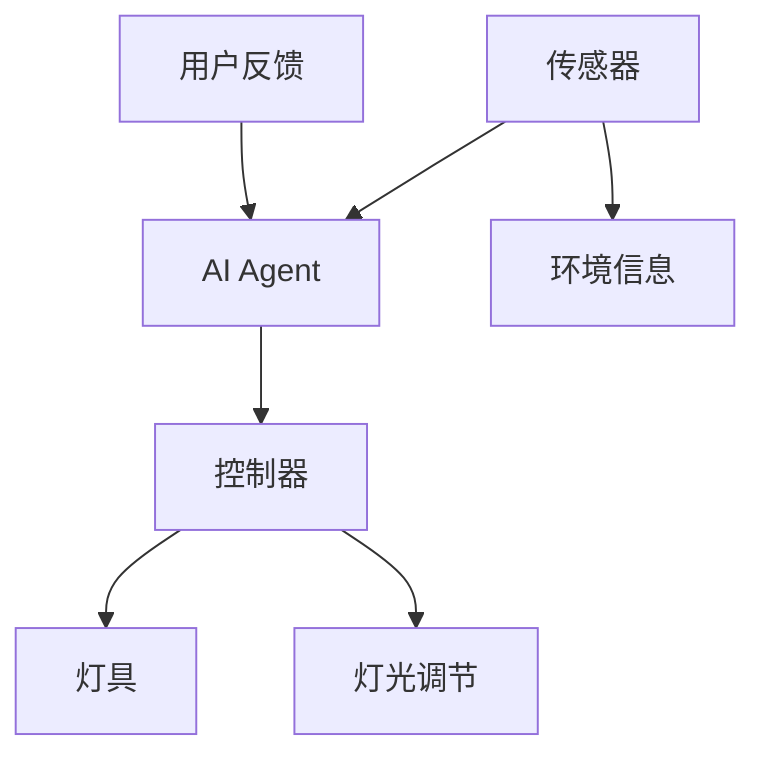

# AI Agent在智能书桌灯中的照明优化

> 关键词：AI Agent、智能书桌灯、照明优化、光照算法、用户体验

> 摘要：本文聚焦于AI Agent在智能书桌灯中的照明优化应用。详细介绍了AI Agent和智能书桌灯的核心概念及其联系，阐述了用于照明优化的核心算法原理和具体操作步骤，并给出了相应的Python代码示例。通过数学模型和公式进一步剖析照明优化的理论基础，结合实际项目案例展示如何开发和实现智能书桌灯的照明优化功能。探讨了该技术在实际场景中的应用，推荐了相关的学习资源、开发工具和研究论文。最后对未来发展趋势与挑战进行总结，为相关领域的研究和开发提供全面的参考。

## 1. 背景介绍 
### 1.1 目的和范围
随着智能家居的快速发展，智能书桌灯作为其中的重要组成部分，其照明效果的优化越来越受到关注。本文章的目的是深入探讨如何利用AI Agent技术来实现智能书桌灯的照明优化，提高用户的使用体验和视觉舒适度。范围涵盖了AI Agent的基本原理、照明优化的算法设计、实际项目的开发与实现，以及该技术在不同场景下的应用。

### 1.2 预期读者
本文预期读者包括对智能家居、人工智能、照明技术等领域感兴趣的技术爱好者、研究人员、开发者，以及相关行业的从业人员。对于希望了解如何将AI技术应用于实际产品中的读者，本文将提供有价值的参考。

### 1.3 文档结构概述
本文将按照以下结构进行阐述：首先介绍核心概念与联系，包括AI Agent和智能书桌灯的定义和关系；接着详细讲解核心算法原理和具体操作步骤，并给出Python代码示例；然后通过数学模型和公式进一步分析照明优化的原理；再通过项目实战展示如何实现智能书桌灯的照明优化；之后探讨实际应用场景；推荐相关的工具和资源；最后总结未来发展趋势与挑战，并提供常见问题解答和扩展阅读参考资料。

### 1.4 术语表
#### 1.4.1 核心术语定义
- **AI Agent（人工智能代理）**：是一种能够感知环境、进行决策并采取行动以实现特定目标的智能实体。在智能书桌灯中，AI Agent可以根据环境信息和用户需求，自动调整灯光的亮度、颜色等参数。
- **智能书桌灯**：具备智能化控制功能的书桌灯，能够通过传感器感知环境信息，并根据预设的规则或AI Agent的决策进行灯光调节。
- **照明优化**：通过调整灯光的亮度、颜色、分布等参数，使照明效果达到最佳状态，满足用户的视觉需求和舒适度要求。

#### 1.4.2 相关概念解释
- **环境感知**：智能书桌灯通过各种传感器（如光线传感器、人体传感器等）获取周围环境的信息，如光照强度、环境颜色、是否有人等。
- **决策制定**：AI Agent根据环境感知的结果和预设的目标，运用算法进行分析和推理，制定出最佳的灯光调节策略。
- **灯光调节**：根据决策制定的结果，智能书桌灯调整灯光的亮度、颜色、色温等参数，以实现照明优化。

#### 1.4.3 缩略词列表
- **AI**：Artificial Intelligence，人工智能
- **LED**：Light Emitting Diode，发光二极管

## 2. 核心概念与联系 

### 2.1 AI Agent的原理
AI Agent是人工智能领域的一个重要概念，它可以看作是一个自主的智能体，能够在特定的环境中感知信息、进行决策并采取行动。其基本原理可以用以下几个步骤来描述：
1. **感知环境**：AI Agent通过各种传感器获取周围环境的信息，这些信息可以是物理量（如温度、湿度、光照强度等）、图像、声音等。
2. **信息处理**：将感知到的信息进行处理和分析，提取有用的特征和模式。
3. **决策制定**：根据处理后的信息和预设的目标，运用算法进行推理和决策，选择最佳的行动方案。
4. **行动执行**：将决策结果转化为具体的行动，对环境产生影响。

### 2.2 智能书桌灯的架构
智能书桌灯通常由以下几个部分组成：
1. **灯具**：提供照明功能，通常采用LED灯作为光源。
2. **传感器**：用于感知环境信息，如光线传感器、人体传感器、颜色传感器等。
3. **控制器**：接收传感器的信息，根据预设的规则或AI Agent的决策，控制灯具的亮度、颜色等参数。
4. **通信模块**：实现智能书桌灯与其他设备（如手机、智能家居系统等）的通信，方便用户进行远程控制。

### 2.3 AI Agent与智能书桌灯的联系
AI Agent可以作为智能书桌灯的核心决策单元，通过感知环境信息和用户需求，自动调整灯光的参数，实现照明优化。具体来说，AI Agent与智能书桌灯的联系如下：
1. **数据交互**：AI Agent通过传感器获取智能书桌灯周围的环境信息，同时将决策结果发送给控制器，控制灯光的调节。
2. **智能决策**：AI Agent根据环境信息和用户需求，运用算法进行分析和决策，制定出最佳的灯光调节策略。
3. **用户反馈**：用户可以通过手机应用或其他设备向AI Agent提供反馈信息，AI Agent根据用户反馈不断优化决策策略，提高用户的使用体验。

### 2.4 文本示意图
```plaintext
+----------------+        +----------------+        +----------------+
|    传感器     | -----> |    AI Agent    | -----> |    控制器     |
+----------------+        +----------------+        +----------------+
          |                                        |
          |                                        |
          v                                        v
     环境信息                                  灯光调节
```

### 2.5 Mermaid流程图


## 3. 核心算法原理 & 具体操作步骤 

### 3.1 光照强度优化算法原理
光照强度优化的目标是根据环境光照强度和用户需求，自动调整智能书桌灯的亮度，使桌面的光照强度达到最佳值。常用的算法是基于PID（Proportional-Integral-Derivative）控制的算法。

PID控制算法是一种经典的控制算法，它根据系统的误差（设定值与实际值之间的差值）来计算控制量，以实现对系统的精确控制。在光照强度优化中，误差为设定的最佳光照强度与实际光照强度之间的差值，控制量为智能书桌灯的亮度调节值。

### 3.2 Python代码实现
```python
class PIDController:
    def __init__(self, kp, ki, kd):
        self.kp = kp  # 比例系数
        self.ki = ki  # 积分系数
        self.kd = kd  # 微分系数
        self.prev_error = 0
        self.integral = 0

    def update(self, setpoint, current_value):
        error = setpoint - current_value
        self.integral += error
        derivative = error - self.prev_error
        output = self.kp * error + self.ki * self.integral + self.kd * derivative
        self.prev_error = error
        return output

# 示例参数
kp = 0.5
ki = 0.1
kd = 0.2
pid = PIDController(kp, ki, kd)

# 设定最佳光照强度
setpoint = 500  # 单位：lux

# 模拟实际光照强度
current_value = 300  # 单位：lux

# 计算亮度调节值
adjustment = pid.update(setpoint, current_value)
print(f"亮度调节值: {adjustment}")
```

### 3.3 具体操作步骤
1. **初始化PID控制器**：设置比例系数 $K_p$、积分系数 $K_i$ 和微分系数 $K_d$。
2. **获取环境光照强度**：通过光线传感器获取智能书桌灯周围的实际光照强度。
3. **计算误差**：计算设定的最佳光照强度与实际光照强度之间的差值。
4. **更新PID控制器**：根据误差计算亮度调节值。
5. **调整灯光亮度**：将亮度调节值发送给控制器，控制智能书桌灯的亮度。
6. **重复步骤2 - 5**：不断监测环境光照强度，实时调整灯光亮度，使桌面的光照强度保持在最佳值附近。

## 4. 数学模型和公式 & 详细讲解 & 举例说明 

### 4.1 PID控制算法的数学模型
PID控制算法的数学表达式为：
$$u(t) = K_p e(t) + K_i \int_{0}^{t} e(\tau) d\tau + K_d \frac{de(t)}{dt}$$
其中：
- $u(t)$ 是控制量，即亮度调节值。
- $K_p$ 是比例系数，用于调整当前误差的影响。
- $K_i$ 是积分系数，用于消除系统的稳态误差。
- $K_d$ 是微分系数，用于预测误差的变化趋势，提高系统的响应速度。
- $e(t)$ 是误差，即设定值与实际值之间的差值。

### 4.2 公式详细讲解
- **比例项**：$K_p e(t)$ 直接根据当前误差的大小来计算控制量，误差越大，控制量越大。比例系数 $K_p$ 越大，系统的响应速度越快，但可能会导致系统超调。
- **积分项**：$K_i \int_{0}^{t} e(\tau) d\tau$ 是误差的积分，用于消除系统的稳态误差。积分系数 $K_i$ 越大，积分作用越强，但可能会导致系统的响应速度变慢，甚至出现积分饱和现象。
- **微分项**：$K_d \frac{de(t)}{dt}$ 是误差的微分，用于预测误差的变化趋势。微分系数 $K_d$ 越大，系统的响应速度越快，能够有效抑制系统的超调，但可能会对噪声敏感。

### 4.3 举例说明
假设设定的最佳光照强度为 $500$ lux，实际光照强度为 $300$ lux，误差 $e(t) = 500 - 300 = 200$ lux。
- 比例项：如果 $K_p = 0.5$，则比例项为 $0.5 \times 200 = 100$。
- 积分项：假设积分项的初始值为 $0$，$K_i = 0.1$，则积分项为 $0.1 \times 200 = 20$。
- 微分项：假设上一次的误差为 $150$ lux，则误差的变化率为 $\frac{200 - 150}{1} = 50$ lux/s（假设时间间隔为 $1$ s），如果 $K_d = 0.2$，则微分项为 $0.2 \times 50 = 10$。

控制量 $u(t) = 100 + 20 + 10 = 130$，即需要将智能书桌灯的亮度增加 $130$ 个单位（具体单位根据实际情况而定）。

## 5. 项目实战：代码实际案例和详细解释说明 

### 5.1  开发环境搭建
#### 5.1.1 硬件准备
- 智能书桌灯：可以选择支持智能控制的LED书桌灯。
- 光线传感器：用于感知环境光照强度，如BH1750光照传感器。
- 开发板：如Arduino、Raspberry Pi等，用于控制智能书桌灯和读取光线传感器的数据。
- 面包板、杜邦线等：用于连接硬件设备。

#### 5.1.2 软件准备
- Arduino IDE或Raspberry Pi的开发环境：用于编写和上传代码。
- Python环境：用于运行PID控制算法的代码。

### 5.2  源代码详细实现和代码解读
#### 5.2.1 硬件连接
将光线传感器连接到开发板的I2C接口，将智能书桌灯连接到开发板的PWM接口。

#### 5.2.2 Python代码实现
```python
import smbus
import time
import RPi.GPIO as GPIO

# 初始化I2C总线
bus = smbus.SMBus(1)

# 光线传感器地址
BH1750_ADDRESS = 0x23

# 初始化GPIO
GPIO.setmode(GPIO.BCM)
LED_PIN = 18
GPIO.setup(LED_PIN, GPIO.OUT)
pwm = GPIO.PWM(LED_PIN, 100)
pwm.start(0)

# PID控制器类
class PIDController:
    def __init__(self, kp, ki, kd):
        self.kp = kp
        self.ki = ki
        self.kd = kd
        self.prev_error = 0
        self.integral = 0

    def update(self, setpoint, current_value):
        error = setpoint - current_value
        self.integral += error
        derivative = error - self.prev_error
        output = self.kp * error + self.ki * self.integral + self.kd * derivative
        self.prev_error = error
        return output

# 读取光照强度
def read_light_intensity():
    data = bus.read_i2c_block_data(BH1750_ADDRESS, 0x23)
    light_intensity = ((data[1] + (256 * data[0])) / 1.2)
    return light_intensity

# 示例参数
kp = 0.5
ki = 0.1
kd = 0.2
pid = PIDController(kp, ki, kd)

# 设定最佳光照强度
setpoint = 500  # 单位：lux

try:
    while True:
        # 读取光照强度
        current_value = read_light_intensity()
        print(f"当前光照强度: {current_value} lux")

        # 计算亮度调节值
        adjustment = pid.update(setpoint, current_value)
        # 限制调节值在0 - 100之间
        adjustment = max(0, min(100, adjustment))
        print(f"亮度调节值: {adjustment}")

        # 调整灯光亮度
        pwm.ChangeDutyCycle(adjustment)

        time.sleep(1)

except KeyboardInterrupt:
    print("程序终止")
    pwm.stop()
    GPIO.cleanup()
```

#### 5.2.3 代码解读
- **初始化部分**：初始化I2C总线、GPIO接口和PID控制器。
- **读取光照强度函数**：通过I2C接口读取光线传感器的数据，并计算出当前的光照强度。
- **PID控制器类**：实现了PID控制算法的核心逻辑，根据误差计算亮度调节值。
- **主循环部分**：不断读取光照强度，计算亮度调节值，并调整智能书桌灯的亮度。

### 5.3  代码解读与分析
#### 5.3.1 代码优点
- **模块化设计**：将PID控制算法封装在一个类中，提高了代码的可复用性和可维护性。
- **实时调节**：通过不断读取光照强度，实时调整灯光亮度，使桌面的光照强度保持在最佳值附近。
- **错误处理**：使用`try-except`语句捕获键盘中断异常，确保程序在终止时能够正确清理资源。

#### 5.3.2 代码改进建议
- **参数优化**：可以通过实验和调试，优化PID控制器的参数 $K_p$、$K_i$ 和 $K_d$，提高系统的性能。
- **多传感器融合**：除了光线传感器，还可以引入其他传感器（如人体传感器、颜色传感器等），实现更智能的照明优化。
- **远程控制**：可以添加通信模块，实现通过手机应用或智能家居系统对智能书桌灯进行远程控制。

## 6. 实际应用场景 
### 6.1 学习场景
在学习场景中，智能书桌灯可以根据环境光照强度和用户的学习状态，自动调整灯光的亮度和颜色。例如，在白天光线充足时，降低灯光亮度，节省能源；在晚上光线较暗时，提高灯光亮度，保证学习的舒适度。同时，根据学习的不同阶段（如阅读、书写、绘图等），调整灯光的颜色和色温，提高视觉效果。

### 6.2 工作场景
在工作场景中，智能书桌灯可以根据工作内容和时间，自动调整灯光的参数。例如，在进行长时间的文字处理工作时，提供柔和的白色灯光，减少眼睛疲劳；在进行创意设计工作时，提供更丰富的颜色和更高的亮度，激发创造力。此外，还可以根据工作时间的长短，自动调整灯光的亮度和颜色，提醒用户适当休息。

### 6.3 休闲场景
在休闲场景中，智能书桌灯可以营造出不同的氛围。例如，在阅读小说时，提供温暖的黄色灯光，营造出舒适的阅读氛围；在观看电影时，调暗灯光，增强观影体验。用户还可以通过手机应用或语音控制，自定义灯光的颜色和亮度，满足个性化的需求。

## 7. 工具和资源推荐
### 7.1 学习资源推荐
#### 7.1.1 书籍推荐
- 《人工智能：一种现代的方法》：全面介绍了人工智能的基本概念、算法和应用，是人工智能领域的经典教材。
- 《Python机器学习实战》：通过实际案例，详细介绍了Python在机器学习中的应用，适合初学者学习。
- 《智能家居技术与应用》：介绍了智能家居的基本原理、技术和应用，对智能书桌灯的开发有一定的参考价值。

#### 7.1.2 在线课程
- Coursera上的“人工智能基础”课程：由知名高校的教授授课，系统地介绍了人工智能的基础知识和算法。
- edX上的“Python编程入门”课程：适合零基础的学习者，通过实际项目学习Python编程。
- 网易云课堂上的“智能家居开发实战”课程：结合实际项目，介绍了智能家居的开发流程和技术。

#### 7.1.3 技术博客和网站
- Medium：上面有很多关于人工智能、智能家居等领域的技术文章和经验分享。
- Hackster.io：提供了大量的开源硬件项目和教程，对智能书桌灯的开发有很大的帮助。
- 开源中国：国内知名的开源技术社区，有很多关于人工智能和智能家居的技术文章和代码分享。

### 7.2 开发工具框架推荐
#### 7.2.1 IDE和编辑器
- PyCharm：功能强大的Python集成开发环境，提供了代码编辑、调试、版本控制等功能。
- Visual Studio Code：轻量级的代码编辑器，支持多种编程语言和插件扩展，适合快速开发。
- Arduino IDE：专门用于Arduino开发板的集成开发环境，简单易用。

#### 7.2.2 调试和性能分析工具
- Py-Spy：用于分析Python程序的性能，找出性能瓶颈。
- GDB：通用的调试器，可以用于调试C、C++、Python等多种编程语言的程序。
- Wireshark：网络协议分析工具，可以用于调试智能书桌灯的通信模块。

#### 7.2.3 相关框架和库
- TensorFlow：开源的机器学习框架，提供了丰富的深度学习模型和工具。
- PyTorch：另一个流行的深度学习框架，具有简洁易用的API。
- Adafruit CircuitPython：适用于微控制器的Python库，方便开发智能书桌灯的硬件控制程序。

### 7.3 相关论文著作推荐
#### 7.3.1 经典论文
- “Artificial Intelligence: A New Synthesis”：介绍了人工智能的基本概念和方法，对理解AI Agent的原理有很大的帮助。
- “PID Controllers: Theory, Design, and Tuning”：详细介绍了PID控制算法的理论和设计方法。
- “Smart Lighting Systems: A Review”：对智能照明系统的发展现状和技术进行了综述。

#### 7.3.2 最新研究成果
- 关注IEEE Transactions on Smart Grid、ACM Transactions on Sensor Networks等顶级学术期刊，了解智能照明和AI Agent领域的最新研究成果。
- 参加相关的国际学术会议，如ACM SIGKDD、IEEE ICC等，与国内外的专家学者交流最新的研究进展。

#### 7.3.3 应用案例分析
- 一些知名企业（如小米、华为等）的智能家居产品文档和技术博客，会分享智能书桌灯等产品的开发经验和应用案例。
- 开源项目平台（如GitHub）上有很多智能书桌灯的开源项目，可以参考其代码和文档进行学习和开发。

## 8. 总结：未来发展趋势与挑战
### 8.1 未来发展趋势
- **智能化程度不断提高**：随着人工智能技术的不断发展，AI Agent在智能书桌灯中的应用将更加深入，能够实现更加智能化的照明优化。例如，通过深度学习算法，AI Agent可以学习用户的使用习惯和偏好，自动调整灯光的参数，提供个性化的照明服务。
- **多传感器融合**：未来的智能书桌灯将集成更多的传感器，如人体传感器、声音传感器、手势传感器等，实现多传感器融合。通过综合分析多种传感器的数据，AI Agent可以更准确地感知用户的需求和环境变化，提供更加智能的照明控制。
- **与智能家居系统的深度融合**：智能书桌灯将成为智能家居系统的重要组成部分，与其他智能设备（如智能音箱、智能窗帘、智能空调等）实现互联互通。用户可以通过智能家居系统统一控制智能书桌灯和其他设备，实现更加便捷的家居生活体验。
- **节能环保**：随着人们对节能环保意识的提高，智能书桌灯将更加注重节能和环保。例如，采用高效的LED光源，通过智能控制算法，根据环境光照强度和用户需求自动调整灯光亮度，降低能源消耗。

### 8.2 挑战
- **数据隐私和安全问题**：智能书桌灯在运行过程中会收集大量的用户数据，如使用习惯、环境信息等。如何保护这些数据的隐私和安全，防止数据泄露和滥用，是一个亟待解决的问题。
- **算法复杂度和计算资源需求**：随着智能化程度的提高，AI Agent的算法复杂度也会不断增加，对计算资源的需求也会越来越大。如何在保证算法性能的前提下，降低计算资源的消耗，是一个挑战。
- **用户体验和接受度**：智能书桌灯的功能和操作方式应该简单易懂，符合用户的使用习惯。如何提高用户体验，让用户更容易接受和使用智能书桌灯，是推广智能书桌灯的关键。
- **标准和规范的缺乏**：目前，智能书桌灯领域还缺乏统一的标准和规范，不同厂家的产品在功能、接口、通信协议等方面存在差异。这给用户的使用和集成带来了一定的困难，也不利于行业的健康发展。

## 9. 附录：常见问题与解答
### 9.1 如何选择合适的PID控制器参数？
选择合适的PID控制器参数需要通过实验和调试。一般可以采用试错法，先设置一个初始的参数值，然后观察系统的响应情况，根据响应情况调整参数。也可以采用一些自动调参方法，如Ziegler-Nichols方法等。

### 9.2 智能书桌灯的光照强度调节范围是多少？
智能书桌灯的光照强度调节范围取决于灯具的类型和功率。一般来说，LED智能书桌灯的光照强度调节范围可以从几lux到几千lux不等。

### 9.3 智能书桌灯可以与哪些智能家居系统集成？
智能书桌灯可以与常见的智能家居系统集成，如小米智能家居、华为智能家居、苹果HomeKit等。具体的集成方式和兼容性取决于智能书桌灯的通信协议和智能家居系统的接口要求。

### 9.4 如何保证智能书桌灯的数据安全？
为了保证智能书桌灯的数据安全，可以采取以下措施：
- 采用加密通信协议，对传输的数据进行加密处理。
- 定期更新智能书桌灯的固件，修复安全漏洞。
- 设置强密码，防止他人非法访问。
- 选择可靠的智能家居平台和厂家，确保其有完善的数据安全保障机制。

## 10. 扩展阅读 & 参考资料
- 《智能家居：技术与应用》
- 《人工智能算法（卷1）：基础算法》
- IEEE Transactions on Smart Grid
- ACM Transactions on Sensor Networks
- Hackster.io上的智能书桌灯开源项目

作者：AI天才研究院/AI Genius Institute & 禅与计算机程序设计艺术 /Zen And The Art of Computer Programming