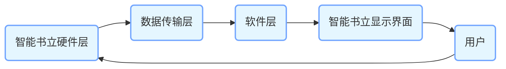

# AI Agent在智能书立中的阅读习惯培养

> 关键词：AI Agent、智能书立、阅读习惯培养、个性化推荐、数据分析

> 摘要：本文深入探讨了AI Agent在智能书立中对于阅读习惯培养的应用。通过对AI Agent和智能书立相关概念的介绍，阐述了其核心原理和架构。详细分析了用于阅读习惯培养的核心算法，结合数学模型进行深入讲解。通过项目实战案例展示了具体的代码实现和解读。同时探讨了其实际应用场景，推荐了相关的工具和资源。最后总结了未来的发展趋势与挑战，并对常见问题进行了解答。旨在为利用AI Agent和智能书立培养良好阅读习惯提供全面的技术指导和理论支持。

## 1. 背景介绍 
### 1.1 目的和范围
随着科技的不断发展，人们的阅读方式和习惯也在发生着变化。智能设备逐渐融入到阅读场景中，为阅读带来了更多的便利和可能性。本文章的目的在于探讨如何利用AI Agent技术，结合智能书立这一硬件设备，来培养用户良好的阅读习惯。

本文的范围涵盖了AI Agent和智能书立的核心概念、相关算法原理、数学模型、项目实战案例、实际应用场景以及工具资源推荐等方面。通过全面的分析和阐述，为读者提供一个关于AI Agent在智能书立中阅读习惯培养的完整技术体系。

### 1.2 预期读者
本文预期读者主要包括对人工智能、智能硬件、阅读教育等领域感兴趣的技术人员、教育工作者、产品开发者以及相关专业的学生。对于希望了解如何利用先进技术来改善阅读体验和培养阅读习惯的人士也具有一定的参考价值。

### 1.3 文档结构概述
本文将按照以下结构进行阐述：首先介绍背景信息，包括目的、预期读者和文档结构概述；接着详细讲解核心概念与联系，包括AI Agent和智能书立的原理和架构；然后深入分析核心算法原理和具体操作步骤，并给出Python源代码示例；随后介绍相关的数学模型和公式，并进行详细讲解和举例说明；通过项目实战展示代码实际案例和详细解释；探讨实际应用场景；推荐相关的工具和资源；总结未来发展趋势与挑战；最后在附录中解答常见问题，并提供扩展阅读和参考资料。

### 1.4 术语表
#### 1.4.1 核心术语定义
- **AI Agent（人工智能代理）**：是一种能够感知环境、根据感知信息进行决策并采取行动以实现特定目标的智能实体。在本文中，AI Agent用于分析用户的阅读行为和偏好，为用户提供个性化的阅读建议和引导。
- **智能书立**：是一种具备智能化功能的书立设备，它可以与AI Agent进行交互，通过传感器等技术获取书籍的相关信息以及用户的阅读行为数据，并将这些数据传输给AI Agent进行分析和处理。
- **阅读习惯培养**：指通过一系列的方法和措施，帮助用户建立起稳定、良好的阅读行为模式，提高阅读的频率、质量和兴趣。

#### 1.4.2 相关概念解释
- **个性化推荐**：根据用户的个人特征、历史行为和偏好等信息，为用户提供符合其特定需求的推荐内容。在阅读习惯培养中，个性化推荐可以为用户推荐适合他们的书籍、阅读时间和阅读方式等。
- **数据分析**：对收集到的数据进行清洗、整理、分析和挖掘，以发现数据中的规律和模式。在本文中，数据分析用于处理智能书立收集到的用户阅读行为数据，为AI Agent的决策提供依据。

#### 1.4.3 缩略词列表
- **AI（Artificial Intelligence）**：人工智能
- **ML（Machine Learning）**：机器学习
- **NLP（Natural Language Processing）**：自然语言处理

## 2. 核心概念与联系 

### 2.1 AI Agent原理
AI Agent的核心原理基于感知、决策和行动三个主要环节。感知环节通过各种传感器或接口获取环境信息，例如智能书立可以通过重量传感器感知书籍的放置和拿取情况，通过摄像头识别书籍的封面信息等。决策环节则根据感知到的信息，利用预设的规则或机器学习模型进行分析和判断，确定应该采取的行动。行动环节则将决策结果转化为具体的操作，例如向用户推送阅读建议、调整智能书立的显示界面等。

### 2.2 智能书立架构
智能书立的架构主要包括硬件层、数据传输层和软件层。硬件层由各种传感器、控制器和显示设备组成，用于感知书籍和用户的信息，并进行基本的控制和显示操作。数据传输层负责将硬件层收集到的数据传输到服务器或本地设备进行处理，通常采用无线通信技术，如Wi-Fi、蓝牙等。软件层则包括操作系统、应用程序和AI Agent等，用于对数据进行分析和处理，实现个性化推荐、阅读习惯培养等功能。

### 2.3 两者联系
AI Agent和智能书立之间存在着紧密的联系。智能书立为AI Agent提供了数据来源，通过各种传感器收集用户的阅读行为数据，如阅读时间、阅读频率、阅读书籍的种类等。AI Agent则利用这些数据进行分析和处理，为智能书立提供决策支持，例如根据用户的阅读偏好推荐合适的书籍，根据用户的阅读时间安排提醒等。两者相互协作，共同实现阅读习惯培养的目标。

### 2.4 文本示意图
```plaintext
智能书立硬件层（传感器、控制器、显示设备）
    |
    | 数据收集
    v
数据传输层（Wi-Fi、蓝牙等）
    |
    | 数据传输
    v
软件层（操作系统、应用程序、AI Agent）
    |
    | 数据分析与决策
    v
智能书立显示界面（阅读建议、提醒等）
```

### 2.5 Mermaid流程图


## 3. 核心算法原理 & 具体操作步骤 

### 3.1 核心算法原理
为了实现阅读习惯培养的目标，我们可以采用基于机器学习的推荐算法，如协同过滤算法和深度学习算法。协同过滤算法通过分析用户之间的相似性，为用户推荐其他相似用户喜欢的书籍。深度学习算法则可以通过对大量文本数据的学习，理解书籍的内容和主题，为用户提供更加精准的推荐。

### 3.2 具体操作步骤
#### 3.2.1 数据收集
智能书立通过各种传感器收集用户的阅读行为数据，包括书籍的放置和拿取时间、阅读时长、阅读书籍的ISBN号等。这些数据将被传输到服务器或本地设备进行存储和处理。

#### 3.2.2 数据预处理
对收集到的数据进行清洗和整理，去除噪声和异常值。同时，对数据进行特征提取，例如将阅读时间转换为时间特征，将书籍的ISBN号转换为书籍特征等。

#### 3.2.3 模型训练
使用预处理后的数据对机器学习模型进行训练。对于协同过滤算法，可以计算用户之间的相似度矩阵；对于深度学习算法，可以使用卷积神经网络（CNN）或循环神经网络（RNN）对书籍文本进行学习。

#### 3.2.4 推荐生成
根据训练好的模型，为用户生成个性化的阅读推荐。推荐内容可以包括书籍名称、作者、简介等信息。

#### 3.2.5 反馈与优化
根据用户的反馈信息，对模型进行优化和调整。例如，如果用户对某一推荐书籍不感兴趣，可以调整模型的参数，减少类似书籍的推荐。

### 3.3 Python源代码示例
```python
import pandas as pd
from sklearn.metrics.pairwise import cosine_similarity

# 模拟数据收集
data = {
    'user_id': [1, 1, 2, 2, 3, 3],
    'book_id': [101, 102, 101, 103, 102, 103],
    'rating': [5, 4, 3, 5, 4, 3]
}
df = pd.DataFrame(data)

# 数据预处理：构建用户-书籍评分矩阵
user_book_matrix = df.pivot(index='user_id', columns='book_id', values='rating').fillna(0)

# 计算用户之间的相似度矩阵
user_similarity = cosine_similarity(user_book_matrix)

# 定义推荐函数
def recommend_books(user_id, top_n=3):
    user_index = user_book_matrix.index.tolist().index(user_id)
    similar_users = user_similarity[user_index].argsort()[::-1][1:top_n + 1]
    similar_users_books = user_book_matrix.iloc[similar_users].mean(axis=0)
    user_books = user_book_matrix.iloc[user_index]
    unread_books = similar_users_books[user_books == 0]
    recommended_books = unread_books.sort_values(ascending=False).head(top_n).index.tolist()
    return recommended_books

# 为用户1推荐书籍
recommended_books = recommend_books(1)
print(f"为用户1推荐的书籍：{recommended_books}")
```

## 4. 数学模型和公式 & 详细讲解 & 举例说明 

### 4.1 协同过滤算法数学模型
协同过滤算法主要基于用户之间的相似度来进行推荐。常用的相似度计算方法有余弦相似度和皮尔逊相关系数。

#### 4.1.1 余弦相似度
余弦相似度用于计算两个向量之间的夹角余弦值，值越接近1表示两个向量越相似。对于两个用户 $u$ 和 $v$，他们的评分向量分别为 $\mathbf{r}_u$ 和 $\mathbf{r}_v$，余弦相似度的计算公式为：

$$
\text{sim}(u, v) = \frac{\mathbf{r}_u \cdot \mathbf{r}_v}{\|\mathbf{r}_u\| \|\mathbf{r}_v\|}
$$

其中，$\mathbf{r}_u \cdot \mathbf{r}_v$ 表示向量的点积，$\|\mathbf{r}_u\|$ 和 $\|\mathbf{r}_v\|$ 分别表示向量的模。

#### 4.1.2 皮尔逊相关系数
皮尔逊相关系数用于衡量两个变量之间的线性相关性。对于两个用户 $u$ 和 $v$，他们的评分向量分别为 $\mathbf{r}_u$ 和 $\mathbf{r}_v$，皮尔逊相关系数的计算公式为：

$$
\text{corr}(u, v) = \frac{\sum_{i \in I_{uv}} (r_{ui} - \bar{r}_u)(r_{vi} - \bar{r}_v)}{\sqrt{\sum_{i \in I_{uv}} (r_{ui} - \bar{r}_u)^2 \sum_{i \in I_{uv}} (r_{vi} - \bar{r}_v)^2}}
$$

其中，$I_{uv}$ 表示用户 $u$ 和 $v$ 共同评分的书籍集合，$r_{ui}$ 和 $r_{vi}$ 分别表示用户 $u$ 和 $v$ 对书籍 $i$ 的评分，$\bar{r}_u$ 和 $\bar{r}_v$ 分别表示用户 $u$ 和 $v$ 的平均评分。

### 4.2 深度学习算法数学模型
深度学习算法通常使用神经网络来进行建模。以卷积神经网络（CNN）为例，其基本结构包括输入层、卷积层、池化层、全连接层和输出层。

#### 4.2.1 卷积层
卷积层通过卷积核在输入数据上进行滑动卷积操作，提取数据的特征。对于输入数据 $X$ 和卷积核 $W$，卷积操作的计算公式为：

$$
Y_{ij} = \sum_{m=0}^{M-1} \sum_{n=0}^{N-1} X_{i+m, j+n} W_{mn} + b
$$

其中，$Y_{ij}$ 表示卷积输出的第 $(i, j)$ 个元素，$M$ 和 $N$ 分别表示卷积核的高度和宽度，$b$ 表示偏置项。

#### 4.2.2 池化层
池化层用于对卷积层的输出进行下采样，减少数据的维度。常用的池化方法有最大池化和平均池化。以最大池化为例，对于输入数据 $X$，池化窗口大小为 $K \times K$，最大池化操作的计算公式为：

$$
Y_{ij} = \max_{m=0}^{K-1} \max_{n=0}^{K-1} X_{iK+m, jK+n}
$$

#### 4.2.3 全连接层
全连接层将池化层的输出进行线性变换，得到最终的输出结果。对于输入向量 $\mathbf{x}$ 和权重矩阵 $\mathbf{W}$，全连接层的输出向量 $\mathbf{y}$ 的计算公式为：

$$
\mathbf{y} = \mathbf{W} \mathbf{x} + \mathbf{b}
$$

其中，$\mathbf{b}$ 表示偏置向量。

### 4.3 举例说明
假设我们有三个用户 $A$、$B$、$C$，他们对四本书籍 $1$、$2$、$3$、$4$ 的评分如下表所示：

| 用户 | 书籍1 | 书籍2 | 书籍3 | 书籍4 |
|------|-------|-------|-------|-------|
| A    | 5     | 4     | 0     | 3     |
| B    | 3     | 5     | 4     | 0     |
| C    | 0     | 3     | 5     | 4     |

我们可以使用余弦相似度来计算用户之间的相似度。以用户 $A$ 和 $B$ 为例，他们的评分向量分别为 $\mathbf{r}_A = [5, 4, 0, 3]$ 和 $\mathbf{r}_B = [3, 5, 4, 0]$，则他们的余弦相似度为：

$$
\text{sim}(A, B) = \frac{\mathbf{r}_A \cdot \mathbf{r}_B}{\|\mathbf{r}_A\| \|\mathbf{r}_B\|} = \frac{5 \times 3 + 4 \times 5 + 0 \times 4 + 3 \times 0}{\sqrt{5^2 + 4^2 + 0^2 + 3^2} \sqrt{3^2 + 5^2 + 4^2 + 0^2}} \approx 0.74
$$

根据计算得到的相似度矩阵，我们可以为用户 $A$ 推荐其他用户喜欢的书籍。

## 5. 项目实战：代码实际案例和详细解释说明 

### 5.1  开发环境搭建
#### 5.1.1 硬件环境
- 智能书立设备：具备重量传感器、摄像头等功能，用于收集书籍和用户的信息。
- 服务器或本地开发机：用于运行AI Agent和处理数据，建议配置至少8GB内存和Intel Core i5以上处理器。

#### 5.1.2 软件环境
- 操作系统：推荐使用Ubuntu 18.04或以上版本。
- Python环境：安装Python 3.7或以上版本，并安装以下必要的库：
  - Pandas：用于数据处理和分析。
  - Scikit-learn：用于机器学习算法的实现。
  - TensorFlow或PyTorch：用于深度学习模型的开发。

### 5.2  源代码详细实现和代码解读
```python
import pandas as pd
from sklearn.metrics.pairwise import cosine_similarity
import tensorflow as tf
from tensorflow.keras.models import Sequential
from tensorflow.keras.layers import Embedding, Flatten, Dense

# 数据收集和预处理
data = {
    'user_id': [1, 1, 2, 2, 3, 3],
    'book_id': [101, 102, 101, 103, 102, 103],
    'rating': [5, 4, 3, 5, 4, 3]
}
df = pd.DataFrame(data)

# 构建用户-书籍评分矩阵
user_book_matrix = df.pivot(index='user_id', columns='book_id', values='rating').fillna(0)

# 计算用户之间的相似度矩阵
user_similarity = cosine_similarity(user_book_matrix)

# 定义推荐函数（协同过滤）
def recommend_books_cf(user_id, top_n=3):
    user_index = user_book_matrix.index.tolist().index(user_id)
    similar_users = user_similarity[user_index].argsort()[::-1][1:top_n + 1]
    similar_users_books = user_book_matrix.iloc[similar_users].mean(axis=0)
    user_books = user_book_matrix.iloc[user_index]
    unread_books = similar_users_books[user_books == 0]
    recommended_books = unread_books.sort_values(ascending=False).head(top_n).index.tolist()
    return recommended_books

# 构建深度学习模型（简单的推荐模型）
num_users = df['user_id'].nunique()
num_books = df['book_id'].nunique()

model = Sequential([
    Embedding(input_dim=num_users, output_dim=10),
    Flatten(),
    Dense(10, activation='relu'),
    Dense(num_books, activation='softmax')
])

model.compile(optimizer='adam', loss='sparse_categorical_crossentropy', metrics=['accuracy'])

# 准备训练数据
user_ids = df['user_id'].values
book_ids = df['book_id'].values
ratings = df['rating'].values

# 训练模型
model.fit(user_ids, book_ids, epochs=10, batch_size=1)

# 定义推荐函数（深度学习）
def recommend_books_dl(user_id, top_n=3):
    user_input = tf.expand_dims(user_id, axis=0)
    predictions = model.predict(user_input)
    top_book_indices = predictions[0].argsort()[::-1][:top_n]
    recommended_books = [df['book_id'].unique()[i] for i in top_book_indices]
    return recommended_books

# 为用户1推荐书籍
recommended_books_cf = recommend_books_cf(1)
recommended_books_dl = recommend_books_dl(1)

print(f"协同过滤为用户1推荐的书籍：{recommended_books_cf}")
print(f"深度学习为用户1推荐的书籍：{recommended_books_dl}")
```

### 5.3  代码解读与分析
#### 5.3.1 协同过滤部分
- 数据预处理：使用Pandas库将数据转换为用户-书籍评分矩阵，方便后续计算相似度。
- 相似度计算：使用Scikit-learn库的`cosine_similarity`函数计算用户之间的余弦相似度。
- 推荐生成：根据相似度矩阵，找出与目标用户最相似的用户，然后推荐这些用户喜欢的书籍。

#### 5.3.2 深度学习部分
- 模型构建：使用TensorFlow的Keras API构建一个简单的推荐模型，包括嵌入层、全连接层和输出层。
- 模型训练：使用用户ID和书籍ID作为输入，书籍ID作为输出，对模型进行训练。
- 推荐生成：根据训练好的模型，对目标用户进行预测，找出最可能喜欢的书籍。

## 6. 实际应用场景 
### 6.1 家庭阅读场景
在家庭环境中，智能书立可以放置在书架上，通过AI Agent为家庭成员提供个性化的阅读推荐。例如，根据每个家庭成员的阅读历史和偏好，推荐适合他们的书籍。同时，智能书立还可以设置阅读提醒功能，帮助家庭成员养成定时阅读的习惯。

### 6.2 学校图书馆场景
在学校图书馆中，智能书立可以安装在书架上，为学生提供更加便捷的图书查找和推荐服务。AI Agent可以根据学生的借阅历史和学习科目，推荐相关的书籍。此外，智能书立还可以统计学生的阅读数据，为学校的阅读教育提供数据支持。

### 6.3 公共图书馆场景
在公共图书馆中，智能书立可以提高图书馆的服务质量和管理效率。通过AI Agent的个性化推荐功能，吸引更多的读者借阅书籍。同时，智能书立还可以实时监测书籍的借阅情况，帮助图书馆管理人员及时补充库存。

## 7. 工具和资源推荐
### 7.1 学习资源推荐
#### 7.1.1 书籍推荐
- 《Python机器学习实战》：介绍了Python在机器学习领域的应用，包括各种机器学习算法的实现和案例分析。
- 《深度学习》：由深度学习领域的三位先驱者编写，系统地介绍了深度学习的理论和实践。
- 《推荐系统实践》：详细讲解了推荐系统的原理、算法和应用，对阅读推荐系统的开发有很大的帮助。

#### 7.1.2 在线课程
- Coursera上的“机器学习”课程：由斯坦福大学教授Andrew Ng授课，是机器学习领域的经典课程。
- edX上的“深度学习”课程：提供了深度学习的基础知识和实践项目。
- Udemy上的“Python数据科学和机器学习实战”课程：结合Python和实际案例，介绍了数据科学和机器学习的应用。

#### 7.1.3 技术博客和网站
- Medium：有很多关于人工智能、机器学习和推荐系统的技术文章。
- Towards Data Science：专注于数据科学和机器学习领域的技术分享。
- AI Stack Exchange：一个问答社区，用户可以在这里提问和交流人工智能相关的问题。

### 7.2 开发工具框架推荐
#### 7.2.1 IDE和编辑器
- PyCharm：一款专业的Python集成开发环境，提供了丰富的代码编辑、调试和部署功能。
- Jupyter Notebook：一个交互式的开发环境，适合进行数据分析和模型实验。
- Visual Studio Code：一款轻量级的代码编辑器，支持多种编程语言和插件扩展。

#### 7.2.2 调试和性能分析工具
- TensorBoard：TensorFlow提供的可视化工具，用于监控模型的训练过程和性能指标。
- Py-Spy：一个Python性能分析工具，可以实时监控Python程序的CPU和内存使用情况。
- Scikit-learn的交叉验证工具：用于评估机器学习模型的性能和选择最佳的模型参数。

#### 7.2.3 相关框架和库
- Pandas：用于数据处理和分析，提供了高效的数据结构和数据操作方法。
- Scikit-learn：一个强大的机器学习库，包含了各种机器学习算法和工具。
- TensorFlow和PyTorch：两个主流的深度学习框架，用于构建和训练深度学习模型。

### 7.3 相关论文著作推荐
#### 7.3.1 经典论文
- “Item-Based Collaborative Filtering Recommendation Algorithms”：介绍了基于物品的协同过滤推荐算法。
- “Deep Neural Networks for YouTube Recommendations”：阐述了YouTube使用深度学习进行视频推荐的方法。
- “Matrix Factorization Techniques for Recommender Systems”：详细讲解了矩阵分解在推荐系统中的应用。

#### 7.3.2 最新研究成果
- 关注ACM SIGKDD、NeurIPS、ICML等顶级学术会议的论文，了解推荐系统和人工智能领域的最新研究动态。
- 查阅相关的学术期刊，如Journal of Artificial Intelligence Research、Artificial Intelligence等。

#### 7.3.3 应用案例分析
- 研究各大科技公司的推荐系统应用案例，如亚马逊的商品推荐、Netflix的视频推荐等。
- 分析智能硬件领域的创新应用，了解如何将AI技术与硬件设备相结合。

## 8. 总结：未来发展趋势与挑战
### 8.1 未来发展趋势
#### 8.1.1 多模态融合
未来的智能书立和AI Agent将不仅仅依赖于文本信息，还会融合图像、语音等多模态信息。例如，通过摄像头识别书籍的封面和内容，通过语音交互与用户进行沟通，提供更加丰富和个性化的阅读体验。

#### 8.1.2 强化学习应用
强化学习可以用于优化阅读习惯培养的策略。通过不断地与用户进行交互，根据用户的反馈调整推荐策略，以达到更好的阅读习惯培养效果。

#### 8.1.3 与智能家居的集成
智能书立可以与智能家居系统进行集成，实现更加智能化的阅读环境控制。例如，根据用户的阅读时间自动调节灯光亮度和温度，提供更加舒适的阅读体验。

### 8.2 挑战
#### 8.2.1 数据隐私和安全
智能书立收集的用户阅读数据涉及到用户的隐私信息，如何保障数据的安全和隐私是一个重要的挑战。需要采用加密技术和严格的访问控制机制，防止数据泄露。

#### 8.2.2 模型可解释性
深度学习模型通常是黑盒模型，其决策过程难以解释。在阅读习惯培养中，用户需要了解推荐的依据，因此提高模型的可解释性是一个亟待解决的问题。

#### 8.2.3 硬件成本和性能
智能书立的硬件成本和性能也是一个挑战。为了实现多模态融合和实时处理，需要配备高性能的传感器和处理器，但这会增加硬件成本。如何在成本和性能之间找到平衡点是一个关键问题。

## 9. 附录：常见问题与解答
### 9.1 智能书立的传感器精度如何保证？
智能书立的传感器精度可以通过定期校准和优化算法来保证。例如，重量传感器可以通过使用标准砝码进行校准，摄像头可以通过图像校准算法提高识别精度。

### 9.2 AI Agent的推荐结果不准确怎么办？
如果AI Agent的推荐结果不准确，可以通过以下方法进行改进：
- 增加数据量：收集更多的用户阅读数据，提高模型的训练效果。
- 优化算法：尝试不同的推荐算法或调整算法的参数，以提高推荐的准确性。
- 收集用户反馈：根据用户的反馈信息，对模型进行优化和调整。

### 9.3 智能书立的续航能力如何？
智能书立的续航能力取决于其硬件设计和使用场景。可以采用低功耗的传感器和处理器，优化电源管理策略，以延长续航时间。同时，也可以提供充电接口，方便用户随时充电。

## 10. 扩展阅读 & 参考资料
- 《人工智能：现代方法》
- 《数据挖掘：概念与技术》
- 相关的学术论文和研究报告

作者：AI天才研究院/AI Genius Institute & 禅与计算机程序设计艺术 /Zen And The Art of Computer Programming