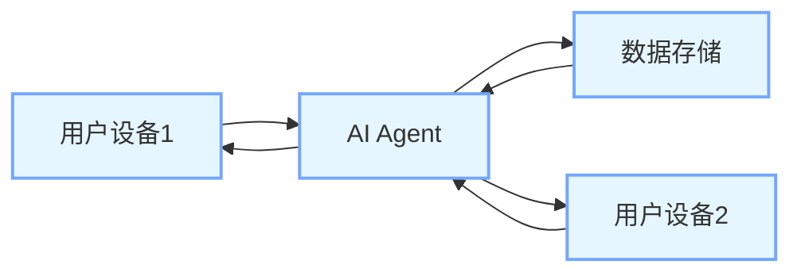

# AI Agent在智能书签中的阅读进度同步

> 关键词：AI Agent、智能书签、阅读进度同步、数据交互、用户体验

> 摘要：本文聚焦于AI Agent在智能书签阅读进度同步方面的应用。详细阐述了相关核心概念，剖析了核心算法原理与具体操作步骤，给出了相应的数学模型和公式。通过项目实战展示了如何实现阅读进度同步的代码案例，并对代码进行详细解读。探讨了其实际应用场景，推荐了相关的学习资源、开发工具框架以及论文著作。最后总结了未来发展趋势与挑战，为该领域的研究和应用提供了全面且深入的参考。

## 1. 背景介绍 
### 1.1 目的和范围
随着数字化阅读的普及，人们在不同设备上进行阅读的需求日益增长。智能书签作为一种方便用户记录阅读位置的工具，能够提升阅读体验。然而，如何在不同设备间实现阅读进度的实时、准确同步成为了一个关键问题。本文旨在探讨利用AI Agent技术解决智能书签阅读进度同步的问题，范围涵盖核心概念、算法原理、数学模型、项目实战、实际应用场景等方面。

### 1.2 预期读者
本文适合对人工智能、软件开发、数字阅读领域感兴趣的技术人员，包括程序员、软件架构师、AI研究者等。同时，也可为相关领域的产品经理和创业者提供参考。

### 1.3 文档结构概述
本文首先介绍背景信息，包括目的、预期读者和文档结构。接着阐述核心概念与联系，包括AI Agent和智能书签的原理及架构。然后详细讲解核心算法原理和具体操作步骤，给出相应的数学模型和公式。通过项目实战展示代码实现和解读。探讨实际应用场景，推荐相关工具和资源。最后总结未来发展趋势与挑战，提供常见问题解答和扩展阅读参考。

### 1.4 术语表
#### 1.4.1 核心术语定义
- **AI Agent**：人工智能代理，是一种能够感知环境、自主决策并采取行动以实现特定目标的智能实体。
- **智能书签**：一种数字化的书签，不仅可以记录阅读位置，还能提供更多的阅读辅助功能。
- **阅读进度同步**：在不同设备间实时、准确地更新和保持用户的阅读位置信息。

#### 1.4.2 相关概念解释
- **数据交互**：指不同设备或系统之间进行数据传输和共享的过程。
- **实时性**：指系统能够在极短的时间内对事件做出响应和处理。

#### 1.4.3 缩略词列表
- **API**：Application Programming Interface，应用程序编程接口
- **DB**：Database，数据库

## 2. 核心概念与联系 
### 核心概念原理
#### AI Agent原理
AI Agent基于感知、决策和行动的循环机制工作。它通过传感器感知环境信息，利用内部的决策模型进行分析和判断，然后通过执行器采取相应的行动。在智能书签阅读进度同步中，AI Agent可以感知用户在不同设备上的阅读操作，决策是否需要同步阅读进度，并采取相应的同步行动。

#### 智能书签原理
智能书签通过记录用户在文档中的位置信息（如页码、章节、段落等）来实现阅读位置的标记。它可以与阅读应用程序集成，在用户打开文档时自动定位到上次阅读的位置。

### 架构示意图

该示意图展示了AI Agent在智能书签阅读进度同步中的架构。用户设备与AI Agent进行数据交互，AI Agent负责处理和同步阅读进度信息，并将数据存储在数据存储中。

## 3. 核心算法原理 & 具体操作步骤 
### 核心算法原理
为了实现智能书签阅读进度同步，我们可以采用基于事件驱动的算法。当用户在某个设备上进行阅读操作（如翻页、跳转章节等）时，会触发一个阅读事件。AI Agent会监听这些事件，并根据事件类型和相关信息进行决策，判断是否需要同步阅读进度。

以下是一个简单的Python代码示例，用于模拟AI Agent监听阅读事件并处理同步逻辑：
```python
class ReadingEvent:
    def __init__(self, device_id, event_type, progress):
        self.device_id = device_id
        self.event_type = event_type
        self.progress = progress

class AIAgent:
    def __init__(self):
        self.devices = {}

    def handle_event(self, event):
        device_id = event.device_id
        event_type = event.event_type
        progress = event.progress

        if event_type == 'page_turn':
            # 如果是翻页事件，更新该设备的阅读进度
            self.devices[device_id] = progress
            # 同步阅读进度到其他设备
            self.sync_progress(device_id, progress)

    def sync_progress(self, source_device_id, progress):
        for device_id in self.devices:
            if device_id!= source_device_id:
                # 模拟将进度同步到其他设备
                print(f"Syncing progress {progress} to device {device_id}")

# 模拟用户在设备1上进行翻页操作
agent = AIAgent()
event = ReadingEvent(device_id='device1', event_type='page_turn', progress=20)
agent.handle_event(event)
```
### 具体操作步骤
1. **事件监听**：AI Agent持续监听用户设备上的阅读事件。
2. **事件处理**：当接收到阅读事件时，AI Agent根据事件类型进行相应的处理。
3. **进度更新**：更新当前设备的阅读进度信息。
4. **同步决策**：判断是否需要将阅读进度同步到其他设备。
5. **同步操作**：如果需要同步，将阅读进度信息发送到其他设备。

## 4. 数学模型和公式 & 详细讲解 & 举例说明 
### 数学模型
我们可以使用状态转移模型来描述智能书签阅读进度同步的过程。设 $S_t$ 表示在时间 $t$ 时所有设备的阅读进度状态，$E_t$ 表示在时间 $t$ 时发生的阅读事件。状态转移可以表示为：
$$S_{t+1} = f(S_t, E_t)$$
其中，$f$ 是状态转移函数，它根据当前状态和阅读事件计算下一个状态。

### 详细讲解
状态 $S_t$ 可以用一个向量表示，每个元素对应一个设备的阅读进度。阅读事件 $E_t$ 包含事件类型和相关的进度信息。状态转移函数 $f$ 根据事件类型和当前状态来更新设备的阅读进度，并决定是否需要同步到其他设备。

### 举例说明
假设我们有两个设备，设备1和设备2。初始状态 $S_0 = [10, 10]$，表示两个设备的阅读进度都在第10页。在时间 $t = 1$ 时，设备1发生了一个翻页事件 $E_1 = (device1, page_turn, 12)$，表示设备1翻到了第12页。根据状态转移函数 $f$，我们可以计算下一个状态 $S_1$：
$$S_1 = f(S_0, E_1) = [12, 12]$$
因为设备1的阅读进度更新到了第12页，所以AI Agent会将这个进度同步到设备2，使得两个设备的阅读进度保持一致。

## 5. 项目实战：代码实际案例和详细解释说明 
### 5.1  开发环境搭建
为了实现智能书签阅读进度同步的项目，我们需要搭建以下开发环境：
- **编程语言**：Python
- **数据库**：SQLite
- **Web框架**：Flask

以下是搭建开发环境的步骤：
1. **安装Python**：从Python官方网站下载并安装Python 3.x版本。
2. **安装SQLite**：SQLite通常已经包含在Python标准库中，无需额外安装。
3. **安装Flask**：使用pip命令安装Flask：
```sh
pip install flask
```

### 5.2  源代码详细实现和代码解读
以下是一个完整的Python代码示例，实现了智能书签阅读进度同步的功能：
```python
from flask import Flask, request
import sqlite3

app = Flask(__name__)

# 初始化数据库
def init_db():
    conn = sqlite3.connect('bookmark.db')
    c = conn.cursor()
    c.execute('''CREATE TABLE IF NOT EXISTS bookmarks
                 (device_id TEXT PRIMARY KEY, progress INTEGER)''')
    conn.commit()
    conn.close()

# 处理阅读进度更新请求
@app.route('/update_progress', methods=['POST'])
def update_progress():
    data = request.get_json()
    device_id = data.get('device_id')
    progress = data.get('progress')

    conn = sqlite3.connect('bookmark.db')
    c = conn.cursor()
    c.execute("INSERT OR REPLACE INTO bookmarks (device_id, progress) VALUES (?,?)", (device_id, progress))
    conn.commit()
    conn.close()

    # 同步进度到其他设备
    sync_progress(device_id, progress)

    return 'Progress updated successfully'

# 同步阅读进度到其他设备
def sync_progress(source_device_id, progress):
    conn = sqlite3.connect('bookmark.db')
    c = conn.cursor()
    c.execute("SELECT device_id FROM bookmarks WHERE device_id!=?", (source_device_id,))
    other_devices = c.fetchall()
    conn.close()

    for device in other_devices:
        device_id = device[0]
        # 模拟将进度同步到其他设备
        print(f"Syncing progress {progress} to device {device_id}")

if __name__ == '__main__':
    init_db()
    app.run(debug=True)
```
### 代码解读与分析
1. **数据库初始化**：`init_db` 函数用于创建一个SQLite数据库，并创建一个名为 `bookmarks` 的表，用于存储设备的阅读进度信息。
2. **阅读进度更新**：`update_progress` 函数处理客户端发送的阅读进度更新请求。它从请求中获取设备ID和阅读进度信息，并将其插入或更新到数据库中。然后调用 `sync_progress` 函数将进度同步到其他设备。
3. **进度同步**：`sync_progress` 函数从数据库中获取除源设备外的其他设备ID，并模拟将阅读进度同步到这些设备。

## 6. 实际应用场景 
### 跨设备阅读
用户可以在不同的设备（如手机、平板、电脑）上随时随地继续阅读，阅读进度会自动同步。例如，用户在上班路上用手机阅读，到了办公室后可以在电脑上继续阅读，无需手动查找上次阅读的位置。

### 多人协作阅读
在团队学习或研究场景中，多个成员可以共享同一文档的阅读进度。例如，一个学习小组的成员可以同时阅读一本专业书籍，通过智能书签同步阅读进度，方便成员之间的交流和讨论。

### 阅读数据分析
通过收集和分析用户的阅读进度信息，阅读应用程序可以为用户提供个性化的阅读推荐和统计报告。例如，根据用户的阅读速度和偏好，推荐适合的书籍和章节。

## 7. 工具和资源推荐
### 7.1 学习资源推荐
#### 7.1.1 书籍推荐
- 《人工智能：一种现代的方法》：全面介绍了人工智能的基本概念、算法和应用。
- 《Python数据分析实战》：讲解了如何使用Python进行数据分析，对于处理阅读进度数据有很大帮助。

#### 7.1.2 在线课程
- Coursera上的“人工智能基础”课程：提供了系统的人工智能知识学习。
- Udemy上的“Python Flask Web开发实战”课程：帮助学习使用Flask框架进行Web开发。

#### 7.1.3 技术博客和网站
- Medium：有很多关于人工智能和软件开发的技术文章。
- 开源中国：提供了丰富的开源项目和技术资讯。

### 7.2 开发工具框架推荐
#### 7.2.1 IDE和编辑器
- PyCharm：功能强大的Python集成开发环境，提供代码编辑、调试、版本控制等功能。
- Visual Studio Code：轻量级的代码编辑器，支持多种编程语言和插件扩展。

#### 7.2.2 调试和性能分析工具
- PDB：Python自带的调试器，可用于调试Python代码。
- Flask-DebugToolbar：Flask的调试工具栏，方便调试Flask应用程序。

#### 7.2.3 相关框架和库
- SQLAlchemy：Python的数据库抽象层，提供了统一的数据库操作接口。
- Requests：用于发送HTTP请求，方便与其他服务进行数据交互。

### 7.3 相关论文著作推荐
#### 7.3.1 经典论文
- “Artificial Intelligence: A New Synthesis”：对人工智能的发展和理论进行了深入探讨。
- “Database Systems Concepts”：数据库领域的经典著作，介绍了数据库的基本原理和设计方法。

#### 7.3.2 最新研究成果
- 关注顶级学术会议（如AAAI、IJCAI）上关于人工智能和数字阅读的研究论文。
- 查阅相关学术期刊（如《Journal of Artificial Intelligence Research》）上的最新研究成果。

#### 7.3.3 应用案例分析
- 分析知名阅读应用程序（如Kindle、微信读书）的技术架构和功能实现，学习其在阅读进度同步方面的经验。

## 8. 总结：未来发展趋势与挑战
### 未来发展趋势
- **更智能的同步策略**：AI Agent将能够根据用户的使用习惯和场景，自动调整阅读进度同步的频率和方式，提高同步的效率和准确性。
- **与其他技术的融合**：智能书签阅读进度同步将与虚拟现实（VR）、增强现实（AR）等技术相结合，为用户提供更加沉浸式的阅读体验。
- **个性化服务**：根据用户的阅读偏好和行为数据，提供更加个性化的阅读推荐和同步服务。

### 挑战
- **数据安全和隐私**：阅读进度信息属于用户的敏感数据，需要确保数据在传输和存储过程中的安全性和隐私性。
- **网络稳定性**：实时同步阅读进度需要稳定的网络环境，在网络不稳定的情况下，可能会出现同步延迟或失败的问题。
- **跨平台兼容性**：不同的设备和操作系统可能存在差异，需要确保智能书签阅读进度同步功能在各种平台上都能正常工作。

## 9. 附录：常见问题与解答
### 问题1：阅读进度同步失败怎么办？
解答：首先检查网络连接是否正常。如果网络正常，可以尝试重新启动阅读应用程序或设备。如果问题仍然存在，可能是服务器端出现故障，建议联系应用程序的技术支持人员。

### 问题2：如何确保阅读进度数据的安全？
解答：在数据传输过程中，使用加密协议（如HTTPS）对数据进行加密。在数据存储方面，采用安全的数据库管理系统，并设置合理的访问权限。

### 问题3：能否在离线状态下使用智能书签阅读进度同步功能？
解答：智能书签阅读进度同步功能通常需要网络连接才能实现。不过，一些阅读应用程序支持离线阅读，并在下次联网时自动同步阅读进度。

## 10. 扩展阅读 & 参考资料
- 《Python核心编程》
- 《人工智能算法（卷1）：基础算法》
- Flask官方文档：https://flask.palletsprojects.com/
- SQLite官方文档：https://www.sqlite.org/docs.html

作者：AI天才研究院/AI Genius Institute & 禅与计算机程序设计艺术 /Zen And The Art of Computer Programming