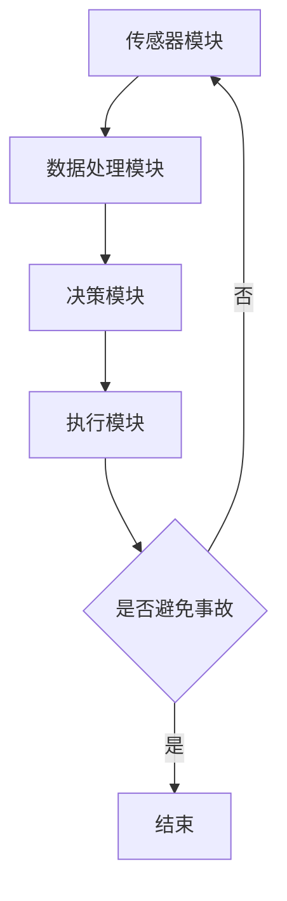

# AI Agent在智能交通事故预防中的实践

> 关键词：AI Agent、智能交通事故预防、机器学习、传感器技术、数据分析

> 摘要：本文围绕AI Agent在智能交通事故预防中的实践展开深入探讨。首先介绍了相关背景，包括研究目的、预期读者、文档结构和术语表等。接着阐述了AI Agent及智能交通事故预防的核心概念与联系，给出了原理和架构的文本示意图及Mermaid流程图。详细讲解了核心算法原理，并用Python代码进行说明，同时给出了数学模型和公式及举例。通过项目实战，展示了代码实际案例并进行详细解释。分析了AI Agent在智能交通事故预防中的实际应用场景，推荐了相关的学习资源、开发工具框架和论文著作。最后总结了未来发展趋势与挑战，提供了常见问题解答和扩展阅读参考资料，旨在为该领域的研究和实践提供全面的技术指导。

## 1. 背景介绍 
### 1.1 目的和范围
随着汽车保有量的持续增长，交通事故已成为全球性的严重问题，给人们的生命财产安全带来了巨大威胁。智能交通事故预防技术旨在通过先进的技术手段，提前识别潜在的危险情况，并采取相应的措施避免事故的发生。AI Agent作为一种能够自主感知环境、做出决策并执行动作的智能实体，为智能交通事故预防提供了新的解决方案。

本文的目的是深入探讨AI Agent在智能交通事故预防中的应用实践，包括核心概念、算法原理、数学模型、项目实战以及实际应用场景等方面。通过详细的介绍和分析，帮助读者全面了解AI Agent在该领域的应用潜力和技术细节。

本文的范围主要涵盖AI Agent在智能交通事故预防中的相关技术和方法，包括传感器技术、机器学习算法、决策模型等。同时，会结合实际项目案例进行详细讲解，以展示这些技术在实际应用中的效果和可行性。

### 1.2 预期读者
本文的预期读者包括以下几类人群：
- **科研人员**：对人工智能、交通安全等领域的研究感兴趣的科研人员，希望通过本文了解AI Agent在智能交通事故预防中的最新研究成果和应用实践。
- **工程师**：从事智能交通系统开发、汽车制造等相关行业的工程师，需要掌握AI Agent技术在实际项目中的应用方法和技巧。
- **学生**：学习计算机科学、自动化、交通工程等专业的学生，希望通过本文拓宽知识面，了解前沿技术在实际应用中的场景和挑战。
- **交通安全从业者**：包括交通管理部门的工作人员、保险公司的理赔人员等，希望通过本文了解如何利用AI Agent技术提高交通安全水平，减少交通事故的发生。

### 1.3 文档结构概述
本文的文档结构如下：
- **核心概念与联系**：介绍AI Agent和智能交通事故预防的核心概念，以及它们之间的联系，并给出原理和架构的文本示意图及Mermaid流程图。
- **核心算法原理 & 具体操作步骤**：详细讲解AI Agent在智能交通事故预防中使用的核心算法原理，并用Python代码进行说明。
- **数学模型和公式 & 详细讲解 & 举例说明**：给出相关的数学模型和公式，并进行详细讲解和举例说明。
- **项目实战：代码实际案例和详细解释说明**：通过实际项目案例，展示AI Agent在智能交通事故预防中的代码实现和详细解释。
- **实际应用场景**：分析AI Agent在智能交通事故预防中的实际应用场景，包括自动驾驶、智能交通管理等。
- **工具和资源推荐**：推荐相关的学习资源、开发工具框架和论文著作，帮助读者进一步深入学习和研究。
- **总结：未来发展趋势与挑战**：总结AI Agent在智能交通事故预防中的未来发展趋势和面临的挑战。
- **附录：常见问题与解答**：提供常见问题的解答，帮助读者解决在学习和实践过程中遇到的问题。
- **扩展阅读 & 参考资料**：列出相关的扩展阅读资料和参考文献，供读者进一步查阅。

### 1.4 术语表
#### 1.4.1 核心术语定义
- **AI Agent**：一种能够自主感知环境、做出决策并执行动作的智能实体，通常由传感器、决策模块和执行器组成。
- **智能交通事故预防**：利用先进的技术手段，提前识别潜在的危险情况，并采取相应的措施避免事故的发生。
- **传感器**：用于感知环境信息的设备，如摄像头、雷达、激光雷达等。
- **机器学习算法**：一种让计算机通过数据学习模式和规律的算法，如神经网络、决策树、支持向量机等。
- **决策模型**：根据传感器获取的环境信息，做出决策的模型，如基于规则的决策模型、基于机器学习的决策模型等。

#### 1.4.2 相关概念解释
- **自动驾驶**：汽车在没有人类驾驶员干预的情况下，自主完成驾驶任务的技术。
- **智能交通管理**：利用信息技术和通信技术，对交通流量进行实时监测和调控，提高交通效率和安全性的管理方式。
- **数据融合**：将多个传感器获取的信息进行整合和处理，以获得更准确、更全面的环境信息的技术。

#### 1.4.3 缩略词列表
- **AI**：Artificial Intelligence，人工智能
- **ML**：Machine Learning，机器学习
- **DNN**：Deep Neural Network，深度神经网络
- **LIDAR**：Light Detection and Ranging，激光雷达
- **GPS**：Global Positioning System，全球定位系统

## 2. 核心概念与联系 
### 核心概念原理
#### AI Agent
AI Agent是一种能够自主感知环境、做出决策并执行动作的智能实体。它的基本原理是通过传感器获取环境信息，然后将这些信息输入到决策模块中进行处理，决策模块根据预设的规则或学习到的模型做出决策，最后将决策结果发送给执行器执行相应的动作。

AI Agent的核心组成部分包括：
- **传感器**：用于感知环境信息，如摄像头可以获取图像信息，雷达可以获取距离和速度信息等。
- **决策模块**：根据传感器获取的环境信息，做出决策。决策模块可以是基于规则的决策模型，也可以是基于机器学习的决策模型。
- **执行器**：根据决策模块的决策结果，执行相应的动作，如控制汽车的加速、减速、转向等。

#### 智能交通事故预防
智能交通事故预防是利用先进的技术手段，提前识别潜在的危险情况，并采取相应的措施避免事故的发生。其核心原理是通过对交通环境的实时监测和分析，预测可能发生的危险情况，并及时发出预警或采取自动控制措施。

智能交通事故预防的关键技术包括：
- **传感器技术**：用于实时监测交通环境信息，如车辆的位置、速度、行驶方向等。
- **数据分析技术**：对传感器获取的大量数据进行分析和处理，挖掘潜在的危险信息。
- **决策技术**：根据数据分析结果，做出决策，如是否发出预警、是否采取自动控制措施等。
- **执行技术**：根据决策结果，执行相应的动作，如自动刹车、自动转向等。

### 架构的文本示意图
以下是AI Agent在智能交通事故预防中的架构文本示意图：

```plaintext
                      +----------------+
                      |    传感器模块    |
                      +----------------+
                             |
                             v
                      +----------------+
                      |    数据处理模块    |
                      +----------------+
                             |
                             v
                      +----------------+
                      |    决策模块      |
                      +----------------+
                             |
                             v
                      +----------------+
                      |    执行模块      |
                      +----------------+
```

### Mermaid流程图


该流程图展示了AI Agent在智能交通事故预防中的工作流程。首先，传感器模块获取环境信息，然后将信息传递给数据处理模块进行处理。处理后的数据被输入到决策模块中，决策模块根据预设的规则或学习到的模型做出决策。决策结果被发送到执行模块，执行模块执行相应的动作。最后，判断是否成功避免事故，如果是，则结束流程；如果否，则继续循环。

## 3. 核心算法原理 & 具体操作步骤 
### 核心算法原理
在智能交通事故预防中，常用的核心算法包括机器学习算法和基于规则的算法。下面以基于深度学习的目标检测算法为例，详细介绍其原理。

#### 深度学习目标检测算法
深度学习目标检测算法是一种基于卷积神经网络（CNN）的算法，它可以自动识别图像或视频中的目标物体，并给出目标物体的位置和类别信息。常见的深度学习目标检测算法有Faster R-CNN、YOLO（You Only Look Once）等。

以YOLO算法为例，其基本原理是将输入的图像划分为多个网格，每个网格负责预测一定范围内的目标物体。对于每个网格，模型会预测多个边界框（bounding box）以及每个边界框内目标物体的类别和置信度。最后，通过非极大值抑制（Non-Maximum Suppression，NMS）算法去除重叠的边界框，得到最终的检测结果。

### 具体操作步骤
#### 数据准备
- 收集包含目标物体的图像或视频数据，并进行标注。标注信息包括目标物体的位置（边界框）和类别。
- 将数据集划分为训练集、验证集和测试集，一般比例为7:2:1。

#### 模型训练
- 选择合适的深度学习目标检测模型，如YOLOv5。
- 使用训练集对模型进行训练，调整模型的参数，使模型能够准确地识别目标物体。
- 在训练过程中，使用验证集对模型进行评估，防止模型过拟合。

#### 模型评估
- 使用测试集对训练好的模型进行评估，计算模型的准确率、召回率、F1值等指标。
- 根据评估结果，对模型进行调整和优化。

#### 模型部署
- 将训练好的模型部署到实际应用中，如安装在汽车上的摄像头系统。
- 在实际应用中，实时获取图像或视频数据，输入到模型中进行目标检测。
- 根据检测结果，做出相应的决策，如发出预警或采取自动控制措施。

### Python源代码详细阐述
以下是使用YOLOv5进行目标检测的Python代码示例：

```python
import torch

# 加载预训练的YOLOv5模型
model = torch.hub.load('ultralytics/yolov5', 'yolov5s', pretrained=True)

# 读取图像
img = 'path/to/your/image.jpg'

# 进行目标检测
results = model(img)

# 显示检测结果
results.show()

# 保存检测结果
results.save()

# 获取检测结果的信息
detections = results.pandas().xyxy[0]
print(detections)
```

代码解释：
1. **加载预训练的YOLOv5模型**：使用`torch.hub.load`函数从GitHub上加载预训练的YOLOv5模型。
2. **读取图像**：指定要进行目标检测的图像路径。
3. **进行目标检测**：将图像输入到模型中进行目标检测，得到检测结果。
4. **显示检测结果**：使用`results.show()`函数显示检测结果。
5. **保存检测结果**：使用`results.save()`函数保存检测结果。
6. **获取检测结果的信息**：使用`results.pandas().xyxy[0]`函数获取检测结果的信息，包括目标物体的位置、类别和置信度。

## 4. 数学模型和公式 & 详细讲解 & 举例说明 
### 数学模型和公式
#### 边界框回归
在目标检测中，边界框回归是一种用于预测目标物体位置的方法。假设我们有一个真实的边界框 $B^g = (x^g, y^g, w^g, h^g)$，其中 $(x^g, y^g)$ 是边界框的中心点坐标，$w^g$ 和 $h^g$ 分别是边界框的宽度和高度。同时，我们有一个预测的边界框 $B^p = (x^p, y^p, w^p, h^p)$。

边界框回归的目标是学习一组偏移量 $(t_x, t_y, t_w, t_h)$，使得预测的边界框能够尽可能地接近真实的边界框。偏移量的计算公式如下：

$$
t_x = \frac{x^g - x^a}{w^a} \\
t_y = \frac{y^g - y^a}{h^a} \\
t_w = \log(\frac{w^g}{w^a}) \\
t_h = \log(\frac{h^g}{h^a})
$$

其中，$(x^a, y^a, w^a, h^a)$ 是锚框（anchor box）的坐标和尺寸。

#### 损失函数
在目标检测中，常用的损失函数包括分类损失和回归损失。以YOLO算法为例，其损失函数可以表示为：

$$
L = \lambda_{coord} \sum_{i=0}^{S^2} \sum_{j=0}^{B} \mathbb{1}_{ij}^{obj} \left[ (x_i - \hat{x}_i)^2 + (y_i - \hat{y}_i)^2 \right] \\
+ \lambda_{coord} \sum_{i=0}^{S^2} \sum_{j=0}^{B} \mathbb{1}_{ij}^{obj} \left[ (\sqrt{w_i} - \sqrt{\hat{w}_i})^2 + (\sqrt{h_i} - \sqrt{\hat{h}_i})^2 \right] \\
+ \sum_{i=0}^{S^2} \sum_{j=0}^{B} \mathbb{1}_{ij}^{obj} (C_i - \hat{C}_i)^2 \\
+ \lambda_{noobj} \sum_{i=0}^{S^2} \sum_{j=0}^{B} \mathbb{1}_{ij}^{noobj} (C_i - \hat{C}_i)^2 \\
+ \sum_{i=0}^{S^2} \mathbb{1}_{i}^{obj} \sum_{c \in classes} (p_i(c) - \hat{p}_i(c))^2
$$

其中，$S$ 是网格的数量，$B$ 是每个网格预测的边界框数量，$\mathbb{1}_{ij}^{obj}$ 表示第 $i$ 个网格的第 $j$ 个边界框是否负责检测目标物体，$\mathbb{1}_{ij}^{noobj}$ 表示第 $i$ 个网格的第 $j$ 个边界框是否不负责检测目标物体，$\mathbb{1}_{i}^{obj}$ 表示第 $i$ 个网格是否包含目标物体，$(x_i, y_i, w_i, h_i)$ 是真实的边界框坐标和尺寸，$(\hat{x}_i, \hat{y}_i, \hat{w}_i, \hat{h}_i)$ 是预测的边界框坐标和尺寸，$C_i$ 是真实的置信度，$\hat{C}_i$ 是预测的置信度，$p_i(c)$ 是真实的类别概率，$\hat{p}_i(c)$ 是预测的类别概率，$\lambda_{coord}$ 和 $\lambda_{noobj}$ 是权重系数。

### 详细讲解
#### 边界框回归
边界框回归的核心思想是通过学习偏移量，将锚框调整为更接近真实边界框的位置。偏移量的计算是基于锚框和真实边界框的相对位置和尺寸关系。通过最小化预测的偏移量和真实偏移量之间的误差，可以使预测的边界框逐渐接近真实的边界框。

#### 损失函数
损失函数的作用是衡量模型预测结果和真实标签之间的差异。在YOLO算法中，损失函数由四个部分组成：
- **坐标损失**：用于衡量预测的边界框坐标和真实边界框坐标之间的误差。
- **尺寸损失**：用于衡量预测的边界框尺寸和真实边界框尺寸之间的误差。
- **置信度损失**：用于衡量预测的置信度和真实置信度之间的误差，分为负责检测目标物体的边界框和不负责检测目标物体的边界框。
- **分类损失**：用于衡量预测的类别概率和真实类别概率之间的误差。

通过最小化损失函数，可以使模型的预测结果更加准确。

### 举例说明
假设我们有一个锚框 $A = (100, 100, 200, 200)$，真实的边界框 $B^g = (120, 120, 220, 220)$。则偏移量的计算如下：

$$
t_x = \frac{120 - 100}{200} = 0.1 \\
t_y = \frac{120 - 100}{200} = 0.1 \\
t_w = \log(\frac{220}{200}) \approx 0.095 \\
t_h = \log(\frac{220}{200}) \approx 0.095
$$

假设在某个网格中，有一个边界框负责检测目标物体，真实的边界框坐标为 $(x, y, w, h) = (120, 120, 220, 220)$，预测的边界框坐标为 $(\hat{x}, \hat{y}, \hat{w}, \hat{h}) = (115, 115, 210, 210)$，真实的置信度为 $C = 0.9$，预测的置信度为 $\hat{C} = 0.8$，真实的类别概率为 $p(c) = [0, 1, 0]$，预测的类别概率为 $\hat{p}(c) = [0.1, 0.8, 0.1]$。则坐标损失、尺寸损失、置信度损失和分类损失的计算如下：

$$
L_{coord} = (120 - 115)^2 + (120 - 115)^2 = 50 \\
L_{size} = (\sqrt{220} - \sqrt{210})^2 + (\sqrt{220} - \sqrt{210})^2 \approx 0.95 \\
L_{conf} = (0.9 - 0.8)^2 = 0.01 \\
L_{class} = (0 - 0.1)^2 + (1 - 0.8)^2 + (0 - 0.1)^2 = 0.06
$$

假设 $\lambda_{coord} = 5$，$\lambda_{noobj} = 0.5$，则该边界框的总损失为：

$$
L = 5 \times 50 + 5 \times 0.95 + 0.01 + 0.06 = 254.82
$$

## 5. 项目实战：代码实际案例和详细解释说明 
### 5.1  开发环境搭建
#### 安装Python
首先，需要安装Python环境。建议使用Python 3.7及以上版本。可以从Python官方网站（https://www.python.org/downloads/）下载并安装Python。

#### 安装依赖库
安装项目所需的依赖库，包括`torch`、`torchvision`、`opencv-python`等。可以使用以下命令进行安装：

```sh
pip install torch torchvision opencv-python
```

#### 克隆YOLOv5仓库
从GitHub上克隆YOLOv5仓库：

```sh
git clone https://github.com/ultralytics/yolov5.git
cd yolov5
```

### 5.2  源代码详细实现和代码解读
以下是一个使用YOLOv5进行实时目标检测的Python代码示例：

```python
import cv2
import torch

# 加载预训练的YOLOv5模型
model = torch.hub.load('ultralytics/yolov5', 'yolov5s', pretrained=True)

# 打开摄像头
cap = cv2.VideoCapture(0)

while True:
    # 读取摄像头帧
    ret, frame = cap.read()
    
    if not ret:
        break
    
    # 进行目标检测
    results = model(frame)
    
    # 获取检测结果的图像
    detected_frame = results.render()[0]
    
    # 显示检测结果
    cv2.imshow('YOLOv5 Real-time Detection', detected_frame)
    
    # 按 'q' 键退出循环
    if cv2.waitKey(1) & 0xFF == ord('q'):
        break

# 释放摄像头并关闭窗口
cap.release()
cv2.destroyAllWindows()
```

代码解读：
1. **加载预训练的YOLOv5模型**：使用`torch.hub.load`函数从GitHub上加载预训练的YOLOv5模型。
2. **打开摄像头**：使用`cv2.VideoCapture(0)`打开默认的摄像头。
3. **循环读取摄像头帧**：使用`cap.read()`函数读取摄像头的每一帧。
4. **进行目标检测**：将读取的帧输入到模型中进行目标检测，得到检测结果。
5. **获取检测结果的图像**：使用`results.render()[0]`函数获取检测结果的图像。
6. **显示检测结果**：使用`cv2.imshow`函数显示检测结果的图像。
7. **退出循环**：按 'q' 键退出循环。
8. **释放摄像头并关闭窗口**：使用`cap.release()`函数释放摄像头，使用`cv2.destroyAllWindows()`函数关闭所有窗口。

### 5.3  代码解读与分析
#### 优点
- **简单易用**：使用YOLOv5预训练模型，无需自己训练模型，降低了开发难度。
- **实时性好**：可以实时处理摄像头的视频流，实现实时目标检测。
- **准确性高**：YOLOv5模型在目标检测任务上具有较高的准确性。

#### 缺点
- **计算资源要求高**：YOLOv5模型是一个深度学习模型，需要较高的计算资源才能运行。
- **对光照和遮挡敏感**：在光照条件不好或目标物体被遮挡的情况下，检测效果可能会受到影响。

#### 改进建议
- **优化模型**：可以根据具体的应用场景，对YOLOv5模型进行微调，提高检测准确性。
- **多传感器融合**：结合其他传感器，如雷达、激光雷达等，提高对目标物体的感知能力。
- **实时性能优化**：使用GPU加速或优化算法，提高模型的实时处理能力。

## 6. 实际应用场景 
### 自动驾驶
在自动驾驶领域，AI Agent可以通过传感器实时感知周围的交通环境，如车辆、行人、障碍物等。利用机器学习算法对感知到的信息进行分析和处理，预测潜在的危险情况，并做出相应的决策，如自动刹车、自动转向等，从而避免交通事故的发生。

例如，当AI Agent检测到前方车辆突然刹车时，它可以迅速做出反应，自动降低车速，保持安全距离，避免追尾事故的发生。

### 智能交通管理
AI Agent可以应用于智能交通管理系统中，通过安装在道路上的传感器，实时监测交通流量、车辆速度、道路状况等信息。根据这些信息，AI Agent可以做出决策，如调整交通信号灯的时长、发布交通拥堵预警等，以提高交通效率和安全性。

例如，当AI Agent检测到某条道路的交通流量过大时，它可以自动调整该道路上的交通信号灯时长，增加绿灯时间，减少红灯时间，以缓解交通拥堵。

### 驾驶员辅助系统
AI Agent可以作为驾驶员辅助系统的一部分，为驾驶员提供实时的危险预警和建议。例如，当AI Agent检测到车辆即将偏离车道时，它可以发出警报，提醒驾驶员及时纠正方向；当检测到前方有障碍物时，它可以提示驾驶员减速或避让。

### 保险理赔
在保险理赔领域，AI Agent可以通过分析事故现场的图像、视频等数据，快速准确地评估事故损失和责任。例如，利用目标检测算法识别事故车辆的受损部位和程度，利用图像识别技术判断事故发生的原因，从而提高理赔效率和准确性。

## 7. 工具和资源推荐
### 7.1 学习资源推荐
#### 7.1.1 书籍推荐
- 《深度学习》（Deep Learning）：由Ian Goodfellow、Yoshua Bengio和Aaron Courville所著，是深度学习领域的经典教材，涵盖了深度学习的基本原理、算法和应用。
- 《Python机器学习》（Python Machine Learning）：由Sebastian Raschka所著，介绍了Python在机器学习中的应用，包括数据预处理、模型选择、评估和优化等内容。
- 《计算机视觉：算法与应用》（Computer Vision: Algorithms and Applications）：由Richard Szeliski所著，是计算机视觉领域的经典教材，涵盖了计算机视觉的基本原理、算法和应用。

#### 7.1.2 在线课程
- Coursera上的“深度学习专项课程”（Deep Learning Specialization）：由Andrew Ng教授授课，包括神经网络和深度学习、改善深层神经网络、结构化机器学习项目、卷积神经网络和序列模型等课程。
- edX上的“人工智能基础”（Introduction to Artificial Intelligence）：由麻省理工学院（MIT）的Patrick H. Winston教授授课，介绍了人工智能的基本概念、算法和应用。
- Udemy上的“计算机视觉大师课程”（Computer Vision Masterclass）：介绍了计算机视觉的基本原理、算法和应用，包括目标检测、图像分割、人脸识别等内容。

#### 7.1.3 技术博客和网站
- Medium：一个技术博客平台，上面有很多关于人工智能、机器学习、计算机视觉等领域的优秀文章。
- Towards Data Science：一个专注于数据科学和机器学习的技术博客，上面有很多实用的教程和案例。
- arXiv：一个预印本数据库，上面有很多关于人工智能、机器学习、计算机视觉等领域的最新研究成果。

### 7.2 开发工具框架推荐
#### 7.2.1 IDE和编辑器
- PyCharm：一款专门为Python开发设计的集成开发环境（IDE），具有代码编辑、调试、代码分析等功能。
- Jupyter Notebook：一个交互式的开发环境，适合进行数据探索、模型训练和可视化等工作。
- Visual Studio Code：一款轻量级的代码编辑器，支持多种编程语言，具有丰富的插件生态系统。

#### 7.2.2 调试和性能分析工具
- PyTorch Profiler：PyTorch提供的性能分析工具，可以帮助用户分析模型的性能瓶颈。
- TensorBoard：TensorFlow提供的可视化工具，可以帮助用户可视化模型的训练过程和性能指标。
- cProfile：Python标准库中的性能分析工具，可以帮助用户分析Python代码的性能瓶颈。

#### 7.2.3 相关框架和库
- PyTorch：一个开源的深度学习框架，具有动态计算图、易于使用等特点，广泛应用于计算机视觉、自然语言处理等领域。
- TensorFlow：一个开源的深度学习框架，具有强大的分布式训练能力和丰富的工具库，广泛应用于工业界和学术界。
- OpenCV：一个开源的计算机视觉库，提供了丰富的图像处理和计算机视觉算法，如目标检测、图像分割、特征提取等。

### 7.3 相关论文著作推荐
#### 7.3.1 经典论文
- “You Only Look Once: Unified, Real-Time Object Detection”：YOLO算法的原始论文，提出了一种实时目标检测算法。
- “Faster R-CNN: Towards Real-Time Object Detection with Region Proposal Networks”：Faster R-CNN算法的原始论文，提出了一种基于区域建议网络的目标检测算法。
- “Deep Residual Learning for Image Recognition”：ResNet算法的原始论文，提出了一种深度残差网络，解决了深度神经网络训练过程中的梯度消失问题。

#### 7.3.2 最新研究成果
- 关注顶级学术会议，如CVPR（Computer Vision and Pattern Recognition）、ICCV（International Conference on Computer Vision）、NeurIPS（Neural Information Processing Systems）等，上面有很多关于人工智能、机器学习、计算机视觉等领域的最新研究成果。
- 关注知名学术期刊，如Journal of Artificial Intelligence Research（JAIR）、Artificial Intelligence、IEEE Transactions on Pattern Analysis and Machine Intelligence（TPAMI）等，上面有很多高质量的研究论文。

#### 7.3.3 应用案例分析
- 可以参考一些知名公司的技术博客，如Google AI Blog、Facebook AI Research、Microsoft Research等，上面有很多关于人工智能、机器学习、计算机视觉等领域的应用案例分析。
- 可以参考一些开源项目的文档和代码，如YOLOv5、Detectron2等，上面有很多关于目标检测、图像分割等任务的实现和应用案例。

## 8. 总结：未来发展趋势与挑战
### 未来发展趋势
#### 多传感器融合
未来，AI Agent在智能交通事故预防中将越来越多地采用多传感器融合技术。通过将摄像头、雷达、激光雷达等多种传感器的数据进行融合，可以获得更准确、更全面的环境信息，从而提高危险预测的准确性和可靠性。

#### 强化学习应用
强化学习作为一种能够让智能体通过与环境交互学习最优策略的算法，将在智能交通事故预防中得到更广泛的应用。通过强化学习，AI Agent可以不断优化自己的决策策略，以应对复杂多变的交通环境。

#### 边缘计算与云计算结合
边缘计算可以在本地设备上进行数据处理和决策，减少数据传输延迟，提高系统的实时性。云计算则可以提供强大的计算资源和存储能力，用于模型训练和数据分析。未来，AI Agent将结合边缘计算和云计算的优势，实现更高效的智能交通事故预防。

#### 车路协同
车路协同是指车辆与道路基础设施之间的信息交互和协同工作。未来，AI Agent将在车路协同系统中发挥重要作用，通过与道路上的传感器、交通信号灯等设备进行通信，实现更高效的交通管理和事故预防。

### 挑战
#### 数据安全与隐私
AI Agent在智能交通事故预防中需要收集和处理大量的交通数据，包括车辆位置、速度、行驶轨迹等信息。这些数据涉及到用户的隐私和安全问题，如何保护这些数据的安全和隐私是一个重要的挑战。

#### 算法可靠性与鲁棒性
在复杂多变的交通环境中，AI Agent的算法需要具有较高的可靠性和鲁棒性。例如，在恶劣的天气条件下（如暴雨、大雾等），传感器的性能可能会受到影响，算法需要能够适应这些情况，保证危险预测的准确性。

#### 法律与伦理问题
随着AI Agent在智能交通事故预防中的应用越来越广泛，涉及到的法律和伦理问题也越来越多。例如，当AI Agent做出的决策导致交通事故时，责任应该如何划分？如何确保AI Agent的决策符合道德和伦理标准？这些问题需要得到进一步的研究和解决。

#### 技术标准与规范
目前，智能交通事故预防领域还缺乏统一的技术标准和规范。不同的企业和研究机构采用的技术和方法可能存在差异，这给系统的集成和互操作性带来了困难。因此，需要制定统一的技术标准和规范，促进智能交通事故预防技术的发展和应用。

## 9. 附录：常见问题与解答
### 问题1：AI Agent在智能交通事故预防中的准确性如何保证？
答：可以通过以下方法保证AI Agent在智能交通事故预防中的准确性：
- **多传感器融合**：使用多种传感器（如摄像头、雷达、激光雷达等）获取环境信息，并进行数据融合，以获得更准确、更全面的信息。
- **模型训练和优化**：使用大量的标注数据对模型进行训练，并不断优化模型的参数，以提高模型的准确性。
- **实时监测和调整**：在实际应用中，实时监测AI Agent的决策结果，并根据实际情况进行调整和优化。

### 问题2：AI Agent在恶劣天气条件下的性能如何？
答：在恶劣天气条件下（如暴雨、大雾等），传感器的性能可能会受到影响，从而影响AI Agent的性能。为了提高AI Agent在恶劣天气条件下的性能，可以采取以下措施：
- **使用抗干扰能力强的传感器**：选择具有抗干扰能力强的传感器，如毫米波雷达，它在恶劣天气条件下的性能相对稳定。
- **多传感器融合**：结合多种传感器的数据，以弥补单一传感器在恶劣天气条件下的不足。
- **模型优化**：对模型进行优化，使其能够适应恶劣天气条件下的环境变化。

### 问题3：AI Agent在智能交通事故预防中的决策过程是怎样的？
答：AI Agent在智能交通事故预防中的决策过程一般包括以下几个步骤：
- **环境感知**：通过传感器获取周围的交通环境信息，如车辆的位置、速度、行驶方向等。
- **数据处理**：对传感器获取的信息进行处理和分析，提取有用的特征。
- **危险预测**：根据处理后的数据，使用机器学习算法或基于规则的方法预测潜在的危险情况。
- **决策制定**：根据危险预测的结果，结合预设的规则或学习到的模型，做出决策，如是否发出预警、是否采取自动控制措施等。
- **动作执行**：将决策结果发送给执行器，执行相应的动作，如自动刹车、自动转向等。

### 问题4：AI Agent在智能交通事故预防中的应用是否会导致驾驶员的技能退化？
答：AI Agent在智能交通事故预防中的应用可以提供辅助和支持，但不会完全替代驾驶员的作用。在正常情况下，驾驶员仍然需要保持对车辆的控制和注意力。同时，AI Agent的应用可以帮助驾驶员更好地应对复杂的交通情况，提高驾驶的安全性。因此，合理使用AI Agent不会导致驾驶员的技能退化，反而可以提高驾驶员的驾驶能力和安全性。

## 10. 扩展阅读 & 参考资料
### 扩展阅读
- 《人工智能：现代方法》（Artificial Intelligence: A Modern Approach）：由Stuart Russell和Peter Norvig所著，是人工智能领域的经典教材，涵盖了人工智能的基本概念、算法和应用。
- 《机器人学导论》（Introduction to Robotics: Mechanics and Control）：由John J. Craig所著，介绍了机器人学的基本原理、运动学、动力学和控制等内容。
- 《智能交通系统》（Intelligent Transportation Systems）：由Hani S. Mahmassani所著，介绍了智能交通系统的基本概念、技术和应用。

### 参考资料
- YOLOv5官方文档：https://github.com/ultralytics/yolov5/wiki
- PyTorch官方文档：https://pytorch.org/docs/stable/index.html
- OpenCV官方文档：https://docs.opencv.org/4.x/

作者：AI天才研究院/AI Genius Institute & 禅与计算机程序设计艺术 /Zen And The Art of Computer Programming