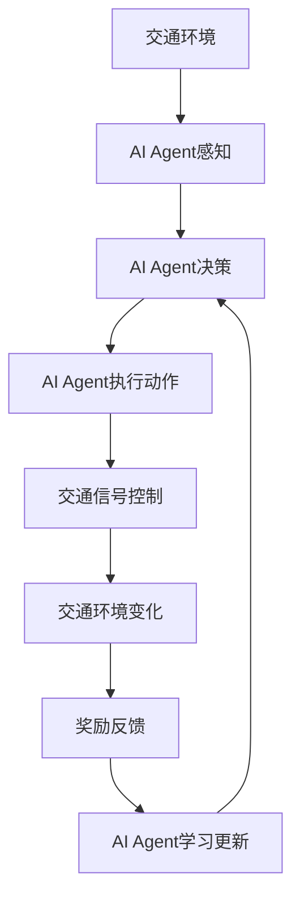

# AI Agent在智能交通信号优化中的实践

> 关键词：AI Agent、智能交通信号优化、强化学习、交通流模型、实时控制

> 摘要：本文深入探讨了AI Agent在智能交通信号优化中的实践应用。首先介绍了相关背景知识，包括目的范围、预期读者等内容。接着阐述了核心概念及联系，详细讲解了核心算法原理与具体操作步骤，并给出了数学模型和公式。通过项目实战展示了代码实现和详细解释，分析了实际应用场景。同时推荐了学习资源、开发工具框架以及相关论文著作。最后总结了未来发展趋势与挑战，还设置了常见问题解答和扩展阅读参考资料，旨在为智能交通信号优化领域的研究者和开发者提供全面的技术指导。

## 1. 背景介绍 
### 1.1 目的和范围
随着城市化进程的加速，交通拥堵问题日益严重，给人们的生活和经济发展带来了诸多负面影响。智能交通信号优化作为缓解交通拥堵的重要手段，具有巨大的应用价值。本文章的目的在于深入探讨AI Agent在智能交通信号优化中的应用，详细阐述相关技术原理、算法实现和实际应用案例。范围涵盖了从基础概念的介绍到具体项目实战的整个流程，包括核心算法原理、数学模型、代码实现以及实际应用场景等方面。

### 1.2 预期读者
本文预期读者包括智能交通领域的研究者、交通信号控制系统的开发者、对人工智能在交通领域应用感兴趣的技术人员以及相关专业的学生。通过阅读本文，读者可以系统地了解AI Agent在智能交通信号优化中的应用原理和实践方法，为其研究和开发工作提供有益的参考。

### 1.3 文档结构概述
本文共分为十个部分。第一部分为背景介绍，包括目的和范围、预期读者、文档结构概述和术语表；第二部分阐述核心概念与联系，给出核心概念原理和架构的文本示意图以及Mermaid流程图；第三部分详细讲解核心算法原理和具体操作步骤，并使用Python源代码进行阐述；第四部分介绍数学模型和公式，并进行详细讲解和举例说明；第五部分通过项目实战展示代码实际案例和详细解释说明；第六部分分析实际应用场景；第七部分推荐相关的工具和资源，包括学习资源、开发工具框架和相关论文著作；第八部分总结未来发展趋势与挑战；第九部分为附录，提供常见问题与解答；第十部分给出扩展阅读和参考资料。

### 1.4 术语表
#### 1.4.1 核心术语定义
- **AI Agent（人工智能代理）**：能够感知环境、做出决策并执行动作的智能实体，在智能交通信号优化中，它可以根据交通流信息调整交通信号的控制策略。
- **智能交通信号优化**：利用先进的技术手段，如人工智能、传感器技术等，对交通信号进行实时调整和优化，以提高交通效率、减少拥堵。
- **交通流模型**：描述交通流特性和规律的数学模型，用于模拟和预测交通流量、速度等参数。
- **强化学习**：一种机器学习方法，通过智能体与环境进行交互，根据环境反馈的奖励信号来学习最优的行为策略。

#### 1.4.2 相关概念解释
- **交通信号控制策略**：决定交通信号灯的相位顺序、时长等参数的规则和方法，常见的有定时控制、感应控制和自适应控制等。
- **实时控制**：根据当前实时的交通状况，及时调整交通信号的控制参数，以适应交通流的变化。
- **状态空间**：在强化学习中，状态空间是指智能体能够感知到的所有可能状态的集合，在智能交通信号优化中，状态空间可以包括交通流量、车辆排队长度等信息。
- **动作空间**：智能体可以采取的所有可能动作的集合，在交通信号控制中，动作空间可以是不同的信号灯相位组合和时长设置。

#### 1.4.3 缩略词列表
- **RL（Reinforcement Learning）**：强化学习
- **Q - learning**：一种基于值函数的强化学习算法
- **DQN（Deep Q - Network）**：深度Q网络，结合了深度学习和Q - learning的算法

## 2. 核心概念与联系 
### 核心概念原理
在智能交通信号优化中，AI Agent扮演着关键角色。其核心原理是基于强化学习的思想，AI Agent通过感知交通环境的状态，如各车道的交通流量、车辆排队长度等，然后根据一定的策略选择合适的动作，即调整交通信号灯的相位和时长。环境会根据AI Agent的动作给出相应的奖励信号，奖励信号反映了该动作对交通状况的改善程度，例如减少了车辆的平均等待时间、提高了道路的通行能力等。AI Agent根据奖励信号不断调整自己的策略，以学习到最优的交通信号控制策略。

### 架构的文本示意图
```plaintext
+---------------------+
|     交通环境       |
| (交通流量、排队长度等)|
+---------------------+
          |
          v
+---------------------+
|     AI Agent        |
| (感知、决策、执行)   |
+---------------------+
          |
          v
+---------------------+
|    交通信号控制     |
| (相位、时长调整)    |
+---------------------+
          |
          v
+---------------------+
|     奖励反馈        |
| (改善交通状况程度)  |
+---------------------+
          |
          v
+---------------------+
|   AI Agent学习更新  |
| (调整策略)          |
+---------------------+
```

### Mermaid流程图


## 3. 核心算法原理 & 具体操作步骤 
### 核心算法原理 - 强化学习（以Q - learning为例）
Q - learning是一种无模型的强化学习算法，其核心思想是学习一个Q值函数 $Q(s, a)$，表示在状态 $s$ 下采取动作 $a$ 的预期累计奖励。Q值函数的更新公式为：

$$Q(s_t, a_t) \leftarrow Q(s_t, a_t) + \alpha [r_{t+1} + \gamma \max_{a} Q(s_{t+1}, a) - Q(s_t, a_t)]$$

其中：
- $s_t$ 是当前状态
- $a_t$ 是当前采取的动作
- $r_{t+1}$ 是执行动作 $a_t$ 后获得的即时奖励
- $s_{t+1}$ 是执行动作 $a_t$ 后转移到的下一个状态
- $\alpha$ 是学习率，控制每次更新的步长
- $\gamma$ 是折扣因子，用于权衡即时奖励和未来奖励的重要性

### 具体操作步骤
1. **初始化**：初始化Q值表 $Q(s, a)$，将所有的 $Q(s, a)$ 值设为0。设置学习率 $\alpha$、折扣因子 $\gamma$ 和探索率 $\epsilon$。
2. **环境交互**：
    - 观察当前状态 $s_t$。
    - 根据 $\epsilon$-贪心策略选择动作 $a_t$：以概率 $\epsilon$ 随机选择一个动作，以概率 $1 - \epsilon$ 选择使 $Q(s_t, a)$ 最大的动作。
    - 执行动作 $a_t$，得到即时奖励 $r_{t+1}$ 和下一个状态 $s_{t+1}$。
3. **Q值更新**：根据Q值更新公式更新 $Q(s_t, a_t)$。
4. **状态转移**：将 $s_{t+1}$ 作为新的当前状态，重复步骤2和3，直到达到终止条件。

### Python源代码实现
```python
import numpy as np

# 定义状态空间和动作空间的大小
num_states = 10
num_actions = 4

# 初始化Q值表
Q = np.zeros((num_states, num_actions))

# 设置参数
alpha = 0.1  # 学习率
gamma = 0.9  # 折扣因子
epsilon = 0.1  # 探索率
num_episodes = 1000

# 模拟环境交互
for episode in range(num_episodes):
    # 初始化状态
    state = np.random.randint(0, num_states)
    done = False
    
    while not done:
        # 根据epsilon - 贪心策略选择动作
        if np.random.uniform(0, 1) < epsilon:
            action = np.random.randint(0, num_actions)
        else:
            action = np.argmax(Q[state, :])
        
        # 模拟执行动作，得到奖励和下一个状态
        next_state = np.random.randint(0, num_states)
        reward = np.random.randint(0, 10)
        
        # 更新Q值
        Q[state, action] = Q[state, action] + alpha * (reward + gamma * np.max(Q[next_state, :]) - Q[state, action])
        
        # 状态转移
        state = next_state
        
        # 模拟终止条件
        if np.random.uniform(0, 1) < 0.1:
            done = True

print("最终的Q值表：")
print(Q)
```

## 4. 数学模型和公式 & 详细讲解 & 举例说明 
### 交通流模型
常见的交通流模型有宏观模型和微观模型。宏观模型以交通流的宏观参数，如交通流量 $q$、交通密度 $k$ 和平均速度 $v$ 为研究对象，其中最经典的是Lighthill - Whitham - Richards（LWR）模型，其基本方程为：

$$\frac{\partial k}{\partial t} + \frac{\partial q}{\partial x} = 0$$

其中 $t$ 是时间，$x$ 是空间位置。该方程描述了交通密度随时间和空间的变化关系，其本质是交通流的守恒定律，即单位时间内流入和流出某一区域的车辆数之差等于该区域内车辆数的变化率。

微观模型则以单个车辆的行为为研究对象，如跟驰模型和元胞自动机模型。以跟驰模型为例，经典的Gazis - Herman - Rothery（GHR）模型描述了后车的加速度 $a_n(t)$ 与前后车的速度差 $\Delta v_n(t)$ 和间距 $s_n(t)$ 之间的关系：

$$a_n(t) = \lambda \frac{[\Delta v_n(t)]^m}{[s_n(t)]^l}$$

其中 $\lambda$、$m$ 和 $l$ 是模型参数。

### 奖励函数
在智能交通信号优化中，奖励函数的设计至关重要，它直接影响AI Agent学习到的策略。常见的奖励函数可以基于车辆的平均等待时间、排队长度等指标。例如，设 $T_{avg}$ 为车辆的平均等待时间，$L_{queue}$ 为车辆的平均排队长度，则奖励函数可以设计为：

$$r = - \omega_1 T_{avg} - \omega_2 L_{queue}$$

其中 $\omega_1$ 和 $\omega_2$ 是权重系数，用于权衡平均等待时间和排队长度的重要性。

### 举例说明
假设一个简单的十字路口，有四个方向的车道，每个车道的交通流量可以用一个离散的值表示，状态空间为四个车道的交通流量组合，动作空间为不同的信号灯相位组合。我们使用上述的Q - learning算法进行交通信号优化。

设初始状态 $s_0$ 为 $(5, 3, 2, 4)$，表示四个车道的交通流量分别为5、3、2和4。根据 $\epsilon$-贪心策略选择动作 $a_0$，执行动作后得到即时奖励 $r_1 = - 2$，下一个状态 $s_1 = (4, 3, 3, 3)$。假设当前的Q值 $Q(s_0, a_0) = 0$，学习率 $\alpha = 0.1$，折扣因子 $\gamma = 0.9$，则更新后的Q值为：

$$Q(s_0, a_0) = 0 + 0.1\times[- 2 + 0.9\times\max_{a} Q(s_1, a) - 0]$$

假设 $\max_{a} Q(s_1, a) = 1$，则更新后的 $Q(s_0, a_0) = 0 + 0.1\times(- 2 + 0.9\times1 - 0)= - 0.11$

## 5. 项目实战：代码实际案例和详细解释说明 
### 5.1  开发环境搭建
- **操作系统**：推荐使用Linux系统，如Ubuntu 18.04及以上版本，因为Linux系统在开发和部署方面具有良好的稳定性和兼容性。
- **Python环境**：安装Python 3.7及以上版本，可以使用Anaconda来管理Python环境。安装命令如下：
```bash
wget https://repo.anaconda.com/archive/Anaconda3-2021.11-Linux-x86_64.sh
bash Anaconda3-2021.11-Linux-x86_64.sh
```
- **依赖库安装**：安装必要的Python库，如NumPy、Pandas、TensorFlow等。使用以下命令进行安装：
```bash
pip install numpy pandas tensorflow
```

### 5.2  源代码详细实现和代码解读
```python
import numpy as np
import tensorflow as tf
from collections import deque

# 定义交通环境类
class TrafficEnvironment:
    def __init__(self):
        # 初始化状态空间和动作空间的大小
        self.num_states = 4  # 假设四个车道的交通流量作为状态
        self.num_actions = 4  # 假设四种信号灯相位组合作为动作
        self.reset()
    
    def reset(self):
        # 重置环境，返回初始状态
        self.state = np.random.randint(0, 10, self.num_states)
        return self.state
    
    def step(self, action):
        # 执行动作，返回下一个状态、奖励和是否终止的标志
        next_state = np.random.randint(0, 10, self.num_states)
        # 简单的奖励函数设计，根据状态变化计算奖励
        reward = - np.sum(np.abs(next_state - self.state))
        done = False
        self.state = next_state
        return next_state, reward, done

# 定义DQN代理类
class DQNAgent:
    def __init__(self, state_size, action_size):
        self.state_size = state_size
        self.action_size = action_size
        self.memory = deque(maxlen=2000)
        self.gamma = 0.95  # 折扣因子
        self.epsilon = 1.0  # 探索率
        self.epsilon_min = 0.01
        self.epsilon_decay = 0.995
        self.learning_rate = 0.001
        self.model = self._build_model()
    
    def _build_model(self):
        # 构建神经网络模型
        model = tf.keras.Sequential([
            tf.keras.layers.Dense(24, input_dim=self.state_size, activation='relu'),
            tf.keras.layers.Dense(24, activation='relu'),
            tf.keras.layers.Dense(self.action_size, activation='linear')
        ])
        model.compile(loss='mse', optimizer=tf.keras.optimizers.Adam(lr=self.learning_rate))
        return model
    
    def remember(self, state, action, reward, next_state, done):
        # 将经验存储到记忆库中
        self.memory.append((state, action, reward, next_state, done))
    
    def act(self, state):
        # 根据epsilon - 贪心策略选择动作
        if np.random.rand() <= self.epsilon:
            return np.random.choice(self.action_size)
        act_values = self.model.predict(state)
        return np.argmax(act_values[0])
    
    def replay(self, batch_size):
        # 从记忆库中随机采样一批经验进行训练
        minibatch = np.random.choice(len(self.memory), batch_size, replace=False)
        for state, action, reward, next_state, done in [self.memory[i] for i in minibatch]:
            target = reward
            if not done:
                target = (reward + self.gamma * np.amax(self.model.predict(next_state)[0]))
            target_f = self.model.predict(state)
            target_f[0][action] = target
            self.model.fit(state, target_f, epochs=1, verbose=0)
        if self.epsilon > self.epsilon_min:
            self.epsilon *= self.epsilon_decay

# 主程序
if __name__ == "__main__":
    env = TrafficEnvironment()
    state_size = env.num_states
    action_size = env.num_actions
    agent = DQNAgent(state_size, action_size)
    batch_size = 32
    num_episodes = 1000
    
    for episode in range(num_episodes):
        state = env.reset()
        state = np.reshape(state, [1, state_size])
        done = False
        total_reward = 0
        
        while not done:
            action = agent.act(state)
            next_state, reward, done = env.step(action)
            next_state = np.reshape(next_state, [1, state_size])
            agent.remember(state, action, reward, next_state, done)
            state = next_state
            total_reward += reward
            
            if len(agent.memory) > batch_size:
                agent.replay(batch_size)
        
        print(f"Episode: {episode + 1}/{num_episodes}, Total Reward: {total_reward}")
```

### 5.3  代码解读与分析
- **TrafficEnvironment类**：模拟交通环境，包含状态空间和动作空间的定义，以及重置环境和执行动作的方法。`reset` 方法用于初始化环境状态，`step` 方法根据执行的动作返回下一个状态、奖励和是否终止的标志。
- **DQNAgent类**：实现了DQN代理，包含神经网络模型的构建、经验存储、动作选择和模型训练等功能。`_build_model` 方法构建了一个简单的全连接神经网络，用于近似Q值函数。`remember` 方法将经验存储到记忆库中，`act` 方法根据 $\epsilon$-贪心策略选择动作，`replay` 方法从记忆库中随机采样一批经验进行模型训练。
- **主程序**：创建交通环境和DQN代理对象，进行多个回合的训练。在每个回合中，代理与环境进行交互，选择动作并更新模型，直到达到终止条件。

## 6. 实际应用场景 
### 城市十字路口交通信号控制
在城市的十字路口，交通流量随时间和地点变化较大。AI Agent可以实时感知各车道的交通流量、车辆排队长度等信息，根据这些信息动态调整信号灯的相位和时长。例如，在早晚高峰时段，根据不同方向的交通流量差异，增加流量较大方向的绿灯时长，减少车辆的等待时间，提高路口的通行效率。

### 高速公路入口匝道控制
高速公路入口匝道的交通信号控制对于调节高速公路的交通流量至关重要。AI Agent可以根据高速公路主线和匝道的交通状况，合理控制匝道的信号灯，避免匝道车辆过度汇入导致高速公路拥堵。例如，当高速公路主线交通流量较大时，适当延长匝道红灯时长，减少匝道车辆的汇入；当主线交通流量较小时，缩短红灯时长，提高匝道车辆的通行效率。

### 智能停车场出入口控制
在智能停车场的出入口，AI Agent可以根据停车场内的车位剩余情况和出入口的车辆排队情况，优化出入口的信号灯控制。当停车场内车位充足时，加快车辆进入的速度；当车位紧张时，适当控制车辆进入的速度，避免停车场内过度拥堵。

## 7. 工具和资源推荐
### 7.1 学习资源推荐
#### 7.1.1 书籍推荐
- 《强化学习：原理与Python实现》：全面介绍了强化学习的基本原理和算法，包含大量的Python代码示例，适合初学者入门。
- 《智能交通系统：原理、方法与应用》：详细阐述了智能交通系统的各个方面，包括交通信号控制、交通流建模等内容，为智能交通领域的学习提供了系统的知识体系。
- 《深度学习》：由Ian Goodfellow、Yoshua Bengio和Aaron Courville合著，是深度学习领域的经典教材，对于理解DQN等深度学习算法有很大帮助。

#### 7.1.2 在线课程
- Coursera上的“强化学习专项课程”：由DeepMind的研究人员授课，系统地介绍了强化学习的理论和实践，包含多个实际项目案例。
- edX上的“智能交通系统基础”：提供了智能交通系统的基础知识和最新技术，适合对智能交通领域感兴趣的学习者。
- 哔哩哔哩上的“深度学习入门教程”：有很多免费的深度学习教学视频，讲解详细，适合初学者快速入门。

#### 7.1.3 技术博客和网站
- Medium：有很多关于人工智能、智能交通等领域的技术博客文章，作者来自世界各地的科研人员和开发者，可以了解到最新的研究成果和实践经验。
- arXiv：是一个预印本平台，提供了大量的学术论文，包括人工智能、智能交通等领域的最新研究成果。
- 智源社区：专注于人工智能领域的技术交流和分享，有很多关于强化学习、智能交通信号优化等方面的讨论和经验分享。

### 7.2 开发工具框架推荐
#### 7.2.1 IDE和编辑器
- PyCharm：是一款专业的Python集成开发环境，具有强大的代码编辑、调试和项目管理功能，适合Python开发。
- Visual Studio Code：是一款轻量级的代码编辑器，支持多种编程语言和插件扩展，安装Python相关插件后可以方便地进行Python开发。
- Jupyter Notebook：以交互式的方式进行代码编写和运行，适合数据分析和模型实验，对于智能交通信号优化中的数据处理和模型训练非常方便。

#### 7.2.2 调试和性能分析工具
- TensorBoard：是TensorFlow提供的可视化工具，可以用于查看模型的训练过程、损失函数变化、参数分布等信息，帮助开发者调试和优化模型。
- Py-Spy：是一个用于分析Python程序性能的工具，可以实时查看Python程序的CPU使用情况、函数调用栈等信息，找出性能瓶颈。
- cProfile：是Python标准库中的性能分析工具，可以统计函数的调用次数、执行时间等信息，帮助开发者优化代码性能。

#### 7.2.3 相关框架和库
- TensorFlow：是一个开源的深度学习框架，提供了丰富的神经网络模型和工具，支持分布式训练和模型部署，适合实现DQN等深度学习算法。
- PyTorch：是另一个流行的深度学习框架，具有动态图的特点，易于调试和开发，在学术界和工业界都有广泛的应用。
- SUMO（Simulation of Urban MObility）：是一个开源的交通仿真软件，可以模拟城市交通网络的运行情况，为智能交通信号优化提供真实的交通环境数据。

### 7.3 相关论文著作推荐
#### 7.3.1 经典论文
- “Playing Atari with Deep Reinforcement Learning”：这篇论文提出了深度Q网络（DQN）算法，将深度学习和强化学习相结合，在Atari游戏上取得了很好的效果，为后续的强化学习研究奠定了基础。
- “Intelligent Traffic Signal Control Based on Reinforcement Learning: A Review”：对基于强化学习的智能交通信号控制方法进行了全面的综述，分析了不同方法的优缺点和应用场景。
- “The Lighthill - Whitham - Richards Model: Theory and Applications”：详细介绍了LWR交通流模型的理论和应用，是交通流建模领域的经典论文。

#### 7.3.2 最新研究成果
- 在IEEE Transactions on Intelligent Transportation Systems、Transportation Research Part C: Emerging Technologies等期刊上可以找到关于智能交通信号优化的最新研究成果，包括基于深度学习、强化学习等方法的创新应用。
- 每年的ACM SIGKDD、NeurIPS等学术会议也会有相关的研究论文发表，展示智能交通领域的最新技术和研究进展。

#### 7.3.3 应用案例分析
- 一些实际的智能交通项目案例会在行业报告和技术博客中分享，例如某些城市的智能交通信号优化项目，通过分析这些案例可以了解到实际应用中的技术选型、实施过程和效果评估等方面的经验。

## 8. 总结：未来发展趋势与挑战
### 未来发展趋势
- **多智能体协同控制**：未来的智能交通系统将包含多个AI Agent，如不同路口的交通信号控制Agent、车辆上的自动驾驶Agent等。这些Agent之间需要进行协同控制，以实现整个交通网络的最优运行。例如，通过车辆与基础设施之间的通信（V2I）和车辆与车辆之间的通信（V2V），实现车辆的编队行驶和路口的无信号通行。
- **融合更多数据来源**：除了传统的交通流量、速度等数据，未来的智能交通信号优化将融合更多的数据来源，如气象数据、社交媒体数据等。例如，在恶劣天气条件下，根据气象数据调整交通信号控制策略，提高交通安全性；根据社交媒体上的事件信息，预测局部地区的交通流量变化，提前进行信号优化。
- **结合边缘计算和云计算**：边缘计算可以在本地设备上进行数据处理和模型推理，减少数据传输延迟；云计算则可以提供强大的计算资源和数据存储能力。将边缘计算和云计算相结合，可以实现智能交通信号的实时控制和大规模数据的分析处理。

### 挑战
- **数据隐私和安全问题**：智能交通系统涉及大量的个人和车辆数据，如车辆位置、行驶轨迹等。如何保护这些数据的隐私和安全是一个重要的挑战。需要采用先进的加密技术和访问控制机制，确保数据不被泄露和滥用。
- **模型的可解释性**：深度学习和强化学习模型通常是黑盒模型，其决策过程难以解释。在智能交通信号优化中，需要模型具有一定的可解释性，以便交通管理人员理解和信任模型的决策。例如，解释为什么在某个时刻选择了某个信号灯相位组合。
- **环境适应性**：交通环境复杂多变，不同的城市、不同的时间段和不同的天气条件都会对交通流量产生影响。AI Agent需要具有良好的环境适应性，能够在各种复杂环境下都能实现有效的交通信号优化。

## 9. 附录：常见问题与解答
### 问题1：AI Agent在智能交通信号优化中的训练时间通常需要多久？
训练时间取决于多个因素，如状态空间和动作空间的大小、采用的算法、训练数据的规模等。对于简单的模型和小规模的问题，训练时间可能只需要几个小时；对于复杂的模型和大规模的交通网络，训练时间可能需要数天甚至数周。可以通过优化算法、增加计算资源等方式来缩短训练时间。

### 问题2：如何选择合适的奖励函数？
奖励函数的选择需要根据具体的应用场景和优化目标来确定。一般来说，奖励函数应该能够反映出交通状况的改善程度，如减少车辆的平均等待时间、提高道路的通行能力等。可以通过实验和调优来确定合适的奖励函数和权重系数。

### 问题3：DQN算法在智能交通信号优化中有哪些局限性？
DQN算法存在一些局限性，如过估计问题、对超参数敏感等。过估计问题会导致Q值函数的估计不准确，影响Agent的决策；超参数的选择需要大量的实验和调优，否则可能会导致模型性能不佳。可以采用改进的DQN算法，如Double DQN、Dueling DQN等来缓解这些问题。

## 10. 扩展阅读 & 参考资料
### 扩展阅读
- 《无人驾驶：科技重塑未来交通》：介绍了无人驾驶技术的发展现状和未来趋势，以及对智能交通系统的影响。
- 《交通大数据：理论与应用》：详细阐述了交通大数据的采集、处理和分析方法，以及在智能交通领域的应用。
- 《人工智能时代的交通变革》：探讨了人工智能技术在交通领域的应用前景和挑战，以及如何推动交通领域的创新发展。

### 参考资料
- Sutton, R. S., & Barto, A. G. (2018). Reinforcement learning: An introduction. MIT press.
- Kotsialos, A., & Papageorgiou, M. (2006). Robust hierarchical control of large-scale urban traffic networks: a distributed model predictive control approach. IEEE Transactions on Intelligent Transportation Systems, 7(1), 134 - 143.
- Mnih, V., Kavukcuoglu, K., Silver, D., Graves, A., Antonoglou, I., Wierstra, D., & Riedmiller, M. (2013). Playing atari with deep reinforcement learning. arXiv preprint arXiv:1312.5602.

作者：AI天才研究院/AI Genius Institute & 禅与计算机程序设计艺术 /Zen And The Art of Computer Programming