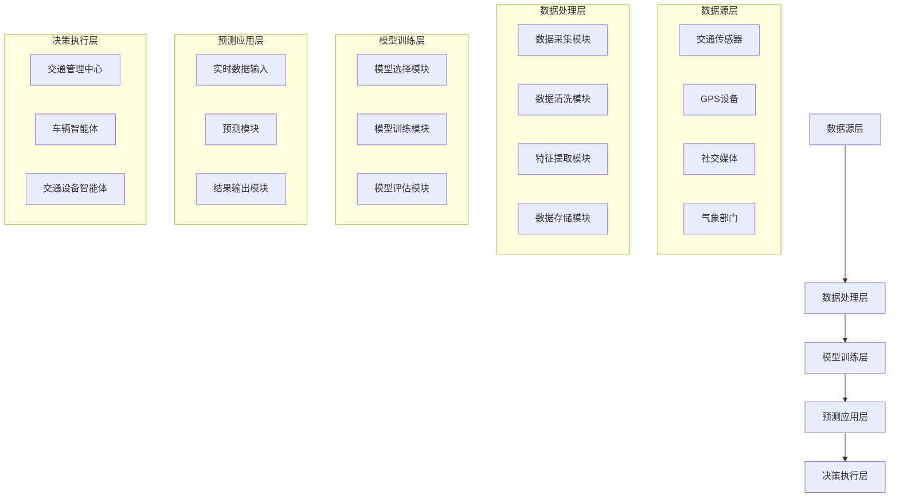

# AI Agent在智能交通拥堵预测中的实践

> 关键词：AI Agent、智能交通、拥堵预测、多智能体系统、机器学习

> 摘要：本文围绕AI Agent在智能交通拥堵预测中的实践展开深入探讨。首先介绍了相关背景知识，包括研究目的、预期读者、文档结构和术语表。接着阐述了AI Agent、智能交通拥堵预测等核心概念及其联系，并给出了原理和架构的文本示意图与Mermaid流程图。详细讲解了核心算法原理，使用Python源代码进行说明，同时介绍了相关的数学模型和公式，并举例说明。通过项目实战，展示了开发环境搭建、源代码实现和解读。分析了AI Agent在智能交通拥堵预测中的实际应用场景，推荐了学习资源、开发工具框架和相关论文著作。最后总结了未来发展趋势与挑战，提供了常见问题解答和扩展阅读参考资料，旨在为该领域的研究和实践提供全面而深入的指导。

## 1. 背景介绍 
### 1.1 目的和范围
随着城市化进程的加速和汽车保有量的不断增加，交通拥堵问题日益严重，给人们的日常生活和社会经济发展带来了诸多负面影响。智能交通拥堵预测作为缓解交通拥堵的重要手段，能够提前预测交通拥堵的发生时间、地点和程度，为交通管理部门制定合理的交通疏导策略提供依据，同时也能为出行者提供实时的交通信息，帮助他们规划更优的出行路线。

本文的目的在于探讨AI Agent在智能交通拥堵预测中的应用实践，详细介绍相关的技术原理、算法实现和实际应用案例。范围涵盖了从AI Agent的基本概念到其在交通拥堵预测中的具体应用，包括核心算法原理、数学模型、项目实战以及未来发展趋势等方面。

### 1.2 预期读者
本文预期读者主要包括以下几类人群：
- 交通工程领域的研究人员和工程师，他们希望了解AI技术在交通拥堵预测中的应用，为解决实际交通问题提供新的思路和方法。
- 计算机科学领域的开发者和研究者，对AI Agent技术感兴趣，想了解其在智能交通领域的具体应用场景和实践经验。
- 交通管理部门的工作人员，需要借助先进的技术手段提高交通管理的效率和水平，通过本文可以了解如何利用AI Agent进行交通拥堵预测和管理。
- 对智能交通和人工智能技术有兴趣的普通读者，希望通过本文了解相关领域的前沿知识和发展动态。

### 1.3 文档结构概述
本文将按照以下结构进行组织：
- 背景介绍：阐述研究目的、预期读者、文档结构和术语表。
- 核心概念与联系：介绍AI Agent、智能交通拥堵预测等核心概念，给出原理和架构的文本示意图与Mermaid流程图。
- 核心算法原理 & 具体操作步骤：详细讲解核心算法原理，使用Python源代码进行说明。
- 数学模型和公式 & 详细讲解 & 举例说明：介绍相关的数学模型和公式，并举例说明。
- 项目实战：代码实际案例和详细解释说明，包括开发环境搭建、源代码实现和解读。
- 实际应用场景：分析AI Agent在智能交通拥堵预测中的实际应用场景。
- 工具和资源推荐：推荐学习资源、开发工具框架和相关论文著作。
- 总结：未来发展趋势与挑战：总结AI Agent在智能交通拥堵预测中的发展趋势和面临的挑战。
- 附录：常见问题与解答：提供常见问题的解答。
- 扩展阅读 & 参考资料：列出扩展阅读的相关资料和参考文献。

### 1.4 术语表
#### 1.4.1 核心术语定义
- **AI Agent（人工智能智能体）**：是一种能够感知环境、自主决策并采取行动以实现特定目标的智能实体。在智能交通领域，AI Agent可以是安装在车辆上的智能设备、交通传感器或交通管理中心的智能系统。
- **智能交通系统（Intelligent Transportation System，ITS）**：是将先进的信息技术、通信技术、传感器技术、控制技术和计算机技术等有效地集成应用于交通运输管理体系，从而建立起一种在大范围内、全方位发挥作用的实时、准确、高效的综合运输和管理系统。
- **交通拥堵预测**：是指通过对历史交通数据、实时交通信息和其他相关因素的分析，预测未来某个时间段内交通拥堵的发生概率、程度和范围。
- **多智能体系统（Multi - Agent System，MAS）**：由多个AI Agent组成的系统，这些智能体之间可以相互通信、协作和竞争，共同完成一个复杂的任务。在智能交通拥堵预测中，多智能体系统可以由车辆智能体、交通传感器智能体和交通管理中心智能体等组成。

#### 1.4.2 相关概念解释
- **交通流理论**：研究交通流特性和规律的理论，主要包括交通流的速度、流量和密度之间的关系。交通流理论是交通拥堵预测的基础，通过对交通流参数的分析可以了解交通拥堵的形成机制和发展趋势。
- **机器学习**：是一门多领域交叉学科，涉及概率论、统计学、逼近论、凸分析、算法复杂度理论等多门学科。它专门研究计算机怎样模拟或实现人类的学习行为，以获取新的知识或技能，重新组织已有的知识结构使之不断改善自身的性能。在智能交通拥堵预测中，机器学习算法可以用于对交通数据的分析和建模。
- **深度学习**：是机器学习的一个分支领域，它是一种基于对数据进行表征学习的方法。深度学习通过构建具有多个层次的神经网络模型，自动从大量数据中学习特征和模式，从而实现对复杂数据的分类、预测和生成等任务。在交通拥堵预测中，深度学习算法可以处理大规模的交通数据，提高预测的准确性。

#### 1.4.3 缩略词列表
- **AI**：Artificial Intelligence，人工智能
- **ITS**：Intelligent Transportation System，智能交通系统
- **MAS**：Multi - Agent System，多智能体系统
- **GPS**：Global Positioning System，全球定位系统
- **CNN**：Convolutional Neural Network，卷积神经网络
- **LSTM**：Long Short - Term Memory，长短期记忆网络

## 2. 核心概念与联系 
### 核心概念原理
#### AI Agent原理
AI Agent是一个具有感知、决策和行动能力的智能实体。其基本原理可以概括为以下几个步骤：
1. **感知环境**：AI Agent通过各种传感器（如摄像头、雷达、GPS等）收集周围环境的信息，例如车辆的位置、速度、交通信号灯的状态等。
2. **信息处理**：对感知到的信息进行处理和分析，提取有用的特征和模式。这可能涉及到数据清洗、特征提取、机器学习算法等技术。
3. **决策制定**：根据处理后的信息和预设的目标，AI Agent使用决策算法（如规则引擎、强化学习等）制定行动策略。例如，在交通拥堵预测中，AI Agent可以根据当前的交通状况预测未来的拥堵情况，并决定是否调整交通信号灯的时长或引导车辆选择其他路线。
4. **行动执行**：AI Agent根据决策结果采取相应的行动，例如向其他智能体发送消息、控制交通设备等。

#### 智能交通拥堵预测原理
智能交通拥堵预测的基本原理是基于对历史交通数据和实时交通信息的分析，建立交通拥堵预测模型。常用的方法包括统计分析方法、机器学习方法和深度学习方法等。
1. **数据收集**：收集各种交通数据，包括车辆的速度、流量、密度、交通信号灯的状态、天气信息等。这些数据可以来自于交通传感器、GPS设备、社交媒体等多个数据源。
2. **数据预处理**：对收集到的数据进行清洗、归一化、特征提取等预处理操作，以提高数据的质量和可用性。
3. **模型建立**：选择合适的预测模型，如线性回归模型、神经网络模型、支持向量机模型等，并使用预处理后的数据对模型进行训练。
4. **模型评估**：使用测试数据对训练好的模型进行评估，计算预测误差和准确率等指标，以评估模型的性能。
5. **预测应用**：将训练好的模型应用于实际的交通拥堵预测中，根据实时交通信息预测未来的拥堵情况。

### 架构的文本示意图
```plaintext
智能交通拥堵预测系统架构

数据源层
|-- 交通传感器（摄像头、雷达、地磁传感器等）
|-- GPS设备（车辆、行人）
|-- 社交媒体（微博、微信等）
|-- 气象部门（天气信息）

数据处理层
|-- 数据采集模块（收集各数据源的数据）
|-- 数据清洗模块（去除噪声和异常值）
|-- 特征提取模块（提取有用的特征）
|-- 数据存储模块（存储处理后的数据）

模型训练层
|-- 模型选择模块（选择合适的预测模型）
|-- 模型训练模块（使用训练数据对模型进行训练）
|-- 模型评估模块（评估模型的性能）

预测应用层
|-- 实时数据输入（获取实时交通信息）
|-- 预测模块（使用训练好的模型进行预测）
|-- 结果输出模块（输出预测结果）

决策执行层
|-- 交通管理中心（根据预测结果制定交通管理策略）
|-- 车辆智能体（根据预测结果调整行驶路线）
|-- 交通设备智能体（根据预测结果调整交通信号灯时长等）
```

### Mermaid流程图


## 3. 核心算法原理 & 具体操作步骤 
### 基于LSTM的交通拥堵预测算法原理
长短期记忆网络（LSTM）是一种特殊的循环神经网络（RNN），能够有效地处理序列数据中的长期依赖问题。在交通拥堵预测中，交通数据通常是按时间顺序记录的序列数据，因此LSTM非常适合用于交通拥堵预测。

LSTM的核心是其内部的记忆单元和门控机制。记忆单元可以存储长期的信息，而门控机制可以控制信息的流入、流出和遗忘。LSTM主要包含三个门：输入门、遗忘门和输出门。

#### 遗忘门
遗忘门决定了上一时刻的记忆单元状态 $C_{t - 1}$ 中有多少信息需要被遗忘。遗忘门的输出 $f_t$ 是一个介于0和1之间的向量，通过一个sigmoid函数计算得到：
$$f_t=\sigma(W_f[h_{t - 1},x_t]+b_f)$$
其中，$W_f$ 是遗忘门的权重矩阵，$h_{t - 1}$ 是上一时刻的隐藏状态，$x_t$ 是当前时刻的输入，$b_f$ 是遗忘门的偏置向量，$\sigma$ 是sigmoid函数。

#### 输入门
输入门决定了当前时刻的输入 $x_t$ 中有多少信息需要被添加到记忆单元中。输入门的输出 $i_t$ 同样通过sigmoid函数计算得到：
$$i_t=\sigma(W_i[h_{t - 1},x_t]+b_i)$$
同时，还需要计算一个候选记忆单元状态 $\tilde{C}_t$，通过tanh函数计算得到：
$$\tilde{C}_t=\tanh(W_C[h_{t - 1},x_t]+b_C)$$

#### 记忆单元更新
根据遗忘门和输入门的输出，更新记忆单元状态 $C_t$：
$$C_t=f_t\odot C_{t - 1}+i_t\odot\tilde{C}_t$$
其中，$\odot$ 表示逐元素相乘。

#### 输出门
输出门决定了当前时刻的记忆单元状态 $C_t$ 中有多少信息需要被输出到隐藏状态 $h_t$ 中。输出门的输出 $o_t$ 通过sigmoid函数计算得到：
$$o_t=\sigma(W_o[h_{t - 1},x_t]+b_o)$$
然后，计算当前时刻的隐藏状态 $h_t$：
$$h_t=o_t\odot\tanh(C_t)$$

### Python源代码实现
```python
import numpy as np
import pandas as pd
from sklearn.preprocessing import MinMaxScaler
from tensorflow.keras.models import Sequential
from tensorflow.keras.layers import LSTM, Dense

# 数据加载和预处理
def load_and_preprocess_data(file_path):
    data = pd.read_csv(file_path)
    # 假设数据的最后一列为交通流量数据
    traffic_data = data.iloc[:, -1].values
    traffic_data = traffic_data.reshape(-1, 1)
    # 数据归一化
    scaler = MinMaxScaler(feature_range=(0, 1))
    scaled_data = scaler.fit_transform(traffic_data)
    return scaled_data, scaler

# 创建训练数据集
def create_dataset(dataset, time_step=1):
    X, Y = [], []
    for i in range(len(dataset) - time_step - 1):
        a = dataset[i:(i + time_step), 0]
        X.append(a)
        Y.append(dataset[i + time_step, 0])
    return np.array(X), np.array(Y)

# 构建LSTM模型
def build_lstm_model(time_step):
    model = Sequential()
    model.add(LSTM(50, return_sequences=True, input_shape=(time_step, 1)))
    model.add(LSTM(50, return_sequences=True))
    model.add(LSTM(50))
    model.add(Dense(1))
    model.compile(loss='mean_squared_error', optimizer='adam')
    return model

# 主函数
def main():
    file_path = 'traffic_data.csv'
    scaled_data, scaler = load_and_preprocess_data(file_path)
    time_step = 100
    X_train, y_train = create_dataset(scaled_data, time_step)
    X_train = X_train.reshape(X_train.shape[0], X_train.shape[1], 1)

    model = build_lstm_model(time_step)
    model.fit(X_train, y_train, epochs=100, batch_size=64, verbose=1)

    # 预测未来的交通流量
    last_time_step_data = scaled_data[-time_step:]
    last_time_step_data = last_time_step_data.reshape(1, time_step, 1)
    next_day_prediction = model.predict(last_time_step_data)
    next_day_prediction = scaler.inverse_transform(next_day_prediction)
    print("预测的下一天交通流量：", next_day_prediction)

if __name__ == "__main__":
    main()
```

### 具体操作步骤
1. **数据加载和预处理**：使用`load_and_preprocess_data`函数加载交通数据，并进行归一化处理。
2. **创建训练数据集**：使用`create_dataset`函数将归一化后的数据转换为适合LSTM模型输入的格式。
3. **构建LSTM模型**：使用`build_lstm_model`函数构建LSTM模型，并编译模型。
4. **模型训练**：使用训练数据集对模型进行训练。
5. **预测未来的交通流量**：使用训练好的模型预测未来的交通流量，并将预测结果进行反归一化处理。

## 4. 数学模型和公式 & 详细讲解 & 举例说明 
### 交通流基本数学模型
#### 交通流三参数关系
交通流的三个基本参数是流量 $q$（单位时间内通过某一断面的车辆数）、速度 $v$（车辆行驶的平均速度）和密度 $k$（单位长度道路上的车辆数）。它们之间的关系可以用以下公式表示：
$$q = k \times v$$

这个公式表明，流量等于密度和速度的乘积。当密度较小时，车辆之间的间距较大，速度可以达到较高值，此时流量随着密度的增加而增加；当密度达到一定值时，车辆之间的间距变小，速度开始下降，流量仍然可能继续增加；当密度达到临界密度时，流量达到最大值；当密度继续增加时，速度急剧下降，流量也随之下降。

#### 格林希尔治模型
格林希尔治模型是一种常用的交通流速度 - 密度关系模型，其表达式为：
$$v = v_f(1 - \frac{k}{k_j})$$
其中，$v_f$ 是自由流速度，即道路上没有车辆干扰时车辆的行驶速度；$k_j$ 是阻塞密度，即道路上车辆排满时的密度。

将格林希尔治模型代入流量 - 速度 - 密度关系公式 $q = k \times v$ 中，可以得到流量 - 密度关系公式：
$$q = k \times v_f(1 - \frac{k}{k_j})$$

### 举例说明
假设某条道路的自由流速度 $v_f = 60$ km/h，阻塞密度 $k_j = 120$ 辆/km。

#### 计算速度 - 密度关系
当密度 $k = 30$ 辆/km 时，根据格林希尔治模型可以计算出速度：
$$v = v_f(1 - \frac{k}{k_j}) = 60\times(1 - \frac{30}{120}) = 60\times\frac{3}{4} = 45$$ km/h

#### 计算流量 - 密度关系
当密度 $k = 30$ 辆/km 时，根据流量 - 密度关系公式可以计算出流量：
$$q = k \times v_f(1 - \frac{k}{k_j}) = 30\times60\times(1 - \frac{30}{120}) = 30\times45 = 1350$$ 辆/h

### 基于机器学习的交通拥堵预测数学模型
#### 线性回归模型
线性回归模型是一种简单的机器学习模型，用于建立自变量和因变量之间的线性关系。在交通拥堵预测中，可以将交通流量、速度、密度等作为自变量，将拥堵程度作为因变量。线性回归模型的表达式为：
$$y = \beta_0 + \beta_1x_1 + \beta_2x_2 + \cdots + \beta_nx_n + \epsilon$$
其中，$y$ 是因变量，$x_1, x_2, \cdots, x_n$ 是自变量，$\beta_0, \beta_1, \cdots, \beta_n$ 是回归系数，$\epsilon$ 是误差项。

#### 举例说明
假设我们使用线性回归模型预测交通拥堵程度 $y$，自变量包括交通流量 $x_1$ 和天气状况 $x_2$（天气状况可以用一个数值表示，如晴天为1，雨天为2等）。通过对历史数据的训练，得到回归系数 $\beta_0 = 0.1$，$\beta_1 = 0.001$，$\beta_2 = 0.05$。当某一时刻的交通流量 $x_1 = 2000$ 辆/h，天气状况 $x_2 = 1$ 时，可以预测交通拥堵程度：
$$y = \beta_0 + \beta_1x_1 + \beta_2x_2 = 0.1 + 0.001\times2000 + 0.05\times1 = 0.1 + 2 + 0.05 = 2.15$$

## 5. 项目实战：代码实际案例和详细解释说明 
### 5.1  开发环境搭建
#### 操作系统
建议使用Linux系统（如Ubuntu）或Windows系统。Linux系统在数据处理和机器学习开发方面具有较好的性能和稳定性，而Windows系统则更适合初学者使用。

#### 编程语言和版本
使用Python 3.x版本，Python是一种功能强大、易于学习的编程语言，拥有丰富的机器学习和数据处理库。

#### 安装必要的库
使用以下命令安装必要的Python库：
```bash
pip install numpy pandas scikit-learn tensorflow matplotlib
```
- `numpy`：用于数值计算和数组操作。
- `pandas`：用于数据处理和分析。
- `scikit-learn`：提供了各种机器学习算法和工具。
- `tensorflow`：用于构建和训练深度学习模型。
- `matplotlib`：用于数据可视化。

### 5.2  源代码详细实现和代码解读
```python
import numpy as np
import pandas as pd
from sklearn.preprocessing import MinMaxScaler
from tensorflow.keras.models import Sequential
from tensorflow.keras.layers import LSTM, Dense
import matplotlib.pyplot as plt

# 数据加载和预处理
def load_and_preprocess_data(file_path):
    data = pd.read_csv(file_path)
    # 假设数据的最后一列为交通流量数据
    traffic_data = data.iloc[:, -1].values
    traffic_data = traffic_data.reshape(-1, 1)
    # 数据归一化
    scaler = MinMaxScaler(feature_range=(0, 1))
    scaled_data = scaler.fit_transform(traffic_data)
    return scaled_data, scaler

# 创建训练数据集
def create_dataset(dataset, time_step=1):
    X, Y = [], []
    for i in range(len(dataset) - time_step - 1):
        a = dataset[i:(i + time_step), 0]
        X.append(a)
        Y.append(dataset[i + time_step, 0])
    return np.array(X), np.array(Y)

# 构建LSTM模型
def build_lstm_model(time_step):
    model = Sequential()
    model.add(LSTM(50, return_sequences=True, input_shape=(time_step, 1)))
    model.add(LSTM(50, return_sequences=True))
    model.add(LSTM(50))
    model.add(Dense(1))
    model.compile(loss='mean_squared_error', optimizer='adam')
    return model

# 主函数
def main():
    file_path = 'traffic_data.csv'
    scaled_data, scaler = load_and_preprocess_data(file_path)
    time_step = 100
    X_train, y_train = create_dataset(scaled_data, time_step)
    X_train = X_train.reshape(X_train.shape[0], X_train.shape[1], 1)

    model = build_lstm_model(time_step)
    history = model.fit(X_train, y_train, epochs=100, batch_size=64, verbose=1)

    # 绘制训练损失曲线
    plt.plot(history.history['loss'])
    plt.title('Model Loss')
    plt.ylabel('Loss')
    plt.xlabel('Epoch')
    plt.show()

    # 预测未来的交通流量
    last_time_step_data = scaled_data[-time_step:]
    last_time_step_data = last_time_step_data.reshape(1, time_step, 1)
    next_day_prediction = model.predict(last_time_step_data)
    next_day_prediction = scaler.inverse_transform(next_day_prediction)
    print("预测的下一天交通流量：", next_day_prediction)

if __name__ == "__main__":
    main()
```

### 代码解读与分析
#### 数据加载和预处理
- `load_and_preprocess_data`函数：使用`pandas`库读取CSV文件中的交通数据，并提取最后一列作为交通流量数据。然后使用`MinMaxScaler`将数据归一化到0到1的范围内。

#### 创建训练数据集
- `create_dataset`函数：将归一化后的数据转换为适合LSTM模型输入的格式。`time_step`参数表示使用前多少个时间步的数据来预测下一个时间步的数据。

#### 构建LSTM模型
- `build_lstm_model`函数：使用`Sequential`模型构建一个包含三个LSTM层和一个全连接层的深度学习模型。`return_sequences=True`表示将每个时间步的输出传递给下一层，最后一层的输出维度为1，表示预测的交通流量。

#### 模型训练
- 在`main`函数中，调用`model.fit`方法对模型进行训练。`epochs`参数表示训练的轮数，`batch_size`参数表示每次训练使用的样本数。

#### 绘制训练损失曲线
- 使用`matplotlib`库绘制训练损失曲线，帮助我们观察模型的训练过程和收敛情况。

#### 预测未来的交通流量
- 使用训练好的模型预测未来的交通流量，并将预测结果进行反归一化处理，得到实际的交通流量值。

## 6. 实际应用场景 
### 交通管理部门决策支持
交通管理部门可以利用AI Agent进行交通拥堵预测，提前制定交通疏导策略。例如，当预测到某条道路即将发生拥堵时，可以通过调整交通信号灯的时长、发布交通诱导信息等方式，引导车辆选择其他路线，从而缓解交通拥堵。

### 智能交通系统优化
在智能交通系统中，AI Agent可以与其他智能设备（如交通传感器、车辆智能系统等）进行协作，实现对交通流量的实时监测和控制。例如，通过与车辆智能系统的通信，AI Agent可以为车辆提供实时的交通信息和最优行驶路线，提高车辆的行驶效率。

### 出行规划服务
出行者可以通过手机应用程序或网站获取AI Agent提供的交通拥堵预测信息，从而规划更优的出行路线和时间。例如，在上班高峰期，出行者可以根据预测信息选择避开拥堵路段，选择公共交通工具或错峰出行，减少出行时间和成本。

### 城市交通规划
城市规划部门可以利用AI Agent的交通拥堵预测结果，对城市交通基础设施进行优化和规划。例如，根据预测结果确定是否需要建设新的道路、桥梁或隧道，以及如何优化现有道路的布局和交通信号设置。

## 7. 工具和资源推荐
### 7.1 学习资源推荐
#### 7.1.1 书籍推荐
- 《Python机器学习》：这本书详细介绍了Python在机器学习中的应用，包括各种机器学习算法的原理和实现，适合初学者入门。
- 《深度学习》：由深度学习领域的三位顶尖专家Ian Goodfellow、Yoshua Bengio和Aaron Courville撰写，是深度学习领域的经典教材，涵盖了深度学习的基本概念、算法和应用。
- 《智能交通系统概论》：系统介绍了智能交通系统的基本概念、技术和应用，对理解智能交通领域的知识非常有帮助。

#### 7.1.2 在线课程
- Coursera上的“机器学习”课程：由斯坦福大学教授Andrew Ng讲授，是机器学习领域的经典课程，内容涵盖了机器学习的基本概念、算法和应用。
- edX上的“深度学习基础”课程：由微软和华盛顿大学联合开设，介绍了深度学习的基本原理和方法，包括神经网络、卷积神经网络、循环神经网络等。
- 中国大学MOOC上的“智能交通系统”课程：由国内高校教授讲授，系统介绍了智能交通系统的相关知识和技术。

#### 7.1.3 技术博客和网站
- 机器之心：提供了人工智能领域的最新技术动态、研究成果和应用案例，是了解人工智能技术发展的重要渠道。
- 开源中国：涵盖了软件开发、开源技术、云计算等多个领域的技术文章和资讯，对学习和实践AI Agent技术有一定的帮助。
- Kaggle：是一个数据科学竞赛平台，上面有许多关于交通数据挖掘和预测的竞赛项目和数据集，可以通过参与竞赛来提高自己的实践能力。

### 7.2 开发工具框架推荐
#### 7.2.1 IDE和编辑器
- PyCharm：是一款专门为Python开发设计的集成开发环境，具有代码自动补全、调试、版本控制等功能，适合开发Python机器学习和深度学习项目。
- Jupyter Notebook：是一个交互式的开发环境，可以将代码、文本、图表等内容整合在一起，方便进行数据探索和模型开发。
- Visual Studio Code：是一款轻量级的代码编辑器，支持多种编程语言和插件扩展，对Python开发也有很好的支持。

#### 7.2.2 调试和性能分析工具
- TensorBoard：是TensorFlow提供的一个可视化工具，可以用于查看模型的训练过程、损失曲线、模型结构等信息，帮助我们调试和优化模型。
- Py-Spy：是一个用于Python代码性能分析的工具，可以实时监测Python程序的CPU使用情况、函数调用时间等信息，帮助我们找出性能瓶颈。

#### 7.2.3 相关框架和库
- TensorFlow：是一个开源的深度学习框架，由Google开发和维护，提供了丰富的深度学习模型和工具，支持多种硬件平台。
- PyTorch：是另一个流行的深度学习框架，由Facebook开发和维护，具有简洁易用的API和动态图机制，适合快速开发和实验。
- Scikit-learn：是一个用于机器学习的Python库，提供了各种机器学习算法和工具，如分类、回归、聚类等，方便我们进行数据处理和模型训练。

### 7.3 相关论文著作推荐
#### 7.3.1 经典论文
- "Long Short-Term Memory"：由Sepp Hochreiter和Jürgen Schmidhuber发表于1997年，介绍了长短期记忆网络（LSTM）的原理和实现，是深度学习领域的经典论文之一。
- "Convolutional Neural Networks for Traffic Flow Prediction"：探讨了卷积神经网络（CNN）在交通流量预测中的应用，为交通拥堵预测提供了新的方法和思路。

#### 7.3.2 最新研究成果
- 可以关注ACM SIGKDD、IEEE Intelligent Transportation Systems Conference等学术会议上的最新研究成果，了解AI Agent在智能交通拥堵预测领域的最新技术和方法。

#### 7.3.3 应用案例分析
- 可以查阅一些实际的交通拥堵预测项目案例，了解如何将AI Agent技术应用于实际场景中，以及在实际应用中遇到的问题和解决方案。

## 8. 总结：未来发展趋势与挑战
### 未来发展趋势
#### 多智能体协同合作
未来，AI Agent在智能交通拥堵预测中将更加注重多智能体之间的协同合作。不同类型的智能体（如车辆智能体、交通传感器智能体、交通管理中心智能体等）将通过通信和协作，实现信息的共享和交互，共同完成交通拥堵预测和管理任务。

#### 融合多种技术
AI Agent将与其他先进技术（如物联网、大数据、云计算等）深度融合，提高交通拥堵预测的准确性和实时性。例如，通过物联网技术可以获取更多的交通数据，通过大数据技术可以对海量的交通数据进行分析和挖掘，通过云计算技术可以提供强大的计算能力支持。

#### 智能交通生态系统建设
随着AI Agent技术的发展，将逐步构建起一个智能交通生态系统。在这个生态系统中，各种智能设备和系统将相互连接、相互协作，实现交通信息的实时共享和智能决策，为人们提供更加便捷、高效、安全的出行服务。

### 面临的挑战
#### 数据质量和安全问题
交通数据的质量和安全是影响交通拥堵预测准确性和可靠性的重要因素。数据中可能存在噪声、缺失值和异常值等问题，需要进行有效的数据预处理和清洗。同时，交通数据涉及到个人隐私和国家安全等敏感信息，需要采取有效的安全措施来保护数据的安全。

#### 模型复杂度和计算资源需求
随着AI Agent技术的不断发展，交通拥堵预测模型的复杂度也在不断增加。复杂的模型需要更多的计算资源和时间来进行训练和预测，这对计算资源的需求提出了更高的要求。如何在保证模型性能的前提下，降低模型的复杂度和计算资源需求，是一个亟待解决的问题。

#### 实际应用中的不确定性
在实际应用中，交通拥堵预测面临着许多不确定性因素，如天气变化、突发事件、驾驶员行为等。这些因素可能会导致交通状况的突然变化，从而影响交通拥堵预测的准确性。如何应对这些不确定性因素，提高交通拥堵预测的鲁棒性和适应性，是未来研究的重点方向之一。

## 9. 附录：常见问题与解答
### 问题1：AI Agent在交通拥堵预测中的优势是什么？
AI Agent具有自主感知、决策和行动的能力，能够实时获取交通信息并进行分析和处理，根据不同的交通状况做出相应的决策。与传统的交通拥堵预测方法相比，AI Agent可以更好地适应复杂多变的交通环境，提高预测的准确性和实时性。

### 问题2：如何选择合适的交通拥堵预测模型？
选择合适的交通拥堵预测模型需要考虑多个因素，如数据特点、预测精度要求、计算资源等。对于小规模的交通数据，可以选择简单的统计分析模型或机器学习模型；对于大规模的交通数据，深度学习模型（如LSTM、CNN等）通常具有更好的性能。同时，还可以通过交叉验证等方法对不同的模型进行评估和比较，选择最优的模型。

### 问题3：如何处理交通数据中的噪声和缺失值？
处理交通数据中的噪声和缺失值可以采用以下方法：
- 噪声处理：可以使用滤波算法（如均值滤波、中值滤波等）对数据进行平滑处理，去除噪声。
- 缺失值处理：可以使用插值方法（如线性插值、多项式插值等）对缺失值进行填充，或者使用机器学习算法（如随机森林、支持向量机等）对缺失值进行预测。

### 问题4：AI Agent在交通拥堵预测中的应用前景如何？
AI Agent在交通拥堵预测中具有广阔的应用前景。随着人工智能技术的不断发展和交通数据的不断丰富，AI Agent可以更加准确地预测交通拥堵的发生时间、地点和程度，为交通管理部门和出行者提供更加有效的决策支持。同时，AI Agent还可以与智能交通系统中的其他设备和系统进行协同合作，实现交通的智能化管理和控制，提高交通效率和安全性。

## 10. 扩展阅读 & 参考资料
### 扩展阅读
- 《人工智能：现代方法》：全面介绍了人工智能的基本概念、算法和应用，对深入理解AI Agent技术有很大的帮助。
- 《数据挖掘：概念与技术》：介绍了数据挖掘的基本概念、算法和应用，对交通数据的分析和挖掘有一定的指导意义。

### 参考资料
- 相关学术论文和研究报告，如IEEE Transactions on Intelligent Transportation Systems、ACM Transactions on Intelligent Systems and Technology等期刊上的论文。
- 智能交通领域的标准和规范，如《智能交通系统术语》、《交通信息采集与处理技术规范》等。

作者：AI天才研究院/AI Genius Institute & 禅与计算机程序设计艺术 /Zen And The Art of Computer Programming