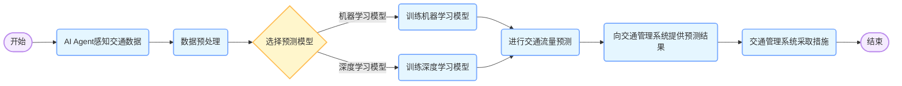

# AI Agent在智能交通流量预测中的实践

> 关键词：AI Agent、智能交通、流量预测、机器学习、深度学习

> 摘要：本文聚焦于AI Agent在智能交通流量预测中的实践应用。首先介绍了智能交通流量预测的背景、目的和预期读者等信息。接着阐述了AI Agent和智能交通流量预测的核心概念及其联系，并给出了相应的文本示意图和Mermaid流程图。详细讲解了核心算法原理，用Python代码进行了具体操作步骤的演示。同时，给出了相关的数学模型和公式，并举例说明。通过项目实战，展示了开发环境搭建、源代码实现与解读。探讨了AI Agent在智能交通流量预测中的实际应用场景，推荐了学习资源、开发工具框架以及相关论文著作。最后总结了未来发展趋势与挑战，还提供了常见问题与解答以及扩展阅读和参考资料，旨在为相关领域的研究和实践提供全面且深入的指导。

## 1. 背景介绍 
### 1.1 目的和范围
智能交通系统（Intelligent Transportation System, ITS）是解决城市交通拥堵、提高交通安全和效率的关键手段。交通流量预测作为智能交通系统的重要组成部分，能够为交通管理部门提供准确的交通信息，以便及时采取有效的交通控制和诱导措施。AI Agent作为一种具有自主决策和学习能力的智能体，能够根据环境信息和自身目标进行决策和行动。本文章的目的在于探讨AI Agent在智能交通流量预测中的应用，详细介绍相关的技术原理、算法实现和实际应用案例，范围涵盖从基本概念到项目实战的各个方面。

### 1.2 预期读者
本文预期读者包括交通工程领域的研究人员和从业者，他们希望了解如何利用AI技术改进交通流量预测方法；计算机科学领域的开发者和研究者，对将AI Agent应用于实际场景感兴趣；以及对智能交通系统和AI技术结合有兴趣的学生和爱好者。

### 1.3 文档结构概述
本文首先介绍背景信息，包括目的、预期读者和文档结构。接着阐述AI Agent和智能交通流量预测的核心概念及其联系。然后详细讲解核心算法原理和具体操作步骤，给出数学模型和公式。通过项目实战展示代码实现和解读。探讨实际应用场景，推荐相关的学习资源、开发工具框架和论文著作。最后总结未来发展趋势与挑战，提供常见问题解答和扩展阅读参考资料。

### 1.4 术语表
#### 1.4.1 核心术语定义
- **AI Agent**：人工智能智能体，是一种能够感知环境、自主决策并采取行动以实现特定目标的软件实体。
- **智能交通系统（ITS）**：将先进的信息技术、通信技术、控制技术和计算机技术等有效地综合运用于交通运输、服务控制和车辆制造，加强车辆、道路、使用者三者之间的联系，从而形成的一种实时、准确、高效的综合运输系统。
- **交通流量预测**：根据历史交通数据和当前交通状况，对未来一段时间内的交通流量进行预测的过程。

#### 1.4.2 相关概念解释
- **机器学习**：一门多领域交叉学科，涉及概率论、统计学、逼近论、凸分析、算法复杂度理论等多门学科。它专门研究计算机怎样模拟或实现人类的学习行为，以获取新的知识或技能，重新组织已有的知识结构使之不断改善自身的性能。
- **深度学习**：机器学习的一个分支领域，它是一种基于对数据进行表征学习的方法。深度学习通过构建具有很多层的神经网络模型，自动从大量数据中学习特征和模式。

#### 1.4.3 缩略词列表
- **ITS**：Intelligent Transportation System（智能交通系统）
- **ANN**：Artificial Neural Network（人工神经网络）
- **LSTM**：Long Short - Term Memory（长短期记忆网络）
- **RNN**：Recurrent Neural Network（循环神经网络）

## 2. 核心概念与联系 
### 核心概念原理
#### AI Agent
AI Agent可以看作是一个具有感知、决策和行动能力的实体。它通过传感器感知环境信息，根据内部的决策机制对这些信息进行处理和分析，然后通过执行器采取相应的行动。在智能交通流量预测中，AI Agent可以感知交通数据，如车辆速度、流量、占有率等，然后根据这些数据进行流量预测，并向交通管理系统提供建议。

#### 智能交通流量预测
智能交通流量预测是根据历史交通数据和当前交通状况，运用数学模型和算法对未来一段时间内的交通流量进行预测。常用的预测方法包括时间序列分析、机器学习和深度学习等。其原理是通过挖掘交通数据中的规律和模式，建立预测模型，从而实现对未来交通流量的准确预测。

### 架构的文本示意图
```plaintext
              +-------------------+
              |   AI Agent        |
              | +---------------+ |
              | | 感知模块       | |
              | +---------------+ |
              | | 决策模块       | |
              | +---------------+ |
              | | 行动模块       | |
              | +---------------+ |
              +-------------------+
                     |
                     | 感知交通数据
                     v
              +-------------------+
              | 交通数据采集系统 |
              | （传感器、摄像头等） |
              +-------------------+
                     |
                     | 提供历史和实时数据
                     v
              +-------------------+
              | 交通流量预测模型 |
              | （机器学习、深度学习） |
              +-------------------+
                     |
                     | 预测结果
                     v
              +-------------------+
              | 交通管理系统     |
              | （控制信号、诱导信息） |
              +-------------------+
```

### Mermaid流程图


## 3. 核心算法原理 & 具体操作步骤 
### 核心算法原理
#### 机器学习算法 - 线性回归
线性回归是一种简单而常用的机器学习算法，用于建立自变量和因变量之间的线性关系。在交通流量预测中，我们可以将历史交通流量数据作为自变量，未来的交通流量作为因变量，通过线性回归模型来预测未来的交通流量。

线性回归的数学模型可以表示为：
$$y = \theta_0 + \theta_1x_1 + \theta_2x_2 + \cdots + \theta_nx_n$$
其中，$y$ 是因变量（未来交通流量），$x_1, x_2, \cdots, x_n$ 是自变量（历史交通流量数据），$\theta_0, \theta_1, \cdots, \theta_n$ 是模型的参数。

#### 深度学习算法 - LSTM
LSTM是一种特殊的循环神经网络，能够处理序列数据中的长期依赖关系。在交通流量预测中，交通数据通常是按时间顺序记录的序列数据，LSTM可以很好地捕捉到这些数据中的时间特征和模式。

LSTM的核心结构包括输入门、遗忘门和输出门，通过这些门控机制，LSTM可以选择性地记忆和遗忘信息，从而更好地处理长期依赖问题。

### 具体操作步骤（Python源代码实现）
#### 线性回归示例
```python
import numpy as np
from sklearn.linear_model import LinearRegression

# 生成示例数据
# 假设我们有10个时间点的历史交通流量数据
X = np.array([[100], [110], [120], [130], [140], [150], [160], [170], [180], [190]])
y = np.array([120, 130, 140, 150, 160, 170, 180, 190, 200, 210])

# 创建线性回归模型
model = LinearRegression()

# 训练模型
model.fit(X, y)

# 进行预测
new_X = np.array([[200]])
prediction = model.predict(new_X)
print("线性回归预测结果:", prediction)
```
#### LSTM示例
```python
import numpy as np
from tensorflow.keras.models import Sequential
from tensorflow.keras.layers import LSTM, Dense

# 生成示例数据
# 假设我们有10个时间点的历史交通流量数据
data = np.array([100, 110, 120, 130, 140, 150, 160, 170, 180, 190])
X = []
y = []
for i in range(len(data) - 3):
    X.append(data[i:i+3])
    y.append(data[i+3])
X = np.array(X)
y = np.array(y)
X = np.reshape(X, (X.shape[0], X.shape[1], 1))

# 创建LSTM模型
model = Sequential()
model.add(LSTM(50, activation='relu', input_shape=(3, 1)))
model.add(Dense(1))
model.compile(optimizer='adam', loss='mse')

# 训练模型
model.fit(X, y, epochs=100, verbose=0)

# 进行预测
new_X = np.array([[170, 180, 190]])
new_X = np.reshape(new_X, (new_X.shape[0], new_X.shape[1], 1))
prediction = model.predict(new_X)
print("LSTM预测结果:", prediction)
```

## 4. 数学模型和公式 & 详细讲解 & 举例说明 
### 线性回归数学模型和公式
线性回归的目标是找到一组参数 $\theta_0, \theta_1, \cdots, \theta_n$，使得预测值 $\hat{y}$ 与真实值 $y$ 之间的误差最小。通常使用最小二乘法来求解这些参数，误差函数（损失函数）定义为：
$$J(\theta) = \frac{1}{2m}\sum_{i=1}^{m}(h_{\theta}(x^{(i)}) - y^{(i)})^2$$
其中，$m$ 是样本数量，$h_{\theta}(x^{(i)})$ 是第 $i$ 个样本的预测值，$y^{(i)}$ 是第 $i$ 个样本的真实值。

通过对 $J(\theta)$ 求偏导数并令其为0，可以得到参数的最优解。对于简单的一元线性回归（$n = 1$），参数的求解公式为：
$$\theta_1 = \frac{\sum_{i=1}^{m}(x^{(i)} - \bar{x})(y^{(i)} - \bar{y})}{\sum_{i=1}^{m}(x^{(i)} - \bar{x})^2}$$
$$\theta_0 = \bar{y} - \theta_1\bar{x}$$
其中，$\bar{x}$ 和 $\bar{y}$ 分别是 $x$ 和 $y$ 的均值。

### 举例说明
假设我们有以下交通流量数据：
| 时间（小时） | 交通流量（辆/小时） |
| --- | --- |
| 1 | 100 |
| 2 | 110 |
| 3 | 120 |
| 4 | 130 |
| 5 | 140 |

我们以时间作为自变量 $x$，交通流量作为因变量 $y$，使用线性回归进行预测。

首先计算均值：
$\bar{x} = \frac{1 + 2 + 3 + 4 + 5}{5} = 3$
$\bar{y} = \frac{100 + 110 + 120 + 130 + 140}{5} = 120$

然后计算 $\theta_1$：
$\sum_{i=1}^{5}(x^{(i)} - \bar{x})(y^{(i)} - \bar{y}) = (1 - 3)(100 - 120) + (2 - 3)(110 - 120) + (3 - 3)(120 - 120) + (4 - 3)(130 - 120) + (5 - 3)(140 - 120) = 100$
$\sum_{i=1}^{5}(x^{(i)} - \bar{x})^2 = (1 - 3)^2 + (2 - 3)^2 + (3 - 3)^2 + (4 - 3)^2 + (5 - 3)^2 = 10$
$\theta_1 = \frac{100}{10} = 10$

最后计算 $\theta_0$：
$\theta_0 = 120 - 10\times3 = 90$

所以线性回归模型为 $y = 90 + 10x$。如果我们要预测第6小时的交通流量，将 $x = 6$ 代入模型，得到 $y = 90 + 10\times6 = 150$ 辆/小时。

### LSTM数学模型和公式
LSTM的核心是三个门控机制：输入门 $i_t$、遗忘门 $f_t$ 和输出门 $o_t$，以及细胞状态 $C_t$。

遗忘门的计算公式为：
$$f_t = \sigma(W_f[h_{t - 1}, x_t] + b_f)$$
输入门的计算公式为：
$$i_t = \sigma(W_i[h_{t - 1}, x_t] + b_i)$$
细胞状态的更新公式为：
$$\tilde{C}_t = \tanh(W_C[h_{t - 1}, x_t] + b_C)$$
$$C_t = f_t \odot C_{t - 1} + i_t \odot \tilde{C}_t$$
输出门的计算公式为：
$$o_t = \sigma(W_o[h_{t - 1}, x_t] + b_o)$$
$$h_t = o_t \odot \tanh(C_t)$$
其中，$\sigma$ 是 sigmoid 函数，$\tanh$ 是双曲正切函数，$W$ 是权重矩阵，$b$ 是偏置向量，$\odot$ 表示元素级乘法，$h_{t - 1}$ 是上一时刻的隐藏状态，$x_t$ 是当前时刻的输入。

### 举例说明
假设我们有一个简单的LSTM单元，输入维度为1，隐藏维度为2。在某一时刻 $t$，输入 $x_t = [0.5]$，上一时刻的隐藏状态 $h_{t - 1} = [0.2, 0.3]$。

首先计算遗忘门：
假设 $W_f = \begin{bmatrix}0.1 & 0.2 \\ 0.3 & 0.4\end{bmatrix}$，$b_f = \begin{bmatrix}0.1 \\ 0.2\end{bmatrix}$
$[h_{t - 1}, x_t] = \begin{bmatrix}0.2 \\ 0.3 \\ 0.5\end{bmatrix}$
$W_f[h_{t - 1}, x_t] + b_f = \begin{bmatrix}0.1 & 0.2 & 0.1 \\ 0.3 & 0.4 & 0.2\end{bmatrix}\begin{bmatrix}0.2 \\ 0.3 \\ 0.5\end{bmatrix} = \begin{bmatrix}0.1\times0.2 + 0.2\times0.3 + 0.1\times0.5 \\ 0.3\times0.2 + 0.4\times0.3 + 0.2\times0.5\end{bmatrix} = \begin{bmatrix}0.13 \\ 0.28\end{bmatrix}$
$f_t = \sigma(W_f[h_{t - 1}, x_t] + b_f) = \begin{bmatrix}\frac{1}{1 + e^{-0.13}} \\ \frac{1}{1 + e^{-0.28}}\end{bmatrix} \approx \begin{bmatrix}0.53 \\ 0.57\end{bmatrix}$

同理，可以计算输入门、细胞状态和输出门，最终得到当前时刻的隐藏状态 $h_t$。

## 5. 项目实战：代码实际案例和详细解释说明 
### 5.1  开发环境搭建
#### 安装Python
首先需要安装Python，建议使用Python 3.7及以上版本。可以从Python官方网站（https://www.python.org/downloads/）下载安装包，按照安装向导进行安装。

#### 安装必要的库
使用以下命令安装必要的库：
```sh
pip install numpy pandas scikit-learn tensorflow matplotlib
```
- `numpy`：用于数值计算。
- `pandas`：用于数据处理和分析。
- `scikit-learn`：提供机器学习算法和工具。
- `tensorflow`：用于深度学习模型的构建和训练。
- `matplotlib`：用于数据可视化。

### 5.2  源代码详细实现和代码解读
#### 数据准备
```python
import pandas as pd
import numpy as np

# 读取交通流量数据
data = pd.read_csv('traffic_data.csv')

# 提取特征和标签
X = data.iloc[:, :-1].values
y = data.iloc[:, -1].values

# 数据划分
from sklearn.model_selection import train_test_split
X_train, X_test, y_train, y_test = train_test_split(X, y, test_size=0.2, random_state=42)
```
代码解读：
- 首先使用 `pandas` 库读取交通流量数据文件 `traffic_data.csv`。
- 然后将数据划分为特征 `X` 和标签 `y`。
- 最后使用 `sklearn` 库的 `train_test_split` 函数将数据划分为训练集和测试集，测试集占比为20%。

#### 线性回归模型训练和评估
```python
from sklearn.linear_model import LinearRegression
from sklearn.metrics import mean_squared_error

# 创建线性回归模型
model = LinearRegression()

# 训练模型
model.fit(X_train, y_train)

# 进行预测
y_pred = model.predict(X_test)

# 评估模型
mse = mean_squared_error(y_test, y_pred)
print("线性回归模型均方误差:", mse)
```
代码解读：
- 导入 `LinearRegression` 类创建线性回归模型。
- 使用训练集数据对模型进行训练。
- 使用测试集数据进行预测。
- 计算预测结果的均方误差（MSE）来评估模型的性能。

#### LSTM模型训练和评估
```python
from tensorflow.keras.models import Sequential
from tensorflow.keras.layers import LSTM, Dense
from sklearn.preprocessing import MinMaxScaler

# 数据归一化
scaler = MinMaxScaler()
X_train = scaler.fit_transform(X_train)
X_test = scaler.transform(X_test)

# 调整数据形状以适应LSTM输入
X_train = np.reshape(X_train, (X_train.shape[0], X_train.shape[1], 1))
X_test = np.reshape(X_test, (X_test.shape[0], X_test.shape[1], 1))

# 创建LSTM模型
model = Sequential()
model.add(LSTM(50, activation='relu', input_shape=(X_train.shape[1], 1)))
model.add(Dense(1))
model.compile(optimizer='adam', loss='mse')

# 训练模型
model.fit(X_train, y_train, epochs=100, batch_size=32, verbose=0)

# 进行预测
y_pred = model.predict(X_test)

# 反归一化
y_pred = scaler.inverse_transform(y_pred)
y_test = scaler.inverse_transform(y_test.reshape(-1, 1))

# 评估模型
mse = mean_squared_error(y_test, y_pred)
print("LSTM模型均方误差:", mse)
```
代码解读：
- 使用 `MinMaxScaler` 对数据进行归一化处理，将数据缩放到 [0, 1] 范围内。
- 调整数据形状以适应LSTM模型的输入要求。
- 创建LSTM模型，包含一个LSTM层和一个全连接层。
- 使用 `adam` 优化器和均方误差损失函数编译模型。
- 训练模型并进行预测。
- 对预测结果进行反归一化处理，将其还原到原始数据范围。
- 计算预测结果的均方误差来评估模型的性能。

### 5.3  代码解读与分析
#### 线性回归模型
线性回归模型是一种简单而直观的模型，通过拟合数据的线性关系来进行预测。在本项目中，线性回归模型的优点是计算速度快，易于理解和解释。但是，它只能处理线性关系，对于复杂的交通流量数据可能无法捕捉到其中的非线性特征。

#### LSTM模型
LSTM模型能够处理序列数据中的长期依赖关系，对于交通流量这种按时间顺序记录的数据非常适用。在本项目中，LSTM模型通过门控机制选择性地记忆和遗忘信息，能够更好地捕捉到交通流量数据中的时间特征和模式。但是，LSTM模型的训练时间较长，模型复杂度较高，需要更多的计算资源。

## 6. 实际应用场景 
### 交通信号控制
AI Agent可以根据交通流量预测结果，实时调整交通信号的配时方案。例如，当预测到某个路口的交通流量将大幅增加时，AI Agent可以提前增加该路口绿灯的时间，减少车辆的等待时间，提高交通效率。

### 交通诱导
通过交通流量预测，AI Agent可以为驾驶员提供实时的交通诱导信息。例如，推荐最佳的行驶路线，避开拥堵路段，减少驾驶员的出行时间和油耗。

### 交通规划
交通规划部门可以利用AI Agent的交通流量预测结果，制定更加科学合理的交通规划方案。例如，根据预测的未来交通流量增长趋势，决定是否需要新建道路、扩建现有道路或调整公交线路。

### 智能停车管理
AI Agent可以预测停车场的使用情况，根据交通流量预测结果，提前调整停车场的收费策略和引导系统。例如，当预测到某个区域的交通流量较大时，提高该区域停车场的收费标准，引导驾驶员选择其他停车场，缓解停车压力。

## 7. 工具和资源推荐
### 7.1 学习资源推荐
#### 7.1.1 书籍推荐
- 《Python机器学习实战》：本书详细介绍了Python在机器学习领域的应用，包括各种机器学习算法的原理和实现，适合初学者入门。
- 《深度学习》：由深度学习领域的三位顶尖专家Ian Goodfellow、Yoshua Bengio和Aaron Courville撰写，是深度学习领域的经典教材，全面介绍了深度学习的理论和实践。
- 《智能交通系统》：系统介绍了智能交通系统的基本概念、技术和应用，对于了解智能交通领域的知识非常有帮助。

#### 7.1.2 在线课程
- Coursera上的“机器学习”课程：由斯坦福大学教授Andrew Ng主讲，是机器学习领域的经典课程，深入浅出地介绍了机器学习的基本概念和算法。
- edX上的“深度学习专项课程”：由深度学习领域的知名专家提供，包括多个深度学习相关的课程，适合深入学习深度学习技术。
- 中国大学MOOC上的“智能交通系统”课程：由国内高校教授授课，介绍了智能交通系统的最新技术和应用。

#### 7.1.3 技术博客和网站
- Medium：上面有很多关于人工智能、机器学习和智能交通的技术博客文章，作者来自世界各地的技术专家和从业者。
- Towards Data Science：专注于数据科学和机器学习领域的技术博客，提供了很多实用的教程和案例。
- 智能交通网：专门提供智能交通领域的新闻、技术和应用案例，是了解智能交通行业动态的重要网站。

### 7.2 开发工具框架推荐
#### 7.2.1 IDE和编辑器
- PyCharm：是一款专门为Python开发设计的集成开发环境（IDE），提供了丰富的代码编辑、调试和项目管理功能。
- Jupyter Notebook：是一个交互式的开发环境，适合进行数据分析和模型实验，支持Python、R等多种编程语言。
- Visual Studio Code：是一款轻量级的代码编辑器，支持多种编程语言和插件，具有强大的代码编辑和调试功能。

#### 7.2.2 调试和性能分析工具
- TensorBoard：是TensorFlow提供的可视化工具，可以用于可视化模型的训练过程、性能指标和网络结构等。
- Py-Spy：是一个用于Python代码性能分析的工具，可以帮助开发者找出代码中的性能瓶颈。
- Scikit-learn的GridSearchCV：用于模型调优和参数搜索，可以帮助开发者找到最优的模型参数组合。

#### 7.2.3 相关框架和库
- TensorFlow：是一个开源的深度学习框架，提供了丰富的深度学习模型和工具，支持CPU、GPU和TPU等多种计算设备。
- PyTorch：是另一个流行的深度学习框架，具有动态图的特点，易于使用和调试，受到很多研究者的喜爱。
- Scikit-learn：是一个简单而高效的机器学习库，提供了各种机器学习算法和工具，适合初学者和快速开发。

### 7.3 相关论文著作推荐
#### 7.3.1 经典论文
- “Long Short-Term Memory”：由Sepp Hochreiter和Jürgen Schmidhuber发表于1997年，首次提出了LSTM的概念，是深度学习领域的经典论文。
- “Gradient-based learning applied to document recognition”：由Yann LeCun等人发表于1998年，介绍了卷积神经网络（CNN）在手写数字识别中的应用，开创了深度学习在图像识别领域的先河。
- “Intelligent Transportation Systems: A Review”：对智能交通系统的发展历程、技术和应用进行了全面的综述，是了解智能交通系统的重要文献。

#### 7.3.2 最新研究成果
- 可以通过IEEE Xplore、ACM Digital Library等学术数据库搜索关于AI Agent在智能交通流量预测方面的最新研究论文，了解该领域的前沿技术和研究动态。

#### 7.3.3 应用案例分析
- 可以参考一些实际的智能交通项目案例，如新加坡的智能交通系统、中国的车路协同项目等，了解AI Agent在实际应用中的效果和挑战。

## 8. 总结：未来发展趋势与挑战
### 未来发展趋势
#### 多模态数据融合
未来的交通流量预测将不仅仅依赖于传统的交通传感器数据，还会融合更多的多模态数据，如卫星图像、社交媒体数据、移动设备数据等。通过多模态数据融合，可以更全面地了解交通状况，提高交通流量预测的准确性。

#### 强化学习与AI Agent的结合
强化学习可以使AI Agent在与环境的交互中不断学习和优化决策策略。将强化学习与AI Agent相结合，可以使AI Agent在交通流量预测和控制中更加智能和灵活，根据实时交通状况动态调整决策。

#### 边缘计算与云计算的协同
边缘计算可以在数据产生的源头进行数据处理和分析，减少数据传输延迟。云计算则可以提供强大的计算资源和存储能力。未来，边缘计算与云计算将协同工作，实现交通数据的实时处理和高效分析，提高交通流量预测的实时性和准确性。

### 挑战
#### 数据质量和隐私问题
交通数据的质量直接影响交通流量预测的准确性。然而，实际中的交通数据可能存在噪声、缺失值等问题，需要进行有效的数据清洗和预处理。同时，交通数据涉及到大量的个人隐私信息，如何在保证数据可用性的前提下保护个人隐私是一个重要的挑战。

#### 模型复杂度和计算资源需求
深度学习模型在交通流量预测中取得了较好的效果，但这些模型通常具有较高的复杂度，需要大量的计算资源和时间进行训练。如何在有限的计算资源下提高模型的训练效率和预测性能是一个亟待解决的问题。

#### 实际应用中的不确定性
交通系统是一个复杂的动态系统，受到多种因素的影响，如天气、突发事件等。这些不确定性因素增加了交通流量预测的难度，如何使AI Agent在不确定的环境中做出准确的决策是一个挑战。

## 9. 附录：常见问题与解答
### 问题1：AI Agent在交通流量预测中的优势是什么？
解答：AI Agent具有自主决策和学习能力，能够根据实时交通数据和环境信息进行动态调整和优化预测模型。与传统的交通流量预测方法相比，AI Agent可以更好地适应交通系统的复杂性和不确定性，提高预测的准确性和实时性。

### 问题2：如何选择合适的预测模型？
解答：选择合适的预测模型需要考虑多个因素，如数据类型、数据规模、预测精度要求、计算资源等。对于简单的线性关系数据，可以选择线性回归模型；对于具有时间序列特征的数据，可以选择LSTM等深度学习模型。在实际应用中，通常需要进行模型比较和评估，选择性能最优的模型。

### 问题3：如何处理交通数据中的缺失值和噪声？
解答：处理交通数据中的缺失值可以采用插值法、删除法等方法。插值法可以根据数据的历史信息或其他相关数据进行缺失值的估计；删除法适用于缺失值较少的情况。处理噪声可以采用滤波算法，如移动平均滤波、卡尔曼滤波等，去除数据中的噪声干扰。

### 问题4：AI Agent在实际交通系统中的部署和应用有哪些挑战？
解答：AI Agent在实际交通系统中的部署和应用面临多个挑战，如数据安全和隐私问题、模型的可解释性问题、与现有交通系统的兼容性问题等。同时，交通系统的复杂性和不确定性也增加了AI Agent的应用难度，需要不断进行优化和调整。

## 10. 扩展阅读 & 参考资料
### 扩展阅读
- 《人工智能：现代方法》：全面介绍了人工智能的基本概念、技术和应用，适合对人工智能领域感兴趣的读者深入学习。
- 《交通流理论》：系统介绍了交通流的基本理论和模型，对于理解交通流量的本质和规律非常有帮助。
- 《大数据与智能交通》：探讨了大数据技术在智能交通领域的应用，包括数据采集、处理、分析和应用等方面。

### 参考资料
- IEEE Transactions on Intelligent Transportation Systems：是智能交通领域的顶级学术期刊，发表了很多关于交通流量预测、智能交通系统等方面的研究论文。
- ACM SIGKDD Conference on Knowledge Discovery and Data Mining：是数据挖掘领域的重要学术会议，会议上的论文涵盖了机器学习、深度学习等技术在各个领域的应用，包括智能交通。
- 智能交通系统相关的行业报告和技术文档，可以从政府部门、行业协会和企业网站获取。

作者：AI天才研究院/AI Genius Institute & 禅与计算机程序设计艺术 /Zen And The Art of Computer Programming