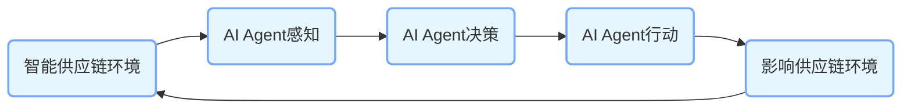

# AI Agent在智能供应链优化中的应用

> 关键词：AI Agent、智能供应链优化、人工智能、供应链管理、决策自动化

> 摘要：本文深入探讨了AI Agent在智能供应链优化中的应用。首先介绍了相关背景，包括目的、预期读者、文档结构和术语表。接着阐述了AI Agent和智能供应链的核心概念及它们之间的联系，并给出了原理和架构的文本示意图与Mermaid流程图。详细讲解了核心算法原理及具体操作步骤，结合Python源代码进行说明。还介绍了相关的数学模型和公式，并举例说明。通过项目实战展示了代码实际案例和详细解释。分析了AI Agent在智能供应链中的实际应用场景。推荐了学习、开发工具和相关论文著作。最后总结了未来发展趋势与挑战，解答了常见问题，并提供了扩展阅读和参考资料。

## 1. 背景介绍 
### 1.1 目的和范围
本文章的主要目的是全面深入地探讨AI Agent在智能供应链优化中的应用。通过对AI Agent的原理、算法、实际应用案例等方面的研究，为读者提供一个清晰的认识，了解如何利用AI Agent来提升供应链的效率、降低成本、增强灵活性和响应能力。范围涵盖了AI Agent的基本概念、核心算法、数学模型，以及在不同供应链环节中的具体应用场景，同时还会介绍相关的开发工具、学习资源和研究成果。

### 1.2 预期读者
本文预期读者包括供应链管理领域的从业者，如物流经理、采购专员、供应链分析师等，他们可以从文章中获取如何利用AI Agent优化供应链流程的实用知识和方法。同时，对于人工智能领域的研究者和开发者来说，本文可以为他们提供一个新的应用场景和研究方向。此外，对智能供应链和AI Agent感兴趣的学生和爱好者也能从文章中获得有价值的信息。

### 1.3 文档结构概述
本文将按照以下结构进行组织：首先介绍背景知识，包括目的、读者群体和文档结构等；接着阐述AI Agent和智能供应链的核心概念以及它们之间的联系；然后详细讲解核心算法原理和具体操作步骤，并结合Python代码进行说明；之后介绍相关的数学模型和公式，并举例说明；通过项目实战展示代码实际案例和详细解释；分析AI Agent在智能供应链中的实际应用场景；推荐学习、开发工具和相关论文著作；最后总结未来发展趋势与挑战，解答常见问题，并提供扩展阅读和参考资料。

### 1.4 术语表
#### 1.4.1 核心术语定义
- **AI Agent（人工智能代理）**：是一种能够感知环境、进行决策并采取行动以实现特定目标的人工智能实体。它可以根据环境的变化自主地调整自己的行为，具有一定的自主性和智能性。
- **智能供应链**：是将人工智能、物联网、大数据等先进技术应用于供应链管理中，实现供应链的智能化决策、自动化运营和可视化管理的供应链模式。
- **供应链优化**：通过对供应链中的各个环节进行分析、规划和改进，以提高供应链的效率、降低成本、增强服务质量和响应能力的过程。

#### 1.4.2 相关概念解释
- **多智能体系统（Multi-Agent System，MAS）**：由多个AI Agent组成的系统，这些Agent之间可以进行交互和协作，共同完成一个复杂的任务。在智能供应链中，多个AI Agent可以分别负责不同的环节，如采购、生产、物流等，通过协作来优化整个供应链。
- **强化学习（Reinforcement Learning）**：是一种机器学习方法，Agent通过与环境进行交互，根据环境反馈的奖励信号来学习最优的行为策略。在供应链优化中，强化学习可以用于解决库存管理、路径规划等问题。

#### 1.4.3 缩略词列表
- **MAS**：Multi-Agent System（多智能体系统）
- **RL**：Reinforcement Learning（强化学习）

## 2. 核心概念与联系 
### 核心概念原理
#### AI Agent原理
AI Agent的基本原理是基于感知 - 决策 - 行动的循环。它通过传感器感知环境中的信息，然后根据自身的知识和算法进行决策，最后通过执行器采取相应的行动。例如，在智能供应链中，一个负责库存管理的AI Agent可以通过物联网传感器感知库存水平、订单需求等信息，然后根据预设的算法决定是否需要补货以及补货的数量，最后向供应商发送补货订单。

#### 智能供应链原理
智能供应链的核心原理是利用先进的信息技术实现供应链的数字化、智能化和自动化。通过物联网设备收集供应链中的各种数据，如货物位置、运输状态、库存水平等，然后利用大数据分析和人工智能算法对这些数据进行处理和分析，以实现供应链的优化决策。例如，通过预测分析可以提前预测市场需求，从而合理安排生产和库存；通过智能调度算法可以优化物流配送路线，提高运输效率。

### 架构的文本示意图
```plaintext
+---------------------+
|    智能供应链      |
| +-----------------+ |
| |   AI Agent 集合  | |
| | +-------------+ | |
| | | 采购Agent    | | |
| | +-------------+ | |
| | +-------------+ | |
| | | 生产Agent    | | |
| | +-------------+ | |
| | +-------------+ | |
| | | 物流Agent    | | |
| | +-------------+ | |
| | +-------------+ | |
| | | 库存Agent    | | |
| | +-------------+ | |
| +-----------------+ |
| +-----------------+ |
| |  数据采集层     | |
| | (物联网设备等)  | |
| +-----------------+ |
| +-----------------+ |
| |  数据分析层     | |
| | (大数据分析等)  | |
| +-----------------+ |
| +-----------------+ |
| |  决策支持层     | |
| | (人工智能算法)  | |
| +-----------------+ |
+---------------------+
```

### Mermaid流程图


这个流程图展示了AI Agent在智能供应链环境中的工作循环。AI Agent首先感知环境中的信息，然后进行决策，接着采取行动，行动的结果会影响供应链环境，环境的变化又会被AI Agent感知到，从而开始下一个循环。

## 3. 核心算法原理 & 具体操作步骤 
### 核心算法原理 - 强化学习算法（以Q - learning为例）
强化学习是一种适合用于AI Agent在智能供应链中进行决策的算法。Q - learning是一种无模型的强化学习算法，其核心思想是通过不断地与环境进行交互，学习一个Q函数，该函数表示在某个状态下采取某个行动的价值。

Q函数的更新公式为：
$$Q(s_t, a_t) \leftarrow Q(s_t, a_t) + \alpha \left[r_{t+1} + \gamma \max_{a} Q(s_{t+1}, a) - Q(s_t, a_t)\right]$$

其中：
- $s_t$ 是当前状态
- $a_t$ 是当前采取的行动
- $r_{t+1}$ 是采取行动后获得的奖励
- $\alpha$ 是学习率，控制每次更新的步长
- $\gamma$ 是折扣因子，用于权衡当前奖励和未来奖励的重要性
- $s_{t+1}$ 是采取行动后转移到的下一个状态

### 具体操作步骤
#### 步骤1：初始化
- 初始化Q表，Q表是一个二维数组，存储每个状态 - 行动对的Q值。初始时，所有的Q值都可以设为0。
- 设定学习率 $\alpha$、折扣因子 $\gamma$ 和探索率 $\epsilon$。

#### 步骤2：环境交互循环
- 重复以下步骤直到达到终止条件（如达到最大迭代次数或满足特定的性能指标）：
    - 选择当前状态 $s_t$。
    - 根据 $\epsilon$-贪心策略选择行动 $a_t$：
        - 以概率 $\epsilon$ 随机选择一个行动（探索）。
        - 以概率 $1 - \epsilon$ 选择Q值最大的行动（利用）。
    - 执行行动 $a_t$，观察奖励 $r_{t+1}$ 和下一个状态 $s_{t+1}$。
    - 根据Q函数更新公式更新Q表中的 $Q(s_t, a_t)$。
    - 将当前状态更新为 $s_{t+1}$。

### Python源代码实现
```python
import numpy as np

# 定义Q - learning类
class QLearningAgent:
    def __init__(self, num_states, num_actions, learning_rate=0.1, discount_factor=0.9, exploration_rate=0.1):
        self.num_states = num_states
        self.num_actions = num_actions
        self.learning_rate = learning_rate
        self.discount_factor = discount_factor
        self.exploration_rate = exploration_rate
        # 初始化Q表
        self.q_table = np.zeros((num_states, num_actions))

    def choose_action(self, state):
        if np.random.uniform(0, 1) < self.exploration_rate:
            # 探索：随机选择一个行动
            action = np.random.choice(self.num_actions)
        else:
            # 利用：选择Q值最大的行动
            action = np.argmax(self.q_table[state, :])
        return action

    def update_q_table(self, state, action, reward, next_state):
        # 根据Q函数更新公式更新Q表
        max_q_next = np.max(self.q_table[next_state, :])
        self.q_table[state, action] += self.learning_rate * (reward + self.discount_factor * max_q_next - self.q_table[state, action])

# 示例使用
if __name__ == "__main__":
    num_states = 10
    num_actions = 4
    agent = QLearningAgent(num_states, num_actions)

    # 模拟环境交互
    current_state = 0
    for _ in range(100):
        action = agent.choose_action(current_state)
        # 这里简单假设奖励和下一个状态
        reward = np.random.randint(0, 10)
        next_state = np.random.randint(0, num_states)
        agent.update_q_table(current_state, action, reward, next_state)
        current_state = next_state
```

在这个代码中，我们定义了一个 `QLearningAgent` 类，它包含了Q表的初始化、行动选择和Q表更新的方法。在示例使用部分，我们模拟了100次环境交互，展示了如何使用这个类进行Q - learning训练。

## 4. 数学模型和公式 & 详细讲解 & 举例说明 
### 库存管理模型
#### 数学模型和公式
在库存管理中，我们可以使用经济订货量（Economic Order Quantity，EOQ）模型结合AI Agent进行优化。EOQ模型的公式为：
$$EOQ = \sqrt{\frac{2DS}{H}}$$

其中：
- $D$ 是年需求量
- $S$ 是每次订货的固定成本
- $H$ 是单位商品的年持有成本

假设我们使用AI Agent来动态调整订货量，以适应需求的变化。我们可以引入一个调整因子 $\beta$，则实际订货量 $Q$ 为：
$$Q = \beta \times EOQ$$

$\beta$ 可以根据AI Agent的决策进行动态调整，例如通过强化学习算法学习最优的 $\beta$ 值。

#### 详细讲解
EOQ模型的核心思想是平衡订货成本和持有成本。订货成本随着订货次数的增加而增加，而持有成本随着库存水平的增加而增加。EOQ模型通过求解使这两种成本之和最小的订货量，来实现库存管理的优化。

引入调整因子 $\beta$ 是为了考虑实际情况中需求的不确定性和动态变化。AI Agent可以根据实时的需求数据、市场趋势等信息，动态调整 $\beta$ 的值，从而使订货量更加合理。

#### 举例说明
假设某商品的年需求量 $D = 1000$ 件，每次订货的固定成本 $S = 50$ 元，单位商品的年持有成本 $H = 10$ 元。则根据EOQ模型，可得：
$$EOQ = \sqrt{\frac{2 \times 1000 \times 50}{10}} = \sqrt{10000} = 100$$

如果AI Agent根据当前的市场情况和库存水平，学习到调整因子 $\beta = 1.2$，则实际订货量 $Q = 1.2 \times 100 = 120$ 件。

### 物流路径规划模型
#### 数学模型和公式
在物流路径规划中，我们可以使用旅行商问题（Traveling Salesman Problem，TSP）的变体来建模。假设我们有 $n$ 个配送点，每个配送点之间的距离为 $d_{ij}$（$i, j = 1, 2, \cdots, n$），我们的目标是找到一条经过所有配送点且每个配送点只经过一次，最后回到起点的最短路径。

我们可以使用整数规划模型来求解这个问题。设 $x_{ij}$ 是一个二进制变量，如果从配送点 $i$ 到配送点 $j$ 有路径，则 $x_{ij} = 1$，否则 $x_{ij} = 0$。目标函数是最小化总路径长度：
$$\min \sum_{i=1}^{n} \sum_{j=1}^{n} d_{ij} x_{ij}$$

约束条件包括：
- 每个配送点必须有一个入边：$\sum_{i=1}^{n} x_{ij} = 1$，对于 $j = 1, 2, \cdots, n$
- 每个配送点必须有一个出边：$\sum_{j=1}^{n} x_{ij} = 1$，对于 $i = 1, 2, \cdots, n$
- 消除子回路：可以使用各种方法，如添加额外的约束条件或使用启发式算法。

#### 详细讲解
旅行商问题是一个经典的组合优化问题，其求解复杂度随着配送点数量的增加而指数级增长。整数规划模型通过定义目标函数和约束条件，将问题转化为一个数学优化问题。目标函数是最小化总路径长度，约束条件确保每个配送点都被访问且只被访问一次，同时避免出现子回路。

#### 举例说明
假设我们有3个配送点 $A$、$B$、$C$，它们之间的距离矩阵为：
$$
\begin{bmatrix}
0 & 10 & 15 \\
10 & 0 & 20 \\
15 & 20 & 0
\end{bmatrix}
$$

我们可以使用Python的 `pulp` 库来求解这个问题：
```python
from pulp import LpMinimize, LpProblem, LpVariable

# 定义距离矩阵
d = [[0, 10, 15],
     [10, 0, 20],
     [15, 20, 0]]

n = 3

# 创建问题
prob = LpProblem("TSP", LpMinimize)

# 定义变量
x = [[LpVariable(f"x_{i}_{j}", cat='Binary') for j in range(n)] for i in range(n)]

# 目标函数
prob += sum(d[i][j] * x[i][j] for i in range(n) for j in range(n))

# 约束条件
for j in range(n):
    prob += sum(x[i][j] for i in range(n)) == 1

for i in range(n):
    prob += sum(x[i][j] for j in range(n)) == 1

# 消除子回路（这里简单忽略，实际中需要更复杂的处理）

# 求解问题
prob.solve()

# 输出结果
for i in range(n):
    for j in range(n):
        if x[i][j].value() == 1:
            print(f"从 {i} 到 {j}")
```

这个代码使用 `pulp` 库创建了一个整数规划问题，并求解了最短路径。需要注意的是，这里没有处理子回路的问题，实际应用中需要更复杂的方法来消除子回路。

## 5. 项目实战：代码实际案例和详细解释说明 
### 5.1  开发环境搭建
#### 操作系统
可以选择Windows、Linux或macOS操作系统。建议使用Linux系统，如Ubuntu，因为它对Python开发和各种数据处理工具的支持较好。

#### Python环境
安装Python 3.7及以上版本。可以使用Anaconda来管理Python环境，它可以方便地安装各种Python库和工具。安装完成后，创建一个新的虚拟环境：
```bash
conda create -n supply_chain_ai python=3.8
conda activate supply_chain_ai
```

#### 安装必要的库
在虚拟环境中安装以下必要的库：
```bash
pip install numpy pandas scikit-learn pulp matplotlib
```

### 5.2  源代码详细实现和代码解读
#### 项目场景
我们将实现一个简单的智能供应链库存管理系统，使用AI Agent来动态调整订货量。假设我们有一个商品的需求数据，AI Agent根据历史需求数据和当前库存水平，决定是否需要补货以及补货的数量。

#### 代码实现
```python
import numpy as np
import pandas as pd
from pulp import LpMinimize, LpProblem, LpVariable

# 定义AI Agent类
class InventoryAgent:
    def __init__(self, demand_data, initial_inventory, order_cost, holding_cost):
        self.demand_data = demand_data
        self.inventory = initial_inventory
        self.order_cost = order_cost
        self.holding_cost = holding_cost
        self.time_step = 0

    def calculate_eoq(self, demand):
        # 计算经济订货量
        return np.sqrt((2 * demand * self.order_cost) / self.holding_cost)

    def make_decision(self):
        # 获取当前需求
        current_demand = self.demand_data[self.time_step]

        # 计算EOQ
        eoq = self.calculate_eoq(current_demand)

        # 如果库存低于安全库存（这里简单设为当前需求的一半），则补货
        safety_stock = current_demand / 2
        if self.inventory < safety_stock:
            order_quantity = eoq
        else:
            order_quantity = 0

        # 更新库存
        self.inventory = max(0, self.inventory - current_demand + order_quantity)

        # 计算成本
        ordering_cost = order_quantity > 0 and self.order_cost or 0
        holding_cost = self.inventory * self.holding_cost
        total_cost = ordering_cost + holding_cost

        # 时间步加1
        self.time_step += 1

        return order_quantity, total_cost

# 生成示例需求数据
np.random.seed(0)
demand_data = np.random.randint(10, 50, 100)

# 初始化库存、订货成本和持有成本
initial_inventory = 100
order_cost = 50
holding_cost = 10

# 创建AI Agent
agent = InventoryAgent(demand_data, initial_inventory, order_cost, holding_cost)

# 模拟供应链运行
total_costs = []
for _ in range(len(demand_data)):
    order_quantity, total_cost = agent.make_decision()
    total_costs.append(total_cost)

# 输出结果
print(f"总成本: {sum(total_costs)}")
```

#### 代码解读
- `InventoryAgent` 类：定义了一个库存管理的AI Agent，包含需求数据、初始库存、订货成本和持有成本等属性。
- `calculate_eoq` 方法：根据当前需求计算经济订货量。
- `make_decision` 方法：根据当前库存水平和需求，决定是否需要补货以及补货的数量。同时更新库存和计算成本。
- 主程序部分：生成示例需求数据，创建AI Agent，并模拟供应链的运行，记录每次决策的总成本。

### 5.3  代码解读与分析
#### 优点
- 简单易懂：代码结构清晰，易于理解和修改。通过定义一个 `InventoryAgent` 类，将库存管理的逻辑封装在类中，提高了代码的可维护性。
- 基于经典模型：使用经济订货量模型作为基础，结合AI Agent的决策逻辑，实现了库存管理的优化。
- 可扩展性：可以很容易地扩展代码，例如添加更多的决策因素、使用更复杂的算法等。

#### 缺点
- 简单假设：代码中使用了一些简单的假设，如安全库存设为当前需求的一半，可能不符合实际情况。在实际应用中，需要根据具体情况进行调整。
- 缺乏学习能力：当前的AI Agent只是根据固定的规则进行决策，缺乏学习和自适应的能力。可以引入强化学习等算法，让AI Agent能够根据历史数据和环境反馈不断优化决策。

## 6. 实际应用场景 
### 采购管理
在采购管理中，AI Agent可以根据历史采购数据、市场价格波动、供应商信誉等信息，自动选择最优的供应商和采购时机。例如，AI Agent可以实时监测市场价格，当价格下降到一定程度时，自动向供应商发出采购订单。同时，AI Agent可以评估供应商的信誉和交货能力，选择最可靠的供应商进行合作。

### 生产计划
AI Agent可以根据市场需求预测、库存水平、生产能力等因素，制定最优的生产计划。它可以实时调整生产进度，根据订单的紧急程度和优先级安排生产任务。例如，当某一产品的订单量突然增加时，AI Agent可以及时调整生产线，增加该产品的生产数量。

### 物流配送
在物流配送中，AI Agent可以优化配送路线、车辆调度和运输计划。它可以根据货物的重量、体积、目的地等信息，选择最优的运输方式和配送路线。同时，AI Agent可以实时监测车辆的位置和状态，及时调整运输计划，避免延误和事故。

### 库存管理
AI Agent可以根据历史销售数据、市场趋势、季节变化等因素，动态调整库存水平。它可以预测需求的变化，提前做好补货准备，避免库存积压或缺货。例如，在节假日期间，AI Agent可以预测到销售量的增加，提前增加库存。

## 7. 工具和资源推荐
### 7.1 学习资源推荐
#### 7.1.1 书籍推荐
- 《人工智能：一种现代的方法》（Artificial Intelligence: A Modern Approach）：这是一本经典的人工智能教材，涵盖了AI的各个领域，包括搜索算法、机器学习、知识表示等。
- 《供应链管理：战略、规划与运营》（Supply Chain Management: Strategy, Planning, and Operation）：全面介绍了供应链管理的理论和实践，包括采购、生产、物流等环节。
- 《强化学习：原理与Python实现》：详细介绍了强化学习的原理和算法，并通过Python代码进行了实现和讲解。

#### 7.1.2 在线课程
- Coursera上的“人工智能基础”课程：由知名教授授课，介绍了人工智能的基本概念、算法和应用。
- edX上的“供应链分析”课程：提供了供应链分析的方法和工具，包括数据分析、优化模型等。
- Udemy上的“强化学习实战”课程：通过实际案例讲解强化学习的应用和实现。

#### 7.1.3 技术博客和网站
- Medium：有很多关于人工智能和供应链管理的技术博客，作者们分享了自己的经验和见解。
- Towards Data Science：专注于数据科学和人工智能领域，提供了很多实用的教程和案例。
- Supply Chain Dive：专门报道供应链管理领域的最新动态和趋势。

### 7.2 开发工具框架推荐
#### 7.2.1 IDE和编辑器
- PyCharm：是一款专业的Python集成开发环境，提供了丰富的功能和插件，适合开发Python项目。
- Jupyter Notebook：是一个交互式的开发环境，适合进行数据分析和模型实验。
- Visual Studio Code：是一款轻量级的代码编辑器，支持多种编程语言，有丰富的插件可以扩展功能。

#### 7.2.2 调试和性能分析工具
- PDB：Python自带的调试器，可以帮助开发者定位代码中的问题。
- cProfile：Python的性能分析工具，可以分析代码的运行时间和内存使用情况。
- TensorBoard：是TensorFlow的可视化工具，可以用于可视化训练过程和模型性能。

#### 7.2.3 相关框架和库
- TensorFlow：是一个开源的机器学习框架，广泛应用于深度学习领域。
- PyTorch：是另一个流行的深度学习框架，具有动态图和易于使用的特点。
- Scikit - learn：是一个常用的机器学习库，提供了各种机器学习算法和工具。
- PuLP：是一个用于线性规划和整数规划的Python库，可以用于求解供应链优化问题。

### 7.3 相关论文著作推荐
#### 7.3.1 经典论文
- “Reinforcement Learning: A Survey”：对强化学习进行了全面的综述，介绍了强化学习的基本概念、算法和应用。
- “Supply Chain Coordination under Uncertainty”：研究了在不确定性环境下供应链的协调问题，提出了一些优化策略和模型。
- “The Traveling Salesman Problem: A Computational Study”：对旅行商问题进行了深入的研究，介绍了各种求解算法和实验结果。

#### 7.3.2 最新研究成果
- 可以通过IEEE Xplore、ACM Digital Library等学术数据库搜索关于AI Agent在智能供应链优化中的最新研究成果。例如，一些研究探索了如何使用多智能体系统来解决复杂的供应链协调问题，以及如何将深度学习和强化学习结合起来提高供应链的决策能力。

#### 7.3.3 应用案例分析
- 一些商业杂志和行业报告中会有关于AI Agent在智能供应链中应用的实际案例分析。例如，麦肯锡、波士顿咨询集团等咨询公司的报告，会介绍一些企业如何成功应用AI Agent来优化供应链，提高效率和竞争力。

## 8. 总结：未来发展趋势与挑战
### 未来发展趋势
#### 多智能体协作
未来，智能供应链中将有更多的AI Agent参与协作，形成一个复杂的多智能体系统。不同的AI Agent可以负责不同的供应链环节，通过协作来实现整个供应链的优化。例如，采购Agent、生产Agent和物流Agent可以相互沟通和协调，共同应对市场需求的变化。

#### 与新兴技术融合
AI Agent将与物联网、区块链、大数据等新兴技术深度融合。物联网可以为AI Agent提供更丰富的实时数据，区块链可以保证数据的安全性和可信度，大数据可以为AI Agent的决策提供更强大的支持。例如，通过物联网传感器收集货物的位置和状态信息，AI Agent可以实时调整物流配送计划。

#### 智能化决策自动化
随着AI技术的不断发展，智能供应链中的决策将越来越自动化。AI Agent可以根据实时数据和预设的规则，自动做出决策，无需人工干预。例如，在库存管理中，AI Agent可以自动判断是否需要补货以及补货的数量，提高决策的效率和准确性。

### 挑战
#### 数据质量和安全
AI Agent的决策依赖于大量的数据，数据的质量和安全直接影响到决策的准确性和可靠性。在智能供应链中，数据可能来自不同的来源，存在数据不一致、不完整等问题。同时，供应链中的数据涉及到企业的核心机密和客户的隐私，需要保证数据的安全性。

#### 算法复杂度和可解释性
一些先进的AI算法，如深度学习和强化学习，具有较高的复杂度，难以理解和解释。在智能供应链中，企业需要能够理解AI Agent的决策过程和依据，以便进行有效的管理和控制。因此，提高算法的可解释性是一个重要的挑战。

#### 人才短缺
AI Agent在智能供应链中的应用需要既懂人工智能又懂供应链管理的复合型人才。目前，这样的人才相对短缺，企业在招聘和培养相关人才方面面临一定的困难。

## 9. 附录：常见问题与解答
### 问题1：AI Agent在智能供应链中的应用是否会导致大量人员失业？
解答：虽然AI Agent可以自动化一些供应链管理任务，但并不会导致大量人员失业。相反，它可以将人员从繁琐的重复性工作中解放出来，让他们专注于更有价值的工作，如战略规划、数据分析和客户服务等。同时，AI Agent的应用也会创造一些新的就业机会，如AI Agent的开发、维护和管理等。

### 问题2：如何评估AI Agent在智能供应链中的性能？
解答：可以从多个方面评估AI Agent的性能，如成本降低、效率提高、服务质量提升等。例如，可以比较使用AI Agent前后的采购成本、物流成本和库存成本；评估订单处理时间、交货时间等效率指标；通过客户满意度调查来评估服务质量。此外，还可以使用一些专业的评估指标，如供应链响应时间、库存周转率等。

### 问题3：AI Agent在智能供应链中是否可以完全替代人工决策？
解答：目前来看，AI Agent还不能完全替代人工决策。虽然AI Agent可以处理大量的数据和复杂的计算，做出快速而准确的决策，但在一些复杂的情况下，如涉及到战略规划、人际关系和道德伦理等问题时，还需要人工的参与和判断。因此，在智能供应链中，应该将AI Agent和人工决策相结合，发挥各自的优势。

## 10. 扩展阅读 & 参考资料
### 扩展阅读
- 《智能供应链：未来物流与供应链的新范式》：进一步探讨了智能供应链的发展趋势和应用案例。
- 《人工智能时代的供应链变革》：分析了人工智能对供应链管理的影响和挑战。
- 《多智能体系统：原理与应用》：深入介绍了多智能体系统的理论和实践。

### 参考资料
- 相关的学术论文和研究报告，如IEEE、ACM等学术数据库中的文献。
- 行业标准和规范，如供应链管理协会（CSCMP）发布的相关标准。
- 企业的实际应用案例和经验分享，如一些大型企业的年度报告和技术博客。

作者：AI天才研究院/AI Genius Institute & 禅与计算机程序设计艺术 /Zen And The Art of Computer Programming