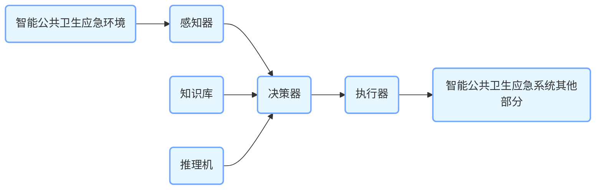

# AI Agent在智能公共卫生应急中的角色

> 关键词：AI Agent、智能公共卫生应急、角色、应急响应、数据分析

> 摘要：本文深入探讨了AI Agent在智能公共卫生应急中的角色。首先介绍了相关背景，包括目的、预期读者等内容。接着阐述了AI Agent的核心概念与联系，详细讲解了其原理和架构，并通过Mermaid流程图展示。然后剖析了核心算法原理，结合Python源代码进行说明，同时给出相关数学模型和公式。在项目实战部分，提供了开发环境搭建、源代码实现及解读。还探讨了AI Agent在智能公共卫生应急中的实际应用场景，推荐了相关工具和资源。最后总结了未来发展趋势与挑战，解答了常见问题并提供扩展阅读与参考资料。通过全面分析，旨在明确AI Agent在智能公共卫生应急中所发挥的重要作用，为相关领域的研究和实践提供参考。

## 1. 背景介绍 
### 1.1 目的和范围
在当今全球化的时代，公共卫生事件频繁发生，如传染病的爆发、突发公共卫生危机等，对人类的生命健康和社会经济发展带来了巨大的冲击。智能公共卫生应急系统的建设成为了保障公众健康和社会稳定的关键。AI Agent作为一种智能化的软件实体，具有自主决策、学习和交互的能力，能够在智能公共卫生应急中发挥重要作用。

本文的目的在于全面深入地探讨AI Agent在智能公共卫生应急中的角色，分析其如何应用于应急响应的各个环节，包括疫情监测、预警、资源调配、治疗辅助等。范围涵盖了AI Agent的基本概念、技术原理、实际应用案例以及未来发展趋势等方面。

### 1.2 预期读者
本文预期读者包括公共卫生领域的专业人员，如公共卫生专家、应急管理人员等，他们可以通过本文了解AI Agent在智能公共卫生应急中的应用，为实际工作提供新的思路和方法。同时，计算机科学领域的研究人员和开发者也可以从中获取有关AI Agent技术在公共卫生领域应用的需求和挑战，推动相关技术的创新和发展。此外，对智能公共卫生应急和AI技术感兴趣的普通读者也能通过本文对该领域有一个初步的了解。

### 1.3 文档结构概述
本文将按照以下结构进行阐述：首先介绍背景信息，包括目的、预期读者和文档结构概述等。接着讲解AI Agent的核心概念与联系，通过文本示意图和Mermaid流程图展示其原理和架构。然后详细分析核心算法原理，结合Python源代码进行说明，并给出相关数学模型和公式。在项目实战部分，介绍开发环境搭建、源代码实现及解读。之后探讨AI Agent在智能公共卫生应急中的实际应用场景。再推荐相关的工具和资源，包括学习资源、开发工具框架和相关论文著作等。最后总结未来发展趋势与挑战，解答常见问题并提供扩展阅读与参考资料。

### 1.4 术语表
#### 1.4.1 核心术语定义
- **AI Agent**：即人工智能智能体，是一种能够感知环境、自主决策并采取行动以实现特定目标的软件实体。它可以通过与环境进行交互，不断学习和优化自己的行为。
- **智能公共卫生应急**：利用先进的信息技术和智能化手段，对公共卫生事件进行监测、预警、响应和处置的过程，旨在提高公共卫生应急的效率和效果，保障公众的生命健康和社会的稳定。
- **应急响应**：在公共卫生事件发生时，采取的一系列应对措施，包括疫情防控、医疗救治、资源调配等，以减少事件对公众健康和社会的影响。

#### 1.4.2 相关概念解释
- **机器学习**：是一门多领域交叉学科，涉及概率论、统计学、逼近论、凸分析、算法复杂度理论等多门学科。它专门研究计算机怎样模拟或实现人类的学习行为，以获取新的知识或技能，重新组织已有的知识结构使之不断改善自身的性能。
- **深度学习**：是机器学习的一个分支领域，它是一种基于对数据进行表征学习的方法。深度学习通过构建具有很多层的神经网络模型，自动从大量数据中学习到复杂的模式和特征。

#### 1.4.3 缩略词列表
- **AI**：Artificial Intelligence，人工智能
- **ML**：Machine Learning，机器学习
- **DL**：Deep Learning，深度学习

## 2. 核心概念与联系 
### 核心概念原理
AI Agent的核心原理基于智能体理论，它由感知器、决策器和执行器三部分组成。感知器负责收集环境信息，例如在智能公共卫生应急中，感知器可以收集疫情数据、医疗资源数据等。决策器根据感知器收集到的信息，运用一定的算法和规则进行决策，例如判断疫情的严重程度、确定资源调配的方案等。执行器则根据决策器的决策结果，采取相应的行动，例如发布预警信息、调配医疗资源等。

### 架构的文本示意图
AI Agent在智能公共卫生应急中的架构可以描述如下：

智能公共卫生应急环境作为AI Agent的外部环境，包含各种数据源，如医疗机构的疫情报告、社交媒体的舆情信息、气象数据等。AI Agent通过感知器与这些数据源进行交互，获取相关信息。感知器将信息传递给决策器，决策器内部包含知识库、推理机等组件。知识库存储了公共卫生领域的专业知识和应急处理规则，推理机根据这些知识和规则对感知到的信息进行分析和推理，做出决策。决策器将决策结果传递给执行器，执行器与智能公共卫生应急系统的其他部分进行交互，如向相关部门发送指令、更新公共卫生信息平台等。

### Mermaid流程图


## 3. 核心算法原理 & 具体操作步骤 
### 核心算法原理
在AI Agent应用于智能公共卫生应急中，常用的算法包括机器学习算法和深度学习算法。以疫情预测为例，我们可以使用时间序列分析算法来预测疫情的发展趋势。

时间序列分析是一种基于历史数据来预测未来值的统计方法。在疫情预测中，我们可以将每日新增病例数作为时间序列数据，通过建立合适的时间序列模型来预测未来的新增病例数。常见的时间序列模型包括自回归积分滑动平均模型（ARIMA）。

### 具体操作步骤
1. **数据收集**：收集历史疫情数据，包括每日新增病例数、治愈数、死亡数等。
2. **数据预处理**：对收集到的数据进行清洗、缺失值处理、归一化等操作，以提高数据质量。
3. **模型选择**：根据数据的特点和预测需求，选择合适的时间序列模型，如ARIMA模型。
4. **模型训练**：使用历史数据对选择的模型进行训练，调整模型的参数，以提高模型的预测精度。
5. **模型预测**：使用训练好的模型对未来的疫情数据进行预测。
6. **结果评估**：使用评估指标（如均方误差、平均绝对误差等）对预测结果进行评估，根据评估结果对模型进行优化。

### Python源代码实现
```python
import pandas as pd
from statsmodels.tsa.arima.model import ARIMA
from sklearn.metrics import mean_squared_error
import numpy as np

# 数据收集和预处理
# 假设我们有一个包含每日新增病例数的CSV文件
data = pd.read_csv('daily_cases.csv', index_col='date', parse_dates=True)
train_size = int(len(data) * 0.8)
train_data = data[:train_size]
test_data = data[train_size:]

# 模型选择和训练
p, d, q = 1, 1, 1  # ARIMA模型的参数
model = ARIMA(train_data, order=(p, d, q))
model_fit = model.fit()

# 模型预测
predictions = model_fit.forecast(steps=len(test_data))

# 结果评估
mse = mean_squared_error(test_data, predictions)
rmse = np.sqrt(mse)
print(f"均方误差: {mse}")
print(f"均方根误差: {rmse}")
```

## 4. 数学模型和公式 & 详细讲解 & 举例说明 
### 自回归积分滑动平均模型（ARIMA）的数学模型
ARIMA模型的数学表达式为：

$$
(1 - \sum_{i = 1}^{p} \phi_{i} B^{i})(1 - B)^{d} Y_{t} = c + (1 + \sum_{j = 1}^{q} \theta_{j} B^{j}) \epsilon_{t}
$$

其中：
- $Y_{t}$ 是时间序列在时刻 $t$ 的值。
- $B$ 是滞后算子，即 $B Y_{t} = Y_{t - 1}$。
- $p$ 是自回归项的阶数，表示使用过去 $p$ 个时间点的值来预测当前值。
- $d$ 是差分阶数，用于将非平稳时间序列转换为平稳时间序列。
- $q$ 是移动平均项的阶数，表示使用过去 $q$ 个时间点的误差项来预测当前值。
- $\phi_{i}$ 是自回归系数。
- $\theta_{j}$ 是移动平均系数。
- $c$ 是常数项。
- $\epsilon_{t}$ 是白噪声序列，即均值为 0，方差为 $\sigma^{2}$ 的独立同分布随机变量。

### 详细讲解
ARIMA模型的核心思想是将时间序列的变化分解为自回归部分、差分部分和移动平均部分。自回归部分表示当前值与过去值之间的线性关系，差分部分用于消除时间序列的非平稳性，移动平均部分表示当前值与过去误差项之间的线性关系。

### 举例说明
假设我们有一个时间序列数据 $Y = [10, 12, 15, 18, 20, 22, 25]$，我们可以使用ARIMA模型来预测下一个时间点的值。

首先，我们需要确定 $p$、$d$、$q$ 的值。假设我们选择 $p = 1$，$d = 1$，$q = 1$。

然后，我们对数据进行差分处理，得到差分后的序列。

接着，我们使用差分后的序列进行自回归和移动平均计算，得到预测值。

最后，我们将预测值进行逆差分处理，得到原始序列的预测值。

## 5. 项目实战：代码实际案例和详细解释说明 
### 5.1  开发环境搭建
- **操作系统**：推荐使用Linux系统，如Ubuntu 20.04，因为Linux系统具有良好的稳定性和开源性，适合进行开发和实验。
- **Python环境**：安装Python 3.8及以上版本，可以通过Anaconda进行安装，Anaconda可以方便地管理Python的包和环境。
- **开发工具**：推荐使用PyCharm作为集成开发环境（IDE），它具有强大的代码编辑、调试和自动补全功能。

### 5.2  源代码详细实现和代码解读
```python
import pandas as pd
from statsmodels.tsa.arima.model import ARIMA
from sklearn.metrics import mean_squared_error
import numpy as np

# 数据收集和预处理
# 假设我们有一个包含每日新增病例数的CSV文件
data = pd.read_csv('daily_cases.csv', index_col='date', parse_dates=True)
train_size = int(len(data) * 0.8)
train_data = data[:train_size]
test_data = data[train_size:]

# 代码解读：
# 首先，使用pandas的read_csv函数读取CSV文件，并将日期列作为索引，同时解析日期格式。
# 然后，将数据集划分为训练集和测试集，训练集占80%，测试集占20%。

# 模型选择和训练
p, d, q = 1, 1, 1  # ARIMA模型的参数
model = ARIMA(train_data, order=(p, d, q))
model_fit = model.fit()

# 代码解读：
# 定义ARIMA模型的参数p、d、q，这里选择p = 1，d = 1，q = 1。
# 使用ARIMA类创建模型对象，并使用训练集数据进行训练。

# 模型预测
predictions = model_fit.forecast(steps=len(test_data))

# 代码解读：
# 使用训练好的模型对测试集数据进行预测，预测的步数为测试集的长度。

# 结果评估
mse = mean_squared_error(test_data, predictions)
rmse = np.sqrt(mse)
print(f"均方误差: {mse}")
print(f"均方根误差: {rmse}")

# 代码解读：
# 使用sklearn库中的mean_squared_error函数计算预测值和真实值之间的均方误差。
# 计算均方根误差，即均方误差的平方根。
# 打印均方误差和均方根误差，用于评估模型的预测精度。
```

### 5.3  代码解读与分析
- **数据处理**：使用pandas库进行数据读取和预处理，将日期列作为索引并解析日期格式，方便进行时间序列分析。将数据集划分为训练集和测试集，是为了评估模型的泛化能力，避免过拟合。
- **模型选择**：选择ARIMA模型进行时间序列预测，通过调整 $p$、$d$、$q$ 参数，可以改变模型的复杂度和预测效果。
- **模型训练和预测**：使用训练集数据对模型进行训练，得到模型的参数。然后使用训练好的模型对测试集数据进行预测，得到预测结果。
- **结果评估**：使用均方误差和均方根误差作为评估指标，评估模型的预测精度。均方误差和均方根误差越小，说明模型的预测效果越好。

## 6. 实际应用场景 
### 疫情监测与预警
AI Agent可以实时收集各种疫情相关数据，如医疗机构的病例报告、社交媒体的舆情信息等。通过对这些数据的分析和挖掘，AI Agent可以及时发现疫情的异常变化，发出预警信息。例如，当某个地区的新增病例数突然增加，或者社交媒体上关于某种疾病的讨论热度突然上升时，AI Agent可以迅速识别并发出预警，提醒相关部门采取措施。

### 医疗资源调配
在公共卫生应急中，医疗资源的合理调配至关重要。AI Agent可以根据疫情的发展情况、医疗机构的资源状况等信息，制定合理的医疗资源调配方案。例如，当某个地区的医疗资源紧张时，AI Agent可以协调其他地区的医疗资源进行支援，确保患者能够得到及时的治疗。

### 治疗辅助
AI Agent可以辅助医生进行疾病的诊断和治疗。通过分析患者的病历、检查报告等信息，AI Agent可以提供诊断建议和治疗方案。例如，对于一些疑难病症，AI Agent可以通过对比大量的病例数据，为医生提供参考，帮助医生做出更准确的诊断和治疗决策。

### 公众健康教育
AI Agent可以通过各种渠道，如社交媒体、手机应用等，向公众提供健康教育信息。例如，宣传疾病的预防知识、正确的防护措施等，提高公众的健康意识和自我防护能力。

## 7. 工具和资源推荐
### 7.1 学习资源推荐
#### 7.1.1 书籍推荐
- 《人工智能：一种现代的方法》：这本书全面介绍了人工智能的基本概念、算法和应用，是人工智能领域的经典教材。
- 《Python机器学习》：详细介绍了Python在机器学习中的应用，包括各种机器学习算法的原理和实现。
- 《时间序列分析及其应用：R语言示例》：介绍了时间序列分析的基本理论和方法，并通过R语言进行示例演示。

#### 7.1.2 在线课程
- Coursera上的“机器学习”课程：由斯坦福大学的Andrew Ng教授授课，是机器学习领域的经典课程。
- edX上的“人工智能基础”课程：系统介绍了人工智能的基本概念和算法。
- 中国大学MOOC上的“Python数据分析与挖掘实战”课程：介绍了Python在数据分析和挖掘中的应用。

#### 7.1.3 技术博客和网站
- 博客园：是一个技术人员分享技术经验和心得的平台，有很多关于人工智能和公共卫生领域的技术文章。
- 知乎：有很多关于人工智能和公共卫生应急的讨论和分享，可以从中获取最新的技术动态和研究成果。
- Kaggle：是一个数据科学竞赛平台，上面有很多关于公共卫生数据的竞赛和数据集，可以用于学习和实践。

### 7.2 开发工具框架推荐
#### 7.2.1 IDE和编辑器
- PyCharm：是一款专门为Python开发设计的集成开发环境，具有强大的代码编辑、调试和自动补全功能。
- Jupyter Notebook：是一个交互式的开发环境，适合进行数据分析和模型训练的实验。
- Visual Studio Code：是一款轻量级的代码编辑器，支持多种编程语言，具有丰富的插件和扩展功能。

#### 7.2.2 调试和性能分析工具
- Py-Spy：是一个Python性能分析工具，可以帮助开发者找出Python代码中的性能瓶颈。
- pdb：是Python的内置调试器，可以帮助开发者调试Python代码。
- TensorBoard：是TensorFlow的可视化工具，可以用于可视化模型的训练过程和性能指标。

#### 7.2.3 相关框架和库
- TensorFlow：是一个开源的机器学习框架，广泛应用于深度学习领域。
- PyTorch：是另一个开源的深度学习框架，具有动态计算图的特点，适合进行快速的模型开发和实验。
- scikit-learn：是一个简单易用的机器学习库，提供了各种机器学习算法的实现。

### 7.3 相关论文著作推荐
#### 7.3.1 经典论文
- “A Unified Approach to Interpreting Model Predictions”：提出了一种统一的模型解释方法，有助于理解AI模型的决策过程。
- “Deep Residual Learning for Image Recognition”：介绍了深度残差网络（ResNet），在图像识别领域取得了巨大的成功。
- “Attention Is All You Need”：提出了Transformer架构，在自然语言处理领域引起了巨大的变革。

#### 7.3.2 最新研究成果
- 关注顶级学术会议，如NeurIPS（神经信息处理系统大会）、ICML（国际机器学习会议）、KDD（知识发现与数据挖掘会议）等，这些会议上会发表很多关于人工智能和公共卫生领域的最新研究成果。
- 查阅顶级学术期刊，如《Nature》、《Science》、《Journal of Artificial Intelligence Research》等，这些期刊上的论文具有较高的学术水平和影响力。

#### 7.3.3 应用案例分析
- 可以查阅一些关于AI Agent在公共卫生应急中应用的实际案例分析报告，了解AI Agent在实际应用中的效果和挑战，以及解决问题的方法和经验。

## 8. 总结：未来发展趋势与挑战
### 未来发展趋势
- **多模态数据融合**：未来的AI Agent将能够融合更多类型的数据，如文本、图像、音频等，以更全面地了解公共卫生事件的情况。例如，通过分析医学影像数据和患者的病历文本，提高疾病诊断的准确性。
- **强化学习的应用**：强化学习可以使AI Agent在动态的公共卫生应急环境中不断学习和优化自己的决策策略，提高应急响应的效率和效果。例如，在医疗资源调配中，通过强化学习算法实时调整资源分配方案。
- **与物联网的结合**：物联网技术可以提供大量的实时数据，如智能医疗设备的数据、环境监测数据等。AI Agent与物联网的结合将能够实现更精准的疫情监测和预警。例如，通过智能手环监测人群的健康状况，及时发现潜在的疫情风险。

### 挑战
- **数据隐私和安全**：在智能公共卫生应急中，涉及大量的个人敏感数据，如患者的病历信息、个人健康数据等。如何保障这些数据的隐私和安全是一个重要的挑战。需要采用先进的加密技术和安全机制，确保数据不被泄露和滥用。
- **模型可解释性**：AI Agent通常使用复杂的机器学习和深度学习模型，这些模型的决策过程往往难以解释。在公共卫生应急中，决策者需要了解模型的决策依据，以便做出合理的决策。因此，提高模型的可解释性是一个亟待解决的问题。
- **技术标准和规范**：目前，AI Agent在智能公共卫生应急中的应用还缺乏统一的技术标准和规范。这导致不同的系统之间难以进行互操作和数据共享，影响了AI Agent的推广和应用。需要制定相关的技术标准和规范，促进AI Agent在智能公共卫生应急中的健康发展。

## 9. 附录：常见问题与解答
### 问题1：AI Agent在智能公共卫生应急中能完全替代人类吗？
解答：不能。虽然AI Agent具有强大的数据分析和决策能力，但在公共卫生应急中，人类的经验、判断力和情感因素仍然起着重要的作用。例如，在与患者沟通、制定人文关怀政策等方面，人类的作用是不可替代的。AI Agent可以作为人类的辅助工具，帮助人类更高效地进行应急响应。

### 问题2：如何确保AI Agent在智能公共卫生应急中的决策是正确的？
解答：首先，需要使用高质量的数据对AI Agent进行训练，确保数据的准确性和完整性。其次，采用多种评估指标对AI Agent的决策结果进行评估，不断优化模型的参数。此外，还需要人类专家对AI Agent的决策进行审核和验证，结合人类的经验和专业知识，确保决策的正确性。

### 问题3：AI Agent在智能公共卫生应急中的应用成本高吗？
解答：AI Agent的应用成本包括数据收集、存储、处理、模型训练和维护等方面的成本。在初期，可能需要投入一定的资金和资源进行系统的建设和开发。但从长期来看，AI Agent的应用可以提高公共卫生应急的效率和效果，减少因公共卫生事件造成的损失，因此具有较高的性价比。同时，随着技术的不断发展和成熟，AI Agent的应用成本也会逐渐降低。

## 10. 扩展阅读 & 参考资料
### 扩展阅读
- 《智能医疗：未来医疗的新形态》：介绍了智能技术在医疗领域的应用和发展趋势。
- 《大数据时代：生活、工作与思维的大变革》：探讨了大数据对各个领域的影响和变革。

### 参考资料
- 相关学术论文和研究报告，如《基于AI Agent的智能公共卫生应急系统研究》、《AI Agent在疫情防控中的应用》等。
- 政府发布的公共卫生政策和文件，如《国家突发公共卫生事件应急预案》等。

作者：AI天才研究院/AI Genius Institute & 禅与计算机程序设计艺术 /Zen And The Art of Computer Programming