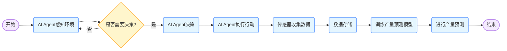

# AI Agent在智能农业产量预测中的实践

> 关键词：AI Agent、智能农业、产量预测、机器学习、传感器技术

> 摘要：本文围绕AI Agent在智能农业产量预测中的实践展开深入探讨。首先介绍了智能农业产量预测的背景，包括其目的、预期读者和文档结构等。详细阐述了AI Agent、智能农业和产量预测等核心概念及其联系，给出了相应的原理和架构示意图。深入分析了用于产量预测的核心算法原理，并使用Python代码进行了详细说明。同时介绍了相关的数学模型和公式，并举例说明。通过项目实战部分，展示了开发环境搭建、源代码实现及解读。还探讨了AI Agent在智能农业产量预测中的实际应用场景，推荐了相关的学习资源、开发工具框架和论文著作。最后总结了未来发展趋势与挑战，并对常见问题进行了解答，提供了扩展阅读和参考资料。

## 1. 背景介绍 
### 1.1 目的和范围
在当今时代，农业面临着诸多挑战，如人口增长带来的粮食需求增加、气候变化对农作物生长的影响等。准确的农业产量预测对于保障粮食安全、合理安排农业生产计划以及优化农产品市场供应至关重要。本文章的目的在于探讨如何利用AI Agent技术实现智能农业中的产量预测，详细阐述其原理、算法、实际应用和开发实践等方面的内容。范围涵盖了从核心概念的介绍到实际项目的落地，以及相关工具和资源的推荐，旨在为读者提供一个全面的关于AI Agent在智能农业产量预测中的知识体系。

### 1.2 预期读者
本文预期读者包括从事农业信息化、人工智能、机器学习等领域的科研人员和工程师，他们可以从文章中获取关于AI Agent在农业产量预测中的最新技术和实践经验；农业生产企业的管理者和技术人员，有助于他们了解如何利用先进技术提升农业生产效率和产量预测的准确性；对智能农业和AI技术感兴趣的学生和爱好者，能为他们提供一个深入学习的途径和知识框架。

### 1.3 文档结构概述
本文将按照以下结构进行组织。首先介绍背景信息，让读者了解文章的目的、预期读者和整体结构。接着阐述核心概念，包括AI Agent、智能农业和产量预测等，以及它们之间的联系，并给出相应的示意图。然后详细讲解用于产量预测的核心算法原理，并用Python代码进行实现。之后介绍相关的数学模型和公式，并举例说明其应用。通过项目实战部分，展示如何搭建开发环境、实现源代码以及对代码进行解读。还会探讨AI Agent在智能农业产量预测中的实际应用场景，推荐相关的学习资源、开发工具框架和论文著作。最后总结未来发展趋势与挑战，解答常见问题，并提供扩展阅读和参考资料。

### 1.4 术语表
#### 1.4.1 核心术语定义
- **AI Agent（人工智能代理）**：是一种能够感知环境、自主决策并采取行动以实现特定目标的软件实体。它可以根据环境的变化自动调整自己的行为，具有一定的智能和自主性。
- **智能农业**：是将物联网、大数据、人工智能等现代信息技术与农业生产、经营、管理和服务全面融合的新型农业发展模式。通过智能化设备和系统，实现农业生产的精准化、高效化和可持续发展。
- **产量预测**：是指利用各种数据和技术手段，对农作物在未来某个时期的产量进行预估和判断。它可以帮助农业生产者提前做好生产计划和决策，优化资源配置。

#### 1.4.2 相关概念解释
- **传感器技术**：是智能农业中获取环境数据的重要手段，通过各种传感器可以实时监测土壤湿度、温度、光照强度、气象条件等信息，为产量预测提供基础数据。
- **机器学习**：是AI Agent实现智能决策的核心技术之一，通过对大量历史数据的学习和分析，建立预测模型，从而对未来的产量进行预测。

#### 1.4.3 缩略词列表
- **AI**：Artificial Intelligence，人工智能
- **IoT**：Internet of Things，物联网
- **ML**：Machine Learning，机器学习

## 2. 核心概念与联系 

### 核心概念原理
#### AI Agent原理
AI Agent通常由感知模块、决策模块和执行模块组成。感知模块负责收集环境信息，如通过传感器获取土壤湿度、温度等数据；决策模块根据感知到的信息和预设的目标，运用机器学习算法或规则进行决策；执行模块根据决策结果采取相应的行动，如控制灌溉系统、施肥设备等。

#### 智能农业原理
智能农业通过物联网技术将各种农业设备和传感器连接起来，实现数据的实时采集和传输。这些数据经过处理和分析后，为农业生产提供决策支持，如精准灌溉、施肥、病虫害防治等，从而提高农业生产的效率和质量。

#### 产量预测原理
产量预测基于对农作物生长过程中各种影响因素的分析，如土壤条件、气象因素、种植品种等。通过收集大量的历史数据，并运用机器学习或统计分析方法建立预测模型，对未来的产量进行预估。

### 架构的文本示意图
```plaintext
                +-----------------+
                |    AI Agent     |
                |-----------------|
                | 感知模块  | 决策模块 | 执行模块 |
                +-----------------+
                      |             |
                      v             v
+---------------------+     +---------------------+
|      传感器网络     |     |    农业生产设备     |
|---------------------|     |---------------------|
| 土壤湿度传感器      |     | 灌溉系统            |
| 温度传感器          |     | 施肥设备            |
| 光照强度传感器      |     | 病虫害防治设备      |
| 气象传感器          |     |...                 |
+---------------------+     +---------------------+
                      |
                      v
+---------------------+
|      数据存储       |
|---------------------|
| 历史产量数据        |
| 环境数据            |
| 种植信息            |
|...                 |
+---------------------+
                      |
                      v
+---------------------+
|    产量预测模型     |
|---------------------|
| 机器学习模型        |
| 统计分析模型        |
|...                 |
+---------------------+
```

### Mermaid流程图


## 3. 核心算法原理 & 具体操作步骤 

### 核心算法原理
在智能农业产量预测中，常用的机器学习算法包括线性回归、决策树和神经网络等。下面以线性回归为例进行详细讲解。

线性回归是一种用于建立自变量和因变量之间线性关系的统计方法。假设我们有 $n$ 个样本，每个样本有 $m$ 个特征 $x_{i1}, x_{i2},..., x_{im}$ 和一个对应的产量值 $y_i$，线性回归模型可以表示为：

$y_i = \beta_0 + \beta_1x_{i1} + \beta_2x_{i2} +... + \beta_mx_{im} + \epsilon_i$

其中，$\beta_0, \beta_1,..., \beta_m$ 是模型的参数，$\epsilon_i$ 是误差项。我们的目标是找到一组最优的参数 $\beta$，使得预测值 $\hat{y}_i$ 与实际值 $y_i$ 之间的误差最小。通常使用最小二乘法来估计参数 $\beta$，即最小化以下损失函数：

$L(\beta) = \sum_{i=1}^{n}(y_i - \hat{y}_i)^2 = \sum_{i=1}^{n}(y_i - (\beta_0 + \beta_1x_{i1} + \beta_2x_{i2} +... + \beta_mx_{im}))^2$

### 具体操作步骤
1. **数据收集**：收集与农作物产量相关的各种数据，如土壤湿度、温度、光照强度、历史产量等。
2. **数据预处理**：对收集到的数据进行清洗、归一化等处理，以提高模型的训练效果。
3. **模型训练**：使用训练数据对线性回归模型进行训练，估计模型的参数 $\beta$。
4. **模型评估**：使用测试数据对训练好的模型进行评估，计算模型的误差指标，如均方误差（MSE）、均方根误差（RMSE）等。
5. **产量预测**：使用训练好的模型对未来的产量进行预测。

### Python源代码实现
```python
import numpy as np
from sklearn.linear_model import LinearRegression
from sklearn.model_selection import train_test_split
from sklearn.metrics import mean_squared_error

# 生成示例数据
np.random.seed(0)
X = np.random.rand(100, 3)  # 100个样本，每个样本有3个特征
y = 2 * X[:, 0] + 3 * X[:, 1] - 1 * X[:, 2] + np.random.randn(100) * 0.1  # 真实产量值

# 划分训练集和测试集
X_train, X_test, y_train, y_test = train_test_split(X, y, test_size=0.2, random_state=42)

# 创建线性回归模型
model = LinearRegression()

# 训练模型
model.fit(X_train, y_train)

# 进行预测
y_pred = model.predict(X_test)

# 计算均方误差
mse = mean_squared_error(y_test, y_pred)
print(f"均方误差: {mse}")

# 输出模型参数
print(f"截距: {model.intercept_}")
print(f"系数: {model.coef_}")
```

## 4. 数学模型和公式 & 详细讲解 & 举例说明 

### 线性回归数学模型
线性回归的数学模型可以用矩阵形式表示为：

$Y = X\beta + \epsilon$

其中，$Y$ 是 $n$ 维的产量向量，$X$ 是 $n \times (m + 1)$ 的特征矩阵（第一列全为 1，对应截距项），$\beta$ 是 $(m + 1)$ 维的参数向量，$\epsilon$ 是 $n$ 维的误差向量。

最小二乘法估计的参数 $\hat{\beta}$ 可以通过以下公式计算：

$\hat{\beta} = (X^TX)^{-1}X^TY$

### 详细讲解
- **$X^TX$**：是特征矩阵 $X$ 的转置与 $X$ 的乘积，它是一个 $(m + 1) \times (m + 1)$ 的矩阵。
- **$(X^TX)^{-1}$**：是 $X^TX$ 的逆矩阵，只有当 $X^TX$ 可逆时才能计算。
- **$X^TY$**：是特征矩阵 $X$ 的转置与产量向量 $Y$ 的乘积，它是一个 $(m + 1)$ 维的向量。

### 举例说明
假设我们有 3 个样本，每个样本有 2 个特征 $x_1$ 和 $x_2$，对应的产量值为 $y$，数据如下：

| $x_1$ | $x_2$ | $y$ |
|-------|-------|-----|
| 1     | 2     | 5   |
| 2     | 3     | 7   |
| 3     | 4     | 9   |

首先构建特征矩阵 $X$ 和产量向量 $Y$：

$X = \begin{bmatrix} 1 & 1 & 2 \\ 1 & 2 & 3 \\ 1 & 3 & 4 \end{bmatrix}$

$Y = \begin{bmatrix} 5 \\ 7 \\ 9 \end{bmatrix}$

计算 $X^TX$：

$X^TX = \begin{bmatrix} 1 & 1 & 1 \\ 1 & 2 & 3 \\ 2 & 3 & 4 \end{bmatrix} \begin{bmatrix} 1 & 1 & 2 \\ 1 & 2 & 3 \\ 1 & 3 & 4 \end{bmatrix} = \begin{bmatrix} 3 & 6 & 9 \\ 6 & 14 & 20 \\ 9 & 20 & 29 \end{bmatrix}$

计算 $(X^TX)^{-1}$：

$(X^TX)^{-1} = \begin{bmatrix} 4.6667 & -3. & 0.3333 \\ -3. & 2. & -0. \\ 0.3333 & -0. & 0.3333 \end{bmatrix}$

计算 $X^TY$：

$X^TY = \begin{bmatrix} 1 & 1 & 1 \\ 1 & 2 & 3 \\ 2 & 3 & 4 \end{bmatrix} \begin{bmatrix} 5 \\ 7 \\ 9 \end{bmatrix} = \begin{bmatrix} 21 \\ 46 \\ 65 \end{bmatrix}$

最后计算 $\hat{\beta}$：

$\hat{\beta} = (X^TX)^{-1}X^TY = \begin{bmatrix} 4.6667 & -3. & 0.3333 \\ -3. & 2. & -0. \\ 0.3333 & -0. & 0.3333 \end{bmatrix} \begin{bmatrix} 21 \\ 46 \\ 65 \end{bmatrix} = \begin{bmatrix} 1 \\ 2 \\ 0 \end{bmatrix}$

即截距 $\beta_0 = 1$，系数 $\beta_1 = 2$，$\beta_2 = 0$。

## 5. 项目实战：代码实际案例和详细解释说明 

### 5.1  开发环境搭建
#### 操作系统
可以选择Windows、Linux或macOS等主流操作系统。这里以Ubuntu 20.04为例进行说明。

#### Python环境
安装Python 3.7及以上版本，可以使用以下命令进行安装：
```bash
sudo apt update
sudo apt install python3 python3-pip
```

#### 依赖库安装
安装项目所需的依赖库，包括NumPy、Pandas、Scikit-learn等：
```bash
pip3 install numpy pandas scikit-learn
```

### 5.2  源代码详细实现和代码解读
```python
import numpy as np
import pandas as pd
from sklearn.model_selection import train_test_split
from sklearn.linear_model import LinearRegression
from sklearn.metrics import mean_squared_error

# 读取数据
data = pd.read_csv('agriculture_data.csv')

# 提取特征和目标变量
X = data.drop('yield', axis=1).values
y = data['yield'].values

# 划分训练集和测试集
X_train, X_test, y_train, y_test = train_test_split(X, y, test_size=0.2, random_state=42)

# 创建线性回归模型
model = LinearRegression()

# 训练模型
model.fit(X_train, y_train)

# 进行预测
y_pred = model.predict(X_test)

# 计算均方误差
mse = mean_squared_error(y_test, y_pred)
print(f"均方误差: {mse}")

# 输出模型参数
print(f"截距: {model.intercept_}")
print(f"系数: {model.coef_}")
```

### 代码解读与分析
1. **数据读取**：使用Pandas库的 `read_csv` 函数读取存储在 `agriculture_data.csv` 文件中的农业数据。
2. **特征和目标变量提取**：使用 `drop` 方法从数据中提取除产量列（`yield`）以外的所有列作为特征变量 $X$，将产量列作为目标变量 $y$。
3. **数据集划分**：使用 `train_test_split` 函数将数据集划分为训练集和测试集，测试集占比为 20%。
4. **模型创建和训练**：创建线性回归模型，并使用训练集数据对模型进行训练。
5. **预测和评估**：使用训练好的模型对测试集数据进行预测，并计算预测结果的均方误差。
6. **模型参数输出**：输出模型的截距和系数，以便进一步分析特征对产量的影响。

## 6. 实际应用场景 
### 精准农业生产管理
AI Agent可以根据实时监测的土壤湿度、温度等环境数据，结合产量预测模型，为农业生产者提供精准的灌溉、施肥建议。例如，当预测到某块农田的产量可能受到干旱影响时，AI Agent可以自动控制灌溉系统进行补水，从而提高农作物的产量和质量。

### 农产品市场规划
准确的产量预测可以帮助农产品市场管理者提前做好市场规划，合理安排仓储、运输和销售等环节。例如，如果预测到某种农产品的产量将大幅增加，市场管理者可以提前增加仓储设施，拓展销售渠道，避免农产品滞销。

### 农业保险风险评估
保险公司可以利用AI Agent的产量预测结果，对农业保险的风险进行评估。例如，对于产量预测不稳定的地区或农作物品种，可以适当提高保险费率，以降低保险公司的风险。

## 7. 工具和资源推荐
### 7.1 学习资源推荐
#### 7.1.1 书籍推荐
- 《机器学习》（周志华著）：全面介绍了机器学习的基本概念、算法和应用，是学习机器学习的经典教材。
- 《Python机器学习》（Sebastian Raschka著）：结合Python语言，详细讲解了机器学习的各种算法和实践技巧。
- 《智能农业概论》：系统介绍了智能农业的基本概念、技术和应用，为读者了解智能农业提供了全面的知识体系。

#### 7.1.2 在线课程
- Coursera上的“Machine Learning”（Andrew Ng教授授课）：经典的机器学习课程，深入浅出地讲解了机器学习的基本原理和算法。
- edX上的“Artificial Intelligence”：介绍了人工智能的基本概念、技术和应用，帮助读者了解AI Agent的相关知识。
- 中国大学MOOC上的“智能农业技术与应用”：专门针对智能农业领域的课程，介绍了智能农业的关键技术和实际应用案例。

#### 7.1.3 技术博客和网站
- Medium：有许多关于人工智能、机器学习和智能农业的优质博客文章，作者来自世界各地的专业人士。
- Towards Data Science：专注于数据科学和机器学习领域，提供了大量的技术文章和实践案例。
- 中国农业信息化网：专门介绍农业信息化和智能农业的网站，提供了最新的行业动态和技术资讯。

### 7.2 开发工具框架推荐
#### 7.2.1 IDE和编辑器
- PyCharm：功能强大的Python集成开发环境，提供了代码编辑、调试、版本控制等一系列功能，适合专业的Python开发者。
- Jupyter Notebook：交互式的开发环境，支持Python、R等多种编程语言，方便进行数据探索和模型实验。
- Visual Studio Code：轻量级的代码编辑器，支持多种编程语言和插件扩展，具有良好的用户体验。

#### 7.2.2 调试和性能分析工具
- PDB：Python自带的调试器，可以帮助开发者逐行调试代码，查找和解决问题。
- cProfile：Python的性能分析工具，可以分析代码的运行时间和资源消耗情况，帮助开发者优化代码性能。
- TensorBoard：用于可视化深度学习模型的训练过程和性能指标，方便开发者监控和调试模型。

#### 7.2.3 相关框架和库
- Scikit-learn：Python中常用的机器学习库，提供了丰富的机器学习算法和工具，如线性回归、决策树、支持向量机等。
- TensorFlow：Google开发的深度学习框架，广泛应用于图像识别、自然语言处理等领域，也可以用于农业产量预测模型的开发。
- PyTorch：Facebook开发的深度学习框架，具有简洁易用的特点，适合初学者和研究者使用。

### 7.3 相关论文著作推荐
#### 7.3.1 经典论文
- “The Elements of Statistical Learning”：全面介绍了统计学习的基本理论和方法，是机器学习领域的经典著作。
- “Artificial Intelligence: A Modern Approach”：系统介绍了人工智能的基本概念、技术和应用，是人工智能领域的权威教材。
- “Precision Agriculture: A Worldwide Overview”：对精准农业的发展现状和趋势进行了全面的综述，为智能农业的研究和实践提供了重要的参考。

#### 7.3.2 最新研究成果
- 可以通过IEEE Xplore、ACM Digital Library等学术数据库搜索关于AI Agent在智能农业产量预测方面的最新研究论文，了解该领域的前沿技术和研究动态。

#### 7.3.3 应用案例分析
- 一些农业科研机构和企业会发布关于智能农业应用案例的报告和论文，可以通过查阅这些资料，了解AI Agent在实际农业生产中的应用效果和经验教训。

## 8. 总结：未来发展趋势与挑战
### 未来发展趋势
- **多模态数据融合**：未来的AI Agent将不仅依赖于传统的传感器数据，还会融合图像、视频、气象卫星数据等多模态数据，以提高产量预测的准确性和可靠性。
- **深度学习的广泛应用**：深度学习在图像识别、自然语言处理等领域取得了巨大成功，未来将在智能农业产量预测中得到更广泛的应用，如利用卷积神经网络对农作物图像进行分析，预测病虫害发生情况，进而影响产量预测。
- **智能化决策与自动化控制**：AI Agent将具备更强大的决策能力，能够根据产量预测结果自动调整农业生产设备的运行参数，实现农业生产的自动化和智能化。
- **区块链技术的结合**：区块链技术可以保证农业数据的安全性和不可篡改，与AI Agent结合可以提高数据的可信度，为产量预测提供更可靠的基础。

### 挑战
- **数据质量和隐私问题**：智能农业中收集的数据质量参差不齐，存在噪声和缺失值等问题，需要进行有效的数据清洗和预处理。同时，农业数据涉及到农民的隐私和商业机密，如何保护数据的隐私和安全是一个重要的挑战。
- **算法复杂度和可解释性**：随着深度学习等复杂算法的应用，模型的复杂度不断增加，导致模型的可解释性变差。在农业生产中，农民和农业管理者需要了解模型的决策依据，因此提高算法的可解释性是一个亟待解决的问题。
- **技术成本和推广难度**：智能农业技术的研发和应用需要大量的资金和技术支持，对于一些小型农业企业和农民来说，技术成本较高，推广难度较大。如何降低技术成本，提高技术的普及程度是未来发展的关键。

## 9. 附录：常见问题与解答
### 问题1：AI Agent在智能农业产量预测中的准确性如何保证？
解答：可以通过以下几个方面保证准确性。一是收集高质量的数据，包括使用高精度的传感器、对数据进行清洗和预处理等；二是选择合适的算法和模型，根据数据特点和问题需求选择最适合的机器学习或深度学习算法；三是进行模型评估和优化，使用交叉验证等方法评估模型的性能，并不断调整模型参数以提高准确性。

### 问题2：AI Agent能否适应不同的农业环境和作物品种？
解答：AI Agent可以通过调整模型参数和训练数据来适应不同的农业环境和作物品种。在实际应用中，需要针对不同的环境和作物收集相应的历史数据，并对模型进行重新训练和优化，以确保模型在不同情况下都能取得较好的预测效果。

### 问题3：使用AI Agent进行产量预测是否需要专业的技术人员？
解答：虽然AI Agent涉及到一些复杂的技术和算法，但现在有许多开源的工具和库可以使用，降低了技术门槛。对于一些简单的产量预测任务，农民和农业管理者可以通过学习和使用这些工具来实现。同时，也可以寻求专业技术人员的帮助，进行模型的开发和优化。

## 10. 扩展阅读 & 参考资料
### 扩展阅读
- 《大数据时代的农业革命》：介绍了大数据技术在农业领域的应用和发展趋势，与AI Agent在智能农业中的应用有一定的关联。
- 《人工智能与农业现代化》：探讨了人工智能技术如何推动农业现代化的发展，为进一步了解AI Agent在农业中的应用提供了更广阔的视角。

### 参考资料
- 相关的学术论文和研究报告，如在IEEE、ACM等学术会议和期刊上发表的关于智能农业和AI Agent的论文。
- 农业行业的标准和规范，如农业数据采集、处理和分析的相关标准。
- 开源项目的文档和代码，如Scikit-learn、TensorFlow等开源库的官方文档。

作者：AI天才研究院/AI Genius Institute & 禅与计算机程序设计艺术 /Zen And The Art of Computer Programming