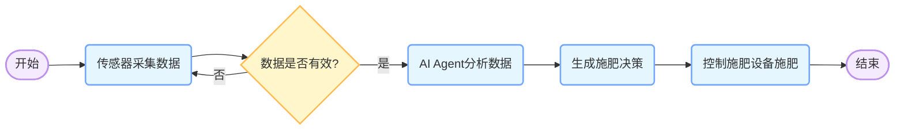

# AI Agent在智能农业精准施肥中的实践

> 关键词：AI Agent、智能农业、精准施肥、机器学习、传感器技术

> 摘要：本文深入探讨了AI Agent在智能农业精准施肥中的实践应用。首先介绍了相关背景，包括目的、预期读者、文档结构和术语表。接着阐述了核心概念及联系，展示了其原理和架构的示意图与流程图。详细讲解了核心算法原理和具体操作步骤，并给出Python源代码示例。通过数学模型和公式进一步分析，辅以实际案例说明。进行项目实战，涵盖开发环境搭建、源代码实现与解读。探讨了实际应用场景，推荐了学习资源、开发工具框架和相关论文著作。最后总结未来发展趋势与挑战，提供常见问题解答和扩展阅读参考资料，旨在为智能农业精准施肥领域的研究和实践提供全面的技术指导。

## 1. 背景介绍 
### 1.1 目的和范围
随着全球人口的持续增长，对粮食的需求也日益增加。传统农业施肥方式往往存在盲目性，不仅造成肥料的浪费，还可能对环境造成污染。智能农业精准施肥旨在根据土壤状况、作物需求等因素，精确地提供适量的肥料，以提高农作物产量和质量，减少对环境的负面影响。

本文的目的是探讨AI Agent在智能农业精准施肥中的应用，详细介绍其原理、算法、实际操作步骤以及相关的技术细节。范围涵盖从核心概念的解释到实际项目的开发与应用，同时提供学习资源和工具推荐，帮助读者全面了解和掌握这一领域的知识和技能。

### 1.2 预期读者
本文预期读者包括农业科技领域的研究人员、智能农业系统的开发者、农业从业者以及对人工智能在农业领域应用感兴趣的技术爱好者。对于研究人员，本文可以为其提供新的研究思路和方法；对于开发者，有助于他们开发出更高效、智能的精准施肥系统；对于农业从业者，能够帮助他们理解和应用先进的技术来提高农业生产效益；对于技术爱好者，则可以拓宽他们的知识面和视野。

### 1.3 文档结构概述
本文共分为十个部分。第一部分为背景介绍，包括目的、预期读者、文档结构和术语表。第二部分阐述核心概念与联系，展示相关原理和架构的示意图与流程图。第三部分详细讲解核心算法原理和具体操作步骤，并给出Python源代码示例。第四部分介绍数学模型和公式，并通过实际案例进行说明。第五部分进行项目实战，包括开发环境搭建、源代码实现与解读。第六部分探讨实际应用场景。第七部分推荐学习资源、开发工具框架和相关论文著作。第八部分总结未来发展趋势与挑战。第九部分为附录，提供常见问题解答。第十部分列出扩展阅读和参考资料。

### 1.4 术语表
#### 1.4.1 核心术语定义
- **AI Agent**：即人工智能代理，是一种能够感知环境、做出决策并采取行动以实现特定目标的智能实体。在智能农业精准施肥中，AI Agent可以根据土壤和作物信息，自动调整施肥策略。
- **智能农业**：利用现代信息技术，如物联网、大数据、人工智能等，实现农业生产的智能化管理和决策，提高农业生产效率和质量。
- **精准施肥**：根据土壤肥力状况、作物生长需求等因素，精确地确定肥料的种类、用量和施肥时间，以达到最佳的施肥效果。
- **传感器技术**：用于实时监测土壤湿度、养分含量、温度等环境参数的技术，为精准施肥提供数据支持。

#### 1.4.2 相关概念解释
- **机器学习**：是人工智能的一个重要分支，通过让计算机从数据中学习模式和规律，从而实现预测和决策。在精准施肥中，机器学习算法可以根据历史数据和实时监测数据，预测作物的肥料需求。
- **物联网（IoT）**：将各种设备通过网络连接起来，实现数据的传输和共享。在智能农业中，物联网技术可以将传感器、施肥设备等连接起来，实现数据的实时采集和远程控制。

#### 1.4.3 缩略词列表
- **AI**：Artificial Intelligence，人工智能
- **IoT**：Internet of Things，物联网
- **ML**：Machine Learning，机器学习

## 2. 核心概念与联系 
### 核心概念原理
AI Agent在智能农业精准施肥中的核心原理是基于传感器技术获取土壤和作物的实时信息，利用机器学习算法对这些信息进行分析和处理，从而生成精准的施肥决策。具体来说，AI Agent包括以下几个主要部分：

- **感知模块**：通过各种传感器，如土壤湿度传感器、养分传感器、气象传感器等，实时采集土壤和作物的环境参数。
- **决策模块**：利用机器学习算法，如神经网络、决策树等，对感知模块采集的数据进行分析和处理，生成施肥决策。
- **执行模块**：根据决策模块生成的施肥决策，控制施肥设备进行精准施肥。

### 架构的文本示意图
```plaintext
+---------------------+
|  传感器网络         |
|  (土壤、气象等)     |
+---------------------+
          |
          v
+---------------------+
|  AI Agent           |
|  - 感知模块         |
|  - 决策模块         |
|  - 执行模块         |
+---------------------+
          |
          v
+---------------------+
|  施肥设备           |
|  (施肥机等)         |
+---------------------+
```

### Mermaid流程图


## 3. 核心算法原理 & 具体操作步骤 
### 核心算法原理
在智能农业精准施肥中，常用的机器学习算法有线性回归、决策树和神经网络等。这里以线性回归为例，介绍其核心算法原理。

线性回归是一种用于建立自变量和因变量之间线性关系的统计模型。在精准施肥中，自变量可以是土壤养分含量、作物生长阶段等，因变量可以是肥料的需求量。线性回归模型的一般形式为：

$$y = \theta_0 + \theta_1x_1 + \theta_2x_2 + \cdots + \theta_nx_n$$

其中，$y$ 是因变量，$x_1, x_2, \cdots, x_n$ 是自变量，$\theta_0, \theta_1, \cdots, \theta_n$ 是模型的参数。

线性回归的目标是找到一组最优的参数 $\theta$，使得模型的预测值与实际值之间的误差最小。常用的误差度量方法是均方误差（Mean Squared Error，MSE）：

$$MSE = \frac{1}{m} \sum_{i=1}^{m} (y^{(i)} - \hat{y}^{(i)})^2$$

其中，$m$ 是样本数量，$y^{(i)}$ 是第 $i$ 个样本的实际值，$\hat{y}^{(i)}$ 是第 $i$ 个样本的预测值。

### 具体操作步骤
#### 步骤1：数据收集
使用传感器采集土壤和作物的相关数据，如土壤养分含量、作物生长阶段、气象数据等。

#### 步骤2：数据预处理
对收集到的数据进行清洗、归一化等预处理操作，以提高模型的训练效果。

#### 步骤3：模型训练
使用预处理后的数据对线性回归模型进行训练，找到最优的参数 $\theta$。

#### 步骤4：模型评估
使用测试数据对训练好的模型进行评估，计算模型的均方误差等指标。

#### 步骤5：施肥决策
根据训练好的模型和实时采集的数据，生成精准的施肥决策。

### Python源代码示例
```python
import numpy as np
from sklearn.linear_model import LinearRegression
from sklearn.model_selection import train_test_split
from sklearn.metrics import mean_squared_error

# 步骤1：数据收集（示例数据）
X = np.array([[1, 2], [2, 3], [3, 4], [4, 5]])  # 自变量，如土壤养分含量和作物生长阶段
y = np.array([5, 7, 9, 11])  # 因变量，如肥料需求量

# 步骤2：数据预处理
# 这里省略数据清洗和归一化操作

# 步骤3：模型训练
X_train, X_test, y_train, y_test = train_test_split(X, y, test_size=0.2, random_state=42)
model = LinearRegression()
model.fit(X_train, y_train)

# 步骤4：模型评估
y_pred = model.predict(X_test)
mse = mean_squared_error(y_test, y_pred)
print(f"均方误差: {mse}")

# 步骤5：施肥决策
new_data = np.array([[5, 6]])  # 新的土壤养分含量和作物生长阶段数据
fertilizer_demand = model.predict(new_data)
print(f"预测的肥料需求量: {fertilizer_demand[0]}")
```

## 4. 数学模型和公式 & 详细讲解 & 举例说明 
### 线性回归模型公式
线性回归模型的一般形式为：

$$y = \theta_0 + \theta_1x_1 + \theta_2x_2 + \cdots + \theta_nx_n$$

其中，$y$ 是因变量，$x_1, x_2, \cdots, x_n$ 是自变量，$\theta_0, \theta_1, \cdots, \theta_n$ 是模型的参数。

### 均方误差公式
均方误差（MSE）用于衡量模型的预测值与实际值之间的误差，公式为：

$$MSE = \frac{1}{m} \sum_{i=1}^{m} (y^{(i)} - \hat{y}^{(i)})^2$$

其中，$m$ 是样本数量，$y^{(i)}$ 是第 $i$ 个样本的实际值，$\hat{y}^{(i)}$ 是第 $i$ 个样本的预测值。

### 详细讲解
线性回归模型的目标是找到一组最优的参数 $\theta$，使得均方误差最小。可以使用最小二乘法来求解最优参数。最小二乘法的原理是通过对均方误差求偏导数，并令偏导数等于零，得到一组方程组，解这个方程组即可得到最优参数。

### 举例说明
假设有以下数据：

| 土壤养分含量 $x_1$ | 作物生长阶段 $x_2$ | 肥料需求量 $y$ |
|-------------------|-------------------|----------------|
| 1                 | 2                 | 5              |
| 2                 | 3                 | 7              |
| 3                 | 4                 | 9              |
| 4                 | 5                 | 11             |

我们可以使用线性回归模型来预测肥料需求量。设线性回归模型为：

$$y = \theta_0 + \theta_1x_1 + \theta_2x_2$$

根据最小二乘法，可以得到最优参数 $\theta_0 = 1$，$\theta_1 = 2$，$\theta_2 = 1$。因此，线性回归模型为：

$$y = 1 + 2x_1 + x_2$$

当土壤养分含量为 5，作物生长阶段为 6 时，预测的肥料需求量为：

$$y = 1 + 2\times5 + 6 = 17$$

## 5. 项目实战：代码实际案例和详细解释说明 
### 5.1  开发环境搭建
#### 操作系统
推荐使用 Linux 系统，如 Ubuntu 18.04 或更高版本。

#### 编程语言
使用 Python 3.7 或更高版本。

#### 开发工具
推荐使用 Anaconda 作为 Python 环境管理工具，使用 PyCharm 作为集成开发环境（IDE）。

#### 相关库和框架
- `numpy`：用于数值计算。
- `pandas`：用于数据处理和分析。
- `scikit-learn`：用于机器学习算法的实现。
- `matplotlib`：用于数据可视化。

可以使用以下命令安装这些库：

```sh
pip install numpy pandas scikit-learn matplotlib
```

### 5.2  源代码详细实现和代码解读
```python
import numpy as np
import pandas as pd
from sklearn.linear_model import LinearRegression
from sklearn.model_selection import train_test_split
from sklearn.metrics import mean_squared_error
import matplotlib.pyplot as plt

# 步骤1：数据收集
# 假设我们有一个 CSV 文件，包含土壤养分含量、作物生长阶段和肥料需求量
data = pd.read_csv('fertilizer_data.csv')
X = data[['soil_nutrient', 'crop_growth_stage']].values
y = data['fertilizer_demand'].values

# 步骤2：数据预处理
# 数据清洗：检查是否有缺失值
if data.isnull().any().any():
    data = data.dropna()
    X = data[['soil_nutrient', 'crop_growth_stage']].values
    y = data['fertilizer_demand'].values

# 数据归一化
from sklearn.preprocessing import StandardScaler
scaler = StandardScaler()
X = scaler.fit_transform(X)

# 步骤3：模型训练
X_train, X_test, y_train, y_test = train_test_split(X, y, test_size=0.2, random_state=42)
model = LinearRegression()
model.fit(X_train, y_train)

# 步骤4：模型评估
y_pred = model.predict(X_test)
mse = mean_squared_error(y_test, y_pred)
print(f"均方误差: {mse}")

# 步骤5：施肥决策
new_data = np.array([[5, 6]])
new_data = scaler.transform(new_data)
fertilizer_demand = model.predict(new_data)
print(f"预测的肥料需求量: {fertilizer_demand[0]}")

# 数据可视化
plt.scatter(X_test[:, 0], y_test, color='blue', label='实际值')
plt.plot(X_test[:, 0], y_pred, color='red', linewidth=2, label='预测值')
plt.xlabel('土壤养分含量')
plt.ylabel('肥料需求量')
plt.title('线性回归模型预测结果')
plt.legend()
plt.show()
```

### 5.3  代码解读与分析
#### 数据收集
使用 `pandas` 库读取 CSV 文件中的数据，并将自变量和因变量分别存储在 `X` 和 `y` 中。

#### 数据预处理
- **数据清洗**：检查数据中是否有缺失值，如果有则删除包含缺失值的行。
- **数据归一化**：使用 `StandardScaler` 对自变量进行归一化处理，以提高模型的训练效果。

#### 模型训练
使用 `train_test_split` 函数将数据集分为训练集和测试集，然后使用 `LinearRegression` 模型对训练集进行训练。

#### 模型评估
使用 `mean_squared_error` 函数计算模型在测试集上的均方误差，评估模型的性能。

#### 施肥决策
使用训练好的模型对新的数据进行预测，得到预测的肥料需求量。

#### 数据可视化
使用 `matplotlib` 库绘制实际值和预测值的散点图和折线图，直观地展示模型的预测效果。

## 6. 实际应用场景 
### 大规模农场
在大规模农场中，AI Agent可以通过物联网技术连接大量的传感器和施肥设备，实时监测土壤和作物的信息，并根据这些信息自动调整施肥策略。这样可以提高施肥的精准度和效率，减少人工成本。

### 温室种植
在温室种植中，环境条件可以得到精确控制。AI Agent可以根据温室的温度、湿度、光照等环境参数，结合土壤和作物的信息，为作物提供精准的施肥方案，提高作物的产量和质量。

### 精准农业试验田
在精准农业试验田中，AI Agent可以用于研究不同土壤条件、作物品种和施肥方案对作物生长的影响。通过对试验数据的分析和处理，为农业科研人员提供科学依据，推动精准农业技术的发展。

## 7. 工具和资源推荐
### 7.1 学习资源推荐
#### 7.1.1 书籍推荐
- 《Python机器学习》：详细介绍了Python在机器学习领域的应用，包括线性回归、决策树、神经网络等算法的实现。
- 《智能农业：原理与应用》：全面介绍了智能农业的相关技术和应用，包括传感器技术、物联网、人工智能等在农业中的应用。
- 《机器学习实战》：通过实际案例介绍了机器学习的基本算法和应用，适合初学者入门。

#### 7.1.2 在线课程
- Coursera上的《机器学习》课程：由斯坦福大学教授Andrew Ng主讲，是机器学习领域的经典课程。
- edX上的《人工智能基础》课程：介绍了人工智能的基本概念和算法，包括机器学习、深度学习等。
- 中国大学MOOC上的《智能农业技术》课程：介绍了智能农业的相关技术和应用，包括传感器技术、物联网、人工智能等在农业中的应用。

#### 7.1.3 技术博客和网站
- 机器之心：提供人工智能领域的最新技术和研究成果，包括机器学习、深度学习、自然语言处理等。
- 开源中国：提供开源软件的资讯和技术文章，包括Python、机器学习、物联网等领域。
- 农业农村部官网：提供农业政策、技术、市场等方面的信息，是了解农业领域最新动态的重要渠道。

### 7.2 开发工具框架推荐
#### 7.2.1 IDE和编辑器
- PyCharm：是一款专门为Python开发设计的集成开发环境，具有代码编辑、调试、自动完成等功能。
- Jupyter Notebook：是一款基于网页的交互式开发环境，适合进行数据探索和模型实验。
- Visual Studio Code：是一款轻量级的代码编辑器，支持多种编程语言，具有丰富的插件和扩展功能。

#### 7.2.2 调试和性能分析工具
- Py-Spy：是一款Python性能分析工具，可以实时监测Python程序的性能瓶颈。
- cProfile：是Python标准库中的性能分析工具，可以统计函数的调用次数和执行时间。
- PDB：是Python标准库中的调试工具，可以在程序运行过程中设置断点，进行单步调试。

#### 7.2.3 相关框架和库
- TensorFlow：是一款开源的深度学习框架，支持多种深度学习模型的开发和训练。
- PyTorch：是一款开源的深度学习框架，具有动态图机制，适合进行深度学习研究和开发。
- Scikit-learn：是一款开源的机器学习库，提供了丰富的机器学习算法和工具，如线性回归、决策树、神经网络等。

### 7.3 相关论文著作推荐
#### 7.3.1 经典论文
- 《Gradient-Based Learning Applied to Document Recognition》：介绍了卷积神经网络在图像识别领域的应用，是深度学习领域的经典论文。
- 《A Decision-Theoretic Generalization of On-Line Learning and an Application to Boosting》：介绍了提升算法的基本原理和应用，是机器学习领域的经典论文。
- 《Machine Learning in Agriculture: A Review》：对机器学习在农业领域的应用进行了全面的综述，包括作物病虫害预测、土壤肥力评估、精准施肥等方面。

#### 7.3.2 最新研究成果
- 《Deep Learning for Precision Agriculture: A Review》：对深度学习在精准农业领域的应用进行了综述，包括作物识别、病虫害检测、产量预测等方面。
- 《AI-Enabled Smart Farming: A Comprehensive Review》：对人工智能在智能农业领域的应用进行了全面的综述，包括传感器技术、物联网、机器学习、深度学习等方面。
- 《Using Machine Learning to Predict Crop Yield: A Case Study in Precision Agriculture》：通过实际案例介绍了机器学习在精准农业中的应用，包括作物产量预测、施肥决策等方面。

#### 7.3.3 应用案例分析
- 《Precision Agriculture in Practice: Case Studies from Around the World》：通过实际案例介绍了精准农业在不同地区的应用，包括美国、加拿大、澳大利亚等国家。
- 《Smart Farming in Europe: Case Studies and Best Practices》：对欧洲智能农业的发展情况进行了介绍，包括荷兰、德国、法国等国家的智能农业应用案例。
- 《AI in Agriculture: Real-World Applications and Case Studies》：介绍了人工智能在农业领域的实际应用案例，包括作物病虫害预测、土壤肥力评估、精准施肥等方面。

## 8. 总结：未来发展趋势与挑战
### 未来发展趋势
- **多技术融合**：AI Agent将与物联网、大数据、区块链等技术深度融合，实现农业生产的全面智能化。例如，通过区块链技术可以实现农产品的溯源，提高农产品的质量和安全性。
- **模型优化**：不断优化机器学习和深度学习模型，提高模型的预测精度和泛化能力。例如，使用更复杂的神经网络模型，如卷积神经网络（CNN）和循环神经网络（RNN），来处理图像和时序数据。
- **个性化服务**：根据不同农户的需求和实际情况，提供个性化的精准施肥方案。例如，结合农户的种植经验和偏好，为其定制最适合的施肥策略。

### 挑战
- **数据质量**：传感器采集的数据可能存在噪声和误差，影响模型的训练和预测效果。因此，需要加强数据清洗和预处理技术的研究，提高数据质量。
- **模型可解释性**：一些复杂的机器学习和深度学习模型，如神经网络，具有较高的预测精度，但缺乏可解释性。在农业领域，农民需要了解模型的决策依据，以便更好地应用精准施肥技术。因此，需要研究模型可解释性技术，提高模型的可信度和实用性。
- **成本问题**：智能农业精准施肥系统的建设和维护成本较高，包括传感器设备、施肥设备、云计算服务等。对于一些小规模农户来说，可能难以承受。因此，需要降低系统的成本，提高系统的性价比。

## 9. 附录：常见问题与解答
### 问题1：AI Agent在精准施肥中的准确性如何保证？
答：可以通过以下方法保证AI Agent在精准施肥中的准确性：
- 提高传感器的精度和可靠性，减少数据采集误差。
- 对采集到的数据进行清洗和预处理，去除噪声和异常值。
- 使用多种机器学习算法进行模型训练和比较，选择最优的模型。
- 定期对模型进行评估和更新，根据实际情况调整模型参数。

### 问题2：如何选择适合的传感器？
答：选择适合的传感器需要考虑以下因素：
- 测量参数：根据实际需求选择能够测量土壤养分含量、湿度、温度等参数的传感器。
- 精度和可靠性：选择精度高、可靠性好的传感器，以保证数据的准确性。
- 成本：根据预算选择性价比高的传感器。
- 兼容性：选择与其他设备和系统兼容的传感器，以便实现数据的传输和共享。

### 问题3：AI Agent可以应用于所有类型的农作物吗？
答：AI Agent可以应用于大多数类型的农作物，但不同农作物的生长环境和需求可能不同，需要根据具体情况进行调整和优化。例如，对于一些特殊的农作物，可能需要使用专门的传感器和模型来进行精准施肥。

## 10. 扩展阅读 & 参考资料
### 扩展阅读
- 《农业大数据：理论与实践》：介绍了农业大数据的相关理论和技术，包括数据采集、存储、分析和应用等方面。
- 《深度学习与计算机视觉》：介绍了深度学习在计算机视觉领域的应用，包括图像识别、目标检测、语义分割等方面。
- 《智能农业物联网技术》：介绍了智能农业物联网的相关技术和应用，包括传感器技术、通信技术、云计算技术等方面。

### 参考资料
- [Scikit-learn官方文档](https://scikit-learn.org/stable/)
- [TensorFlow官方文档](https://www.tensorflow.org/)
- [PyTorch官方文档](https://pytorch.org/)

作者：AI天才研究院/AI Genius Institute & 禅与计算机程序设计艺术 /Zen And The Art of Computer Programming