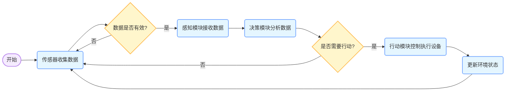

# AI Agent在智能农业规划中的实践

> 关键词：AI Agent、智能农业规划、农业决策、自动化管理、传感器数据

> 摘要：本文聚焦于AI Agent在智能农业规划中的实践应用。首先介绍了相关背景知识，包括目的范围、预期读者等。接着阐述了AI Agent和智能农业规划的核心概念及联系，通过示意图和流程图进行展示。详细讲解了核心算法原理并给出Python代码示例，同时介绍了相关数学模型和公式。通过项目实战展示了代码实现和解读，分析了实际应用场景。最后推荐了学习工具和资源，总结了未来发展趋势与挑战，并提供常见问题解答和扩展阅读参考资料，旨在为智能农业规划领域利用AI Agent提供全面且深入的技术指导。

## 1. 背景介绍 
### 1.1 目的和范围
本文章的目的在于深入探讨AI Agent在智能农业规划中的具体实践应用。随着科技的飞速发展，农业领域也在向智能化、自动化转型。AI Agent作为一种能够自主感知环境、做出决策并执行相应操作的智能实体，为智能农业规划带来了新的思路和方法。我们将研究AI Agent如何收集和分析农业数据，进行精准的农业决策，以及如何实现农业生产过程的自动化管理。范围涵盖了从土壤监测、作物生长预测到灌溉、施肥等各个农业生产环节。

### 1.2 预期读者
本文预期读者主要包括农业科技领域的研究人员、农业生产企业的技术管理人员、对智能农业感兴趣的程序员以及相关专业的学生。对于研究人员，希望能为他们的科研工作提供新的视角和思路；对于技术管理人员，有助于他们在实际生产中应用AI Agent技术提升农业生产效率；对于程序员，可作为学习和开发智能农业应用的参考资料；对于学生，能帮助他们了解智能农业领域的前沿技术。

### 1.3 文档结构概述
本文首先介绍背景知识，让读者对研究内容有一个初步的了解。接着阐述核心概念与联系，使读者掌握AI Agent和智能农业规划的基本原理和架构。然后详细讲解核心算法原理和具体操作步骤，并给出Python代码示例。之后介绍相关数学模型和公式，通过举例说明其应用。再通过项目实战展示代码的实际应用和详细解读。分析实际应用场景，让读者了解AI Agent在智能农业规划中的具体用途。推荐学习工具和资源，方便读者进一步深入学习。最后总结未来发展趋势与挑战，提供常见问题解答和扩展阅读参考资料。

### 1.4 术语表
#### 1.4.1 核心术语定义
- **AI Agent（人工智能代理）**：是一种能够感知环境，根据自身的目标和规则，自主做出决策并执行相应操作的智能实体。在智能农业规划中，AI Agent可以收集土壤湿度、温度、光照等环境数据，分析作物生长需求，从而做出灌溉、施肥等决策。
- **智能农业规划**：指利用现代信息技术，如传感器、物联网、人工智能等，对农业生产过程进行全面、精准的规划和管理，以提高农业生产效率、降低成本、保护环境。
- **传感器数据**：通过各种传感器收集到的关于农业环境的信息，如土壤湿度传感器收集的土壤湿度数据、温度传感器收集的环境温度数据等。

#### 1.4.2 相关概念解释
- **物联网（IoT）**：是指通过各种信息传感器、射频识别技术、全球定位系统等各种装置与技术，实时采集任何需要监控、连接、互动的物体或过程，采集其声、光、热、电、力学、化学、生物、位置等各种需要的信息，通过各类可能的网络接入，实现物与物、物与人的泛在连接，实现对物品和过程的智能化感知、识别和管理。在智能农业中，物联网用于连接各种传感器和执行设备，实现数据的传输和远程控制。
- **机器学习**：是一门多领域交叉学科，涉及概率论、统计学、逼近论、凸分析、算法复杂度理论等多门学科。它专门研究计算机怎样模拟或实现人类的学习行为，以获取新的知识或技能，重新组织已有的知识结构使之不断改善自身的性能。在智能农业规划中，机器学习算法可用于分析传感器数据，预测作物生长情况和病虫害发生概率。

#### 1.4.3 缩略词列表
- **AI**：Artificial Intelligence，人工智能
- **IoT**：Internet of Things，物联网
- **ML**：Machine Learning，机器学习

## 2. 核心概念与联系 
### 核心概念原理
#### AI Agent原理
AI Agent的基本原理是基于感知 - 决策 - 行动的循环。它通过传感器感知环境信息，将这些信息输入到决策模块。决策模块根据预设的目标和规则，利用算法对感知信息进行分析和处理，做出相应的决策。最后，行动模块根据决策结果执行相应的操作，改变环境状态。例如，在智能农业中，AI Agent通过土壤湿度传感器感知土壤湿度信息，决策模块根据作物生长的最佳湿度范围判断是否需要灌溉，若需要则控制灌溉设备进行灌溉。

#### 智能农业规划原理
智能农业规划的核心是利用信息技术对农业生产过程进行全面的管理和优化。首先，通过部署各种传感器收集农业环境数据，如土壤肥力、气象条件等。然后，利用数据分析和模型预测技术，对作物生长情况、病虫害发生概率等进行预测。最后，根据预测结果制定合理的农业生产计划，如种植时间、灌溉量、施肥量等，并通过自动化设备执行这些计划。

### 架构的文本示意图
```plaintext
|---------------------|
|    智能农业环境     |
|---------------------|
|  传感器（土壤、气象）|
|  执行设备（灌溉、施肥）|
|---------------------|
|       AI Agent      |
|---------------------|
|  感知模块（接收传感器数据） |
|  决策模块（分析数据、制定决策） |
|  行动模块（控制执行设备） |
|---------------------|
|   数据分析与模型库   |
|---------------------|
|  机器学习模型（预测作物生长） |
|  农业知识模型（农业规则） |
|---------------------|
```

### Mermaid流程图


## 3. 核心算法原理 & 具体操作步骤 
### 核心算法原理
在智能农业规划中，常用的核心算法之一是基于机器学习的回归算法，用于预测作物的生长情况。以线性回归算法为例，其基本原理是通过找到一条最佳的直线来拟合已知的数据点，从而对未知的数据进行预测。假设我们有一组关于作物生长高度 $y$ 和光照时间 $x$ 的数据，线性回归模型可以表示为：

$y = \theta_0 + \theta_1x$

其中，$\theta_0$ 是截距，$\theta_1$ 是斜率。我们的目标是找到最优的 $\theta_0$ 和 $\theta_1$，使得预测值与实际值之间的误差最小。常用的误差度量方法是均方误差（Mean Squared Error，MSE）：

$MSE = \frac{1}{n}\sum_{i=1}^{n}(y_i - (\theta_0 + \theta_1x_i))^2$

通过最小化均方误差，我们可以得到最优的 $\theta_0$ 和 $\theta_1$。

### 具体操作步骤
#### 步骤1：数据收集
使用传感器收集作物生长相关的数据，如光照时间、温度、土壤湿度、作物生长高度等。

#### 步骤2：数据预处理
对收集到的数据进行清洗，去除噪声和缺失值。然后进行特征选择，选择与作物生长高度相关性较高的特征，如光照时间。

#### 步骤3：模型训练
使用训练数据对线性回归模型进行训练，通过最小化均方误差来确定最优的 $\theta_0$ 和 $\theta_1$。

#### 步骤4：模型评估
使用测试数据对训练好的模型进行评估，计算均方误差等评估指标，判断模型的性能。

#### 步骤5：预测与决策
使用训练好的模型对未来的作物生长高度进行预测，根据预测结果制定相应的农业决策，如调整光照时间、灌溉量等。

### Python源代码详细阐述
```python
import numpy as np
from sklearn.linear_model import LinearRegression
from sklearn.model_selection import train_test_split
from sklearn.metrics import mean_squared_error

# 步骤1：数据收集
# 假设我们有光照时间和作物生长高度的数据
光照时间 = np.array([1, 2, 3, 4, 5, 6, 7, 8, 9, 10]).reshape(-1, 1)
作物生长高度 = np.array([2, 4, 6, 8, 10, 12, 14, 16, 18, 20])

# 步骤2：数据预处理
# 这里数据比较简单，无需复杂的预处理

# 步骤3：模型训练
# 划分训练集和测试集
X_train, X_test, y_train, y_test = train_test_split(光照时间, 作物生长高度, test_size=0.2, random_state=42)

# 创建线性回归模型
model = LinearRegression()

# 训练模型
model.fit(X_train, y_train)

# 步骤4：模型评估
# 预测测试集
y_pred = model.predict(X_test)

# 计算均方误差
mse = mean_squared_error(y_test, y_pred)
print(f"均方误差: {mse}")

# 步骤5：预测与决策
# 预测未来的作物生长高度
未来光照时间 = np.array([11]).reshape(-1, 1)
未来作物生长高度 = model.predict(未来光照时间)
print(f"当光照时间为11小时时，预测作物生长高度为: {未来作物生长高度[0]}")
```

## 4. 数学模型和公式 & 详细讲解 & 举例说明 
### 线性回归模型公式
如前面所述，线性回归模型的基本公式为：

$y = \theta_0 + \theta_1x$

其中，$y$ 是因变量（作物生长高度），$x$ 是自变量（光照时间），$\theta_0$ 是截距，$\theta_1$ 是斜率。

### 均方误差公式
均方误差（MSE）用于衡量预测值与实际值之间的误差，公式为：

$MSE = \frac{1}{n}\sum_{i=1}^{n}(y_i - (\theta_0 + \theta_1x_i))^2$

其中，$n$ 是数据点的数量，$y_i$ 是第 $i$ 个实际值，$(\theta_0 + \theta_1x_i)$ 是第 $i$ 个预测值。

### 详细讲解
线性回归模型的目标是找到最优的 $\theta_0$ 和 $\theta_1$，使得均方误差最小。可以通过最小二乘法来求解最优的 $\theta_0$ 和 $\theta_1$。最小二乘法的原理是通过对均方误差求偏导数，并令偏导数等于0，得到一个方程组，解这个方程组即可得到最优的 $\theta_0$ 和 $\theta_1$。

### 举例说明
假设我们有以下数据：

| 光照时间 $x$ | 作物生长高度 $y$ |
| ---- | ---- |
| 1 | 2 |
| 2 | 4 |
| 3 | 6 |

首先，我们可以计算均方误差：

$MSE = \frac{1}{3}[(2 - (\theta_0 + \theta_1\times1))^2 + (4 - (\theta_0 + \theta_1\times2))^2 + (6 - (\theta_0 + \theta_1\times3))^2]$

通过最小二乘法求解最优的 $\theta_0$ 和 $\theta_1$，可以得到 $\theta_0 = 0$，$\theta_1 = 2$。此时，线性回归模型为 $y = 0 + 2x$，即作物生长高度是光照时间的2倍。

## 5. 项目实战：代码实际案例和详细解释说明 
### 5.1  开发环境搭建
#### 操作系统
可以选择Windows、Linux或macOS操作系统，这里以Ubuntu 20.04为例。

#### 编程语言
使用Python 3.8及以上版本。可以通过以下命令安装Python：

```bash
sudo apt update
sudo apt install python3 python3-pip
```

#### 安装必要的库
使用pip安装所需的库，包括NumPy、Pandas、Scikit-learn等：

```bash
pip install numpy pandas scikit-learn
```

### 5.2  源代码详细实现和代码解读
```python
import numpy as np
import pandas as pd
from sklearn.linear_model import LinearRegression
from sklearn.model_selection import train_test_split
from sklearn.metrics import mean_squared_error

# 步骤1：数据收集
# 假设我们从CSV文件中读取数据
data = pd.read_csv('agriculture_data.csv')

# 提取特征和目标变量
X = data[['光照时间', '温度', '土壤湿度']].values
y = data['作物生长高度'].values

# 步骤2：数据预处理
# 处理缺失值
X = np.nan_to_num(X)
y = np.nan_to_num(y)

# 步骤3：模型训练
# 划分训练集和测试集
X_train, X_test, y_train, y_test = train_test_split(X, y, test_size=0.2, random_state=42)

# 创建线性回归模型
model = LinearRegression()

# 训练模型
model.fit(X_train, y_train)

# 步骤4：模型评估
# 预测测试集
y_pred = model.predict(X_test)

# 计算均方误差
mse = mean_squared_error(y_test, y_pred)
print(f"均方误差: {mse}")

# 步骤5：预测与决策
# 假设我们有新的环境数据
new_data = np.array([[12, 25, 60]])  # 光照时间12小时，温度25摄氏度，土壤湿度60%
predicted_height = model.predict(new_data)
print(f"预测作物生长高度: {predicted_height[0]}")
```

### 代码解读与分析
#### 数据收集
使用Pandas库从CSV文件中读取数据，提取特征（光照时间、温度、土壤湿度）和目标变量（作物生长高度）。

#### 数据预处理
使用 `np.nan_to_num` 函数处理缺失值，将缺失值替换为0。

#### 模型训练
使用 `train_test_split` 函数将数据划分为训练集和测试集，比例为8:2。创建线性回归模型并使用训练集进行训练。

#### 模型评估
使用测试集进行预测，计算均方误差来评估模型的性能。

#### 预测与决策
使用训练好的模型对新的环境数据进行预测，得到预测的作物生长高度。

## 6. 实际应用场景 
### 精准灌溉
AI Agent可以通过土壤湿度传感器实时监测土壤湿度，根据作物的需水情况和气象条件，精确计算灌溉量和灌溉时间。例如，当土壤湿度低于设定的阈值时，AI Agent自动控制灌溉设备进行灌溉，避免过度灌溉或灌溉不足，提高水资源利用效率。

### 智能施肥
利用土壤肥力传感器和作物生长模型，AI Agent可以分析土壤养分含量和作物生长需求，制定合理的施肥方案。根据不同的作物品种、生长阶段和土壤条件，精确控制施肥量和施肥时间，提高肥料利用率，减少环境污染。

### 病虫害预警
通过安装在农田中的图像传感器和气象传感器，AI Agent可以实时监测作物的生长状况和气象条件。利用机器学习算法对图像进行分析，识别病虫害的早期症状，并结合气象数据预测病虫害的发生概率。当预测到病虫害可能发生时，及时发出预警，提醒农民采取相应的防治措施。

### 作物生长预测
AI Agent可以收集作物生长过程中的各种数据，如光照时间、温度、湿度等，利用机器学习模型对作物的生长情况进行预测。预测内容包括作物的生长高度、产量、成熟时间等。根据预测结果，农民可以提前做好收获、销售等准备工作，优化农业生产计划。

## 7. 工具和资源推荐
### 7.1 学习资源推荐
#### 7.1.1 书籍推荐
- 《Python机器学习实战》：详细介绍了Python在机器学习领域的应用，包括各种机器学习算法的原理和实现。
- 《智能农业：技术与应用》：全面介绍了智能农业的相关技术和应用案例，对理解智能农业规划有很大帮助。
- 《人工智能：一种现代的方法》：经典的人工智能教材，涵盖了AI Agent等人工智能核心概念和算法。

#### 7.1.2 在线课程
- Coursera上的“机器学习”课程：由斯坦福大学教授Andrew Ng授课，是学习机器学习的经典课程。
- edX上的“人工智能基础”课程：系统介绍了人工智能的基本概念、算法和应用。
- 中国大学MOOC上的“智能农业概论”课程：结合中国农业实际情况，介绍智能农业的相关知识和技术。

#### 7.1.3 技术博客和网站
- 机器之心：提供人工智能领域的最新技术和研究成果，有很多关于智能农业的相关文章。
- 雷锋网：专注于人工智能、机器人等前沿科技领域的资讯和分析，包含智能农业的应用案例和技术解读。
- 农业农村部官网：提供农业政策、技术推广等方面的信息，对了解农业行业动态有很大帮助。

### 7.2 开发工具框架推荐
#### 7.2.1 IDE和编辑器
- PyCharm：功能强大的Python集成开发环境，提供代码编辑、调试、版本控制等功能，适合开发智能农业相关的Python项目。
- Jupyter Notebook：交互式的开发环境，支持代码、文本、图像等多种形式的展示，方便进行数据探索和模型实验。
- Visual Studio Code：轻量级的代码编辑器，支持多种编程语言和插件扩展，可用于快速开发和调试智能农业应用。

#### 7.2.2 调试和性能分析工具
- PDB：Python自带的调试器，可以在代码中设置断点，逐步执行代码，查看变量值和程序执行流程。
- cProfile：Python的性能分析工具，可以统计代码中各个函数的执行时间和调用次数，帮助优化代码性能。
- TensorBoard：用于可视化深度学习模型的训练过程和性能指标，可用于分析智能农业中深度学习模型的训练效果。

#### 7.2.3 相关框架和库
- Scikit-learn：提供了丰富的机器学习算法和工具，如分类、回归、聚类等，可用于智能农业中的数据建模和分析。
- TensorFlow：开源的深度学习框架，可用于构建和训练复杂的神经网络模型，如卷积神经网络（CNN）用于图像识别，循环神经网络（RNN）用于时间序列预测。
- Pandas：强大的数据处理和分析库，可用于数据清洗、转换、统计分析等，在智能农业数据处理中非常实用。

### 7.3 相关论文著作推荐
#### 7.3.1 经典论文
- “Machine Learning in Agriculture: A Review”：全面回顾了机器学习在农业领域的应用，包括作物产量预测、病虫害识别、土壤质量评估等方面。
- “Intelligent Agricultural Machinery: A Review”：介绍了智能农业机械的发展现状和趋势，包括自动驾驶拖拉机、无人机等。
- “The Role of Artificial Intelligence in Precision Agriculture”：探讨了人工智能在精准农业中的作用和应用场景，如精准灌溉、施肥等。

#### 7.3.2 最新研究成果
- 关注ACM SIGKDD、NeurIPS、ICML等顶级学术会议的论文，这些会议涵盖了人工智能、机器学习等领域的最新研究成果，可能包含智能农业相关的研究。
- 查阅《Computers and Electronics in Agriculture》、《Biosystems Engineering》等农业工程领域的学术期刊，获取智能农业方面的最新研究进展。

#### 7.3.3 应用案例分析
- 可以参考一些农业科技企业的官方网站和报告，了解他们在智能农业规划中的应用案例和实践经验。例如，先正达、孟山都等公司在农业数字化转型方面有很多成功的案例。

## 8. 总结：未来发展趋势与挑战
### 未来发展趋势
#### 多技术融合
AI Agent将与物联网、大数据、云计算、区块链等技术深度融合，实现农业数据的全面采集、高效处理和安全共享。例如，通过物联网技术实现传感器数据的实时传输，利用大数据和云计算进行数据存储和分析，借助区块链技术保证数据的真实性和不可篡改。

#### 智能化决策
随着机器学习和深度学习算法的不断发展，AI Agent将能够做出更加智能化的决策。不仅可以根据当前的环境数据进行决策，还可以考虑历史数据、市场需求等因素，制定更加科学合理的农业生产计划。

#### 自主化作业
农业机器人和无人机等智能设备将与AI Agent相结合，实现农业生产的自主化作业。例如，农业机器人可以自动进行播种、除草、收割等作业，无人机可以进行农田巡查、喷洒农药等操作，提高农业生产效率和质量。

#### 个性化服务
根据不同地区、不同作物、不同农户的需求，AI Agent将提供个性化的农业服务。例如，为特定地区的农户提供适合当地气候和土壤条件的种植方案，为特定作物提供精准的病虫害防治建议。

### 挑战
#### 数据质量和安全
智能农业规划依赖大量的传感器数据，但数据质量可能受到传感器精度、环境干扰等因素的影响。此外，数据安全也是一个重要问题，农业数据包含了农户的隐私和商业机密，需要采取有效的措施保障数据的安全。

#### 算法复杂度和计算资源
一些复杂的机器学习和深度学习算法在处理大规模农业数据时需要大量的计算资源和时间。如何优化算法，降低计算复杂度，提高算法的运行效率，是一个亟待解决的问题。

#### 农民接受度和技术培训
智能农业规划需要农民具备一定的信息技术和人工智能知识。然而，目前很多农民对新技术的接受度较低，缺乏相关的技术培训。如何提高农民的接受度，加强技术培训，是推广智能农业规划的关键。

#### 标准和规范缺失
目前智能农业领域缺乏统一的标准和规范，不同厂家的传感器、设备和系统之间可能存在兼容性问题。建立统一的标准和规范，促进智能农业设备和系统的互联互通，是推动智能农业发展的重要保障。

## 9. 附录：常见问题与解答
### 问题1：AI Agent在智能农业规划中的准确率如何保证？
解答：可以通过以下方法保证AI Agent的准确率。首先，确保传感器数据的准确性，定期对传感器进行校准和维护。其次，选择合适的机器学习算法，并对算法进行优化和调参。可以使用交叉验证等方法评估模型的性能，不断改进模型。此外，结合农业领域的专业知识，对模型的预测结果进行验证和调整。

### 问题2：AI Agent能否适应不同的农业环境？
解答：AI Agent可以通过学习和适应来应对不同的农业环境。在不同的环境中，可以收集当地的农业数据，对模型进行训练和调整。同时，AI Agent可以根据实时的环境数据动态调整决策策略，以适应环境的变化。例如，在干旱地区和湿润地区，AI Agent可以根据当地的水资源情况和作物需水特点，制定不同的灌溉方案。

### 问题3：使用AI Agent进行智能农业规划的成本高吗？
解答：使用AI Agent进行智能农业规划的成本主要包括传感器设备的采购和安装成本、数据传输和存储成本、算法开发和维护成本等。随着技术的不断发展和普及，传感器设备和计算资源的成本逐渐降低。同时，智能农业规划可以提高农业生产效率，降低生产成本，从长期来看，具有较高的投资回报率。

### 问题4：AI Agent与传统农业规划方法相比有哪些优势？
解答：与传统农业规划方法相比，AI Agent具有以下优势。一是数据驱动的决策，能够根据实时的环境数据和历史数据进行精准的决策，提高决策的科学性和准确性。二是自动化管理，能够自动控制灌溉、施肥等设备，减少人工干预，提高生产效率。三是实时监测和预警，能够实时监测作物的生长状况和环境变化，及时发出预警，帮助农民采取相应的措施。

## 10. 扩展阅读 & 参考资料
### 扩展阅读
- 《农业大数据：理论、方法与应用》：深入介绍了农业大数据的相关理论和应用案例，有助于进一步了解智能农业规划中的数据处理和分析。
- 《机器人学导论》：对于了解农业机器人和智能设备在智能农业中的应用有很大帮助。
- 《区块链技术原理与应用》：学习区块链技术在智能农业数据安全和共享方面的应用。

### 参考资料
- [Scikit-learn官方文档](https://scikit-learn.org/stable/documentation.html)
- [TensorFlow官方文档](https://www.tensorflow.org/api_docs)
- [Pandas官方文档](https://pandas.pydata.org/docs/)

作者：AI天才研究院/AI Genius Institute & 禅与计算机程序设计艺术 /Zen And The Art of Computer Programming