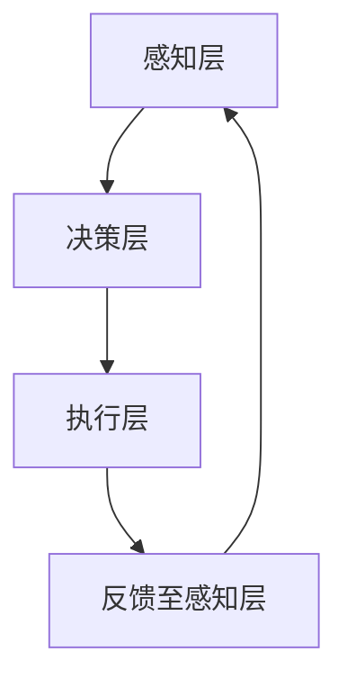

# AI Agent在智能制造中的应用：生产线优化与质量控制

> 关键词：AI Agent、智能制造、生产线优化、质量控制、智能决策

> 摘要：本文深入探讨了AI Agent在智能制造领域的应用，聚焦于生产线优化与质量控制两个关键方面。首先介绍了相关背景知识，包括目的范围、预期读者等内容。接着详细阐述了AI Agent的核心概念及其与智能制造的联系，给出了原理和架构的文本示意图与Mermaid流程图。在核心算法原理部分，使用Python源代码进行了详细讲解。同时，对涉及的数学模型和公式进行了深入剖析并举例说明。通过项目实战，展示了具体的代码实现和解读。还介绍了AI Agent在实际中的应用场景，推荐了相关的学习资源、开发工具框架以及论文著作。最后总结了未来发展趋势与挑战，并给出常见问题与解答以及扩展阅读参考资料，旨在为相关领域的研究者和从业者提供全面且深入的参考。

## 1. 背景介绍 
### 1.1 目的和范围
在当今智能制造快速发展的时代，提高生产线的效率和产品质量是企业追求的核心目标。AI Agent作为一种具有智能决策能力的实体，能够在复杂的生产环境中自主感知、学习和行动，为生产线优化和质量控制提供了新的解决方案。本文的目的在于全面深入地探讨AI Agent在智能制造中生产线优化与质量控制方面的应用，涵盖从理论原理到实际应用的各个环节，包括AI Agent的核心概念、算法原理、数学模型、项目实战以及实际应用场景等内容。

### 1.2 预期读者
本文预期读者包括智能制造领域的研究者、工程师、技术管理人员，以及对AI Agent和智能制造感兴趣的相关专业学生。对于研究者来说，本文可以提供最新的研究思路和方法；对于工程师和技术管理人员，有助于他们将AI Agent技术应用到实际的生产线优化和质量控制工作中；对于学生而言，能够帮助他们系统地了解AI Agent在智能制造中的应用，为后续的学习和研究打下基础。

### 1.3 文档结构概述
本文将按照以下结构进行阐述：首先介绍背景知识，包括目的范围、预期读者等；接着详细讲解AI Agent的核心概念与联系，给出原理和架构的文本示意图与Mermaid流程图；然后深入探讨核心算法原理，并使用Python源代码进行具体操作步骤的说明；之后分析数学模型和公式，通过举例加深理解；再通过项目实战展示代码实现和解读；随后介绍实际应用场景；推荐相关的工具和资源；最后总结未来发展趋势与挑战，给出常见问题与解答以及扩展阅读参考资料。

### 1.4 术语表
#### 1.4.1 核心术语定义
- **AI Agent**：人工智能代理，是一种能够感知环境、进行推理和学习，并根据目标采取行动的智能实体。它可以独立或与其他代理协作完成特定任务。
- **智能制造**：基于新一代信息通信技术与先进制造技术深度融合，贯穿于设计、生产、管理、服务等制造活动的各个环节，具有自感知、自学习、自决策、自执行、自适应等功能的新型生产方式。
- **生产线优化**：通过对生产线的流程、设备、人员等进行调整和改进，提高生产线的效率、降低成本、增加产量等。
- **质量控制**：为了确保产品或服务满足规定的质量要求而采取的一系列活动，包括质量规划、质量保证和质量改进等。

#### 1.4.2 相关概念解释
- **智能决策**：AI Agent根据感知到的环境信息和自身的目标，运用智能算法进行推理和判断，做出最优决策的过程。
- **多Agent系统**：由多个AI Agent组成的系统，这些Agent之间可以进行通信、协作和竞争，共同完成复杂的任务。
- **机器学习**：让计算机通过数据学习模式和规律，从而实现预测、分类等任务的技术。在AI Agent中，机器学习可用于Agent的学习和决策。

#### 1.4.3 缩略词列表
- **AI**：Artificial Intelligence（人工智能）
- **ML**：Machine Learning（机器学习）
- **MAS**：Multi - Agent System（多Agent系统）

## 2. 核心概念与联系 

### 核心概念原理
AI Agent的核心原理基于感知、决策和行动的循环过程。首先，Agent通过传感器等设备感知所处的环境信息，包括生产线的运行状态、设备参数、产品质量数据等。然后，Agent对感知到的信息进行处理和分析，运用智能算法（如机器学习、深度学习等）进行推理和决策，确定最优的行动方案。最后，Agent根据决策结果采取相应的行动，如调整设备参数、发出警报、安排生产任务等。

### 架构的文本示意图
AI Agent在智能制造中的架构可以分为三个主要层次：感知层、决策层和执行层。

感知层：主要负责收集生产环境中的各种数据，包括设备状态传感器、质量检测设备、生产进度监控系统等。这些数据将被传输到决策层进行处理。

决策层：是AI Agent的核心部分，包含智能算法模块、知识库和推理引擎。智能算法模块运用机器学习、深度学习等技术对感知层传来的数据进行分析和学习，知识库存储了生产过程中的各种规则和知识，推理引擎根据数据和知识库进行推理和决策。

执行层：根据决策层的决策结果，对生产线的设备、人员等进行控制和调整，实现生产线的优化和质量控制。

### Mermaid流程图


## 3. 核心算法原理 & 具体操作步骤 

### 核心算法原理
在AI Agent的决策过程中，常用的算法包括强化学习算法。强化学习是一种通过智能体与环境进行交互，不断尝试不同的行动并根据环境给予的奖励来学习最优策略的算法。以Q - learning算法为例，其核心思想是通过不断更新Q值（行动价值）来找到最优的行动策略。

### Python源代码详细阐述
```python
import numpy as np

# 定义环境参数
num_states = 10  # 状态数量
num_actions = 3  # 行动数量
gamma = 0.9  # 折扣因子
alpha = 0.1  # 学习率
epsilon = 0.1  # 探索率

# 初始化Q表
Q = np.zeros((num_states, num_actions))

# 定义环境反馈函数
def get_reward(state, action):
    # 这里简单示例，根据状态和行动返回奖励
    if state == 5 and action == 1:
        return 10
    else:
        return -1

# 定义选择行动的函数
def choose_action(state):
    if np.random.uniform(0, 1) < epsilon:
        # 探索：随机选择行动
        action = np.random.choice(num_actions)
    else:
        # 利用：选择Q值最大的行动
        action = np.argmax(Q[state, :])
    return action

# Q - learning算法主循环
num_episodes = 1000
for episode in range(num_episodes):
    state = np.random.randint(0, num_states)  # 随机初始化状态
    done = False
    while not done:
        action = choose_action(state)
        reward = get_reward(state, action)
        next_state = np.random.randint(0, num_states)  # 简单示例，随机生成下一个状态
        # 更新Q值
        Q[state, action] = Q[state, action] + alpha * (reward + gamma * np.max(Q[next_state, :]) - Q[state, action])
        state = next_state
        if state == 8:  # 简单示例，达到某个状态结束本回合
            done = True

# 输出最终的Q表
print(Q)
```

### 具体操作步骤
1. **初始化**：初始化Q表，设置环境参数（如状态数量、行动数量、折扣因子、学习率、探索率等）。
2. **选择行动**：根据当前状态，使用探索与利用策略选择一个行动。
3. **执行行动并获取奖励**：执行选择的行动，从环境中获取相应的奖励和下一个状态。
4. **更新Q值**：根据Q - learning算法的更新公式更新Q表。
5. **判断是否结束**：判断是否达到终止条件，如果是则结束本回合，否则回到步骤2继续循环。

## 4. 数学模型和公式 & 详细讲解 & 举例说明 

### Q - learning算法的数学模型和公式
Q - learning算法的核心是Q值的更新公式：
$$Q(s_t, a_t) \leftarrow Q(s_t, a_t) + \alpha [r_{t+1} + \gamma \max_{a} Q(s_{t+1}, a) - Q(s_t, a_t)]$$
其中：
- $Q(s_t, a_t)$ 表示在时间步 $t$ 状态 $s_t$ 下采取行动 $a_t$ 的Q值。
- $\alpha$ 是学习率，控制新信息对旧Q值的更新程度。
- $r_{t+1}$ 是在时间步 $t$ 采取行动 $a_t$ 后获得的即时奖励。
- $\gamma$ 是折扣因子，取值范围在 $[0, 1]$ 之间，用于权衡即时奖励和未来奖励的重要性。
- $\max_{a} Q(s_{t+1}, a)$ 表示在下一个状态 $s_{t+1}$ 下所有可能行动中Q值的最大值。

### 详细讲解
Q - learning算法的目标是通过不断更新Q值，使得智能体能够找到最优的行动策略。学习率 $\alpha$ 决定了新的经验对旧的Q值的影响程度，如果 $\alpha$ 较大，则新的经验会更快地更新Q值；如果 $\alpha$ 较小，则Q值的更新会比较缓慢。折扣因子 $\gamma$ 表示未来奖励的重要性，如果 $\gamma$ 接近1，则智能体更注重未来的奖励；如果 $\gamma$ 接近0，则智能体更关注即时奖励。

### 举例说明
假设一个简单的生产线优化场景，状态 $s$ 表示生产线的不同运行状态（如正常、轻微故障、严重故障等），行动 $a$ 表示采取的不同措施（如继续生产、调整参数、停机检修等）。当生产线处于正常状态（$s_1$）时，采取继续生产的行动（$a_1$），获得即时奖励 $r = 10$，下一个状态 $s_2$ 仍然是正常状态。已知当前 $Q(s_1, a_1) = 20$，$\alpha = 0.1$，$\gamma = 0.9$，$\max_{a} Q(s_2, a) = 25$。则根据Q值更新公式：
$$Q(s_1, a_1) = 20 + 0.1\times(10 + 0.9\times25 - 20)$$
$$Q(s_1, a_1) = 20 + 0.1\times(10 + 22.5 - 20)$$
$$Q(s_1, a_1) = 20 + 0.1\times12.5$$
$$Q(s_1, a_1) = 21.25$$

## 5. 项目实战：代码实际案例和详细解释说明 

### 5.1  开发环境搭建
- **操作系统**：推荐使用Linux系统，如Ubuntu 18.04及以上版本，因为Linux系统在开发和部署方面具有较高的稳定性和灵活性。
- **Python环境**：安装Python 3.6及以上版本，可以使用Anaconda进行Python环境的管理。
- **相关库**：安装NumPy、Pandas、Scikit - learn等常用的Python库，用于数据处理和机器学习任务。可以使用以下命令进行安装：
```bash
pip install numpy pandas scikit - learn
```

### 5.2  源代码详细实现和代码解读
```python
import numpy as np
import pandas as pd
from sklearn.model_selection import train_test_split
from sklearn.linear_model import LogisticRegression

# 加载生产线数据
data = pd.read_csv('production_line_data.csv')

# 数据预处理
X = data.drop('quality_label', axis = 1)  # 特征矩阵
y = data['quality_label']  # 标签

# 划分训练集和测试集
X_train, X_test, y_train, y_test = train_test_split(X, y, test_size = 0.2, random_state = 42)

# 训练逻辑回归模型
model = LogisticRegression()
model.fit(X_train, y_train)

# 预测
y_pred = model.predict(X_test)

# 评估模型
from sklearn.metrics import accuracy_score
accuracy = accuracy_score(y_test, y_pred)
print(f"模型准确率: {accuracy}")
```

### 5.3  代码解读与分析
1. **数据加载**：使用Pandas库的 `read_csv` 函数从CSV文件中加载生产线数据。
2. **数据预处理**：将数据分为特征矩阵 $X$ 和标签 $y$，其中 `quality_label` 表示产品的质量标签。
3. **划分训练集和测试集**：使用 `train_test_split` 函数将数据划分为训练集和测试集，测试集占比为20%。
4. **模型训练**：使用逻辑回归模型对训练集进行训练，逻辑回归是一种常用的分类算法，适用于二分类或多分类问题。
5. **预测**：使用训练好的模型对测试集进行预测，得到预测结果 $y_pred$。
6. **模型评估**：使用 `accuracy_score` 函数计算模型的准确率，评估模型的性能。

## 6. 实际应用场景 
### 生产线优化
- **设备调度**：AI Agent可以根据生产线的实时运行状态和订单需求，对设备进行合理的调度。例如，当某台设备出现故障或效率低下时，AI Agent可以自动调整生产任务，将其分配到其他空闲或高效的设备上，从而提高生产线的整体效率。
- **生产流程优化**：通过对生产线的各个环节进行实时监测和分析，AI Agent可以发现生产流程中的瓶颈和问题，并提出优化建议。例如，调整工序的顺序、减少不必要的操作步骤等，以缩短生产周期、降低成本。

### 质量控制
- **产品质量检测**：AI Agent可以结合图像识别、传感器技术等，对产品进行实时的质量检测。例如，在生产线上安装摄像头，AI Agent通过图像识别技术检测产品的外观缺陷；使用传感器检测产品的物理参数，如尺寸、重量等，及时发现不合格产品并进行剔除。
- **质量预警**：AI Agent可以对生产过程中的质量数据进行实时分析，当发现质量指标出现异常波动时，及时发出预警信号，提醒操作人员采取措施进行调整，避免大量不合格产品的产生。

## 7. 工具和资源推荐
### 7.1 学习资源推荐
#### 7.1.1 书籍推荐
- 《人工智能：一种现代的方法》：全面介绍了人工智能的基本概念、算法和应用，是人工智能领域的经典教材。
- 《机器学习》：由周志华教授编写，系统地阐述了机器学习的基本理论和算法，适合初学者和有一定基础的读者。
- 《强化学习：原理与Python实现》：详细介绍了强化学习的原理和算法，并通过Python代码进行实现，对于理解和应用强化学习算法有很大帮助。

#### 7.1.2 在线课程
- Coursera上的“Machine Learning”课程：由Andrew Ng教授授课，是机器学习领域的经典在线课程，内容丰富，讲解详细。
- edX上的“Artificial Intelligence”课程：全面介绍了人工智能的各个方面，包括搜索算法、知识表示、机器学习等。
- 中国大学MOOC上的“人工智能基础”课程：由国内知名高校的教授授课，适合国内学生学习。

#### 7.1.3 技术博客和网站
- Medium：上面有很多关于人工智能和智能制造的技术文章，涵盖了最新的研究成果和实践经验。
- arXiv：提供了大量的学术论文，包括人工智能、机器学习等领域的最新研究成果。
- 机器之心：专注于人工智能领域的资讯和技术解读，及时报道行业动态和前沿技术。

### 7.2 开发工具框架推荐
#### 7.2.1 IDE和编辑器
- PyCharm：一款功能强大的Python集成开发环境，具有代码编辑、调试、版本控制等功能，适合Python开发。
- Visual Studio Code：一款轻量级的代码编辑器，支持多种编程语言，具有丰富的插件扩展功能，方便开发和调试。

#### 7.2.2 调试和性能分析工具
- PDB：Python自带的调试工具，可以在代码中设置断点，逐行调试代码。
- cProfile：Python的性能分析工具，可以分析代码的运行时间和函数调用情况，帮助优化代码性能。

#### 7.2.3 相关框架和库
- TensorFlow：一个开源的机器学习框架，由Google开发，支持深度学习、强化学习等多种算法。
- PyTorch：另一个流行的深度学习框架，具有动态图的特点，易于使用和调试。
- OpenAI Gym：一个用于开发和比较强化学习算法的工具包，提供了多种模拟环境。

### 7.3 相关论文著作推荐
#### 7.3.1 经典论文
- “Q - learning”：由Watkins和Dayan在1992年发表，首次提出了Q - learning算法，是强化学习领域的经典论文。
- “Deep Residual Learning for Image Recognition”：由何恺明等人在2015年发表，提出了残差网络（ResNet），在图像识别领域取得了显著的效果。

#### 7.3.2 最新研究成果
- 关注顶级学术会议如NeurIPS、ICML、CVPR等的最新论文，了解人工智能和智能制造领域的最新研究进展。

#### 7.3.3 应用案例分析
- 可以参考一些实际的工业应用案例，如西门子、ABB等公司在智能制造方面的应用案例，学习他们如何将AI Agent技术应用到生产线优化和质量控制中。

## 8. 总结：未来发展趋势与挑战
### 未来发展趋势
- **多Agent系统的应用**：未来，多个AI Agent将协同工作，形成多Agent系统，共同完成更复杂的智能制造任务。例如，不同的Agent负责生产线的不同环节，通过协作实现生产线的整体优化。
- **与物联网、大数据的深度融合**：AI Agent将与物联网技术相结合，获取更全面、实时的生产数据；与大数据技术相结合，对海量数据进行分析和挖掘，为智能决策提供更有力的支持。
- **自主学习和自适应能力的提升**：AI Agent将不断提升自身的自主学习和自适应能力，能够在复杂多变的生产环境中快速调整策略，实现更高效的生产线优化和质量控制。

### 挑战
- **数据安全和隐私问题**：在智能制造中，大量的生产数据涉及企业的核心机密和用户的隐私，如何保障数据的安全和隐私是一个重要的挑战。
- **算法的可解释性**：一些复杂的AI算法（如深度学习）的决策过程往往难以解释，在智能制造中，这可能会导致操作人员对决策结果的不信任，影响算法的应用。
- **系统的可靠性和稳定性**：AI Agent系统的可靠性和稳定性直接关系到生产线的正常运行，如何确保系统在各种情况下都能稳定可靠地工作是一个亟待解决的问题。

## 9. 附录：常见问题与解答
### 问题1：AI Agent在智能制造中与传统控制系统有什么区别？
解答：传统控制系统通常是基于预设的规则和程序进行控制，缺乏智能决策和自适应能力。而AI Agent能够感知环境、学习和推理，根据实时情况做出最优决策，具有更强的灵活性和适应性。

### 问题2：如何选择适合的AI算法用于生产线优化和质量控制？
解答：需要根据具体的应用场景和数据特点来选择。例如，如果是分类问题，可以选择逻辑回归、决策树等算法；如果是优化问题，可以选择强化学习算法。同时，还需要考虑算法的复杂度、可解释性等因素。

### 问题3：AI Agent系统的开发和部署需要注意哪些问题？
解答：开发过程中需要注意数据的质量和标注、算法的选择和优化、系统的可扩展性等问题。部署时需要考虑系统的稳定性、可靠性、安全性以及与现有生产线的兼容性等问题。

## 10. 扩展阅读 & 参考资料
- 相关学术期刊：《Artificial Intelligence》、《IEEE Transactions on Industrial Informatics》等。
- 行业报告：麦肯锡、Gartner等机构发布的关于智能制造和人工智能的行业报告。
- 企业官网：西门子、ABB、华为等企业的官网，了解他们在智能制造方面的技术和解决方案。

作者：AI天才研究院/AI Genius Institute & 禅与计算机程序设计艺术 /Zen And The Art of Computer Programming