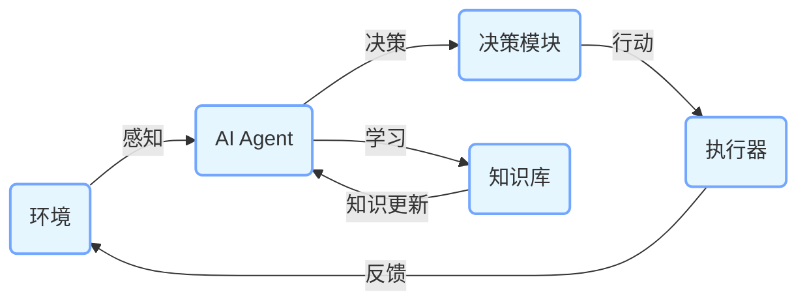

# AI Agent在智能制造中的角色与实践

> 关键词：AI Agent、智能制造、智能决策、自动化控制、工业物联网

> 摘要：本文深入探讨了AI Agent在智能制造领域的角色与实践。首先介绍了研究的背景、目的、预期读者和文档结构，阐述了相关术语。接着详细讲解了AI Agent的核心概念、原理和架构，并给出了相应的示意图和流程图。然后对AI Agent的核心算法原理进行分析，用Python代码展示具体操作步骤，同时介绍了相关的数学模型和公式。通过项目实战，展示了AI Agent在智能制造中的代码实现和详细解读。还列举了AI Agent在智能制造中的实际应用场景，推荐了学习资源、开发工具框架和相关论文著作。最后总结了AI Agent在智能制造中的未来发展趋势与挑战，提供了常见问题解答和扩展阅读参考资料，旨在为读者全面呈现AI Agent在智能制造中的重要作用和应用方法。

## 1. 背景介绍 
### 1.1 目的和范围
随着制造业向智能化方向的快速发展，如何利用先进的人工智能技术提升制造过程的效率、质量和灵活性成为了研究的热点。AI Agent作为一种具有自主性、反应性、社会性和主动性的智能实体，能够在复杂的制造环境中自主决策和执行任务，为智能制造带来了新的解决方案。本文的目的是深入探讨AI Agent在智能制造中的角色和具体实践，包括其核心概念、算法原理、实际应用案例等，为相关研究人员和从业者提供全面的技术参考。

### 1.2 预期读者
本文预期读者包括智能制造领域的研究人员、工程师、技术管理人员，以及对人工智能和智能制造交叉领域感兴趣的学生和爱好者。希望通过本文的介绍，读者能够深入了解AI Agent在智能制造中的应用原理和实践方法，为实际工作和研究提供有益的启示。

### 1.3 文档结构概述
本文将按照以下结构进行阐述：首先介绍AI Agent和智能制造相关的术语和概念；接着详细讲解AI Agent的核心概念、原理和架构；然后分析AI Agent的核心算法原理，并给出Python代码实现；介绍相关的数学模型和公式；通过项目实战展示AI Agent在智能制造中的代码实现和详细解读；列举AI Agent在智能制造中的实际应用场景；推荐学习资源、开发工具框架和相关论文著作；最后总结AI Agent在智能制造中的未来发展趋势与挑战，提供常见问题解答和扩展阅读参考资料。

### 1.4 术语表
#### 1.4.1 核心术语定义
- **AI Agent（人工智能智能体）**：是一种能够感知环境、自主决策并采取行动以实现特定目标的智能实体。它可以是软件程序、机器人或其他具有智能行为的系统。
- **智能制造**：是一种将先进的信息技术、人工智能技术与制造技术深度融合的制造模式，旨在实现制造过程的智能化、自动化和柔性化。
- **工业物联网（IIoT）**：是物联网在工业领域的应用，通过将各种工业设备、传感器、控制器等连接到网络，实现数据的采集、传输和分析，为智能制造提供数据支持。
- **智能决策**：是指利用人工智能技术，对复杂的制造问题进行分析和推理，以做出最优的决策。

#### 1.4.2 相关概念解释
- **自主性**：AI Agent能够在没有外部干预的情况下，自主地感知环境、做出决策和执行任务。
- **反应性**：AI Agent能够及时对环境的变化做出反应，调整自己的行为以适应新的情况。
- **社会性**：AI Agent可以与其他智能体进行交互和协作，共同完成复杂的任务。
- **主动性**：AI Agent能够主动地寻找机会，采取行动以实现自己的目标。

#### 1.4.3 缩略词列表
- **AI**：Artificial Intelligence（人工智能）
- **IIoT**：Industrial Internet of Things（工业物联网）
- **PLC**：Programmable Logic Controller（可编程逻辑控制器）

## 2. 核心概念与联系 
### 核心概念原理
AI Agent的核心原理基于智能感知、决策和行动三个主要环节。智能感知是指AI Agent通过各种传感器收集环境信息，如温度、压力、湿度、设备状态等。这些传感器可以是物理传感器，也可以是虚拟传感器，用于收集来自工业物联网的数据。

决策环节是AI Agent的核心，它利用感知到的环境信息，结合自身的知识库和推理机制，对当前的情况进行分析和判断，做出最优的决策。决策过程可以基于规则、机器学习、深度学习等方法。

行动环节是指AI Agent根据决策结果，向执行器发送控制指令，执行相应的任务。执行器可以是机器人、PLC等设备，用于实现制造过程的自动化控制。

### 架构示意图


### 架构解释
- **环境**：包括制造过程中的各种设备、物料、人员等，是AI Agent感知和作用的对象。
- **AI Agent**：负责感知环境信息、做出决策和执行行动，同时具备学习能力，能够不断更新自己的知识库。
- **决策模块**：根据感知到的环境信息和知识库中的知识，进行推理和决策。
- **执行器**：根据AI Agent的决策结果，执行相应的任务，并将执行结果反馈给环境。
- **知识库**：存储AI Agent的知识和经验，为决策提供支持。

## 3. 核心算法原理 & 具体操作步骤 
### 核心算法原理
在AI Agent中，常用的决策算法包括基于规则的推理、机器学习和深度学习算法。这里我们以基于规则的推理为例，介绍其核心算法原理。

基于规则的推理是一种基于专家知识的决策方法，它通过定义一系列的规则来描述问题的解决方案。规则通常由条件和结论两部分组成，当条件满足时，就会触发相应的结论。

### Python源代码实现
```python
# 定义规则类
class Rule:
    def __init__(self, condition, conclusion):
        self.condition = condition
        self.conclusion = conclusion

    def evaluate(self, facts):
        # 检查条件是否满足
        for fact in self.condition:
            if fact not in facts:
                return False
        return True

# 定义推理机类
class InferenceEngine:
    def __init__(self, rules):
        self.rules = rules

    def infer(self, facts):
        new_facts = set(facts)
        while True:
            added = False
            for rule in self.rules:
                if rule.evaluate(new_facts) and rule.conclusion not in new_facts:
                    new_facts.add(rule.conclusion)
                    added = True
            if not added:
                break
        return new_facts

# 定义规则和初始事实
rules = [
    Rule(['设备温度过高', '设备运行时间过长'], '设备需要停机维护'),
    Rule(['设备振动异常', '设备噪音过大'], '设备存在机械故障')
]

facts = ['设备温度过高', '设备运行时间过长']

# 创建推理机并进行推理
engine = InferenceEngine(rules)
result = engine.infer(facts)

print("推理结果:", result)
```

### 具体操作步骤
1. **定义规则**：使用`Rule`类定义一系列的规则，每个规则包含条件和结论。
2. **定义推理机**：使用`InferenceEngine`类创建推理机，将规则列表传递给推理机。
3. **提供初始事实**：定义初始的事实集合，作为推理的起点。
4. **进行推理**：调用推理机的`infer`方法，传入初始事实，得到推理结果。
5. **输出结果**：打印推理结果。

## 4. 数学模型和公式 & 详细讲解 & 举例说明 
### 数学模型
在基于规则的推理中，可以使用命题逻辑来描述规则和事实。命题逻辑是一种形式逻辑，它使用命题变量和逻辑运算符来表示命题之间的关系。

设 $P_1, P_2, \cdots, P_n$ 是命题变量，表示不同的事实。规则可以表示为蕴含式 $P_1 \land P_2 \land \cdots \land P_m \to Q$，其中 $P_1, P_2, \cdots, P_m$ 是条件，$Q$ 是结论。

### 公式讲解
- **蕴含式**：$P \to Q$ 表示如果 $P$ 为真，则 $Q$ 为真。其真值表如下：
| $P$ | $Q$ | $P \to Q$ |
| --- | --- | --- |
| T | T | T |
| T | F | F |
| F | T | T |
| F | F | T |

- **合取式**：$P_1 \land P_2 \land \cdots \land P_m$ 表示 $P_1, P_2, \cdots, P_m$ 都为真时，整个合取式为真。

### 举例说明
假设有以下规则和事实：
- 规则：如果设备温度过高（$P_1$）且设备运行时间过长（$P_2$），则设备需要停机维护（$Q$），可以表示为 $P_1 \land P_2 \to Q$。
- 事实：设备温度过高（$P_1$ 为真），设备运行时间过长（$P_2$ 为真）。

根据命题逻辑的推理规则，由于 $P_1$ 和 $P_2$ 都为真，所以 $P_1 \land P_2$ 为真。又因为 $P_1 \land P_2 \to Q$ 为真，根据蕴含式的真值表，当条件为真时，结论也为真，所以可以得出设备需要停机维护（$Q$ 为真）的结论。

## 5. 项目实战：代码实际案例和详细解释说明 
### 5.1  开发环境搭建
- **操作系统**：推荐使用Ubuntu 20.04或Windows 10。
- **编程语言**：Python 3.8及以上版本。
- **开发工具**：PyCharm或Visual Studio Code。
- **依赖库**：安装`numpy`、`pandas`等常用库，可使用以下命令进行安装：
```sh
pip install numpy pandas
```

### 5.2  源代码详细实现和代码解读
```python
import numpy as np
import pandas as pd

# 模拟工业物联网数据
def generate_iiot_data():
    num_samples = 100
    temperature = np.random.normal(25, 5, num_samples)
    pressure = np.random.normal(100, 10, num_samples)
    vibration = np.random.normal(0.5, 0.1, num_samples)
    data = {
        'temperature': temperature,
        'pressure': pressure,
        'vibration': vibration
    }
    df = pd.DataFrame(data)
    return df

# 定义AI Agent类
class AIAgent:
    def __init__(self):
        self.thresholds = {
            'temperature': 30,
            'pressure': 120,
            'vibration': 0.8
        }

    def monitor(self, data):
        alerts = []
        for index, row in data.iterrows():
            if row['temperature'] > self.thresholds['temperature']:
                alerts.append(f"温度过高: {row['temperature']}")
            if row['pressure'] > self.thresholds['pressure']:
                alerts.append(f"压力过高: {row['pressure']}")
            if row['vibration'] > self.thresholds['vibration']:
                alerts.append(f"振动异常: {row['vibration']}")
        return alerts

# 主程序
if __name__ == "__main__":
    # 生成工业物联网数据
    iiot_data = generate_iiot_data()

    # 创建AI Agent
    agent = AIAgent()

    # 进行监控
    alerts = agent.monitor(iiot_data)

    # 输出监控结果
    if alerts:
        print("监控到以下异常:")
        for alert in alerts:
            print(alert)
    else:
        print("未发现异常。")
```

### 代码解读与分析
1. **数据生成**：`generate_iiot_data`函数模拟了工业物联网数据，生成了温度、压力和振动三个参数的随机数据，并将其存储在`pandas`的`DataFrame`中。
2. **AI Agent类**：`AIAgent`类表示AI Agent，其中`thresholds`字典定义了各个参数的阈值。`monitor`方法用于监控工业物联网数据，当某个参数超过阈值时，会生成相应的警报信息。
3. **主程序**：在主程序中，首先调用`generate_iiot_data`函数生成工业物联网数据，然后创建`AIAgent`对象，调用`monitor`方法进行监控，最后输出监控结果。

通过这个项目实战，我们展示了AI Agent在智能制造中的基本应用，即对工业物联网数据进行实时监控和异常检测。

## 6. 实际应用场景 
### 生产过程优化
AI Agent可以实时监测生产过程中的各种参数，如设备状态、工艺参数、物料流量等，并根据监测结果进行智能决策，优化生产过程。例如，当设备温度过高时，AI Agent可以自动调整设备的运行参数或安排设备停机维护，以避免设备损坏和生产事故的发生。

### 质量控制
AI Agent可以对生产过程中的产品质量进行实时监测和分析，通过图像识别、传感器数据等技术，检测产品的外观缺陷、尺寸偏差等质量问题。一旦发现质量问题，AI Agent可以及时发出警报，并采取相应的措施，如调整生产工艺、筛选不合格产品等，以提高产品质量。

### 设备维护
AI Agent可以对设备的运行状态进行实时监测，预测设备的故障发生时间，并提前安排设备维护计划。通过分析设备的历史运行数据和实时监测数据，AI Agent可以建立设备的故障预测模型，当设备出现异常征兆时，及时发出预警，提醒维护人员进行维护，以减少设备的停机时间和维修成本。

### 供应链管理
AI Agent可以在供应链管理中发挥重要作用，通过与供应商、物流商等合作伙伴的智能体进行交互和协作，实现供应链的优化和协同。例如，AI Agent可以根据生产计划和库存情况，自动向供应商下达采购订单，并实时跟踪订单的执行情况；可以优化物流配送路线，提高物流效率。

## 7. 工具和资源推荐
### 7.1 学习资源推荐
#### 7.1.1 书籍推荐
- 《人工智能：一种现代的方法》：这是一本经典的人工智能教材，全面介绍了人工智能的各个领域，包括智能体、搜索算法、机器学习、自然语言处理等。
- 《智能制造：原理、技术与应用》：详细介绍了智能制造的相关技术和应用案例，包括工业物联网、人工智能、机器人技术等。
- 《Python人工智能实战》：通过实际案例介绍了如何使用Python实现人工智能算法，适合初学者学习。

#### 7.1.2 在线课程
- Coursera上的“人工智能基础”课程：由知名教授授课，系统介绍了人工智能的基本概念和算法。
- edX上的“智能制造技术”课程：涵盖了智能制造的各个方面，包括工业4.0、工业物联网、智能机器人等。
- 中国大学MOOC上的“Python编程基础”课程：适合初学者学习Python编程语言。

#### 7.1.3 技术博客和网站
- Medium：上面有很多关于人工智能和智能制造的技术文章和案例分享。
- 机器之心：专注于人工智能领域的资讯和技术解读，提供了很多有价值的文章和研究报告。
- 工业互联网产业联盟官网：提供了工业互联网和智能制造的相关政策、标准和技术资料。

### 7.2 开发工具框架推荐
#### 7.2.1 IDE和编辑器
- PyCharm：是一款专门为Python开发设计的集成开发环境，具有代码编辑、调试、自动补全、代码分析等功能。
- Visual Studio Code：是一款轻量级的代码编辑器，支持多种编程语言，具有丰富的插件扩展功能。
- Jupyter Notebook：是一种交互式的编程环境，适合进行数据探索和分析，以及机器学习模型的开发和调试。

#### 7.2.2 调试和性能分析工具
- Py-Spy：是一个用于Python代码性能分析的工具，可以实时监测Python程序的CPU使用率、函数调用次数等信息。
- PDB：是Python自带的调试工具，可以在代码中设置断点，单步执行代码，查看变量的值等。
- TensorBoard：是TensorFlow提供的可视化工具，可以用于可视化机器学习模型的训练过程和性能指标。

#### 7.2.3 相关框架和库
- TensorFlow：是一个开源的机器学习框架，广泛应用于深度学习领域，提供了丰富的工具和接口，方便用户开发和训练深度学习模型。
- PyTorch：是另一个流行的深度学习框架，具有动态计算图的特点，易于使用和调试。
- Scikit-learn：是一个用于机器学习的Python库，提供了各种机器学习算法和工具，如分类、回归、聚类等。

### 7.3 相关论文著作推荐
#### 7.3.1 经典论文
- "Intelligent Agents: Theory and Practice"：这篇论文系统地介绍了智能体的理论和实践，是智能体领域的经典文献。
- "Industry 4.0: A Survey on Technologies, Applications and Open Research Issues"：对工业4.0的相关技术、应用和研究问题进行了全面的综述。
- "Deep Learning in Manufacturing: A State-of-the-Art Review"：对深度学习在制造业中的应用进行了综述，介绍了深度学习在质量控制、故障诊断、生产调度等方面的应用。

#### 7.3.2 最新研究成果
- 可以关注IEEE Transactions on Industrial Informatics、ACM Transactions on Intelligent Systems and Technology等学术期刊，以及AAAI、IJCAI等人工智能领域的顶级会议，获取最新的研究成果。

#### 7.3.3 应用案例分析
- 《工业4.0实践案例集》：收集了国内外工业4.0的实际应用案例，包括智能制造、智能物流、智能供应链等方面的案例。
- 各企业的官方网站和技术博客：很多企业会分享自己在智能制造方面的应用案例和技术经验，可以从中学习到实际的应用方法和解决方案。

## 8. 总结：未来发展趋势与挑战
### 未来发展趋势
- **深度融合**：AI Agent将与工业物联网、大数据、云计算等技术深度融合，实现制造过程的全面智能化。通过工业物联网收集大量的设备运行数据和生产过程数据，利用大数据和云计算技术进行存储和分析，AI Agent可以做出更加准确和智能的决策。
- **多智能体协作**：在复杂的制造环境中，单个AI Agent往往无法完成所有的任务，未来将出现更多的多智能体协作系统。多个AI Agent可以通过通信和协作，共同完成生产调度、质量控制、设备维护等任务，提高制造系统的整体效率和灵活性。
- **自主学习和进化**：AI Agent将具备更强的自主学习和进化能力，能够不断从环境中学习新的知识和经验，优化自己的决策和行为。例如，通过强化学习算法，AI Agent可以在与环境的交互中不断调整自己的策略，以实现最优的性能。
- **应用领域拓展**：AI Agent在智能制造中的应用领域将不断拓展，除了生产过程优化、质量控制、设备维护等传统领域，还将应用于新产品研发、供应链协同、客户服务等领域，为企业创造更大的价值。

### 挑战
- **数据安全和隐私**：在智能制造中，AI Agent需要处理大量的敏感数据，如设备运行数据、产品设计数据、客户信息等。如何保障数据的安全和隐私，防止数据泄露和滥用，是一个亟待解决的问题。
- **算法可解释性**：很多AI算法，如深度学习算法，具有很强的黑盒性，难以解释其决策过程和结果。在智能制造中，这可能会导致人们对AI Agent的决策缺乏信任，尤其是在涉及到安全和质量的关键决策时。因此，提高算法的可解释性是一个重要的挑战。
- **标准和规范缺乏**：目前，智能制造领域还缺乏统一的标准和规范，不同企业和系统之间的互操作性较差。这给AI Agent的开发和应用带来了一定的困难，需要加快制定相关的标准和规范，促进智能制造的健康发展。
- **人才短缺**：AI Agent在智能制造中的应用需要既懂人工智能技术又懂制造技术的复合型人才。目前，这类人才非常短缺，制约了AI Agent在智能制造中的推广和应用。需要加强相关领域的人才培养，提高人才素质。

## 9. 附录：常见问题与解答
### 问题1：AI Agent和传统的自动化控制系统有什么区别？
解答：传统的自动化控制系统通常是基于预设的规则和程序进行操作，缺乏自主性和灵活性。而AI Agent具有自主性、反应性、社会性和主动性，能够根据环境的变化自主地做出决策和调整行为。此外，AI Agent还可以通过学习和进化不断提高自己的性能，而传统的自动化控制系统则相对固定。

### 问题2：AI Agent在智能制造中需要哪些数据？
解答：AI Agent在智能制造中需要各种类型的数据，包括设备运行数据（如温度、压力、振动等）、工艺参数数据、产品质量数据、生产计划数据、供应链数据等。这些数据可以通过工业物联网传感器、PLC、MES系统等进行收集和传输。

### 问题3：如何评估AI Agent在智能制造中的性能？
解答：可以从多个方面评估AI Agent在智能制造中的性能，如决策的准确性、响应速度、任务完成率、资源利用率等。可以通过实际应用测试、模拟实验等方法来评估AI Agent的性能，并根据评估结果进行优化和改进。

### 问题4：AI Agent在智能制造中的应用会导致大量人员失业吗？
解答：虽然AI Agent在智能制造中的应用会取代一些重复性、规律性的工作，但也会创造出一些新的工作岗位，如AI Agent的开发、维护和管理，数据分析和决策支持等。此外，AI Agent的应用可以提高生产效率和产品质量，促进企业的发展，从而带动相关产业的就业增长。因此，从长远来看，AI Agent在智能制造中的应用不会导致大量人员失业，而是会促进就业结构的调整和升级。

## 10. 扩展阅读 & 参考资料
### 扩展阅读
- 《人工智能时代的制造业转型》
- 《工业互联网：从边缘到核心》
- 《智能制造中的机器学习应用》

### 参考资料
- [1] Russell, S. J., & Norvig, P. (2009). Artificial intelligence: A modern approach. Pearson Education.
- [2] Lu, Y. (2017). Industry 4.0: A survey on technologies, applications and open research issues. Journal of Industrial and Production Engineering, 34(4), 357-369.
- [3] Lee, J., Kuo, I., & Yang, S. (2018). Deep learning in manufacturing: A state-of-the-art review. Manufacturing Letters, 16, 15-19.

作者：AI天才研究院/AI Genius Institute & 禅与计算机程序设计艺术 /Zen And The Art of Computer Programming