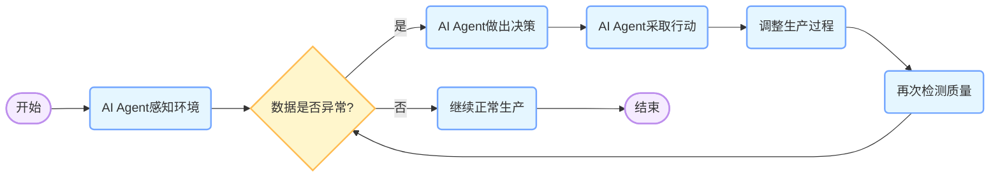

# AI Agent在智能制造质量控制中的应用

> 关键词：AI Agent、智能制造、质量控制、机器学习、智能决策

> 摘要：本文深入探讨了AI Agent在智能制造质量控制中的应用。首先介绍了相关背景知识，包括目的范围、预期读者等。接着阐述了AI Agent、智能制造和质量控制的核心概念及其联系，给出了原理和架构的文本示意图与Mermaid流程图。详细讲解了核心算法原理和具体操作步骤，并结合Python源代码进行说明。同时介绍了相关数学模型和公式，通过举例加深理解。通过项目实战展示了代码实现和解读。分析了实际应用场景，推荐了学习资源、开发工具框架和相关论文著作。最后总结了未来发展趋势与挑战，还提供了常见问题解答和扩展阅读参考资料，旨在为相关领域的研究和实践提供全面的指导。

## 1. 背景介绍 
### 1.1 目的和范围
在智能制造领域，质量控制是确保产品符合标准和客户需求的关键环节。传统的质量控制方法往往依赖于人工检查和经验判断，效率低下且容易出现误差。AI Agent作为一种智能实体，能够感知环境、做出决策并采取行动，为智能制造质量控制带来了新的解决方案。本文的目的是深入探讨AI Agent在智能制造质量控制中的应用，包括其原理、算法、实际案例等方面，旨在为相关领域的研究人员和工程师提供全面的技术指导和实践参考。

本文的范围涵盖了AI Agent的基本概念、核心算法、数学模型，以及在智能制造质量控制中的具体应用场景。同时，还将介绍相关的开发工具和资源，帮助读者更好地理解和应用这一技术。

### 1.2 预期读者
本文的预期读者包括但不限于以下几类人群：
- **智能制造领域的工程师和技术人员**：希望了解AI Agent在质量控制中的应用，以提高生产效率和产品质量。
- **人工智能研究人员**：对AI Agent的理论和实践应用感兴趣，特别是在工业领域的应用。
- **高校相关专业的师生**：作为学习和研究智能制造和人工智能的参考资料。
- **企业管理人员**：了解AI Agent在智能制造质量控制中的潜在价值，为企业的数字化转型提供决策依据。

### 1.3 文档结构概述
本文将按照以下结构进行组织：
- **核心概念与联系**：介绍AI Agent、智能制造和质量控制的核心概念，以及它们之间的联系，并给出相应的示意图和流程图。
- **核心算法原理 & 具体操作步骤**：详细讲解AI Agent在质量控制中常用的核心算法原理，并通过Python源代码进行具体操作步骤的说明。
- **数学模型和公式 & 详细讲解 & 举例说明**：介绍相关的数学模型和公式，并通过实际例子进行详细讲解。
- **项目实战：代码实际案例和详细解释说明**：通过一个具体的项目实战，展示AI Agent在智能制造质量控制中的代码实现和详细解释。
- **实际应用场景**：分析AI Agent在智能制造质量控制中的实际应用场景。
- **工具和资源推荐**：推荐相关的学习资源、开发工具框架和论文著作。
- **总结：未来发展趋势与挑战**：总结AI Agent在智能制造质量控制中的未来发展趋势和面临的挑战。
- **附录：常见问题与解答**：提供常见问题的解答，帮助读者更好地理解和应用本文的内容。
- **扩展阅读 & 参考资料**：提供扩展阅读的建议和相关参考资料，方便读者进一步深入研究。

### 1.4 术语表
#### 1.4.1 核心术语定义
- **AI Agent**：人工智能代理，是一种能够感知环境、做出决策并采取行动的智能实体。
- **智能制造**：基于新一代信息技术，贯穿设计、生产、管理、服务等制造活动各个环节，具有信息深度自感知、智慧优化自决策、精准控制自执行等功能的先进制造过程、系统与模式的总称。
- **质量控制**：为达到质量要求所采取的作业技术和活动，目的在于监视过程并排除质量环所有阶段中导致不满意的原因，以取得经济效益。

#### 1.4.2 相关概念解释
- **机器学习**：是一门多领域交叉学科，涉及概率论、统计学、逼近论、凸分析、算法复杂度理论等多门学科。它专门研究计算机怎样模拟或实现人类的学习行为，以获取新的知识或技能，重新组织已有的知识结构使之不断改善自身的性能。
- **深度学习**：是机器学习的一个分支领域，它是一种基于对数据进行表征学习的方法。深度学习通过构建具有很多层的神经网络模型，自动从大量数据中学习到复杂的模式和特征。

#### 1.4.3 缩略词列表
- **AI**：Artificial Intelligence，人工智能
- **ML**：Machine Learning，机器学习
- **DL**：Deep Learning，深度学习

## 2. 核心概念与联系 

### 核心概念原理
#### AI Agent
AI Agent是一个能够感知环境并根据感知到的信息做出决策和采取行动的实体。它通常由三个主要部分组成：感知器、决策器和执行器。感知器用于收集环境信息，决策器根据感知到的信息进行分析和推理，做出决策，执行器则根据决策采取相应的行动。

#### 智能制造
智能制造是将信息技术、自动化技术、人工智能技术等与制造技术深度融合，实现生产过程的智能化、自动化和柔性化。它通过实时数据采集、分析和决策，优化生产流程，提高生产效率和产品质量。

#### 质量控制
质量控制是确保产品或服务符合规定要求的过程。在智能制造中，质量控制涉及到从原材料采购、生产过程监控到成品检验等各个环节。通过实时监测和分析生产数据，及时发现质量问题并采取措施进行纠正。

### 架构的文本示意图
```plaintext
+----------------------+
|      AI Agent        |
| +----------------+   |
| |    感知器      |   |
| +----------------+   |
| |    决策器      |   |
| +----------------+   |
| |    执行器      |   |
| +----------------+   |
+----------------------+
          |
          v
+----------------------+
|    智能制造系统    |
| +----------------+   |
| |  生产设备      |   |
| +----------------+   |
| |  数据采集系统  |   |
| +----------------+   |
| |  数据分析系统  |   |
| +----------------+   |
+----------------------+
          |
          v
+----------------------+
|    质量控制系统    |
| +----------------+   |
| |  质量标准      |   |
| +----------------+   |
| |  质量检测设备  |   |
| +----------------+   |
| |  质量分析系统  |   |
| +----------------+   |
+----------------------+
```

### Mermaid流程图


这个流程图展示了AI Agent在智能制造质量控制中的工作流程。AI Agent首先感知环境数据，判断数据是否异常。如果数据异常，AI Agent做出决策并采取行动，调整生产过程，然后再次检测质量。如果数据正常，则继续正常生产。

## 3. 核心算法原理 & 具体操作步骤 

### 核心算法原理
在智能制造质量控制中，AI Agent常用的核心算法包括机器学习算法和深度学习算法。下面以支持向量机（SVM）和卷积神经网络（CNN）为例进行介绍。

#### 支持向量机（SVM）
支持向量机是一种有监督的机器学习算法，用于分类和回归分析。其基本思想是在特征空间中找到一个最优的超平面，将不同类别的样本分开，并且使得超平面到最近样本点的距离（即间隔）最大。

#### 卷积神经网络（CNN）
卷积神经网络是一种深度学习算法，特别适用于处理具有网格结构的数据，如图像、音频等。CNN通过卷积层、池化层和全连接层等组件，自动提取数据的特征，并进行分类或回归分析。

### 具体操作步骤及Python源代码
#### 支持向量机（SVM）示例
```python
import numpy as np
from sklearn import datasets
from sklearn.model_selection import train_test_split
from sklearn.svm import SVC
from sklearn.metrics import accuracy_score

# 加载数据集
iris = datasets.load_iris()
X = iris.data
y = iris.target

# 划分训练集和测试集
X_train, X_test, y_train, y_test = train_test_split(X, y, test_size=0.3, random_state=42)

# 创建SVM分类器
svm_classifier = SVC(kernel='linear')

# 训练模型
svm_classifier.fit(X_train, y_train)

# 预测
y_pred = svm_classifier.predict(X_test)

# 计算准确率
accuracy = accuracy_score(y_test, y_pred)
print(f"支持向量机模型的准确率: {accuracy}")
```
### 代码解释
1. **加载数据集**：使用`sklearn.datasets`中的`load_iris`函数加载鸢尾花数据集。
2. **划分训练集和测试集**：使用`train_test_split`函数将数据集划分为训练集和测试集，其中测试集占比为30%。
3. **创建SVM分类器**：使用`SVC`类创建一个线性核的SVM分类器。
4. **训练模型**：使用`fit`方法对模型进行训练。
5. **预测**：使用`predict`方法对测试集进行预测。
6. **计算准确率**：使用`accuracy_score`函数计算模型的准确率。

#### 卷积神经网络（CNN）示例
```python
import tensorflow as tf
from tensorflow.keras.datasets import mnist
from tensorflow.keras.models import Sequential
from tensorflow.keras.layers import Conv2D, MaxPooling2D, Flatten, Dense

# 加载MNIST数据集
(train_images, train_labels), (test_images, test_labels) = mnist.load_data()

# 数据预处理
train_images = train_images.reshape((60000, 28, 28, 1)).astype('float32') / 255
test_images = test_images.reshape((10000, 28, 28, 1)).astype('float32') / 255

train_labels = tf.keras.utils.to_categorical(train_labels)
test_labels = tf.keras.utils.to_categorical(test_labels)

# 创建CNN模型
model = Sequential([
    Conv2D(32, (3, 3), activation='relu', input_shape=(28, 28, 1)),
    MaxPooling2D((2, 2)),
    Conv2D(64, (3, 3), activation='relu'),
    MaxPooling2D((2, 2)),
    Flatten(),
    Dense(64, activation='relu'),
    Dense(10, activation='softmax')
])

# 编译模型
model.compile(optimizer='adam',
              loss='categorical_crossentropy',
              metrics=['accuracy'])

# 训练模型
model.fit(train_images, train_labels, epochs=5, batch_size=64)

# 评估模型
test_loss, test_acc = model.evaluate(test_images, test_labels)
print(f"卷积神经网络模型的测试准确率: {test_acc}")
```
### 代码解释
1. **加载MNIST数据集**：使用`tensorflow.keras.datasets`中的`mnist.load_data`函数加载MNIST手写数字数据集。
2. **数据预处理**：将图像数据进行归一化处理，并将标签进行one-hot编码。
3. **创建CNN模型**：使用`Sequential`模型构建一个简单的CNN模型，包括卷积层、池化层、全连接层等。
4. **编译模型**：使用`compile`方法指定优化器、损失函数和评估指标。
5. **训练模型**：使用`fit`方法对模型进行训练，指定训练轮数和批次大小。
6. **评估模型**：使用`evaluate`方法对模型在测试集上的性能进行评估。

## 4. 数学模型和公式 & 详细讲解 & 举例说明 

### 支持向量机（SVM）的数学模型和公式
#### 线性可分情况
假设我们有一个训练数据集 $D = \{(x_1, y_1), (x_2, y_2), \cdots, (x_n, y_n)\}$，其中 $x_i \in \mathbb{R}^d$ 是特征向量，$y_i \in \{-1, +1\}$ 是类别标签。线性可分的支持向量机的目标是找到一个超平面 $w^T x + b = 0$，使得不同类别的样本能够被正确分开，并且间隔最大。

间隔可以表示为 $\frac{2}{\|w\|}$，因此我们的目标是最大化间隔，即最小化 $\frac{1}{2}\|w\|^2$，同时满足约束条件 $y_i(w^T x_i + b) \geq 1$ ，$i = 1, 2, \cdots, n$。

这可以转化为一个凸二次规划问题：
$$
\begin{aligned}
\min_{w, b} &\quad \frac{1}{2}\|w\|^2 \\
\text{s.t.} &\quad y_i(w^T x_i + b) \geq 1, \quad i = 1, 2, \cdots, n
\end{aligned}
$$

#### 线性不可分情况
在实际应用中，数据往往是线性不可分的。为了处理这种情况，我们引入松弛变量 $\xi_i \geq 0$，允许一些样本点违反约束条件。目标函数变为：
$$
\begin{aligned}
\min_{w, b, \xi} &\quad \frac{1}{2}\|w\|^2 + C \sum_{i=1}^{n} \xi_i \\
\text{s.t.} &\quad y_i(w^T x_i + b) \geq 1 - \xi_i, \quad i = 1, 2, \cdots, n \\
&\quad \xi_i \geq 0, \quad i = 1, 2, \cdots, n
\end{aligned}
$$
其中 $C$ 是一个惩罚参数，用于平衡间隔最大化和误分类样本的惩罚。

### 举例说明
假设我们有一个二维数据集，包含两个类别的样本点。我们可以使用SVM来找到一个最优的超平面将这两个类别分开。

```python
import numpy as np
import matplotlib.pyplot as plt
from sklearn.svm import SVC

# 生成数据集
np.random.seed(42)
X = np.r_[np.random.randn(20, 2) - [2, 2], np.random.randn(20, 2) + [2, 2]]
y = [0] * 20 + [1] * 20

# 创建SVM分类器
svm_classifier = SVC(kernel='linear')

# 训练模型
svm_classifier.fit(X, y)

# 绘制数据集和超平面
plt.scatter(X[:, 0], X[:, 1], c=y, cmap=plt.cm.Paired)
ax = plt.gca()
xlim = ax.get_xlim()
ylim = ax.get_ylim()

# 创建网格点
xx = np.linspace(xlim[0], xlim[1], 30)
yy = np.linspace(ylim[0], ylim[1], 30)
YY, XX = np.meshgrid(yy, xx)
xy = np.vstack([XX.ravel(), YY.ravel()]).T
Z = svm_classifier.decision_function(xy).reshape(XX.shape)

# 绘制超平面和间隔边界
ax.contour(XX, YY, Z, colors='k', levels=[-1, 0, 1], alpha=0.5, linestyles=['--', '-', '--'])

# 绘制支持向量
ax.scatter(svm_classifier.support_vectors_[:, 0], svm_classifier.support_vectors_[:, 1], s=100, facecolors='none', edgecolors='k')

plt.show()
```
### 代码解释
1. **生成数据集**：使用`np.random.randn`函数生成两个类别的二维样本点。
2. **创建SVM分类器**：使用`SVC`类创建一个线性核的SVM分类器。
3. **训练模型**：使用`fit`方法对模型进行训练。
4. **绘制数据集和超平面**：使用`matplotlib`库绘制数据集和SVM的超平面、间隔边界以及支持向量。

### 卷积神经网络（CNN）的数学模型和公式
#### 卷积层
卷积层是CNN的核心组件之一，它通过卷积操作提取输入数据的特征。假设输入数据是一个三维张量 $X \in \mathbb{R}^{H \times W \times C}$，其中 $H$ 是高度，$W$ 是宽度，$C$ 是通道数。卷积核是一个四维张量 $K \in \mathbb{R}^{h \times w \times C \times F}$，其中 $h$ 和 $w$ 是卷积核的高度和宽度，$F$ 是卷积核的数量。

卷积操作可以表示为：
$$
Y_{i, j, f} = \sum_{c=0}^{C-1} \sum_{m=0}^{h-1} \sum_{n=0}^{w-1} K_{m, n, c, f} X_{i+m, j+n, c} + b_f
$$
其中 $Y \in \mathbb{R}^{(H - h + 1) \times (W - w + 1) \times F}$ 是卷积层的输出，$b_f$ 是偏置项。

#### 池化层
池化层用于降低特征图的维度，减少计算量。常见的池化操作有最大池化和平均池化。以最大池化为例，假设输入特征图是 $X \in \mathbb{R}^{H \times W \times C}$，池化窗口的大小是 $p \times p$，步长是 $s$。

最大池化操作可以表示为：
$$
Y_{i, j, c} = \max_{m=0}^{p-1} \max_{n=0}^{p-1} X_{i \times s + m, j \times s + n, c}
$$
其中 $Y \in \mathbb{R}^{(\lfloor \frac{H - p}{s} \rfloor + 1) \times (\lfloor \frac{W - p}{s} \rfloor + 1) \times C}$ 是池化层的输出。

### 举例说明
我们可以使用一个简单的CNN模型对MNIST手写数字数据集进行分类。

```python
import tensorflow as tf
from tensorflow.keras.datasets import mnist
from tensorflow.keras.models import Sequential
from tensorflow.keras.layers import Conv2D, MaxPooling2D, Flatten, Dense

# 加载MNIST数据集
(train_images, train_labels), (test_images, test_labels) = mnist.load_data()

# 数据预处理
train_images = train_images.reshape((60000, 28, 28, 1)).astype('float32') / 255
test_images = test_images.reshape((10000, 28, 28, 1)).astype('float32') / 255

train_labels = tf.keras.utils.to_categorical(train_labels)
test_labels = tf.keras.utils.to_categorical(test_labels)

# 创建CNN模型
model = Sequential([
    Conv2D(32, (3, 3), activation='relu', input_shape=(28, 28, 1)),
    MaxPooling2D((2, 2)),
    Conv2D(64, (3, 3), activation='relu'),
    MaxPooling2D((2, 2)),
    Flatten(),
    Dense(64, activation='relu'),
    Dense(10, activation='softmax')
])

# 编译模型
model.compile(optimizer='adam',
              loss='categorical_crossentropy',
              metrics=['accuracy'])

# 训练模型
model.fit(train_images, train_labels, epochs=5, batch_size=64)

# 评估模型
test_loss, test_acc = model.evaluate(test_images, test_labels)
print(f"卷积神经网络模型的测试准确率: {test_acc}")
```
### 代码解释
1. **加载MNIST数据集**：使用`tensorflow.keras.datasets`中的`mnist.load_data`函数加载MNIST手写数字数据集。
2. **数据预处理**：将图像数据进行归一化处理，并将标签进行one-hot编码。
3. **创建CNN模型**：使用`Sequential`模型构建一个简单的CNN模型，包括卷积层、池化层、全连接层等。
4. **编译模型**：使用`compile`方法指定优化器、损失函数和评估指标。
5. **训练模型**：使用`fit`方法对模型进行训练，指定训练轮数和批次大小。
6. **评估模型**：使用`evaluate`方法对模型在测试集上的性能进行评估。

## 5. 项目实战：代码实际案例和详细解释说明 

### 5.1  开发环境搭建
为了实现AI Agent在智能制造质量控制中的应用，我们需要搭建一个合适的开发环境。以下是具体的步骤：

#### 安装Python
Python是一种广泛使用的编程语言，许多机器学习和深度学习库都支持Python。我们可以从Python官方网站（https://www.python.org/downloads/）下载并安装Python 3.x版本。

#### 安装必要的库
我们需要安装一些必要的Python库，包括`numpy`、`pandas`、`scikit-learn`、`tensorflow`等。可以使用`pip`命令进行安装：
```sh
pip install numpy pandas scikit-learn tensorflow matplotlib
```

#### 选择开发工具
可以选择使用Jupyter Notebook或PyCharm等开发工具。Jupyter Notebook是一个交互式的开发环境，适合进行数据探索和模型调试；PyCharm是一个专业的Python集成开发环境，适合进行大型项目的开发。

### 5.2  源代码详细实现和代码解读
#### 项目背景
假设我们有一个智能制造生产线，生产某种产品。我们可以使用传感器收集生产过程中的各种数据，如温度、压力、湿度等。我们的目标是使用AI Agent对这些数据进行实时监测和分析，当数据出现异常时，及时采取措施进行调整，以确保产品质量。

#### 代码实现
```python
import numpy as np
import pandas as pd
from sklearn.model_selection import train_test_split
from sklearn.svm import SVC
from sklearn.metrics import accuracy_score

# 生成模拟数据
np.random.seed(42)
n_samples = 1000
features = ['temperature', 'pressure', 'humidity']
X = np.random.randn(n_samples, len(features))
y = np.random.randint(0, 2, n_samples)  # 0表示正常，1表示异常

# 划分训练集和测试集
X_train, X_test, y_train, y_test = train_test_split(X, y, test_size=0.2, random_state=42)

# 创建SVM分类器
svm_classifier = SVC(kernel='linear')

# 训练模型
svm_classifier.fit(X_train, y_train)

# 预测
y_pred = svm_classifier.predict(X_test)

# 计算准确率
accuracy = accuracy_score(y_test, y_pred)
print(f"模型的准确率: {accuracy}")

# 模拟实时监测
new_data = np.random.randn(1, len(features))
prediction = svm_classifier.predict(new_data)
if prediction[0] == 0:
    print("生产过程正常")
else:
    print("生产过程异常，需要调整")
```
#### 代码解读
1. **生成模拟数据**：使用`np.random.randn`函数生成模拟的生产数据，包括温度、压力和湿度。使用`np.random.randint`函数生成标签，0表示正常，1表示异常。
2. **划分训练集和测试集**：使用`train_test_split`函数将数据集划分为训练集和测试集，其中测试集占比为20%。
3. **创建SVM分类器**：使用`SVC`类创建一个线性核的SVM分类器。
4. **训练模型**：使用`fit`方法对模型进行训练。
5. **预测**：使用`predict`方法对测试集进行预测，并计算准确率。
6. **模拟实时监测**：生成一组新的数据，使用训练好的模型进行预测，并根据预测结果输出相应的信息。

### 5.3  代码解读与分析
#### 优点
- **简单易懂**：代码使用了常见的机器学习库和函数，结构清晰，易于理解和修改。
- **可扩展性**：可以很容易地替换不同的机器学习算法，如决策树、神经网络等。
- **实时监测**：可以模拟实时监测生产过程，及时发现异常并采取措施。

#### 缺点
- **数据模拟**：使用的是模拟数据，与实际生产数据可能存在差异。
- **模型复杂度**：SVM模型相对简单，对于复杂的生产过程可能效果不佳。

#### 改进建议
- **使用真实数据**：收集实际生产过程中的数据，提高模型的准确性和可靠性。
- **使用更复杂的模型**：可以尝试使用深度学习模型，如卷积神经网络、循环神经网络等，以处理更复杂的生产数据。

## 6. 实际应用场景 
### 生产过程实时监测
在智能制造生产线中，AI Agent可以实时监测各种传感器收集的数据，如温度、压力、振动等。通过分析这些数据，AI Agent可以及时发现生产过程中的异常情况，如设备故障、工艺偏差等，并及时发出警报，提醒操作人员采取措施进行调整。

例如，在汽车制造过程中，AI Agent可以监测发动机装配线上的扭矩数据。如果扭矩数据超出了正常范围，AI Agent可以判断可能存在装配问题，并及时通知工人进行检查和调整，从而避免不合格产品的产生。

### 质量预测
AI Agent可以根据历史生产数据和当前生产状态，预测产品的质量。通过建立质量预测模型，AI Agent可以提前发现潜在的质量问题，并采取措施进行预防。

例如，在电子产品制造过程中，AI Agent可以根据原材料的质量、生产工艺参数等信息，预测产品的合格率。如果预测结果显示合格率较低，AI Agent可以建议调整生产工艺或更换原材料，以提高产品质量。

### 设备维护管理
AI Agent可以对生产设备进行实时监测和故障诊断，预测设备的剩余使用寿命，并制定合理的维护计划。通过及时进行设备维护，可以减少设备故障的发生，提高生产效率。

例如，在钢铁制造过程中，AI Agent可以监测高炉的温度、压力等参数，判断高炉的运行状态。如果发现高炉存在潜在的故障风险，AI Agent可以提前安排维护人员进行检修，避免高炉故障导致的生产中断。

### 供应链质量管理
AI Agent可以对供应链中的原材料和零部件进行质量监测和管理。通过与供应商的信息系统进行集成，AI Agent可以实时获取原材料和零部件的质量数据，确保其符合生产要求。

例如，在服装制造过程中，AI Agent可以监测面料的质量，如颜色、尺寸、强度等。如果发现面料存在质量问题，AI Agent可以及时通知供应商进行更换，避免因原材料质量问题导致的产品质量下降。

## 7. 工具和资源推荐
### 7.1 学习资源推荐
#### 7.1.1 书籍推荐
- 《机器学习》（周志华）：这本书是机器学习领域的经典教材，全面介绍了机器学习的基本概念、算法和应用。
- 《深度学习》（Ian Goodfellow、Yoshua Bengio、Aaron Courville）：由深度学习领域的三位先驱所著，深入讲解了深度学习的理论和实践。
- 《Python机器学习》（Sebastian Raschka、Vahid Mirjalili）：这本书结合Python语言，介绍了机器学习的常用算法和工具。

#### 7.1.2 在线课程
- Coursera上的“机器学习”课程（Andrew Ng）：由斯坦福大学教授Andrew Ng主讲，是机器学习领域的经典在线课程。
- edX上的“深度学习专项课程”（deeplearning.ai）：由深度学习领域的知名学者Geoffrey Hinton、Yoshua Bengio等授课，系统介绍了深度学习的各个方面。
- 哔哩哔哩（Bilibili）上有许多关于人工智能和机器学习的教程视频，适合初学者入门学习。

#### 7.1.3 技术博客和网站
- Medium：是一个技术博客平台，上面有许多关于人工智能、机器学习和深度学习的优质文章。
- Towards Data Science：专注于数据科学和机器学习领域的技术博客，提供了大量的实践案例和技术教程。
- arXiv：是一个预印本平台，上面可以找到许多最新的人工智能和机器学习研究论文。

### 7.2 开发工具框架推荐
#### 7.2.1 IDE和编辑器
- PyCharm：是一个专业的Python集成开发环境，提供了丰富的代码编辑、调试和项目管理功能。
- Jupyter Notebook：是一个交互式的开发环境，适合进行数据探索、模型调试和文档编写。
- Visual Studio Code：是一个轻量级的代码编辑器，支持多种编程语言和插件扩展，在人工智能开发中也被广泛使用。

#### 7.2.2 调试和性能分析工具
- TensorBoard：是TensorFlow提供的一个可视化工具，可以用于查看模型的训练过程、损失函数变化、参数分布等信息。
- PyTorch Profiler：是PyTorch提供的一个性能分析工具，可以帮助开发者找出代码中的性能瓶颈。
- Scikit-learn中的交叉验证和模型评估工具：可以用于评估机器学习模型的性能，选择最优的模型和参数。

#### 7.2.3 相关框架和库
- TensorFlow：是一个开源的深度学习框架，由Google开发，提供了丰富的深度学习模型和工具。
- PyTorch：是一个基于Python的深度学习框架，由Facebook开发，具有动态图和易于使用的特点。
- Scikit-learn：是一个常用的机器学习库，提供了各种机器学习算法和工具，如分类、回归、聚类等。

### 7.3 相关论文著作推荐
#### 7.3.1 经典论文
- “Support-Vector Networks”（Cortes and Vapnik, 1995）：这篇论文介绍了支持向量机的基本原理和算法，是支持向量机领域的经典论文。
- “Gradient-Based Learning Applied to Document Recognition”（LeCun et al., 1998）：这篇论文介绍了卷积神经网络的基本原理和应用，是卷积神经网络领域的经典论文。
- “ImageNet Classification with Deep Convolutional Neural Networks”（Krizhevsky et al., 2012）：这篇论文介绍了AlexNet模型，开启了深度学习在计算机视觉领域的热潮。

#### 7.3.2 最新研究成果
- 在arXiv上可以找到许多关于AI Agent和智能制造质量控制的最新研究论文，如关于强化学习在质量控制中的应用、多智能体系统在智能制造中的协同等方面的研究。
- 国际知名学术会议如NeurIPS、ICML、CVPR等也会发表许多关于人工智能和智能制造的最新研究成果。

#### 7.3.3 应用案例分析
- 一些工业界的研究报告和案例分析可以帮助我们了解AI Agent在实际智能制造质量控制中的应用情况，如西门子、博世等公司的相关研究和实践案例。

## 8. 总结：未来发展趋势与挑战
### 未来发展趋势
#### 多智能体协同
未来，AI Agent将不再是单个的智能实体，而是多个智能体协同工作的系统。多个AI Agent可以在不同的层次和环节上对智能制造质量控制进行协同管理，提高整体的生产效率和质量。例如，在一个复杂的生产线上，不同的AI Agent可以分别负责设备监测、工艺优化、质量检测等任务，并通过信息共享和协同决策，实现生产过程的智能化管理。

#### 与物联网和大数据的深度融合
随着物联网技术的发展，越来越多的生产设备和传感器将连接到网络中，产生大量的实时数据。AI Agent可以与物联网和大数据技术深度融合，对这些数据进行实时分析和处理，实现对生产过程的实时监测和优化。例如，通过物联网传感器收集设备的运行状态数据，AI Agent可以进行故障预测和预警，提前安排设备维护，减少停机时间。

#### 强化学习的应用
强化学习是一种通过智能体与环境进行交互，不断学习最优策略的机器学习方法。在智能制造质量控制中，强化学习可以用于优化生产过程、调整工艺参数等。例如，AI Agent可以通过强化学习算法，不断尝试不同的生产策略，以最大化产品质量和生产效率。

#### 可解释性和透明性
随着AI Agent在智能制造质量控制中的应用越来越广泛，其可解释性和透明性将变得越来越重要。用户需要了解AI Agent的决策过程和依据，以便对其决策进行评估和信任。未来的研究将致力于开发可解释的AI Agent模型，提高其决策的可解释性和透明度。

### 面临的挑战
#### 数据质量和安全
智能制造过程中产生的数据量巨大，但数据质量可能参差不齐。数据中可能存在噪声、缺失值、异常值等问题，这些问题会影响AI Agent的训练和决策效果。此外，数据安全也是一个重要的问题，生产数据涉及企业的核心机密，需要采取有效的安全措施来保护数据的安全。

#### 模型的泛化能力
在实际应用中，生产环境可能会发生变化，如设备更新、工艺调整等。AI Agent需要具备良好的泛化能力，能够在不同的生产环境和条件下都能保持较好的性能。然而，目前的AI Agent模型在泛化能力方面还存在一定的不足，需要进一步的研究和改进。

#### 与现有系统的集成
智能制造企业通常已经拥有一些现有的生产管理系统和设备，如ERP、MES等。AI Agent需要与这些现有系统进行集成，实现数据的共享和交互。然而，不同系统之间的接口和数据格式可能存在差异，集成过程中可能会遇到一些技术难题。

#### 人才短缺
AI Agent在智能制造质量控制中的应用需要具备人工智能、机器学习、自动化控制等多方面知识的复合型人才。目前，这类人才相对短缺，企业在培养和吸引相关人才方面面临一定的挑战。

## 9. 附录：常见问题与解答
### 问题1：AI Agent在智能制造质量控制中的应用需要大量的数据吗？
答：一般来说，AI Agent在训练过程中需要一定量的数据来学习数据的特征和模式。数据量的大小取决于具体的应用场景和模型复杂度。对于简单的模型和应用场景，可能只需要少量的数据就可以达到较好的效果；而对于复杂的模型和应用场景，如深度学习模型，通常需要大量的数据来进行训练，以提高模型的准确性和泛化能力。此外，数据的质量也非常重要，高质量的数据可以帮助AI Agent更好地学习和决策。

### 问题2：AI Agent在智能制造质量控制中可以完全替代人工吗？
答：目前还不能完全替代人工。虽然AI Agent在数据处理、分析和决策方面具有一定的优势，但在一些复杂的情况下，如需要人类的经验、判断力和创造力时，人工仍然起着重要的作用。例如，在处理一些突发的、非结构化的问题时，人工可以根据自己的经验和知识做出更合适的决策。此外，AI Agent的决策结果也需要人工进行审核和验证，以确保其准确性和可靠性。因此，在智能制造质量控制中，AI Agent和人工应该相互协作，共同提高生产效率和产品质量。

### 问题3：如何评估AI Agent在智能制造质量控制中的性能？
答：可以从以下几个方面评估AI Agent在智能制造质量控制中的性能：
- **准确性**：评估AI Agent对质量问题的判断和预测的准确性，如分类准确率、预测误差等。
- **实时性**：评估AI Agent对生产数据的处理和决策的实时性，确保能够及时发现和处理质量问题。
- **稳定性**：评估AI Agent在不同生产环境和条件下的性能稳定性，确保其在长期运行中能够保持较好的性能。
- **可解释性**：评估AI Agent的决策过程和依据的可解释性，以便用户能够理解和信任其决策结果。

### 问题4：AI Agent在智能制造质量控制中的应用会带来哪些风险？
答：AI Agent在智能制造质量控制中的应用可能会带来以下风险：
- **数据安全风险**：生产数据涉及企业的核心机密，如果数据安全措施不到位，可能会导致数据泄露和滥用。
- **模型误差风险**：AI Agent的模型可能存在误差，导致对质量问题的判断和预测不准确，从而影响生产决策。
- **系统故障风险**：AI Agent依赖于计算机系统和网络，如果系统出现故障或网络中断，可能会影响其正常运行。
- **伦理道德风险**：AI Agent的决策可能会对人类产生影响，如导致人员失业等，需要考虑伦理道德问题。

### 问题5：如何选择适合的AI Agent算法和模型？
答：选择适合的AI Agent算法和模型需要考虑以下几个因素：
- **数据特点**：根据数据的类型、规模、分布等特点选择合适的算法和模型。例如，对于结构化数据，可以选择传统的机器学习算法；对于非结构化数据，如图像、文本等，可以选择深度学习算法。
- **问题类型**：根据具体的质量控制问题类型选择合适的算法和模型。例如，对于分类问题，可以选择支持向量机、决策树等算法；对于回归问题，可以选择线性回归、神经网络等算法。
- **性能要求**：根据对模型的准确性、实时性、可解释性等性能要求选择合适的算法和模型。例如，如果对实时性要求较高，可以选择简单的模型；如果对准确性要求较高，可以选择复杂的模型。
- **计算资源**：考虑可用的计算资源，如CPU、GPU等，选择能够在现有计算资源上高效运行的算法和模型。

## 10. 扩展阅读 & 参考资料
### 扩展阅读
- 《工业4.0：即将来袭的第四次工业革命》：介绍了工业4.0的概念、技术和应用，帮助读者了解智能制造的发展趋势。
- 《人工智能时代的质量管理》：探讨了人工智能在质量管理中的应用和挑战，为质量管理领域的从业者提供了新的思路。
- 《智能工厂：数字化转型之道》：介绍了智能工厂的建设和运营，包括智能制造技术、工业互联网等方面的内容。

### 参考资料
- [1] 周志华. 机器学习. 清华大学出版社, 2016.
- [2] Ian Goodfellow, Yoshua Bengio, Aaron Courville. Deep Learning. MIT Press, 2016.
- [3] Sebastian Raschka, Vahid Mirjalili. Python Machine Learning. Packt Publishing, 2017.
- [4] Cortes C, Vapnik V. Support-Vector Networks. Machine Learning, 1995, 20(3): 273-297.
- [5] LeCun Y, Bottou L, Bengio Y, et al. Gradient-Based Learning Applied to Document Recognition. Proceedings of the IEEE, 1998, 86(11): 2278-2324.
- [6] Krizhevsky A, Sutskever I, Hinton G E. ImageNet Classification with Deep Convolutional Neural Networks. Advances in Neural Information Processing Systems, 2012, 25: 1097-1105.

作者：AI天才研究院/AI Genius Institute & 禅与计算机程序设计艺术 /Zen And The Art of Computer Programming