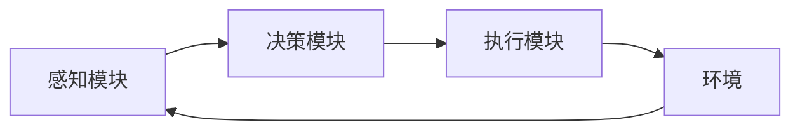

# AI Agent在智能制造过程优化中的角色

> 关键词：AI Agent、智能制造、过程优化、智能决策、自动化控制

> 摘要：本文深入探讨了AI Agent在智能制造过程优化中的角色。首先介绍了相关背景知识，包括目的范围、预期读者等。接着阐述了AI Agent和智能制造的核心概念及其联系，详细讲解了核心算法原理和具体操作步骤，并给出了数学模型和公式。通过项目实战展示了如何在实际中运用AI Agent进行智能制造过程优化，分析了其实际应用场景。同时推荐了学习资源、开发工具框架和相关论文著作。最后总结了未来发展趋势与挑战，并对常见问题进行了解答。旨在为读者全面呈现AI Agent在智能制造过程优化中的重要作用和应用方法。

## 1. 背景介绍 
### 1.1 目的和范围
随着制造业的快速发展，智能制造成为了未来制造业的发展方向。智能制造强调利用先进的信息技术，实现生产过程的自动化、智能化和优化。AI Agent作为一种具有自主决策和学习能力的智能体，能够在智能制造过程中发挥重要作用。本文的目的是深入探讨AI Agent在智能制造过程优化中的角色，分析其原理、应用方法和实际效果。范围涵盖了AI Agent的基本概念、核心算法、数学模型，以及在不同智能制造场景下的应用。

### 1.2 预期读者
本文预期读者包括智能制造领域的工程师、技术研发人员、研究学者，以及对AI和智能制造感兴趣的爱好者。对于工程师和技术研发人员，本文可以为他们在实际项目中应用AI Agent提供理论支持和实践指导；对于研究学者，本文可以为他们的研究提供新的思路和方向；对于爱好者，本文可以帮助他们了解AI Agent在智能制造中的应用，拓宽知识面。

### 1.3 文档结构概述
本文将按照以下结构进行组织：首先介绍相关背景知识，包括目的范围、预期读者等；接着阐述AI Agent和智能制造的核心概念及其联系；然后详细讲解核心算法原理和具体操作步骤，并给出数学模型和公式；通过项目实战展示如何在实际中运用AI Agent进行智能制造过程优化；分析其实际应用场景；推荐学习资源、开发工具框架和相关论文著作；最后总结未来发展趋势与挑战，并对常见问题进行解答。

### 1.4 术语表
#### 1.4.1 核心术语定义
- **AI Agent（人工智能智能体）**：是一种能够感知环境、自主决策并采取行动以实现特定目标的智能实体。它可以是软件程序、机器人或其他具有智能能力的系统。
- **智能制造**：是一种基于新一代信息技术，贯穿于设计、生产、管理、服务等制造活动各个环节，具有信息深度自感知、智慧优化自决策、精准控制自执行等功能的先进制造过程、系统与模式的总称。
- **过程优化**：是指通过对生产过程中的各种因素进行分析和调整，以提高生产效率、降低成本、提升产品质量等为目标的一系列活动。

#### 1.4.2 相关概念解释
- **智能决策**：AI Agent根据感知到的环境信息，运用自身的知识和算法，做出最优的决策。
- **自动化控制**：通过AI Agent对生产设备和过程进行自动控制，实现生产过程的自动化运行。

#### 1.4.3 缩略词列表
- **AI**：Artificial Intelligence，人工智能
- **MES**：Manufacturing Execution System，制造执行系统

## 2. 核心概念与联系 
### 2.1 AI Agent的概念和原理
AI Agent是一种能够感知环境、自主决策并采取行动以实现特定目标的智能实体。它通常由感知模块、决策模块和执行模块组成。感知模块用于获取环境信息，决策模块根据感知到的信息和自身的知识进行决策，执行模块根据决策结果采取相应的行动。

AI Agent的工作原理可以用以下流程图表示：


### 2.2 智能制造的概念和特点
智能制造是一种基于新一代信息技术，贯穿于设计、生产、管理、服务等制造活动各个环节，具有信息深度自感知、智慧优化自决策、精准控制自执行等功能的先进制造过程、系统与模式的总称。其特点包括：
- **高度自动化**：生产过程实现自动化运行，减少人工干预。
- **智能化决策**：利用人工智能技术进行决策，提高决策的准确性和效率。
- **数据驱动**：通过对生产数据的分析和挖掘，实现生产过程的优化和管理。

### 2.3 AI Agent与智能制造的联系
AI Agent在智能制造中扮演着重要的角色，主要体现在以下几个方面：
- **智能决策支持**：AI Agent可以根据生产数据和实时信息，运用智能算法进行决策，为生产过程提供优化建议。
- **自动化控制**：AI Agent可以与生产设备进行交互，实现对生产过程的自动化控制，提高生产效率和质量。
- **故障诊断与预测**：AI Agent可以对生产设备进行实时监测，及时发现故障并进行预测，减少停机时间。

## 3. 核心算法原理 & 具体操作步骤 
### 3.1 强化学习算法原理
强化学习是一种通过智能体与环境进行交互，不断学习最优策略的机器学习方法。在智能制造过程优化中，强化学习可以用于AI Agent的决策制定。其基本原理可以用以下公式表示：

智能体的目标是最大化长期累积奖励 $G_t$：
$$G_t = \sum_{k=0}^{\infty} \gamma^k R_{t+k+1}$$
其中，$R_{t+k+1}$ 是在时间步 $t + k + 1$ 获得的奖励，$\gamma$ 是折扣因子，用于平衡即时奖励和未来奖励。

智能体根据策略 $\pi$ 选择动作 $a_t$：
$$a_t = \pi(s_t)$$
其中，$s_t$ 是时间步 $t$ 的状态。

环境根据状态 $s_t$ 和动作 $a_t$ 转移到下一个状态 $s_{t+1}$，并给出奖励 $R_{t+1}$：
$$s_{t+1} \sim P(s_{t+1}|s_t, a_t)$$
$$R_{t+1} = r(s_t, a_t, s_{t+1})$$

### 3.2 具体操作步骤
以下是使用Python实现一个简单的强化学习算法（Q-learning）的示例代码：
```python
import numpy as np

# 定义环境
class Environment:
    def __init__(self):
        self.num_states = 5
        self.num_actions = 2
        self.rewards = np.array([[0, 1], [1, 0], [0, 1], [1, 0], [0, 1]])

    def step(self, state, action):
        next_state = (state + 1) % self.num_states
        reward = self.rewards[state][action]
        return next_state, reward

# 定义Q-learning算法
class QLearningAgent:
    def __init__(self, num_states, num_actions, learning_rate=0.1, discount_factor=0.9):
        self.num_states = num_states
        self.num_actions = num_actions
        self.learning_rate = learning_rate
        self.discount_factor = discount_factor
        self.q_table = np.zeros((num_states, num_actions))

    def choose_action(self, state):
        if np.random.uniform(0, 1) < 0.1:
            action = np.random.choice(self.num_actions)
        else:
            action = np.argmax(self.q_table[state])
        return action

    def update_q_table(self, state, action, next_state, reward):
        predict = self.q_table[state][action]
        target = reward + self.discount_factor * np.max(self.q_table[next_state])
        self.q_table[state][action] += self.learning_rate * (target - predict)

# 训练过程
env = Environment()
agent = QLearningAgent(env.num_states, env.num_actions)

num_episodes = 1000
for episode in range(num_episodes):
    state = 0
    total_reward = 0
    while True:
        action = agent.choose_action(state)
        next_state, reward = env.step(state, action)
        agent.update_q_table(state, action, next_state, reward)
        state = next_state
        total_reward += reward
        if state == env.num_states - 1:
            break
    if episode % 100 == 0:
        print(f"Episode {episode}: Total Reward = {total_reward}")

```
### 3.3 代码解释
- **Environment类**：定义了环境的状态、动作和奖励。`step` 方法用于根据当前状态和动作返回下一个状态和奖励。
- **QLearningAgent类**：实现了Q-learning算法。`choose_action` 方法用于选择动作，采用了epsilon-greedy策略。`update_q_table` 方法用于更新Q表。
- **训练过程**：通过多次迭代，智能体不断与环境交互，更新Q表，最终学习到最优策略。

## 4. 数学模型和公式 & 详细讲解 & 举例说明 
### 4.1 马尔可夫决策过程（MDP）
马尔可夫决策过程是强化学习的数学基础，它可以用一个五元组 $(S, A, P, R, \gamma)$ 表示：
- $S$：状态集合，表示环境的所有可能状态。
- $A$：动作集合，表示智能体可以采取的所有动作。
- $P$：状态转移概率，$P(s_{t+1}|s_t, a_t)$ 表示在状态 $s_t$ 采取动作 $a_t$ 后转移到状态 $s_{t+1}$ 的概率。
- $R$：奖励函数，$R(s_t, a_t, s_{t+1})$ 表示在状态 $s_t$ 采取动作 $a_t$ 转移到状态 $s_{t+1}$ 时获得的奖励。
- $\gamma$：折扣因子，用于平衡即时奖励和未来奖励。

### 4.2 Q函数和最优Q函数
Q函数 $Q(s, a)$ 表示在状态 $s$ 采取动作 $a$ 后，遵循某一策略所能获得的长期累积奖励的期望值。最优Q函数 $Q^*(s, a)$ 表示在状态 $s$ 采取动作 $a$ 后，遵循最优策略所能获得的长期累积奖励的期望值。

Q-learning算法的目标是学习最优Q函数，其更新公式为：
$$Q(s_t, a_t) \leftarrow Q(s_t, a_t) + \alpha [R_{t+1} + \gamma \max_{a} Q(s_{t+1}, a) - Q(s_t, a_t)]$$
其中，$\alpha$ 是学习率。

### 4.3 举例说明
假设一个简单的智能制造场景，生产线上有三个工位，每个工位有两种操作（加速或减速）。状态 $s$ 表示当前工位的编号，动作 $a$ 表示操作类型。奖励函数根据生产效率和质量进行设定。例如，如果加速操作提高了生产效率且保证了质量，则给予正奖励；如果操作导致质量下降，则给予负奖励。

通过Q-learning算法，AI Agent可以学习到在不同工位采取最优操作，以最大化长期累积奖励，从而实现生产过程的优化。

## 5. 项目实战：代码实际案例和详细解释说明 
### 5.1  开发环境搭建
为了实现AI Agent在智能制造过程优化中的应用，我们需要搭建以下开发环境：
- **Python**：建议使用Python 3.7及以上版本。
- **相关库**：`numpy` 用于数值计算，`pandas` 用于数据处理，`tensorflow` 或 `pytorch` 用于深度学习。

可以使用以下命令安装所需库：
```bash
pip install numpy pandas tensorflow
```

### 5.2  源代码详细实现和代码解读
以下是一个更复杂的智能制造过程优化的Python代码示例，假设我们要优化一个生产线上的机器调度问题：
```python
import numpy as np
import pandas as pd
import tensorflow as tf

# 定义环境
class ManufacturingEnvironment:
    def __init__(self, num_machines, num_jobs):
        self.num_machines = num_machines
        self.num_jobs = num_jobs
        self.job_processing_times = np.random.randint(1, 10, size=(num_jobs, num_machines))
        self.current_state = np.zeros(num_jobs, dtype=int)
        self.completed_jobs = 0
        self.total_time = 0

    def reset(self):
        self.current_state = np.zeros(self.num_jobs, dtype=int)
        self.completed_jobs = 0
        self.total_time = 0
        return self.current_state

    def step(self, action):
        job = action // self.num_machines
        machine = action % self.num_machines
        if self.current_state[job] == machine:
            processing_time = self.job_processing_times[job][machine]
            self.total_time += processing_time
            self.current_state[job] += 1
            if self.current_state[job] == self.num_machines:
                self.completed_jobs += 1
            reward = -processing_time
            done = self.completed_jobs == self.num_jobs
            return self.current_state, reward, done
        else:
            reward = -10  # 无效操作惩罚
            done = False
            return self.current_state, reward, done

# 定义深度Q网络（DQN）
class DQNAgent:
    def __init__(self, state_size, action_size):
        self.state_size = state_size
        self.action_size = action_size
        self.memory = []
        self.gamma = 0.95
        self.epsilon = 1.0
        self.epsilon_min = 0.01
        self.epsilon_decay = 0.995
        self.learning_rate = 0.001
        self.model = self._build_model()

    def _build_model(self):
        model = tf.keras.Sequential([
            tf.keras.layers.Dense(24, input_dim=self.state_size, activation='relu'),
            tf.keras.layers.Dense(24, activation='relu'),
            tf.keras.layers.Dense(self.action_size, activation='linear')
        ])
        model.compile(loss='mse', optimizer=tf.keras.optimizers.Adam(lr=self.learning_rate))
        return model

    def remember(self, state, action, reward, next_state, done):
        self.memory.append((state, action, reward, next_state, done))

    def act(self, state):
        if np.random.rand() <= self.epsilon:
            return np.random.choice(self.action_size)
        act_values = self.model.predict(state)
        return np.argmax(act_values[0])

    def replay(self, batch_size):
        minibatch = np.random.choice(len(self.memory), batch_size, replace=False)
        for state, action, reward, next_state, done in [self.memory[i] for i in minibatch]:
            target = reward
            if not done:
                target = (reward + self.gamma * np.amax(self.model.predict(next_state)[0]))
            target_f = self.model.predict(state)
            target_f[0][action] = target
            self.model.fit(state, target_f, epochs=1, verbose=0)
        if self.epsilon > self.epsilon_min:
            self.epsilon *= self.epsilon_decay

# 训练过程
num_machines = 3
num_jobs = 4
env = ManufacturingEnvironment(num_machines, num_jobs)
state_size = num_jobs
action_size = num_jobs * num_machines
agent = DQNAgent(state_size, action_size)

batch_size = 32
num_episodes = 1000
for episode in range(num_episodes):
    state = env.reset()
    state = np.reshape(state, [1, state_size])
    total_reward = 0
    done = False
    while not done:
        action = agent.act(state)
        next_state, reward, done = env.step(action)
        next_state = np.reshape(next_state, [1, state_size])
        agent.remember(state, action, reward, next_state, done)
        state = next_state
        total_reward += reward
        if len(agent.memory) > batch_size:
            agent.replay(batch_size)
    if episode % 100 == 0:
        print(f"Episode {episode}: Total Reward = {total_reward}")

```
### 5.3  代码解读与分析
- **ManufacturingEnvironment类**：定义了智能制造环境，包括机器数量、作业数量、作业处理时间等。`reset` 方法用于重置环境状态，`step` 方法根据动作更新环境状态并返回奖励和是否完成的标志。
- **DQNAgent类**：实现了深度Q网络（DQN）算法。`_build_model` 方法构建了一个简单的神经网络模型，`remember` 方法用于存储经验，`act` 方法根据epsilon-greedy策略选择动作，`replay` 方法用于经验回放和模型训练。
- **训练过程**：通过多次迭代，智能体不断与环境交互，存储经验并进行模型训练，最终学习到最优的机器调度策略。

## 6. 实际应用场景 
### 6.1 生产调度优化
AI Agent可以根据生产订单、设备状态、人员安排等信息，实时优化生产调度计划，提高生产效率和资源利用率。例如，在多品种小批量生产中，AI Agent可以根据订单优先级和设备负荷，动态调整生产顺序，减少设备闲置时间和生产周期。

### 6.2 质量控制
AI Agent可以对生产过程中的质量数据进行实时监测和分析，及时发现质量问题并采取相应的措施。例如，通过对产品尺寸、外观等参数的实时监测，AI Agent可以判断产品是否合格，并对生产设备进行调整，保证产品质量的稳定性。

### 6.3 设备维护
AI Agent可以对生产设备的运行状态进行实时监测，预测设备故障并提前安排维护计划。例如，通过对设备的振动、温度、电流等参数的监测，AI Agent可以判断设备是否存在潜在故障，并在设备故障发生前进行维护，减少设备停机时间和维修成本。

## 7. 工具和资源推荐
### 7.1 学习资源推荐
#### 7.1.1 书籍推荐
- 《强化学习：原理与Python实现》：详细介绍了强化学习的基本原理和Python实现方法。
- 《智能制造：概念、技术与应用》：全面介绍了智能制造的概念、技术和应用案例。

#### 7.1.2 在线课程
- Coursera上的“强化学习专项课程”：由知名教授授课，系统讲解强化学习的理论和实践。
- edX上的“智能制造基础”：介绍了智能制造的基本概念、技术和应用。

#### 7.1.3 技术博客和网站
- Medium上的“AI in Manufacturing”：分享了AI在智能制造领域的最新研究成果和应用案例。
- 中国智能制造网：提供了智能制造领域的行业资讯、技术文章和产品信息。

### 7.2 开发工具框架推荐
#### 7.2.1 IDE和编辑器
- PyCharm：一款专业的Python集成开发环境，提供了丰富的代码编辑、调试和分析功能。
- Jupyter Notebook：一个交互式的编程环境，适合进行数据探索和模型开发。

#### 7.2.2 调试和性能分析工具
- TensorBoard：TensorFlow的可视化工具，用于监控模型训练过程和分析模型性能。
- Py-Spy：一个Python性能分析工具，可以帮助开发者找出代码中的性能瓶颈。

#### 7.2.3 相关框架和库
- TensorFlow：一个开源的深度学习框架，提供了丰富的深度学习模型和工具。
- PyTorch：另一个流行的深度学习框架，具有简洁易用的特点。

### 7.3 相关论文著作推荐
#### 7.3.1 经典论文
- “Reinforcement Learning: An Introduction”：强化学习领域的经典著作，系统介绍了强化学习的基本理论和算法。
- “Deep Reinforcement Learning for Autonomous Driving”：介绍了深度强化学习在自动驾驶领域的应用。

#### 7.3.2 最新研究成果
- 每年在ACM SIGKDD、IEEE ICML等顶级学术会议上发表的关于AI和智能制造的研究论文。

#### 7.3.3 应用案例分析
- 《智能制造案例集》：收集了国内外智能制造领域的成功应用案例，对实际项目具有很强的指导意义。

## 8. 总结：未来发展趋势与挑战
### 8.1 未来发展趋势
- **与物联网的深度融合**：AI Agent将与物联网技术相结合，实现对生产设备和环境的实时感知和控制，提高智能制造的智能化水平。
- **多智能体协作**：多个AI Agent可以协同工作，共同完成复杂的智能制造任务，如多机器人协作装配、供应链协同优化等。
- **可解释性AI**：未来的AI Agent将更加注重可解释性，能够向人类用户解释其决策过程和依据，提高用户对AI Agent的信任度。

### 8.2 挑战
- **数据安全和隐私**：智能制造过程中涉及大量的敏感数据，如生产工艺、客户信息等，如何保障数据的安全和隐私是一个重要的挑战。
- **算法复杂度和计算资源需求**：一些复杂的AI算法需要大量的计算资源和时间，如何在有限的资源下实现高效的算法是一个亟待解决的问题。
- **人机协作的挑战**：在智能制造中，人机协作是不可避免的，如何实现人与AI Agent的高效协作，发挥各自的优势，是一个需要深入研究的问题。

## 9. 附录：常见问题与解答
### 9.1 AI Agent在智能制造中一定能提高生产效率吗？
不一定。AI Agent的效果取决于多种因素，如数据质量、算法选择、环境复杂性等。如果数据不准确或算法不适合，AI Agent可能无法达到预期的效果。因此，在应用AI Agent时，需要进行充分的测试和验证。

### 9.2 如何评估AI Agent在智能制造过程优化中的效果？
可以从多个方面评估AI Agent的效果，如生产效率、产品质量、成本降低等。可以通过对比应用AI Agent前后的相关指标，来评估其效果。同时，还可以使用一些评估指标，如平均奖励、成功率等，来评估AI Agent的性能。

### 9.3 AI Agent在智能制造中的应用是否需要大量的专业知识？
是的。AI Agent在智能制造中的应用需要涉及到人工智能、机器学习、控制理论等多个领域的专业知识。同时，还需要对智能制造的业务流程和生产工艺有深入的了解。因此，在应用AI Agent时，需要专业的技术人员进行开发和维护。

## 10. 扩展阅读 & 参考资料
- Sutton, R. S., & Barto, A. G. (2018). Reinforcement learning: An introduction. MIT press.
- Lu, Y., Xu, X., & Li, L. (2018). A review of deep learning in manufacturing: Methods and applications. Annual Review of Control, 46, 153-178.
- 中国智能制造发展报告（2023）

作者：AI天才研究院/AI Genius Institute & 禅与计算机程序设计艺术 /Zen And The Art of Computer Programming