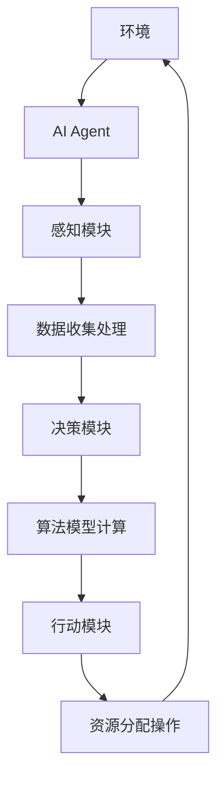

# AI Agent在智能医疗资源分配中的角色

> 关键词：AI Agent、智能医疗、资源分配、医疗决策、自动化调度

> 摘要：本文深入探讨了AI Agent在智能医疗资源分配中的角色。首先介绍了相关背景，包括研究目的、预期读者、文档结构和术语定义。接着阐述了AI Agent、智能医疗资源分配等核心概念及其联系，给出了原理和架构的文本示意图与Mermaid流程图。详细讲解了核心算法原理，并用Python代码进行说明，同时介绍了相关数学模型和公式。通过项目实战，展示了代码的实际案例和详细解读。分析了AI Agent在智能医疗资源分配中的实际应用场景，推荐了学习资源、开发工具框架和相关论文著作。最后总结了未来发展趋势与挑战，解答了常见问题并提供了扩展阅读和参考资料，旨在全面剖析AI Agent在智能医疗资源分配中的重要作用和价值。

## 1. 背景介绍 
### 1.1 目的和范围
在当今的医疗领域，随着人口老龄化的加剧、疾病种类的增多以及患者数量的不断增长，医疗资源的合理分配变得至关重要。有限的医疗资源（如床位、设备、医护人员等）与日益增长的医疗需求之间的矛盾日益突出。AI Agent作为一种具有自主决策和行动能力的智能实体，能够在智能医疗资源分配中发挥关键作用。本文的目的是深入研究AI Agent在智能医疗资源分配中的角色，探讨其如何通过先进的算法和技术，实现医疗资源的高效、公平分配。研究范围涵盖了AI Agent的基本概念、相关算法原理、数学模型，以及在实际医疗场景中的应用案例和未来发展趋势。

### 1.2 预期读者
本文的预期读者主要包括医疗行业的管理人员、医疗信息技术专家、人工智能研究人员以及对智能医疗和资源分配感兴趣的技术爱好者。医疗行业管理人员可以通过本文了解如何利用AI Agent优化医疗资源分配，提高医疗服务的效率和质量；医疗信息技术专家可以从中获取技术实现的思路和方法，开发更智能的医疗资源分配系统；人工智能研究人员可以深入探讨AI Agent在医疗领域的应用，推动相关技术的发展；技术爱好者则可以通过本文了解AI Agent在智能医疗中的实际应用，拓宽知识面。

### 1.3 文档结构概述
本文共分为十个部分。第一部分为背景介绍，阐述了研究的目的、预期读者、文档结构和术语定义；第二部分介绍核心概念与联系，包括AI Agent、智能医疗资源分配等概念的原理和架构，并给出相应的文本示意图和Mermaid流程图；第三部分详细讲解核心算法原理和具体操作步骤，并用Python源代码进行说明；第四部分介绍数学模型和公式，通过详细讲解和举例说明，帮助读者理解相关数学原理；第五部分为项目实战，展示代码的实际案例，包括开发环境搭建、源代码详细实现和代码解读；第六部分分析AI Agent在智能医疗资源分配中的实际应用场景；第七部分推荐学习资源、开发工具框架和相关论文著作；第八部分总结未来发展趋势与挑战；第九部分为附录，解答常见问题；第十部分提供扩展阅读和参考资料。

### 1.4 术语表
#### 1.4.1 核心术语定义
- **AI Agent**：人工智能代理，是一种能够感知环境、自主决策并采取行动以实现特定目标的智能实体。在智能医疗资源分配中，AI Agent可以根据患者的病情、医疗资源的状态等信息，做出合理的资源分配决策。
- **智能医疗资源分配**：指利用先进的信息技术和智能算法，对医疗资源（如床位、设备、医护人员等）进行合理、高效的分配，以满足患者的医疗需求，提高医疗服务的质量和效率。
- **医疗决策**：在医疗过程中，根据患者的病情、检查结果、治疗方案等信息，做出的关于诊断、治疗、资源分配等方面的决策。
- **自动化调度**：通过计算机程序自动对资源进行调度和安排，减少人工干预，提高调度的准确性和效率。

#### 1.4.2 相关概念解释
- **感知能力**：AI Agent能够通过各种传感器和数据接口，获取环境中的信息，如患者的基本信息、病情状况、医疗资源的使用情况等。
- **决策能力**：基于感知到的信息，AI Agent运用先进的算法和模型，对各种可能的行动方案进行评估和选择，做出最优的决策。
- **行动能力**：AI Agent根据决策结果，采取相应的行动，如分配床位、安排检查、调度医护人员等。

#### 1.4.3 缩略词列表
- **AI**：Artificial Intelligence，人工智能
- **ML**：Machine Learning，机器学习
- **RL**：Reinforcement Learning，强化学习

## 2. 核心概念与联系 
### 核心概念原理
#### AI Agent原理
AI Agent的核心原理基于感知 - 决策 - 行动的循环。它通过传感器感知环境中的信息，将这些信息输入到决策模块中。决策模块运用各种算法和模型，对信息进行分析和处理，评估不同行动方案的优劣，选择最优的行动方案。最后，行动模块根据决策结果，采取相应的行动，改变环境状态。在智能医疗资源分配中，AI Agent可以感知患者的病情、医疗资源的使用情况等信息，通过决策算法确定最佳的资源分配方案，然后执行分配操作。

#### 智能医疗资源分配原理
智能医疗资源分配的原理是根据患者的医疗需求和医疗资源的状态，运用优化算法，实现资源的合理配置。首先，需要对患者的病情进行评估，确定其对医疗资源的需求程度。然后，实时监测医疗资源的使用情况，包括床位、设备、医护人员等的可用性。最后，通过优化算法，将资源分配给最需要的患者，以提高医疗资源的利用效率和患者的治疗效果。

### 架构的文本示意图
```plaintext
                          环境
                           |
                           | 感知信息
                           |
                    AI Agent
            /             |             \
        感知模块       决策模块       行动模块
            |             |             |
            | 信息输入    | 决策结果    | 行动执行
            |             |             |
      数据收集处理  算法模型计算  资源分配操作
```

### Mermaid流程图


## 3. 核心算法原理 & 具体操作步骤 
### 核心算法原理
在智能医疗资源分配中，常用的算法包括机器学习算法和强化学习算法。这里以强化学习算法为例进行讲解。

强化学习是一种通过智能体与环境进行交互，不断尝试不同的行动，根据环境反馈的奖励信号来学习最优策略的算法。在智能医疗资源分配中，AI Agent作为智能体，环境为医疗系统，行动为资源分配操作，奖励信号可以根据患者的治疗效果、资源的利用效率等因素来定义。

### 具体操作步骤
1. **定义状态空间**：状态空间表示环境的所有可能状态。在智能医疗资源分配中，状态可以包括患者的病情、医疗资源的使用情况等信息。
2. **定义动作空间**：动作空间表示AI Agent可以采取的所有可能行动。例如，分配床位、安排检查、调度医护人员等。
3. **定义奖励函数**：奖励函数用于评估AI Agent采取某个行动后的效果。例如，如果分配资源后患者的治疗效果得到改善，或者资源的利用效率提高，则给予正奖励；反之，给予负奖励。
4. **选择策略**：AI Agent根据当前状态，选择一个行动。常用的策略包括贪心策略、ε - 贪心策略等。
5. **与环境交互**：AI Agent执行选择的行动，环境根据行动更新状态，并返回奖励信号。
6. **更新策略**：AI Agent根据奖励信号，更新策略，以提高未来获得更多奖励的可能性。

### Python源代码详细阐述
```python
import numpy as np

# 定义状态空间
state_space = 10  # 假设有10种不同的状态
# 定义动作空间
action_space = 5  # 假设有5种不同的动作
# 初始化Q表
Q_table = np.zeros((state_space, action_space))
# 定义超参数
alpha = 0.1  # 学习率
gamma = 0.9  # 折扣因子
epsilon = 0.1  # 探索率
episodes = 1000  # 训练轮数

# 定义奖励函数
def reward_function(state, action):
    # 这里简单假设一个奖励函数，实际应用中需要根据具体情况定义
    if state == 0 and action == 0:
        return 1
    else:
        return -1

# 选择动作
def choose_action(state):
    if np.random.uniform(0, 1) < epsilon:
        # 探索：随机选择一个动作
        action = np.random.choice(action_space)
    else:
        # 利用：选择Q表中值最大的动作
        action = np.argmax(Q_table[state, :])
    return action

# 训练过程
for episode in range(episodes):
    state = np.random.randint(0, state_space)  # 随机初始化状态
    done = False
    while not done:
        action = choose_action(state)
        reward = reward_function(state, action)
        # 假设下一状态是随机的，实际应用中需要根据具体情况更新
        next_state = np.random.randint(0, state_space)
        # 更新Q表
        Q_table[state, action] = (1 - alpha) * Q_table[state, action] + alpha * (reward + gamma * np.max(Q_table[next_state, :]))
        state = next_state
        # 简单假设当奖励为1时，结束当前回合
        if reward == 1:
            done = True

print("训练完成后的Q表：")
print(Q_table)
```

## 4. 数学模型和公式 & 详细讲解 & 举例说明 
### 强化学习数学模型
强化学习的数学模型主要基于马尔可夫决策过程（MDP）。一个马尔可夫决策过程可以用一个五元组 $<S, A, P, R, \gamma>$ 表示，其中：
- $S$ 是状态空间，表示环境的所有可能状态。
- $A$ 是动作空间，表示智能体可以采取的所有可能行动。
- $P(s'|s, a)$ 是状态转移概率，表示在状态 $s$ 下采取行动 $a$ 后，转移到状态 $s'$ 的概率。
- $R(s, a)$ 是奖励函数，表示在状态 $s$ 下采取行动 $a$ 后获得的即时奖励。
- $\gamma$ 是折扣因子，用于衡量未来奖励的重要性，取值范围为 $[0, 1]$。

### Q - 学习算法公式
Q - 学习是一种无模型的强化学习算法，用于学习最优的动作价值函数 $Q(s, a)$。Q - 学习的更新公式如下：
$$Q(s, a) \leftarrow (1 - \alpha)Q(s, a) + \alpha[R(s, a) + \gamma \max_{a'} Q(s', a')]$$
其中：
- $\alpha$ 是学习率，控制每次更新的步长。
- $R(s, a)$ 是在状态 $s$ 下采取行动 $a$ 后获得的即时奖励。
- $\gamma$ 是折扣因子。
- $s'$ 是采取行动 $a$ 后转移到的下一个状态。
- $\max_{a'} Q(s', a')$ 表示在下一个状态 $s'$ 下，所有可能行动的最大Q值。

### 详细讲解
Q - 学习算法的核心思想是通过不断地与环境交互，更新Q表，使得Q表中的值逐渐逼近最优的动作价值函数。在每一轮交互中，智能体根据当前状态 $s$ 选择一个行动 $a$，执行该行动后，环境返回奖励 $R(s, a)$ 并转移到下一个状态 $s'$。然后，根据Q - 学习的更新公式，更新Q表中 $(s, a)$ 对应的Q值。通过多次迭代，Q表中的值会逐渐收敛到最优值，从而得到最优的策略。

### 举例说明
假设在智能医疗资源分配中，状态空间 $S = \{s_1, s_2, s_3\}$ 表示三种不同的患者病情状态，动作空间 $A = \{a_1, a_2\}$ 表示两种不同的资源分配方案。初始时，Q表中的值都为0。

在某一轮交互中，当前状态 $s = s_1$，智能体选择行动 $a = a_1$，执行该行动后，获得奖励 $R(s_1, a_1) = 1$，并转移到下一个状态 $s' = s_2$。假设学习率 $\alpha = 0.1$，折扣因子 $\gamma = 0.9$，Q表中 $Q(s_1, a_1) = 0$，$Q(s_2, a_1) = 0$，$Q(s_2, a_2) = 0$。

根据Q - 学习的更新公式，更新 $Q(s_1, a_1)$ 的值：
$$Q(s_1, a_1) = (1 - 0.1) \times 0 + 0.1 \times (1 + 0.9 \times \max\{0, 0\}) = 0.1$$

经过多次迭代，Q表中的值会不断更新，最终收敛到最优值，智能体可以根据最优的Q表做出最优的资源分配决策。

## 5. 项目实战：代码实际案例和详细解释说明 
### 5.1  开发环境搭建
#### 安装Python
首先，需要安装Python环境。可以从Python官方网站（https://www.python.org/downloads/）下载适合自己操作系统的Python版本，并按照安装向导进行安装。

#### 安装必要的库
在智能医疗资源分配的项目中，需要使用一些Python库，如NumPy、Pandas等。可以使用以下命令进行安装：
```bash
pip install numpy pandas
```

### 5.2  源代码详细实现和代码解读
```python
import numpy as np
import pandas as pd

# 定义患者类
class Patient:
    def __init__(self, id, condition):
        self.id = id
        self.condition = condition  # 患者病情，取值范围可以是1 - 10，数值越大表示病情越严重

# 定义医疗资源类
class MedicalResource:
    def __init__(self, id, type):
        self.id = id
        self.type = type  # 资源类型，如床位、设备等
        self.available = True

# 定义AI Agent类
class AIAgent:
    def __init__(self, patients, resources):
        self.patients = patients
        self.resources = resources

    def assign_resources(self):
        # 按照病情严重程度对患者进行排序
        sorted_patients = sorted(self.patients, key=lambda x: x.condition, reverse=True)
        for patient in sorted_patients:
            for resource in self.resources:
                if resource.available:
                    # 分配资源给患者
                    print(f"将资源 {resource.id} 分配给患者 {patient.id}")
                    resource.available = False
                    break

# 生成患者和资源数据
patients = [Patient(1, 8), Patient(2, 3), Patient(3, 6)]
resources = [MedicalResource(1, '床位'), MedicalResource(2, '床位')]

# 创建AI Agent实例
agent = AIAgent(patients, resources)

# 执行资源分配操作
agent.assign_resources()
```

### 代码解读与分析
#### 患者类（Patient）
该类用于表示患者，包含患者的ID和病情信息。病情信息用一个数值表示，数值越大表示病情越严重。

#### 医疗资源类（MedicalResource）
该类用于表示医疗资源，包含资源的ID、类型和可用性信息。资源类型可以是床位、设备等，可用性信息表示该资源是否可用。

#### AI Agent类（AIAgent）
该类是核心类，用于实现资源分配功能。在初始化时，需要传入患者列表和资源列表。`assign_resources` 方法实现了资源分配的逻辑，首先按照病情严重程度对患者进行排序，然后依次为患者分配可用的资源。

#### 主程序
在主程序中，生成了一些患者和资源数据，创建了AI Agent实例，并调用 `assign_resources` 方法执行资源分配操作。

通过这个简单的项目实战，展示了AI Agent在智能医疗资源分配中的基本应用。在实际应用中，需要根据具体需求对代码进行扩展和优化。

## 6. 实际应用场景 
### 医院床位分配
在医院中，床位是一种重要的医疗资源。AI Agent可以根据患者的病情、住院时间等信息，对床位进行合理分配。例如，对于病情严重的患者，优先分配靠近急救室和护士站的床位；对于需要特殊治疗的患者，分配到相应的专科病房。通过AI Agent的自动化调度，可以提高床位的利用率，减少患者的等待时间。

### 医疗设备调度
医院拥有各种先进的医疗设备，如CT、MRI等。AI Agent可以实时监测设备的使用情况，根据患者的检查需求和设备的空闲时间，合理安排检查顺序。例如，对于紧急需要检查的患者，优先安排设备进行检查；对于可以等待的患者，安排在设备空闲时间进行检查。这样可以提高设备的使用效率，减少患者的检查等待时间。

### 医护人员排班
医护人员的合理排班对于保证医疗服务的质量和效率至关重要。AI Agent可以根据医护人员的技能水平、工作经验、工作时间等信息，结合患者的需求，制定合理的排班计划。例如，在高峰期安排更多的医护人员值班；对于特殊科室，安排具有相应技能的医护人员。通过AI Agent的排班系统，可以提高医护人员的工作效率，减少人力成本。

### 远程医疗资源分配
随着远程医疗的发展，远程医疗资源（如远程诊断设备、远程医疗专家等）的分配也变得越来越重要。AI Agent可以根据患者的地理位置、病情严重程度等信息，合理分配远程医疗资源。例如，对于偏远地区的患者，优先分配远程诊断设备；对于疑难病症患者，安排远程医疗专家进行会诊。通过AI Agent的远程医疗资源分配系统，可以提高远程医疗的服务质量，扩大医疗服务的覆盖范围。

## 7. 工具和资源推荐
### 7.1 学习资源推荐
#### 7.1.1 书籍推荐
- 《人工智能：一种现代的方法》：这本书是人工智能领域的经典教材，全面介绍了人工智能的基本概念、算法和应用。书中包含了强化学习、机器学习等相关内容，对于理解AI Agent的原理和应用有很大帮助。
- 《Python机器学习》：该书详细介绍了Python在机器学习领域的应用，包括各种机器学习算法的原理和实现。通过学习这本书，可以掌握使用Python进行机器学习编程的技能，为开发智能医疗资源分配系统打下基础。
- 《医疗信息学》：这本书专注于医疗领域的信息技术应用，介绍了医疗数据管理、医疗决策支持系统等方面的知识。对于了解智能医疗资源分配的背景和需求有很大帮助。

#### 7.1.2 在线课程
- Coursera上的“人工智能基础”课程：该课程由知名高校的教授授课，系统地介绍了人工智能的基本概念、算法和应用。课程内容丰富，包含了大量的案例分析和实践项目，适合初学者学习。
- edX上的“机器学习”课程：该课程由著名机器学习专家授课，深入讲解了机器学习的各种算法和模型。通过学习该课程，可以掌握机器学习的核心知识和技能，为开发AI Agent提供技术支持。
- 中国大学MOOC上的“智能医疗技术”课程：该课程结合了医疗领域的实际需求，介绍了智能医疗技术的应用和发展。课程内容包括医疗数据挖掘、医疗影像分析等方面，对于了解智能医疗资源分配的应用场景有很大帮助。

#### 7.1.3 技术博客和网站
- Medium：这是一个知名的技术博客平台，上面有很多关于人工智能、机器学习、智能医疗等领域的优秀文章。可以通过关注相关的作者和主题，获取最新的技术动态和研究成果。
- Towards Data Science：该网站专注于数据科学和机器学习领域，提供了大量的技术文章、教程和案例分析。通过阅读这些文章，可以了解到最新的技术趋势和应用案例，为开发智能医疗资源分配系统提供灵感。
- 丁香园：这是一个专业的医疗资讯网站，提供了丰富的医疗行业信息和学术资源。可以通过该网站了解医疗行业的最新动态和需求，为AI Agent在智能医疗资源分配中的应用提供背景知识。

### 7.2 开发工具框架推荐
#### 7.2.1 IDE和编辑器
- PyCharm：这是一款专业的Python集成开发环境，提供了丰富的代码编辑、调试、测试等功能。它支持多种Python库和框架，对于开发智能医疗资源分配系统非常方便。
- Jupyter Notebook：这是一个基于Web的交互式开发环境，支持Python、R等多种编程语言。它可以将代码、文本、图表等内容整合在一起，方便进行数据分析和模型开发。在开发智能医疗资源分配系统时，可以使用Jupyter Notebook进行数据探索和模型实验。
- Visual Studio Code：这是一款轻量级的代码编辑器，支持多种编程语言和插件。它具有丰富的代码编辑功能和调试功能，适合快速开发和调试智能医疗资源分配系统。

#### 7.2.2 调试和性能分析工具
- PDB：这是Python自带的调试工具，可以在代码中设置断点，逐步执行代码，查看变量的值和程序的执行流程。在开发智能医疗资源分配系统时，可以使用PDB进行代码调试，找出程序中的错误和问题。
- cProfile：这是Python的性能分析工具，可以统计程序中各个函数的执行时间和调用次数，帮助开发者找出程序的性能瓶颈。在开发智能医疗资源分配系统时，可以使用cProfile进行性能分析，优化程序的性能。
- TensorBoard：这是TensorFlow提供的可视化工具，可以用于可视化神经网络的训练过程、模型结构和性能指标。在开发基于深度学习的智能医疗资源分配系统时，可以使用TensorBoard进行模型可视化和性能分析。

#### 7.2.3 相关框架和库
- NumPy：这是Python的一个基础科学计算库，提供了高效的多维数组对象和各种数学函数。在开发智能医疗资源分配系统时，可以使用NumPy进行数据处理和数值计算。
- Pandas：这是一个用于数据处理和分析的Python库，提供了数据结构和数据分析工具。在开发智能医疗资源分配系统时，可以使用Pandas进行数据清洗、转换和分析。
- TensorFlow：这是一个开源的深度学习框架，提供了丰富的深度学习模型和工具。在开发基于深度学习的智能医疗资源分配系统时，可以使用TensorFlow构建和训练模型。
- PyTorch：这是另一个流行的深度学习框架，具有简洁易用的接口和高效的计算性能。在开发基于深度学习的智能医疗资源分配系统时，也可以选择使用PyTorch。

### 7.3 相关论文著作推荐
#### 7.3.1 经典论文
- “Reinforcement Learning: An Introduction”：这篇论文是强化学习领域的经典之作，系统地介绍了强化学习的基本概念、算法和应用。对于理解AI Agent在智能医疗资源分配中的应用原理有很大帮助。
- “Deep Learning”：这篇论文由深度学习领域的三位著名学者撰写，全面介绍了深度学习的基本概念、模型和应用。在开发基于深度学习的智能医疗资源分配系统时，可以参考这篇论文。
- “Medical Resource Allocation Using Artificial Intelligence”：这篇论文专门探讨了人工智能在医疗资源分配中的应用，介绍了各种人工智能算法和模型在医疗资源分配中的应用案例和效果。

#### 7.3.2 最新研究成果
- 在各大学术数据库（如IEEE Xplore、ACM Digital Library、PubMed等）上搜索关于“AI Agent in Medical Resource Allocation”的最新研究论文。这些论文通常包含了最新的技术和方法，对于了解该领域的最新发展趋势有很大帮助。
- 关注顶级学术会议（如NeurIPS、ICML、AAAI等）上关于人工智能和医疗领域的研究成果。这些会议上的论文往往代表了该领域的最新研究水平。

#### 7.3.3 应用案例分析
- 一些医疗行业的研究报告和案例分析，介绍了AI Agent在实际医疗资源分配中的应用案例和效果。可以通过阅读这些报告和案例分析，了解AI Agent在实际应用中的优势和挑战，为开发自己的智能医疗资源分配系统提供参考。

## 8. 总结：未来发展趋势与挑战
### 未来发展趋势
#### 与大数据和物联网的深度融合
随着大数据和物联网技术的发展，医疗领域将产生大量的数据。AI Agent可以与大数据和物联网技术深度融合，实时获取患者的健康数据、医疗设备的运行状态等信息，从而更加准确地进行医疗资源分配。例如，通过物联网设备实时监测患者的生命体征，AI Agent可以根据这些数据及时调整资源分配方案，提高医疗服务的及时性和准确性。

#### 多智能体协同合作
在复杂的医疗环境中，单个AI Agent可能无法满足所有的需求。未来，多个AI Agent可以协同合作，共同完成医疗资源分配任务。例如，不同科室的AI Agent可以相互协作，共享信息，根据患者的病情和科室的资源情况，进行全局的资源分配优化。

#### 个性化医疗资源分配
随着精准医学的发展，未来的医疗资源分配将更加注重个性化。AI Agent可以根据患者的基因信息、生活习惯、病情历史等因素，为患者提供个性化的医疗资源分配方案。例如，对于具有特定基因突变的患者，优先分配适合的治疗设备和药物。

#### 伦理和法律规范的完善
随着AI Agent在智能医疗资源分配中的应用越来越广泛，伦理和法律问题也将越来越受到关注。未来，需要建立完善的伦理和法律规范，确保AI Agent的决策符合伦理道德和法律法规的要求。例如，规定AI Agent在资源分配时应遵循公平、公正、公开的原则，保护患者的隐私和权益。

### 挑战
#### 数据质量和安全问题
医疗数据的质量和安全是AI Agent在智能医疗资源分配中面临的重要挑战。医疗数据往往存在噪声、缺失值等问题，需要进行数据清洗和预处理。同时，医疗数据包含患者的敏感信息，需要采取严格的安全措施，防止数据泄露和滥用。

#### 算法的可解释性
AI Agent的决策过程往往是基于复杂的算法和模型，其决策结果可能难以解释。在医疗领域，可解释性是非常重要的，医生和患者需要了解AI Agent的决策依据。因此，需要研究开发具有可解释性的算法和模型，提高AI Agent决策的透明度和可信度。

#### 医疗行业的复杂性
医疗行业具有高度的复杂性，涉及到医学知识、伦理道德、法律法规等多个方面。AI Agent需要具备丰富的医学知识和对伦理道德、法律法规的理解，才能做出合理的资源分配决策。如何让AI Agent学习和理解这些复杂的知识和规则，是一个挑战。

#### 人机协作问题
在智能医疗资源分配中，AI Agent需要与医护人员进行协作。如何实现人机之间的有效沟通和协作，是一个需要解决的问题。例如，如何让医护人员信任AI Agent的决策，如何让AI Agent理解医护人员的意图和需求。

## 9. 附录：常见问题与解答
### 问题1：AI Agent在智能医疗资源分配中的决策是否可靠？
解答：AI Agent的决策可靠性取决于多个因素，包括数据质量、算法模型的准确性和可解释性等。如果使用高质量的医疗数据，采用经过验证的算法模型，并确保模型具有可解释性，那么AI Agent的决策可以具有较高的可靠性。同时，在实际应用中，还需要医护人员对AI Agent的决策进行审核和验证，以确保决策的合理性和安全性。

### 问题2：AI Agent能否完全取代医护人员进行医疗资源分配？
解答：目前来看，AI Agent不能完全取代医护人员进行医疗资源分配。虽然AI Agent可以通过算法和模型进行快速、准确的资源分配决策，但医疗资源分配不仅仅是一个技术问题，还涉及到伦理道德、人文关怀等多个方面。医护人员具有丰富的临床经验和人文素养，能够根据患者的具体情况进行综合判断和决策。因此，在智能医疗资源分配中，AI Agent应该作为医护人员的辅助工具，与医护人员共同完成资源分配任务。

### 问题3：如何确保AI Agent在医疗资源分配中遵循伦理道德和法律法规？
解答：为了确保AI Agent在医疗资源分配中遵循伦理道德和法律法规，需要从多个方面入手。首先，在算法设计和开发过程中，应该将伦理道德和法律法规的要求纳入考虑，设计具有伦理意识的算法。其次，建立完善的审核和监督机制，对AI Agent的决策进行审核和监督，确保其决策符合伦理道德和法律法规的要求。此外，还需要加强对AI Agent开发者和使用者的伦理道德和法律法规教育，提高他们的法律意识和道德水平。

### 问题4：AI Agent在智能医疗资源分配中会面临哪些数据隐私问题？
解答：AI Agent在智能医疗资源分配中会面临多种数据隐私问题。医疗数据包含患者的敏感信息，如个人身份信息、健康状况、疾病史等。如果这些数据被泄露或滥用，可能会对患者的权益造成损害。在数据收集阶段，需要确保患者的知情同意，明确告知患者数据的使用目的和方式。在数据存储和传输过程中，需要采取加密等安全措施，防止数据被窃取或篡改。在数据使用阶段，需要严格控制数据的访问权限，确保只有授权人员才能访问和使用数据。

## 10. 扩展阅读 & 参考资料
### 扩展阅读
- 《人工智能时代的医疗变革》：这本书探讨了人工智能在医疗领域的应用和发展趋势，以及对医疗行业带来的变革和挑战。通过阅读这本书，可以进一步了解AI Agent在智能医疗中的应用背景和发展前景。
- 《医疗大数据与人工智能》：该书介绍了医疗大数据的特点和应用，以及人工智能在医疗大数据分析中的应用技术和方法。对于理解AI Agent在智能医疗资源分配中如何利用医疗大数据进行决策有很大帮助。
- 《智能医疗系统设计与开发》：这本书详细介绍了智能医疗系统的设计原则、开发方法和应用案例。在开发智能医疗资源分配系统时，可以参考这本书的内容，提高系统的设计和开发水平。

### 参考资料
- 相关学术论文和研究报告，如IEEE、ACM等学术数据库中的论文，以及各大医疗研究机构发布的研究报告。
- 医疗行业的标准和规范，如《医疗信息系统安全技术要求》、《电子病历系统功能规范》等。
- 开源项目和代码库，如GitHub上的相关项目，可以参考这些项目的代码实现和开发经验。

作者：AI天才研究院/AI Genius Institute & 禅与计算机程序设计艺术 /Zen And The Art of Computer Programming