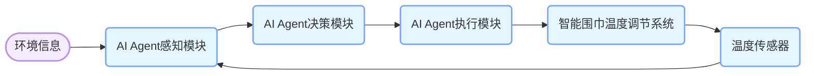

# AI Agent在智能围巾中的温度调节

> 关键词：AI Agent、智能围巾、温度调节、机器学习、传感器技术

> 摘要：本文深入探讨了AI Agent在智能围巾温度调节中的应用。首先介绍了相关背景，包括研究目的、预期读者、文档结构和术语定义。接着阐述了核心概念，如AI Agent和智能围巾温度调节的原理及联系，并给出了相应的示意图和流程图。详细讲解了核心算法原理及具体操作步骤，通过Python代码进行了说明。分析了相关的数学模型和公式，并举例说明。通过项目实战展示了代码的实际案例及详细解释。探讨了实际应用场景，推荐了学习资源、开发工具框架和相关论文著作。最后总结了未来发展趋势与挑战，并提供了常见问题解答和扩展阅读参考资料，旨在为智能围巾温度调节领域的研究和开发提供全面的技术指导。

## 1. 背景介绍 
### 1.1 目的和范围
随着科技的不断发展，可穿戴设备越来越受到人们的关注。智能围巾作为一种新兴的可穿戴设备，具有巨大的市场潜力。其温度调节功能能够为用户在不同的环境温度下提供舒适的体验。本研究的目的在于深入探讨如何利用AI Agent实现智能围巾的高效温度调节。具体范围包括研究AI Agent的工作原理、相关算法在温度调节中的应用，以及如何结合传感器技术实现精确的温度控制。

### 1.2 预期读者
本文预期读者主要包括计算机科学、电子工程、智能穿戴设备等领域的研究人员和开发者。对于对人工智能和可穿戴设备感兴趣的爱好者，本文也能提供一定的技术参考。同时，相关行业的产品经理和市场营销人员也可以通过本文了解智能围巾温度调节技术的发展趋势，为产品规划和市场推广提供依据。

### 1.3 文档结构概述
本文将按照以下结构进行组织：首先介绍背景知识，包括研究目的、预期读者和文档结构；接着阐述核心概念，如AI Agent和智能围巾温度调节的原理及联系；然后详细讲解核心算法原理及具体操作步骤，并通过Python代码进行说明；分析相关的数学模型和公式，并举例说明；通过项目实战展示代码的实际案例及详细解释；探讨实际应用场景；推荐学习资源、开发工具框架和相关论文著作；最后总结未来发展趋势与挑战，提供常见问题解答和扩展阅读参考资料。

### 1.4 术语表
#### 1.4.1 核心术语定义
- **AI Agent**：人工智能代理，是一种能够感知环境、进行决策并采取行动的智能实体。在智能围巾温度调节中，AI Agent可以根据传感器收集的温度数据，决定是否需要调节围巾的温度以及调节的幅度。
- **智能围巾**：一种集成了传感器、加热或制冷元件以及控制模块的围巾，能够根据用户需求和环境条件自动调节温度。
- **温度调节**：通过控制加热或制冷元件的功率，使智能围巾的温度达到用户设定的目标温度或适应环境温度的变化。

#### 1.4.2 相关概念解释
- **传感器技术**：用于收集智能围巾周围环境温度和用户身体温度等数据的技术。常见的传感器包括温度传感器、湿度传感器等。
- **机器学习**：AI Agent实现智能决策的重要手段，通过对大量数据的学习和分析，建立模型来预测和决策。在智能围巾温度调节中，机器学习可以用于预测用户的温度需求和环境温度的变化。
- **反馈控制**：根据系统的输出结果调整输入参数，以实现系统的稳定运行。在智能围巾温度调节中，反馈控制可以根据实际温度与目标温度的差值，调整加热或制冷元件的功率。

#### 1.4.3 缩略词列表
- **AI**：Artificial Intelligence，人工智能
- **ML**：Machine Learning，机器学习
- **PID**：Proportional-Integral-Derivative，比例 - 积分 - 微分，一种常见的反馈控制算法

## 2. 核心概念与联系 

### 核心概念原理
#### AI Agent原理
AI Agent是一个能够感知环境、处理信息并做出决策的智能体。它通常由感知模块、决策模块和执行模块组成。感知模块负责收集环境信息，如温度、湿度等；决策模块根据感知到的信息和预设的规则或模型进行分析和决策；执行模块根据决策结果采取相应的行动，如调节智能围巾的温度。

#### 智能围巾温度调节原理
智能围巾的温度调节主要依靠加热或制冷元件。加热元件通常采用电阻丝，通过电流产生热量；制冷元件可以采用半导体制冷片，通过电流实现热量的转移。温度传感器实时监测围巾的温度，并将数据反馈给控制模块。控制模块根据目标温度和实际温度的差值，调整加热或制冷元件的功率，以实现温度的精确控制。

### 架构的文本示意图
```plaintext
+---------------------+
|     环境信息      |
+---------------------+
        |
        v
+---------------------+
|    AI Agent感知模块 |
+---------------------+
        |
        v
+---------------------+
|    AI Agent决策模块 |
+---------------------+
        |
        v
+---------------------+
|    AI Agent执行模块 |
+---------------------+
        |
        v
+---------------------+
|  智能围巾温度调节系统 |
+---------------------+
        |
        v
+---------------------+
|     温度传感器      |
+---------------------+
        |
        v
+---------------------+
|     反馈至感知模块   |
+---------------------+
```

### Mermaid流程图


## 3. 核心算法原理 & 具体操作步骤 

### 核心算法原理
在智能围巾温度调节中，我们可以采用PID控制算法作为核心算法。PID控制算法是一种经典的反馈控制算法，它根据系统的误差（目标温度与实际温度的差值）来计算控制量（加热或制冷元件的功率）。PID控制算法的公式如下：

$$u(t) = K_p e(t) + K_i \int_{0}^{t} e(\tau) d\tau + K_d \frac{de(t)}{dt}$$

其中，$u(t)$ 是控制量，$e(t)$ 是误差，$K_p$ 是比例系数，$K_i$ 是积分系数，$K_d$ 是微分系数。

比例项 $K_p e(t)$ 用于快速响应误差，积分项 $K_i \int_{0}^{t} e(\tau) d\tau$ 用于消除系统的稳态误差，微分项 $K_d \frac{de(t)}{dt}$ 用于预测误差的变化趋势，提高系统的稳定性。

### 具体操作步骤
1. **初始化参数**：设置目标温度 $T_{target}$，PID系数 $K_p$、$K_i$、$K_d$，初始时间 $t_0$ 和初始误差 $e_0$。
2. **读取温度数据**：通过温度传感器读取当前智能围巾的实际温度 $T_{actual}$。
3. **计算误差**：计算目标温度与实际温度的差值 $e(t) = T_{target} - T_{actual}$。
4. **计算积分项**：更新积分项 $I(t) = I(t - 1) + e(t) \Delta t$，其中 $\Delta t$ 是时间间隔。
5. **计算微分项**：计算误差的变化率 $D(t) = \frac{e(t) - e(t - 1)}{\Delta t}$。
6. **计算控制量**：根据PID公式计算控制量 $u(t) = K_p e(t) + K_i I(t) + K_d D(t)$。
7. **调节温度**：根据控制量 $u(t)$ 调整加热或制冷元件的功率。
8. **更新时间和误差**：更新时间 $t = t + \Delta t$，保存当前误差 $e(t - 1) = e(t)$。
9. **重复步骤2 - 8**：持续监测温度并进行调节，直到达到稳定状态。

### Python源代码实现
```python
class PIDController:
    def __init__(self, Kp, Ki, Kd):
        self.Kp = Kp
        self.Ki = Ki
        self.Kd = Kd
        self.prev_error = 0
        self.integral = 0

    def update(self, setpoint, current_value, dt):
        error = setpoint - current_value
        self.integral += error * dt
        derivative = (error - self.prev_error) / dt
        output = self.Kp * error + self.Ki * self.integral + self.Kd * derivative
        self.prev_error = error
        return output

# 示例使用
if __name__ == "__main__":
    # 初始化PID控制器
    Kp = 1.0
    Ki = 0.1
    Kd = 0.01
    pid = PIDController(Kp, Ki, Kd)

    # 设定目标温度
    target_temperature = 30

    # 模拟初始温度
    current_temperature = 20

    # 时间间隔
    dt = 1

    # 模拟调节过程
    for i in range(10):
        control_output = pid.update(target_temperature, current_temperature, dt)
        # 简单模拟温度变化，实际中需要根据控制输出调整加热或制冷元件
        current_temperature += control_output * 0.1
        print(f"Step {i}: Current Temperature = {current_temperature:.2f}°C, Control Output = {control_output:.2f}")
```

## 4. 数学模型和公式 & 详细讲解 & 举例说明 

### 数学模型和公式
#### PID控制算法公式
如前所述，PID控制算法的公式为：

$$u(t) = K_p e(t) + K_i \int_{0}^{t} e(\tau) d\tau + K_d \frac{de(t)}{dt}$$

#### 离散化公式
在实际应用中，我们通常采用离散化的PID公式，将积分和微分运算转化为差分运算。离散化后的PID公式如下：

$$u[n] = K_p e[n] + K_i \sum_{i = 0}^{n} e[i] \Delta t + K_d \frac{e[n] - e[n - 1]}{\Delta t}$$

其中，$u[n]$ 是第 $n$ 时刻的控制量，$e[n]$ 是第 $n$ 时刻的误差，$\Delta t$ 是时间间隔。

### 详细讲解
- **比例项 $K_p e(t)$**：比例项与当前误差成正比，误差越大，控制量越大。比例系数 $K_p$ 决定了系统对误差的响应速度。如果 $K_p$ 过大，系统可能会出现振荡；如果 $K_p$ 过小，系统的响应速度会变慢。
- **积分项 $K_i \int_{0}^{t} e(\tau) d\tau$**：积分项用于消除系统的稳态误差。随着时间的推移，积分项会不断累加误差，直到误差为零。积分系数 $K_i$ 决定了积分项的作用强度。如果 $K_i$ 过大，系统可能会出现积分饱和现象；如果 $K_i$ 过小，积分项的作用会不明显。
- **微分项 $K_d \frac{de(t)}{dt}$**：微分项用于预测误差的变化趋势，提高系统的稳定性。微分项与误差的变化率成正比，当误差变化较快时，微分项会产生较大的控制量，抑制误差的进一步增大。微分系数 $K_d$ 决定了微分项的作用强度。如果 $K_d$ 过大，系统可能会对噪声过于敏感；如果 $K_d$ 过小，微分项的作用会不明显。

### 举例说明
假设我们要将智能围巾的温度从 $20^{\circ}C$ 调节到 $30^{\circ}C$，设定PID系数 $K_p = 1.0$，$K_i = 0.1$，$K_d = 0.01$，时间间隔 $\Delta t = 1$ 秒。

- **第1步**：初始误差 $e[0] = 30 - 20 = 10$，积分项 $I[0] = 0$，微分项 $D[0] = 0$，控制量 $u[0] = K_p e[0] + K_i I[0] + K_d D[0] = 1.0 \times 10 + 0.1 \times 0 + 0.01 \times 0 = 10$。
- **第2步**：假设温度升高到 $21^{\circ}C$，误差 $e[1] = 30 - 21 = 9$，积分项 $I[1] = I[0] + e[1] \Delta t = 0 + 9 \times 1 = 9$，微分项 $D[1] = \frac{e[1] - e[0]}{\Delta t} = \frac{9 - 10}{1} = -1$，控制量 $u[1] = K_p e[1] + K_i I[1] + K_d D[1] = 1.0 \times 9 + 0.1 \times 9 + 0.01 \times (-1) = 9.89$。

通过不断重复上述步骤，PID控制器会根据实际温度与目标温度的差值不断调整控制量，直到温度达到目标值。

## 5. 项目实战：代码实际案例和详细解释说明 

### 5.1  开发环境搭建
#### 硬件环境
- **智能围巾开发板**：选择一款支持温度传感器和加热或制冷元件控制的开发板，如Arduino、Raspberry Pi等。
- **温度传感器**：选用高精度的温度传感器，如DS18B20、DHT11等。
- **加热或制冷元件**：根据需求选择合适的加热或制冷元件，如电阻丝、半导体制冷片等。

#### 软件环境
- **开发工具**：安装Arduino IDE或Raspberry Pi的开发环境。
- **编程语言**：使用Python或C/C++进行编程。
- **相关库**：安装与温度传感器和开发板相关的库，如DallasTemperature库（用于DS18B20传感器）。

### 5.2  源代码详细实现和代码解读
以下是一个基于Arduino的智能围巾温度调节项目的示例代码：

```cpp
#include <DallasTemperature.h>
#include <OneWire.h>

// 定义温度传感器引脚
#define ONE_WIRE_BUS 2

// 初始化OneWire对象
OneWire oneWire(ONE_WIRE_BUS);

// 初始化DallasTemperature对象
DallasTemperature sensors(&oneWire);

// PID参数
const float Kp = 1.0;
const float Ki = 0.1;
const float Kd = 0.01;

// 目标温度
const float targetTemperature = 30;

// 变量声明
float prevError = 0;
float integral = 0;
unsigned long previousMillis = 0;
const long interval = 1000; // 时间间隔为1秒

// 加热元件控制引脚
const int heaterPin = 9;

void setup() {
  // 初始化串口通信
  Serial.begin(9600);
  // 启动温度传感器
  sensors.begin();
  // 设置加热元件引脚为输出模式
  pinMode(heaterPin, OUTPUT);
}

void loop() {
  unsigned long currentMillis = millis();

  if (currentMillis - previousMillis >= interval) {
    previousMillis = currentMillis;

    // 读取当前温度
    sensors.requestTemperatures();
    float currentTemperature = sensors.getTempCByIndex(0);

    // 计算误差
    float error = targetTemperature - currentTemperature;

    // 计算积分项
    integral += error;

    // 计算微分项
    float derivative = error - prevError;

    // 计算控制量
    float output = Kp * error + Ki * integral + Kd * derivative;

    // 限制控制量范围
    if (output > 255) output = 255;
    if (output < 0) output = 0;

    // 控制加热元件
    analogWrite(heaterPin, output);

    // 输出调试信息
    Serial.print("Current Temperature: ");
    Serial.print(currentTemperature);
    Serial.print("°C, Error: ");
    Serial.print(error);
    Serial.print("°C, Output: ");
    Serial.println(output);

    // 更新上一次误差
    prevError = error;
  }
}
```

### 5.3  代码解读与分析
- **头文件包含**：包含DallasTemperature和OneWire库，用于与温度传感器进行通信。
- **初始化部分**：在`setup()`函数中，初始化串口通信、温度传感器和加热元件控制引脚。
- **主循环部分**：在`loop()`函数中，每隔1秒执行一次温度调节操作。具体步骤如下：
  1. 读取当前温度。
  2. 计算误差。
  3. 计算积分项和微分项。
  4. 根据PID公式计算控制量。
  5. 限制控制量范围在0 - 255之间。
  6. 使用`analogWrite()`函数控制加热元件的功率。
  7. 输出调试信息。
  8. 更新上一次误差。

通过这种方式，代码实现了智能围巾的温度调节功能。

## 6. 实际应用场景 
### 户外运动场景
在户外运动时，环境温度变化较大。智能围巾可以根据环境温度和用户的身体温度自动调节温度，为用户提供舒适的体验。例如，在寒冷的冬季跑步时，智能围巾可以自动加热，保持用户颈部温暖；在炎热的夏季登山时，智能围巾可以自动制冷，降低用户的体温。

### 医疗保健场景
对于一些患有颈部疾病或需要保暖的人群，智能围巾可以提供个性化的温度调节服务。医生可以根据患者的病情和需求，设置合适的温度，帮助患者缓解疼痛和促进康复。例如，对于颈椎病患者，智能围巾可以在夜间保持适宜的温度，减轻颈部肌肉的紧张。

### 时尚搭配场景
智能围巾不仅具有实用功能，还可以作为一种时尚配饰。用户可以根据自己的喜好选择不同款式和颜色的智能围巾，同时享受其温度调节功能。例如，在参加晚宴时，用户可以佩戴一条时尚的智能围巾，既美观又舒适。

## 7. 工具和资源推荐
### 7.1 学习资源推荐
#### 7.1.1 书籍推荐
- 《人工智能：一种现代的方法》：全面介绍了人工智能的基本概念、算法和应用，是人工智能领域的经典教材。
- 《Python机器学习》：详细讲解了Python在机器学习中的应用，包括各种机器学习算法的实现和案例分析。
- 《传感器技术与应用》：介绍了各种传感器的原理、特点和应用，对于理解智能围巾中的传感器技术有很大帮助。

#### 7.1.2 在线课程
- Coursera上的“人工智能基础”课程：由知名高校教授授课，系统介绍了人工智能的基础知识和算法。
- edX上的“Python数据科学入门”课程：帮助学习者掌握Python在数据科学中的应用，为智能围巾项目的开发提供基础。
- Udemy上的“嵌入式系统开发实战”课程：结合实际项目，讲解嵌入式系统的开发流程和技术，对于智能围巾开发板的使用有很大帮助。

#### 7.1.3 技术博客和网站
- Medium：有许多人工智能和可穿戴设备领域的技术博客，提供了最新的技术动态和实践经验。
- Hackster.io：专注于硬件和物联网项目的分享，有很多智能穿戴设备的开发案例和教程。
- Arduino官方网站：提供了Arduino开发板的详细文档和教程，对于使用Arduino进行智能围巾开发非常有用。

### 7.2 开发工具框架推荐
#### 7.2.1 IDE和编辑器
- Arduino IDE：专门用于Arduino开发板的集成开发环境，简单易用，适合初学者。
- PyCharm：功能强大的Python集成开发环境，提供了代码编辑、调试、版本控制等功能，适合Python项目的开发。
- Visual Studio Code：轻量级的代码编辑器，支持多种编程语言和插件扩展，可用于智能围巾项目的代码编写。

#### 7.2.2 调试和性能分析工具
- Arduino Serial Monitor：用于查看Arduino开发板的串口输出信息，方便调试程序。
- Py-Serial：Python的串口通信库，可用于与智能围巾开发板进行通信和调试。
- Profiler工具：如Python的cProfile模块，可用于分析代码的性能瓶颈，优化程序。

#### 7.2.3 相关框架和库
- TensorFlow：开源的机器学习框架，可用于开发智能围巾中的AI Agent模型。
- Scikit-learn：Python的机器学习库，提供了各种机器学习算法的实现，方便进行模型训练和评估。
- DallasTemperature库：用于与DS18B20温度传感器进行通信的Arduino库，简化了温度传感器的使用。

### 7.3 相关论文著作推荐
#### 7.3.1 经典论文
- “Artificial Intelligence: A New Synthesis” by Nils J. Nilsson：介绍了人工智能的基本概念和方法，对AI Agent的研究有重要影响。
- “PID Controller Tuning Based on Genetic Algorithms”：探讨了基于遗传算法的PID控制器参数优化方法，对于智能围巾温度调节中的PID控制有参考价值。

#### 7.3.2 最新研究成果
- 关注IEEE Transactions on Robotics、ACM Transactions on Intelligent Systems and Technology等期刊，了解人工智能和可穿戴设备领域的最新研究成果。
- 参加相关的学术会议，如IEEE International Conference on Robotics and Automation (ICRA)、ACM SIGKDD Conference on Knowledge Discovery and Data Mining (KDD)等，获取最新的研究动态。

#### 7.3.3 应用案例分析
- 分析市场上已有的智能穿戴设备产品，了解其温度调节技术的应用和优缺点。
- 研究相关的专利文献，获取智能围巾温度调节技术的创新思路和解决方案。

## 8. 总结：未来发展趋势与挑战
### 未来发展趋势
- **智能化程度不断提高**：随着人工智能技术的不断发展，AI Agent在智能围巾中的应用将更加智能化。未来的智能围巾可能会具备学习用户习惯、预测环境变化等功能，实现更加个性化的温度调节。
- **与其他设备的互联互通**：智能围巾将与智能手机、智能手表等其他可穿戴设备实现互联互通，用户可以通过手机APP远程控制智能围巾的温度，同时智能围巾也可以将温度数据分享给其他设备，实现更全面的健康监测和管理。
- **材料和工艺的创新**：未来的智能围巾可能会采用更加轻薄、柔软、透气的材料，提高用户的佩戴舒适度。同时，加热和制冷元件的性能也将不断提升，实现更高效的温度调节。

### 挑战
- **能源管理**：智能围巾的温度调节需要消耗一定的能量，如何提高能源利用效率，延长电池续航时间是一个重要的挑战。可以通过优化加热和制冷元件的设计、采用低功耗的传感器和控制模块等方式来解决。
- **传感器精度和可靠性**：温度调节的准确性依赖于传感器的精度和可靠性。在复杂的环境条件下，传感器可能会受到干扰，导致温度数据不准确。因此，需要提高传感器的抗干扰能力和稳定性。
- **用户隐私和数据安全**：智能围巾收集的用户温度数据属于个人隐私信息，如何保障用户隐私和数据安全是一个重要的问题。需要采用加密技术、访问控制等手段来保护用户数据。

## 9. 附录：常见问题与解答
### 问题1：如何选择合适的PID系数？
解答：PID系数的选择需要根据具体的系统特性和要求进行调整。一般可以采用试错法，先设置一个初始的PID系数，然后观察系统的响应情况，根据实际情况逐步调整系数。也可以使用一些自动调参方法，如Ziegler - Nichols方法。

### 问题2：智能围巾的温度调节范围是多少？
解答：智能围巾的温度调节范围取决于加热和制冷元件的性能。一般来说，加热范围可以从室温到50 - 60°C，制冷范围可以比环境温度低5 - 10°C。

### 问题3：智能围巾的电池续航时间有多长？
解答：电池续航时间与智能围巾的功率消耗、电池容量和使用模式有关。一般来说，在正常使用情况下，电池续航时间可以达到几个小时到十几个小时不等。

### 问题4：智能围巾可以水洗吗？
解答：大多数智能围巾不可以直接水洗，因为水洗可能会损坏内部的电子元件。如果需要清洁，可以采用擦拭的方式进行。

## 10. 扩展阅读 & 参考资料
### 扩展阅读
- 《智能穿戴设备设计与开发》：详细介绍了智能穿戴设备的设计原理、开发流程和技术应用，对于深入了解智能围巾的开发有很大帮助。
- 《物联网技术与应用》：介绍了物联网的基本概念、技术架构和应用场景，有助于理解智能围巾与物联网的结合。

### 参考资料
- Arduino官方文档：https://www.arduino.cc/en/Reference/HomePage
- Raspberry Pi官方文档：https://www.raspberrypi.org/documentation/
- DallasTemperature库文档：https://milesburton.com/Dallas_Temperature_Control_Library

作者：AI天才研究院/AI Genius Institute & 禅与计算机程序设计艺术 /Zen And The Art of Computer Programming