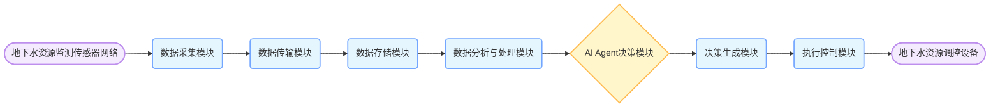

# AI Agent在智能地下水资源管理中的实践

> 关键词：AI Agent、智能地下水资源管理、水资源监测、决策优化、数据分析

> 摘要：本文围绕AI Agent在智能地下水资源管理中的实践展开深入探讨。首先介绍了研究背景，明确目的和范围，界定相关术语。接着阐述了AI Agent和智能地下水资源管理的核心概念及其联系，并给出了相应的文本示意图和Mermaid流程图。详细讲解了核心算法原理及具体操作步骤，结合Python源代码进行说明。通过数学模型和公式进一步剖析了其在地下水资源管理中的应用，辅以举例说明。以项目实战的形式展示了代码实际案例，包括开发环境搭建、源代码实现与解读。探讨了AI Agent在地下水资源管理中的实际应用场景，推荐了相关的学习资源、开发工具框架以及论文著作。最后总结了未来发展趋势与挑战，还提供了常见问题解答和扩展阅读参考资料，旨在为智能地下水资源管理领域提供全面且深入的技术指导。

## 1. 背景介绍 
### 1.1 目的和范围
随着全球人口的增长和经济的发展，地下水资源的合理管理变得至关重要。地下水资源不仅是人类生活用水的重要来源，还对农业灌溉、工业生产等领域起着关键支撑作用。然而，当前地下水资源面临着过度开采、污染等诸多问题，导致水位下降、水质恶化等不良后果。本研究的目的在于探索如何利用AI Agent技术实现智能地下水资源管理，提高水资源的利用效率，保护地下水资源的可持续性。

本研究的范围涵盖了从地下水资源数据的采集、处理，到基于AI Agent的决策制定和执行的全过程。包括对地下水位、水质等数据的实时监测，利用AI Agent对数据进行分析和预测，以及根据分析结果制定合理的水资源管理策略，如开采量控制、污染治理措施等。

### 1.2 预期读者
本文预期读者包括从事水资源管理、环境科学、人工智能等领域的科研人员和专业技术人员，他们可以从本文中获取关于AI Agent在地下水资源管理中应用的最新技术和方法。同时，也适合相关专业的学生阅读，帮助他们了解跨学科领域的研究动态和应用实践。此外，对于关注地下水资源保护和可持续发展的政府部门工作人员和决策者，本文可以为他们提供决策参考，了解如何利用先进技术提升地下水资源管理水平。

### 1.3 文档结构概述
本文将按照以下结构进行阐述：首先介绍研究背景，明确目的、范围、预期读者和文档结构，并给出相关术语的定义。接着详细阐述AI Agent和智能地下水资源管理的核心概念及其联系，通过文本示意图和Mermaid流程图进行直观展示。然后讲解核心算法原理和具体操作步骤，结合Python源代码进行详细说明。再通过数学模型和公式进一步深入剖析AI Agent在地下水资源管理中的应用，并举例说明。以项目实战的形式展示代码实际案例，包括开发环境搭建、源代码实现与解读。探讨AI Agent在地下水资源管理中的实际应用场景。推荐相关的学习资源、开发工具框架以及论文著作。最后总结未来发展趋势与挑战，提供常见问题解答和扩展阅读参考资料。

### 1.4 术语表
#### 1.4.1 核心术语定义
- **AI Agent**：即人工智能代理，是一种能够感知环境、自主决策并采取行动以实现特定目标的软件实体。在地下水资源管理中，AI Agent可以根据监测到的地下水资源数据，自动分析和判断当前的水资源状况，并制定相应的管理策略。
- **智能地下水资源管理**：指利用先进的信息技术，如传感器网络、人工智能、大数据分析等，实现对地下水资源的实时监测、动态评估和科学决策，以达到合理开发、高效利用和有效保护地下水资源的目的。
- **水资源监测**：通过各种传感器设备，对地下水位、水质（如酸碱度、溶解氧、重金属含量等）、水温等参数进行实时或定期测量和记录的过程。

#### 1.4.2 相关概念解释
- **传感器网络**：由大量分布在地下不同位置的传感器节点组成的网络，这些传感器节点可以实时采集地下水资源的各种数据，并通过无线通信技术将数据传输到数据中心。
- **决策优化**：在地下水资源管理中，根据监测数据和预设的目标（如水资源可持续利用、成本最小化等），利用优化算法生成最优的管理策略，如确定合理的开采量、调配方案等。

#### 1.4.3 缩略词列表
- **AI**：Artificial Intelligence，人工智能
- **IoT**：Internet of Things，物联网
- **ML**：Machine Learning，机器学习

## 2. 核心概念与联系 

### 核心概念原理
#### AI Agent原理
AI Agent的核心原理基于感知 - 决策 - 行动的循环机制。它通过传感器感知环境信息，将这些信息输入到内部的决策模块。决策模块利用预先设定的规则、机器学习模型或其他智能算法对感知信息进行分析和处理，生成相应的决策。最后，AI Agent根据决策结果通过执行器采取行动，对环境产生影响。在地下水资源管理中，AI Agent的传感器可以是各种地下水资源监测设备，决策模块根据监测数据判断水资源的状态和趋势，执行器可以是控制水泵、阀门等设备的指令，以调节水资源的开采和分配。

#### 智能地下水资源管理原理
智能地下水资源管理的原理是将信息技术与水资源管理理论相结合。首先，通过传感器网络实时获取地下水资源的各种数据，包括水位、水质等信息。然后，利用大数据分析和机器学习技术对这些数据进行处理和分析，挖掘数据背后的规律和趋势。根据分析结果，制定科学合理的管理策略，如调整开采计划、实施污染治理措施等。最后，通过自动化控制系统将管理策略转化为实际行动，实现对地下水资源的精准管理。

### 架构的文本示意图
```plaintext
地下水资源监测传感器网络 --> 数据采集模块 --> 数据传输模块 --> 数据存储模块
数据存储模块 --> 数据分析与处理模块（AI Agent决策模块）
数据分析与处理模块 --> 决策生成模块 --> 执行控制模块 --> 地下水资源调控设备（水泵、阀门等）
```

### Mermaid流程图


## 3. 核心算法原理 & 具体操作步骤 

### 核心算法原理
在智能地下水资源管理中，常用的核心算法包括机器学习算法和优化算法。这里以基于机器学习的水位预测算法为例进行讲解。我们使用长短期记忆网络（LSTM）来预测地下水位。LSTM是一种特殊的循环神经网络（RNN），它能够处理序列数据中的长期依赖关系，非常适合用于时间序列数据的预测，如地下水位的变化。

LSTM的核心结构包含输入门、遗忘门和输出门。输入门决定了当前输入信息有多少可以进入细胞状态；遗忘门控制细胞状态中哪些信息需要被遗忘；输出门决定了细胞状态的哪些部分将作为当前时间步的输出。

### 具体操作步骤
#### 步骤1：数据收集与预处理
收集地下水位的历史数据，包括不同时间点的水位值以及可能影响水位的其他因素，如降雨量、开采量等。对数据进行清洗，去除缺失值和异常值。然后将数据进行归一化处理，将数据缩放到[0, 1]区间，以提高模型的训练效果。

#### 步骤2：数据集划分
将预处理后的数据划分为训练集、验证集和测试集。通常，训练集占总数据的70% - 80%，验证集占10% - 15%，测试集占10% - 15%。训练集用于模型的训练，验证集用于调整模型的超参数，测试集用于评估模型的最终性能。

#### 步骤3：模型构建
使用Python的深度学习库Keras构建LSTM模型。以下是一个简单的LSTM模型构建示例代码：

```python
import numpy as np
from keras.models import Sequential
from keras.layers import LSTM, Dense

# 假设输入数据的维度为input_dim，时间步长为time_steps
input_dim = 3  # 例如，包括水位、降雨量、开采量
time_steps = 10

# 构建LSTM模型
model = Sequential()
model.add(LSTM(50, input_shape=(time_steps, input_dim)))
model.add(Dense(1))

# 编译模型
model.compile(optimizer='adam', loss='mse')
```

#### 步骤4：模型训练
使用训练集对模型进行训练。在训练过程中，不断调整模型的参数，使模型的损失函数（如均方误差）最小化。

```python
# 假设X_train是训练集的输入数据，y_train是训练集的目标数据
X_train = np.random.rand(100, time_steps, input_dim)
y_train = np.random.rand(100, 1)

# 训练模型
model.fit(X_train, y_train, epochs=50, batch_size=32)
```

#### 步骤5：模型评估
使用测试集对训练好的模型进行评估，计算模型的预测误差，如均方误差（MSE）、均方根误差（RMSE）等。

```python
# 假设X_test是测试集的输入数据，y_test是测试集的目标数据
X_test = np.random.rand(20, time_steps, input_dim)
y_test = np.random.rand(20, 1)

# 进行预测
y_pred = model.predict(X_test)

# 计算均方误差
mse = np.mean((y_pred - y_test) ** 2)
print(f"均方误差: {mse}")
```

#### 步骤6：决策制定
根据模型的预测结果，制定相应的地下水资源管理决策。例如，如果预测水位将下降到警戒值以下，则减少开采量；如果预测水位将上升，则可以适当增加开采量。

## 4. 数学模型和公式 & 详细讲解 & 举例说明 

### 数学模型
在地下水资源管理中，我们可以使用地下水动力学模型来描述地下水位的变化。常见的地下水动力学模型是基于达西定律和连续性方程建立的。

#### 达西定律
达西定律描述了地下水在多孔介质中的流动速度与水力梯度之间的关系，其数学表达式为：

$$
v = -K\frac{dh}{dl}
$$

其中，$v$ 是地下水的渗流速度（单位：m/s），$K$ 是渗透系数（单位：m/s），表示多孔介质允许地下水流动的能力，$\frac{dh}{dl}$ 是水力梯度，即水头 $h$ 随距离 $l$ 的变化率。

#### 连续性方程
连续性方程基于质量守恒原理，描述了地下水流系统中质量的平衡关系。对于一维非稳定流，连续性方程可以表示为：

$$
S_s\frac{\partial h}{\partial t} = \frac{\partial}{\partial x}\left(K\frac{\partial h}{\partial x}\right) + Q
$$

其中，$S_s$ 是比储水系数（单位：1/m），表示单位体积含水层在水头变化一个单位时储存或释放的水量，$t$ 是时间（单位：s），$x$ 是空间坐标（单位：m），$Q$ 是源汇项（单位：$m^3/(m^3\cdot s)$），表示单位体积含水层中地下水的注入或开采量。

### 详细讲解
达西定律表明，地下水的渗流速度与水力梯度成正比，与渗透系数成正比。水力梯度越大，地下水的流动速度越快；渗透系数越大，多孔介质对地下水的渗透性越好，地下水的流动速度也越快。

连续性方程描述了地下水位随时间和空间的变化关系。方程左边表示单位体积含水层中储存水量的变化率，右边第一项表示由于地下水的流动引起的水量变化，第二项表示源汇项引起的水量变化。当源汇项 $Q$ 为正值时，表示有地下水注入；当 $Q$ 为负值时，表示有地下水开采。

### 举例说明
假设一个一维的地下水流系统，渗透系数 $K = 0.01$ m/s，比储水系数 $S_s = 0.001$ 1/m，源汇项 $Q = -0.0001$ $m^3/(m^3\cdot s)$（表示有地下水开采）。在初始时刻，水头分布为 $h(x, 0) = 10$ m。我们可以使用数值方法（如有限差分法）求解连续性方程，得到不同时刻地下水位的变化情况。

以下是一个简单的Python代码示例，使用有限差分法求解一维非稳定流连续性方程：

```python
import numpy as np
import matplotlib.pyplot as plt

# 定义参数
L = 100  # 区域长度（m）
T = 100  # 模拟时间（s）
dx = 1  # 空间步长（m）
dt = 0.1  # 时间步长（s）
K = 0.01  # 渗透系数（m/s）
Ss = 0.001  # 比储水系数（1/m）
Q = -0.0001  # 源汇项（m^3/(m^3·s)）

# 初始化网格
nx = int(L / dx) + 1
nt = int(T / dt)

x = np.linspace(0, L, nx)
h = np.ones(nx) * 10  # 初始水头

# 有限差分法求解
for n in range(nt):
    hn = h.copy()
    for i in range(1, nx - 1):
        h[i] = hn[i] + (K * dt / (Ss * dx**2)) * (hn[i + 1] - 2 * hn[i] + hn[i - 1]) + (dt / Ss) * Q

# 绘制结果
plt.plot(x, h)
plt.xlabel('距离 (m)')
plt.ylabel('水头 (m)')
plt.title('地下水位随距离的变化')
plt.show()
```

## 5. 项目实战：代码实际案例和详细解释说明 

### 5.1  开发环境搭建
#### 安装Python
首先，需要安装Python开发环境。可以从Python官方网站（https://www.python.org/downloads/）下载适合自己操作系统的Python版本。建议安装Python 3.7及以上版本。

#### 安装必要的库
在智能地下水资源管理项目中，需要使用一些Python库，如NumPy、Pandas、Keras、TensorFlow等。可以使用pip命令进行安装：

```bash
pip install numpy pandas keras tensorflow matplotlib
```

#### 数据采集与存储
为了进行地下水资源管理，需要采集地下水位、水质等数据。可以使用传感器设备采集数据，并将数据存储到数据库中。这里以MySQL数据库为例，介绍数据存储的方法。

首先，安装MySQL数据库服务器，并创建一个新的数据库。然后，使用Python的`mysql-connector-python`库连接数据库，并将采集到的数据插入到数据库中。以下是一个简单的示例代码：

```python
import mysql.connector

# 连接数据库
mydb = mysql.connector.connect(
    host="localhost",
    user="yourusername",
    password="yourpassword",
    database="yourdatabase"
)

# 创建游标
mycursor = mydb.cursor()

# 创建数据表
mycursor.execute("CREATE TABLE IF NOT EXISTS groundwater_data (id INT AUTO_INCREMENT PRIMARY KEY, timestamp DATETIME, water_level FLOAT, water_quality FLOAT)")

# 插入数据
sql = "INSERT INTO groundwater_data (timestamp, water_level, water_quality) VALUES (%s, %s, %s)"
val = ("2024-01-01 12:00:00", 10.5, 8.0)
mycursor.execute(sql, val)

# 提交更改
mydb.commit()

print(mycursor.rowcount, "记录插入成功。")
```

### 5.2  源代码详细实现和代码解读
#### 数据读取与预处理
使用Pandas库从数据库中读取地下水资源数据，并进行预处理。以下是一个示例代码：

```python
import pandas as pd
import mysql.connector

# 连接数据库
mydb = mysql.connector.connect(
    host="localhost",
    user="yourusername",
    password="yourpassword",
    database="yourdatabase"
)

# 读取数据
query = "SELECT * FROM groundwater_data"
df = pd.read_sql(query, mydb)

# 数据预处理
df['timestamp'] = pd.to_datetime(df['timestamp'])
df.set_index('timestamp', inplace=True)

# 处理缺失值
df.fillna(method='ffill', inplace=True)

# 归一化处理
from sklearn.preprocessing import MinMaxScaler
scaler = MinMaxScaler()
df_scaled = scaler.fit_transform(df)
```

#### LSTM模型构建与训练
使用Keras构建LSTM模型，并使用预处理后的数据进行训练。

```python
from keras.models import Sequential
from keras.layers import LSTM, Dense
import numpy as np

# 准备训练数据
def create_sequences(data, seq_length):
    xs, ys = [], []
    for i in range(len(data) - seq_length):
        x = data[i:i+seq_length]
        y = data[i+seq_length, 0]
        xs.append(x)
        ys.append(y)
    return np.array(xs), np.array(ys)

seq_length = 10
X, y = create_sequences(df_scaled, seq_length)

# 划分训练集和测试集
train_size = int(len(X) * 0.8)
X_train, X_test = X[:train_size], X[train_size:]
y_train, y_test = y[:train_size], y[train_size:]

# 构建LSTM模型
model = Sequential()
model.add(LSTM(50, input_shape=(seq_length, df_scaled.shape[1])))
model.add(Dense(1))

# 编译模型
model.compile(optimizer='adam', loss='mse')

# 训练模型
model.fit(X_train, y_train, epochs=50, batch_size=32)
```

#### 模型预测与评估
使用训练好的模型进行预测，并评估模型的性能。

```python
# 进行预测
y_pred = model.predict(X_test)

# 反归一化处理
y_pred_actual = scaler.inverse_transform(np.hstack((y_pred, np.zeros((len(y_pred), df_scaled.shape[1] - 1)))))[:, 0]
y_test_actual = scaler.inverse_transform(np.hstack((y_test.reshape(-1, 1), np.zeros((len(y_test), df_scaled.shape[1] - 1)))))[:, 0]

# 计算均方误差
from sklearn.metrics import mean_squared_error
mse = mean_squared_error(y_test_actual, y_pred_actual)
print(f"均方误差: {mse}")

# 绘制预测结果
import matplotlib.pyplot as plt
plt.plot(y_test_actual, label='实际值')
plt.plot(y_pred_actual, label='预测值')
plt.xlabel('时间步')
plt.ylabel('地下水位')
plt.title('地下水位预测结果')
plt.legend()
plt.show()
```

### 5.3  代码解读与分析
#### 数据读取与预处理部分
- 使用`pandas`库从MySQL数据库中读取地下水资源数据，并将`timestamp`列转换为日期时间类型，设置为索引。
- 使用`ffill`方法处理缺失值，即使用前一个有效数据填充缺失值。
- 使用`MinMaxScaler`对数据进行归一化处理，将数据缩放到[0, 1]区间，以提高模型的训练效果。

#### LSTM模型构建与训练部分
- `create_sequences`函数将时间序列数据转换为适合LSTM模型输入的格式，即将连续的`seq_length`个时间步的数据作为输入，下一个时间步的数据作为目标。
- 使用Keras构建LSTM模型，包含一个LSTM层和一个全连接层。
- 使用`adam`优化器和均方误差损失函数编译模型，并使用训练集进行训练。

#### 模型预测与评估部分
- 使用训练好的模型对测试集进行预测，并将预测结果和实际结果进行反归一化处理，得到真实的地下水位值。
- 使用`mean_squared_error`函数计算预测结果的均方误差，评估模型的性能。
- 使用`matplotlib`库绘制预测结果和实际结果的对比图，直观展示模型的预测效果。

## 6. 实际应用场景 
### 地下水位监测与预警
AI Agent可以实时监测地下水位的变化情况，通过对历史数据的学习和分析，建立水位预测模型。当预测到地下水位将下降到警戒值以下时，AI Agent可以自动发出预警信号，提醒相关部门采取措施，如减少开采量、增加补给等，以避免地下水位过度下降导致的地面沉降、海水倒灌等问题。

### 水质管理与污染控制
AI Agent可以对地下水质进行实时监测，分析水质指标的变化趋势。当检测到水质异常时，如重金属含量超标、微生物污染等，AI Agent可以快速定位污染源，并制定相应的污染治理策略。例如，控制周边工业废水的排放、加强污水处理等，以保障地下水资源的质量安全。

### 水资源调配与优化
在多个用水区域之间，AI Agent可以根据各区域的用水需求、地下水位和水质情况，实现水资源的合理调配。通过优化算法，AI Agent可以确定最优的水资源分配方案，提高水资源的利用效率，减少水资源的浪费。例如，在农业灌溉中，根据不同农作物的需水量和土壤湿度，精准控制灌溉水量和时间。

### 地下水开采管理
AI Agent可以根据地下水资源的储量、开采能力和用水需求，制定科学合理的开采计划。通过实时监测开采量和地下水位的变化，动态调整开采策略，确保地下水资源的可持续开采。例如，当开采量超过地下水资源的补给能力时，AI Agent可以自动限制开采量，避免过度开采。

## 7. 工具和资源推荐
### 7.1 学习资源推荐
#### 7.1.1 书籍推荐
- 《人工智能：一种现代的方法》：这是一本经典的人工智能教材，涵盖了人工智能的各个领域，包括搜索算法、机器学习、自然语言处理等，对于理解AI Agent的基本原理和技术有很大帮助。
- 《Python机器学习》：详细介绍了Python在机器学习中的应用，包括各种机器学习算法的原理和实现，以及如何使用Python库进行数据处理、模型训练和评估。
- 《地下水动力学》：系统阐述了地下水运动的基本理论和方法，对于理解地下水资源管理中的数学模型和算法有重要的参考价值。

#### 7.1.2 在线课程
- Coursera上的“人工智能基础”课程：由知名高校的教授授课，讲解人工智能的基本概念、算法和应用，通过视频教程、作业和测验等方式帮助学习者掌握相关知识。
- edX上的“Python数据科学入门”课程：介绍了Python在数据科学中的应用，包括数据处理、数据分析和机器学习等方面的内容，适合初学者学习。
- 中国大学MOOC上的“水资源规划与管理”课程：讲解水资源规划与管理的基本理论和方法，结合实际案例分析，帮助学习者了解水资源管理的实践应用。

#### 7.1.3 技术博客和网站
- Towards Data Science：一个专注于数据科学和机器学习的博客平台，上面有很多关于人工智能、数据分析的技术文章和案例分享。
- AI Stack Exchange：一个问答社区，用户可以在这里提问和回答关于人工智能的问题，获取专业的解答和建议。
- 中国水资源网：提供水资源领域的最新政策、法规、技术和研究成果等信息，对于了解地下水资源管理的行业动态有很大帮助。

### 7.2 开发工具框架推荐
#### 7.2.1 IDE和编辑器
- PyCharm：一款功能强大的Python集成开发环境，提供代码编辑、调试、版本控制等功能，支持多种Python库和框架，适合Python项目的开发。
- Jupyter Notebook：一个交互式的开发环境，可以在浏览器中编写和运行Python代码，支持代码、文本、图表等多种形式的展示，非常适合数据科学和机器学习项目的开发和演示。
- Visual Studio Code：一款轻量级的代码编辑器，支持多种编程语言，具有丰富的插件生态系统，可以通过安装Python插件来进行Python项目的开发。

#### 7.2.2 调试和性能分析工具
- Py-Spy：一个Python性能分析工具，可以实时监测Python程序的CPU使用率、函数调用次数等信息，帮助开发者找出性能瓶颈。
- PDB：Python自带的调试器，可以在代码中设置断点，逐步执行代码，查看变量的值和程序的执行流程，方便调试程序。
- TensorBoard：一个可视化工具，用于可视化TensorFlow模型的训练过程和性能指标，如损失函数、准确率等，帮助开发者了解模型的训练情况。

#### 7.2.3 相关框架和库
- TensorFlow：一个开源的机器学习框架，提供了丰富的工具和库，支持深度学习模型的构建、训练和部署，在人工智能领域应用广泛。
- PyTorch：另一个流行的深度学习框架，具有动态图机制，易于使用和调试，适合快速开发和研究。
- Scikit-learn：一个用于机器学习的Python库，提供了各种机器学习算法的实现，如分类、回归、聚类等，以及数据预处理、模型评估等工具。

### 7.3 相关论文著作推荐
#### 7.3.1 经典论文
- “Long Short-Term Memory”：介绍了长短期记忆网络（LSTM）的原理和结构，是LSTM领域的经典论文，对于理解和应用LSTM模型有重要的指导意义。
- “Darcy's Law and the Field Equations of the Flow of Ground-Water”：阐述了达西定律和地下水流动的基本方程，是地下水动力学领域的经典文献。
- “A Survey on Artificial Intelligence Agents”：对人工智能代理的概念、分类和应用进行了全面的综述，为研究AI Agent提供了重要的参考。

#### 7.3.2 最新研究成果
- 可以关注《Water Resources Research》、《Journal of Hydrology》等水科学领域的顶级期刊，以及《Artificial Intelligence》、《Machine Learning》等人工智能领域的知名期刊，获取关于AI Agent在地下水资源管理中的最新研究成果。

#### 7.3.3 应用案例分析
- 一些国际组织和研究机构会发布关于地下水资源管理的应用案例报告，如联合国教科文组织（UNESCO）的水资源管理项目案例、世界银行的水资源开发项目案例等。这些案例可以帮助我们了解AI Agent在实际项目中的应用效果和经验教训。

## 8. 总结：未来发展趋势与挑战
### 未来发展趋势
#### 多学科融合
未来，AI Agent在智能地下水资源管理中的应用将更加注重多学科融合。不仅需要结合人工智能、水资源科学，还将与地理学、地质学、环境科学等学科深度融合，综合考虑地下水资源的自然属性、社会属性和环境属性，实现更加全面、精准的管理。

#### 智能化与自动化
随着技术的不断发展，AI Agent将实现更高程度的智能化和自动化。能够自动感知环境变化，自主调整管理策略，无需人工干预。例如，通过物联网技术实现对地下水资源监测设备和调控设备的远程控制和自动化操作，提高管理效率和响应速度。

#### 大数据与云计算
大数据和云计算技术将为AI Agent在地下水资源管理中的应用提供更强大的支持。通过收集和整合更多的地下水资源数据，利用云计算的强大计算能力进行数据分析和处理，提高模型的准确性和预测能力。同时，云平台还可以实现数据的共享和协同工作，方便不同部门和地区之间的合作与交流。

#### 区块链技术应用
区块链技术具有去中心化、不可篡改、安全可靠等特点，可以应用于地下水资源管理中的数据共享、交易结算等方面。通过区块链技术，可以确保数据的真实性和完整性，提高水资源交易的透明度和公正性，促进地下水资源的合理配置和有效利用。

### 挑战
#### 数据质量与安全
地下水资源数据的质量和安全是AI Agent应用的关键。数据的准确性、完整性和一致性直接影响模型的训练和决策的制定。同时，随着数据的大量收集和存储，数据安全问题也日益突出，需要采取有效的措施保护数据不被泄露和篡改。

#### 模型准确性与可解释性
虽然机器学习和深度学习模型在地下水资源管理中取得了一定的成果，但模型的准确性和可解释性仍然是一个挑战。一些复杂的模型可能在训练集上表现良好，但在实际应用中可能出现过拟合或泛化能力不足的问题。此外，模型的决策过程往往难以解释，这给管理者和决策者带来了一定的困扰。

#### 技术集成与应用推广
将AI Agent技术与现有的地下水资源管理系统进行集成，需要解决技术兼容性、接口标准化等问题。同时，由于不同地区的地下水资源条件和管理需求存在差异，如何将成熟的技术和经验推广应用到不同的场景中，也是一个需要解决的问题。

#### 法律法规与政策支持
AI Agent在地下水资源管理中的应用涉及到数据采集、处理、决策制定等多个环节，需要相应的法律法规和政策支持。例如，数据的所有权和使用权问题、人工智能决策的责任认定问题等，都需要通过法律法规和政策来明确和规范。

## 9. 附录：常见问题与解答
### 问题1：AI Agent在地下水资源管理中的应用是否需要大量的历史数据？
解答：是的，AI Agent在地下水资源管理中的应用通常需要大量的历史数据。历史数据可以帮助AI Agent学习地下水资源的变化规律和趋势，从而建立准确的预测模型和决策模型。数据量越大、质量越高，模型的性能就越好。但是，在实际应用中，如果历史数据不足，可以采用数据增强、迁移学习等方法来提高模型的性能。

### 问题2：如何评估AI Agent在地下水资源管理中的效果？
解答：可以从多个方面评估AI Agent在地下水资源管理中的效果。一是评估模型的预测准确性，如计算预测值与实际值之间的误差（如均方误差、均方根误差等）；二是评估决策的合理性，如比较AI Agent制定的管理策略与传统方法制定的策略在水资源利用效率、成本控制等方面的差异；三是评估对地下水资源状况的改善效果，如监测地下水位、水质等指标的变化情况。

### 问题3：AI Agent在地下水资源管理中会完全取代人工决策吗？
解答：目前来看，AI Agent在地下水资源管理中不会完全取代人工决策。虽然AI Agent可以通过数据分析和模型计算提供科学的决策建议，但地下水资源管理涉及到社会、经济、环境等多个方面的因素，需要综合考虑各种利益和风险。人工决策可以结合专业知识和实际经验，对AI Agent的决策建议进行评估和调整，确保决策的科学性和可行性。因此，未来更可能是AI Agent与人工决策相结合的模式。

### 问题4：如何保障AI Agent在地下水资源管理中使用的数据安全？
解答：保障数据安全可以从多个方面入手。一是采用加密技术对数据进行加密存储和传输，防止数据在存储和传输过程中被窃取和篡改；二是建立严格的访问控制机制，对数据的访问进行权限管理，只有授权人员才能访问和使用数据；三是定期对数据进行备份，防止数据丢失；四是加强网络安全防护，安装防火墙、入侵检测系统等安全设备，防止网络攻击。

## 10. 扩展阅读 & 参考资料
### 扩展阅读
- 《人工智能时代的水资源管理创新》：探讨了人工智能技术在水资源管理领域的应用前景和创新模式，为进一步了解AI Agent在地下水资源管理中的发展提供了新的思路。
- 《地下水科学与工程》：系统介绍了地下水的形成、运动、水质变化等基本理论和方法，以及地下水开发利用和保护的工程技术，对于深入理解地下水资源管理的相关知识有很大帮助。
- 《机器学习实战》：通过实际案例详细介绍了机器学习算法的应用，包括数据预处理、模型选择、模型训练和评估等过程，适合想要进一步学习机器学习技术的读者。

### 参考资料
- 相关学术论文和研究报告：如上述提到的经典论文和最新研究成果，这些论文和报告是本研究的重要理论基础和数据来源。
- 行业标准和规范：如地下水监测技术规范、水资源评价标准等，这些标准和规范为地下水资源管理提供了技术指导和质量控制依据。
- 官方网站和统计数据：如国家水资源管理部门的官方网站、统计年鉴等，这些网站和数据提供了地下水资源的基本信息和统计数据，为研究和分析提供了数据支持。

作者：AI天才研究院/AI Genius Institute & 禅与计算机程序设计艺术 /Zen And The Art of Computer Programming