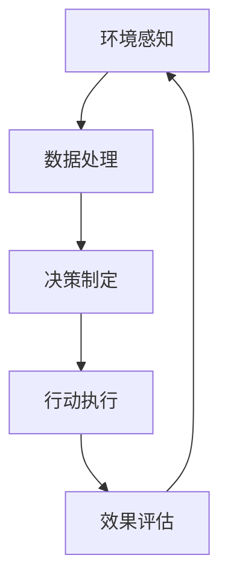

# AI Agent在智能地下管网维护中的实践

> 关键词：AI Agent、智能地下管网、管网维护、自动化决策、数据分析

> 摘要：本文围绕AI Agent在智能地下管网维护中的实践展开深入探讨。首先介绍了智能地下管网维护的背景和AI Agent的相关概念，阐述了两者的联系与作用机制。接着详细讲解了AI Agent的核心算法原理，并给出Python代码示例。同时，通过数学模型和公式对其决策过程进行分析。在项目实战部分，提供了开发环境搭建、源代码实现与解读等内容。还探讨了AI Agent在智能地下管网维护中的实际应用场景，推荐了相关学习资源、开发工具和论文著作。最后总结了未来发展趋势与挑战，为相关领域的研究和实践提供参考。

## 1. 背景介绍 
### 1.1 目的和范围
随着城市化进程的加速，地下管网系统变得日益复杂庞大。智能地下管网维护的目的在于保障管网的安全、高效运行，及时发现并解决潜在问题。AI Agent在这一领域的应用旨在利用其自主决策和学习能力，提高管网维护的效率和准确性。本文章的范围涵盖了AI Agent在智能地下管网维护中的基本概念、算法原理、实际应用以及未来发展等方面。

### 1.2 预期读者
本文预期读者包括从事智能地下管网维护相关工作的工程师、研究人员，对人工智能在基础设施领域应用感兴趣的技术爱好者，以及相关专业的学生等。

### 1.3 文档结构概述
本文首先介绍背景信息，包括目的、读者和文档结构。接着阐述AI Agent与智能地下管网维护的核心概念及联系，详细讲解核心算法原理和具体操作步骤，给出数学模型和公式并举例说明。通过项目实战展示代码实现和解读，探讨实际应用场景。然后推荐相关工具和资源，最后总结未来发展趋势与挑战，提供常见问题解答和参考资料。

### 1.4 术语表
#### 1.4.1 核心术语定义
- **AI Agent（人工智能智能体）**：是一种能够感知环境、进行决策并采取行动的人工智能实体。它可以根据环境的变化自主地调整行为，以实现特定的目标。
- **智能地下管网**：是指利用现代信息技术，对地下管网的运行状态、空间位置等信息进行实时监测、分析和管理的管网系统。
- **管网维护**：包括对地下管网的检查、维修、更新等一系列活动，以确保管网的正常运行和延长其使用寿命。

#### 1.4.2 相关概念解释
- **自主决策**：AI Agent能够在没有人工干预的情况下，根据自身的算法和策略，对环境信息进行分析和判断，做出合理的决策。
- **环境感知**：AI Agent通过各种传感器获取环境中的信息，如管网的压力、流量、温度等，以便了解管网的运行状态。

#### 1.4.3 缩略词列表
- **AI**：Artificial Intelligence（人工智能）
- **IoT**：Internet of Things（物联网）

## 2. 核心概念与联系 
### 2.1 AI Agent的概念与原理
AI Agent是一种具有自主能力的智能实体，它可以感知周围环境的变化，并根据预设的目标和规则进行决策和行动。其基本原理包括感知、决策和行动三个主要环节。

感知环节是AI Agent获取环境信息的过程，它通过各种传感器收集管网的相关数据，如压力传感器获取管网内的压力值，流量传感器获取流量数据等。这些数据是AI Agent进行决策的基础。

决策环节是AI Agent根据感知到的环境信息，运用一定的算法和策略进行分析和判断，选择最优的行动方案。这个过程涉及到机器学习、深度学习等多种技术，以实现对复杂环境的理解和决策。

行动环节是AI Agent根据决策结果采取相应的行动，如发出维修指令、调整管网的运行参数等。这些行动旨在实现智能地下管网的高效维护和管理。

### 2.2 智能地下管网的特点与需求
智能地下管网具有复杂性、隐蔽性和动态性等特点。复杂性体现在管网的种类繁多，包括供水、排水、燃气、电力等不同类型的管网，且它们相互交织、布局复杂。隐蔽性使得管网的运行状态难以直接观察，需要借助各种监测设备来获取信息。动态性则是指管网的运行状态会随着时间、用户需求等因素不断变化。

基于这些特点，智能地下管网的维护面临着诸多挑战，如及时发现故障、准确判断故障原因、合理安排维护资源等。因此，需要一种智能化的手段来提高管网维护的效率和可靠性。

### 2.3 AI Agent与智能地下管网维护的联系
AI Agent可以为智能地下管网维护提供强大的支持。通过环境感知，AI Agent能够实时获取管网的运行数据，及时发现潜在的故障和异常情况。在决策环节，AI Agent可以根据历史数据和实时信息，运用机器学习算法进行分析和预测，制定最优的维护策略。在行动环节，AI Agent可以自动执行维护任务，如调度维修人员、控制管网设备等，实现管网维护的自动化和智能化。

以下是AI Agent在智能地下管网维护中的工作流程Mermaid流程图：


## 3. 核心算法原理 & 具体操作步骤 
### 3.1 基于强化学习的AI Agent算法原理
强化学习是一种通过智能体与环境进行交互，不断尝试不同的行动并根据奖励信号来学习最优策略的机器学习方法。在智能地下管网维护中，AI Agent可以将管网的运行状态作为环境，将维护行动作为可选的动作，将管网的性能指标（如故障发生率、维护成本等）作为奖励信号。

具体来说，AI Agent在每个时间步都会感知当前的管网状态 $s_t$，然后根据当前的策略 $\pi$ 选择一个动作 $a_t$ 执行。执行动作后，环境会反馈一个奖励 $r_t$ 和下一个状态 $s_{t+1}$。AI Agent的目标是通过不断地与环境交互，学习到一个最优策略 $\pi^*$，使得长期累积奖励最大化。

### 3.2 Python代码实现
以下是一个简单的基于Q - learning算法的AI Agent示例代码：
```python
import numpy as np

# 定义环境参数
num_states = 10  # 管网状态数量
num_actions = 3  # 维护动作数量
gamma = 0.9  # 折扣因子
alpha = 0.1  # 学习率

# 初始化Q表
Q = np.zeros((num_states, num_actions))

# 定义Q - learning算法
def q_learning(state, action, reward, next_state):
    max_q_next = np.max(Q[next_state, :])
    Q[state, action] = Q[state, action] + alpha * (reward + gamma * max_q_next - Q[state, action])
    return Q

# 模拟智能体与环境的交互
state = 0  # 初始状态
for episode in range(100):
    action = np.argmax(Q[state, :])  # 选择动作
    # 模拟环境反馈
    next_state = np.random.randint(0, num_states)
    reward = np.random.randint(-1, 2)
    Q = q_learning(state, action, reward, next_state)
    state = next_state

print("最终的Q表：", Q)
```
### 3.3 具体操作步骤
1. **数据收集**：通过各种传感器收集管网的运行数据，包括压力、流量、温度等信息，构建环境状态空间。
2. **状态表示**：将收集到的数据进行处理和特征提取，将其转换为AI Agent能够理解的状态表示。
3. **动作定义**：定义AI Agent可以执行的维护动作，如维修、更换设备、调整参数等。
4. **奖励设计**：根据管网的性能指标设计奖励函数，如故障发生率降低给予正奖励，维护成本增加给予负奖励。
5. **训练AI Agent**：使用强化学习算法（如Q - learning、深度Q网络等）对AI Agent进行训练，使其学习到最优的维护策略。
6. **部署与应用**：将训练好的AI Agent部署到智能地下管网维护系统中，实现自动化的管网维护决策和行动。

## 4. 数学模型和公式 & 详细讲解 & 举例说明 
### 4.1 强化学习的数学模型
强化学习的数学模型可以用马尔可夫决策过程（MDP）来描述。一个MDP由一个五元组 $(S, A, P, R, \gamma)$ 组成，其中：
- $S$ 是状态空间，表示智能体可能处于的所有状态的集合。
- $A$ 是动作空间，表示智能体可以执行的所有动作的集合。
- $P$ 是状态转移概率函数，$P(s_{t + 1}|s_t, a_t)$ 表示在状态 $s_t$ 执行动作 $a_t$ 后转移到状态 $s_{t + 1}$ 的概率。
- $R$ 是奖励函数，$R(s_t, a_t)$ 表示在状态 $s_t$ 执行动作 $a_t$ 后获得的即时奖励。
- $\gamma$ 是折扣因子，$0 \leq \gamma \leq 1$，用于权衡即时奖励和未来奖励的重要性。

### 4.2 价值函数和策略
在强化学习中，有两个重要的概念：价值函数和策略。

价值函数 $V^{\pi}(s)$ 表示在策略 $\pi$ 下，从状态 $s$ 开始的长期累积奖励的期望：
$$V^{\pi}(s) = \mathbb{E}_{\pi}\left[\sum_{t = 0}^{\infty}\gamma^t r_t|s_0 = s\right]$$

动作价值函数 $Q^{\pi}(s, a)$ 表示在策略 $\pi$ 下，从状态 $s$ 执行动作 $a$ 开始的长期累积奖励的期望：
$$Q^{\pi}(s, a) = \mathbb{E}_{\pi}\left[\sum_{t = 0}^{\infty}\gamma^t r_t|s_0 = s, a_0 = a\right]$$

策略 $\pi$ 是一个从状态到动作的映射，$\pi(a|s)$ 表示在状态 $s$ 下选择动作 $a$ 的概率。最优策略 $\pi^*$ 是使得价值函数 $V^{\pi}(s)$ 最大的策略。

### 4.3 Q - learning算法的更新公式
Q - learning算法是一种无模型的强化学习算法，其Q值更新公式为：
$$Q(s_t, a_t) \leftarrow Q(s_t, a_t) + \alpha\left[r_t + \gamma\max_{a}Q(s_{t + 1}, a) - Q(s_t, a_t)\right]$$
其中，$\alpha$ 是学习率，$\gamma$ 是折扣因子。

### 4.4 举例说明
假设智能地下管网有三种状态：正常状态（$s_1$）、轻微故障状态（$s_2$）和严重故障状态（$s_3$），AI Agent有两种动作：不处理（$a_1$）和维修（$a_2$）。

奖励函数定义如下：
- 当处于正常状态 $s_1$ 且不处理时，奖励 $r = 1$；维修时，奖励 $r = - 1$。
- 当处于轻微故障状态 $s_2$ 且不处理时，奖励 $r = - 2$；维修时，奖励 $r = 2$。
- 当处于严重故障状态 $s_3$ 且不处理时，奖励 $r = - 5$；维修时，奖励 $r = 3$。

初始Q表为：
$$Q = \begin{bmatrix}
0 & 0\\
0 & 0\\
0 & 0
\end{bmatrix}$$

假设当前状态 $s_t = s_2$，选择动作 $a_t = a_2$，执行动作后转移到状态 $s_{t + 1} = s_1$，获得奖励 $r_t = 2$。

根据Q - learning更新公式，$\alpha = 0.1$，$\gamma = 0.9$，则：
$$Q(s_2, a_2) \leftarrow Q(s_2, a_2) + 0.1\times\left[2 + 0.9\times\max_{a}Q(s_1, a) - Q(s_2, a_2)\right]$$
由于初始时 $Q(s_1, a_1) = Q(s_1, a_2) = 0$，则：
$$Q(s_2, a_2) \leftarrow 0 + 0.1\times(2 + 0.9\times0 - 0)=0.2$$

更新后的Q表为：
$$Q = \begin{bmatrix}
0 & 0\\
0 & 0.2\\
0 & 0
\end{bmatrix}$$

## 5. 项目实战：代码实际案例和详细解释说明 
### 5.1  开发环境搭建
#### 5.1.1 安装Python
首先，需要安装Python开发环境。可以从Python官方网站（https://www.python.org/downloads/） 下载适合自己操作系统的Python版本，并按照安装向导进行安装。

#### 5.1.2 安装必要的库
在智能地下管网维护项目中，需要安装一些常用的Python库，如`numpy`、`pandas`、`matplotlib`等。可以使用`pip`命令进行安装：
```sh
pip install numpy pandas matplotlib
```

#### 5.1.3 配置开发环境
可以选择使用集成开发环境（IDE），如PyCharm、VS Code等，也可以使用Jupyter Notebook进行代码的编写和调试。

### 5.2  源代码详细实现和代码解读
以下是一个更完整的基于强化学习的AI Agent在智能地下管网维护中的项目代码示例：
```python
import numpy as np
import pandas as pd
import matplotlib.pyplot as plt

# 定义环境参数
num_states = 5  # 管网状态数量
num_actions = 2  # 维护动作数量
gamma = 0.9  # 折扣因子
alpha = 0.1  # 学习率
episodes = 500  # 训练回合数

# 初始化Q表
Q = np.zeros((num_states, num_actions))

# 定义奖励函数
def get_reward(state, action):
    if state == 0:  # 正常状态
        if action == 0:  # 不处理
            return 1
        else:  # 维修
            return -1
    elif state == 1:  # 轻微故障状态
        if action == 0:  # 不处理
            return -2
        else:  # 维修
            return 2
    elif state == 2:  # 中度故障状态
        if action == 0:  # 不处理
            return -3
        else:  # 维修
            return 3
    elif state == 3:  # 严重故障状态
        if action == 0:  # 不处理
            return -5
        else:  # 维修
            return 4
    else:  # 极严重故障状态
        if action == 0:  # 不处理
            return -8
        else:  # 维修
            return 5

# 定义状态转移函数
def get_next_state(state, action):
    if state == 0:  # 正常状态
        if action == 0:  # 不处理
            return np.random.choice([0, 1], p=[0.9, 0.1])
        else:  # 维修
            return 0
    elif state == 1:  # 轻微故障状态
        if action == 0:  # 不处理
            return np.random.choice([1, 2], p=[0.7, 0.3])
        else:  # 维修
            return 0
    elif state == 2:  # 中度故障状态
        if action == 0:  # 不处理
            return np.random.choice([2, 3], p=[0.6, 0.4])
        else:  # 维修
            return 1
    elif state == 3:  # 严重故障状态
        if action == 0:  # 不处理
            return np.random.choice([3, 4], p=[0.5, 0.5])
        else:  # 维修
            return 2
    else:  # 极严重故障状态
        if action == 0:  # 不处理
            return 4
        else:  # 维修
            return 3

# 定义Q - learning算法
def q_learning(state, action, reward, next_state):
    max_q_next = np.max(Q[next_state, :])
    Q[state, action] = Q[state, action] + alpha * (reward + gamma * max_q_next - Q[state, action])
    return Q

# 训练AI Agent
total_rewards = []
for episode in range(episodes):
    state = np.random.randint(0, num_states)  # 随机初始化状态
    episode_reward = 0
    for step in range(20):
        action = np.argmax(Q[state, :])  # 选择动作
        reward = get_reward(state, action)
        next_state = get_next_state(state, action)
        Q = q_learning(state, action, reward, next_state)
        state = next_state
        episode_reward += reward
    total_rewards.append(episode_reward)

# 绘制训练过程中的总奖励曲线
plt.plot(total_rewards)
plt.xlabel('Episode')
plt.ylabel('Total Reward')
plt.title('Training Curve of AI Agent in Smart Underground Pipeline Network Maintenance')
plt.show()

# 输出最终的Q表
print("最终的Q表：", Q)
```
### 5.3  代码解读与分析
#### 5.3.1 环境参数定义
`num_states` 和 `num_actions` 分别定义了管网的状态数量和AI Agent可以执行的动作数量。`gamma` 是折扣因子，用于权衡即时奖励和未来奖励的重要性；`alpha` 是学习率，控制Q值更新的步长；`episodes` 是训练的回合数。

#### 5.3.2 Q表初始化
`Q` 表是一个二维数组，用于存储每个状态下每个动作的Q值。初始时，所有Q值都为0。

#### 5.3.3 奖励函数和状态转移函数
`get_reward` 函数根据当前状态和执行的动作返回相应的奖励值。`get_next_state` 函数根据当前状态和执行的动作模拟状态的转移。

#### 5.3.4 Q - learning算法实现
`q_learning` 函数实现了Q - learning算法的Q值更新公式。

#### 5.3.5 训练过程
在每个训练回合中，AI Agent从随机状态开始，根据当前的Q表选择动作，执行动作后获得奖励并转移到下一个状态，然后更新Q表。每个回合结束后，记录该回合的总奖励。

#### 5.3.6 结果分析
通过绘制训练过程中的总奖励曲线，可以观察到AI Agent的学习过程。随着训练回合数的增加，总奖励逐渐增加，说明AI Agent逐渐学习到了最优的维护策略。最终的Q表反映了每个状态下每个动作的价值。

## 6. 实际应用场景 
### 6.1 故障预测与预警
AI Agent可以通过对管网运行数据的实时监测和分析，运用机器学习算法进行故障预测。例如，根据管网的压力、流量等数据，预测管网是否会发生泄漏、堵塞等故障。当预测到可能发生故障时，AI Agent可以及时发出预警，通知相关人员采取预防措施，避免故障的发生或减少故障造成的损失。

### 6.2 维修决策优化
在管网发生故障时，AI Agent可以根据故障的类型、严重程度、管网的布局等信息，制定最优的维修决策。例如，选择最合适的维修人员和维修设备，确定最佳的维修路径和维修时间，以提高维修效率和降低维修成本。

### 6.3 管网运行参数调整
AI Agent可以根据管网的实时运行状态和用户需求，自动调整管网的运行参数。例如，根据用水量的变化，调整水泵的转速和阀门的开度，以保证管网的水压稳定和节能运行。

### 6.4 资源管理与调度
AI Agent可以对管网维护所需的资源进行管理和调度。例如，对维修人员、维修设备、材料等资源进行合理分配和调度，确保资源的高效利用。同时，AI Agent可以根据管网的维护需求，提前储备必要的资源，避免资源短缺影响维护工作的进行。

## 7. 工具和资源推荐
### 7.1 学习资源推荐
#### 7.1.1 书籍推荐
- 《强化学习：原理与Python实现》：这本书系统地介绍了强化学习的基本原理、算法和应用，并给出了Python代码实现，对于学习AI Agent在智能地下管网维护中的应用有很大的帮助。
- 《智能系统中的概率推理：可信性网络》：该书深入讲解了概率推理和可信性网络的相关知识，对于理解AI Agent的决策过程和不确定性处理有重要意义。

#### 7.1.2 在线课程
- Coursera上的“Reinforcement Learning Specialization”：这是一个由顶尖大学教授授课的强化学习专项课程，涵盖了强化学习的基础理论、算法和应用，通过视频讲解、编程作业和项目实践等方式，帮助学习者深入掌握强化学习知识。
- edX上的“Artificial Intelligence”：该课程全面介绍了人工智能的各个领域，包括机器学习、深度学习、自然语言处理等，对于了解AI Agent的整体技术框架有很大的帮助。

#### 7.1.3 技术博客和网站
- OpenAI Blog（https://openai.com/blog/）：OpenAI发布的最新研究成果和技术动态，对于了解人工智能领域的前沿技术有很大的帮助。
- Medium上的“Towards Data Science”：这是一个专注于数据科学和人工智能的技术博客，上面有很多关于强化学习、AI Agent等方面的优秀文章和案例分享。

### 7.2 开发工具框架推荐
#### 7.2.1 IDE和编辑器
- PyCharm：一款专业的Python集成开发环境，具有代码编辑、调试、版本控制等强大功能，适合Python项目的开发。
- VS Code：一款轻量级的代码编辑器，支持多种编程语言，通过安装相关插件可以实现Python代码的高效开发。

#### 7.2.2 调试和性能分析工具
- PySnooper：一个简单易用的Python调试工具，可以自动记录函数的调用过程和变量的值，方便调试代码。
- cProfile：Python内置的性能分析工具，可以分析代码的执行时间和函数调用次数，帮助优化代码性能。

#### 7.2.3 相关框架和库
- OpenAI Gym：一个用于开发和比较强化学习算法的工具包，提供了多种环境和基准测试，方便快速实现和测试AI Agent。
- Stable Baselines3：一个基于PyTorch的强化学习库，提供了多种预训练的强化学习算法和模型，方便开发者使用。

### 7.3 相关论文著作推荐
#### 7.3.1 经典论文
- “Reinforcement Learning: A Survey”：这是一篇关于强化学习的经典综述论文，系统地介绍了强化学习的发展历程、基本原理和主要算法，对于深入了解强化学习有重要的参考价值。
- “Playing Atari with Deep Reinforcement Learning”：该论文首次提出了深度Q网络（DQN）算法，将深度学习和强化学习相结合，在Atari游戏中取得了很好的效果，开创了深度强化学习的先河。

#### 7.3.2 最新研究成果
- 关注顶级学术会议（如NeurIPS、ICML、AAAI等）上发表的关于AI Agent和智能地下管网维护的最新研究论文，了解该领域的前沿技术和发展趋势。

#### 7.3.3 应用案例分析
- 一些行业报告和学术论文中会有关于AI Agent在智能地下管网维护中的实际应用案例分析，可以从中学习到实际项目中的经验和方法。

## 8. 总结：未来发展趋势与挑战
### 8.1 未来发展趋势
#### 8.1.1 多智能体协同
未来，多个AI Agent可以协同工作，共同完成智能地下管网的维护任务。例如，不同类型的AI Agent可以分别负责故障监测、维修决策、资源调度等任务，通过信息共享和协作，提高管网维护的效率和可靠性。

#### 8.1.2 与物联网和大数据的深度融合
随着物联网技术的发展，地下管网可以安装更多的传感器，实时获取更全面、准确的运行数据。AI Agent可以结合大数据分析技术，对海量的管网数据进行挖掘和分析，进一步提高故障预测的准确性和维护决策的科学性。

#### 8.1.3 智能化升级
AI Agent将不断进行智能化升级，具备更强的自主学习和适应能力。例如，能够自动调整学习策略和决策模型，以适应不同地区、不同类型管网的特点和需求。

### 8.2 挑战
#### 8.2.1 数据质量和安全
地下管网的运行数据往往存在噪声、缺失值等问题，影响AI Agent的决策准确性。同时，管网数据涉及到城市的基础设施安全和居民的隐私，数据安全和隐私保护也是一个重要的挑战。

#### 8.2.2 算法复杂度和计算资源
一些先进的强化学习算法（如深度强化学习）具有较高的算法复杂度，需要大量的计算资源和时间进行训练。在实际应用中，如何在有限的计算资源下实现高效的训练和决策是一个需要解决的问题。

#### 8.2.3 实际应用的可解释性
AI Agent的决策过程往往比较复杂，缺乏可解释性。在实际应用中，管网维护人员需要理解AI Agent的决策依据，以便做出合理的判断和决策。因此，如何提高AI Agent决策的可解释性是一个重要的挑战。

## 9. 附录：常见问题与解答
### 9.1 如何确保AI Agent的决策准确性？
- 确保数据质量：收集准确、完整的管网运行数据，并进行数据清洗和预处理，减少噪声和缺失值的影响。
- 选择合适的算法：根据管网的特点和维护需求，选择合适的强化学习算法，并进行调优和训练。
- 进行模型评估和验证：使用历史数据对AI Agent的决策模型进行评估和验证，不断优化模型性能。

### 9.2 AI Agent在实际应用中如何处理不确定性？
- 概率推理：运用概率推理方法，对管网的运行状态和故障发生的概率进行估计，以处理不确定性。
- 鲁棒决策：设计鲁棒的决策策略，在不确定性环境下保证AI Agent的决策具有一定的稳定性和可靠性。

### 9.3 如何提高AI Agent的学习效率？
- 优化算法：选择高效的强化学习算法，并对算法进行优化，如使用经验回放、优先经验回放等技术。
- 利用先验知识：在训练AI Agent时，利用管网的先验知识和专家经验，加快学习速度。
- 并行计算：使用并行计算技术，如GPU加速，提高训练的计算效率。

## 10. 扩展阅读 & 参考资料
### 10.1 扩展阅读
- 《智能城市基础设施管理》：这本书介绍了智能城市中基础设施管理的相关理论和技术，对于了解智能地下管网维护的整体背景和发展趋势有很大的帮助。
- 《人工智能时代的自动化决策》：深入探讨了人工智能在自动化决策领域的应用和挑战，对于理解AI Agent在智能地下管网维护中的决策过程有重要意义。

### 10.2 参考资料
- 相关行业标准和规范，如《城市地下管线探测技术规程》等。
- 学术期刊上发表的关于AI Agent、智能地下管网维护的研究论文。

作者：AI天才研究院/AI Genius Institute & 禅与计算机程序设计艺术 /Zen And The Art of Computer Programming