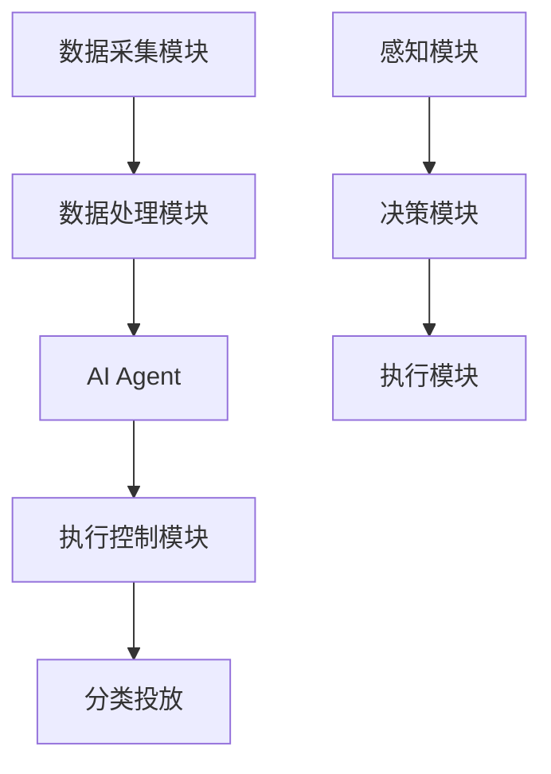

# AI Agent在智能垃圾分类系统中的实践

> 关键词：AI Agent、智能垃圾分类系统、机器学习、计算机视觉、自动化决策

> 摘要：本文深入探讨了AI Agent在智能垃圾分类系统中的实践应用。详细介绍了智能垃圾分类系统的背景，包括目的、预期读者、文档结构和相关术语。阐述了AI Agent的核心概念、算法原理以及涉及的数学模型。通过项目实战展示了如何搭建开发环境、实现源代码并进行解读分析。同时，列举了AI Agent在智能垃圾分类系统中的实际应用场景，推荐了相关的学习资源、开发工具框架和论文著作。最后总结了该领域的未来发展趋势与挑战，并提供了常见问题的解答和扩展阅读参考资料。

## 1. 背景介绍 
### 1.1 目的和范围
随着全球环境问题的日益严峻，垃圾分类成为了环境保护的重要环节。传统的垃圾分类方式主要依赖人工，效率低下且容易出现错误。智能垃圾分类系统的出现旨在利用先进的技术手段，提高垃圾分类的准确性和效率。本文的目的是探讨AI Agent在智能垃圾分类系统中的应用，详细介绍其原理、实现步骤和实际应用场景。范围涵盖了从核心概念的理解到项目实战的具体操作，以及相关工具和资源的推荐。

### 1.2 预期读者
本文预期读者包括对人工智能、计算机视觉和智能垃圾分类系统感兴趣的技术爱好者、研究人员和开发者。对于想要了解AI Agent在实际应用中的原理和实现方法的人员，以及希望将相关技术应用到实际项目中的专业人士都具有参考价值。

### 1.3 文档结构概述
本文将按照以下结构进行组织：首先介绍相关背景信息，包括目的、预期读者和文档结构；接着阐述AI Agent和智能垃圾分类系统的核心概念及其联系；然后详细讲解核心算法原理和具体操作步骤，并给出Python源代码；随后介绍涉及的数学模型和公式，并举例说明；通过项目实战展示代码的实际案例和详细解释；列举AI Agent在智能垃圾分类系统中的实际应用场景；推荐相关的工具和资源；最后总结未来发展趋势与挑战，提供常见问题解答和扩展阅读参考资料。

### 1.4 术语表
#### 1.4.1 核心术语定义
- **AI Agent**：人工智能代理，是一种能够感知环境、做出决策并采取行动以实现特定目标的软件实体。
- **智能垃圾分类系统**：利用先进技术对垃圾进行自动分类的系统，旨在提高垃圾分类的准确性和效率。
- **机器学习**：一门多领域交叉学科，涉及概率论、统计学、逼近论、凸分析、算法复杂度理论等多门学科。它专门研究计算机怎样模拟或实现人类的学习行为，以获取新的知识或技能，重新组织已有的知识结构使之不断改善自身的性能。
- **计算机视觉**：一门研究如何使机器“看”的科学，通过图像和视频数据来理解和解释场景，包括目标检测、图像分类等任务。

#### 1.4.2 相关概念解释
- **感知模块**：AI Agent用于获取环境信息的部分，在智能垃圾分类系统中，通常通过摄像头等设备获取垃圾的图像信息。
- **决策模块**：根据感知模块获取的信息，AI Agent进行分析和推理，做出分类决策的部分。
- **执行模块**：根据决策模块的结果，执行相应操作的部分，在智能垃圾分类系统中，可能是控制机械臂将垃圾放入相应的分类箱。

#### 1.4.3 缩略词列表
- **CNN**：Convolutional Neural Network，卷积神经网络，是一种常用于计算机视觉任务的深度学习模型。
- **ML**：Machine Learning，机器学习。
- **CV**：Computer Vision，计算机视觉。

## 2. 核心概念与联系 

### 2.1 AI Agent核心概念
AI Agent是一种能够自主感知环境、做出决策并采取行动的软件实体。它具有以下几个关键特性：
- **自主性**：能够在没有人类干预的情况下，自主地感知环境并做出决策。
- **反应性**：能够对环境的变化做出及时的反应。
- **目标导向性**：具有明确的目标，并能够通过一系列的行动来实现这些目标。

在智能垃圾分类系统中，AI Agent的主要目标是准确地对垃圾进行分类。它通过感知模块获取垃圾的图像信息，然后利用决策模块对图像进行分析，判断垃圾的类别，最后通过执行模块将垃圾放入相应的分类箱。

### 2.2 智能垃圾分类系统核心概念
智能垃圾分类系统是一个综合性的系统，主要由以下几个部分组成：
- **数据采集模块**：通过摄像头等设备采集垃圾的图像数据。
- **数据处理模块**：对采集到的图像数据进行预处理，如裁剪、缩放、归一化等。
- **分类识别模块**：利用机器学习或深度学习算法对预处理后的图像进行分类识别，判断垃圾的类别。
- **执行控制模块**：根据分类识别的结果，控制机械臂等设备将垃圾放入相应的分类箱。

### 2.3 核心概念联系
AI Agent与智能垃圾分类系统密切相关。AI Agent作为智能垃圾分类系统的核心，负责整个系统的感知、决策和执行过程。数据采集模块为AI Agent提供感知所需的环境信息，数据处理模块对信息进行预处理，以便AI Agent更好地进行分析。分类识别模块是AI Agent决策的关键部分，利用各种算法对垃圾进行分类。执行控制模块则根据AI Agent的决策结果，实现垃圾的分类投放。

### 2.4 文本示意图
```plaintext
智能垃圾分类系统
|-- 数据采集模块（摄像头）
|   |-- 采集垃圾图像
|-- 数据处理模块
|   |-- 图像裁剪、缩放、归一化
|-- AI Agent
|   |-- 感知模块（接收处理后图像）
|   |-- 决策模块（分类识别）
|   |-- 执行模块（控制机械臂）
|-- 执行控制模块
|   |-- 控制机械臂投放垃圾
```

### 2.5 Mermaid流程图


## 3. 核心算法原理 & 具体操作步骤 

### 3.1 核心算法原理
在智能垃圾分类系统中，常用的核心算法是卷积神经网络（CNN）。CNN是一种专门用于处理具有网格结构数据（如图像）的深度学习模型，它通过卷积层、池化层和全连接层等组件，自动提取图像的特征，并进行分类。

#### 卷积层
卷积层是CNN的核心组件，它通过卷积核（滤波器）在图像上滑动，进行卷积操作，提取图像的局部特征。卷积操作可以表示为：
$$y_{i,j}^k = \sum_{m=0}^{M-1} \sum_{n=0}^{N-1} x_{i+m,j+n} w_{m,n}^k + b^k$$
其中，$x$ 是输入图像，$w$ 是卷积核，$b$ 是偏置，$y$ 是卷积结果。

#### 池化层
池化层用于降低特征图的维度，减少计算量，同时增强模型的鲁棒性。常用的池化操作有最大池化和平均池化。最大池化操作可以表示为：
$$y_{i,j}^k = \max_{m=0}^{M-1} \max_{n=0}^{N-1} x_{i\times s+m,j\times s+n}^k$$
其中，$s$ 是池化步长。

#### 全连接层
全连接层将卷积层和池化层提取的特征进行整合，输出分类结果。它的每个神经元都与上一层的所有神经元相连。

### 3.2 具体操作步骤
#### 数据准备
首先，需要收集大量的垃圾图像数据，并对其进行标注，标记出每个图像对应的垃圾类别。然后，将数据集划分为训练集、验证集和测试集。

#### 模型构建
使用Python和深度学习框架（如TensorFlow或PyTorch）构建CNN模型。以下是一个简单的TensorFlow实现示例：
```python
import tensorflow as tf
from tensorflow.keras import layers, models

# 构建CNN模型
model = models.Sequential([
    layers.Conv2D(32, (3, 3), activation='relu', input_shape=(150, 150, 3)),
    layers.MaxPooling2D((2, 2)),
    layers.Conv2D(64, (3, 3), activation='relu'),
    layers.MaxPooling2D((2, 2)),
    layers.Conv2D(128, (3, 3), activation='relu'),
    layers.MaxPooling2D((2, 2)),
    layers.Flatten(),
    layers.Dense(128, activation='relu'),
    layers.Dense(4, activation='softmax')  # 假设分为4类垃圾
])

# 编译模型
model.compile(optimizer='adam',
              loss='sparse_categorical_crossentropy',
              metrics=['accuracy'])
```

#### 模型训练
使用训练集对模型进行训练，并使用验证集进行验证。训练过程中，模型会不断调整参数，以提高分类准确率。
```python
# 假设train_images和train_labels是训练集数据和标签，val_images和val_labels是验证集数据和标签
history = model.fit(train_images, train_labels, epochs=10, 
                    validation_data=(val_images, val_labels))
```

#### 模型评估
使用测试集对训练好的模型进行评估，计算模型的准确率、召回率等指标。
```python
test_loss, test_acc = model.evaluate(test_images, test_labels)
print(f"Test accuracy: {test_acc}")
```

#### 模型部署
将训练好的模型部署到智能垃圾分类系统中，实时对垃圾图像进行分类识别，并控制机械臂进行分类投放。

## 4. 数学模型和公式 & 详细讲解 & 举例说明 

### 4.1 损失函数
在训练CNN模型时，需要使用损失函数来衡量模型的预测结果与真实标签之间的差异。常用的损失函数是交叉熵损失函数。对于多分类问题，稀疏交叉熵损失函数可以表示为：
$$L(y, \hat{y}) = -\sum_{i=1}^{N} y_i \log(\hat{y}_i)$$
其中，$y$ 是真实标签，$\hat{y}$ 是模型的预测结果，$N$ 是类别数。

### 4.2 优化算法
为了最小化损失函数，需要使用优化算法来更新模型的参数。常用的优化算法是随机梯度下降（SGD）及其变种，如Adam。Adam算法结合了动量和自适应学习率的思想，能够更快地收敛。其更新公式如下：
$$m_t = \beta_1 m_{t-1} + (1 - \beta_1) g_t$$
$$v_t = \beta_2 v_{t-1} + (1 - \beta_2) g_t^2$$
$$\hat{m}_t = \frac{m_t}{1 - \beta_1^t}$$
$$\hat{v}_t = \frac{v_t}{1 - \beta_2^t}$$
$$\theta_{t+1} = \theta_t - \frac{\alpha}{\sqrt{\hat{v}_t} + \epsilon} \hat{m}_t$$
其中，$m_t$ 和 $v_t$ 分别是一阶矩估计和二阶矩估计，$\beta_1$ 和 $\beta_2$ 是衰减率，$g_t$ 是梯度，$\alpha$ 是学习率，$\epsilon$ 是一个小的常数。

### 4.3 举例说明
假设我们有一个简单的二分类问题，真实标签 $y = [1, 0, 1]$，模型的预测结果 $\hat{y} = [[0.2, 0.8], [0.7, 0.3], [0.1, 0.9]]$。使用稀疏交叉熵损失函数计算损失：
```python
import tensorflow as tf

y = tf.constant([1, 0, 1], dtype=tf.int32)
y_pred = tf.constant([[0.2, 0.8], [0.7, 0.3], [0.1, 0.9]], dtype=tf.float32)

loss = tf.keras.losses.sparse_categorical_crossentropy(y, y_pred)
average_loss = tf.reduce_mean(loss)
print(f"Loss: {average_loss.numpy()}")
```

## 5. 项目实战：代码实际案例和详细解释说明 

### 5.1  开发环境搭建
#### 安装Python
首先，需要安装Python环境。可以从Python官方网站（https://www.python.org/downloads/）下载适合自己操作系统的Python版本，并进行安装。

#### 安装深度学习框架
本文使用TensorFlow作为深度学习框架。可以使用以下命令安装TensorFlow：
```bash
pip install tensorflow
```

#### 安装其他依赖库
还需要安装一些其他的依赖库，如NumPy、OpenCV等。可以使用以下命令进行安装：
```bash
pip install numpy opencv-python
```

### 5.2  源代码详细实现和代码解读
```python
import tensorflow as tf
from tensorflow.keras import layers, models
import numpy as np
import cv2

# 数据准备
# 假设我们有一个简单的数据集，这里只是示例，实际需要真实的垃圾图像数据
train_images = np.random.rand(100, 150, 150, 3).astype(np.float32)
train_labels = np.random.randint(0, 4, 100)
test_images = np.random.rand(20, 150, 150, 3).astype(np.float32)
test_labels = np.random.randint(0, 4, 20)

# 构建CNN模型
model = models.Sequential([
    layers.Conv2D(32, (3, 3), activation='relu', input_shape=(150, 150, 3)),
    layers.MaxPooling2D((2, 2)),
    layers.Conv2D(64, (3, 3), activation='relu'),
    layers.MaxPooling2D((2, 2)),
    layers.Conv2D(128, (3, 3), activation='relu'),
    layers.MaxPooling2D((2, 2)),
    layers.Flatten(),
    layers.Dense(128, activation='relu'),
    layers.Dense(4, activation='softmax')  # 假设分为4类垃圾
])

# 编译模型
model.compile(optimizer='adam',
              loss='sparse_categorical_crossentropy',
              metrics=['accuracy'])

# 模型训练
history = model.fit(train_images, train_labels, epochs=10, 
                    validation_data=(test_images, test_labels))

# 模型评估
test_loss, test_acc = model.evaluate(test_images, test_labels)
print(f"Test accuracy: {test_acc}")

# 模型预测
# 假设我们有一张新的垃圾图像
new_image = np.random.rand(1, 150, 150, 3).astype(np.float32)
predictions = model.predict(new_image)
predicted_class = np.argmax(predictions)
print(f"Predicted class: {predicted_class}")
```

### 5.3  代码解读与分析
#### 数据准备部分
```python
train_images = np.random.rand(100, 150, 150, 3).astype(np.float32)
train_labels = np.random.randint(0, 4, 100)
test_images = np.random.rand(20, 150, 150, 3).astype(np.float32)
test_labels = np.random.randint(0, 4, 20)
```
这里使用随机数据作为示例，实际应用中需要使用真实的垃圾图像数据，并进行标注。

#### 模型构建部分
```python
model = models.Sequential([
    layers.Conv2D(32, (3, 3), activation='relu', input_shape=(150, 150, 3)),
    layers.MaxPooling2D((2, 2)),
    layers.Conv2D(64, (3, 3), activation='relu'),
    layers.MaxPooling2D((2, 2)),
    layers.Conv2D(128, (3, 3), activation='relu'),
    layers.MaxPooling2D((2, 2)),
    layers.Flatten(),
    layers.Dense(128, activation='relu'),
    layers.Dense(4, activation='softmax')  # 假设分为4类垃圾
])
```
使用`Sequential`模型构建了一个简单的CNN模型，包含卷积层、池化层和全连接层。

#### 模型编译部分
```python
model.compile(optimizer='adam',
              loss='sparse_categorical_crossentropy',
              metrics=['accuracy'])
```
使用Adam优化器和稀疏交叉熵损失函数编译模型，并设置评估指标为准确率。

#### 模型训练部分
```python
history = model.fit(train_images, train_labels, epochs=10, 
                    validation_data=(test_images, test_labels))
```
使用训练集对模型进行训练，并使用验证集进行验证，训练10个epoch。

#### 模型评估部分
```python
test_loss, test_acc = model.evaluate(test_images, test_labels)
print(f"Test accuracy: {test_acc}")
```
使用测试集对模型进行评估，计算测试集的损失和准确率。

#### 模型预测部分
```python
new_image = np.random.rand(1, 150, 150, 3).astype(np.float32)
predictions = model.predict(new_image)
predicted_class = np.argmax(predictions)
print(f"Predicted class: {predicted_class}")
```
对一张新的垃圾图像进行预测，输出预测的类别。

## 6. 实际应用场景 
### 家庭智能垃圾分类
在家庭中，可以安装智能垃圾分类设备，通过摄像头采集垃圾图像，利用AI Agent进行分类识别，然后控制机械臂将垃圾放入相应的分类箱。这样可以提高家庭垃圾分类的准确性和效率，减少人工分类的麻烦。

### 公共场所垃圾分类
在公共场所，如商场、学校、公园等，可以设置智能垃圾分类亭。AI Agent可以实时对人们投放的垃圾进行分类识别，如果分类错误，会及时提醒人们重新分类。这有助于提高公共场所垃圾分类的质量，营造良好的环境。

### 垃圾处理厂智能分拣
在垃圾处理厂，可以使用AI Agent和机器人结合的方式进行垃圾分拣。AI Agent通过计算机视觉技术对传送带上的垃圾进行分类识别，然后控制机器人将垃圾分拣到不同的处理区域。这可以大大提高垃圾处理厂的分拣效率，降低人工成本。

## 7. 工具和资源推荐
### 7.1 学习资源推荐
#### 7.1.1 书籍推荐
- 《深度学习》（Deep Learning）：由Ian Goodfellow、Yoshua Bengio和Aaron Courville撰写，是深度学习领域的经典教材，涵盖了深度学习的基本概念、算法和应用。
- 《Python深度学习》（Deep Learning with Python）：由Francois Chollet撰写，结合Python和Keras框架，介绍了深度学习的实践方法。
- 《计算机视觉：算法与应用》（Computer Vision: Algorithms and Applications）：由Richard Szeliski撰写，详细介绍了计算机视觉的各种算法和应用。

#### 7.1.2 在线课程
- Coursera上的“深度学习专项课程”（Deep Learning Specialization）：由Andrew Ng教授授课，包括深度学习基础、卷积神经网络、循环神经网络等内容。
- edX上的“人工智能导论”（Introduction to Artificial Intelligence）：介绍了人工智能的基本概念、算法和应用。
- 哔哩哔哩上有很多关于深度学习和计算机视觉的免费教程，如“李宏毅机器学习”等。

#### 7.1.3 技术博客和网站
- Medium：有很多技术博主分享深度学习和人工智能的最新研究成果和实践经验。
- arXiv：是一个预印本平台，提供了大量的学术论文，涵盖了人工智能、机器学习等领域。
- 机器之心：专注于人工智能领域的资讯和技术分享，提供了很多有价值的文章和报告。

### 7.2 开发工具框架推荐
#### 7.2.1 IDE和编辑器
- PyCharm：是一款专门为Python开发设计的集成开发环境，具有代码自动补全、调试、版本控制等功能。
- Jupyter Notebook：是一个交互式的开发环境，适合进行数据分析、模型训练和实验。
- Visual Studio Code：是一款轻量级的代码编辑器，支持多种编程语言，并且有丰富的插件扩展。

#### 7.2.2 调试和性能分析工具
- TensorBoard：是TensorFlow的可视化工具，可以用于可视化模型的训练过程、损失函数曲线、模型结构等。
- PyTorch Profiler：是PyTorch的性能分析工具，可以帮助开发者分析模型的性能瓶颈，优化代码。
- cProfile：是Python的内置性能分析工具，可以分析Python代码的运行时间和函数调用情况。

#### 7.2.3 相关框架和库
- TensorFlow：是一个开源的深度学习框架，具有强大的计算能力和丰富的工具集，广泛应用于图像识别、自然语言处理等领域。
- PyTorch：是另一个流行的深度学习框架，具有动态图机制，易于使用和调试，受到很多研究人员的喜爱。
- OpenCV：是一个开源的计算机视觉库，提供了丰富的图像处理和计算机视觉算法，如图像滤波、特征提取、目标检测等。

### 7.3 相关论文著作推荐
#### 7.3.1 经典论文
- “ImageNet Classification with Deep Convolutional Neural Networks”：AlexNet的论文，开启了深度学习在计算机视觉领域的热潮。
- “Very Deep Convolutional Networks for Large-Scale Image Recognition”：VGGNet的论文，提出了一种非常深的卷积神经网络结构。
- “Going Deeper with Convolutions”：GoogLeNet的论文，引入了Inception模块，提高了模型的性能和效率。

#### 7.3.2 最新研究成果
- 关注顶级学术会议，如CVPR、ICCV、NeurIPS等，这些会议上会发表很多关于人工智能和计算机视觉的最新研究成果。
- 关注知名学术期刊，如Journal of Artificial Intelligence Research（JAIR）、Artificial Intelligence等，这些期刊上也会发表高质量的研究论文。

#### 7.3.3 应用案例分析
- 可以在IEEE Xplore、ACM Digital Library等数据库中搜索关于智能垃圾分类系统的应用案例分析论文，了解实际应用中的问题和解决方案。

## 8. 总结：未来发展趋势与挑战
### 未来发展趋势
- **多模态融合**：未来的智能垃圾分类系统可能会融合多种模态的信息，如视觉、听觉、嗅觉等，以提高分类的准确性。例如，结合垃圾的气味信息可以更好地区分一些容易混淆的垃圾。
- **强化学习应用**：强化学习可以使AI Agent在与环境的交互中不断学习和优化决策策略。在智能垃圾分类系统中，强化学习可以用于优化机械臂的操作路径和分类策略，提高系统的效率。
- **边缘计算与物联网结合**：将AI Agent部署到边缘设备上，结合物联网技术，可以实现实时、高效的垃圾分类。边缘设备可以在本地进行数据处理和分类识别，减少数据传输延迟，同时降低云端服务器的压力。

### 挑战
- **数据质量和多样性**：高质量、多样化的训练数据是提高模型性能的关键。然而，收集和标注大量的垃圾图像数据是一项艰巨的任务，而且不同地区、不同场景下的垃圾特征可能存在差异，需要考虑数据的代表性。
- **模型鲁棒性**：在实际应用中，智能垃圾分类系统可能会面临各种复杂的环境条件，如光照变化、遮挡、噪声等。模型需要具备较强的鲁棒性，能够在不同的环境下准确地进行分类识别。
- **成本和可扩展性**：智能垃圾分类系统的建设和维护成本较高，包括设备采购、数据标注、模型训练等方面。同时，系统需要具备良好的可扩展性，以适应不同规模和场景的需求。

## 9. 附录：常见问题与解答
### 问题1：如何提高智能垃圾分类系统的分类准确率？
解答：可以从以下几个方面入手：
- 收集更多高质量、多样化的训练数据，覆盖不同类型、不同场景下的垃圾。
- 选择合适的深度学习模型，并进行适当的调优，如调整模型的层数、神经元数量、学习率等。
- 采用数据增强技术，如旋转、翻转、缩放等，增加训练数据的多样性。
- 进行模型融合，将多个不同的模型进行组合，提高分类准确率。

### 问题2：智能垃圾分类系统在实际应用中会遇到哪些问题？
解答：可能会遇到以下问题：
- 环境因素影响，如光照不足、灰尘、潮湿等，可能会导致图像采集质量下降，影响分类准确率。
- 垃圾的形态和摆放方式可能会影响模型的识别效果，例如垃圾被挤压、变形或堆叠在一起。
- 系统的可靠性和稳定性问题，如机械臂故障、网络中断等，可能会影响系统的正常运行。

### 问题3：如何选择合适的深度学习框架？
解答：可以考虑以下因素：
- 学习成本：不同的框架有不同的学习曲线，初学者可以选择易于上手的框架，如Keras。
- 性能和效率：对于大规模的深度学习任务，需要选择计算效率高的框架，如TensorFlow和PyTorch。
- 社区支持：选择社区活跃的框架，这样可以更容易获取相关的文档、教程和开源代码。
- 应用场景：不同的框架在不同的应用场景下可能有不同的优势，例如TensorFlow在工业界应用广泛，而PyTorch在学术界更受欢迎。

## 10. 扩展阅读 & 参考资料
- Goodfellow, I., Bengio, Y., & Courville, A. (2016). Deep Learning. MIT Press.
- Chollet, F. (2017). Deep Learning with Python. Manning Publications.
- Szeliski, R. (2010). Computer Vision: Algorithms and Applications. Springer.
- Krizhevsky, A., Sutskever, I., & Hinton, G. E. (2012). ImageNet Classification with Deep Convolutional Neural Networks. Advances in neural information processing systems.
- Simonyan, K., & Zisserman, A. (2014). Very Deep Convolutional Networks for Large-Scale Image Recognition. arXiv preprint arXiv:1409.1556.
- Szegedy, C., Liu, W., Jia, Y., Sermanet, P., Reed, S., Anguelov, D.,... & Rabinovich, A. (2015). Going Deeper with Convolutions. Proceedings of the IEEE conference on computer vision and pattern recognition.

作者：AI天才研究院/AI Genius Institute & 禅与计算机程序设计艺术 /Zen And The Art of Computer Programming