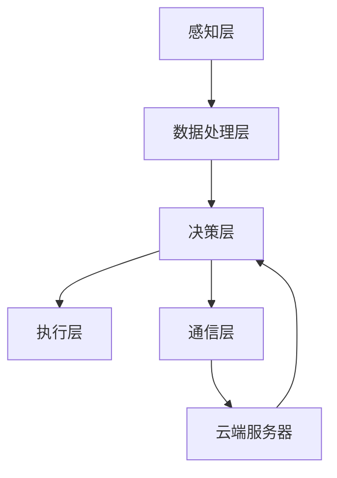

# AI Agent在智能垃圾桶中的回收价值评估

> 关键词：AI Agent、智能垃圾桶、回收价值评估、机器学习、计算机视觉

> 摘要：本文聚焦于AI Agent在智能垃圾桶回收价值评估中的应用。首先介绍了相关背景，包括目的、预期读者、文档结构和术语表。接着阐述了核心概念，如AI Agent和智能垃圾桶的原理及联系，并给出了相应的示意图和流程图。详细讲解了核心算法原理及操作步骤，结合Python代码进行说明。探讨了数学模型和公式，并举例解释。通过项目实战，展示了代码实现和解读。分析了实际应用场景，推荐了学习资源、开发工具框架和相关论文著作。最后总结了未来发展趋势与挑战，提供了常见问题解答和扩展阅读参考资料，旨在为该领域的研究和应用提供全面而深入的指导。

## 1. 背景介绍 
### 1.1 目的和范围
随着环保意识的日益增强，垃圾分类和资源回收变得愈发重要。智能垃圾桶作为实现高效垃圾分类和回收的重要工具，其发展受到广泛关注。AI Agent能够为智能垃圾桶提供更智能的决策能力，尤其是在回收价值评估方面。本文章的目的在于深入探讨AI Agent如何在智能垃圾桶中进行回收价值评估，涵盖从基本概念、算法原理到实际应用等多个方面，旨在为相关领域的研究人员、开发者和从业者提供全面的技术指导和理论支持。

### 1.2 预期读者
本文的预期读者包括但不限于人工智能领域的研究人员、软件开发工程师、智能硬件开发者、环保行业从业者以及对智能垃圾桶和资源回收感兴趣的技术爱好者。这些读者可以从本文中获取关于AI Agent在智能垃圾桶回收价值评估方面的专业知识和实践经验。

### 1.3 文档结构概述
本文将按照以下结构进行阐述：首先介绍核心概念，包括AI Agent和智能垃圾桶的原理及它们之间的联系，并给出相应的示意图和流程图；接着详细讲解核心算法原理和具体操作步骤，同时使用Python代码进行说明；然后探讨数学模型和公式，并通过举例进行详细解释；之后通过项目实战展示代码的实际实现和解读；分析实际应用场景；推荐学习资源、开发工具框架和相关论文著作；最后总结未来发展趋势与挑战，提供常见问题解答和扩展阅读参考资料。

### 1.4 术语表
#### 1.4.1 核心术语定义
- **AI Agent（人工智能代理）**：是一种能够感知环境、进行决策并采取行动以实现特定目标的智能实体。在智能垃圾桶的场景中，AI Agent可以通过各种传感器获取垃圾的相关信息，并根据这些信息评估其回收价值。
- **智能垃圾桶**：是一种集成了传感器、处理器和通信模块的垃圾桶，能够自动识别垃圾的种类、数量和状态，并根据预设的规则进行分类和处理。
- **回收价值评估**：是指对垃圾的可回收性和回收价值进行量化评估的过程，考虑因素包括垃圾的种类、质量、市场价格等。

#### 1.4.2 相关概念解释
- **机器学习**：是一门多领域交叉学科，涉及概率论、统计学、逼近论、凸分析、算法复杂度理论等多门学科。它专门研究计算机怎样模拟或实现人类的学习行为，以获取新的知识或技能，重新组织已有的知识结构使之不断改善自身的性能。在智能垃圾桶的回收价值评估中，机器学习算法可以用于对垃圾图像进行分类、预测垃圾的质量等。
- **计算机视觉**：是一门研究如何使机器“看”的科学，更进一步的说，就是指用摄影机和电脑代替人眼对目标进行识别、跟踪和测量等机器视觉，并进一步做图形处理，使电脑处理成为更适合人眼观察或传送给仪器检测的图像。在智能垃圾桶中，计算机视觉技术可以用于识别垃圾的种类和外观特征。

#### 1.4.3 缩略词列表
- **CNN（Convolutional Neural Network）**：卷积神经网络，是一种专门为处理具有网格结构数据（如图像）而设计的深度学习模型。
- **SVM（Support Vector Machine）**：支持向量机，是一种常用的机器学习算法，可用于分类和回归分析。

## 2. 核心概念与联系 
### 核心概念原理
#### AI Agent原理
AI Agent的核心是其决策机制，它通过感知环境中的信息，将这些信息输入到内部的模型或算法中进行处理，然后根据处理结果做出决策并采取相应的行动。在智能垃圾桶的场景中，AI Agent的感知模块可以通过摄像头、重量传感器等设备获取垃圾的图像、重量等信息。决策模块则根据这些信息，结合预设的规则或训练好的模型，评估垃圾的回收价值，并决定是否将其分类为可回收垃圾。

#### 智能垃圾桶原理
智能垃圾桶通常由传感器、处理器、执行器和通信模块组成。传感器负责收集垃圾的相关信息，如重量、体积、图像等；处理器对传感器收集到的信息进行处理和分析；执行器根据处理器的指令，对垃圾进行分类和处理，如打开相应的垃圾桶盖子；通信模块则用于与外部设备或系统进行数据传输和交互，如将垃圾的信息上传到云端服务器。

### 架构的文本示意图
智能垃圾桶中的AI Agent回收价值评估架构主要包括以下几个部分：
1. **感知层**：由各种传感器组成，如摄像头、重量传感器、红外传感器等，用于收集垃圾的相关信息。
2. **数据处理层**：对感知层收集到的数据进行预处理，如图像的降噪、归一化，重量数据的校准等。然后将处理后的数据输入到AI Agent的决策模块中。
3. **决策层**：AI Agent的核心部分，根据输入的数据，结合预设的规则或训练好的模型，评估垃圾的回收价值，并做出决策，如判断垃圾是否可回收、属于哪种可回收类别等。
4. **执行层**：根据决策层的指令，控制智能垃圾桶的执行器，如打开相应的垃圾桶盖子，将垃圾分类投放。
5. **通信层**：负责将智能垃圾桶中的数据上传到云端服务器，同时接收云端服务器的指令和更新信息。

### Mermaid流程图


## 3. 核心算法原理 & 具体操作步骤 
### 核心算法原理
在智能垃圾桶的回收价值评估中，常用的算法包括机器学习算法和深度学习算法。这里以卷积神经网络（CNN）为例，介绍其在垃圾图像分类中的应用。

卷积神经网络是一种深度学习模型，它通过卷积层、池化层和全连接层等组件，自动提取图像的特征，并进行分类。卷积层通过卷积核在图像上滑动，提取图像的局部特征；池化层则对卷积层的输出进行下采样，减少数据量；全连接层将池化层的输出进行分类。

### 具体操作步骤
#### 数据收集
收集大量的垃圾图像数据，并对其进行标注，标注信息包括垃圾的种类、回收价值等。

#### 数据预处理
对收集到的图像数据进行预处理，包括图像的缩放、裁剪、归一化等操作，以提高模型的训练效果。

#### 模型训练
使用预处理后的图像数据对CNN模型进行训练。训练过程中，通过调整模型的参数，使模型的输出与标注信息尽可能接近。

#### 模型评估
使用测试数据集对训练好的模型进行评估，计算模型的准确率、召回率等指标，评估模型的性能。

#### 模型部署
将训练好的模型部署到智能垃圾桶的处理器中，实时对垃圾图像进行分类和回收价值评估。

### Python源代码详细阐述
```python
import tensorflow as tf
from tensorflow.keras import layers, models

# 构建CNN模型
def build_cnn_model():
    model = models.Sequential()
    model.add(layers.Conv2D(32, (3, 3), activation='relu', input_shape=(150, 150, 3)))
    model.add(layers.MaxPooling2D((2, 2)))
    model.add(layers.Conv2D(64, (3, 3), activation='relu'))
    model.add(layers.MaxPooling2D((2, 2)))
    model.add(layers.Conv2D(128, (3, 3), activation='relu'))
    model.add(layers.MaxPooling2D((2, 2)))
    model.add(layers.Flatten())
    model.add(layers.Dense(128, activation='relu'))
    model.add(layers.Dense(10, activation='softmax'))  # 假设共有10种垃圾类别

    model.compile(optimizer='adam',
                  loss='sparse_categorical_crossentropy',
                  metrics=['accuracy'])
    return model

# 数据加载和预处理
def load_and_preprocess_data():
    (train_images, train_labels), (test_images, test_labels) = tf.keras.datasets.cifar10.load_data()
    train_images, test_images = train_images / 255.0, test_images / 255.0
    return train_images, train_labels, test_images, test_labels

# 模型训练
def train_model(model, train_images, train_labels, epochs=10):
    history = model.fit(train_images, train_labels, epochs=epochs)
    return history

# 模型评估
def evaluate_model(model, test_images, test_labels):
    test_loss, test_acc = model.evaluate(test_images, test_labels)
    print(f"Test accuracy: {test_acc}")

# 主函数
def main():
    model = build_cnn_model()
    train_images, train_labels, test_images, test_labels = load_and_preprocess_data()
    train_model(model, train_images, train_labels)
    evaluate_model(model, test_images, test_labels)

if __name__ == "__main__":
    main()
```

## 4. 数学模型和公式 & 详细讲解 & 举例说明 
### 数学模型
在智能垃圾桶的回收价值评估中，可以使用线性回归模型来预测垃圾的回收价值。线性回归模型的基本形式为：

$$y = \theta_0 + \theta_1x_1 + \theta_2x_2 + \cdots + \theta_nx_n$$

其中，$y$ 表示垃圾的回收价值，$x_1, x_2, \cdots, x_n$ 表示影响回收价值的因素，如垃圾的重量、种类、市场价格等，$\theta_0, \theta_1, \cdots, \theta_n$ 是模型的参数。

### 详细讲解
线性回归模型的目标是通过最小化预测值与真实值之间的误差，来确定模型的参数 $\theta_0, \theta_1, \cdots, \theta_n$。常用的误差度量方法是均方误差（Mean Squared Error，MSE），其公式为：

$$MSE = \frac{1}{m} \sum_{i=1}^{m} (y^{(i)} - \hat{y}^{(i)})^2$$

其中，$m$ 是样本数量，$y^{(i)}$ 是第 $i$ 个样本的真实回收价值，$\hat{y}^{(i)}$ 是第 $i$ 个样本的预测回收价值。

为了最小化均方误差，可以使用梯度下降算法来更新模型的参数。梯度下降算法的更新公式为：

$$\theta_j := \theta_j - \alpha \frac{\partial}{\partial \theta_j} MSE$$

其中，$\alpha$ 是学习率，控制参数更新的步长。

### 举例说明
假设我们要预测某种塑料垃圾的回收价值，影响因素包括垃圾的重量 $x_1$ 和市场价格 $x_2$。我们收集了以下样本数据：

| 重量（kg） | 市场价格（元/kg） | 回收价值（元） |
| --- | --- | --- |
| 1 | 2 | 2 |
| 2 | 3 | 6 |
| 3 | 4 | 12 |

我们可以使用线性回归模型来拟合这些数据。首先，将数据表示为矩阵形式：

$$X = \begin{bmatrix} 1 & 1 & 2 \\ 1 & 2 & 3 \\ 1 & 3 & 4 \end{bmatrix}, y = \begin{bmatrix} 2 \\ 6 \\ 12 \end{bmatrix}$$

然后，使用最小二乘法求解模型的参数：

$$\theta = (X^T X)^{-1} X^T y$$

计算得到：

$$\theta = \begin{bmatrix} 0 \\ 0 \\ 1 \end{bmatrix}$$

即模型的表达式为：

$$y = x_1x_2$$

这意味着该种塑料垃圾的回收价值等于其重量乘以市场价格。

## 5. 项目实战：代码实际案例和详细解释说明 
### 5.1  开发环境搭建
#### 硬件环境
- 智能垃圾桶硬件平台，如树莓派、Arduino等。
- 摄像头，用于采集垃圾图像。
- 重量传感器，用于测量垃圾的重量。

#### 软件环境
- 操作系统：Linux（如Raspbian）。
- 编程语言：Python 3.x。
- 深度学习框架：TensorFlow、Keras。
- 图像处理库：OpenCV。

### 5.2  源代码详细实现和代码解读
```python
import cv2
import tensorflow as tf
import numpy as np

# 加载训练好的CNN模型
model = tf.keras.models.load_model('garbage_classification_model.h5')

# 定义垃圾类别
garbage_classes = ['paper', 'plastic', 'glass', 'metal', 'organic']

# 定义回收价值字典
recycling_values = {
    'paper': 0.5,
    'plastic': 1.0,
    'glass': 0.3,
    'metal': 2.0,
    'organic': 0
}

# 摄像头初始化
cap = cv2.VideoCapture(0)

while True:
    ret, frame = cap.read()
    if not ret:
        break

    # 图像预处理
    resized_frame = cv2.resize(frame, (150, 150))
    input_image = np.expand_dims(resized_frame, axis=0)
    input_image = input_image / 255.0

    # 进行垃圾分类预测
    predictions = model.predict(input_image)
    predicted_class_index = np.argmax(predictions)
    predicted_class = garbage_classes[predicted_class_index]

    # 计算回收价值
    recycling_value = recycling_values[predicted_class]

    # 在图像上显示预测结果和回收价值
    cv2.putText(frame, f"Class: {predicted_class}", (10, 30), cv2.FONT_HERSHEY_SIMPLEX, 1, (0, 255, 0), 2)
    cv2.putText(frame, f"Recycling Value: {recycling_value} yuan", (10, 70), cv2.FONT_HERSHEY_SIMPLEX, 1, (0, 255, 0), 2)

    # 显示图像
    cv2.imshow('Garbage Classification', frame)

    # 按 'q' 键退出循环
    if cv2.waitKey(1) & 0xFF == ord('q'):
        break

# 释放摄像头并关闭窗口
cap.release()
cv2.destroyAllWindows()
```

### 代码解读与分析
- **加载模型**：使用 `tf.keras.models.load_model` 函数加载训练好的CNN模型。
- **定义垃圾类别和回收价值字典**：定义了不同垃圾类别的名称和对应的回收价值。
- **摄像头初始化**：使用 `cv2.VideoCapture` 函数初始化摄像头。
- **图像预处理**：将摄像头采集到的图像进行缩放和归一化处理，以适应模型的输入要求。
- **垃圾分类预测**：使用加载的模型对预处理后的图像进行分类预测，得到预测结果。
- **计算回收价值**：根据预测的垃圾类别，从回收价值字典中获取对应的回收价值。
- **显示结果**：在图像上显示预测结果和回收价值，并使用 `cv2.imshow` 函数显示图像。
- **退出循环**：按 'q' 键退出循环，释放摄像头并关闭窗口。

## 6. 实际应用场景 
### 家庭场景
在家庭中，智能垃圾桶可以帮助居民更好地进行垃圾分类。当居民投放垃圾时，AI Agent可以实时评估垃圾的回收价值，并显示在垃圾桶的屏幕上，提高居民的环保意识和垃圾分类的积极性。同时，智能垃圾桶还可以与家庭的智能家居系统集成，将垃圾信息上传到云端，方便居民随时查看。

### 公共场所场景
在公共场所，如商场、学校、公园等，智能垃圾桶可以提高垃圾分类的效率和准确性。大量的人流会产生各种类型的垃圾，AI Agent可以快速准确地识别垃圾的种类和回收价值，引导人们正确投放垃圾。此外，智能垃圾桶还可以通过通信模块将垃圾信息上传到管理部门的服务器，便于管理部门实时监控垃圾的投放情况，合理安排垃圾清理和回收工作。

### 工业场景
在工业生产过程中，会产生大量的废弃物。智能垃圾桶可以安装在工厂的生产线上，实时对废弃物进行分类和回收价值评估。对于可回收的废弃物，AI Agent可以指导工人进行分类收集和处理，提高资源的回收利用率，降低生产成本。同时，智能垃圾桶还可以与工业自动化系统集成，实现废弃物处理的自动化。

## 7. 工具和资源推荐
### 7.1 学习资源推荐
#### 7.1.1 书籍推荐
- 《深度学习》（Deep Learning），Ian Goodfellow、Yoshua Bengio和Aaron Courville著，是深度学习领域的经典教材，全面介绍了深度学习的理论和实践。
- 《Python机器学习》（Python Machine Learning），Sebastian Raschka著，详细介绍了Python在机器学习中的应用，包括各种机器学习算法的实现和案例分析。
- 《计算机视觉：算法与应用》（Computer Vision: Algorithms and Applications），Richard Szeliski著，系统介绍了计算机视觉的基本算法和应用，适合对计算机视觉感兴趣的读者。

#### 7.1.2 在线课程
- Coursera上的“深度学习专项课程”（Deep Learning Specialization），由Andrew Ng教授授课，是深度学习领域最受欢迎的在线课程之一。
- edX上的“人工智能导论”（Introduction to Artificial Intelligence），由麻省理工学院（MIT）的Patrick H. Winston教授授课，全面介绍了人工智能的基本概念和算法。
- Udemy上的“计算机视觉大师课程”（Computer Vision Masterclass），详细介绍了计算机视觉的各种算法和应用，包括图像分类、目标检测等。

#### 7.1.3 技术博客和网站
- Medium：是一个技术博客平台，上面有很多关于人工智能、机器学习和计算机视觉的优秀文章。
- arXiv：是一个预印本数据库，提供了大量的学术论文，包括人工智能领域的最新研究成果。
- Kaggle：是一个数据科学竞赛平台，上面有很多关于机器学习和深度学习的数据集和竞赛项目，可以帮助学习者提高实践能力。

### 7.2 开发工具框架推荐
#### 7.2.1 IDE和编辑器
- PyCharm：是一款专门为Python开发设计的集成开发环境（IDE），具有强大的代码编辑、调试和项目管理功能。
- Jupyter Notebook：是一个交互式的开发环境，适合进行数据探索、模型训练和可视化等工作。
- Visual Studio Code：是一款轻量级的代码编辑器，支持多种编程语言，具有丰富的插件和扩展功能。

#### 7.2.2 调试和性能分析工具
- TensorBoard：是TensorFlow提供的一个可视化工具，可以帮助开发者监控模型的训练过程、可视化模型的结构和性能指标。
- PyTorch Profiler：是PyTorch提供的一个性能分析工具，可以帮助开发者分析模型的性能瓶颈，优化模型的运行效率。
- cProfile：是Python标准库中的一个性能分析工具，可以帮助开发者分析Python代码的性能瓶颈。

#### 7.2.3 相关框架和库
- TensorFlow：是一个开源的深度学习框架，由Google开发，具有强大的计算能力和丰富的工具集。
- PyTorch：是一个开源的深度学习框架，由Facebook开发，具有动态图和易于使用的特点。
- OpenCV：是一个开源的计算机视觉库，提供了各种计算机视觉算法和工具，如图像滤波、特征提取、目标检测等。

### 7.3 相关论文著作推荐
#### 7.3.1 经典论文
- LeCun, Y., Bottou, L., Bengio, Y., & Haffner, P. (1998). Gradient-based learning applied to document recognition. Proceedings of the IEEE, 86(11), 2278-2324. 介绍了卷积神经网络（CNN）在文档识别中的应用，是CNN领域的经典论文。
- Krizhevsky, A., Sutskever, I., & Hinton, G. E. (2012). ImageNet classification with deep convolutional neural networks. Advances in neural information processing systems, 25. 介绍了AlexNet模型，在ImageNet图像分类竞赛中取得了优异的成绩，开启了深度学习在计算机视觉领域的热潮。
- Cortes, C., & Vapnik, V. (1995). Support-vector networks. Machine learning, 20(3), 273-297. 介绍了支持向量机（SVM）的基本原理和算法，是机器学习领域的经典论文。

#### 7.3.2 最新研究成果
- 可以关注每年的计算机视觉和人工智能领域的顶级会议，如CVPR（Computer Vision and Pattern Recognition）、ICCV（International Conference on Computer Vision）、NeurIPS（Neural Information Processing Systems）等，这些会议上会发表很多关于AI Agent、智能垃圾桶和回收价值评估的最新研究成果。

#### 7.3.3 应用案例分析
- 可以关注一些科技公司和研究机构发布的关于智能垃圾桶和资源回收的应用案例分析报告，了解实际应用中的技术方案、挑战和解决方案。

## 8. 总结：未来发展趋势与挑战
### 未来发展趋势
- **智能化程度不断提高**：随着人工智能技术的不断发展，AI Agent在智能垃圾桶中的应用将越来越深入，智能垃圾桶的智能化程度将不断提高。例如，AI Agent可以学习用户的投放习惯，提供个性化的垃圾分类建议；可以与其他智能设备进行协同工作，实现更高效的资源回收。
- **与物联网的融合更加紧密**：智能垃圾桶将与物联网技术更加紧密地融合，实现垃圾信息的实时采集、传输和处理。通过物联网，智能垃圾桶可以与垃圾处理中心、回收企业等进行信息共享，实现垃圾的全程跟踪和管理。
- **环保意识的普及推动市场需求增长**：随着环保意识的不断普及，人们对垃圾分类和资源回收的重视程度越来越高，智能垃圾桶的市场需求将不断增长。同时，政府也将出台更多的政策支持智能垃圾桶的推广和应用。

### 挑战
- **数据质量和标注问题**：AI Agent的性能很大程度上依赖于训练数据的质量和标注的准确性。在智能垃圾桶的应用中，收集大量高质量的垃圾图像数据并进行准确标注是一个挑战。
- **算法的复杂性和计算资源需求**：深度学习算法通常具有较高的复杂性，需要大量的计算资源进行训练和推理。在智能垃圾桶这样的嵌入式设备上运行复杂的算法，需要解决计算资源有限的问题。
- **隐私和安全问题**：智能垃圾桶在收集和处理垃圾信息的过程中，可能会涉及到用户的隐私和安全问题。如何保护用户的隐私和数据安全，是智能垃圾桶发展过程中需要解决的重要问题。

## 9. 附录：常见问题与解答
### 问题1：AI Agent在智能垃圾桶中的回收价值评估准确吗？
解答：AI Agent的回收价值评估准确性取决于多个因素，如训练数据的质量、模型的选择和训练方法等。通过使用大量高质量的训练数据和合适的模型，可以提高回收价值评估的准确性。但在实际应用中，仍然可能存在一定的误差。

### 问题2：智能垃圾桶的成本高吗？
解答：智能垃圾桶的成本取决于其功能和配置。一般来说，具有AI Agent和多种传感器的智能垃圾桶成本相对较高。但随着技术的不断发展和规模化生产，智能垃圾桶的成本有望逐渐降低。

### 问题3：智能垃圾桶可以处理所有类型的垃圾吗？
解答：目前的智能垃圾桶主要针对常见的可回收垃圾和有害垃圾进行分类和处理。对于一些特殊类型的垃圾，如大型家具、建筑垃圾等，可能无法进行处理。未来，随着技术的发展，智能垃圾桶的处理能力可能会不断提高。

### 问题4：智能垃圾桶的数据安全如何保障？
解答：为了保障智能垃圾桶的数据安全，可以采取以下措施：使用加密技术对数据进行加密传输和存储；设置访问权限，只有授权人员才能访问数据；定期对系统进行安全漏洞检测和修复。

## 10. 扩展阅读 & 参考资料
- 相关的行业报告和白皮书，如《智能垃圾桶行业发展报告》等。
- 科技媒体的相关报道，如TechCrunch、Wired等。
- 相关的专利文献，了解智能垃圾桶和AI Agent在回收价值评估方面的最新技术创新。

作者：AI天才研究院/AI Genius Institute & 禅与计算机程序设计艺术 /Zen And The Art of Computer Programming