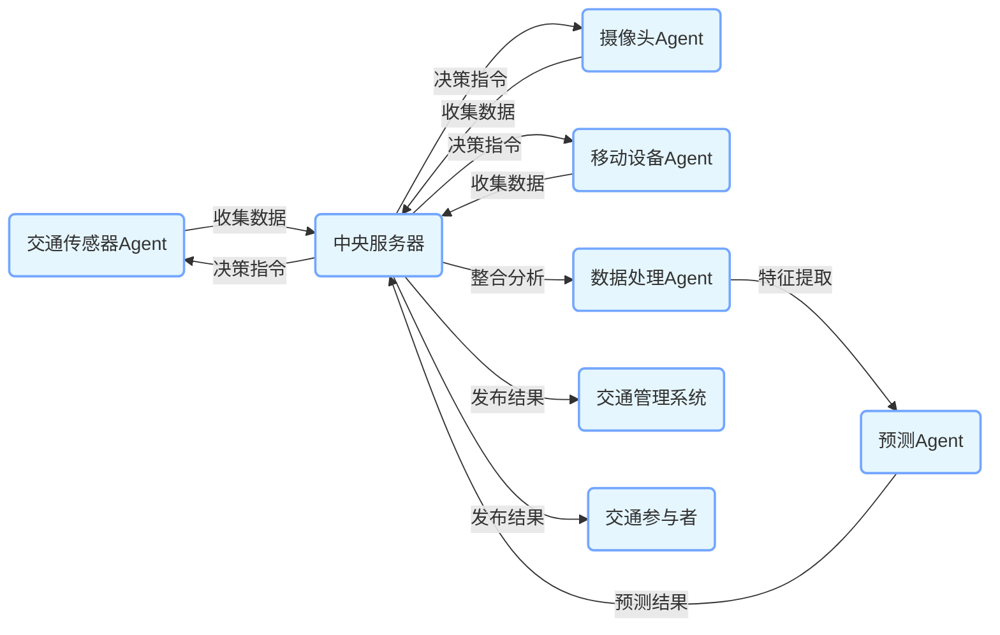

# AI Agent在智能城市交通流预测中的角色

> 关键词：AI Agent、智能城市、交通流预测、多智能体系统、机器学习

> 摘要：本文深入探讨了AI Agent在智能城市交通流预测中的角色。首先介绍了研究的背景、目的、预期读者和文档结构，阐述了相关术语。接着详细解析了AI Agent的核心概念及其与交通流预测的联系，给出了原理和架构的示意图及流程图。通过Python代码阐述了核心算法原理和具体操作步骤，并给出了相关的数学模型和公式。以实际项目为例，说明了开发环境搭建、源代码实现及解读。探讨了AI Agent在智能城市交通流预测中的实际应用场景，推荐了学习资源、开发工具框架和相关论文著作。最后总结了未来发展趋势与挑战，提供了常见问题解答和扩展阅读参考资料。

## 1. 背景介绍 
### 1.1 目的和范围
智能城市的发展使得交通管理面临着巨大的挑战，准确的交通流预测对于优化交通信号控制、合理规划交通路线、减少交通拥堵等具有至关重要的意义。本文的目的是深入研究AI Agent在智能城市交通流预测中的角色，探讨其如何提高交通流预测的准确性和效率。范围涵盖了AI Agent的基本概念、相关算法原理、实际应用案例以及未来发展趋势等方面。

### 1.2 预期读者
本文预期读者包括交通工程领域的研究人员、智能城市相关的开发者、对AI技术在交通领域应用感兴趣的技术爱好者以及相关专业的学生。这些读者可以从本文中获取关于AI Agent在交通流预测中的全面知识，为其研究、开发和学习提供参考。

### 1.3 文档结构概述
本文将按照以下结构进行阐述：首先介绍相关背景知识，包括目的、读者和文档结构等；接着详细解释AI Agent的核心概念以及它与交通流预测的联系；然后阐述核心算法原理和具体操作步骤，并给出相应的数学模型和公式；通过实际项目案例说明AI Agent在交通流预测中的应用；探讨实际应用场景；推荐相关的学习资源、开发工具框架和论文著作；最后总结未来发展趋势与挑战，提供常见问题解答和扩展阅读参考资料。

### 1.4 术语表
#### 1.4.1 核心术语定义
- **AI Agent**：人工智能代理，是一种能够感知环境、根据感知信息做出决策并采取行动的智能实体。它可以是软件程序、硬件设备或两者的结合。
- **智能城市**：利用信息技术和通信技术手段感测、分析、整合城市运行核心系统的各项关键信息，从而对包括民生、环保、公共安全、城市服务、工商业活动在内的各种需求做出智能响应的城市形态。
- **交通流预测**：根据历史交通数据和实时交通信息，对未来一段时间内的交通流量、速度、密度等交通参数进行预测的过程。
- **多智能体系统（Multi - Agent System, MAS）**：由多个AI Agent组成的系统，这些Agent之间可以相互通信、协作和竞争，以实现共同的目标或解决复杂的问题。

#### 1.4.2 相关概念解释
- **感知**：AI Agent通过各种传感器或数据源获取环境信息的过程。在交通流预测中，感知可以包括获取交通传感器数据、摄像头图像等。
- **决策**：AI Agent根据感知到的信息，运用一定的算法和策略，选择最优的行动方案的过程。在交通流预测中，决策可以是选择合适的预测模型或调整模型参数。
- **行动**：AI Agent根据决策结果采取的具体操作。在交通流预测中，行动可以是更新预测模型、发布预测结果等。

#### 1.4.3 缩略词列表
- **AI**：Artificial Intelligence，人工智能
- **MAS**：Multi - Agent System，多智能体系统
- **ML**：Machine Learning，机器学习
- **ANN**：Artificial Neural Network，人工神经网络
- **LSTM**：Long Short - Term Memory，长短期记忆网络

## 2. 核心概念与联系 
### 2.1 AI Agent的核心概念
AI Agent是一个具有自主性、反应性、社会性和适应性的智能实体。自主性意味着它能够独立地感知环境并做出决策；反应性表示它能够对环境的变化做出及时的响应；社会性体现为它可以与其他Agent进行交互和协作；适应性则说明它能够根据环境的变化和自身的经验调整自己的行为。

在智能城市交通流预测中，AI Agent可以被看作是一个独立的智能单元，它负责收集交通数据、分析数据并进行预测。例如，一个交通传感器可以作为一个简单的AI Agent，它感知交通流量、速度等信息，并将这些信息发送给中央预测系统。

### 2.2 AI Agent与交通流预测的联系
AI Agent在交通流预测中扮演着多个重要角色。首先，它可以作为数据收集者，通过各种传感器和数据源收集实时的交通数据。这些数据包括交通流量、速度、占有率等，是进行交通流预测的基础。

其次，AI Agent可以作为数据分析师，对收集到的数据进行预处理和特征提取。例如，它可以对数据进行清洗、归一化等操作，以提高数据的质量和可用性。同时，它还可以提取一些有用的特征，如时间特征、空间特征等，用于构建预测模型。

最后，AI Agent可以作为预测者，根据预处理后的数据和提取的特征，运用合适的预测模型进行交通流预测。预测结果可以用于交通信号控制、交通诱导等交通管理决策。

### 2.3 原理和架构的文本示意图
AI Agent在智能城市交通流预测中的原理和架构可以用以下方式描述：

多个AI Agent分布在城市的各个交通节点，如路口、路段等。这些Agent通过传感器收集交通数据，并将数据发送到中央服务器。中央服务器对数据进行整合和分析，同时根据需要向各个Agent发送指令。每个Agent根据自身的任务和接收到的指令，进行数据处理和预测。预测结果可以反馈给中央服务器，用于交通管理决策，也可以直接发布给相关的交通参与者。

### 2.4 Mermaid流程图


## 3. 核心算法原理 & 具体操作步骤 
### 3.1 核心算法原理
在智能城市交通流预测中，常用的AI Agent算法包括机器学习算法和深度学习算法。这里以基于LSTM的预测算法为例进行说明。

LSTM是一种特殊的循环神经网络（RNN），它能够有效地处理序列数据中的长期依赖问题。在交通流预测中，交通数据通常具有时间序列特性，因此LSTM非常适合用于交通流预测。

LSTM的核心是细胞状态和门控机制。细胞状态是LSTM的记忆单元，它可以在时间序列中传递信息。门控机制包括输入门、遗忘门和输出门，用于控制信息的流入、流出和保留。

### 3.2 Python源代码详细阐述
```python
import numpy as np
import pandas as pd
from sklearn.preprocessing import MinMaxScaler
from tensorflow.keras.models import Sequential
from tensorflow.keras.layers import LSTM, Dense

# 加载数据
data = pd.read_csv('traffic_data.csv')
traffic_flow = data['traffic_flow'].values.reshape(-1, 1)

# 数据归一化
scaler = MinMaxScaler(feature_range=(0, 1))
scaled_traffic_flow = scaler.fit_transform(traffic_flow)

# 划分训练集和测试集
train_size = int(len(scaled_traffic_flow) * 0.8)
train_data = scaled_traffic_flow[:train_size]
test_data = scaled_traffic_flow[train_size:]

# 准备训练数据
def create_dataset(dataset, time_step=1):
    X, Y = [], []
    for i in range(len(dataset)-time_step-1):
        a = dataset[i:(i+time_step), 0]
        X.append(a)
        Y.append(dataset[i + time_step, 0])
    return np.array(X), np.array(Y)

time_step = 24
X_train, y_train = create_dataset(train_data, time_step)
X_test, y_test = create_dataset(test_data, time_step)

# 调整输入数据的形状以适应LSTM模型
X_train = X_train.reshape(X_train.shape[0], X_train.shape[1], 1)
X_test = X_test.reshape(X_test.shape[0], X_test.shape[1], 1)

# 构建LSTM模型
model = Sequential()
model.add(LSTM(50, return_sequences=True, input_shape=(time_step, 1)))
model.add(LSTM(50, return_sequences=True))
model.add(LSTM(50))
model.add(Dense(1))
model.compile(loss='mean_squared_error', optimizer='adam')

# 训练模型
model.fit(X_train, y_train, epochs=100, batch_size=64, verbose=1)

# 进行预测
train_predict = model.predict(X_train)
test_predict = model.predict(X_test)

# 反归一化
train_predict = scaler.inverse_transform(train_predict)
test_predict = scaler.inverse_transform(test_predict)
```

### 3.3 具体操作步骤
1. **数据加载**：使用`pandas`库加载交通数据。
2. **数据归一化**：使用`MinMaxScaler`将数据归一化到[0, 1]区间，以提高模型的训练效果。
3. **划分训练集和测试集**：将归一化后的数据按照80:20的比例划分为训练集和测试集。
4. **准备训练数据**：定义`create_dataset`函数，将时间序列数据转换为适合LSTM模型输入的格式。
5. **调整输入数据形状**：将训练数据和测试数据的形状调整为`(样本数, 时间步长, 特征数)`。
6. **构建LSTM模型**：使用`Sequential`模型构建一个包含三个LSTM层和一个全连接层的模型。
7. **编译模型**：使用均方误差（MSE）作为损失函数，Adam优化器进行模型训练。
8. **训练模型**：使用训练数据对模型进行训练，设置训练轮数和批次大小。
9. **进行预测**：使用训练好的模型对训练集和测试集进行预测。
10. **反归一化**：将预测结果反归一化到原始数据的尺度。

## 4. 数学模型和公式 & 详细讲解 & 举例说明 
### 4.1 LSTM的数学模型和公式
LSTM的核心公式如下：

#### 遗忘门
$$
f_t = \sigma(W_f[h_{t - 1}, x_t]+b_f)
$$
其中，$f_t$ 是遗忘门的输出，$\sigma$ 是sigmoid函数，$W_f$ 是遗忘门的权重矩阵，$h_{t - 1}$ 是上一时刻的隐藏状态，$x_t$ 是当前时刻的输入，$b_f$ 是遗忘门的偏置。遗忘门决定了上一时刻的细胞状态 $C_{t - 1}$ 中有多少信息需要被遗忘。

#### 输入门
$$
i_t = \sigma(W_i[h_{t - 1}, x_t]+b_i)
$$
$$
\tilde{C}_t = \tanh(W_C[h_{t - 1}, x_t]+b_C)
$$
其中，$i_t$ 是输入门的输出，$\tilde{C}_t$ 是候选细胞状态。输入门决定了当前时刻的输入 $x_t$ 中有多少信息需要被添加到细胞状态中。

#### 细胞状态更新
$$
C_t = f_t \odot C_{t - 1}+i_t \odot \tilde{C}_t
$$
其中，$\odot$ 表示逐元素相乘。细胞状态 $C_t$ 是上一时刻的细胞状态 $C_{t - 1}$ 经过遗忘门处理后，加上当前时刻的候选细胞状态 $\tilde{C}_t$ 经过输入门处理后的结果。

#### 输出门
$$
o_t = \sigma(W_o[h_{t - 1}, x_t]+b_o)
$$
$$
h_t = o_t \odot \tanh(C_t)
$$
其中，$o_t$ 是输出门的输出，$h_t$ 是当前时刻的隐藏状态。输出门决定了当前时刻的细胞状态 $C_t$ 中有多少信息需要被输出到隐藏状态 $h_t$ 中。

### 4.2 详细讲解
遗忘门的作用是过滤掉上一时刻细胞状态中不再需要的信息。输入门负责选择当前输入中的有用信息，并生成候选细胞状态。细胞状态更新公式将遗忘门和输入门的结果结合起来，更新细胞状态。输出门则根据当前的细胞状态生成隐藏状态，用于后续的预测或其他任务。

### 4.3 举例说明
假设我们有一个简单的交通流时间序列数据，每个时间步的输入 $x_t$ 是一个一维向量，表示当前时刻的交通流量。上一时刻的隐藏状态 $h_{t - 1}$ 也是一个一维向量。遗忘门的权重矩阵 $W_f$ 和偏置 $b_f$ 是通过训练得到的参数。

在某一时刻 $t$，我们首先计算遗忘门的输出 $f_t$，根据输入 $x_t$ 和上一时刻的隐藏状态 $h_{t - 1}$ 决定是否遗忘上一时刻细胞状态中的某些信息。然后计算输入门的输出 $i_t$ 和候选细胞状态 $\tilde{C}_t$，决定当前输入中有多少信息需要添加到细胞状态中。接着更新细胞状态 $C_t$，最后计算输出门的输出 $o_t$ 和隐藏状态 $h_t$。

## 5. 项目实战：代码实际案例和详细解释说明 
### 5.1 开发环境搭建
#### 5.1.1 安装Python
首先需要安装Python，建议使用Python 3.7及以上版本。可以从Python官方网站（https://www.python.org/downloads/）下载安装包进行安装。

#### 5.1.2 安装必要的库
使用`pip`命令安装以下必要的库：
```bash
pip install numpy pandas scikit-learn tensorflow
```
- `numpy`：用于数值计算。
- `pandas`：用于数据处理和分析。
- `scikit-learn`：提供了数据预处理和模型评估的工具。
- `tensorflow`：用于构建和训练深度学习模型。

### 5.2 源代码详细实现和代码解读
```python
import numpy as np
import pandas as pd
from sklearn.preprocessing import MinMaxScaler
from tensorflow.keras.models import Sequential
from tensorflow.keras.layers import LSTM, Dense

# 加载数据
data = pd.read_csv('traffic_data.csv')
traffic_flow = data['traffic_flow'].values.reshape(-1, 1)

# 解读：使用pandas的read_csv函数加载交通数据文件，提取交通流量列并将其转换为二维数组。

# 数据归一化
scaler = MinMaxScaler(feature_range=(0, 1))
scaled_traffic_flow = scaler.fit_transform(traffic_flow)

# 解读：使用MinMaxScaler将交通流量数据归一化到[0, 1]区间，fit_transform方法先计算数据的统计信息，然后进行归一化。

# 划分训练集和测试集
train_size = int(len(scaled_traffic_flow) * 0.8)
train_data = scaled_traffic_flow[:train_size]
test_data = scaled_traffic_flow[train_size:]

# 解读：将归一化后的数据按照80:20的比例划分为训练集和测试集。

# 准备训练数据
def create_dataset(dataset, time_step=1):
    X, Y = [], []
    for i in range(len(dataset)-time_step-1):
        a = dataset[i:(i+time_step), 0]
        X.append(a)
        Y.append(dataset[i + time_step, 0])
    return np.array(X), np.array(Y)

time_step = 24
X_train, y_train = create_dataset(train_data, time_step)
X_test, y_test = create_dataset(test_data, time_step)

# 解读：定义create_dataset函数，将时间序列数据转换为适合LSTM模型输入的格式。time_step表示时间步长，即使用前time_step个时间步的数据预测下一个时间步的数据。

# 调整输入数据的形状以适应LSTM模型
X_train = X_train.reshape(X_train.shape[0], X_train.shape[1], 1)
X_test = X_test.reshape(X_test.shape[0], X_test.shape[1], 1)

# 解读：LSTM模型的输入要求是三维数组，形状为(样本数, 时间步长, 特征数)，因此需要将训练数据和测试数据的形状进行调整。

# 构建LSTM模型
model = Sequential()
model.add(LSTM(50, return_sequences=True, input_shape=(time_step, 1)))
model.add(LSTM(50, return_sequences=True))
model.add(LSTM(50))
model.add(Dense(1))
model.compile(loss='mean_squared_error', optimizer='adam')

# 解读：使用Sequential模型构建一个包含三个LSTM层和一个全连接层的模型。第一个LSTM层的return_sequences参数设置为True，表示返回每个时间步的隐藏状态。最后一个全连接层的输出维度为1，表示预测的交通流量。使用均方误差作为损失函数，Adam优化器进行模型训练。

# 训练模型
model.fit(X_train, y_train, epochs=100, batch_size=64, verbose=1)

# 解读：使用训练数据对模型进行训练，设置训练轮数为100，批次大小为64。verbose=1表示在训练过程中输出详细的训练信息。

# 进行预测
train_predict = model.predict(X_train)
test_predict = model.predict(X_test)

# 解读：使用训练好的模型对训练集和测试集进行预测。

# 反归一化
train_predict = scaler.inverse_transform(train_predict)
test_predict = scaler.inverse_transform(test_predict)

# 解读：将预测结果反归一化到原始数据的尺度。
```

### 5.3 代码解读与分析
- **数据处理部分**：主要包括数据加载、归一化和划分训练集测试集。归一化的目的是为了使数据在相同的尺度上，提高模型的训练效果。
- **数据准备部分**：`create_dataset`函数将时间序列数据转换为适合LSTM模型输入的格式，通过设置不同的时间步长可以调整模型的输入长度。
- **模型构建部分**：使用`Sequential`模型构建了一个多层LSTM模型，通过堆叠多个LSTM层可以学习到更复杂的时间序列模式。
- **模型训练部分**：使用`fit`方法对模型进行训练，设置合适的训练轮数和批次大小可以提高模型的收敛速度和泛化能力。
- **预测和反归一化部分**：使用训练好的模型进行预测，并将预测结果反归一化到原始数据的尺度，以便进行实际应用。

## 6. 实际应用场景 
### 6.1 交通信号控制
AI Agent可以实时预测交通流量，根据预测结果调整交通信号的配时方案。例如，在交通高峰期，增加绿灯时间，减少红灯时间，以提高路口的通行效率。通过多智能体系统，不同路口的AI Agent可以相互协作，实现区域交通信号的协调控制。

### 6.2 交通诱导
AI Agent可以将交通流预测结果发布给交通参与者，如通过智能交通系统的显示屏、手机应用等。交通参与者可以根据预测信息选择最优的出行路线，避开拥堵路段，从而减少整体的交通拥堵。

### 6.3 交通规划
交通规划部门可以利用AI Agent的预测结果进行城市交通基础设施的规划和建设。例如，根据预测的交通流量增长趋势，决定是否需要新建道路、扩建桥梁等。同时，还可以评估不同交通规划方案的效果，选择最优的方案。

### 6.4 公共交通调度
对于公共交通系统，AI Agent可以预测不同线路和站点的客流量，从而合理安排公交车辆的调度。例如，在客流量大的时间段增加车辆班次，提高公共交通的服务质量和运营效率。

## 7. 工具和资源推荐
### 7.1 学习资源推荐
#### 7.1.1 书籍推荐
- 《Python机器学习》：介绍了Python在机器学习领域的应用，包括数据处理、模型选择和评估等方面的内容。
- 《深度学习》：由深度学习领域的三位先驱Ian Goodfellow、Yoshua Bengio和Aaron Courville撰写，系统地介绍了深度学习的基本原理和方法。
- 《智能交通系统导论》：全面介绍了智能交通系统的概念、技术和应用，包括交通流预测、交通信号控制等方面的内容。

#### 7.1.2 在线课程
- Coursera上的“机器学习”课程：由斯坦福大学的Andrew Ng教授授课，是机器学习领域的经典课程，涵盖了机器学习的基本算法和应用。
- edX上的“深度学习”课程：由MIT等知名高校的教授授课，深入介绍了深度学习的原理和实践。
- 中国大学MOOC上的“智能交通系统”课程：由国内高校的专家授课，介绍了智能交通系统的最新技术和应用。

#### 7.1.3 技术博客和网站
- Medium：有很多关于人工智能、机器学习和交通领域的技术博客文章，作者来自世界各地的专家和从业者。
- arXiv：提供了大量的学术论文预印本，包括交通流预测、AI Agent等领域的最新研究成果。
- 智能交通网：专注于智能交通领域的资讯和技术分享，提供了很多实际应用案例和行业动态。

### 7.2 开发工具框架推荐
#### 7.2.1 IDE和编辑器
- PyCharm：一款专业的Python集成开发环境，提供了代码编辑、调试、版本控制等功能，适合开发Python项目。
- Jupyter Notebook：一种交互式的开发环境，支持Python、R等多种编程语言，方便进行数据分析和模型实验。
- Visual Studio Code：一款轻量级的代码编辑器，支持多种编程语言和插件扩展，具有丰富的开发工具和功能。

#### 7.2.2 调试和性能分析工具
- TensorBoard：TensorFlow提供的可视化工具，可以用于监控模型的训练过程、查看模型的结构和性能指标等。
- Py-Spy：一个用于分析Python程序性能的工具，可以查看程序的CPU使用情况、函数调用栈等信息。
- Memory Profiler：用于分析Python程序的内存使用情况，帮助找出内存泄漏和优化内存使用。

#### 7.2.3 相关框架和库
- TensorFlow：一个开源的深度学习框架，提供了丰富的工具和接口，用于构建和训练各种深度学习模型。
- PyTorch：另一个流行的深度学习框架，具有动态图的特点，适合快速开发和实验。
- Scikit-learn：一个用于机器学习的Python库，提供了各种机器学习算法和工具，如数据预处理、模型选择和评估等。

### 7.3 相关论文著作推荐
#### 7.3.1 经典论文
- “Long Short-Term Memory”：由Sepp Hochreiter和Jürgen Schmidhuber发表，首次提出了LSTM的概念，是深度学习领域的经典论文。
- “Deep Traffic: Crowdsourcing Traffic Flow Prediction with Deep Learning”：探讨了如何利用深度学习方法进行交通流预测，提出了一种基于多智能体系统的交通流预测模型。
- “Multi-Agent Systems: A Modern Approach to Distributed Artificial Intelligence”：系统地介绍了多智能体系统的基本概念、理论和方法，是多智能体系统领域的经典著作。

#### 7.3.2 最新研究成果
- 在IEEE Transactions on Intelligent Transportation Systems、Transportation Research Part C: Emerging Technologies等期刊上可以找到关于交通流预测和AI Agent应用的最新研究成果。
- 每年的ACM SIGKDD、IEEE ICDE等会议也会有很多关于数据挖掘和人工智能在交通领域应用的论文。

#### 7.3.3 应用案例分析
- 一些实际的智能城市交通项目案例，如新加坡的智能交通系统、纽约的交通信号优化项目等，可以在相关的行业报告和学术论文中找到详细的分析和介绍。

## 8. 总结：未来发展趋势与挑战
### 8.1 未来发展趋势
- **多模态数据融合**：未来的交通流预测将不仅仅依赖于传统的交通传感器数据，还会融合更多的多模态数据，如社交媒体数据、气象数据等，以提高预测的准确性。
- **强化学习与多智能体系统的结合**：通过强化学习算法，AI Agent可以在与环境的交互中不断学习和优化决策策略。多智能体系统的协作将更加复杂和高效，实现更智能的交通管理。
- **边缘计算与云计算的协同**：边缘计算可以在交通节点附近进行数据处理和预测，减少数据传输延迟。云计算则可以提供强大的计算资源和数据存储能力。两者的协同将提高交通流预测系统的实时性和可靠性。

### 8.2 挑战
- **数据质量和隐私问题**：交通数据的质量直接影响预测的准确性，同时数据隐私保护也是一个重要的问题。如何在保证数据质量的前提下，保护用户的隐私是未来需要解决的挑战之一。
- **模型的可解释性**：深度学习模型通常是黑盒模型，其决策过程难以解释。在交通流预测中，需要模型具有一定的可解释性，以便交通管理人员理解和信任预测结果。
- **系统的鲁棒性和可靠性**：交通系统是一个复杂的动态系统，受到各种因素的影响。如何保证交通流预测系统在不同的环境和条件下都能稳定运行，具有较高的鲁棒性和可靠性是一个挑战。

## 9. 附录：常见问题与解答
### 9.1 如何选择合适的时间步长？
时间步长的选择需要根据具体的问题和数据特点进行调整。一般来说，可以通过实验不同的时间步长，比较模型的预测性能，选择使模型性能最优的时间步长。同时，也可以参考相关的领域知识和经验。

### 9.2 如何处理数据缺失值？
处理数据缺失值的方法有很多种，常见的方法包括删除缺失值、使用均值或中位数填充、使用插值方法填充等。在选择处理方法时，需要考虑数据的特点和模型的要求。

### 9.3 如何评估模型的性能？
常用的评估指标包括均方误差（MSE）、均方根误差（RMSE）、平均绝对误差（MAE）等。可以使用这些指标来比较不同模型的预测性能，选择最优的模型。

### 9.4 如何优化LSTM模型？
可以通过调整模型的超参数，如神经元数量、层数、学习率等，来优化LSTM模型的性能。同时，也可以尝试不同的模型结构，如添加Dropout层、使用双向LSTM等。

## 10. 扩展阅读 & 参考资料
- [1] Goodfellow, I., Bengio, Y., & Courville, A. (2016). Deep Learning. MIT Press.
- [2] Hochreiter, S., & Schmidhuber, J. (1997). Long short-term memory. Neural computation, 9(8), 1735-1780.
- [3] IEEE Transactions on Intelligent Transportation Systems.
- [4] Transportation Research Part C: Emerging Technologies.
- [5] 智能交通网：https://www.its.cnic.cn/

作者：AI天才研究院/AI Genius Institute & 禅与计算机程序设计艺术 /Zen And The Art of Computer Programming