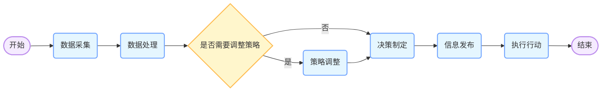

# AI Agent在智能城市交通规划中的角色

> 关键词：AI Agent、智能城市交通规划、交通流量预测、路径优化、多智能体系统

> 摘要：本文深入探讨了AI Agent在智能城市交通规划中的角色。首先介绍了研究的背景、目的、预期读者等信息，接着阐述了AI Agent和智能城市交通规划的核心概念及联系，详细讲解了相关核心算法原理与操作步骤，通过数学模型和公式进一步分析。结合实际项目，给出代码案例并进行解读。同时探讨了AI Agent在智能城市交通规划中的实际应用场景，推荐了相关的学习资源、开发工具和论文著作。最后总结了未来发展趋势与挑战，解答了常见问题，并提供了扩展阅读和参考资料。旨在全面揭示AI Agent在智能城市交通规划中的重要作用和应用价值。

## 1. 背景介绍 
### 1.1 目的和范围
随着城市化进程的加速，城市交通问题日益突出，如交通拥堵、交通事故频发、环境污染等。智能城市交通规划旨在通过先进的技术手段，优化城市交通系统的运行效率，提高交通安全水平，减少环境污染。AI Agent作为一种具有自主决策和学习能力的智能体，能够在复杂的交通环境中感知、推理和行动，为智能城市交通规划提供了新的解决方案。

本文的目的是深入研究AI Agent在智能城市交通规划中的角色和应用，探讨其在交通流量预测、路径优化、交通信号控制等方面的作用。研究范围涵盖了AI Agent的基本概念、核心算法、数学模型，以及在实际项目中的应用案例。

### 1.2 预期读者
本文的预期读者包括从事智能交通领域研究的科研人员、交通规划师、城市管理者，以及对人工智能和智能交通感兴趣的技术爱好者。通过阅读本文，读者可以了解AI Agent在智能城市交通规划中的最新研究成果和应用实践，为相关领域的研究和实践提供参考。

### 1.3 文档结构概述
本文共分为十个部分。第一部分为背景介绍，阐述了研究的目的、范围、预期读者和文档结构。第二部分介绍了AI Agent和智能城市交通规划的核心概念及联系，并给出了相应的文本示意图和Mermaid流程图。第三部分详细讲解了核心算法原理和具体操作步骤，通过Python源代码进行了说明。第四部分介绍了数学模型和公式，并进行了详细讲解和举例说明。第五部分通过实际项目案例，展示了代码的实现和解读。第六部分探讨了AI Agent在智能城市交通规划中的实际应用场景。第七部分推荐了相关的学习资源、开发工具和论文著作。第八部分总结了未来发展趋势与挑战。第九部分为附录，解答了常见问题。第十部分提供了扩展阅读和参考资料。

### 1.4 术语表
#### 1.4.1 核心术语定义
- **AI Agent（人工智能智能体）**：是一种能够感知环境、进行推理和决策，并采取行动以实现特定目标的软件实体。
- **智能城市交通规划**：利用先进的信息技术、通信技术和人工智能技术，对城市交通系统进行全面规划、设计、管理和优化的过程。
- **交通流量预测**：根据历史交通数据和实时交通信息，预测未来一段时间内的交通流量变化情况。
- **路径优化**：在给定起点和终点的情况下，寻找最优的行驶路径，以减少行驶时间、距离或成本。
- **交通信号控制**：通过对交通信号灯的控制，优化交通流量，减少交通拥堵。

#### 1.4.2 相关概念解释
- **多智能体系统（MAS）**：由多个AI Agent组成的系统，这些智能体之间可以进行通信、协作和竞争，以实现共同的目标。
- **强化学习**：一种机器学习方法，智能体通过与环境进行交互，根据环境反馈的奖励信号来学习最优的行为策略。
- **深度学习**：一种基于神经网络的机器学习方法，能够自动从大量数据中学习特征和模式。

#### 1.4.3 缩略词列表
- **AI**：Artificial Intelligence（人工智能）
- **MAS**：Multi-Agent System（多智能体系统）
- **RL**：Reinforcement Learning（强化学习）
- **DL**：Deep Learning（深度学习）

## 2. 核心概念与联系 
### 核心概念原理
#### AI Agent
AI Agent是人工智能领域中的一个重要概念，它可以看作是一个具有自主性、反应性、社会性和主动性的实体。自主性意味着AI Agent能够独立地感知环境、进行决策和行动；反应性表示AI Agent能够对环境的变化做出及时的响应；社会性指AI Agent可以与其他智能体进行交互和协作；主动性则表明AI Agent能够主动地追求自己的目标。

AI Agent通常由感知模块、决策模块和行动模块组成。感知模块负责收集环境信息，决策模块根据感知到的信息进行推理和决策，行动模块则根据决策结果采取相应的行动。

#### 智能城市交通规划
智能城市交通规划是一个复杂的系统工程，它涉及到城市交通的各个方面，如道路网络、交通流量、交通工具、交通管理等。其目标是通过优化交通资源的配置，提高交通系统的运行效率，减少交通拥堵和环境污染，提高交通安全水平。

智能城市交通规划需要综合考虑多种因素，如人口分布、土地利用、经济发展等。同时，还需要利用先进的技术手段，如传感器技术、通信技术、人工智能技术等，来实现交通信息的实时采集、处理和分析。

### 架构的文本示意图
```plaintext
智能城市交通系统
|-- 交通基础设施（道路、桥梁等）
|-- 交通工具（汽车、公交车等）
|-- 交通管理中心
|   |-- 数据采集模块（传感器、摄像头等）
|   |-- 数据处理模块（AI Agent）
|   |   |-- 交通流量预测Agent
|   |   |-- 路径优化Agent
|   |   |-- 交通信号控制Agent
|   |-- 决策制定模块
|   |-- 信息发布模块
|-- 出行者
```

### Mermaid流程图


## 3. 核心算法原理 & 具体操作步骤 
### 交通流量预测算法：ARIMA模型
ARIMA（Autoregressive Integrated Moving Average）模型是一种常用的时间序列预测模型，它结合了自回归（AR）、差分（I）和移动平均（MA）的思想。

#### 算法原理
ARIMA模型的一般形式为 $ARIMA(p, d, q)$，其中 $p$ 是自回归阶数，$d$ 是差分阶数，$q$ 是移动平均阶数。其数学表达式为：

$$
\phi(B)(1 - B)^dY_t = \theta(B)\epsilon_t
$$

其中，$\phi(B)$ 是自回归多项式，$\theta(B)$ 是移动平均多项式，$B$ 是滞后算子，$Y_t$ 是时间序列，$\epsilon_t$ 是白噪声序列。

#### 具体操作步骤
1. **数据预处理**：对交通流量数据进行清洗、平滑处理，去除异常值和噪声。
2. **确定差分阶数 $d$**：通过观察时间序列的平稳性，使用ADF（Augmented Dickey-Fuller）检验来确定差分阶数。
3. **确定自回归阶数 $p$ 和移动平均阶数 $q$**：可以使用信息准则（如AIC、BIC）来选择最优的 $p$ 和 $q$ 值。
4. **模型训练**：使用确定好的 $p$、$d$、$q$ 值，对ARIMA模型进行训练。
5. **模型预测**：使用训练好的模型对未来的交通流量进行预测。

#### Python源代码实现
```python
import pandas as pd
from statsmodels.tsa.arima.model import ARIMA
import matplotlib.pyplot as plt

# 读取交通流量数据
data = pd.read_csv('traffic_flow.csv', index_col='date', parse_dates=True)

# 数据预处理
data = data.dropna()

# 确定差分阶数
from statsmodels.tsa.stattools import adfuller

def adf_test(series):
    result = adfuller(series)
    print('ADF Statistic: {}'.format(result[0]))
    print('p-value: {}'.format(result[1]))
    print('Critical Values:')
    for key, value in result[4].items():
        print('\t{}: {}'.format(key, value))
    if result[1] <= 0.05:
        print("The series is stationary.")
    else:
        print("The series is non-stationary.")

adf_test(data['traffic_flow'])

# 差分处理
differenced_data = data['traffic_flow'].diff().dropna()
adf_test(differenced_data)

# 确定p和q值
import itertools
import numpy as np

p = d = q = range(0, 3)
pdq = list(itertools.product(p, d, q))

best_aic = np.inf
best_pdq = None

for param in pdq:
    try:
        model = ARIMA(data['traffic_flow'], order=param)
        results = model.fit()
        if results.aic < best_aic:
            best_aic = results.aic
            best_pdq = param
    except:
        continue

print('Best ARIMA(p,d,q) = {}'.format(best_pdq))

# 模型训练
model = ARIMA(data['traffic_flow'], order=best_pdq)
results = model.fit()

# 模型预测
forecast = results.get_forecast(steps=10)
forecast_mean = forecast.predicted_mean

# 可视化结果
plt.plot(data['traffic_flow'], label='Historical Data')
plt.plot(forecast_mean, label='Forecast')
plt.title('Traffic Flow Forecast')
plt.xlabel('Date')
plt.ylabel('Traffic Flow')
plt.legend()
plt.show()
```

### 路径优化算法：Dijkstra算法
#### 算法原理
Dijkstra算法是一种用于求解单源最短路径问题的贪心算法。它的基本思想是从起点开始，逐步扩展到距离起点最近的节点，直到到达终点。在扩展过程中，维护一个距离数组，记录每个节点到起点的最短距离。

#### 具体操作步骤
1. **初始化**：将起点的距离设为0，其他节点的距离设为无穷大。将所有节点标记为未访问。
2. **选择当前距离起点最近的未访问节点**：从距离数组中选择距离最小的未访问节点。
3. **更新相邻节点的距离**：对于当前节点的所有相邻节点，如果通过当前节点到达相邻节点的距离比之前记录的距离小，则更新相邻节点的距离。
4. **标记当前节点为已访问**：将当前节点标记为已访问。
5. **重复步骤2-4**：直到所有节点都被访问或到达终点。

#### Python源代码实现
```python
import heapq

def dijkstra(graph, start):
    distances = {node: float('inf') for node in graph}
    distances[start] = 0
    priority_queue = [(0, start)]

    while priority_queue:
        current_distance, current_node = heapq.heappop(priority_queue)

        if current_distance > distances[current_node]:
            continue

        for neighbor, weight in graph[current_node].items():
            distance = current_distance + weight

            if distance < distances[neighbor]:
                distances[neighbor] = distance
                heapq.heappush(priority_queue, (distance, neighbor))

    return distances

# 示例图
graph = {
    'A': {'B': 1, 'C': 4},
    'B': {'A': 1, 'C': 2, 'D': 5},
    'C': {'A': 4, 'B': 2, 'D': 1},
    'D': {'B': 5, 'C': 1}
}

start_node = 'A'
distances = dijkstra(graph, start_node)
print(distances)
```

## 4. 数学模型和公式 & 详细讲解 & 举例说明 
### 交通流量预测的ARIMA模型公式详解
如前文所述，ARIMA模型的一般形式为 $ARIMA(p, d, q)$，其数学表达式为：

$$
\phi(B)(1 - B)^dY_t = \theta(B)\epsilon_t
$$

- **自回归部分（AR）**：$\phi(B) = 1 - \phi_1B - \phi_2B^2 - \cdots - \phi_pB^p$，其中 $\phi_i$ 是自回归系数，$B$ 是滞后算子，$B^kY_t = Y_{t - k}$。自回归部分表示当前时刻的交通流量与过去 $p$ 个时刻的交通流量有关。

- **差分部分（I）**：$(1 - B)^d$ 表示对时间序列进行 $d$ 阶差分。差分的目的是使时间序列变得平稳，便于进行建模和预测。例如，一阶差分 $(1 - B)Y_t = Y_t - Y_{t - 1}$。

- **移动平均部分（MA）**：$\theta(B) = 1 + \theta_1B + \theta_2B^2 + \cdots + \theta_qB^q$，其中 $\theta_i$ 是移动平均系数。移动平均部分表示当前时刻的交通流量与过去 $q$ 个时刻的白噪声有关。

#### 举例说明
假设我们有一个交通流量时间序列 $Y_t$，经过分析确定 $p = 1$，$d = 1$，$q = 1$，则ARIMA(1, 1, 1)模型的表达式为：

$$
(1 - \phi_1B)(1 - B)Y_t = (1 + \theta_1B)\epsilon_t
$$

展开可得：

$$
(1 - B - \phi_1B + \phi_1B^2)Y_t = (1 + \theta_1B)\epsilon_t
$$

$$
Y_t - Y_{t - 1} - \phi_1Y_{t - 1} + \phi_1Y_{t - 2} = \epsilon_t + \theta_1\epsilon_{t - 1}
$$

### 路径优化的Dijkstra算法数学原理
Dijkstra算法的核心思想是基于贪心策略，每次选择距离起点最近的节点进行扩展。设 $V$ 是图中所有节点的集合，$S$ 是已经确定最短路径的节点集合，$d(u)$ 表示节点 $u$ 到起点的最短距离。

在算法的每一步，选择一个节点 $v \in V - S$，使得 $d(v)$ 最小，并将 $v$ 加入到 $S$ 中。然后，对于 $v$ 的所有相邻节点 $w$，更新 $d(w)$ 的值：

$$
d(w) = \min(d(w), d(v) + c(v, w))
$$

其中，$c(v, w)$ 表示从节点 $v$ 到节点 $w$ 的边的权重。

#### 举例说明
考虑前文示例图，起点为 $A$。初始时，$d(A) = 0$，$d(B) = d(C) = d(D) = \infty$。

- 第一步：选择 $A$ 节点，更新其相邻节点 $B$ 和 $C$ 的距离：$d(B) = \min(\infty, 0 + 1) = 1$，$d(C) = \min(\infty, 0 + 4) = 4$。
- 第二步：选择 $B$ 节点，更新其相邻节点 $C$ 和 $D$ 的距离：$d(C) = \min(4, 1 + 2) = 3$，$d(D) = \min(\infty, 1 + 5) = 6$。
- 第三步：选择 $C$ 节点，更新其相邻节点 $D$ 的距离：$d(D) = \min(6, 3 + 1) = 4$。
- 第四步：选择 $D$ 节点，此时所有节点都已访问，算法结束。

最终得到的最短距离为 $d(A) = 0$，$d(B) = 1$，$d(C) = 3$，$d(D) = 4$。

## 5. 项目实战：代码实际案例和详细解释说明 
### 5.1  开发环境搭建
#### 操作系统
本项目可以在Windows、Linux或macOS操作系统上进行开发。建议使用Linux系统，如Ubuntu 18.04及以上版本。

#### 编程语言和环境
- **Python**：建议使用Python 3.7及以上版本。可以从Python官方网站（https://www.python.org/downloads/）下载并安装。
- **Anaconda**：Anaconda是一个用于科学计算的Python发行版，它包含了许多常用的科学计算库和工具。可以从Anaconda官方网站（https://www.anaconda.com/products/individual）下载并安装。

#### 安装必要的库
在安装好Anaconda后，打开终端或命令提示符，创建一个新的虚拟环境并激活：

```bash
conda create -n traffic_project python=3.8
conda activate traffic_project
```

然后安装必要的库：

```bash
pip install pandas numpy statsmodels matplotlib
```

### 5.2  源代码详细实现和代码解读
#### 交通流量预测模块
```python
import pandas as pd
from statsmodels.tsa.arima.model import ARIMA
import matplotlib.pyplot as plt

# 读取交通流量数据
data = pd.read_csv('traffic_flow.csv', index_col='date', parse_dates=True)

# 数据预处理
data = data.dropna()

# 确定差分阶数
from statsmodels.tsa.stattools import adfuller

def adf_test(series):
    result = adfuller(series)
    print('ADF Statistic: {}'.format(result[0]))
    print('p-value: {}'.format(result[1]))
    print('Critical Values:')
    for key, value in result[4].items():
        print('\t{}: {}'.format(key, value))
    if result[1] <= 0.05:
        print("The series is stationary.")
    else:
        print("The series is non-stationary.")

adf_test(data['traffic_flow'])

# 差分处理
differenced_data = data['traffic_flow'].diff().dropna()
adf_test(differenced_data)

# 确定p和q值
import itertools
import numpy as np

p = d = q = range(0, 3)
pdq = list(itertools.product(p, d, q))

best_aic = np.inf
best_pdq = None

for param in pdq:
    try:
        model = ARIMA(data['traffic_flow'], order=param)
        results = model.fit()
        if results.aic < best_aic:
            best_aic = results.aic
            best_pdq = param
    except:
        continue

print('Best ARIMA(p,d,q) = {}'.format(best_pdq))

# 模型训练
model = ARIMA(data['traffic_flow'], order=best_pdq)
results = model.fit()

# 模型预测
forecast = results.get_forecast(steps=10)
forecast_mean = forecast.predicted_mean

# 可视化结果
plt.plot(data['traffic_flow'], label='Historical Data')
plt.plot(forecast_mean, label='Forecast')
plt.title('Traffic Flow Forecast')
plt.xlabel('Date')
plt.ylabel('Traffic Flow')
plt.legend()
plt.show()
```

#### 代码解读
1. **数据读取和预处理**：使用 `pandas` 库读取交通流量数据，并进行缺失值处理。
2. **差分阶数确定**：使用 `adfuller` 函数进行ADF检验，判断时间序列的平稳性。如果不平稳，则进行差分处理。
3. **$p$ 和 $q$ 值确定**：使用穷举法遍历所有可能的 $p$、$d$、$q$ 组合，选择AIC值最小的组合作为最优参数。
4. **模型训练和预测**：使用最优参数训练ARIMA模型，并对未来10个时间步的交通流量进行预测。
5. **可视化结果**：使用 `matplotlib` 库将历史数据和预测结果可视化。

#### 路径优化模块
```python
import heapq

def dijkstra(graph, start):
    distances = {node: float('inf') for node in graph}
    distances[start] = 0
    priority_queue = [(0, start)]

    while priority_queue:
        current_distance, current_node = heapq.heappop(priority_queue)

        if current_distance > distances[current_node]:
            continue

        for neighbor, weight in graph[current_node].items():
            distance = current_distance + weight

            if distance < distances[neighbor]:
                distances[neighbor] = distance
                heapq.heappush(priority_queue, (distance, neighbor))

    return distances

# 示例图
graph = {
    'A': {'B': 1, 'C': 4},
    'B': {'A': 1, 'C': 2, 'D': 5},
    'C': {'A': 4, 'B': 2, 'D': 1},
    'D': {'B': 5, 'C': 1}
}

start_node = 'A'
distances = dijkstra(graph, start_node)
print(distances)
```

#### 代码解读
1. **初始化**：将起点的距离设为0，其他节点的距离设为无穷大。使用优先队列（最小堆）来存储待处理的节点。
2. **循环处理**：从优先队列中取出距离最小的节点，更新其相邻节点的距离。如果更新后的距离更小，则将相邻节点加入优先队列。
3. **返回结果**：返回所有节点到起点的最短距离。

### 5.3  代码解读与分析
#### 交通流量预测模块
- **优点**：ARIMA模型是一种经典的时间序列预测模型，具有较好的预测效果。通过差分处理可以使时间序列变得平稳，提高模型的稳定性。使用AIC准则选择最优参数可以避免过拟合。
- **缺点**：ARIMA模型假设时间序列具有线性特征，对于非线性时间序列的预测效果可能不佳。此外，模型的参数确定需要进行大量的计算，计算效率较低。

#### 路径优化模块
- **优点**：Dijkstra算法是一种经典的最短路径算法，具有较高的准确性和可靠性。使用优先队列可以提高算法的效率，时间复杂度为 $O((V + E)\log V)$，其中 $V$ 是节点数，$E$ 是边数。
- **缺点**：Dijkstra算法需要遍历所有节点，对于大规模图的计算效率较低。此外，该算法假设边的权重为非负，对于存在负权重边的图不适用。

## 6. 实际应用场景 
### 交通流量预测在智能交通系统中的应用
- **交通拥堵预警**：通过对未来交通流量的预测，提前发现可能出现的交通拥堵路段，并及时发布预警信息，引导出行者选择合适的出行路线，缓解交通拥堵。
- **交通资源分配**：根据交通流量预测结果，合理分配交通资源，如调整公交线路、增加或减少道路车道等，提高交通资源的利用效率。
- **交通信号控制**：结合交通流量预测和实时交通信息，动态调整交通信号灯的配时方案，优化交通流量，减少车辆等待时间。

### 路径优化在智能交通系统中的应用
- **导航系统**：为出行者提供最优的行驶路径，考虑交通拥堵、道路限速等因素，减少行驶时间和距离。
- **物流配送**：为物流车辆规划最优的配送路线，提高配送效率，降低物流成本。
- **公共交通调度**：优化公交线路和车辆调度，提高公共交通的服务质量和运营效率。

### 多智能体系统在智能交通系统中的应用
- **交通协同控制**：多个AI Agent可以协同工作，实现对交通系统的全局优化控制。例如，交通信号控制Agent可以与路径优化Agent进行协作，共同优化交通流量。
- **交通事件处理**：当发生交通事故、道路施工等交通事件时，多个AI Agent可以实时感知事件信息，并协同制定应对策略，减少事件对交通的影响。
- **智能出行服务**：多个AI Agent可以为出行者提供个性化的出行服务，如根据出行者的偏好和实时交通信息，推荐最优的出行方式和路线。

## 7. 工具和资源推荐
### 7.1 学习资源推荐
#### 7.1.1 书籍推荐
- 《人工智能：一种现代的方法》（Artificial Intelligence: A Modern Approach）：这是一本经典的人工智能教材，涵盖了AI Agent、机器学习、自然语言处理等多个领域的知识。
- 《Python数据分析实战》（Python Data Science Handbook）：介绍了使用Python进行数据分析的方法和技巧，包括数据处理、可视化、机器学习等方面的内容。
- 《智能交通系统原理与应用》：系统介绍了智能交通系统的基本原理、关键技术和应用案例，对于理解智能城市交通规划有很大帮助。

#### 7.1.2 在线课程
- Coursera上的“人工智能基础”（Fundamentals of Artificial Intelligence）课程：由知名高校的教授授课，讲解人工智能的基本概念、算法和应用。
- edX上的“Python for Data Science”课程：学习使用Python进行数据分析和机器学习的基础知识和技能。
- 中国大学MOOC上的“智能交通系统”课程：介绍智能交通系统的发展现状、关键技术和应用实践。

#### 7.1.3 技术博客和网站
- Towards Data Science：一个专注于数据科学和人工智能的技术博客，提供了大量的技术文章和案例分析。
- Medium上的AI板块：有许多人工智能领域的专家和爱好者分享的文章，涵盖了最新的研究成果和应用实践。
- 智能交通网（https://www.its114.com/）：提供智能交通领域的最新资讯、技术动态和行业报告。

### 7.2 开发工具框架推荐
#### 7.2.1 IDE和编辑器
- PyCharm：一款功能强大的Python集成开发环境，提供了代码编辑、调试、版本控制等功能。
- Jupyter Notebook：一种交互式的编程环境，适合进行数据分析和机器学习实验。
- Visual Studio Code：一款轻量级的代码编辑器，支持多种编程语言和插件扩展。

#### 7.2.2 调试和性能分析工具
- pdb：Python自带的调试工具，可以帮助开发者定位代码中的问题。
- cProfile：Python的性能分析工具，可以分析代码的运行时间和函数调用次数。
- TensorBoard：一个用于可视化深度学习模型训练过程和结果的工具。

#### 7.2.3 相关框架和库
- NumPy：一个用于科学计算的Python库，提供了高效的数组操作和数学函数。
- Pandas：一个用于数据处理和分析的Python库，提供了数据结构和数据操作方法。
- Scikit-learn：一个用于机器学习的Python库，提供了各种机器学习算法和工具。
- TensorFlow：一个开源的深度学习框架，广泛应用于图像识别、自然语言处理等领域。

### 7.3 相关论文著作推荐
#### 7.3.1 经典论文
- “Artificial Intelligence: A New Synthesis” by Nils J. Nilsson：介绍了人工智能的基本概念和方法，是人工智能领域的经典著作之一。
- “Reinforcement Learning: An Introduction” by Richard S. Sutton and Andrew G. Barto：系统介绍了强化学习的基本理论和算法，是强化学习领域的权威教材。
- “A Formal Basis for the Heuristic Determination of Minimum Cost Paths” by Edsger W. Dijkstra：提出了Dijkstra算法，是图论和路径优化领域的经典论文。

#### 7.3.2 最新研究成果
- 在IEEE Transactions on Intelligent Transportation Systems、ACM Transactions on Intelligent Systems and Technology等期刊上发表的关于智能交通系统和AI Agent应用的最新研究论文。
- 在NeurIPS、ICML、AAAI等顶级人工智能会议上发表的关于强化学习、深度学习在交通领域应用的研究成果。

#### 7.3.3 应用案例分析
- 国内外智能城市交通规划的实际应用案例，如新加坡的智能交通系统、中国的智慧交通示范城市建设等。这些案例可以帮助读者了解AI Agent在实际项目中的应用效果和经验教训。

## 8. 总结：未来发展趋势与挑战
### 未来发展趋势
- **多模态数据融合**：未来的智能城市交通规划将融合更多的数据源，如视频监控数据、传感器数据、社交媒体数据等，以获取更全面、准确的交通信息。AI Agent需要具备处理多模态数据的能力，以提高交通预测和决策的准确性。
- **深度学习与强化学习的融合**：深度学习可以自动从大量数据中学习特征和模式，强化学习可以通过与环境的交互学习最优的行为策略。将两者融合可以提高AI Agent在复杂交通环境中的决策能力和适应性。
- **车路协同与自动驾驶**：随着自动驾驶技术的发展，车路协同将成为智能城市交通规划的重要发展方向。AI Agent可以在车与车、车与路之间进行信息交互和协同决策，提高交通安全和效率。
- **绿色交通与可持续发展**：未来的智能城市交通规划将更加注重绿色交通和可持续发展。AI Agent可以通过优化交通流量、鼓励公共交通出行等方式，减少交通对环境的影响。

### 挑战
- **数据隐私和安全**：智能城市交通规划涉及大量的个人和敏感数据，如出行轨迹、车辆信息等。如何保护数据的隐私和安全是一个重要的挑战。
- **算法可解释性**：深度学习和强化学习等算法通常是黑盒模型，难以解释其决策过程和结果。在智能城市交通规划中，需要确保算法的可解释性，以便决策者和公众理解和信任。
- **系统复杂性和可扩展性**：智能城市交通系统是一个复杂的大系统，包含大量的智能体和设备。如何管理系统的复杂性和实现系统的可扩展性是一个挑战。
- **社会接受度**：智能城市交通规划的实施需要得到社会的广泛接受和支持。如何解决公众对新技术的担忧和抵触情绪，是推广智能交通系统的关键。

## 9. 附录：常见问题与解答
### 问题1：AI Agent在智能城市交通规划中的应用有哪些局限性？
AI Agent在智能城市交通规划中的应用存在一些局限性。例如，AI Agent的决策能力受到其训练数据和算法的限制，对于一些复杂的交通场景和突发事件可能无法做出准确的决策。此外，AI Agent的应用需要大量的计算资源和数据支持，对于一些资源有限的地区可能难以实现。

### 问题2：如何评估AI Agent在智能城市交通规划中的性能？
可以从多个方面评估AI Agent在智能城市交通规划中的性能，如交通流量预测的准确性、路径优化的效果、交通信号控制的效率等。可以使用一些指标来进行评估，如均方误差（MSE）、平均绝对误差（MAE）、行程时间缩短率等。

### 问题3：AI Agent在智能城市交通规划中与传统交通规划方法相比有哪些优势？
与传统交通规划方法相比，AI Agent具有更强的适应性和智能性。AI Agent可以实时感知交通环境的变化，并根据变化调整决策，而传统交通规划方法通常是基于静态数据和经验进行规划。此外，AI Agent可以通过学习和优化不断提高性能，而传统交通规划方法的改进相对困难。

### 问题4：在智能城市交通规划中，如何确保AI Agent之间的协作和通信？
可以使用多智能体系统（MAS）的相关技术来确保AI Agent之间的协作和通信。例如，定义统一的通信协议和接口，使AI Agent能够相互交换信息和协调行动。此外，可以使用分布式计算和云计算技术来实现AI Agent之间的高效通信和协作。

## 10. 扩展阅读 & 参考资料
### 扩展阅读
- 《人工智能简史》：了解人工智能的发展历程和重要里程碑。
- 《未来交通：智能交通系统的发展与应用》：深入探讨智能交通系统的未来发展趋势和应用前景。
- 《数据驱动的智能交通系统》：介绍如何利用大数据和人工智能技术来优化智能交通系统。

### 参考资料
- 相关的学术论文和研究报告，如IEEE、ACM等学术组织发表的关于智能交通系统和AI Agent的研究成果。
- 政府部门和行业协会发布的智能城市交通规划相关政策和标准。
- 开源代码库和数据集，如GitHub上的智能交通相关项目和Kaggle上的交通流量数据集。

作者：AI天才研究院/AI Genius Institute & 禅与计算机程序设计艺术 /Zen And The Art of Computer Programming