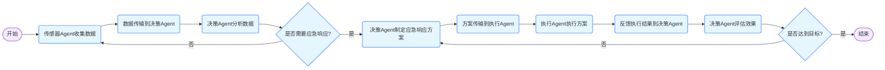

# AI Agent在智能城市应急响应中的角色

> 关键词：AI Agent、智能城市、应急响应、多智能体系统、机器学习

> 摘要：本文深入探讨了AI Agent在智能城市应急响应中的角色。首先介绍了研究的背景、目的、预期读者和文档结构，对相关术语进行了清晰定义。接着阐述了AI Agent的核心概念及其与智能城市应急响应系统的联系，给出了原理和架构的文本示意图及Mermaid流程图。详细讲解了核心算法原理，并使用Python代码进行具体说明，同时给出了相关的数学模型和公式。通过项目实战，展示了代码的实际案例并进行详细解读。分析了AI Agent在智能城市应急响应中的实际应用场景，推荐了学习资源、开发工具框架和相关论文著作。最后总结了未来发展趋势与挑战，提供了常见问题解答和扩展阅读参考资料，旨在为相关领域的研究和实践提供全面且深入的指导。

## 1. 背景介绍 
### 1.1 目的和范围
随着城市化进程的加速，城市面临的各种突发事件如自然灾害、公共卫生事件、安全事故等日益增多，智能城市应急响应系统的建设变得尤为重要。本研究的目的是深入探讨AI Agent在智能城市应急响应中的角色和作用，分析其如何提高应急响应的效率和准确性。研究范围涵盖了AI Agent的基本概念、相关算法原理、在不同应急场景中的应用以及未来发展趋势等方面。

### 1.2 预期读者
本文预期读者包括计算机科学、人工智能、城市规划、应急管理等领域的研究人员、工程师和学生，以及对智能城市应急响应系统感兴趣的相关从业人员。

### 1.3 文档结构概述
本文将按照以下结构进行组织：首先介绍核心概念与联系，包括AI Agent的定义、分类和在应急响应系统中的架构；接着阐述核心算法原理和具体操作步骤，并使用Python代码进行详细说明；然后给出相关的数学模型和公式，并举例说明；通过项目实战展示代码的实际应用；分析AI Agent在智能城市应急响应中的实际应用场景；推荐学习资源、开发工具框架和相关论文著作；最后总结未来发展趋势与挑战，提供常见问题解答和扩展阅读参考资料。

### 1.4 术语表
#### 1.4.1 核心术语定义
- **AI Agent**：人工智能代理，是一种能够感知环境、做出决策并执行行动的智能实体。它可以根据预设的规则或通过学习来完成特定的任务。
- **智能城市**：利用信息技术和通信技术手段感测、分析、整合城市运行核心系统的各项关键信息，从而对包括民生、环保、公共安全、城市服务、工商业活动在内的各种需求做出智能响应的城市形态。
- **应急响应**：针对突发、具有破坏力的紧急事件采取预防、预备、响应和恢复的活动与计划。
- **多智能体系统（Multi - Agent System，MAS）**：由多个AI Agent组成的系统，这些Agent之间可以相互协作、通信和竞争，以完成复杂的任务。

#### 1.4.2 相关概念解释
- **环境感知**：AI Agent通过各种传感器收集环境信息的过程，例如温度、湿度、空气质量、交通流量等。
- **决策制定**：AI Agent根据感知到的环境信息和预设的目标，选择合适的行动方案的过程。
- **行动执行**：AI Agent将决策制定阶段确定的行动方案付诸实践的过程，例如发送警报、调度资源等。

#### 1.4.3 缩略词列表
- **MAS**：Multi - Agent System（多智能体系统）
- **ML**：Machine Learning（机器学习）
- **RL**：Reinforcement Learning（强化学习）

## 2. 核心概念与联系 

### 2.1 AI Agent的基本概念
AI Agent是一种具有自主性、反应性、社会性和主动性的智能实体。自主性意味着它可以在没有人类干预的情况下独立完成任务；反应性表示它能够感知环境的变化并及时做出响应；社会性指的是它可以与其他Agent进行交互和协作；主动性则体现为它能够主动发起行动以实现自身的目标。

### 2.2 AI Agent在智能城市应急响应系统中的架构
在智能城市应急响应系统中，AI Agent可以分为不同的类型，如传感器Agent、决策Agent、执行Agent等。传感器Agent负责收集城市环境的各种数据，如气象数据、交通数据、安全监控数据等；决策Agent根据传感器Agent收集到的数据进行分析和决策，制定应急响应方案；执行Agent则负责将决策Agent制定的方案付诸实践，如调度救援人员、物资等。

下面是AI Agent在智能城市应急响应系统中的架构的文本示意图：

```plaintext
智能城市应急响应系统
|
|-- 传感器Agent
|   |-- 气象传感器Agent
|   |-- 交通传感器Agent
|   |-- 安全监控传感器Agent
|   |--...
|
|-- 决策Agent
|   |-- 数据分析模块
|   |-- 决策制定模块
|
|-- 执行Agent
|   |-- 救援人员调度Agent
|   |-- 物资调配Agent
|   |--...
```

### 2.3 Mermaid流程图


## 3. 核心算法原理 & 具体操作步骤 

### 3.1 机器学习算法在AI Agent中的应用
在智能城市应急响应中，机器学习算法可以帮助AI Agent从大量的历史数据中学习模式和规律，从而提高决策的准确性。常见的机器学习算法包括决策树、支持向量机、神经网络等。

以下是一个使用Python实现的简单决策树算法示例，用于根据气象数据判断是否需要发布暴雨预警：

```python
import pandas as pd
from sklearn.tree import DecisionTreeClassifier
from sklearn.model_selection import train_test_split
from sklearn.metrics import accuracy_score

# 生成示例数据
data = {
    '降雨量': [10, 20, 30, 5, 15],
    '风速': [2, 3, 4, 1, 2],
    '是否预警': [0, 1, 1, 0, 0]
}
df = pd.DataFrame(data)

# 划分特征和标签
X = df[['降雨量', '风速']]
y = df['是否预警']

# 划分训练集和测试集
X_train, X_test, y_train, y_test = train_test_split(X, y, test_size=0.2, random_state=42)

# 创建决策树分类器
clf = DecisionTreeClassifier()

# 训练模型
clf.fit(X_train, y_train)

# 预测
y_pred = clf.predict(X_test)

# 评估模型
accuracy = accuracy_score(y_test, y_pred)
print(f"模型准确率: {accuracy}")
```

### 3.2 强化学习算法在AI Agent中的应用
强化学习算法可以让AI Agent在与环境的交互中不断学习，以最大化长期奖励。在智能城市应急响应中，强化学习可以用于优化资源调度和决策制定。

以下是一个使用Python和OpenAI Gym库实现的简单强化学习示例，用于模拟救援人员的调度：

```python
import gym
import numpy as np

# 创建环境
env = gym.make('CartPole-v1')

# 初始化Q表
action_space_size = env.action_space.n
state_space_size = env.observation_space.shape[0]
q_table = np.zeros((state_space_size, action_space_size))

# 定义超参数
num_episodes = 1000
max_steps_per_episode = 100
learning_rate = 0.1
discount_rate = 0.99

# 训练Q学习算法
for episode in range(num_episodes):
    state = env.reset()
    done = False
    for step in range(max_steps_per_episode):
        action = np.argmax(q_table[state, :])
        new_state, reward, done, info = env.step(action)
        q_table[state, action] = q_table[state, action] + learning_rate * (
                reward + discount_rate * np.max(q_table[new_state, :]) - q_table[state, action])
        state = new_state
        if done:
            break

# 测试训练好的模型
state = env.reset()
done = False
for step in range(max_steps_per_episode):
    action = np.argmax(q_table[state, :])
    new_state, reward, done, info = env.step(action)
    state = new_state
    if done:
        break

env.close()
```

### 3.3 具体操作步骤
1. **数据收集**：传感器Agent通过各种传感器收集城市环境的相关数据。
2. **数据预处理**：对收集到的数据进行清洗、归一化等预处理操作，以便后续的分析和学习。
3. **模型训练**：使用机器学习或强化学习算法对预处理后的数据进行训练，得到相应的模型。
4. **决策制定**：决策Agent根据训练好的模型和实时收集到的数据进行分析和决策，制定应急响应方案。
5. **行动执行**：执行Agent将决策Agent制定的方案付诸实践，并将执行结果反馈给决策Agent。
6. **模型评估和更新**：决策Agent根据执行结果评估模型的效果，并根据需要对模型进行更新和优化。

## 4. 数学模型和公式 & 详细讲解 & 举例说明 

### 4.1 机器学习中的损失函数
在机器学习中，损失函数用于衡量模型预测结果与真实标签之间的差异。常见的损失函数包括均方误差（MSE）、交叉熵损失等。

#### 4.1.1 均方误差（MSE）
均方误差是回归问题中常用的损失函数，其数学公式为：

$$MSE = \frac{1}{n} \sum_{i=1}^{n} (y_i - \hat{y}_i)^2$$

其中，$n$ 是样本数量，$y_i$ 是第 $i$ 个样本的真实标签，$\hat{y}_i$ 是第 $i$ 个样本的预测标签。

以下是一个使用Python计算均方误差的示例：

```python
import numpy as np

y_true = np.array([1, 2, 3, 4, 5])
y_pred = np.array([1.2, 2.1, 2.9, 4.2, 5.1])

mse = np.mean((y_true - y_pred) ** 2)
print(f"均方误差: {mse}")
```

#### 4.1.2 交叉熵损失
交叉熵损失是分类问题中常用的损失函数，对于二分类问题，其数学公式为：

$$CE = - \frac{1}{n} \sum_{i=1}^{n} [y_i \log(\hat{y}_i) + (1 - y_i) \log(1 - \hat{y}_i)]$$

其中，$n$ 是样本数量，$y_i$ 是第 $i$ 个样本的真实标签（取值为 0 或 1），$\hat{y}_i$ 是第 $i$ 个样本的预测概率。

以下是一个使用Python计算交叉熵损失的示例：

```python
import numpy as np
from sklearn.metrics import log_loss

y_true = np.array([0, 1, 1, 0])
y_pred = np.array([0.1, 0.9, 0.8, 0.2])

ce = log_loss(y_true, y_pred)
print(f"交叉熵损失: {ce}")
```

### 4.2 强化学习中的Q学习算法
Q学习算法是一种基于值函数的强化学习算法，其核心是更新Q表。Q表记录了在每个状态下采取每个行动的预期奖励。

Q学习算法的更新公式为：

$$Q(s_t, a_t) = Q(s_t, a_t) + \alpha [r_{t+1} + \gamma \max_{a} Q(s_{t+1}, a) - Q(s_t, a_t)]$$

其中，$s_t$ 是当前状态，$a_t$ 是当前行动，$r_{t+1}$ 是执行行动 $a_t$ 后获得的奖励，$s_{t+1}$ 是下一个状态，$\alpha$ 是学习率，$\gamma$ 是折扣率。

以下是一个使用Python实现的Q学习算法示例：

```python
import numpy as np

# 初始化Q表
q_table = np.zeros((4, 2))

# 定义超参数
alpha = 0.1
gamma = 0.9
state = 0
action = 0
reward = 1
next_state = 1

# 更新Q表
q_table[state, action] = q_table[state, action] + alpha * (
        reward + gamma * np.max(q_table[next_state, :]) - q_table[state, action])

print(f"更新后的Q表: {q_table}")
```

## 5. 项目实战：代码实际案例和详细解释说明 

### 5.1  开发环境搭建
在进行智能城市应急响应项目实战之前，需要搭建相应的开发环境。以下是具体的步骤：

#### 5.1.1 安装Python
Python是一种广泛使用的编程语言，许多机器学习和人工智能库都支持Python。可以从Python官方网站（https://www.python.org/downloads/）下载并安装Python。

#### 5.1.2 安装必要的库
在项目中，需要使用一些常用的Python库，如NumPy、Pandas、Scikit - learn、OpenAI Gym等。可以使用以下命令进行安装：

```bash
pip install numpy pandas scikit-learn gym
```

### 5.2  源代码详细实现和代码解读
以下是一个完整的智能城市应急响应项目的源代码示例，用于根据气象数据预测是否需要发布暴雨预警：

```python
import pandas as pd
from sklearn.tree import DecisionTreeClassifier
from sklearn.model_selection import train_test_split
from sklearn.metrics import accuracy_score

# 加载数据
data = {
    '降雨量': [10, 20, 30, 5, 15, 25, 35, 8, 18, 28],
    '风速': [2, 3, 4, 1, 2, 3, 4, 1, 2, 3],
    '是否预警': [0, 1, 1, 0, 0, 1, 1, 0, 0, 1]
}
df = pd.DataFrame(data)

# 划分特征和标签
X = df[['降雨量', '风速']]
y = df['是否预警']

# 划分训练集和测试集
X_train, X_test, y_train, y_test = train_test_split(X, y, test_size=0.2, random_state=42)

# 创建决策树分类器
clf = DecisionTreeClassifier()

# 训练模型
clf.fit(X_train, y_train)

# 预测
y_pred = clf.predict(X_test)

# 评估模型
accuracy = accuracy_score(y_test, y_pred)
print(f"模型准确率: {accuracy}")

# 新数据预测
new_data = pd.DataFrame({
    '降雨量': [40],
    '风速': [5]
})
new_pred = clf.predict(new_data)
if new_pred[0] == 1:
    print("需要发布暴雨预警")
else:
    print("不需要发布暴雨预警")
```

### 5.3  代码解读与分析
1. **数据加载**：使用Pandas库创建一个包含降雨量、风速和是否预警信息的DataFrame。
2. **特征和标签划分**：将DataFrame中的降雨量和风速作为特征，是否预警作为标签。
3. **训练集和测试集划分**：使用Scikit - learn库的`train_test_split`函数将数据划分为训练集和测试集。
4. **模型创建和训练**：创建一个决策树分类器，并使用训练集对其进行训练。
5. **模型预测和评估**：使用测试集对训练好的模型进行预测，并使用`accuracy_score`函数计算模型的准确率。
6. **新数据预测**：创建一个包含新的降雨量和风速信息的DataFrame，并使用训练好的模型进行预测，根据预测结果判断是否需要发布暴雨预警。

## 6. 实际应用场景 
### 6.1 自然灾害应急响应
在自然灾害如地震、洪水、台风等发生时，AI Agent可以发挥重要作用。传感器Agent可以实时收集地震波、水位、风力等数据，决策Agent根据这些数据进行分析和判断，及时发布预警信息。执行Agent可以调度救援人员和物资，提高救援效率。

### 6.2 公共卫生事件应急响应
在公共卫生事件如疫情爆发时，AI Agent可以帮助进行疫情监测和防控。传感器Agent可以收集人员流动、体温、核酸检测结果等数据，决策Agent根据这些数据制定防控策略，如隔离措施、疫苗接种计划等。执行Agent可以协助社区进行人员管理和物资调配。

### 6.3 安全事故应急响应
在安全事故如火灾、交通事故等发生时，AI Agent可以快速响应。传感器Agent可以收集火灾烟雾、温度、交通流量等数据，决策Agent根据这些数据制定救援方案，如消防车调度、交通管制等。执行Agent可以执行救援任务，减少事故损失。

## 7. 工具和资源推荐
### 7.1 学习资源推荐
#### 7.1.1 书籍推荐
- 《人工智能：一种现代的方法》（Artificial Intelligence: A Modern Approach）：这本书是人工智能领域的经典教材，全面介绍了人工智能的基本概念、算法和应用。
- 《Python机器学习》（Python Machine Learning）：详细介绍了使用Python进行机器学习的方法和技术，包括各种机器学习算法的实现和应用。
- 《强化学习：原理与Python实现》：系统地介绍了强化学习的基本原理和算法，并使用Python进行了实现和案例分析。

#### 7.1.2 在线课程
- Coursera上的“机器学习”课程：由斯坦福大学的Andrew Ng教授讲授，是机器学习领域的经典课程。
- edX上的“人工智能基础”课程：介绍了人工智能的基本概念、算法和应用。
- Udemy上的“Python深度学习实战”课程：重点讲解了使用Python进行深度学习的方法和技术。

#### 7.1.3 技术博客和网站
- Medium：上面有许多人工智能和机器学习领域的优秀博客文章，涵盖了最新的研究成果和实践经验。
- Towards Data Science：专注于数据科学和机器学习领域的技术博客，提供了丰富的教程和案例。
- AI Open：提供了人工智能领域的最新资讯、研究报告和开源项目。

### 7.2 开发工具框架推荐
#### 7.2.1 IDE和编辑器
- PyCharm：是一款专门为Python开发设计的集成开发环境，提供了丰富的功能和插件，方便进行代码编写、调试和管理。
- Jupyter Notebook：是一个交互式的开发环境，适合进行数据探索、模型训练和可视化。
- Visual Studio Code：是一款轻量级的代码编辑器，支持多种编程语言，并且有丰富的扩展插件。

#### 7.2.2 调试和性能分析工具
- PySnooper：可以方便地进行代码调试，自动记录函数的调用过程和变量的值。
- cProfile：是Python标准库中的性能分析工具，可以分析代码的运行时间和函数调用次数。
- TensorBoard：是TensorFlow提供的可视化工具，可以用于可视化模型的训练过程和性能指标。

#### 7.2.3 相关框架和库
- Scikit - learn：是一个简单易用的机器学习库，提供了各种机器学习算法的实现和工具。
- TensorFlow：是一个广泛使用的深度学习框架，支持多种深度学习模型的构建和训练。
- PyTorch：是另一个流行的深度学习框架，具有动态图和易于使用的特点。

### 7.3 相关论文著作推荐
#### 7.3.1 经典论文
- “Playing Atari with Deep Reinforcement Learning”：介绍了使用深度强化学习算法在Atari游戏中取得优异成绩的方法。
- “ImageNet Classification with Deep Convolutional Neural Networks”：提出了AlexNet卷积神经网络，开启了深度学习在图像识别领域的革命。
- “Attention Is All You Need”：提出了Transformer模型，在自然语言处理领域取得了巨大成功。

#### 7.3.2 最新研究成果
- 关注顶级学术会议如NeurIPS、ICML、CVPR等的论文，了解人工智能领域的最新研究动态。
- 查阅知名学术期刊如Journal of Artificial Intelligence Research（JAIR）、Artificial Intelligence等的文章。

#### 7.3.3 应用案例分析
- 研究一些实际的智能城市项目案例，了解AI Agent在其中的具体应用和效果。
- 分析一些应急响应系统的设计和实现，学习其中的经验和教训。

## 8. 总结：未来发展趋势与挑战
### 8.1 未来发展趋势
- **多智能体协同**：未来的智能城市应急响应系统将更加注重多智能体之间的协同工作，不同类型的AI Agent将通过通信和协作，共同完成复杂的应急任务。
- **融合多种技术**：AI Agent将与物联网、大数据、区块链等技术深度融合，实现更高效的数据收集、分析和决策。
- **自适应学习**：AI Agent将具备更强的自适应学习能力，能够根据环境的变化实时调整自己的策略和行为。

### 8.2 挑战
- **数据隐私和安全**：在智能城市应急响应中，涉及大量的个人和城市数据，如何保障数据的隐私和安全是一个重要的挑战。
- **模型可解释性**：许多机器学习和深度学习模型是黑盒模型，难以解释其决策过程和结果，这在应急响应中可能会带来一定的风险。
- **系统可靠性**：智能城市应急响应系统的可靠性至关重要，任何系统故障都可能导致严重的后果，因此需要提高系统的可靠性和容错能力。

## 9. 附录：常见问题与解答
### 9.1 AI Agent在智能城市应急响应中的优势是什么？
AI Agent具有自主性、反应性、社会性和主动性等特点，能够快速感知环境变化、做出决策并执行行动。在智能城市应急响应中，AI Agent可以提高应急响应的效率和准确性，减少人为错误。

### 9.2 如何选择适合的机器学习算法？
选择适合的机器学习算法需要考虑多个因素，如数据类型、问题类型、数据规模等。对于分类问题，可以选择决策树、支持向量机、神经网络等算法；对于回归问题，可以选择线性回归、岭回归等算法；对于强化学习问题，可以选择Q学习、深度Q网络等算法。

### 9.3 如何提高AI Agent的性能？
可以通过以下方法提高AI Agent的性能：
- 收集更多的数据进行训练，提高模型的泛化能力。
- 选择合适的算法和模型结构，根据问题的特点进行调整。
- 进行模型优化，如调整超参数、使用正则化等方法。
- 采用多智能体协同的方式，提高系统的整体性能。

## 10. 扩展阅读 & 参考资料
### 10.1 扩展阅读
- 《智能城市：大数据、物联网与智慧城市的未来》：深入探讨了智能城市的发展趋势和技术应用。
- 《人工智能时代的应急管理》：分析了人工智能在应急管理领域的应用和挑战。

### 10.2 参考资料
- 相关学术论文和研究报告，如IEEE Transactions on Intelligent Transportation Systems、ACM Transactions on Intelligent Systems and Technology等期刊上的文章。
- 智能城市和应急管理领域的行业标准和规范。

作者：AI天才研究院/AI Genius Institute & 禅与计算机程序设计艺术 /Zen And The Art of Computer Programming