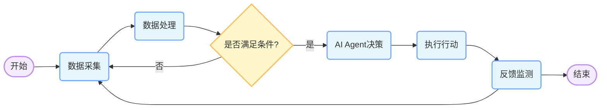

# AI Agent在智能城市能源管理中的实践

> 关键词：AI Agent、智能城市、能源管理、实践应用、算法原理

> 摘要：本文围绕AI Agent在智能城市能源管理中的实践展开。首先介绍了相关背景，包括目的范围、预期读者等。接着阐述了AI Agent和智能城市能源管理的核心概念及其联系，给出了原理和架构的文本示意图与Mermaid流程图。详细讲解了核心算法原理及具体操作步骤，并结合Python代码进行说明。探讨了相关数学模型和公式，通过举例加深理解。通过项目实战，展示了开发环境搭建、源代码实现与解读。分析了AI Agent在智能城市能源管理中的实际应用场景，推荐了学习资源、开发工具框架以及相关论文著作。最后总结了未来发展趋势与挑战，还设置了常见问题解答和扩展阅读参考资料，旨在为相关领域的研究者和实践者提供全面的技术指导。

## 1. 背景介绍 
### 1.1 目的和范围
随着城市化进程的加速，城市能源消耗日益增长，能源管理面临着巨大的挑战。智能城市的建设为解决能源管理问题提供了新的思路和方法。AI Agent作为一种具有自主决策和行动能力的智能体，能够在复杂的城市能源系统中发挥重要作用。本文的目的在于深入探讨AI Agent在智能城市能源管理中的应用实践，涵盖从核心概念、算法原理到实际项目案例的各个方面，为智能城市能源管理提供理论支持和实践指导。

### 1.2 预期读者
本文的预期读者包括计算机科学、能源工程、城市规划等领域的研究者和学生，以及从事智能城市建设、能源管理系统开发的工程师和技术人员。对于对AI技术在能源领域应用感兴趣的普通读者也具有一定的参考价值。

### 1.3 文档结构概述
本文将按照以下结构进行阐述：首先介绍核心概念与联系，明确AI Agent和智能城市能源管理的基本定义和相互关系；接着讲解核心算法原理和具体操作步骤，通过Python代码详细说明；然后介绍相关数学模型和公式，并举例说明其应用；通过项目实战展示AI Agent在智能城市能源管理中的具体实现；分析实际应用场景；推荐学习资源、开发工具框架和相关论文著作；最后总结未来发展趋势与挑战，并提供常见问题解答和扩展阅读参考资料。

### 1.4 术语表
#### 1.4.1 核心术语定义
- **AI Agent（人工智能智能体）**：是一种能够感知环境、自主决策并采取行动以实现特定目标的软件实体或系统。它可以根据环境的变化动态调整自己的行为，具有一定的自主性和智能性。
- **智能城市能源管理**：指利用先进的信息技术和智能控制手段，对城市能源的生产、传输、分配和消费进行全面、高效、可持续的管理，以实现能源的优化配置和节能减排的目标。

#### 1.4.2 相关概念解释
- **多智能体系统（Multi - Agent System，MAS）**：由多个AI Agent组成的系统，这些智能体之间可以相互通信、协作和竞争，共同完成复杂的任务。在智能城市能源管理中，多个AI Agent可以分别负责不同的能源管理任务，如电力调度、能源需求预测等，通过协作实现整个城市能源系统的优化。
- **能源物联网（Energy Internet of Things，EIoT）**：将物联网技术应用于能源领域，实现能源设备的互联互通和数据的实时采集与传输。AI Agent可以利用EIoT提供的数据进行能源管理决策。

#### 1.4.3 缩略词列表
- **AI**：Artificial Intelligence（人工智能）
- **MAS**：Multi - Agent System（多智能体系统）
- **EIoT**：Energy Internet of Things（能源物联网）

## 2. 核心概念与联系 
### 核心概念原理
#### AI Agent原理
AI Agent的基本原理是基于感知 - 决策 - 行动的循环。它通过传感器感知环境信息，将这些信息输入到决策模块中，决策模块根据预设的规则、算法或学习到的模型进行决策，最后通过执行器采取相应的行动。例如，在智能城市能源管理中，一个负责电力调度的AI Agent可以通过传感器感知电网的实时负荷、发电功率等信息，根据能源优化算法决定如何调整电力的分配。

#### 智能城市能源管理原理
智能城市能源管理的核心原理是通过对能源系统的实时监测、分析和控制，实现能源的供需平衡和优化配置。它需要综合考虑能源的生产、传输、分配和消费等多个环节，以及不同能源类型（如电力、天然气、热能等）之间的相互关系。例如，根据城市的能源需求预测，合理安排发电设备的运行，提高能源利用效率。

### 架构的文本示意图
```plaintext
智能城市能源管理系统
|-- 数据采集层
|   |-- 能源设备传感器（电表、气表、温度传感器等）
|   |-- 环境传感器（光照传感器、风速传感器等）
|   |-- 通信网络（有线、无线）
|-- 数据处理层
|   |-- 数据存储（数据库）
|   |-- 数据清洗与预处理
|   |-- 数据分析与挖掘
|-- AI Agent层
|   |-- 能源需求预测Agent
|   |-- 电力调度Agent
|   |-- 能源设备控制Agent
|   |-- 多智能体协作机制
|-- 执行层
|   |-- 能源设备控制器（发电机、变压器、空调等）
```

### Mermaid流程图


## 3. 核心算法原理 & 具体操作步骤 
### 核心算法原理
#### 能源需求预测算法 - 时间序列分析
时间序列分析是一种常用的能源需求预测方法，它基于历史能源需求数据来预测未来的能源需求。其中，ARIMA（Autoregressive Integrated Moving Average）模型是一种经典的时间序列模型。

ARIMA模型的基本形式为：

$ARIMA(p, d, q)$

其中，$p$ 是自回归阶数，$d$ 是差分阶数，$q$ 是移动平均阶数。

自回归部分表示当前值与过去 $p$ 个值的线性组合：

$y_t = c + \sum_{i = 1}^{p} \varphi_i y_{t - i}+\epsilon_t$

移动平均部分表示当前值与过去 $q$ 个误差项的线性组合：

$\epsilon_t = \theta_0+\sum_{j = 1}^{q} \theta_j \epsilon_{t - j}$

差分操作是为了使时间序列数据具有平稳性。

#### 电力调度算法 - 优化算法
电力调度的目标是在满足电力需求的前提下，最小化发电成本和环境污染。可以使用线性规划、整数规划等优化算法来解决电力调度问题。

以线性规划为例，假设发电成本函数为 $C(x)$，电力需求为 $D$，发电容量约束为 $x_{min}\leq x\leq x_{max}$，则电力调度问题可以表示为：

$\min C(x)=\sum_{i = 1}^{n} c_i x_i$

subject to:

$\sum_{i = 1}^{n} x_i = D$

$x_{min}\leq x\leq x_{max}$

其中，$x_i$ 是第 $i$ 个发电设备的发电功率，$c_i$ 是第 $i$ 个发电设备的发电成本。

### 具体操作步骤
#### 能源需求预测步骤
1. **数据收集**：收集历史能源需求数据，包括时间、能源类型、需求量等信息。
2. **数据预处理**：对收集到的数据进行清洗、平滑处理，去除异常值和噪声。
3. **模型选择**：根据数据的特点选择合适的时间序列模型，如ARIMA模型。
4. **模型训练**：使用历史数据对模型进行训练，确定模型的参数。
5. **预测**：使用训练好的模型对未来的能源需求进行预测。

#### 电力调度步骤
1. **确定目标函数和约束条件**：根据发电成本、电力需求和发电容量等因素，确定线性规划问题的目标函数和约束条件。
2. **建立模型**：将目标函数和约束条件转化为线性规划模型。
3. **求解模型**：使用线性规划求解器求解模型，得到最优的发电功率分配方案。
4. **执行调度**：根据求解得到的方案，控制发电设备的运行。

### Python源代码实现
#### 能源需求预测 - ARIMA模型
```python
import pandas as pd
from statsmodels.tsa.arima.model import ARIMA

# 读取历史能源需求数据
data = pd.read_csv('energy_demand.csv', index_col='date', parse_dates=True)

# 数据预处理
data = data.dropna()

# 选择合适的p, d, q值
p = 1
d = 1
q = 1

# 训练ARIMA模型
model = ARIMA(data, order=(p, d, q))
model_fit = model.fit()

# 预测未来n期的能源需求
n = 10
forecast = model_fit.get_forecast(steps=n)
forecast_mean = forecast.predicted_mean

print("未来10期的能源需求预测值：")
print(forecast_mean)
```

#### 电力调度 - 线性规划
```python
from scipy.optimize import linprog

# 发电成本系数
c = [2, 3, 4]

# 发电容量下限
x_min = [0, 0, 0]
# 发电容量上限
x_max = [100, 150, 200]

# 电力需求
D = 200

# 线性规划约束条件
A_eq = [[1, 1, 1]]
b_eq = [D]

# 求解线性规划问题
res = linprog(c, bounds=list(zip(x_min, x_max)), A_eq=A_eq, b_eq=b_eq)

print("最优发电功率分配方案：")
print(res.x)
```

## 4. 数学模型和公式 & 详细讲解 & 举例说明 
### 能源需求预测数学模型 - ARIMA模型
#### 详细讲解
ARIMA模型是一种综合考虑自回归、差分和移动平均的时间序列模型。自回归部分反映了当前值与过去值之间的线性关系，差分操作可以使非平稳的时间序列转化为平稳序列，移动平均部分则考虑了误差项的影响。

$ARIMA(p, d, q)$ 模型的具体形式为：

$\phi(B)(1 - B)^d y_t=\theta(B)\epsilon_t$

其中，$\phi(B)=1-\varphi_1 B-\varphi_2 B^2-\cdots-\varphi_p B^p$ 是自回归算子，$\theta(B)=1+\theta_1 B+\theta_2 B^2+\cdots+\theta_q B^q$ 是移动平均算子，$B$ 是滞后算子，$B^k y_t = y_{t - k}$，$\epsilon_t$ 是白噪声序列。

#### 举例说明
假设我们有一组电力需求的时间序列数据 $y_1, y_2, \cdots, y_n$，经过分析发现该序列是非平稳的，需要进行一阶差分（$d = 1$）使其平稳。然后通过自相关函数（ACF）和偏自相关函数（PACF）分析确定 $p = 1$，$q = 1$。则 $ARIMA(1, 1, 1)$ 模型可以表示为：

$(1 - \varphi_1 B)(1 - B)y_t=(1+\theta_1 B)\epsilon_t$

展开可得：

$y_t - y_{t - 1}-\varphi_1(y_{t - 1}-y_{t - 2})=\epsilon_t+\theta_1\epsilon_{t - 1}$

通过历史数据估计 $\varphi_1$ 和 $\theta_1$ 的值，就可以使用该模型对未来的电力需求进行预测。

### 电力调度数学模型 - 线性规划模型
#### 详细讲解
线性规划是一种在一组线性约束条件下，求解线性目标函数最优值的数学方法。在电力调度问题中，目标函数通常是发电成本最小化，约束条件包括电力需求平衡和发电容量限制。

目标函数：

$\min C(x)=\sum_{i = 1}^{n} c_i x_i$

其中，$c_i$ 是第 $i$ 个发电设备的发电成本系数，$x_i$ 是第 $i$ 个发电设备的发电功率。

约束条件：

1. 电力需求平衡约束：$\sum_{i = 1}^{n} x_i = D$，其中 $D$ 是电力需求。
2. 发电容量约束：$x_{min}\leq x\leq x_{max}$，其中 $x_{min}$ 和 $x_{max}$ 分别是发电设备的最小和最大发电容量。

#### 举例说明
假设有三个发电设备，发电成本系数分别为 $c_1 = 2$，$c_2 = 3$，$c_3 = 4$，发电容量下限分别为 $x_{1min}=0$，$x_{2min}=0$，$x_{3min}=0$，发电容量上限分别为 $x_{1max}=100$，$x_{2max}=150$，$x_{3max}=200$，电力需求 $D = 200$。

则线性规划问题可以表示为：

$\min C(x)=2x_1 + 3x_2+4x_3$

subject to:

$x_1 + x_2+x_3 = 200$

$0\leq x_1\leq 100$

$0\leq x_2\leq 150$

$0\leq x_3\leq 200$

使用线性规划求解器可以得到最优的发电功率分配方案，如 $x_1 = 100$，$x_2 = 100$，$x_3 = 0$，此时发电成本最小。

## 5. 项目实战：代码实际案例和详细解释说明 
### 5.1  开发环境搭建
#### 操作系统
建议使用Linux系统，如Ubuntu 20.04，因为Linux系统在开发和部署方面具有良好的稳定性和兼容性。

#### 编程语言和环境
- **Python**：选择Python 3.8及以上版本，Python具有丰富的科学计算和机器学习库，适合用于AI Agent开发和能源管理系统的实现。
- **Anaconda**：可以使用Anaconda来管理Python环境和安装相关库。

#### 安装必要的库
- **pandas**：用于数据处理和分析。
- **statsmodels**：用于时间序列分析和建模。
- **scipy**：用于优化算法求解。

可以使用以下命令安装这些库：

```bash
pip install pandas statsmodels scipy
```

### 5.2  源代码详细实现和代码解读
#### 能源需求预测模块
```python
import pandas as pd
from statsmodels.tsa.arima.model import ARIMA

# 读取历史能源需求数据
data = pd.read_csv('energy_demand.csv', index_col='date', parse_dates=True)

# 数据预处理
data = data.dropna()

# 选择合适的p, d, q值
p = 1
d = 1
q = 1

# 训练ARIMA模型
model = ARIMA(data, order=(p, d, q))
model_fit = model.fit()

# 预测未来n期的能源需求
n = 10
forecast = model_fit.get_forecast(steps=n)
forecast_mean = forecast.predicted_mean

print("未来10期的能源需求预测值：")
print(forecast_mean)
```

**代码解读**：
1. **数据读取**：使用 `pandas` 库的 `read_csv` 函数读取历史能源需求数据，并将日期列作为索引。
2. **数据预处理**：使用 `dropna` 函数去除数据中的缺失值。
3. **模型选择**：选择 `ARIMA(1, 1, 1)` 模型进行能源需求预测。
4. **模型训练**：使用 `fit` 方法对模型进行训练。
5. **预测**：使用 `get_forecast` 方法预测未来10期的能源需求，并获取预测均值。

#### 电力调度模块
```python
from scipy.optimize import linprog

# 发电成本系数
c = [2, 3, 4]

# 发电容量下限
x_min = [0, 0, 0]
# 发电容量上限
x_max = [100, 150, 200]

# 电力需求
D = 200

# 线性规划约束条件
A_eq = [[1, 1, 1]]
b_eq = [D]

# 求解线性规划问题
res = linprog(c, bounds=list(zip(x_min, x_max)), A_eq=A_eq, b_eq=b_eq)

print("最优发电功率分配方案：")
print(res.x)
```

**代码解读**：
1. **定义参数**：定义发电成本系数、发电容量下限和上限以及电力需求。
2. **定义约束条件**：定义电力需求平衡约束条件。
3. **求解线性规划问题**：使用 `scipy.optimize.linprog` 函数求解线性规划问题，得到最优的发电功率分配方案。

### 5.3  代码解读与分析
#### 能源需求预测模块分析
- **优点**：ARIMA模型是一种经典的时间序列预测方法，具有较高的预测精度，特别是对于具有一定周期性和趋势性的能源需求数据。
- **缺点**：ARIMA模型需要对数据进行平稳性处理，并且模型参数的选择需要一定的经验和技巧。

#### 电力调度模块分析
- **优点**：线性规划是一种成熟的优化算法，能够在满足约束条件的前提下，快速求解最优的发电功率分配方案。
- **缺点**：线性规划模型假设目标函数和约束条件都是线性的，对于一些复杂的电力调度问题，可能无法准确描述实际情况。

## 6. 实际应用场景 
### 能源需求预测与调度
AI Agent可以根据历史能源需求数据和实时环境信息，对未来的能源需求进行准确预测。例如，在夏季高温天气下，预测居民和企业的空调用电需求，提前安排发电设备的运行，避免电力短缺。同时，根据预测结果进行电力调度，优化发电资源的分配，降低发电成本。

### 能源设备智能控制
AI Agent可以实时监测能源设备的运行状态，如发电机、变压器、空调等，根据能源需求和设备性能，智能控制设备的启停和运行参数。例如，当电力需求较低时，自动降低发电机的发电功率，提高能源利用效率。

### 分布式能源管理
在智能城市中，存在大量的分布式能源资源，如太阳能光伏、风力发电等。AI Agent可以协调这些分布式能源的接入和输出，实现分布式能源的优化管理。例如，根据太阳能光伏的发电情况和电力需求，合理控制储能设备的充放电，提高分布式能源的消纳能力。

### 能源市场交易
AI Agent可以参与能源市场交易，根据市场价格和能源供需情况，制定最优的交易策略。例如，在电价低谷时，购买电力存储在储能设备中；在电价高峰时，将存储的电力出售，获取经济收益。

## 7. 工具和资源推荐
### 7.1 学习资源推荐
#### 7.1.1 书籍推荐
- 《人工智能：一种现代的方法》：全面介绍了人工智能的基本概念、算法和应用，是人工智能领域的经典教材。
- 《时间序列分析：预测与控制》：详细讲解了时间序列分析的理论和方法，对于能源需求预测具有重要的参考价值。
- 《运筹学导论》：介绍了线性规划、整数规划等优化算法的原理和应用，适合学习电力调度算法。

#### 7.1.2 在线课程
- Coursera上的“人工智能基础”课程：由知名高校教授授课，系统讲解人工智能的基础知识和应用。
- edX上的“时间序列分析与预测”课程：提供了时间序列分析的理论和实践教学。
- Udemy上的“运筹学与优化算法”课程：通过实际案例介绍运筹学和优化算法的应用。

#### 7.1.3 技术博客和网站
- Medium：有很多关于人工智能和能源管理的技术博客文章，涵盖了最新的研究成果和实践经验。
- arXiv：提供了大量的学术论文，包括人工智能、能源管理等领域的最新研究。
- IEEE Xplore：电气和电子工程师协会的数字图书馆，包含了丰富的能源管理和人工智能相关的文献。

### 7.2 开发工具框架推荐
#### 7.2.1 IDE和编辑器
- PyCharm：专业的Python集成开发环境，具有代码编辑、调试、版本控制等功能，适合开发AI Agent和能源管理系统。
- Jupyter Notebook：交互式的开发环境，方便进行数据探索、模型训练和结果展示，适合进行数据分析和算法验证。

#### 7.2.2 调试和性能分析工具
- pdb：Python自带的调试工具，可以帮助开发者定位代码中的错误。
- cProfile：Python的性能分析工具，可以分析代码的运行时间和内存使用情况，帮助优化代码性能。

#### 7.2.3 相关框架和库
- TensorFlow：开源的机器学习框架，提供了丰富的深度学习算法和工具，可用于构建更复杂的AI Agent模型。
- PyTorch：另一个流行的深度学习框架，具有动态图和易于使用的特点，适合快速开发和实验。
- NetworkX：用于图论和网络分析的Python库，可以用于建模和分析多智能体系统中的通信和协作关系。

### 7.3 相关论文著作推荐
#### 7.3.1 经典论文
- “A Survey of Multi - Agent Systems and Applications”：对多智能体系统的基本概念、理论和应用进行了全面的综述。
- “Time Series Forecasting Using ARIMA Model”：介绍了ARIMA模型在时间序列预测中的应用和方法。
- “Linear Programming for Power System Operation”：探讨了线性规划在电力系统运行中的应用和优化策略。

#### 7.3.2 最新研究成果
- 在IEEE Transactions on Smart Grid、Applied Energy等期刊上发表的关于AI Agent在智能城市能源管理中的最新研究论文。
- 每年在ACM SIGKDD、IEEE ICML等国际学术会议上发表的相关研究成果。

#### 7.3.3 应用案例分析
- 一些实际的智能城市能源管理项目案例，如新加坡的智能能源网项目、欧盟的智能城市示范项目等，可以通过相关的报告和论文了解其具体实现和应用效果。

## 8. 总结：未来发展趋势与挑战
### 未来发展趋势
#### 多智能体协同合作
未来的智能城市能源管理系统将更加依赖多智能体的协同合作。不同功能的AI Agent将通过通信和协作，共同完成复杂的能源管理任务，如跨区域的能源调度、分布式能源的协同控制等。

#### 与区块链技术结合
区块链技术具有去中心化、不可篡改等特点，可以为智能城市能源管理提供更安全、透明的交易和数据管理机制。AI Agent可以与区块链技术结合，实现能源市场的公平交易和能源数据的可信共享。

#### 深度学习和强化学习的应用
深度学习和强化学习在人工智能领域取得了显著的成果，未来将更多地应用于智能城市能源管理中。例如，使用深度学习模型进行更准确的能源需求预测，使用强化学习算法优化能源设备的控制策略。

### 挑战
#### 数据隐私和安全
智能城市能源管理系统涉及大量的能源数据和用户信息，数据隐私和安全是一个重要的挑战。需要采取有效的技术和管理措施，保护数据的安全和隐私，防止数据泄露和恶意攻击。

#### 模型的可解释性
深度学习和强化学习模型通常具有较高的复杂度，其决策过程难以解释。在智能城市能源管理中，模型的可解释性非常重要，因为需要向用户和决策者解释能源管理决策的依据。

#### 系统的兼容性和互操作性
智能城市能源管理系统涉及多个不同的能源设备、系统和平台，系统的兼容性和互操作性是一个挑战。需要制定统一的标准和接口，确保不同系统之间能够无缝集成和协同工作。

## 9. 附录：常见问题与解答
### 问题1：AI Agent在智能城市能源管理中的应用需要大量的数据吗？
答：是的，AI Agent的训练和决策需要大量的历史能源数据和实时环境数据。这些数据可以帮助AI Agent学习能源需求的规律和模式，提高预测和决策的准确性。同时，数据的质量也非常重要，需要对数据进行清洗和预处理，去除噪声和异常值。

### 问题2：如何选择合适的AI Agent算法？
答：选择合适的AI Agent算法需要考虑多个因素，如问题的类型、数据的特点、计算资源等。对于能源需求预测问题，可以选择时间序列分析算法，如ARIMA模型；对于电力调度问题，可以选择优化算法，如线性规划。在实际应用中，还可以结合多种算法，以提高系统的性能。

### 问题3：AI Agent在智能城市能源管理中的应用会对就业产生影响吗？
答：AI Agent在智能城市能源管理中的应用可能会对就业产生一定的影响。一方面，一些重复性、规律性的能源管理工作可能会被AI Agent取代；另一方面，也会创造一些新的就业机会，如AI Agent的开发、维护和管理等。因此，需要加强相关人员的培训和技能提升，以适应技术的发展。

## 10. 扩展阅读 & 参考资料
### 扩展阅读
- 《智能城市：技术、应用与挑战》：深入探讨了智能城市的各个方面，包括能源管理、交通管理、环境监测等。
- 《人工智能与能源革命》：介绍了人工智能在能源领域的应用和发展趋势，以及对能源革命的推动作用。

### 参考资料
- 相关的学术论文和研究报告，如IEEE Transactions on Smart Grid、Applied Energy等期刊上的文章。
- 智能城市能源管理项目的官方文档和案例分析报告。
- 开源代码库和技术论坛，如GitHub上的相关项目和Stack Overflow上的讨论。

作者：AI天才研究院/AI Genius Institute & 禅与计算机程序设计艺术 /Zen And The Art of Computer Programming