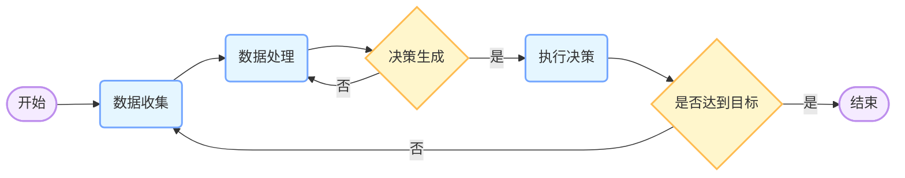

# AI Agent在智能城市规划决策中的角色

> 关键词：AI Agent、智能城市规划、决策支持、数据处理、自动化决策

> 摘要：本文深入探讨了AI Agent在智能城市规划决策中的角色。首先介绍了相关背景，包括目的范围、预期读者等。接着阐述了核心概念与联系，通过文本示意图和Mermaid流程图展示其原理和架构。详细讲解了核心算法原理及具体操作步骤，给出了Python源代码示例。还分析了数学模型和公式，并举例说明。通过项目实战，展示了代码的实际案例和详细解释。探讨了AI Agent在智能城市规划中的实际应用场景，推荐了相关的工具和资源。最后总结了未来发展趋势与挑战，提供了常见问题解答和扩展阅读参考资料。旨在帮助读者全面了解AI Agent在智能城市规划决策中的重要作用和应用方式。

## 1. 背景介绍 
### 1.1 目的和范围
随着城市化进程的加速，城市面临着越来越多的挑战，如交通拥堵、环境污染、资源分配不均等。智能城市规划旨在利用先进的技术手段，实现城市的可持续发展和高效运行。AI Agent作为一种智能化的软件实体，具有自主学习、决策和交互的能力，能够在智能城市规划决策中发挥重要作用。本文的目的是深入研究AI Agent在智能城市规划决策中的角色，探讨其应用原理、算法和实际案例，为城市规划者和相关研究人员提供参考。

本文的范围涵盖了AI Agent的基本概念、核心算法、数学模型，以及在智能城市规划决策中的具体应用场景。同时，还介绍了相关的工具和资源，以及未来的发展趋势和挑战。

### 1.2 预期读者
本文的预期读者包括城市规划师、城市管理者、计算机科学家、人工智能研究人员，以及对智能城市规划和AI Agent感兴趣的相关人士。通过阅读本文，读者可以了解AI Agent在智能城市规划决策中的应用方法和技术原理，为实际工作和研究提供有益的参考。

### 1.3 文档结构概述
本文共分为十个部分，具体结构如下：
1. **背景介绍**：介绍本文的目的、范围、预期读者和文档结构概述，以及相关术语的定义和解释。
2. **核心概念与联系**：阐述AI Agent的核心概念、原理和架构，通过文本示意图和Mermaid流程图展示其与智能城市规划决策的联系。
3. **核心算法原理 & 具体操作步骤**：详细讲解AI Agent在智能城市规划决策中常用的核心算法原理，并给出Python源代码示例和具体操作步骤。
4. **数学模型和公式 & 详细讲解 & 举例说明**：分析AI Agent在智能城市规划决策中的数学模型和公式，进行详细讲解并举例说明。
5. **项目实战：代码实际案例和详细解释说明**：通过实际项目案例，展示AI Agent在智能城市规划决策中的代码实现和详细解释。
6. **实际应用场景**：探讨AI Agent在智能城市规划决策中的实际应用场景，如交通规划、能源管理、环境监测等。
7. **工具和资源推荐**：推荐相关的学习资源、开发工具框架和论文著作，帮助读者进一步深入学习和研究。
8. **总结：未来发展趋势与挑战**：总结AI Agent在智能城市规划决策中的应用现状，分析未来的发展趋势和面临的挑战。
9. **附录：常见问题与解答**：提供常见问题的解答，帮助读者解决在学习和应用过程中遇到的问题。
10. **扩展阅读 & 参考资料**：列出相关的扩展阅读资料和参考文献，供读者进一步深入研究。

### 1.4 术语表
#### 1.4.1 核心术语定义
- **AI Agent**：人工智能代理，是一种能够感知环境、自主决策并采取行动的智能化软件实体。
- **智能城市规划**：利用先进的信息技术和智能化手段，对城市的空间布局、基础设施、资源利用等进行科学规划和管理，以实现城市的可持续发展和高效运行。
- **决策支持**：为决策者提供相关信息、分析和建议，帮助其做出更明智的决策。
- **数据处理**：对各种类型的数据进行收集、整理、分析和挖掘，以提取有价值的信息。
- **自动化决策**：利用计算机算法和模型，自动生成决策方案，减少人工干预。

#### 1.4.2 相关概念解释
- **多智能体系统（MAS）**：由多个AI Agent组成的系统，这些Agent之间可以相互协作、竞争和交互，共同完成复杂的任务。
- **机器学习**：让计算机通过数据学习模式和规律，从而实现预测、分类和决策等功能。
- **深度学习**：机器学习的一个分支，通过构建深度神经网络，自动学习数据的高层特征，在图像识别、自然语言处理等领域取得了显著的成果。
- **传感器网络**：由大量的传感器节点组成的网络，用于实时监测城市的各种环境参数和状态信息。

#### 1.4.3 缩略词列表
- **AI**：Artificial Intelligence（人工智能）
- **MAS**：Multi - Agent System（多智能体系统）
- **ML**：Machine Learning（机器学习）
- **DL**：Deep Learning（深度学习）

## 2. 核心概念与联系 
### 2.1 AI Agent的核心概念
AI Agent是一种具有自主性、反应性、社会性和主动性的智能化软件实体。自主性意味着AI Agent能够在没有人类干预的情况下，独立地感知环境、做出决策并采取行动；反应性表示AI Agent能够及时对环境的变化做出响应；社会性体现了AI Agent可以与其他Agent或人类进行交互和协作；主动性则表明AI Agent能够主动地发起行动，以实现其目标。

### 2.2 AI Agent与智能城市规划决策的联系
在智能城市规划决策中，AI Agent可以扮演多种角色。首先，它可以作为数据收集者，通过传感器网络和其他数据源收集城市的各种信息，如交通流量、空气质量、能源消耗等。其次，AI Agent可以作为数据处理者，对收集到的数据进行清洗、分析和挖掘，提取有价值的信息和知识。然后，AI Agent可以作为决策支持者，根据分析结果为城市规划者提供决策建议和方案。最后，AI Agent还可以作为执行者，自动执行一些决策任务，如调整交通信号灯的时间、控制能源设备的运行等。

### 2.3 核心概念原理和架构的文本示意图
AI Agent在智能城市规划决策中的工作原理可以用以下文本示意图表示：

AI Agent接收来自城市传感器网络和其他数据源的信息，经过感知模块对信息进行处理和分析，提取环境特征。然后，决策模块根据这些特征和预设的目标，利用机器学习和优化算法生成决策方案。最后，执行模块将决策方案转化为具体的行动，作用于城市环境。同时，AI Agent还可以通过通信模块与其他Agent或人类进行交互和协作，共享信息和知识，共同完成城市规划决策任务。

### 2.4 Mermaid流程图


该流程图展示了AI Agent在智能城市规划决策中的基本工作流程。首先进行数据收集，然后对数据进行处理，根据处理结果生成决策。如果决策可行，则执行决策，执行后检查是否达到目标。如果未达到目标，则继续进行数据收集和处理，直到达到目标为止。

## 3. 核心算法原理 & 具体操作步骤 
### 3.1 核心算法原理
在智能城市规划决策中，AI Agent常用的核心算法包括机器学习算法和优化算法。

#### 3.1.1 机器学习算法
机器学习算法可以帮助AI Agent从大量的数据中学习模式和规律，从而实现预测、分类和决策等功能。常见的机器学习算法包括决策树、支持向量机、神经网络等。

以神经网络为例，神经网络是一种模仿人类神经系统的计算模型，由大量的神经元组成。每个神经元接收输入信号，经过加权求和和非线性变换后，输出一个结果。神经网络通过不断调整神经元之间的连接权重，来学习输入数据和输出结果之间的映射关系。

#### 3.1.2 优化算法
优化算法用于在多个可行方案中找到最优方案，以实现特定的目标。常见的优化算法包括遗传算法、模拟退火算法、粒子群算法等。

以遗传算法为例，遗传算法是一种基于生物进化原理的优化算法。它通过模拟生物的遗传和进化过程，不断迭代搜索最优解。遗传算法的基本操作包括选择、交叉和变异。选择操作根据个体的适应度值选择优秀的个体；交叉操作将选中的个体进行基因交换，生成新的个体；变异操作对新个体的基因进行随机变异，增加种群的多样性。

### 3.2 具体操作步骤
下面以一个简单的交通流量预测问题为例，介绍AI Agent使用神经网络进行预测的具体操作步骤。

#### 3.2.1 数据收集
使用交通传感器收集城市主要道路的交通流量数据，包括不同时间段的车流量、车速等信息。

#### 3.2.2 数据预处理
对收集到的数据进行清洗，去除噪声和异常值；进行归一化处理，将数据转换到[0, 1]区间内，以提高神经网络的训练效果。

#### 3.2.3 模型构建
使用Python的深度学习库（如TensorFlow或PyTorch）构建一个简单的神经网络模型。以下是一个使用TensorFlow构建的示例代码：

```python
import tensorflow as tf
from tensorflow.keras.models import Sequential
from tensorflow.keras.layers import Dense

# 构建神经网络模型
model = Sequential([
    Dense(64, activation='relu', input_shape=(input_dim,)),
    Dense(32, activation='relu'),
    Dense(1)
])

# 编译模型
model.compile(optimizer='adam', loss='mse')
```

#### 3.2.4 模型训练
将预处理后的数据分为训练集和测试集，使用训练集对神经网络模型进行训练。

```python
# 训练模型
model.fit(X_train, y_train, epochs=100, batch_size=32, validation_data=(X_test, y_test))
```

#### 3.2.5 模型评估
使用测试集对训练好的模型进行评估，计算预测结果的误差。

```python
# 评估模型
loss = model.evaluate(X_test, y_test)
print(f"Test loss: {loss}")
```

#### 3.2.6 预测
使用训练好的模型对未来的交通流量进行预测。

```python
# 进行预测
predictions = model.predict(X_new)
print(f"Predictions: {predictions}")
```

## 4. 数学模型和公式 & 详细讲解 & 举例说明 
### 4.1 神经网络的数学模型和公式
#### 4.1.1 神经元的数学模型
神经网络中的神经元是一个基本的计算单元，其数学模型可以表示为：

$$y = f\left(\sum_{i = 1}^{n}w_{i}x_{i}+b\right)$$

其中，$x_{i}$ 是输入信号，$w_{i}$ 是连接权重，$b$ 是偏置，$f$ 是激活函数，$y$ 是输出信号。

#### 4.1.2 激活函数
激活函数的作用是引入非线性因素，使神经网络能够学习复杂的模式和规律。常见的激活函数包括Sigmoid函数、ReLU函数等。

- Sigmoid函数的公式为：

$$f(x)=\frac{1}{1 + e^{-x}}$$

- ReLU函数的公式为：

$$f(x)=\max(0, x)$$

#### 4.1.3 神经网络的训练过程
神经网络的训练过程是通过调整连接权重和偏置，使模型的输出尽可能接近真实标签。常用的训练方法是反向传播算法，其核心思想是通过计算损失函数的梯度，反向更新连接权重和偏置。

损失函数通常使用均方误差（MSE），其公式为：

$$MSE=\frac{1}{n}\sum_{i = 1}^{n}(y_{i}-\hat{y}_{i})^{2}$$

其中，$y_{i}$ 是真实标签，$\hat{y}_{i}$ 是模型的预测值，$n$ 是样本数量。

### 4.2 遗传算法的数学模型和公式
#### 4.2.1 适应度函数
适应度函数用于评估个体的优劣程度，其值越大表示个体越优秀。适应度函数的具体形式根据具体问题而定。

#### 4.2.2 选择操作
选择操作通常使用轮盘赌选择法，其基本思想是根据个体的适应度值确定其被选中的概率。个体被选中的概率公式为：

$$P_{i}=\frac{F_{i}}{\sum_{j = 1}^{N}F_{j}}$$

其中，$P_{i}$ 是第 $i$ 个个体被选中的概率，$F_{i}$ 是第 $i$ 个个体的适应度值，$N$ 是种群的大小。

#### 4.2.3 交叉操作
交叉操作是将选中的两个个体的基因进行交换，生成新的个体。常见的交叉操作方法包括单点交叉、多点交叉等。

#### 4.2.4 变异操作
变异操作是对新个体的基因进行随机变异，增加种群的多样性。变异操作的概率通常较小。

### 4.3 举例说明
#### 4.3.1 神经网络举例
假设我们要使用神经网络预测房价，输入特征包括房屋面积、卧室数量、卫生间数量等，输出为房价。我们可以构建一个包含输入层、隐藏层和输出层的神经网络模型。输入层的神经元数量等于输入特征的数量，隐藏层可以设置多个神经元，输出层的神经元数量为1。

在训练过程中，我们使用均方误差作为损失函数，通过反向传播算法调整连接权重和偏置，使模型的预测值尽可能接近真实房价。

#### 4.3.2 遗传算法举例
假设我们要使用遗传算法求解函数 $f(x)=x^{2}$ 在区间 $[-10, 10]$ 内的最大值。我们可以将 $x$ 编码为二进制字符串，作为个体的基因。适应度函数可以定义为 $F(x)=f(x)$，即函数值越大，适应度值越高。

在遗传算法的迭代过程中，通过选择、交叉和变异操作不断生成新的个体，直到找到最优解。

## 5. 项目实战：代码实际案例和详细解释说明 
### 5.1  开发环境搭建
#### 5.1.1 安装Python
首先需要安装Python，建议使用Python 3.7及以上版本。可以从Python官方网站（https://www.python.org/downloads/）下载并安装。

#### 5.1.2 安装必要的库
在智能城市规划决策项目中，常用的库包括TensorFlow、NumPy、Pandas等。可以使用以下命令进行安装：

```bash
pip install tensorflow numpy pandas
```

### 5.2  源代码详细实现和代码解读
以下是一个使用AI Agent进行交通流量预测的完整代码示例：

```python
import numpy as np
import pandas as pd
from sklearn.preprocessing import MinMaxScaler
from tensorflow.keras.models import Sequential
from tensorflow.keras.layers import Dense

# 数据收集和预处理
def load_and_preprocess_data(file_path):
    # 读取数据
    data = pd.read_csv(file_path)
    # 提取特征和标签
    X = data.drop('traffic_flow', axis=1).values
    y = data['traffic_flow'].values
    # 数据归一化
    scaler_X = MinMaxScaler()
    scaler_y = MinMaxScaler()
    X = scaler_X.fit_transform(X)
    y = scaler_y.fit_transform(y.reshape(-1, 1)).flatten()
    return X, y, scaler_X, scaler_y

# 构建神经网络模型
def build_model(input_dim):
    model = Sequential([
        Dense(64, activation='relu', input_shape=(input_dim,)),
        Dense(32, activation='relu'),
        Dense(1)
    ])
    model.compile(optimizer='adam', loss='mse')
    return model

# 训练模型
def train_model(model, X_train, y_train, epochs=100, batch_size=32):
    model.fit(X_train, y_train, epochs=epochs, batch_size=batch_size)
    return model

# 进行预测
def predict(model, X_new, scaler_y):
    predictions = model.predict(X_new)
    # 反归一化
    predictions = scaler_y.inverse_transform(predictions)
    return predictions

# 主函数
if __name__ == "__main__":
    # 数据文件路径
    file_path = 'traffic_data.csv'
    # 加载和预处理数据
    X, y, scaler_X, scaler_y = load_and_preprocess_data(file_path)
    # 划分训练集和测试集
    train_size = int(len(X) * 0.8)
    X_train, X_test = X[:train_size], X[train_size:]
    y_train, y_test = y[:train_size], y[train_size:]
    # 构建模型
    input_dim = X_train.shape[1]
    model = build_model(input_dim)
    # 训练模型
    model = train_model(model, X_train, y_train)
    # 进行预测
    predictions = predict(model, X_test, scaler_y)
    print(f"Predictions: {predictions}")
```

### 5.3  代码解读与分析
#### 5.3.1 数据收集和预处理
`load_and_preprocess_data` 函数用于读取交通流量数据文件，并对数据进行预处理。首先使用 `pandas` 库读取CSV文件，然后提取特征和标签。接着使用 `MinMaxScaler` 对特征和标签进行归一化处理，将数据转换到[0, 1]区间内。

#### 5.3.2 构建神经网络模型
`build_model` 函数使用 `Sequential` 模型构建一个简单的神经网络，包含一个输入层、两个隐藏层和一个输出层。使用 `adam` 优化器和均方误差损失函数进行编译。

#### 5.3.3 训练模型
`train_model` 函数使用训练集对神经网络模型进行训练，指定训练的轮数和批量大小。

#### 5.3.4 进行预测
`predict` 函数使用训练好的模型对测试集进行预测，并将预测结果进行反归一化处理，得到真实的交通流量值。

#### 5.3.5 主函数
在主函数中，首先调用 `load_and_preprocess_data` 函数加载和预处理数据，然后划分训练集和测试集。接着调用 `build_model` 函数构建模型，调用 `train_model` 函数训练模型，最后调用 `predict` 函数进行预测并输出结果。

## 6. 实际应用场景 
### 6.1 交通规划
AI Agent可以实时收集交通流量、车速、交通事故等信息，通过分析和预测，为交通规划者提供决策支持。例如，根据预测的交通流量调整交通信号灯的时间，优化公交线路的规划，缓解交通拥堵。

### 6.2 能源管理
AI Agent可以监测城市的能源消耗情况，如电力、水、天然气等。通过分析能源使用模式，预测能源需求，优化能源分配和调度。例如，根据天气情况和用户需求，自动调整建筑物的空调、照明等设备的运行，降低能源消耗。

### 6.3 环境监测
AI Agent可以通过传感器网络实时监测城市的空气质量、水质、噪音等环境参数。当环境指标超过阈值时，及时发出警报，并提供相应的治理建议。例如，根据空气质量监测结果，调整工业排放限制，推广清洁能源的使用。

### 6.4 城市安全
AI Agent可以分析城市的安全数据，如犯罪率、火灾发生率等。通过预测和预警，提前采取防范措施，保障城市的安全。例如，根据犯罪热点分析，合理安排警力部署，加强重点区域的监控。

### 6.5 土地利用规划
AI Agent可以综合考虑城市的人口分布、经济发展、环境因素等，对土地利用进行优化规划。例如，根据人口增长趋势和就业需求，合理规划住宅、商业和工业用地的布局。

## 7. 工具和资源推荐
### 7.1 学习资源推荐
#### 7.1.1 书籍推荐
- 《人工智能：一种现代的方法》：全面介绍了人工智能的基本概念、算法和应用，是人工智能领域的经典教材。
- 《Python机器学习》：详细介绍了Python在机器学习中的应用，包括各种机器学习算法的原理和实现。
- 《深度学习》：由深度学习领域的三位顶级专家撰写，系统地介绍了深度学习的理论和实践。

#### 7.1.2 在线课程
- Coursera上的“机器学习”课程：由斯坦福大学教授Andrew Ng主讲，是机器学习领域最受欢迎的在线课程之一。
- edX上的“深度学习”课程：由微软和伯克利大学联合推出，深入介绍了深度学习的原理和应用。
- Udemy上的“Python人工智能实战”课程：通过实际项目案例，讲解Python在人工智能中的应用。

#### 7.1.3 技术博客和网站
- Medium：有很多人工智能领域的专业博主分享最新的技术文章和研究成果。
- arXiv：提供大量的学术论文预印本，涵盖了人工智能的各个领域。
- Towards Data Science：专注于数据科学和人工智能领域的技术博客，有很多实用的教程和案例。

### 7.2 开发工具框架推荐
#### 7.2.1 IDE和编辑器
- PyCharm：是一款专业的Python集成开发环境，提供了丰富的代码编辑、调试和项目管理功能。
- Jupyter Notebook：是一个交互式的编程环境，适合进行数据探索、模型训练和可视化。
- Visual Studio Code：是一款轻量级的代码编辑器，支持多种编程语言，有丰富的插件扩展。

#### 7.2.2 调试和性能分析工具
- TensorBoard：是TensorFlow提供的可视化工具，可以用于监控模型的训练过程、分析模型的性能。
- Py-Spy：是一个Python性能分析工具，可以帮助开发者找出代码中的性能瓶颈。
- cProfile：是Python标准库中的性能分析模块，可以统计函数的调用次数和执行时间。

#### 7.2.3 相关框架和库
- TensorFlow：是Google开发的开源深度学习框架，具有强大的计算能力和广泛的应用场景。
- PyTorch：是Facebook开发的开源深度学习框架，以其动态图机制和易用性受到广泛关注。
- Scikit-learn：是Python中常用的机器学习库，提供了丰富的机器学习算法和工具。

### 7.3 相关论文著作推荐
#### 7.3.1 经典论文
- “Learning Representations by Back-propagating Errors”：介绍了反向传播算法，是神经网络领域的经典论文。
- “A Logical Calculus of the Ideas Immanent in Nervous Activity”：提出了神经元的数学模型，为神经网络的发展奠定了基础。
- “Nature-Inspired Metaheuristic Algorithms”：介绍了遗传算法、模拟退火算法等自然启发式优化算法。

#### 7.3.2 最新研究成果
- 关注顶级学术会议如NeurIPS、ICML、CVPR等的论文，了解人工智能领域的最新研究动态。
- 查阅知名学术期刊如Journal of Artificial Intelligence Research、Artificial Intelligence等的文章。

#### 7.3.3 应用案例分析
- 一些研究机构和企业会发布智能城市规划决策的应用案例报告，可以从中学习实际应用中的经验和方法。

## 8. 总结：未来发展趋势与挑战
### 8.1 未来发展趋势
#### 8.1.1 多智能体协作
未来，AI Agent将不再是孤立的个体，而是通过多智能体系统进行协作。不同类型的AI Agent可以在智能城市规划决策中发挥各自的优势，共同完成复杂的任务。例如，交通管理Agent、能源管理Agent和环境监测Agent可以相互协作，实现城市的综合优化。

#### 8.1.2 与物联网深度融合
随着物联网技术的发展，城市中的各种设备和传感器将产生海量的数据。AI Agent可以与物联网深度融合，实时收集和分析这些数据，为城市规划决策提供更准确、及时的信息。

#### 8.1.3 强化学习的应用
强化学习可以让AI Agent在与环境的交互中不断学习和优化决策策略。在智能城市规划决策中，强化学习可以用于动态调整交通信号、优化能源分配等，提高城市的运行效率。

#### 8.1.4 可解释性和透明度
随着AI Agent在智能城市规划决策中的应用越来越广泛，其决策的可解释性和透明度将变得越来越重要。未来的研究将致力于开发可解释的AI算法，让城市规划者能够理解AI Agent的决策过程和依据。

### 8.2 挑战
#### 8.2.1 数据质量和安全
智能城市规划决策依赖于大量的数据，但数据的质量和安全是一个挑战。数据可能存在噪声、缺失值和错误，同时还需要保护数据的隐私和安全，防止数据泄露和滥用。

#### 8.2.2 算法复杂度和计算资源
一些先进的AI算法，如深度学习和强化学习，具有较高的复杂度，需要大量的计算资源。在实际应用中，如何在有限的计算资源下实现高效的算法是一个需要解决的问题。

#### 8.2.3 社会接受度
AI Agent在智能城市规划决策中的应用可能会引起社会的担忧和质疑。例如，人们可能担心AI Agent的决策会影响他们的生活和权益，如何提高社会对AI Agent的接受度是一个挑战。

#### 8.2.4 法律法规和伦理问题
随着AI Agent的广泛应用，相关的法律法规和伦理问题也日益凸显。例如，如何界定AI Agent的责任和义务，如何避免AI Agent的决策导致不公平和歧视等问题，需要制定相应的法律法规和伦理准则。

## 9. 附录：常见问题与解答
### 9.1 什么是AI Agent？
AI Agent是一种能够感知环境、自主决策并采取行动的智能化软件实体。它具有自主性、反应性、社会性和主动性等特点，可以在没有人类干预的情况下完成特定的任务。

### 9.2 AI Agent在智能城市规划决策中有哪些优势？
AI Agent可以实时收集和分析大量的数据，提供更准确、及时的决策建议；可以自动执行决策任务，提高决策的执行效率；可以通过多智能体协作，解决复杂的城市规划问题。

### 9.3 如何评估AI Agent在智能城市规划决策中的性能？
可以从多个方面评估AI Agent的性能，如决策的准确性、决策的效率、对环境变化的适应性等。可以使用一些指标，如均方误差、准确率、召回率等，来衡量AI Agent的性能。

### 9.4 AI Agent在智能城市规划决策中会取代人类吗？
AI Agent在智能城市规划决策中可以提供重要的支持和帮助，但不会完全取代人类。人类具有创造力、判断力和道德价值观等方面的优势，在城市规划决策中仍然起着关键的作用。AI Agent和人类可以相互协作，共同推动智能城市的发展。

### 9.5 如何确保AI Agent在智能城市规划决策中的安全性和可靠性？
可以通过以下措施确保AI Agent的安全性和可靠性：使用可靠的算法和模型，进行充分的测试和验证；建立数据备份和恢复机制，防止数据丢失；加强数据的安全保护，防止数据泄露和滥用；建立监控和预警机制，及时发现和处理异常情况。

## 10. 扩展阅读 & 参考资料
### 10.1 扩展阅读
- 《智能城市：大数据、智慧城市与城市规划》：深入探讨了大数据和人工智能在智能城市规划中的应用。
- 《人工智能时代的城市规划》：分析了人工智能对城市规划的影响和挑战，提出了相应的应对策略。
- 《多智能体系统原理与应用》：详细介绍了多智能体系统的原理、算法和应用。

### 10.2 参考资料
- 相关学术论文和研究报告，可以通过学术数据库如IEEE Xplore、ACM Digital Library等进行检索。
- 政府部门和研究机构发布的智能城市规划相关政策和报告。
- 开源项目和代码库，如GitHub上的智能城市相关项目。

作者：AI天才研究院/AI Genius Institute & 禅与计算机程序设计艺术 /Zen And The Art of Computer Programming