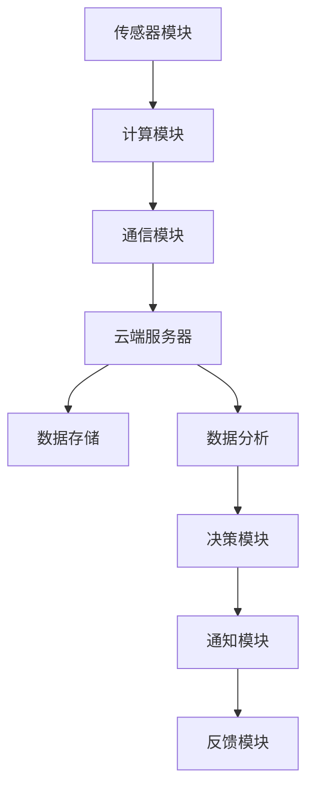

# AI Agent在智能头盔中的运动安全监控

> 关键词：AI Agent、智能头盔、运动安全监控、传感器技术、实时数据分析

> 摘要：本文聚焦于AI Agent在智能头盔运动安全监控中的应用。首先介绍了研究背景，包括目的、预期读者等内容。接着阐述了AI Agent、智能头盔及运动安全监控的核心概念与联系，详细讲解了核心算法原理和具体操作步骤，并给出相应的Python代码。通过数学模型和公式进一步剖析其原理，结合实际案例进行项目实战，展示开发环境搭建、源代码实现与解读。同时探讨了实际应用场景，推荐了相关学习资源、开发工具框架以及论文著作。最后总结了未来发展趋势与挑战，提供常见问题解答和扩展阅读参考资料，旨在全面深入地探讨AI Agent在智能头盔运动安全监控中的应用及发展。

## 1. 背景介绍 
### 1.1 目的和范围
随着运动健身热潮的兴起，各类户外运动的参与人数不断增加，然而运动过程中的安全问题也日益凸显。智能头盔作为一种可穿戴设备，在运动安全防护方面具有巨大的潜力。本研究的目的是探讨如何将AI Agent技术应用于智能头盔中，实现对运动者的安全监控。具体范围涵盖了从AI Agent的基本原理和算法，到智能头盔的硬件设计与集成，以及运动安全监控的具体应用场景和数据分析方法。

### 1.2 预期读者
本文预期读者包括计算机科学、人工智能、电子工程等领域的专业人士，以及对智能穿戴设备、运动安全监控感兴趣的研究人员和开发者。同时，也适合相关行业的产品经理和创业者，为他们在产品设计和市场推广方面提供参考。

### 1.3 文档结构概述
本文将按照以下结构进行阐述：首先介绍相关背景知识，包括目的、读者和文档结构；接着详细讲解核心概念与联系，包括AI Agent、智能头盔和运动安全监控的原理和架构；然后阐述核心算法原理和具体操作步骤，并给出Python代码示例；通过数学模型和公式进一步分析其原理；结合实际案例进行项目实战，包括开发环境搭建、源代码实现和代码解读；探讨实际应用场景；推荐相关的学习资源、开发工具框架和论文著作；最后总结未来发展趋势与挑战，提供常见问题解答和扩展阅读参考资料。

### 1.4 术语表
#### 1.4.1 核心术语定义
- **AI Agent（人工智能代理）**：是一种能够感知环境、做出决策并采取行动的智能实体，它可以根据预设的目标和规则，自主地完成各种任务。
- **智能头盔**：集成了多种传感器和计算设备的头盔，能够实时采集运动者的生理数据和环境信息，并通过无线通信技术将数据传输到云端或其他终端设备进行处理和分析。
- **运动安全监控**：通过对运动者的生理数据、运动状态和环境信息进行实时监测和分析，及时发现潜在的安全风险，并采取相应的措施保障运动者的安全。

#### 1.4.2 相关概念解释
- **传感器技术**：是智能头盔实现数据采集的关键技术，包括加速度计、陀螺仪、心率传感器、温度传感器等，能够实时获取运动者的运动轨迹、姿态、心率、体温等信息。
- **数据分析**：对采集到的大量数据进行处理和分析，提取有价值的信息，如运动强度、疲劳程度、安全风险等，为运动安全监控提供决策依据。
- **机器学习算法**：用于对运动数据进行建模和预测，通过训练模型来识别不同的运动状态和安全风险，提高运动安全监控的准确性和可靠性。

#### 1.4.3 缩略词列表
- **AI**：Artificial Intelligence（人工智能）
- **MEMS**：Micro-Electro-Mechanical Systems（微机电系统）
- **GPS**：Global Positioning System（全球定位系统）
- **BLE**：Bluetooth Low Energy（低功耗蓝牙）

## 2. 核心概念与联系 

### 核心概念原理
#### AI Agent原理
AI Agent的核心是感知、决策和行动三个过程。它通过传感器感知环境信息，然后根据预设的目标和规则进行决策，最后采取相应的行动。例如，在智能头盔中，AI Agent可以通过心率传感器感知运动者的心率变化，根据预设的心率阈值判断运动者的疲劳程度，然后通过语音提示或震动提醒运动者调整运动强度。

#### 智能头盔原理
智能头盔集成了多种传感器，如加速度计、陀螺仪、心率传感器等，用于采集运动者的生理数据和运动信息。这些传感器将采集到的数据传输到头盔内置的计算设备中进行处理和分析，然后通过无线通信技术将数据传输到云端或其他终端设备。智能头盔还可以配备显示屏、语音提示等设备，为运动者提供实时的反馈信息。

#### 运动安全监控原理
运动安全监控通过对运动者的生理数据、运动状态和环境信息进行实时监测和分析，及时发现潜在的安全风险。例如，通过监测运动者的心率、血压等生理指标，判断运动者是否处于疲劳或危险状态；通过监测运动者的运动轨迹和速度，判断运动者是否偏离安全路线或超速行驶。

### 架构的文本示意图
```plaintext
智能头盔
|-- 传感器模块
|   |-- 加速度计
|   |-- 陀螺仪
|   |-- 心率传感器
|   |-- 温度传感器
|   |-- GPS模块
|-- 计算模块
|   |-- 微处理器
|   |-- 内存
|   |-- 存储设备
|-- 通信模块
|   |-- BLE模块
|   |-- Wi-Fi模块
|-- 反馈模块
|   |-- 显示屏
|   |-- 语音提示器
|   |-- 震动器

云端服务器
|-- 数据存储
|-- 数据分析
|   |-- 机器学习算法
|   |-- 规则引擎
|-- 决策模块
|-- 通知模块
```

### Mermaid流程图


## 3. 核心算法原理 & 具体操作步骤 

### 核心算法原理
#### 运动状态识别算法
运动状态识别算法主要用于识别运动者的运动状态，如跑步、骑行、静止等。常用的方法是基于机器学习的分类算法，如支持向量机（SVM）、决策树、神经网络等。这些算法通过对采集到的加速度计和陀螺仪数据进行特征提取和分类，实现对不同运动状态的识别。

#### 疲劳检测算法
疲劳检测算法主要用于检测运动者的疲劳程度。常用的方法是基于心率变异性（HRV）分析和运动强度分析。HRV是指心率在一定时间内的变化情况，它可以反映人体的自主神经系统功能和疲劳程度。运动强度分析则是通过监测运动者的运动速度、加速度等参数，判断运动者的运动强度是否超过了身体的承受能力。

#### 安全风险预警算法
安全风险预警算法主要用于预测运动者可能面临的安全风险，如摔倒、碰撞等。常用的方法是基于传感器数据的异常检测和机器学习的预测算法。异常检测算法通过对传感器数据进行实时监测，发现数据中的异常值，如加速度的突然变化、心率的异常升高或降低等。机器学习的预测算法则是通过对历史数据进行训练，建立安全风险预测模型，对未来可能发生的安全风险进行预测。

### 具体操作步骤
#### 数据采集
通过智能头盔中的传感器模块采集运动者的生理数据和运动信息，包括加速度、角速度、心率、体温、GPS位置等。

#### 数据预处理
对采集到的数据进行预处理，包括滤波、降噪、归一化等操作，以提高数据的质量和可用性。

#### 特征提取
从预处理后的数据中提取特征，如均值、方差、标准差、峰值等，用于后续的分类和预测。

#### 模型训练
使用机器学习算法对提取的特征进行训练，建立运动状态识别模型、疲劳检测模型和安全风险预警模型。

#### 实时监测和决策
在运动过程中，实时采集传感器数据，进行预处理和特征提取，然后使用训练好的模型进行运动状态识别、疲劳检测和安全风险预警。根据识别和预警结果，做出相应的决策，如提醒运动者调整运动强度、停止运动等。

### Python源代码示例
```python
import numpy as np
from sklearn.svm import SVC
from sklearn.preprocessing import StandardScaler
from sklearn.model_selection import train_test_split

# 模拟传感器数据
X = np.random.rand(100, 5)  # 100个样本，每个样本有5个特征
y = np.random.randint(0, 2, 100)  # 100个样本的标签，0或1

# 数据预处理
scaler = StandardScaler()
X_scaled = scaler.fit_transform(X)

# 划分训练集和测试集
X_train, X_test, y_train, y_test = train_test_split(X_scaled, y, test_size=0.2, random_state=42)

# 模型训练
model = SVC()
model.fit(X_train, y_train)

# 模型评估
accuracy = model.score(X_test, y_test)
print(f"模型准确率: {accuracy}")
```

## 4. 数学模型和公式 & 详细讲解 & 举例说明 

### 运动状态识别模型
#### 支持向量机（SVM）模型
支持向量机是一种常用的分类算法，其基本思想是在特征空间中找到一个最优的超平面，将不同类别的样本分开。对于线性可分的情况，SVM的目标是找到一个超平面 $w^T x + b = 0$，使得不同类别的样本到该超平面的间隔最大。具体的优化问题可以表示为：

$$
\begin{aligned}
\min_{w,b} &\quad \frac{1}{2} \|w\|^2 \\
\text{s.t.} &\quad y_i (w^T x_i + b) \geq 1, \quad i = 1,2,\cdots,n
\end{aligned}
$$

其中，$w$ 是超平面的法向量，$b$ 是偏置项，$x_i$ 是第 $i$ 个样本的特征向量，$y_i$ 是第 $i$ 个样本的标签，$n$ 是样本的数量。

#### 举例说明
假设我们有一个二维的数据集，包含两个类别的样本，分别用红色和蓝色表示。我们可以使用SVM算法找到一个最优的超平面，将这两个类别的样本分开。

```python
import numpy as np
import matplotlib.pyplot as plt
from sklearn.svm import SVC

# 生成数据集
X = np.array([[3, 4], [1, 2], [2, 3], [5, 6], [7, 8], [6, 7]])
y = np.array([0, 0, 0, 1, 1, 1])

# 训练SVM模型
model = SVC(kernel='linear')
model.fit(X, y)

# 绘制数据集和超平面
plt.scatter(X[:, 0], X[:, 1], c=y, cmap=plt.cm.Paired)
ax = plt.gca()
xlim = ax.get_xlim()
ylim = ax.get_ylim()

# 创建网格点
xx = np.linspace(xlim[0], xlim[1], 30)
yy = np.linspace(ylim[0], ylim[1], 30)
YY, XX = np.meshgrid(yy, xx)
xy = np.vstack([XX.ravel(), YY.ravel()]).T
Z = model.decision_function(xy).reshape(XX.shape)

# 绘制超平面和边界
ax.contour(XX, YY, Z, colors='k', levels=[-1, 0, 1], alpha=0.5, linestyles=['--', '-', '--'])
plt.show()
```

### 疲劳检测模型
#### 心率变异性（HRV）分析
心率变异性是指心率在一定时间内的变化情况，它可以反映人体的自主神经系统功能和疲劳程度。常用的HRV指标包括时域指标和频域指标。时域指标主要包括平均心率、心率标准差（SDNN）等；频域指标主要包括低频功率（LF）、高频功率（HF）等。

#### 举例说明
假设我们有一组心率数据，我们可以计算其心率标准差（SDNN）来评估心率变异性。

```python
import numpy as np

# 模拟心率数据
hr_data = np.array([60, 62, 61, 63, 62, 64, 63, 65, 64, 66])

# 计算心率标准差
sdnn = np.std(hr_data)
print(f"心率标准差 (SDNN): {sdnn}")
```

### 安全风险预警模型
#### 异常检测模型
异常检测模型主要用于检测传感器数据中的异常值，常用的方法是基于统计分析的方法，如Z-score检测、基于密度的异常检测等。以Z-score检测为例，其基本思想是计算每个数据点与均值的偏离程度，如果偏离程度超过了一定的阈值，则认为该数据点是异常值。

#### 举例说明
假设我们有一组加速度数据，我们可以使用Z-score检测方法来检测其中的异常值。

```python
import numpy as np

# 模拟加速度数据
acc_data = np.array([1.0, 1.1, 1.2, 1.3, 1.4, 1.5, 1.6, 1.7, 1.8, 10.0])

# 计算均值和标准差
mean = np.mean(acc_data)
std = np.std(acc_data)

# 计算Z-score
z_scores = np.abs((acc_data - mean) / std)

# 设置阈值
threshold = 3

# 检测异常值
outliers = acc_data[z_scores > threshold]
print(f"异常值: {outliers}")
```

## 5. 项目实战：代码实际案例和详细解释说明 

### 5.1  开发环境搭建
#### 硬件环境
- **智能头盔**：选择一款支持多种传感器（如加速度计、陀螺仪、心率传感器等）的智能头盔，确保其具备数据采集和传输功能。
- **开发板**：选择一款适合的开发板，如Arduino、Raspberry Pi等，用于处理和分析传感器数据。
- **传感器模块**：根据需求选择合适的传感器模块，如MPU6050（加速度计和陀螺仪）、MAX30102（心率传感器）等。
- **通信模块**：选择一款支持无线通信的模块，如BLE模块、Wi-Fi模块等，用于将传感器数据传输到云端或其他终端设备。

#### 软件环境
- **开发语言**：选择Python作为开发语言，因为Python具有丰富的科学计算库和机器学习库，适合进行数据处理和分析。
- **开发工具**：选择PyCharm、Jupyter Notebook等开发工具，用于编写和调试Python代码。
- **云端平台**：选择阿里云、腾讯云等云端平台，用于存储和分析传感器数据。

### 5.2  源代码详细实现和代码解读
#### 数据采集代码
```python
import time
import board
import busio
import adafruit_mpu6050
import adafruit_max30102

# 初始化I2C总线
i2c = busio.I2C(board.SCL, board.SDA)

# 初始化MPU6050传感器
mpu = adafruit_mpu6050.MPU6050(i2c)

# 初始化MAX30102传感器
max30102 = adafruit_max30102.MAX30102(i2c)

while True:
    # 读取加速度数据
    accel_x, accel_y, accel_z = mpu.acceleration
    
    # 读取角速度数据
    gyro_x, gyro_y, gyro_z = mpu.gyro
    
    # 读取心率数据
    red, ir = max30102.read_sequential()
    
    print(f"加速度: ({accel_x}, {accel_y}, {accel_z})")
    print(f"角速度: ({gyro_x}, {gyro_y}, {gyro_z})")
    print(f"心率数据: (red={red}, ir={ir})")
    
    time.sleep(1)
```

**代码解读**：
- 首先导入必要的库，包括`board`、`busio`、`adafruit_mpu6050`和`adafruit_max30102`。
- 初始化I2C总线，用于与传感器进行通信。
- 初始化MPU6050传感器和MAX30102传感器。
- 在一个无限循环中，不断读取加速度、角速度和心率数据，并打印输出。
- 每次读取数据后，暂停1秒钟，避免数据采集过于频繁。

#### 数据传输代码
```python
import time
import board
import busio
import adafruit_mpu6050
import adafruit_max30102
import requests

# 初始化I2C总线
i2c = busio.I2C(board.SCL, board.SDA)

# 初始化MPU6050传感器
mpu = adafruit_mpu6050.MPU6050(i2c)

# 初始化MAX30102传感器
max30102 = adafruit_max30102.MAX30102(i2c)

# 云端服务器地址
server_url = "http://your_server_address/api/data"

while True:
    # 读取加速度数据
    accel_x, accel_y, accel_z = mpu.acceleration
    
    # 读取角速度数据
    gyro_x, gyro_y, gyro_z = mpu.gyro
    
    # 读取心率数据
    red, ir = max30102.read_sequential()
    
    # 构建数据字典
    data = {
        "accel_x": accel_x,
        "accel_y": accel_y,
        "accel_z": accel_z,
        "gyro_x": gyro_x,
        "gyro_y": gyro_y,
        "gyro_z": gyro_z,
        "red": red,
        "ir": ir
    }
    
    # 发送数据到云端服务器
    try:
        response = requests.post(server_url, json=data)
        if response.status_code == 200:
            print("数据发送成功")
        else:
            print(f"数据发送失败，状态码: {response.status_code}")
    except Exception as e:
        print(f"数据发送异常: {e}")
    
    time.sleep(1)
```

**代码解读**：
- 除了数据采集部分的代码外，还导入了`requests`库，用于与云端服务器进行通信。
- 定义了云端服务器的地址`server_url`。
- 在每次读取数据后，将数据构建成一个字典`data`。
- 使用`requests.post`方法将数据发送到云端服务器，并根据响应状态码判断数据是否发送成功。

#### 数据分析代码
```python
import pandas as pd
from sklearn.svm import SVC
from sklearn.preprocessing import StandardScaler
from sklearn.model_selection import train_test_split

# 读取数据
data = pd.read_csv("sensor_data.csv")

# 提取特征和标签
X = data.drop("label", axis=1)
y = data["label"]

# 数据预处理
scaler = StandardScaler()
X_scaled = scaler.fit_transform(X)

# 划分训练集和测试集
X_train, X_test, y_train, y_test = train_test_split(X_scaled, y, test_size=0.2, random_state=42)

# 模型训练
model = SVC()
model.fit(X_train, y_train)

# 模型评估
accuracy = model.score(X_test, y_test)
print(f"模型准确率: {accuracy}")
```

**代码解读**：
- 首先导入必要的库，包括`pandas`、`sklearn.svm`、`sklearn.preprocessing`和`sklearn.model_selection`。
- 使用`pandas`的`read_csv`方法读取传感器数据文件`sensor_data.csv`。
- 提取特征和标签，分别存储在`X`和`y`中。
- 使用`StandardScaler`对特征数据进行标准化处理。
- 使用`train_test_split`方法将数据划分为训练集和测试集。
- 使用`SVC`算法训练模型，并使用测试集评估模型的准确率。

### 5.3  代码解读与分析
#### 数据采集代码分析
数据采集代码主要负责从传感器中读取加速度、角速度和心率数据。通过初始化传感器和I2C总线，实现了与传感器的通信。在无限循环中，不断读取数据并打印输出，方便调试和验证。

#### 数据传输代码分析
数据传输代码在数据采集的基础上，增加了与云端服务器的通信功能。通过`requests`库将采集到的数据发送到云端服务器，实现了数据的实时传输。在发送数据时，使用了异常处理机制，确保在网络异常的情况下程序不会崩溃。

#### 数据分析代码分析
数据分析代码主要负责对采集到的数据进行处理和分析。通过`pandas`库读取数据文件，使用`StandardScaler`对数据进行标准化处理，使用`train_test_split`方法将数据划分为训练集和测试集。最后使用`SVC`算法训练模型，并评估模型的准确率。

## 6. 实际应用场景 
### 户外运动
在户外运动中，如跑步、骑行、登山等，智能头盔可以实时监测运动者的生理数据和运动状态，及时发现潜在的安全风险。例如，当运动者的心率过高或运动强度过大时，智能头盔可以通过语音提示或震动提醒运动者调整运动强度；当运动者摔倒或发生碰撞时，智能头盔可以自动发送求救信息到预设的联系人或救援机构。

### 工业生产
在工业生产中，智能头盔可以用于工人的安全监控。例如，在建筑工地、矿山等危险环境中，智能头盔可以实时监测工人的位置、姿态和运动状态，及时发现工人是否处于危险区域或发生意外事故。同时，智能头盔还可以监测工人的生理数据，如心率、血压等，判断工人是否处于疲劳或危险状态，保障工人的身体健康和生命安全。

### 体育训练
在体育训练中，智能头盔可以为运动员提供实时的反馈信息，帮助运动员调整训练强度和方法。例如，通过监测运动员的心率、运动轨迹和速度等参数，智能头盔可以分析运动员的训练效果和疲劳程度，为教练制定个性化的训练计划提供依据。

## 7. 工具和资源推荐
### 7.1 学习资源推荐
#### 7.1.1 书籍推荐
- 《人工智能：一种现代的方法》：全面介绍了人工智能的基本概念、算法和应用，是人工智能领域的经典教材。
- 《Python机器学习实战》：通过实际案例介绍了Python在机器学习中的应用，适合初学者入门。
- 《传感器技术与应用》：详细介绍了各种传感器的原理、特性和应用，对智能头盔的开发有很大的帮助。

#### 7.1.2 在线课程
- Coursera上的“机器学习”课程：由斯坦福大学教授Andrew Ng主讲，是机器学习领域的经典课程。
- edX上的“人工智能基础”课程：介绍了人工智能的基本概念、算法和应用，适合初学者学习。
- Udemy上的“Python数据科学实战”课程：通过实际案例介绍了Python在数据科学中的应用，包括数据处理、数据分析和机器学习等方面。

#### 7.1.3 技术博客和网站
- Medium：是一个技术博客平台，上面有很多关于人工智能、机器学习和传感器技术的文章。
- arXiv：是一个预印本数据库，上面有很多最新的学术论文和研究成果。
- Hackster.io：是一个开源硬件和物联网项目的社区，上面有很多关于智能头盔和可穿戴设备的项目案例和教程。

### 7.2 开发工具框架推荐
#### 7.2.1 IDE和编辑器
- PyCharm：是一款专门用于Python开发的集成开发环境，具有代码编辑、调试、版本控制等功能。
- Jupyter Notebook：是一个交互式的笔记本环境，适合进行数据探索和分析。
- Visual Studio Code：是一款轻量级的代码编辑器，支持多种编程语言和插件扩展。

#### 7.2.2 调试和性能分析工具
- Py-Spy：是一个Python性能分析工具，可以帮助开发者找出代码中的性能瓶颈。
-pdb：是Python自带的调试工具，可以帮助开发者调试代码中的错误。
- TensorBoard：是TensorFlow的可视化工具，可以帮助开发者可视化模型的训练过程和性能指标。

#### 7.2.3 相关框架和库
- TensorFlow：是一个开源的机器学习框架，广泛应用于深度学习领域。
- PyTorch：是一个开源的深度学习框架，具有动态图和静态图两种模式，适合不同的应用场景。
- Scikit-learn：是一个开源的机器学习库，提供了丰富的机器学习算法和工具，适合初学者入门。

### 7.3 相关论文著作推荐
#### 7.3.1 经典论文
- “Support-Vector Networks”：介绍了支持向量机的基本原理和算法，是支持向量机领域的经典论文。
- “A Logical Calculus of the Ideas Immanent in Nervous Activity”：提出了人工神经网络的基本概念和模型，是神经网络领域的经典论文。
- “Deep Residual Learning for Image Recognition”：提出了残差网络（ResNet）的概念，解决了深度神经网络训练中的梯度消失问题，是深度学习领域的重要论文。

#### 7.3.2 最新研究成果
- 搜索arXiv、IEEE Xplore等学术数据库，关注最新的关于AI Agent、智能头盔和运动安全监控的研究成果。

#### 7.3.3 应用案例分析
- 参考相关的行业报告和案例分析，了解AI Agent在智能头盔运动安全监控中的实际应用案例和效果。

## 8. 总结：未来发展趋势与挑战
### 未来发展趋势
#### 智能化程度不断提高
随着人工智能技术的不断发展，AI Agent在智能头盔中的应用将越来越智能化。未来的智能头盔将能够更加准确地识别运动者的运动状态和疲劳程度，提供更加个性化的安全监控和反馈信息。

#### 与其他设备的融合
智能头盔将与其他可穿戴设备（如智能手表、智能手环等）以及智能手机等设备进行融合，实现数据的共享和交互。通过与其他设备的协同工作，智能头盔可以提供更加全面的运动安全监控和健康管理服务。

#### 应用场景不断拓展
除了户外运动、工业生产和体育训练等领域，智能头盔的应用场景还将不断拓展。例如，在军事、医疗等领域，智能头盔也将发挥重要的作用。

### 挑战
#### 数据隐私和安全问题
智能头盔采集的运动者生理数据和运动信息涉及到个人隐私和安全问题。如何保障数据的隐私和安全，防止数据泄露和滥用，是智能头盔发展面临的一个重要挑战。

#### 算法的准确性和可靠性
AI Agent的算法准确性和可靠性直接影响到智能头盔的运动安全监控效果。如何提高算法的准确性和可靠性，减少误判和漏判的情况，是智能头盔发展需要解决的一个关键问题。

#### 硬件成本和功耗问题
智能头盔的硬件成本和功耗问题也是制约其发展的一个重要因素。如何降低硬件成本和功耗，提高智能头盔的续航能力和性价比，是智能头盔发展需要面对的一个挑战。

## 9. 附录：常见问题与解答
### 问题1：智能头盔中的传感器数据会受到哪些因素的影响？
答：智能头盔中的传感器数据会受到多种因素的影响，如运动者的运动姿态、环境温度、湿度、电磁干扰等。在实际应用中，需要对传感器数据进行预处理和滤波，以减少这些因素的影响。

### 问题2：如何选择适合的机器学习算法？
答：选择适合的机器学习算法需要考虑多个因素，如数据的类型、规模、特征数量、问题的复杂度等。一般来说，可以先尝试一些简单的算法，如支持向量机、决策树等，然后根据实验结果选择性能最优的算法。

### 问题3：如何保障智能头盔的数据安全？
答：保障智能头盔的数据安全可以从多个方面入手，如采用加密技术对数据进行加密传输和存储，设置访问权限和认证机制，定期对数据进行备份等。同时，还需要加强对用户的安全教育，提高用户的安全意识。

## 10. 扩展阅读 & 参考资料
### 扩展阅读
- 《深度学习》（Ian Goodfellow、Yoshua Bengio和Aaron Courville著）
- 《人工智能简史》（尼克著）
- 《物联网：技术、应用与创新》（王喜文著）

### 参考资料
- [Adafruit MPU6050 Sensor Documentation](https://learn.adafruit.com/mpu6050-6-dof-accelerometer-and-gyro)
- [Adafruit MAX30102 Sensor Documentation](https://learn.adafruit.com/adafruit-max30102 pulse-oximeter)
- [Scikit-learn Documentation](https://scikit-learn.org/stable/documentation.html)
- [TensorFlow Documentation](https://www.tensorflow.org/api_docs)

作者：AI天才研究院/AI Genius Institute & 禅与计算机程序设计艺术 /Zen And The Art of Computer Programming