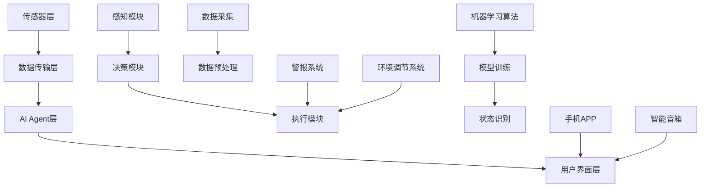

# AI Agent在智能婴儿床中的安全监控

> 关键词：AI Agent、智能婴儿床、安全监控、机器学习、传感器技术

> 摘要：本文围绕AI Agent在智能婴儿床安全监控中的应用展开。首先介绍了该技术应用的背景，包括目的、预期读者、文档结构和相关术语。接着阐述了AI Agent、智能婴儿床安全监控的核心概念及它们之间的联系，并给出了相应的文本示意图和Mermaid流程图。详细讲解了核心算法原理，通过Python代码进行说明，同时给出了相关的数学模型和公式，并举例说明。通过项目实战，展示了开发环境搭建、源代码实现及代码解读。探讨了AI Agent在智能婴儿床安全监控中的实际应用场景，推荐了学习资源、开发工具框架和相关论文著作。最后总结了未来发展趋势与挑战，解答了常见问题，并提供了扩展阅读和参考资料。

## 1. 背景介绍 
### 1.1 目的和范围
随着科技的不断发展，人们对婴儿护理的安全性和智能化要求越来越高。智能婴儿床作为一种新兴的产品，旨在为婴儿提供更加安全、舒适的睡眠环境。AI Agent在智能婴儿床安全监控中的应用，可以实时监测婴儿的状态，及时发现潜在的安全隐患，并采取相应的措施，从而大大提高婴儿的睡眠安全性。

本文的范围主要涵盖AI Agent在智能婴儿床安全监控中的核心概念、算法原理、数学模型、项目实战、实际应用场景以及相关的工具和资源推荐等方面。通过对这些内容的详细介绍，帮助读者全面了解AI Agent在智能婴儿床安全监控中的应用。

### 1.2 预期读者
本文的预期读者包括对人工智能、智能家居、婴儿护理等领域感兴趣的技术爱好者、研究人员、开发人员以及相关产品的制造商和设计者。对于那些希望了解如何利用AI技术提高婴儿床安全性的读者来说，本文将提供有价值的信息和技术指导。

### 1.3 文档结构概述
本文将按照以下结构进行组织：
1. 背景介绍：介绍AI Agent在智能婴儿床安全监控中的目的、预期读者、文档结构和相关术语。
2. 核心概念与联系：阐述AI Agent、智能婴儿床安全监控的核心概念及它们之间的联系，并给出相应的文本示意图和Mermaid流程图。
3. 核心算法原理 & 具体操作步骤：详细讲解核心算法原理，通过Python代码进行说明。
4. 数学模型和公式 & 详细讲解 & 举例说明：给出相关的数学模型和公式，并举例说明。
5. 项目实战：代码实际案例和详细解释说明，包括开发环境搭建、源代码实现及代码解读。
6. 实际应用场景：探讨AI Agent在智能婴儿床安全监控中的实际应用场景。
7. 工具和资源推荐：推荐学习资源、开发工具框架和相关论文著作。
8. 总结：未来发展趋势与挑战：总结AI Agent在智能婴儿床安全监控中的未来发展趋势与挑战。
9. 附录：常见问题与解答：解答常见问题。
10. 扩展阅读 & 参考资料：提供扩展阅读和参考资料。

### 1.4 术语表
#### 1.4.1 核心术语定义
- **AI Agent**：人工智能代理，是一种能够感知环境、做出决策并采取行动的智能实体。在智能婴儿床安全监控中，AI Agent可以根据传感器收集到的数据，对婴儿的状态进行分析和判断，并采取相应的措施。
- **智能婴儿床**：配备了各种传感器和智能设备的婴儿床，能够实时监测婴儿的状态，并通过AI Agent进行数据分析和处理，提供安全监控和护理建议。
- **安全监控**：对婴儿的状态进行实时监测，及时发现潜在的安全隐患，并采取相应的措施，以保障婴儿的安全。

#### 1.4.2 相关概念解释
- **机器学习**：是一门多领域交叉学科，涉及概率论、统计学、逼近论、凸分析、算法复杂度理论等多门学科。它专门研究计算机怎样模拟或实现人类的学习行为，以获取新的知识或技能，重新组织已有的知识结构使之不断改善自身的性能。在智能婴儿床安全监控中，机器学习算法可以用于对传感器数据进行分析和处理，以识别婴儿的状态和行为。
- **传感器技术**：是指利用各种传感器对物理量、化学量、生物量等进行检测和转换的技术。在智能婴儿床安全监控中，传感器可以用于监测婴儿的体温、心率、呼吸、姿势等状态信息。

#### 1.4.3 缩略词列表
- **AI**：Artificial Intelligence，人工智能
- **ML**：Machine Learning，机器学习

## 2. 核心概念与联系 
### 核心概念原理
#### AI Agent
AI Agent是一种能够感知环境、做出决策并采取行动的智能实体。它通常由感知模块、决策模块和执行模块组成。感知模块用于收集环境信息，决策模块根据感知到的信息进行分析和判断，执行模块根据决策结果采取相应的行动。

在智能婴儿床安全监控中，AI Agent的感知模块可以通过各种传感器收集婴儿的状态信息，如体温、心率、呼吸、姿势等。决策模块可以利用机器学习算法对这些信息进行分析和处理，以识别婴儿的状态和行为，并判断是否存在安全隐患。执行模块可以根据决策结果采取相应的措施，如发出警报、调节温度、调整姿势等。

#### 智能婴儿床安全监控
智能婴儿床安全监控是指利用各种传感器和智能设备对婴儿的状态进行实时监测，及时发现潜在的安全隐患，并采取相应的措施，以保障婴儿的安全。它主要包括以下几个方面：
- **状态监测**：通过各种传感器监测婴儿的体温、心率、呼吸、姿势等状态信息。
- **安全预警**：根据监测到的状态信息，判断是否存在安全隐患，并及时发出警报。
- **智能调节**：根据监测到的状态信息，自动调节婴儿床的温度、湿度、光线等环境参数，以提供更加舒适的睡眠环境。

### 架构的文本示意图
```plaintext
智能婴儿床安全监控系统
|
|-- 传感器层
|   |-- 温度传感器
|   |-- 心率传感器
|   |-- 呼吸传感器
|   |-- 姿势传感器
|
|-- 数据传输层
|   |-- Wi-Fi
|   |-- Bluetooth
|
|-- AI Agent层
|   |-- 感知模块
|   |   |-- 数据采集
|   |   |-- 数据预处理
|   |-- 决策模块
|   |   |-- 机器学习算法
|   |   |-- 模型训练
|   |   |-- 状态识别
|   |-- 执行模块
|   |   |-- 警报系统
|   |   |-- 环境调节系统
|
|-- 用户界面层
|   |-- 手机APP
|   |-- 智能音箱
```

### Mermaid流程图


## 3. 核心算法原理 & 具体操作步骤 
### 核心算法原理
在智能婴儿床安全监控中，常用的核心算法包括机器学习算法，如决策树、支持向量机、神经网络等。这里以神经网络为例，介绍其核心算法原理。

神经网络是一种模仿人类神经系统的计算模型，由大量的神经元组成。每个神经元接收输入信号，经过加权求和和非线性变换后，输出一个结果。多个神经元可以组成不同的层次，如输入层、隐藏层和输出层。输入层接收外界的输入信号，隐藏层对输入信号进行处理和变换，输出层输出最终的结果。

在智能婴儿床安全监控中，神经网络可以用于对传感器收集到的数据进行分析和处理，以识别婴儿的状态和行为。具体来说，神经网络的训练过程可以分为以下几个步骤：
1. **数据收集**：通过各种传感器收集婴儿的状态信息，如体温、心率、呼吸、姿势等。
2. **数据预处理**：对收集到的数据进行清洗、归一化等处理，以提高数据的质量和可用性。
3. **模型训练**：使用预处理后的数据对神经网络进行训练，调整神经元的权重和偏置，以使得神经网络的输出结果与实际情况尽可能接近。
4. **模型评估**：使用测试数据对训练好的神经网络进行评估，计算模型的准确率、召回率等指标，以评估模型的性能。
5. **模型应用**：将训练好的神经网络应用到实际的智能婴儿床安全监控中，实时监测婴儿的状态，并根据监测结果采取相应的措施。

### 具体操作步骤及Python代码实现
```python
import numpy as np
import tensorflow as tf
from tensorflow.keras.models import Sequential
from tensorflow.keras.layers import Dense

# 1. 数据收集（这里使用模拟数据）
# 假设我们有4个特征：体温、心率、呼吸、姿势
# 生成一些模拟数据
np.random.seed(42)
X_train = np.random.rand(1000, 4)  # 训练数据
y_train = np.random.randint(0, 2, 1000)  # 训练标签

X_test = np.random.rand(200, 4)  # 测试数据
y_test = np.random.randint(0, 2, 200)  # 测试标签

# 2. 数据预处理
# 归一化处理
X_train = (X_train - np.mean(X_train, axis=0)) / np.std(X_train, axis=0)
X_test = (X_test - np.mean(X_test, axis=0)) / np.std(X_test, axis=0)

# 3. 模型训练
model = Sequential([
    Dense(10, activation='relu', input_shape=(4,)),
    Dense(1, activation='sigmoid')
])

model.compile(optimizer='adam', loss='binary_crossentropy', metrics=['accuracy'])

model.fit(X_train, y_train, epochs=10, batch_size=32, validation_data=(X_test, y_test))

# 4. 模型评估
loss, accuracy = model.evaluate(X_test, y_test)
print(f"Test loss: {loss}, Test accuracy: {accuracy}")

# 5. 模型应用
new_data = np.random.rand(1, 4)
new_data = (new_data - np.mean(X_train, axis=0)) / np.std(X_train, axis=0)
prediction = model.predict(new_data)
print(f"Prediction: {prediction}")
```

在上述代码中，我们首先生成了一些模拟数据，然后对数据进行了归一化处理。接着，我们使用`Sequential`模型构建了一个简单的神经网络，包含一个输入层、一个隐藏层和一个输出层。使用`compile`方法编译模型，指定优化器、损失函数和评估指标。使用`fit`方法对模型进行训练，指定训练数据、训练轮数和批量大小。使用`evaluate`方法对模型进行评估，计算测试数据的损失和准确率。最后，我们使用训练好的模型对新数据进行预测。

## 4. 数学模型和公式 & 详细讲解 & 举例说明 
### 神经网络的数学模型
神经网络的基本单元是神经元，其数学模型可以表示为：

$$
y = f\left(\sum_{i=1}^{n} w_{i}x_{i} + b\right)
$$

其中，$x_{i}$ 是输入信号，$w_{i}$ 是对应的权重，$b$ 是偏置，$f$ 是激活函数，$y$ 是输出信号。

在神经网络中，通常有多个神经元组成不同的层次。假设一个神经网络有 $L$ 层，第 $l$ 层有 $n_{l}$ 个神经元。第 $l$ 层第 $j$ 个神经元的输入可以表示为：

$$
z_{j}^{(l)} = \sum_{i=1}^{n_{l-1}} w_{ji}^{(l)}a_{i}^{(l-1)} + b_{j}^{(l)}
$$

其中，$w_{ji}^{(l)}$ 是第 $l$ 层第 $j$ 个神经元与第 $l-1$ 层第 $i$ 个神经元之间的权重，$a_{i}^{(l-1)}$ 是第 $l-1$ 层第 $i$ 个神经元的输出，$b_{j}^{(l)}$ 是第 $l$ 层第 $j$ 个神经元的偏置。

第 $l$ 层第 $j$ 个神经元的输出可以表示为：

$$
a_{j}^{(l)} = f\left(z_{j}^{(l)}\right)
$$

其中，$f$ 是激活函数。

### 激活函数
常用的激活函数有 sigmoid 函数、ReLU 函数等。

#### sigmoid 函数
sigmoid 函数的数学表达式为：

$$
\sigma(x) = \frac{1}{1 + e^{-x}}
$$

sigmoid 函数的特点是将输入值映射到 $(0, 1)$ 区间内，常用于二分类问题。

#### ReLU 函数
ReLU 函数的数学表达式为：

$$
f(x) = \max(0, x)
$$

ReLU 函数的特点是计算简单，能够有效缓解梯度消失问题，常用于深度学习中。

### 损失函数
在神经网络中，常用的损失函数有均方误差（MSE）、交叉熵损失函数等。

#### 均方误差（MSE）
均方误差的数学表达式为：

$$
MSE = \frac{1}{n}\sum_{i=1}^{n}(y_{i} - \hat{y}_{i})^{2}
$$

其中，$y_{i}$ 是真实值，$\hat{y}_{i}$ 是预测值，$n$ 是样本数量。

#### 交叉熵损失函数
对于二分类问题，交叉熵损失函数的数学表达式为：

$$
L(y, \hat{y}) = - \frac{1}{n}\sum_{i=1}^{n}\left[y_{i}\log(\hat{y}_{i}) + (1 - y_{i})\log(1 - \hat{y}_{i})\right]
$$

其中，$y_{i}$ 是真实标签，$\hat{y}_{i}$ 是预测概率，$n$ 是样本数量。

### 举例说明
假设我们有一个简单的神经网络，包含一个输入层（2 个神经元）、一个隐藏层（3 个神经元）和一个输出层（1 个神经元）。输入数据为 $x = [x_{1}, x_{2}]$，隐藏层的权重矩阵为 $W^{(1)} = \begin{bmatrix} w_{11}^{(1)} & w_{12}^{(1)} \\ w_{21}^{(1)} & w_{22}^{(1)} \\ w_{31}^{(1)} & w_{32}^{(1)} \end{bmatrix}$，偏置向量为 $b^{(1)} = [b_{1}^{(1)}, b_{2}^{(1)}, b_{3}^{(1)}]$，输出层的权重向量为 $w^{(2)} = [w_{11}^{(2)}, w_{12}^{(2)}, w_{13}^{(2)}]$，偏置为 $b^{(2)}$。

隐藏层的输入为：

$$
z^{(1)} = W^{(1)}x + b^{(1)}
$$

隐藏层的输出为：

$$
a^{(1)} = f\left(z^{(1)}\right)
$$

输出层的输入为：

$$
z^{(2)} = w^{(2)}a^{(1)} + b^{(2)}
$$

输出层的输出为：

$$
\hat{y} = f\left(z^{(2)}\right)
$$

假设输入数据 $x = [1, 2]$，$W^{(1)} = \begin{bmatrix} 0.1 & 0.2 \\ 0.3 & 0.4 \\ 0.5 & 0.6 \end{bmatrix}$，$b^{(1)} = [0.1, 0.2, 0.3]$，$w^{(2)} = [0.7, 0.8, 0.9]$，$b^{(2)} = 0.1$，激活函数为 sigmoid 函数。

首先计算隐藏层的输入：

$$
z^{(1)} = \begin{bmatrix} 0.1 & 0.2 \\ 0.3 & 0.4 \\ 0.5 & 0.6 \end{bmatrix}\begin{bmatrix} 1 \\ 2 \end{bmatrix} + \begin{bmatrix} 0.1 \\ 0.2 \\ 0.3 \end{bmatrix} = \begin{bmatrix} 0.1\times1 + 0.2\times2 + 0.1 \\ 0.3\times1 + 0.4\times2 + 0.2 \\ 0.5\times1 + 0.6\times2 + 0.3 \end{bmatrix} = \begin{bmatrix} 0.6 \\ 1.3 \\ 2 \end{bmatrix}
$$

然后计算隐藏层的输出：

$$
a^{(1)} = \begin{bmatrix} \frac{1}{1 + e^{-0.6}} \\ \frac{1}{1 + e^{-1.3}} \\ \frac{1}{1 + e^{-2}} \end{bmatrix} \approx \begin{bmatrix} 0.6457 \\ 0.7858 \\ 0.8808 \end{bmatrix}
$$

接着计算输出层的输入：

$$
z^{(2)} = [0.7, 0.8, 0.9]\begin{bmatrix} 0.6457 \\ 0.7858 \\ 0.8808 \end{bmatrix} + 0.1 = 0.7\times0.6457 + 0.8\times0.7858 + 0.9\times0.8808 + 0.1 \approx 2.07
$$

最后计算输出层的输出：

$$
\hat{y} = \frac{1}{1 + e^{-2.07}} \approx 0.89
$$

## 5. 项目实战：代码实际案例和详细解释说明 
### 5.1  开发环境搭建
#### 硬件环境
- **智能婴儿床**：配备温度传感器、心率传感器、呼吸传感器、姿势传感器等。
- **开发板**：如 Raspberry Pi，用于数据采集和处理。
- **Wi-Fi 模块**：用于数据传输。

#### 软件环境
- **操作系统**：Raspbian（基于 Debian 的 Raspberry Pi 操作系统）
- **编程语言**：Python 3.x
- **深度学习框架**：TensorFlow、Keras
- **开发工具**：Visual Studio Code

### 5.2  源代码详细实现和代码解读
```python
import time
import numpy as np
import tensorflow as tf
from tensorflow.keras.models import load_model
import RPi.GPIO as GPIO  # 用于控制 Raspberry Pi 的 GPIO 引脚

# 初始化 GPIO
GPIO.setmode(GPIO.BCM)
ALARM_PIN = 18
GPIO.setup(ALARM_PIN, GPIO.OUT)

# 加载训练好的模型
model = load_model('baby_monitor_model.h5')

# 模拟传感器数据采集
def collect_sensor_data():
    # 这里模拟传感器数据采集
    temperature = np.random.uniform(36, 38)
    heart_rate = np.random.randint(80, 120)
    respiration_rate = np.random.randint(20, 40)
    posture = np.random.randint(0, 2)  # 0: 平躺，1: 侧躺
    return [temperature, heart_rate, respiration_rate, posture]

# 数据预处理
def preprocess_data(data):
    # 这里假设数据的均值和标准差已经在训练时计算好
    mean = np.array([37, 100, 30, 0.5])
    std = np.array([1, 20, 10, 0.5])
    data = (np.array(data) - mean) / std
    return data.reshape(1, -1)

# 警报函数
def trigger_alarm():
    GPIO.output(ALARM_PIN, GPIO.HIGH)
    print("Alarm triggered!")
    time.sleep(5)  # 警报持续 5 秒
    GPIO.output(ALARM_PIN, GPIO.LOW)

# 主循环
while True:
    # 采集传感器数据
    sensor_data = collect_sensor_data()
    print(f"Sensor data: {sensor_data}")
    
    # 数据预处理
    processed_data = preprocess_data(sensor_data)
    
    # 模型预测
    prediction = model.predict(processed_data)
    print(f"Prediction: {prediction}")
    
    # 判断是否触发警报
    if prediction[0][0] > 0.5:
        trigger_alarm()
    
    time.sleep(1)  # 每秒采集一次数据
```

### 5.3  代码解读与分析
1. **导入必要的库**：导入了时间、NumPy、TensorFlow、RPi.GPIO 等库，用于时间处理、数值计算、深度学习模型加载和 Raspberry Pi 的 GPIO 控制。
2. **初始化 GPIO**：设置 Raspberry Pi 的 GPIO 引脚模式，并将警报引脚设置为输出模式。
3. **加载训练好的模型**：使用 `load_model` 函数加载之前训练好的深度学习模型。
4. **模拟传感器数据采集**：`collect_sensor_data` 函数模拟了传感器数据的采集过程，返回一个包含温度、心率、呼吸频率和姿势的列表。
5. **数据预处理**：`preprocess_data` 函数对采集到的数据进行归一化处理，使其与训练数据具有相同的分布。
6. **警报函数**：`trigger_alarm` 函数用于触发警报，将警报引脚设置为高电平，并持续 5 秒。
7. **主循环**：在主循环中，不断采集传感器数据，对数据进行预处理，使用模型进行预测，并根据预测结果判断是否触发警报。每次循环间隔 1 秒。

## 6. 实际应用场景 
### 实时状态监测
AI Agent 可以实时监测婴儿的体温、心率、呼吸、姿势等状态信息，并将这些信息通过手机 APP 或智能音箱反馈给家长。家长可以随时了解婴儿的状态，及时发现潜在的健康问题。

### 安全预警
当 AI Agent 监测到婴儿的状态出现异常时，如体温过高、心率过快、呼吸急促等，会及时发出警报，提醒家长采取相应的措施。此外，当婴儿的姿势不当，如趴着睡时，AI Agent 也会发出警报，避免婴儿窒息。

### 智能调节
AI Agent 可以根据监测到的婴儿状态信息，自动调节婴儿床的温度、湿度、光线等环境参数，以提供更加舒适的睡眠环境。例如，当婴儿体温过高时，AI Agent 可以自动调节空调温度；当婴儿入睡后，AI Agent 可以自动调暗灯光。

### 睡眠分析
AI Agent 可以对婴儿的睡眠数据进行分析，了解婴儿的睡眠习惯和质量，为家长提供个性化的睡眠建议。例如，根据婴儿的睡眠时长、睡眠周期等信息，建议家长调整婴儿的作息时间。

## 7. 工具和资源推荐
### 7.1 学习资源推荐
#### 7.1.1 书籍推荐
- 《Python 深度学习》：由 Francois Chollet 所著，是一本深入浅出的深度学习入门书籍，详细介绍了使用 Python 和 Keras 进行深度学习的方法和技巧。
- 《机器学习》：由周志华所著，是国内机器学习领域的经典教材，全面介绍了机器学习的基本概念、算法和应用。
- 《人工智能：一种现代的方法》：由 Stuart Russell 和 Peter Norvig 所著，是人工智能领域的权威教材，涵盖了人工智能的各个方面，包括搜索、知识表示、推理、机器学习、自然语言处理等。

#### 7.1.2 在线课程
- Coursera 上的《机器学习》课程：由 Andrew Ng 教授主讲，是一门非常经典的机器学习入门课程，适合初学者学习。
- edX 上的《深度学习》课程：由 MIT 开设，深入介绍了深度学习的原理和应用，适合有一定机器学习基础的学习者。
- 中国大学 MOOC 上的《人工智能基础》课程：由多所高校联合开设，系统介绍了人工智能的基本概念、算法和应用，适合国内学习者。

#### 7.1.3 技术博客和网站
- Medium：是一个汇聚了众多技术专家和爱好者的博客平台，上面有很多关于人工智能、机器学习的优秀文章。
- Towards Data Science：是一个专注于数据科学和机器学习的博客网站，提供了大量的技术文章和案例分析。
- GitHub：是一个开源代码托管平台，上面有很多优秀的人工智能和机器学习项目，可以学习和参考。

### 7.2 开发工具框架推荐
#### 7.2.1 IDE和编辑器
- Visual Studio Code：是一款轻量级的代码编辑器，支持多种编程语言和插件，具有丰富的功能和良好的用户体验。
- PyCharm：是一款专门为 Python 开发设计的集成开发环境，提供了代码编辑、调试、版本控制等功能，适合 Python 开发者使用。
- Jupyter Notebook：是一个交互式的开发环境，支持 Python、R 等多种编程语言，适合数据科学和机器学习的实验和开发。

#### 7.2.2 调试和性能分析工具
- TensorBoard：是 TensorFlow 提供的一个可视化工具，可以用于查看模型的训练过程、损失曲线、准确率等信息，帮助开发者调试和优化模型。
- Py-Spy：是一个轻量级的 Python 性能分析工具，可以实时监测 Python 程序的 CPU 使用率和函数调用情况，帮助开发者找出性能瓶颈。
- cProfile：是 Python 标准库中的一个性能分析工具，可以统计 Python 程序中各个函数的执行时间和调用次数，帮助开发者优化代码性能。

#### 7.2.3 相关框架和库
- TensorFlow：是一个开源的深度学习框架，由 Google 开发，提供了丰富的工具和接口，支持多种深度学习模型的开发和训练。
- Keras：是一个高级神经网络 API，基于 TensorFlow、Theano 等后端，简单易用，适合初学者快速上手。
- Scikit-learn：是一个开源的机器学习库，提供了丰富的机器学习算法和工具，如分类、回归、聚类、降维等，适合机器学习的入门和实践。

### 7.3 相关论文著作推荐
#### 7.3.1 经典论文
- 《Gradient-Based Learning Applied to Document Recognition》：由 Yann LeCun 等人发表，介绍了卷积神经网络（CNN）在手写字符识别中的应用，是 CNN 领域的经典论文。
- 《ImageNet Classification with Deep Convolutional Neural Networks》：由 Alex Krizhevsky 等人发表，介绍了 AlexNet 模型在 ImageNet 图像分类竞赛中的优异表现，开启了深度学习在计算机视觉领域的热潮。
- 《Long Short-Term Memory》：由 Sepp Hochreiter 和 Jürgen Schmidhuber 发表，介绍了长短期记忆网络（LSTM）的原理和应用，是循环神经网络（RNN）领域的经典论文。

#### 7.3.2 最新研究成果
- 《Attention Is All You Need》：介绍了 Transformer 模型，提出了注意力机制，在自然语言处理领域取得了巨大的成功。
- 《Generative Adversarial Networks》：由 Ian Goodfellow 等人发表，介绍了生成对抗网络（GAN）的原理和应用，在图像生成、数据增强等领域有广泛的应用。
- 《Self-Supervised Learning: A Survey》：对自监督学习进行了全面的综述，介绍了自监督学习的最新研究成果和应用场景。

#### 7.3.3 应用案例分析
- 《AI in Healthcare: Current Applications and Future Challenges》：分析了人工智能在医疗保健领域的应用现状和未来挑战，包括疾病诊断、医学影像分析、药物研发等方面。
- 《Smart Home Systems: A Survey》：对智能家居系统进行了全面的综述，介绍了智能家居系统的架构、技术和应用案例。
- 《AI in Baby Care: Applications and Opportunities》：探讨了人工智能在婴儿护理领域的应用和机遇，包括智能婴儿床、婴儿健康监测等方面。

## 8. 总结：未来发展趋势与挑战
### 未来发展趋势
- **多模态融合**：未来的智能婴儿床安全监控系统将融合多种传感器数据，如视觉、听觉、触觉等，实现更加全面、准确的婴儿状态监测。
- **个性化服务**：根据婴儿的个体差异和成长阶段，提供个性化的护理建议和服务，如个性化的睡眠方案、营养建议等。
- **与智能家居的集成**：智能婴儿床将与智能家居系统进行深度集成，实现更加智能化的家居控制和管理。例如，当婴儿醒来时，自动调节灯光、音乐等环境参数。
- **云服务和大数据分析**：利用云服务和大数据分析技术，对大量的婴儿数据进行存储、分析和挖掘，为婴儿的健康成长提供更加科学的依据。

### 挑战
- **数据隐私和安全**：智能婴儿床安全监控系统需要收集大量的婴儿个人信息，如健康数据、行为数据等。如何保障这些数据的隐私和安全，防止数据泄露和滥用，是一个亟待解决的问题。
- **算法的准确性和可靠性**：AI Agent 的决策和判断依赖于机器学习算法，算法的准确性和可靠性直接影响到婴儿的安全。如何提高算法的准确性和可靠性，减少误判和漏判，是一个挑战。
- **成本和普及性**：目前，智能婴儿床的成本较高，限制了其普及和应用。如何降低成本，提高产品的性价比，使更多的家庭能够受益于智能婴儿床安全监控技术，是一个需要解决的问题。
- **伦理和法律问题**：AI Agent 在智能婴儿床安全监控中的应用涉及到一些伦理和法律问题，如责任界定、道德判断等。如何制定相应的伦理和法律规范，确保 AI Agent 的合理应用，是一个需要关注的问题。

## 9. 附录：常见问题与解答
### 1. AI Agent 在智能婴儿床安全监控中的准确性如何保证？
答：为了保证 AI Agent 的准确性，需要采取以下措施：
- **数据质量**：收集高质量的传感器数据，对数据进行清洗和预处理，去除噪声和异常值。
- **模型训练**：使用大量的训练数据对机器学习模型进行训练，调整模型的参数，提高模型的准确性。
- **模型评估**：使用测试数据对训练好的模型进行评估，计算模型的准确率、召回率等指标，评估模型的性能。
- **模型优化**：根据模型评估的结果，对模型进行优化和改进，如调整模型的结构、增加训练数据等。

### 2. 智能婴儿床安全监控系统的传感器数据会泄露吗？
答：为了保障传感器数据的安全，需要采取以下措施：
- **数据加密**：对传感器数据进行加密处理，防止数据在传输和存储过程中被窃取。
- **访问控制**：设置严格的访问权限，只有授权的人员才能访问传感器数据。
- **安全审计**：对数据访问和操作进行审计，及时发现和处理异常行为。
- **合规性**：遵守相关的法律法规和行业标准，确保数据的安全和隐私。

### 3. 智能婴儿床安全监控系统的成本高吗？
答：目前，智能婴儿床安全监控系统的成本相对较高，主要原因包括传感器、开发板、通信模块等硬件成本，以及机器学习模型训练和算法开发的软件成本。随着技术的不断发展和普及，成本有望逐渐降低。同时，一些厂商也在推出性价比更高的产品，以满足不同消费者的需求。

### 4. AI Agent 在智能婴儿床安全监控中可以替代家长的照顾吗？
答：AI Agent 在智能婴儿床安全监控中可以提供实时监测和预警功能，帮助家长及时发现潜在的安全隐患，但不能完全替代家长的照顾。婴儿的成长和发展需要家长的关爱和陪伴，家长应该密切关注婴儿的状态，及时响应婴儿的需求。AI Agent 只是一种辅助工具，为家长提供更加便捷和高效的婴儿护理服务。

## 10. 扩展阅读 & 参考资料
### 扩展阅读
- 《人工智能简史》：全面介绍了人工智能的发展历程、主要技术和应用领域，帮助读者了解人工智能的全貌。
- 《数据科学实战》：通过实际案例介绍了数据科学的整个流程，包括数据采集、数据预处理、数据分析、模型构建和评估等，适合数据科学爱好者学习。
- 《智能家居：从概念到实践》：详细介绍了智能家居的技术架构、系统设计和应用案例，为智能家居的开发和应用提供了参考。

### 参考资料
- [TensorFlow 官方文档](https://www.tensorflow.org/)
- [Keras 官方文档](https://keras.io/)
- [Scikit-learn 官方文档](https://scikit-learn.org/)
- [Raspberry Pi 官方文档](https://www.raspberrypi.org/documentation/)

作者：AI天才研究院/AI Genius Institute & 禅与计算机程序设计艺术 /Zen And The Art of Computer Programming