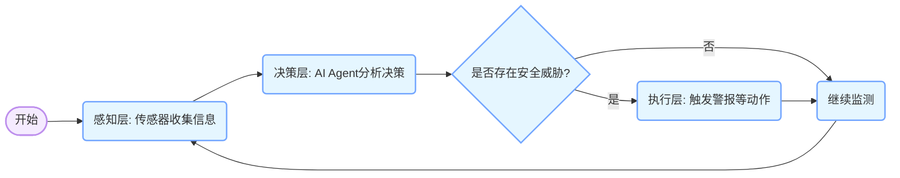

# AI Agent在智能安防系统中的角色

> 关键词：AI Agent、智能安防系统、角色定位、算法原理、实际应用

> 摘要：本文深入探讨了AI Agent在智能安防系统中的角色。首先介绍了相关背景，包括目的范围、预期读者等内容。接着阐述了AI Agent与智能安防系统的核心概念及联系，详细讲解了核心算法原理和具体操作步骤，并给出了相应的Python代码示例。同时，介绍了相关的数学模型和公式，通过项目实战展示了代码的实际应用和详细解释。还探讨了AI Agent在智能安防系统中的实际应用场景，推荐了学习资源、开发工具框架以及相关论文著作。最后总结了未来发展趋势与挑战，解答了常见问题并提供了扩展阅读和参考资料，全面剖析了AI Agent在智能安防系统中所扮演的重要角色。

## 1. 背景介绍 
### 1.1 目的和范围
随着科技的不断发展，智能安防系统在保障人们生命财产安全方面发挥着越来越重要的作用。AI Agent作为一种具备自主决策和执行能力的智能实体，被广泛应用于智能安防系统中。本文的目的在于深入分析AI Agent在智能安防系统中的具体角色，探讨其工作原理、应用场景以及未来发展趋势。范围涵盖了AI Agent的基本概念、相关算法、数学模型，以及在智能安防系统中的实际应用案例等方面。

### 1.2 预期读者
本文预期读者包括从事智能安防系统开发、研究的专业人员，对人工智能技术在安防领域应用感兴趣的技术爱好者，以及相关领域的科研人员和学生。通过阅读本文，读者能够全面了解AI Agent在智能安防系统中的角色和作用，为进一步的研究和实践提供参考。

### 1.3 文档结构概述
本文将按照以下结构进行阐述：首先介绍相关背景知识，包括目的、预期读者和文档结构概述等；接着讲解AI Agent与智能安防系统的核心概念及联系，通过文本示意图和Mermaid流程图进行展示；然后详细介绍核心算法原理和具体操作步骤，并给出Python代码示例；再介绍相关的数学模型和公式，并举例说明；之后通过项目实战展示代码的实际应用和详细解释；接着探讨AI Agent在智能安防系统中的实际应用场景；随后推荐学习资源、开发工具框架以及相关论文著作；最后总结未来发展趋势与挑战，解答常见问题并提供扩展阅读和参考资料。

### 1.4 术语表
#### 1.4.1 核心术语定义
- **AI Agent**：人工智能代理，是一种能够感知环境、进行决策并采取行动以实现特定目标的智能实体。它可以基于预设的规则或通过学习算法不断优化自身的行为。
- **智能安防系统**：利用先进的信息技术，如人工智能、物联网、大数据等，对安全防范相关的各种信息进行采集、传输、处理和分析，实现实时监控、预警、报警等功能的综合性系统。
- **目标检测**：在图像或视频中识别出特定目标的位置和类别，是智能安防系统中常用的技术之一。
- **行为分析**：对目标的行为模式进行分析和理解，例如判断人员的行走方向、是否有异常行为等。

#### 1.4.2 相关概念解释
- **感知能力**：AI Agent通过各种传感器（如摄像头、雷达等）获取环境信息的能力。
- **决策能力**：根据感知到的信息，AI Agent运用预设的规则或学习算法进行推理和判断，做出相应决策的能力。
- **执行能力**：AI Agent根据决策结果采取实际行动的能力，例如控制监控设备的转动、触发报警装置等。

#### 1.4.3 缩略词列表
- **CNN**：Convolutional Neural Network，卷积神经网络，常用于图像和视频处理中的特征提取。
- **RNN**：Recurrent Neural Network，循环神经网络，适用于处理序列数据，如视频帧序列。
- **YOLO**：You Only Look Once，一种实时目标检测算法。

## 2. 核心概念与联系 
### 核心概念原理
AI Agent在智能安防系统中扮演着核心决策和执行的角色。其原理基于感知 - 决策 - 执行的循环过程。首先，AI Agent通过各种传感器（如摄像头、门禁系统等）感知智能安防系统所覆盖的环境信息，包括人员的进出、物体的移动等。然后，它对这些感知到的信息进行分析和处理，运用预设的规则或机器学习算法进行决策，判断是否存在安全威胁。最后，根据决策结果，AI Agent执行相应的动作，如触发警报、控制门禁开关、调整监控摄像头的角度等。

### 架构的文本示意图
智能安防系统的整体架构可以分为三层：感知层、决策层和执行层。感知层由各种传感器组成，负责收集环境信息；决策层由AI Agent构成，对感知层传来的信息进行分析和决策；执行层则包括各种执行设备，如警报器、门禁系统等，根据决策层的指令执行相应的动作。

### Mermaid流程图


## 3. 核心算法原理 & 具体操作步骤 
### 目标检测算法原理
在智能安防系统中，目标检测是AI Agent的重要任务之一。常用的目标检测算法如YOLO（You Only Look Once）。YOLO算法的核心思想是将输入的图像划分为多个网格，每个网格负责预测目标的边界框和类别。具体步骤如下：
1. **图像划分**：将输入图像划分为 $S\times S$ 个网格。
2. **预测边界框和类别**：每个网格预测 $B$ 个边界框，每个边界框包含位置信息（中心坐标、宽、高）和置信度。同时，每个网格还预测类别概率。
3. **非极大值抑制**：去除重叠度较高的边界框，只保留置信度最高的边界框。

### Python代码实现
```python
import cv2
import torch
from torchvision.models.detection import yolov5s
from torchvision.transforms import functional as F

# 加载预训练的YOLOv5模型
model = yolov5s(pretrained=True)
model.eval()

# 读取图像
image = cv2.imread('security_image.jpg')
image = cv2.cvtColor(image, cv2.COLOR_BGR2RGB)
image = F.to_tensor(image).unsqueeze(0)

# 进行目标检测
with torch.no_grad():
    predictions = model(image)

# 解析预测结果
boxes = predictions[0]['boxes'].cpu().numpy()
labels = predictions[0]['labels'].cpu().numpy()
scores = predictions[0]['scores'].cpu().numpy()

# 过滤置信度较低的预测结果
threshold = 0.5
filtered_indices = scores > threshold
filtered_boxes = boxes[filtered_indices]
filtered_labels = labels[filtered_indices]

# 绘制检测结果
for box, label in zip(filtered_boxes, filtered_labels):
    x1, y1, x2, y2 = box.astype(int)
    cv2.rectangle(image, (x1, y1), (x2, y2), (0, 255, 0), 2)
    cv2.putText(image, str(label), (x1, y1 - 10), cv2.FONT_HERSHEY_SIMPLEX, 0.9, (0, 255, 0), 2)

# 显示结果
cv2.imshow('Object Detection', cv2.cvtColor(image.squeeze().permute(1, 2, 0).numpy(), cv2.COLOR_RGB2BGR))
cv2.waitKey(0)
cv2.destroyAllWindows()
```
### 具体操作步骤
1. **加载模型**：使用`torchvision`库加载预训练的YOLOv5模型。
2. **读取图像**：使用`cv2.imread`函数读取待检测的图像，并进行颜色空间转换和张量转换。
3. **进行目标检测**：将图像输入到模型中，得到预测结果。
4. **解析预测结果**：从预测结果中提取边界框、标签和置信度。
5. **过滤低置信度结果**：设置置信度阈值，过滤掉置信度低于阈值的预测结果。
6. **绘制检测结果**：使用`cv2.rectangle`和`cv2.putText`函数在图像上绘制检测结果。
7. **显示结果**：使用`cv2.imshow`函数显示检测结果。

## 4. 数学模型和公式 & 详细讲解 & 举例说明 
### 目标检测中的损失函数
在目标检测算法中，常用的损失函数是多部分组成的，以YOLO算法为例，其损失函数主要包括边界框损失、置信度损失和类别损失。

#### 边界框损失
边界框损失用于衡量预测边界框与真实边界框之间的差异。常用的边界框损失函数是均方误差（Mean Squared Error，MSE）。假设预测边界框的中心坐标为 $(x_{pred}, y_{pred})$，宽和高为 $(w_{pred}, h_{pred})$，真实边界框的中心坐标为 $(x_{true}, y_{true})$，宽和高为 $(w_{true}, h_{true})$，则边界框损失 $L_{box}$ 可以表示为：
$$L_{box} = \lambda_{coord} \sum_{i=0}^{S^2} \sum_{j=0}^{B} \mathbb{1}_{ij}^{obj} \left[ (x_{pred} - x_{true})^2 + (y_{pred} - y_{true})^2 + (\sqrt{w_{pred}} - \sqrt{w_{true}})^2 + (\sqrt{h_{pred}} - \sqrt{h_{true}})^2 \right]$$
其中，$\lambda_{coord}$ 是边界框损失的权重，$\mathbb{1}_{ij}^{obj}$ 表示第 $i$ 个网格的第 $j$ 个边界框是否负责检测目标。

#### 置信度损失
置信度损失用于衡量预测边界框的置信度与真实情况之间的差异。置信度表示边界框内是否存在目标的概率。置信度损失 $L_{conf}$ 可以表示为：
$$L_{conf} = \lambda_{noobj} \sum_{i=0}^{S^2} \sum_{j=0}^{B} \mathbb{1}_{ij}^{noobj} (C_{pred} - C_{true})^2 + \lambda_{obj} \sum_{i=0}^{S^2} \sum_{j=0}^{B} \mathbb{1}_{ij}^{obj} (C_{pred} - C_{true})^2$$
其中，$\lambda_{noobj}$ 和 $\lambda_{obj}$ 分别是无目标和有目标情况下置信度损失的权重，$C_{pred}$ 和 $C_{true}$ 分别是预测置信度和真实置信度。

#### 类别损失
类别损失用于衡量预测类别与真实类别的差异。常用的类别损失函数是交叉熵损失（Cross Entropy Loss）。假设预测类别概率为 $P_{pred}$，真实类别概率为 $P_{true}$，则类别损失 $L_{class}$ 可以表示为：
$$L_{class} = \sum_{i=0}^{S^2} \mathbb{1}_{i}^{obj} \sum_{c \in classes} P_{true}(c) \log(P_{pred}(c))$$

#### 总损失
总损失 $L$ 是边界框损失、置信度损失和类别损失的总和：
$$L = L_{box} + L_{conf} + L_{class}$$

### 举例说明
假设我们有一个 $7\times7$ 的网格（$S = 7$），每个网格预测 2 个边界框（$B = 2$）。对于某个网格的一个边界框，预测的中心坐标为 $(0.2, 0.3)$，宽和高为 $(0.4, 0.5)$，真实的中心坐标为 $(0.22, 0.31)$，宽和高为 $(0.42, 0.52)$。预测置信度为 0.8，真实置信度为 0.9。预测类别为“人”的概率为 0.7，真实类别为“人”。假设 $\lambda_{coord} = 5$，$\lambda_{noobj} = 0.5$，$\lambda_{obj} = 1$。

首先计算边界框损失：
$$
\begin{align*}
L_{box} &= 5\times\left[ (0.2 - 0.22)^2 + (0.3 - 0.31)^2 + (\sqrt{0.4} - \sqrt{0.42})^2 + (\sqrt{0.5} - \sqrt{0.52})^2 \right]\\
&= 5\times\left[ (-0.02)^2 + (-0.01)^2 + (0.632 - 0.648)^2 + (0.707 - 0.721)^2 \right]\\
&= 5\times\left[ 0.0004 + 0.0001 + (-0.016)^2 + (-0.014)^2 \right]\\
&= 5\times\left[ 0.0004 + 0.0001 + 0.000256 + 0.000196 \right]\\
&= 5\times0.000952\\
&= 0.00476
\end{align*}
$$

然后计算置信度损失：
$$L_{conf} = 1\times(0.8 - 0.9)^2 = 0.01$$

最后计算类别损失：
$$L_{class} = - \log(0.7) \approx 0.357$$

总损失为：
$$L = 0.00476 + 0.01 + 0.357 = 0.37176$$

## 5. 项目实战：代码实际案例和详细解释说明 
### 5.1  开发环境搭建
#### 操作系统
推荐使用Ubuntu 20.04或Windows 10操作系统。

#### 编程语言和库
- **Python**：版本3.7及以上。
- **PyTorch**：深度学习框架，用于模型训练和推理。可以使用以下命令安装：
```sh
pip install torch torchvision
```
- **OpenCV**：计算机视觉库，用于图像和视频处理。可以使用以下命令安装：
```sh
pip install opencv-python
```

#### 硬件要求
- **CPU**：Intel Core i5及以上。
- **GPU**：NVIDIA GPU（可选，但推荐），用于加速模型推理。需要安装相应的CUDA和cuDNN。

### 5.2  源代码详细实现和代码解读
```python
import cv2
import torch
from torchvision.models.detection import yolov5s
from torchvision.transforms import functional as F

# 加载预训练的YOLOv5模型
model = yolov5s(pretrained=True)
model.eval()

# 打开摄像头
cap = cv2.VideoCapture(0)

while True:
    # 读取一帧图像
    ret, frame = cap.read()
    if not ret:
        break
    
    # 转换图像格式
    frame = cv2.cvtColor(frame, cv2.COLOR_BGR2RGB)
    frame_tensor = F.to_tensor(frame).unsqueeze(0)
    
    # 进行目标检测
    with torch.no_grad():
        predictions = model(frame_tensor)
    
    # 解析预测结果
    boxes = predictions[0]['boxes'].cpu().numpy()
    labels = predictions[0]['labels'].cpu().numpy()
    scores = predictions[0]['scores'].cpu().numpy()
    
    # 过滤置信度较低的预测结果
    threshold = 0.5
    filtered_indices = scores > threshold
    filtered_boxes = boxes[filtered_indices]
    filtered_labels = labels[filtered_indices]
    
    # 绘制检测结果
    for box, label in zip(filtered_boxes, filtered_labels):
        x1, y1, x2, y2 = box.astype(int)
        cv2.rectangle(frame, (x1, y1), (x2, y2), (0, 255, 0), 2)
        cv2.putText(frame, str(label), (x1, y1 - 10), cv2.FONT_HERSHEY_SIMPLEX, 0.9, (0, 255, 0), 2)
    
    # 显示结果
    frame = cv2.cvtColor(frame, cv2.COLOR_RGB2BGR)
    cv2.imshow('Object Detection', frame)
    
    # 按 'q' 键退出循环
    if cv2.waitKey(1) & 0xFF == ord('q'):
        break

# 释放摄像头并关闭窗口
cap.release()
cv2.destroyAllWindows()
```
### 代码解读与分析
1. **加载模型**：使用`torchvision.models.detection.yolov5s`加载预训练的YOLOv5模型，并将其设置为评估模式。
2. **打开摄像头**：使用`cv2.VideoCapture(0)`打开默认摄像头。
3. **循环读取图像**：在循环中不断读取摄像头的每一帧图像。
4. **图像预处理**：将读取的图像从BGR颜色空间转换为RGB颜色空间，并将其转换为张量。
5. **目标检测**：将预处理后的图像输入到模型中，得到预测结果。
6. **解析预测结果**：从预测结果中提取边界框、标签和置信度。
7. **过滤低置信度结果**：设置置信度阈值，过滤掉置信度低于阈值的预测结果。
8. **绘制检测结果**：使用`cv2.rectangle`和`cv2.putText`函数在图像上绘制检测结果。
9. **显示结果**：将处理后的图像从RGB颜色空间转换回BGR颜色空间，并使用`cv2.imshow`函数显示结果。
10. **退出循环**：按 'q' 键退出循环。
11. **释放资源**：释放摄像头并关闭所有窗口。

## 6. 实际应用场景 
### 人员出入管理
AI Agent可以通过人脸识别技术对进入和离开特定区域的人员进行身份验证和记录。当有未经授权的人员试图进入时，AI Agent可以立即触发警报，并通知安保人员。例如，在企业办公楼的门禁系统中，AI Agent可以实时识别员工的面部特征，判断其是否有权限进入，并自动开门或拒绝进入。

### 异常行为检测
AI Agent可以对人员的行为进行分析和监测，识别出异常行为，如奔跑、打架、徘徊等。一旦检测到异常行为，AI Agent可以及时发出警报，并将相关视频片段保存下来，以便后续查看和分析。例如，在商场、学校等公共场所，AI Agent可以通过监控摄像头实时监测人员的行为，及时发现并处理异常情况。

### 物品监控
AI Agent可以对特定区域内的物品进行监控，检测物品的移动、丢失或损坏情况。当物品发生异常时，AI Agent可以及时通知相关人员。例如，在仓库中，AI Agent可以通过摄像头监测货物的存储情况，一旦发现货物被盗或损坏，立即发出警报。

### 火灾和烟雾检测
AI Agent可以通过图像识别技术检测火灾和烟雾的迹象。当检测到火灾或烟雾时，AI Agent可以迅速触发火灾警报系统，并通知消防部门。例如，在工厂、酒店等场所，AI Agent可以实时监测环境中的图像，及时发现火灾隐患。

## 7. 工具和资源推荐
### 7.1 学习资源推荐
#### 7.1.1 书籍推荐
- 《深度学习》（Deep Learning）：Ian Goodfellow、Yoshua Bengio和Aaron Courville著，是深度学习领域的经典教材，涵盖了深度学习的基本概念、算法和应用。
- 《计算机视觉：算法与应用》（Computer Vision: Algorithms and Applications）：Richard Szeliski著，详细介绍了计算机视觉的各种算法和应用，包括目标检测、图像分割等。
- 《人工智能：一种现代的方法》（Artificial Intelligence: A Modern Approach）：Stuart Russell和Peter Norvig著，全面介绍了人工智能的各个领域，包括搜索算法、机器学习、自然语言处理等。

#### 7.1.2 在线课程
- Coursera上的“深度学习专项课程”（Deep Learning Specialization）：由Andrew Ng教授讲授，包括神经网络和深度学习、改善深层神经网络、结构化机器学习项目等课程。
- edX上的“计算机视觉基础”（Foundations of Computer Vision）：由UC Berkeley的教授讲授，介绍了计算机视觉的基本概念和算法。
- Kaggle上的“计算机视觉微课程”（Computer Vision Micro-Course）：提供了实践项目和案例，帮助学习者快速掌握计算机视觉技术。

#### 7.1.3 技术博客和网站
- Medium：有许多人工智能和计算机视觉领域的技术博客，如Towards Data Science、Machine Learning Mastery等。
- arXiv：是一个预印本服务器，提供了最新的学术研究论文，包括人工智能、计算机视觉等领域。
- OpenAI博客：发布了OpenAI的最新研究成果和技术文章。

### 7.2 开发工具框架推荐
#### 7.2.1 IDE和编辑器
- PyCharm：是一款专门为Python开发设计的集成开发环境，提供了代码编辑、调试、版本控制等功能。
- Jupyter Notebook：是一个交互式笔记本，适合进行数据探索、模型训练和可视化。
- Visual Studio Code：是一款轻量级的代码编辑器，支持多种编程语言和插件，可用于Python开发。

#### 7.2.2 调试和性能分析工具
- PyTorch Profiler：是PyTorch自带的性能分析工具，可以帮助开发者分析模型的性能瓶颈。
- TensorBoard：是TensorFlow的可视化工具，也可以与PyTorch结合使用，用于可视化模型训练过程和结果。
- cProfile：是Python标准库中的性能分析工具，可以分析Python代码的运行时间和调用次数。

#### 7.2.3 相关框架和库
- PyTorch：是一个开源的深度学习框架，提供了丰富的神经网络模块和工具，支持GPU加速。
- TensorFlow：是另一个流行的深度学习框架，具有强大的分布式训练和部署能力。
- OpenCV：是一个计算机视觉库，提供了各种图像处理和计算机视觉算法，如目标检测、图像分割等。

### 7.3 相关论文著作推荐
#### 7.3.1 经典论文
- “You Only Look Once: Unified, Real-Time Object Detection”：介绍了YOLO目标检测算法，是目标检测领域的经典论文。
- “Faster R-CNN: Towards Real-Time Object Detection with Region Proposal Networks”：提出了Faster R-CNN目标检测算法，显著提高了目标检测的速度和精度。
- “ImageNet Classification with Deep Convolutional Neural Networks”：介绍了AlexNet卷积神经网络，开启了深度学习在计算机视觉领域的热潮。

#### 7.3.2 最新研究成果
- 可以通过arXiv、IEEE Xplore等学术数据库搜索最新的人工智能和计算机视觉研究论文，关注目标检测、行为分析等领域的最新进展。

#### 7.3.3 应用案例分析
- 可以参考一些实际的智能安防系统应用案例，如海康威视、大华等公司的解决方案和技术文档，了解AI Agent在实际项目中的应用和实现方法。

## 8. 总结：未来发展趋势与挑战
### 未来发展趋势
- **多模态融合**：未来的智能安防系统将融合多种传感器数据，如视觉、听觉、嗅觉等，提高对环境的感知能力和对安全威胁的判断准确性。AI Agent将能够综合处理不同模态的数据，做出更智能的决策。
- **边缘计算**：随着边缘计算技术的发展，AI Agent将更多地部署在边缘设备上，实现实时处理和决策，减少数据传输延迟和对云端的依赖。这将提高智能安防系统的响应速度和可靠性。
- **智能决策和自动化**：AI Agent将具备更强大的智能决策能力，能够根据不同的场景和情况自动调整安防策略。例如，在不同时间段、不同人流量下，自动调整监控摄像头的参数和报警阈值。
- **与物联网的深度融合**：智能安防系统将与物联网技术深度融合，实现设备之间的互联互通和协同工作。AI Agent可以通过物联网控制各种设备，如门锁、灯光、窗帘等，实现更全面的安全防范。

### 挑战
- **数据隐私和安全**：智能安防系统需要收集大量的个人信息和监控数据，如何保护这些数据的隐私和安全是一个重要的挑战。需要采取有效的数据加密、访问控制等措施，防止数据泄露和滥用。
- **算法鲁棒性**：在复杂的环境中，如光照变化、遮挡、噪声等，AI Agent的算法可能会出现性能下降的问题。需要研究和开发更鲁棒的算法，提高系统在各种环境下的可靠性和准确性。
- **伦理和法律问题**：AI Agent在智能安防系统中的应用可能会引发一些伦理和法律问题，如监控的合法性、数据的使用和共享等。需要制定相应的伦理准则和法律法规，规范AI Agent的应用。
- **成本和可扩展性**：智能安防系统的建设和维护成本较高，尤其是涉及到大量的传感器和计算资源。需要降低系统的成本，提高系统的可扩展性，以满足不同用户的需求。

## 9. 附录：常见问题与解答
### 问题1：AI Agent在智能安防系统中的准确率如何保证？
答：可以通过以下方法保证AI Agent在智能安防系统中的准确率：
- **使用高质量的数据集**：训练模型时使用大量、多样化、标注准确的数据集，可以提高模型的泛化能力和准确率。
- **选择合适的算法**：根据具体的应用场景和需求，选择合适的目标检测、行为分析等算法，并进行优化和调参。
- **模型评估和优化**：使用交叉验证、测试集等方法对模型进行评估，发现问题并及时进行优化和改进。

### 问题2：AI Agent在智能安防系统中如何处理实时数据？
答：AI Agent可以通过以下方式处理实时数据：
- **使用高效的算法**：选择实时性好的算法，如YOLO等，能够在短时间内完成目标检测和分析任务。
- **采用并行计算**：利用GPU等硬件进行并行计算，加速模型的推理过程，提高数据处理速度。
- **流式处理**：采用流式处理技术，对实时数据进行逐帧处理，避免数据积压。

### 问题3：AI Agent在智能安防系统中的部署方式有哪些？
答：AI Agent在智能安防系统中的部署方式主要有以下几种：
- **云端部署**：将AI Agent部署在云端服务器上，通过网络接收传感器数据，进行处理和决策。优点是计算资源丰富，可扩展性强；缺点是数据传输延迟较大。
- **边缘部署**：将AI Agent部署在边缘设备上，如摄像头、网关等，实现本地数据处理和决策。优点是实时性好，减少数据传输；缺点是计算资源有限。
- **混合部署**：结合云端和边缘部署的优点，将部分计算任务放在边缘设备上处理，将复杂的任务上传到云端进行处理。

## 10. 扩展阅读 & 参考资料
### 扩展阅读
- 《人工智能时代的安防变革》：深入探讨了人工智能技术对安防行业的影响和变革。
- 《智能安防系统的设计与实现》：介绍了智能安防系统的整体设计思路和实现方法。

### 参考资料
- 相关的学术论文和研究报告，如IEEE Transactions on Pattern Analysis and Machine Intelligence、ACM Transactions on Intelligent Systems and Technology等期刊上的论文。
- 各大科技公司的官方文档和技术博客，如海康威视、大华、百度等公司的相关资料。

作者：AI天才研究院/AI Genius Institute & 禅与计算机程序设计艺术 /Zen And The Art of Computer Programming