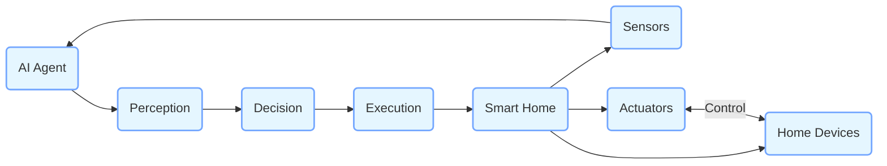

# AI Agent在智能家居中的应用

> 关键词：AI Agent、智能家居、应用场景、算法原理、开发实践

> 摘要：本文深入探讨了AI Agent在智能家居领域的应用。首先介绍了相关背景，包括目的范围、预期读者等内容。接着阐述了AI Agent与智能家居的核心概念及联系，通过示意图和流程图进行清晰展示。详细讲解了核心算法原理，并用Python代码进行说明，同时给出了数学模型和公式。在项目实战部分，提供了开发环境搭建、源代码实现及解读。分析了实际应用场景，推荐了学习资源、开发工具框架和相关论文著作。最后总结了未来发展趋势与挑战，并对常见问题进行了解答，为相关领域的研究和实践提供了全面且深入的参考。

## 1. 背景介绍 
### 1.1 目的和范围
随着科技的飞速发展，智能家居逐渐走进人们的生活。AI Agent作为一种具有智能决策和交互能力的实体，在智能家居领域有着巨大的应用潜力。本文的目的在于全面深入地探讨AI Agent在智能家居中的应用，包括其核心概念、算法原理、实际应用场景等方面。范围涵盖了从理论基础到项目实战的各个环节，旨在为相关研究人员、开发者和智能家居爱好者提供系统的知识和实践指导。

### 1.2 预期读者
本文的预期读者主要包括以下几类人群：
- 智能家居领域的开发者和工程师，希望通过了解AI Agent的应用来提升智能家居系统的智能水平。
- 计算机科学、人工智能相关专业的学生和研究人员，对AI Agent在实际场景中的应用感兴趣。
- 智能家居产品的用户和爱好者，想深入了解背后的技术原理和发展趋势。
- 对新兴技术有探索欲望的科技爱好者，关注AI Agent在不同领域的创新应用。

### 1.3 文档结构概述
本文将按照以下结构进行阐述：
- 核心概念与联系：介绍AI Agent和智能家居的基本概念，以及它们之间的联系，通过示意图和流程图进行直观展示。
- 核心算法原理 & 具体操作步骤：讲解AI Agent在智能家居中应用的核心算法，并用Python代码详细说明具体实现步骤。
- 数学模型和公式 & 详细讲解 & 举例说明：给出相关的数学模型和公式，并进行详细解释和举例。
- 项目实战：包括开发环境搭建、源代码详细实现和代码解读，帮助读者将理论知识应用到实际项目中。
- 实际应用场景：分析AI Agent在智能家居中的各种实际应用场景。
- 工具和资源推荐：推荐学习资源、开发工具框架和相关论文著作。
- 总结：总结未来发展趋势与挑战。
- 附录：解答常见问题。
- 扩展阅读 & 参考资料：提供进一步学习的参考内容。

### 1.4 术语表
#### 1.4.1 核心术语定义
- **AI Agent（人工智能代理）**：是一种能够感知环境、自主决策并采取行动以实现特定目标的智能实体。它可以接收来自环境的信息，进行分析和推理，然后根据自身的目标和规则做出相应的决策和行动。
- **智能家居**：是利用先进的计算机技术、网络通信技术、传感器技术等，将家居设备连接成一个智能化的系统，实现对家居设备的自动化控制、远程监控和管理，为用户提供更加舒适、便捷、安全的居住环境。
- **感知器（Sensor）**：是AI Agent用于获取环境信息的设备，如温度传感器、光线传感器、摄像头等。
- **执行器（Actuator）**：是AI Agent用于执行决策结果的设备，如智能开关、智能窗帘电机、空调控制器等。

#### 1.4.2 相关概念解释
- **环境感知**：AI Agent通过感知器收集环境中的各种信息，如温度、湿度、光照强度、人员活动等，以便了解当前的环境状态。
- **决策制定**：AI Agent根据感知到的环境信息和自身的目标、规则，运用一定的算法进行分析和推理，做出相应的决策。
- **行动执行**：AI Agent将决策结果转化为具体的行动，通过执行器对家居设备进行控制，如打开灯光、调节温度等。

#### 1.4.3 缩略词列表
- **AI**：Artificial Intelligence（人工智能）
- **IoT**：Internet of Things（物联网）
- **ML**：Machine Learning（机器学习）
- **RL**：Reinforcement Learning（强化学习）

## 2. 核心概念与联系 
### 2.1 AI Agent的基本概念
AI Agent是一个具有自主性、反应性、社会性和主动性的智能实体。自主性意味着它能够在没有人类干预的情况下独立地做出决策和行动；反应性表示它能够感知环境的变化并及时做出响应；社会性指的是它可以与其他Agent或人类进行交互；主动性则体现为它能够主动地追求自身的目标。

### 2.2 智能家居的概念
智能家居是一个融合了多种技术的系统，它通过网络将各种家居设备连接起来，实现设备之间的互联互通和智能化管理。智能家居系统可以根据用户的需求和环境的变化，自动调整设备的运行状态，提供个性化的服务。

### 2.3 AI Agent与智能家居的联系
AI Agent在智能家居中扮演着核心的角色。它可以作为智能家居系统的智能控制中心，通过感知器收集家居环境的信息，然后根据这些信息做出决策，控制执行器对家居设备进行操作。例如，当AI Agent通过温度传感器感知到室内温度过高时，它可以决策并控制空调开启制冷模式。

### 2.4 文本示意图
```plaintext
+---------------------+
|      AI Agent       |
| +-----------------+ |
| |   Perception    | |
| +-----------------+ |
| |    Decision     | |
| +-----------------+ |
| |    Execution    | |
| +-----------------+ |
+---------------------+
        |
        |
        v
+---------------------+
|    Smart Home       |
| +-----------------+ |
| |  Sensors        | |
| +-----------------+ |
| |  Actuators      | |
| +-----------------+ |
| |  Home Devices   | |
| +-----------------+ |
+---------------------+
```

### 2.5 Mermaid流程图


## 3. 核心算法原理 & 具体操作步骤 
### 3.1 基于规则的算法原理
基于规则的算法是一种简单而直观的AI Agent决策算法。它通过定义一系列的规则，根据感知到的环境信息来匹配相应的规则，从而做出决策。例如，定义规则“如果室内温度高于28摄氏度，则打开空调”，当AI Agent感知到室内温度高于28摄氏度时，就会执行打开空调的操作。

### 3.2 Python代码实现
```python
# 定义规则列表
rules = [
    {
        "condition": lambda temperature: temperature > 28,
        "action": "Turn on the air conditioner"
    },
    {
        "condition": lambda light: light < 50,
        "action": "Turn on the lights"
    }
]

# 模拟传感器数据
temperature = 30
light = 30

# 决策函数
def make_decision(rules, temperature, light):
    for rule in rules:
        if "temperature" in rule["condition"].__code__.co_varnames:
            if rule["condition"](temperature):
                return rule["action"]
        elif "light" in rule["condition"].__code__.co_varnames:
            if rule["condition"](light):
                return rule["action"]
    return "No action"

# 执行决策
action = make_decision(rules, temperature, light)
print(f"Decision: {action}")
```

### 3.3 代码解释
- 首先，我们定义了一个规则列表`rules`，每个规则包含一个条件函数和一个对应的行动。
- 然后，模拟了传感器数据`temperature`和`light`。
- `make_decision`函数用于遍历规则列表，根据传感器数据判断是否满足规则的条件，如果满足则返回相应的行动，否则返回“无操作”。
- 最后，调用`make_decision`函数执行决策并打印结果。

### 3.4 基于机器学习的算法原理
基于机器学习的算法可以让AI Agent通过学习大量的数据来自动调整决策策略。例如，使用监督学习算法可以根据历史数据训练一个模型，预测在不同的环境条件下应该采取的最佳行动。

### 3.5 Python代码实现（使用简单的线性回归示例）
```python
import numpy as np
from sklearn.linear_model import LinearRegression

# 模拟训练数据
X_train = np.array([[20], [22], [24], [26], [28], [30]])
y_train = np.array([0, 0, 0, 1, 1, 1])

# 创建线性回归模型
model = LinearRegression()

# 训练模型
model.fit(X_train, y_train)

# 模拟新的传感器数据
new_temperature = np.array([[29]])

# 进行预测
prediction = model.predict(new_temperature)

# 根据预测结果做出决策
if prediction[0] > 0.5:
    action = "Turn on the air conditioner"
else:
    action = "No action"

print(f"Decision: {action}")
```

### 3.6 代码解释
- 首先，我们模拟了训练数据`X_train`和`y_train`，其中`X_train`表示温度，`y_train`表示是否打开空调的标签。
- 然后，创建了一个线性回归模型`model`并使用训练数据进行训练。
- 接着，模拟了新的传感器数据`new_temperature`，并使用训练好的模型进行预测。
- 最后，根据预测结果做出决策并打印结果。

## 4. 数学模型和公式 & 详细讲解 & 举例说明 
### 4.1 基于规则的决策模型
#### 4.1.1 数学公式
假设我们有 $n$ 条规则，第 $i$ 条规则的条件为 $C_i$，行动为 $A_i$。当感知到的环境信息为 $E$ 时，如果 $C_i(E)$ 为真，则执行行动 $A_i$。可以用以下公式表示：
$$
\text{Action} = 
\begin{cases}
A_i, & \text{if } C_i(E) = \text{True} \\
\text{No action}, & \text{otherwise}
\end{cases}
$$

#### 4.1.2 详细讲解
这个公式表示，对于每一条规则，我们将感知到的环境信息 $E$ 代入条件 $C_i$ 中进行判断。如果条件为真，则选择该规则对应的行动 $A_i$；如果所有规则的条件都不满足，则执行“无操作”。

#### 4.1.3 举例说明
假设我们有两条规则：
- 规则1：$C_1$：温度 > 28 摄氏度，$A_1$：打开空调
- 规则2：$C_2$：光线 < 50 勒克斯，$A_2$：打开灯光

当感知到的环境信息为 $E$ = (温度 = 30 摄氏度，光线 = 30 勒克斯) 时，$C_1(E)$ 为真，$C_2(E)$ 也为真。根据规则，我们可以选择执行打开空调或打开灯光的行动，具体选择可以根据规则的优先级或其他策略来确定。

### 4.2 基于机器学习的决策模型（以线性回归为例）
#### 4.2.1 数学公式
线性回归模型的基本公式为：
$$
y = \beta_0 + \beta_1x_1 + \beta_2x_2 + \cdots + \beta_nx_n + \epsilon
$$
其中，$y$ 是预测值，$x_1, x_2, \cdots, x_n$ 是输入特征，$\beta_0, \beta_1, \beta_2, \cdots, \beta_n$ 是模型的参数，$\epsilon$ 是误差项。

在我们的智能家居示例中，假设只有一个输入特征 $x$ 表示温度，公式可以简化为：
$$
y = \beta_0 + \beta_1x + \epsilon
$$

#### 4.2.2 详细讲解
线性回归模型的目标是通过训练数据找到最优的参数 $\beta_0$ 和 $\beta_1$，使得预测值 $y$ 与真实值之间的误差最小。通常使用最小二乘法来求解这些参数。

#### 4.2.3 举例说明
假设我们已经训练好一个线性回归模型，得到参数 $\beta_0 = -10$，$\beta_1 = 0.5$。当新的温度值 $x = 29$ 摄氏度时，预测值为：
$$
y = -10 + 0.5 \times 29 = 4.5
$$
如果我们设定一个阈值，例如 0.5，当 $y > 0.5$ 时执行打开空调的操作，那么根据预测结果，我们应该执行打开空调的操作。

## 5. 项目实战：代码实际案例和详细解释说明 
### 5.1  开发环境搭建
#### 5.1.1 硬件环境
- **开发板**：可以选择树莓派（Raspberry Pi）作为开发板，它具有强大的计算能力和丰富的接口，适合用于智能家居项目的开发。
- **传感器和执行器**：根据项目需求选择合适的传感器和执行器，如温度传感器、光线传感器、智能开关、智能插座等。

#### 5.1.2 软件环境
- **操作系统**：在树莓派上安装Raspbian操作系统，它是基于Debian的轻量级操作系统，非常适合用于嵌入式开发。
- **编程语言**：使用Python作为开发语言，Python具有简单易学、功能强大的特点，并且有丰富的库和工具可以用于智能家居开发。
- **开发工具**：可以使用Visual Studio Code作为开发工具，它具有强大的代码编辑和调试功能，并且支持Python开发。

### 5.2  源代码详细实现和代码解读
#### 5.2.1 传感器数据读取
```python
import Adafruit_DHT

# 传感器类型
DHT_SENSOR = Adafruit_DHT.DHT11
# 传感器引脚
DHT_PIN = 4

def read_temperature():
    humidity, temperature = Adafruit_DHT.read_retry(DHT_SENSOR, DHT_PIN)
    if temperature is not None:
        return temperature
    else:
        return None

# 读取温度数据
temperature = read_temperature()
if temperature is not None:
    print(f"Temperature: {temperature} °C")
else:
    print("Failed to read temperature data.")
```
**代码解读**：
- 导入`Adafruit_DHT`库，用于读取DHT11温度传感器的数据。
- 定义传感器类型和引脚。
- `read_temperature`函数用于读取温度数据，如果读取成功则返回温度值，否则返回`None`。
- 调用`read_temperature`函数读取温度数据并打印结果。

#### 5.2.2 执行器控制
```python
import RPi.GPIO as GPIO
import time

# 定义执行器引脚
ACTUATOR_PIN = 17

# 设置GPIO模式
GPIO.setmode(GPIO.BCM)
# 设置引脚为输出模式
GPIO.setup(ACTUATOR_PIN, GPIO.OUT)

def turn_on_actuator():
    GPIO.output(ACTUATOR_PIN, GPIO.HIGH)
    print("Actuator turned on.")

def turn_off_actuator():
    GPIO.output(ACTUATOR_PIN, GPIO.LOW)
    print("Actuator turned off.")

try:
    # 打开执行器
    turn_on_actuator()
    time.sleep(5)
    # 关闭执行器
    turn_off_actuator()
except KeyboardInterrupt:
    print("Program interrupted by user.")
finally:
    # 清理GPIO设置
    GPIO.cleanup()
```
**代码解读**：
- 导入`RPi.GPIO`库，用于控制树莓派的GPIO引脚。
- 定义执行器引脚，并设置GPIO模式和引脚为输出模式。
- `turn_on_actuator`函数用于打开执行器，`turn_off_actuator`函数用于关闭执行器。
- 在`try`块中，先打开执行器，等待5秒后关闭执行器。
- 使用`KeyboardInterrupt`捕获用户的中断信号，确保程序可以正常退出。
- 最后，使用`GPIO.cleanup()`清理GPIO设置。

#### 5.2.3 基于规则的决策系统
```python
import Adafruit_DHT
import RPi.GPIO as GPIO
import time

# 传感器类型
DHT_SENSOR = Adafruit_DHT.DHT11
# 传感器引脚
DHT_PIN = 4
# 执行器引脚
ACTUATOR_PIN = 17

# 设置GPIO模式
GPIO.setmode(GPIO.BCM)
# 设置引脚为输出模式
GPIO.setup(ACTUATOR_PIN, GPIO.OUT)

# 定义规则列表
rules = [
    {
        "condition": lambda temperature: temperature > 28,
        "action": lambda: GPIO.output(ACTUATOR_PIN, GPIO.HIGH)
    },
    {
        "condition": lambda temperature: temperature <= 28,
        "action": lambda: GPIO.output(ACTUATOR_PIN, GPIO.LOW)
    }
]

def read_temperature():
    humidity, temperature = Adafruit_DHT.read_retry(DHT_SENSOR, DHT_PIN)
    if temperature is not None:
        return temperature
    else:
        return None

def make_decision(rules, temperature):
    for rule in rules:
        if rule["condition"](temperature):
            rule["action"]()
            break

try:
    while True:
        temperature = read_temperature()
        if temperature is not None:
            make_decision(rules, temperature)
        time.sleep(1)
except KeyboardInterrupt:
    print("Program interrupted by user.")
finally:
    # 清理GPIO设置
    GPIO.cleanup()
```
**代码解读**：
- 结合传感器数据读取和执行器控制的功能，实现一个基于规则的决策系统。
- 定义规则列表，每个规则包含一个条件函数和一个对应的行动函数。
- `read_temperature`函数用于读取温度数据。
- `make_decision`函数用于根据温度数据和规则列表做出决策，并执行相应的行动。
- 在`while`循环中，不断读取温度数据，调用`make_decision`函数做出决策，然后等待1秒后再次循环。
- 使用`KeyboardInterrupt`捕获用户的中断信号，确保程序可以正常退出。
- 最后，使用`GPIO.cleanup()`清理GPIO设置。

### 5.3  代码解读与分析
#### 5.3.1 代码结构分析
上述代码主要分为三个部分：传感器数据读取、执行器控制和决策系统。传感器数据读取部分负责从传感器获取环境信息，执行器控制部分负责控制家居设备的运行，决策系统部分根据传感器数据和规则列表做出决策并执行相应的行动。

#### 5.3.2 代码可扩展性分析
代码具有较好的可扩展性。例如，如果需要添加新的传感器或执行器，只需要修改相应的引脚定义和读取/控制函数即可。如果需要添加新的规则，只需要在规则列表中添加新的规则项。

#### 5.3.3 代码性能分析
代码的性能主要取决于传感器数据读取的频率和决策系统的复杂度。在上述代码中，传感器数据读取的频率为每秒一次，对于大多数智能家居应用来说是足够的。决策系统采用基于规则的算法，复杂度较低，能够快速做出决策。

## 6. 实际应用场景 
### 6.1 智能温度控制
AI Agent可以通过温度传感器实时监测室内温度，并根据用户设定的温度范围自动调节空调或暖气的运行。例如，当室内温度高于设定的上限时，AI Agent会控制空调开启制冷模式；当室内温度低于设定的下限时，AI Agent会控制暖气开启制热模式。这样可以为用户提供一个舒适的室内温度环境，同时节省能源。

### 6.2 智能照明控制
AI Agent可以根据光线传感器感知的室内光照强度，自动调节灯光的亮度。当室内光线较暗时，AI Agent会控制灯光逐渐变亮；当室内光线充足时，AI Agent会控制灯光逐渐变暗或关闭。此外，AI Agent还可以根据用户的作息时间和行为习惯，自动设置灯光的开关时间和场景模式，如夜间模式、阅读模式等。

### 6.3 智能安防监控
AI Agent可以结合摄像头、门窗传感器等设备，实现智能安防监控功能。当门窗传感器检测到门窗被打开时，AI Agent会触发警报，并通过摄像头拍摄现场画面，同时将警报信息和画面发送到用户的手机上。此外，AI Agent还可以通过人脸识别技术，识别进入房间的人员身份，如果识别到陌生人，会及时发出警报。

### 6.4 智能家电控制
AI Agent可以与各种智能家电设备进行连接和控制，如智能冰箱、智能洗衣机、智能电视等。用户可以通过语音指令或手机APP向AI Agent发送控制指令，AI Agent会根据指令控制相应的家电设备运行。例如，用户可以说“打开冰箱冷藏模式”，AI Agent会将指令发送给智能冰箱，控制冰箱开启冷藏模式。

### 6.5 智能能源管理
AI Agent可以通过对家居设备的能耗数据进行监测和分析，实现智能能源管理。例如，AI Agent可以根据用户的用电习惯和电力市场的价格波动，自动调整家电设备的运行时间和功率，以降低能源消耗和用电成本。此外，AI Agent还可以对太阳能板、电池等能源设备进行管理，实现能源的优化利用。

## 7. 工具和资源推荐
### 7.1 学习资源推荐
#### 7.1.1 书籍推荐
- 《人工智能：一种现代的方法》（Artificial Intelligence: A Modern Approach）：这是一本经典的人工智能教材，全面介绍了人工智能的各个领域，包括搜索算法、知识表示、机器学习、自然语言处理等，对于理解AI Agent的原理和技术有很大的帮助。
- 《Python机器学习》（Python Machine Learning）：本书详细介绍了使用Python进行机器学习的方法和技术，包括数据预处理、模型选择、算法实现等内容，适合想要学习基于机器学习的AI Agent开发的读者。
- 《智能家居实战开发》：该书结合实际案例，介绍了智能家居系统的开发流程和技术，包括硬件设计、软件开发、系统集成等方面的知识，对于从事智能家居项目开发的读者具有很好的参考价值。

#### 7.1.2 在线课程
- Coursera上的“人工智能基础”（Foundations of Artificial Intelligence）课程：由知名高校的教授授课，系统地介绍了人工智能的基本概念、算法和应用，课程内容丰富，讲解详细。
- edX上的“Python数据科学手册”（Python Data Science Handbook）课程：该课程主要介绍了使用Python进行数据科学和机器学习的方法和工具，包括NumPy、Pandas、Scikit-learn等库的使用，对于提升Python编程能力和数据分析能力有很大的帮助。
- 中国大学MOOC上的“智能家居技术与应用”课程：由国内高校的专家授课，介绍了智能家居的技术原理、系统架构和应用案例，适合对智能家居感兴趣的初学者。

#### 7.1.3 技术博客和网站
- Medium上的人工智能相关博客：Medium上有很多人工智能领域的专业博主，他们会分享最新的技术动态、研究成果和实践经验，关注这些博客可以及时了解行业的发展趋势。
- AI研习社：这是一个专注于人工智能技术交流和学习的社区，提供了丰富的技术文章、视频教程、案例分析等资源，适合人工智能爱好者和从业者学习和交流。
- 智能家居网：该网站专注于智能家居领域的新闻资讯、产品评测、技术分析等内容，对于了解智能家居市场和技术发展有很大的帮助。

### 7.2 开发工具框架推荐
#### 7.2.1 IDE和编辑器
- Visual Studio Code：是一款功能强大的开源代码编辑器，支持多种编程语言和开发框架，具有丰富的插件和扩展功能，适合用于AI Agent和智能家居项目的开发。
- PyCharm：是一款专门为Python开发设计的集成开发环境（IDE），具有智能代码提示、调试功能、版本控制等特点，能够提高Python开发的效率。
- Jupyter Notebook：是一个基于Web的交互式开发环境，支持Python、R等多种编程语言，适合用于数据分析、机器学习等领域的开发和实验。

#### 7.2.2 调试和性能分析工具
- pdb：是Python自带的调试工具，可以在代码中设置断点，单步执行代码，查看变量的值等，帮助开发者快速定位和解决问题。
- cProfile：是Python的性能分析工具，可以统计代码的执行时间和函数调用次数，帮助开发者找出代码中的性能瓶颈。
- TensorBoard：是TensorFlow的可视化工具，可以用于可视化训练过程中的各种指标，如损失函数、准确率等，帮助开发者监控和优化模型的训练过程。

#### 7.2.3 相关框架和库
- Scikit-learn：是一个简单易用的机器学习库，提供了丰富的机器学习算法和工具，如分类、回归、聚类、降维等，适合用于开发基于机器学习的AI Agent。
- TensorFlow：是一个开源的深度学习框架，具有强大的计算能力和灵活的架构，支持各种深度学习模型的开发和训练，如神经网络、卷积神经网络、循环神经网络等。
- Home Assistant：是一个开源的智能家居平台，支持多种智能家居设备和协议，提供了丰富的插件和扩展功能，适合用于开发智能家居系统。

### 7.3 相关论文著作推荐
#### 7.3.1 经典论文
- “Reinforcement Learning: An Introduction”：这篇论文是强化学习领域的经典之作，系统地介绍了强化学习的基本概念、算法和应用，对于理解AI Agent的决策机制和学习方法有很大的帮助。
- “Artificial Intelligence and Intelligent Agents”：该论文探讨了人工智能和智能Agent的关系，介绍了智能Agent的分类、架构和设计方法，为AI Agent的研究和开发提供了理论基础。
- “The Design and Implementation of a Smart Home Environment”：这篇论文介绍了一个智能家居环境的设计和实现方法，包括系统架构、传感器网络、智能控制算法等方面的内容，对于智能家居系统的开发具有一定的参考价值。

#### 7.3.2 最新研究成果
- 关注ACM SIGART、IEEE Transactions on Intelligent Systems等学术期刊和会议，这些期刊和会议会发表人工智能和智能家居领域的最新研究成果，了解这些成果可以帮助开发者掌握行业的前沿技术。
- 关注各大高校和科研机构的研究团队，他们通常会在自己的网站上发布最新的研究论文和项目成果，及时关注这些信息可以获取最新的技术动态。

#### 7.3.3 应用案例分析
- 一些知名的科技公司，如Google、Amazon、Apple等，会在自己的官方网站或博客上分享智能家居产品的应用案例和技术经验，分析这些案例可以了解实际应用中的技术解决方案和挑战。
- 行业报告和研究机构的分析文章也会提供一些智能家居应用案例的分析和解读，通过阅读这些报告可以了解智能家居市场的发展趋势和应用场景。

## 8. 总结：未来发展趋势与挑战
### 8.1 未来发展趋势
#### 8.1.1 更加智能化和个性化
未来的AI Agent在智能家居中的应用将更加智能化和个性化。AI Agent将能够通过深度学习和强化学习等技术，不断学习用户的行为习惯和偏好，为用户提供更加个性化的服务。例如，根据用户的睡眠习惯自动调整卧室的温度、湿度和光照强度，为用户创造一个更加舒适的睡眠环境。

#### 8.1.2 多模态交互
未来的智能家居系统将支持多模态交互方式，如语音交互、手势交互、表情交互等。用户可以通过自然语言、手势或表情与AI Agent进行交互，提高交互的便捷性和自然度。例如，用户可以通过手势控制灯光的开关和亮度，通过语音查询天气信息和新闻资讯。

#### 8.1.3 与物联网的深度融合
随着物联网技术的不断发展，未来的智能家居系统将与物联网进行深度融合。AI Agent将能够连接更多的智能设备和传感器，实现更加全面的环境感知和设备控制。例如，通过连接智能门锁、智能摄像头、智能烟雾报警器等设备，实现更加智能的安防监控和应急处理。

#### 8.1.4 跨平台和跨设备协同
未来的智能家居系统将支持跨平台和跨设备协同。用户可以通过手机、平板、智能手表等多种设备随时随地控制智能家居系统，并且不同设备之间可以实现数据共享和协同工作。例如，用户在手机上设置了回家模式，当用户接近家门时，智能门锁会自动解锁，同时家里的灯光、空调、音乐等设备会自动开启到预设的状态。

### 8.2 挑战
#### 8.2.1 数据安全和隐私保护
随着智能家居系统的普及，大量的用户数据将被收集和存储，数据安全和隐私保护成为了一个重要的挑战。AI Agent需要采取有效的措施来保护用户数据的安全和隐私，防止数据泄露和滥用。例如，采用加密技术对数据进行加密传输和存储，严格控制数据的访问权限等。

#### 8.2.2 系统兼容性和互操作性
目前，市场上的智能家居设备和系统种类繁多，不同品牌和型号的设备之间往往存在兼容性和互操作性问题。AI Agent需要能够兼容不同类型的设备和系统，实现设备之间的互联互通和协同工作。这需要制定统一的标准和协议，促进智能家居产业的规范化和标准化发展。

#### 8.2.3 算法复杂度和计算资源需求
随着AI Agent的功能越来越复杂，其算法复杂度和计算资源需求也会不断增加。在智能家居设备中，往往计算资源有限，如何在有限的计算资源下实现高效的算法和决策是一个挑战。需要研究和开发轻量级的算法和模型，优化算法的实现和部署，提高算法的效率和性能。

#### 8.2.4 用户接受度和使用习惯
智能家居系统的推广和应用还面临着用户接受度和使用习惯的挑战。一些用户可能对新技术存在疑虑和不信任，不愿意使用智能家居产品。此外，用户需要一定的时间来适应新的交互方式和使用习惯。因此，需要加强对用户的宣传和培训，提高用户对智能家居系统的认知和接受度，引导用户养成良好的使用习惯。

## 9. 附录：常见问题与解答
### 9.1 AI Agent在智能家居中的应用安全吗？
AI Agent在智能家居中的应用安全问题是一个备受关注的问题。为了确保安全，开发者通常会采取多种措施。例如，在数据传输方面，采用加密技术对数据进行加密，防止数据在传输过程中被窃取或篡改。在设备访问方面，设置严格的访问权限，只有授权的用户才能访问和控制智能家居设备。此外，定期对系统进行安全漏洞检测和修复，及时更新软件版本，以提高系统的安全性。

### 9.2 如何选择适合的AI Agent开发框架？
选择适合的AI Agent开发框架需要考虑多个因素。首先，要根据项目的需求和目标来选择。如果项目侧重于机器学习和深度学习，那么可以选择TensorFlow、PyTorch等框架；如果项目侧重于规则引擎和决策系统，那么可以选择Drools等框架。其次，要考虑框架的易用性和可扩展性。选择一个易于学习和使用的框架可以提高开发效率，而具有良好可扩展性的框架可以方便后续的功能扩展和升级。此外，还要考虑框架的社区支持和文档资源，一个活跃的社区和丰富的文档资源可以为开发者提供更好的技术支持和帮助。

### 9.3 AI Agent在智能家居中能实现哪些复杂的功能？
AI Agent在智能家居中可以实现多种复杂的功能。例如，智能场景联动功能，AI Agent可以根据用户的设定和环境的变化，自动触发一系列的设备操作，实现不同场景的切换，如回家模式、睡眠模式、聚会模式等。智能能源管理功能，AI Agent可以通过对家居设备的能耗数据进行分析和预测，优化设备的运行时间和功率，实现能源的高效利用。智能健康监测功能，AI Agent可以结合可穿戴设备和传感器，实时监测用户的健康状况，如心率、血压、睡眠质量等，并提供相应的健康建议和预警。

### 9.4 智能家居系统中AI Agent的决策速度有多快？
AI Agent的决策速度取决于多个因素，包括算法的复杂度、计算资源的性能、传感器数据的采集频率等。对于基于规则的简单决策算法，决策速度通常非常快，可以在毫秒级内完成决策。而对于基于机器学习和深度学习的复杂算法，决策速度可能会受到模型的训练时间和推理时间的影响。在实际应用中，可以通过优化算法、提高计算资源的性能等方式来提高AI Agent的决策速度。

### 9.5 如何对AI Agent在智能家居中的应用进行测试和验证？
对AI Agent在智能家居中的应用进行测试和验证可以从多个方面进行。首先，进行功能测试，检查AI Agent是否能够正确地感知环境信息、做出决策和控制设备。例如，测试温度传感器是否能够准确地读取温度数据，AI Agent是否能够根据温度数据正确地控制空调的开关。其次，进行性能测试，评估AI Agent的决策速度、响应时间等性能指标。例如，测试AI Agent在不同负载情况下的决策时间和响应时间。此外，还可以进行安全测试，检查系统是否存在安全漏洞，如数据泄露、设备被攻击等。可以使用模拟攻击、漏洞扫描等方法进行安全测试。

## 10. 扩展阅读 & 参考资料
### 10.1 扩展阅读
- 《深度学习》（Deep Learning）：这本书深入介绍了深度学习的理论和实践，包括神经网络、卷积神经网络、循环神经网络等内容，对于想要深入了解AI Agent中深度学习技术的读者有很大的帮助。
- 《物联网：技术、应用与标准》：该书全面介绍了物联网的技术原理、应用场景和标准规范，对于理解智能家居与物联网的关系和发展趋势有重要的参考价值。
- 《智能计算系统》：这本书介绍了智能计算系统的架构、算法和应用，对于了解AI Agent在智能家居中的计算资源需求和优化方法有一定的启发。

### 10.2 参考资料
- [Adafruit DHT Sensor Library Documentation](https://learn.adafruit.com/dht-humidity-sensing-on-raspberry-pi-with-gdocs-logging/python-setup)
- [RPi.GPIO Documentation](https://sourceforge.net/p/raspberry-gpio-python/wiki/Home/)
- [Scikit-learn Documentation](https://scikit-learn.org/stable/documentation.html)
- [TensorFlow Documentation](https://www.tensorflow.org/api_docs)
- [Home Assistant Documentation](https://www.home-assistant.io/docs/)

作者：AI天才研究院/AI Genius Institute & 禅与计算机程序设计艺术 /Zen And The Art of Computer Programming