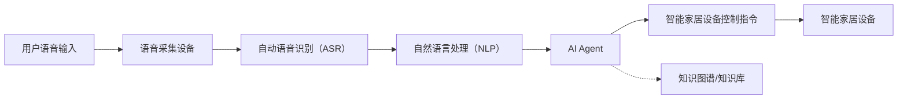

# AI Agent在智能家居中的语音控制应用

> 关键词：AI Agent、智能家居、语音控制、自然语言处理、物联网

> 摘要：本文深入探讨了AI Agent在智能家居语音控制中的应用。详细介绍了相关核心概念、算法原理、数学模型，通过项目实战展示了具体实现过程。分析了其实际应用场景，推荐了学习资源、开发工具和相关论文著作。最后总结了未来发展趋势与挑战，并提供常见问题解答和扩展阅读参考资料，旨在为开发者和研究者提供全面的技术指导和深入的思考方向。

## 1. 背景介绍 
### 1.1 目的和范围
随着物联网和人工智能技术的飞速发展，智能家居逐渐走进人们的生活。AI Agent在智能家居语音控制中的应用，旨在为用户提供更加便捷、自然的家居交互方式。本文的范围涵盖了AI Agent在智能家居语音控制中的核心概念、算法原理、数学模型、项目实战、实际应用场景等方面，全面深入地探讨了这一领域的技术细节和发展趋势。

### 1.2 预期读者
本文预期读者包括智能家居开发者、人工智能研究者、相关领域的学生以及对智能家居语音控制感兴趣的技术爱好者。通过阅读本文，读者可以了解AI Agent在智能家居语音控制中的工作原理和实现方法，为进一步的研究和开发提供参考。

### 1.3 文档结构概述
本文将按照以下结构进行阐述：首先介绍核心概念与联系，包括AI Agent、智能家居和语音控制的基本原理和相互关系；接着详细讲解核心算法原理和具体操作步骤，并给出Python源代码；然后介绍数学模型和公式，并举例说明；通过项目实战展示代码实际案例和详细解释；分析实际应用场景；推荐学习资源、开发工具和相关论文著作；最后总结未来发展趋势与挑战，提供常见问题解答和扩展阅读参考资料。

### 1.4 术语表
#### 1.4.1 核心术语定义
- **AI Agent**：人工智能代理，是一种能够感知环境、自主决策并采取行动以实现特定目标的智能实体。
- **智能家居**：利用物联网技术将家中的各种设备连接到一起，实现智能化管理和控制的家居系统。
- **语音控制**：通过语音指令来控制设备或系统的操作方式。
- **自然语言处理（NLP）**：研究如何让计算机理解和处理人类自然语言的技术领域。
- **物联网（IoT）**：通过各种信息传感器、射频识别技术、全球定位系统等技术和装置，实时采集任何需要监控、连接、互动的物体或过程的信息，通过各类可能的网络接入，实现物与物、物与人的泛在连接，实现对物品和过程的智能化感知、识别和管理。

#### 1.4.2 相关概念解释
- **意图识别**：在语音控制中，意图识别是指从用户的语音输入中识别出用户的意图，例如打开灯光、调节温度等。
- **实体识别**：识别语音输入中涉及的实体，如设备名称（如“客厅灯”）、时间（如“晚上八点”）等。
- **语音合成**：将文本信息转换为语音输出的技术。
- **唤醒词**：用于唤醒智能家居语音控制系统的特定词语，如“小爱同学”、“天猫精灵”等。

#### 1.4.3 缩略词列表
- **NLP**：Natural Language Processing（自然语言处理）
- **IoT**：Internet of Things（物联网）
- **ASR**：Automatic Speech Recognition（自动语音识别）
- **TTS**：Text-to-Speech（文本转语音）

## 2. 核心概念与联系 
### 核心概念原理
#### AI Agent
AI Agent是智能家居语音控制的核心智能实体。它通过感知用户的语音输入，利用自然语言处理技术理解用户的意图，然后根据自身的知识和策略进行决策，并向智能家居设备发送相应的控制指令。AI Agent可以不断学习和优化自己的决策能力，以更好地满足用户的需求。

#### 智能家居
智能家居是由各种智能设备组成的网络系统，这些设备通过物联网技术连接在一起。智能家居设备可以包括智能灯具、智能家电、智能门锁等。它们能够接收AI Agent发送的控制指令，并根据指令执行相应的操作。

#### 语音控制
语音控制是一种自然、便捷的交互方式。用户通过说出语音指令，语音控制系统将语音信号转换为文本，然后进行意图识别和实体识别，最后将处理结果转化为控制指令发送给智能家居设备。

### 架构的文本示意图
```plaintext
用户语音输入 -> 语音采集设备 -> 自动语音识别（ASR） -> 自然语言处理（NLP） -> AI Agent -> 智能家居设备控制指令 -> 智能家居设备
                                                                      |
                                                                      V
                                                                  知识图谱/知识库
```

### Mermaid流程图


## 3. 核心算法原理 & 具体操作步骤 
### 自动语音识别（ASR）
自动语音识别的目的是将语音信号转换为文本。常见的ASR算法有基于深度学习的端到端模型，如DeepSpeech。以下是一个简单的Python示例，使用`SpeechRecognition`库进行语音识别：
```python
import speech_recognition as sr

# 创建一个Recognizer对象
r = sr.Recognizer()

# 使用麦克风进行语音输入
with sr.Microphone() as source:
    print("请说话...")
    audio = r.listen(source)

try:
    # 使用Google Web Speech API进行识别
    text = r.recognize_google(audio, language='zh-CN')
    print(f"识别结果: {text}")
except sr.UnknownValueError:
    print("无法识别语音")
except sr.RequestError as e:
    print(f"请求错误; {e}")
```
### 自然语言处理（NLP）
自然语言处理主要包括意图识别和实体识别。这里我们使用`snips-nlu`库进行简单的意图识别和实体识别示例：
```python
from snips_nlu import SnipsNLUEngine
from snips_nlu.default_configs import CONFIG_ZH

# 训练数据
training_dataset = {
    "intents": {
        "turn_on_light": {
            "utterances": [
                {
                    "data": [
                        {"text": "打开"},
                        {"text": "客厅", "entity": "room"},
                        {"text": "灯"}
                    ]
                }
            ]
        }
    },
    "entities": {
        "room": {
            "data": [
                {"value": "客厅"},
                {"value": "卧室"}
            ]
        }
    },
    "language": "zh"
}

# 创建并训练NLU引擎
nlu_engine = SnipsNLUEngine(config=CONFIG_ZH)
nlu_engine.fit(training_dataset)

# 待处理的文本
input_text = "打开客厅灯"

# 进行意图识别和实体识别
parsing = nlu_engine.parse(input_text)
print(parsing)
```
### AI Agent决策与控制
AI Agent根据NLP处理的结果，结合自身的知识和策略进行决策，并向智能家居设备发送控制指令。以下是一个简单的示例：
```python
# 模拟智能家居设备控制函数
def control_device(device, action):
    print(f"向 {device} 发送 {action} 指令")

# 根据NLP结果进行决策和控制
if parsing["intent"]["intentName"] == "turn_on_light":
    entities = parsing["slots"]
    for entity in entities:
        if entity["entity"] == "room":
            room = entity["value"]["value"]
            device = f"{room}灯"
            control_device(device, "打开")
```

## 4. 数学模型和公式 & 详细讲解 & 举例说明 
### 自动语音识别（ASR）的数学模型
ASR的核心是寻找最可能的文本序列 $W$ 来匹配输入的语音信号 $X$。根据贝叶斯定理，有：
$$P(W|X)=\frac{P(X|W)P(W)}{P(X)}$$
其中，$P(W|X)$ 是在给定语音信号 $X$ 的情况下，文本序列 $W$ 的后验概率；$P(X|W)$ 是在给定文本序列 $W$ 的情况下，生成语音信号 $X$ 的概率，也称为声学模型；$P(W)$ 是文本序列 $W$ 的先验概率，也称为语言模型；$P(X)$ 是语音信号 $X$ 的概率，通常在比较不同文本序列时可以忽略。

在实际应用中，我们的目标是找到使得 $P(W|X)$ 最大的文本序列 $W$，即：
$$\hat{W}=\arg\max_{W}P(W|X)=\arg\max_{W}P(X|W)P(W)$$

例如，当输入的语音信号是“打开客厅灯”时，ASR系统会在所有可能的文本序列中寻找使得 $P(X|W)P(W)$ 最大的序列，最终识别出“打开客厅灯”。

### 自然语言处理（NLP）的数学模型
在意图识别中，常用的方法是基于机器学习的分类模型。假设我们有一个训练数据集 $\{(x_1,y_1),(x_2,y_2),\cdots,(x_n,y_n)\}$，其中 $x_i$ 是输入的文本特征，$y_i$ 是对应的意图标签。我们的目标是学习一个分类函数 $f(x)$，使得对于新的输入文本 $x$，能够预测其意图标签 $\hat{y}=f(x)$。

常见的分类算法有逻辑回归、支持向量机、神经网络等。以逻辑回归为例，其模型可以表示为：
$$P(y = 1|x)=\frac{1}{1 + e^{-(w^Tx + b)}}$$
其中，$w$ 是权重向量，$b$ 是偏置项。通过最大化训练数据的似然函数来学习 $w$ 和 $b$ 的值。

例如，在我们之前的意图识别示例中，输入文本“打开客厅灯”经过特征提取后，输入到训练好的逻辑回归模型中，模型会输出该文本属于“turn_on_light”意图的概率。

## 5. 项目实战：代码实际案例和详细解释说明 
### 5.1  开发环境搭建
#### 安装Python
首先确保你已经安装了Python 3.x版本。可以从Python官方网站（https://www.python.org/downloads/）下载并安装。

#### 安装必要的库
使用`pip`安装所需的库：
```sh
pip install SpeechRecognition
pip install snips-nlu
```

### 5.2  源代码详细实现和代码解读
以下是一个完整的智能家居语音控制项目示例：
```python
import speech_recognition as sr
from snips_nlu import SnipsNLUEngine
from snips_nlu.default_configs import CONFIG_ZH

# 训练数据
training_dataset = {
    "intents": {
        "turn_on_light": {
            "utterances": [
                {
                    "data": [
                        {"text": "打开"},
                        {"text": "客厅", "entity": "room"},
                        {"text": "灯"}
                    ]
                }
            ]
        },
        "turn_off_light": {
            "utterances": [
                {
                    "data": [
                        {"text": "关闭"},
                        {"text": "客厅", "entity": "room"},
                        {"text": "灯"}
                    ]
                }
            ]
        }
    },
    "entities": {
        "room": {
            "data": [
                {"value": "客厅"},
                {"value": "卧室"}
            ]
        }
    },
    "language": "zh"
}

# 创建并训练NLU引擎
nlu_engine = SnipsNLUEngine(config=CONFIG_ZH)
nlu_engine.fit(training_dataset)

# 模拟智能家居设备控制函数
def control_device(device, action):
    print(f"向 {device} 发送 {action} 指令")

# 创建一个Recognizer对象
r = sr.Recognizer()

while True:
    try:
        # 使用麦克风进行语音输入
        with sr.Microphone() as source:
            print("请说话...")
            audio = r.listen(source)

        # 使用Google Web Speech API进行识别
        text = r.recognize_google(audio, language='zh-CN')
        print(f"识别结果: {text}")

        # 进行意图识别和实体识别
        parsing = nlu_engine.parse(text)
        print(parsing)

        # 根据NLP结果进行决策和控制
        intent_name = parsing["intent"]["intentName"]
        entities = parsing["slots"]
        if intent_name == "turn_on_light":
            for entity in entities:
                if entity["entity"] == "room":
                    room = entity["value"]["value"]
                    device = f"{room}灯"
                    control_device(device, "打开")
        elif intent_name == "turn_off_light":
            for entity in entities:
                if entity["entity"] == "room":
                    room = entity["value"]["value"]
                    device = f"{room}灯"
                    control_device(device, "关闭")
    except sr.UnknownValueError:
        print("无法识别语音")
    except sr.RequestError as e:
        print(f"请求错误; {e}")
    except KeyboardInterrupt:
        print("程序终止")
        break
```
### 5.3  代码解读与分析
- **训练数据部分**：定义了两个意图（“turn_on_light”和“turn_off_light”）以及对应的训练语句，同时定义了“room”实体。
- **NLU引擎训练**：使用`SnipsNLUEngine`创建并训练NLU引擎，以便进行意图识别和实体识别。
- **语音识别部分**：使用`SpeechRecognition`库的`Microphone`类获取用户的语音输入，然后使用Google Web Speech API进行语音识别。
- **决策和控制部分**：根据NLU引擎的解析结果，判断用户的意图，并调用`control_device`函数向相应的智能家居设备发送控制指令。

## 6. 实际应用场景 
### 家庭自动化控制
用户可以通过语音指令控制家中的各种智能设备，如打开或关闭灯光、调节空调温度、启动洗衣机等。例如，用户说“打开客厅灯”，AI Agent会识别意图并向客厅灯发送打开指令；说“把卧室温度调到25度”，AI Agent会控制卧室空调将温度调节到25度。

### 安全监控与报警
用户可以通过语音查询家中的安全监控情况，如查看摄像头的实时画面、了解门窗是否关闭等。当发生异常情况时，智能家居系统可以通过语音提醒用户。例如，用户说“查看客厅摄像头画面”，AI Agent会将客厅摄像头的画面显示在用户的设备上；如果门窗被非法打开，系统会语音报警“检测到门窗异常打开”。

### 娱乐系统控制
用户可以通过语音控制家中的娱乐设备，如播放音乐、电影，切换电视频道等。例如，用户说“播放周杰伦的歌曲”，AI Agent会控制音乐播放设备播放周杰伦的歌曲；说“切换到中央电视台一套”，AI Agent会控制电视机切换到相应频道。

### 智能日程管理
用户可以通过语音设置日程提醒、查询日程安排等。例如，用户说“明天上午九点提醒我开会”，AI Agent会将该日程添加到日程管理系统中，并在指定时间进行提醒；说“查询本周的日程安排”，AI Agent会将本周的日程信息以语音形式告知用户。

## 7. 工具和资源推荐
### 7.1 学习资源推荐
#### 7.1.1 书籍推荐
- 《自然语言处理入门》：这本书详细介绍了自然语言处理的基本概念、算法和应用，适合初学者入门。
- 《深度学习》：深度学习是AI Agent和语音控制的重要技术基础，这本书对深度学习的原理、模型和应用进行了全面深入的讲解。
- 《智能家居系统设计与开发》：该书涵盖了智能家居的各个方面，包括系统架构、设备选型、通信协议等，对智能家居开发者有很大的帮助。

#### 7.1.2 在线课程
- Coursera上的“Natural Language Processing Specialization”：由知名教授授课，系统地介绍了自然语言处理的相关知识和技术。
- edX上的“Deep Learning Specialization”：深度学习领域的经典课程，通过多个项目实践帮助学员掌握深度学习的应用。
- 中国大学MOOC上的“智能家居技术与应用”：介绍了智能家居的基本概念、技术和应用案例，适合对智能家居感兴趣的学习者。

#### 7.1.3 技术博客和网站
- Medium：上面有很多关于人工智能、自然语言处理和智能家居的技术文章和案例分享。
- 知乎：有很多技术专家和爱好者在上面分享他们的经验和见解，可以关注相关话题获取最新信息。
- 开源中国：提供了大量的开源项目和技术文章，对开发者有很大的参考价值。

### 7.2 开发工具框架推荐
#### 7.2.1 IDE和编辑器
- PyCharm：一款专业的Python集成开发环境，具有强大的代码编辑、调试和项目管理功能。
- Visual Studio Code：轻量级的代码编辑器，支持多种编程语言，有丰富的插件扩展。

#### 7.2.2 调试和性能分析工具
- PDB：Python自带的调试工具，可以帮助开发者定位代码中的问题。
- cProfile：Python的性能分析工具，可以分析代码的运行时间和函数调用情况。

#### 7.2.3 相关框架和库
- TensorFlow：开源的深度学习框架，广泛应用于语音识别、自然语言处理等领域。
- PyTorch：另一个流行的深度学习框架，具有简洁易用的特点。
- Home Assistant：开源的智能家居平台，可以方便地集成各种智能设备和实现自动化控制。

### 7.3 相关论文著作推荐
#### 7.3.1 经典论文
- “Attention Is All You Need”：提出了Transformer模型，在自然语言处理领域取得了巨大的成功。
- “Deep Speech: Scaling up end-to-end speech recognition”：介绍了DeepSpeech模型，推动了端到端语音识别技术的发展。

#### 7.3.2 最新研究成果
- 关注顶级学术会议如ACL（Association for Computational Linguistics）、ICASSP（International Conference on Acoustics, Speech and Signal Processing）上的最新研究论文，了解AI Agent和智能家居语音控制领域的前沿技术。

#### 7.3.3 应用案例分析
- 一些知名科技公司的技术博客会分享他们在智能家居语音控制方面的应用案例和经验，如Google、Amazon等公司的博客。

## 8. 总结：未来发展趋势与挑战
### 未来发展趋势
- **更加智能化和个性化**：AI Agent将能够更好地理解用户的个性化需求和习惯，提供更加智能化的服务。例如，根据用户的日常作息自动调节家居环境，根据用户的音乐喜好推荐个性化的音乐播放列表。
- **多模态交互**：除了语音控制，未来的智能家居将支持更多的交互方式，如手势识别、表情识别等，实现更加自然、便捷的交互体验。
- **与其他领域的融合**：智能家居语音控制将与医疗健康、教育、娱乐等领域进行深度融合，为用户提供更加丰富的服务。例如，在医疗健康领域，用户可以通过语音查询健康信息、预约医生等。

### 挑战
- **语音识别准确性**：在复杂的环境中，如嘈杂的背景声音、不同的口音和方言等，语音识别的准确性仍然是一个挑战。需要进一步提高语音识别算法的鲁棒性和适应性。
- **隐私和安全问题**：智能家居系统收集了大量用户的个人信息和行为数据，如何保障这些数据的隐私和安全是一个重要的问题。需要加强数据加密、访问控制等技术手段。
- **跨设备兼容性**：智能家居设备来自不同的厂商，具有不同的通信协议和接口标准，如何实现设备之间的互联互通和跨设备控制是一个亟待解决的问题。

## 9. 附录：常见问题与解答
### 问题1：语音识别不准确怎么办？
解答：可以尝试在安静的环境中进行语音输入，避免嘈杂的背景声音。另外，可以使用更准确的语音识别引擎，或者对语音识别模型进行训练和优化。

### 问题2：如何保障智能家居系统的安全？
解答：可以采取以下措施保障安全：使用强密码和加密通信协议，定期更新设备固件和软件，设置访问权限和安全策略，避免连接不安全的网络等。

### 问题3：不同品牌的智能家居设备如何实现互联互通？
解答：可以使用支持多种通信协议的智能家居平台，如Home Assistant等。这些平台可以通过中间件或插件实现不同品牌设备之间的互联互通。

## 10. 扩展阅读 & 参考资料
- 《人工智能：一种现代的方法》
- 《Python自然语言处理实战：核心技术与算法》
- https://www.snips.ai/
- https://pypi.org/project/SpeechRecognition/

作者：AI天才研究院/AI Genius Institute & 禅与计算机程序设计艺术 /Zen And The Art of Computer Programming