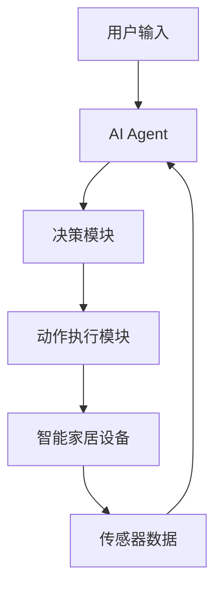

# AI Agent在智能家居自动化中的应用

> 关键词：AI Agent、智能家居自动化、智能交互、自动化控制、传感器融合

> 摘要：本文深入探讨了AI Agent在智能家居自动化中的应用。首先介绍了相关背景知识，包括目的、预期读者等内容。接着阐述了AI Agent和智能家居自动化的核心概念及其联系，给出了相应的原理和架构示意图。详细讲解了核心算法原理，并使用Python代码进行说明，同时介绍了相关数学模型和公式。通过项目实战，展示了代码的实际案例和详细解释。分析了AI Agent在智能家居自动化中的实际应用场景，推荐了学习、开发工具和相关论文著作。最后总结了未来发展趋势与挑战，提供了常见问题解答和扩展阅读参考资料，旨在为相关领域的研究和实践提供全面而深入的指导。

## 1. 背景介绍 
### 1.1 目的和范围
随着科技的飞速发展，智能家居自动化成为了人们追求便捷、舒适生活的重要方向。AI Agent作为一种具有自主决策和交互能力的智能实体，为智能家居自动化带来了新的活力和可能性。本文的目的在于全面深入地探讨AI Agent在智能家居自动化中的应用，涵盖从核心概念、算法原理到实际项目应用等多个方面，旨在为相关领域的研究人员、开发者以及对智能家居感兴趣的用户提供有价值的参考和指导。

### 1.2 预期读者
本文预期读者包括但不限于以下几类人群：
- 计算机科学、人工智能等相关专业的研究人员和学生，希望通过本文了解AI Agent在智能家居领域的最新应用和研究进展。
- 智能家居系统的开发者和工程师，能够从本文中获取AI Agent应用的技术细节和实践经验，用于开发更智能、高效的智能家居产品。
- 对智能家居感兴趣的普通用户，通过本文可以了解AI Agent在智能家居自动化中的作用和优势，更好地理解和使用智能家居设备。

### 1.3 文档结构概述
本文将按照以下结构进行详细阐述：
- 核心概念与联系：介绍AI Agent和智能家居自动化的核心概念，以及它们之间的联系，并给出原理和架构的文本示意图和Mermaid流程图。
- 核心算法原理 & 具体操作步骤：讲解AI Agent在智能家居自动化中应用的核心算法原理，使用Python源代码进行详细阐述，并说明具体操作步骤。
- 数学模型和公式 & 详细讲解 & 举例说明：介绍相关的数学模型和公式，并进行详细讲解，通过具体例子加深读者的理解。
- 项目实战：代码实际案例和详细解释说明：通过一个实际的项目案例，展示如何开发一个基于AI Agent的智能家居自动化系统，包括开发环境搭建、源代码实现和代码解读。
- 实际应用场景：分析AI Agent在智能家居自动化中的各种实际应用场景。
- 工具和资源推荐：推荐学习、开发工具和相关论文著作，帮助读者进一步深入学习和研究。
- 总结：未来发展趋势与挑战：总结AI Agent在智能家居自动化中的应用现状，分析未来发展趋势和面临的挑战。
- 附录：常见问题与解答：解答读者在阅读和实践过程中可能遇到的常见问题。
- 扩展阅读 & 参考资料：提供相关的扩展阅读资源和参考资料，方便读者进一步深入研究。

### 1.4 术语表
#### 1.4.1 核心术语定义
- **AI Agent（人工智能代理）**：是一种能够感知环境、自主决策并采取行动以实现特定目标的智能实体。它可以根据环境的变化和自身的任务要求，自主地进行推理、学习和决策。
- **智能家居自动化**：指利用先进的信息技术和自动化控制技术，将家居中的各种设备（如灯光、电器、门锁等）连接在一起，实现设备的自动化控制和智能化管理，为用户提供更加便捷、舒适、安全的居住环境。
- **传感器融合**：将来自多个不同类型传感器的数据进行综合处理和分析，以获取更准确、全面的环境信息。

#### 1.4.2 相关概念解释
- **智能交互**：指用户与智能家居系统之间通过自然语言、手势、表情等方式进行的高效、自然的交互。AI Agent可以通过智能交互技术理解用户的意图，并根据用户的需求提供相应的服务。
- **自动化控制**：根据预设的规则和条件，自动控制智能家居设备的开关、调节等操作，无需用户手动干预。

#### 1.4.3 缩略词列表
- **IoT**：Internet of Things，物联网
- **API**：Application Programming Interface，应用程序编程接口

## 2. 核心概念与联系 

### 2.1 AI Agent核心概念
AI Agent是一个具有自主性、反应性、社会性和适应性的智能实体。自主性意味着它可以在没有人类干预的情况下独立完成任务；反应性表示它能够感知环境的变化并及时做出响应；社会性体现为它可以与其他Agent或人类进行交互和协作；适应性则指它能够根据环境的变化和自身的经验进行学习和调整。

### 2.2 智能家居自动化核心概念
智能家居自动化是将家居中的各种设备通过网络连接起来，实现设备的自动化控制和智能化管理。它可以根据用户的需求和环境的变化，自动调节灯光、温度、湿度等参数，提供更加舒适、便捷的居住环境。

### 2.3 两者联系
AI Agent在智能家居自动化中扮演着核心角色。它可以通过传感器感知家居环境的信息，如温度、湿度、光照强度等，然后根据预设的规则和目标进行决策，控制智能家居设备的运行。例如，当AI Agent感知到室内温度过高时，它可以自动打开空调进行降温；当感知到有人进入房间时，它可以自动打开灯光。

### 2.4 原理和架构的文本示意图
```plaintext
用户 <-> AI Agent <-> 智能家居设备
|                      |
|                      |
V                      V
用户界面           传感器网络
```
在这个架构中，用户通过用户界面与AI Agent进行交互，AI Agent根据用户的指令和传感器网络收集的环境信息，对智能家居设备进行控制。

### 2.5 Mermaid流程图

这个流程图展示了AI Agent在智能家居自动化中的工作流程。用户输入和传感器数据作为输入传递给AI Agent，AI Agent的决策模块根据这些信息进行决策，动作执行模块根据决策结果控制智能家居设备，智能家居设备的状态又通过传感器反馈给AI Agent。

## 3. 核心算法原理 & 具体操作步骤 

### 3.1 核心算法原理 - 基于规则的推理算法
基于规则的推理算法是AI Agent在智能家居自动化中常用的一种算法。它通过定义一系列的规则，根据传感器数据和用户输入来判断是否满足规则条件，如果满足则执行相应的动作。

以下是一个简单的基于规则的推理算法的Python实现：
```python
# 定义规则类
class Rule:
    def __init__(self, condition, action):
        self.condition = condition
        self.action = action

    def evaluate(self, sensor_data):
        return self.condition(sensor_data)

    def execute(self):
        self.action()

# 定义传感器数据
sensor_data = {
    "temperature": 25,
    "light": 500
}

# 定义规则条件和动作
def condition1(sensor_data):
    return sensor_data["temperature"] > 23

def action1():
    print("打开空调")

# 创建规则对象
rule1 = Rule(condition1, action1)

# 评估规则并执行动作
if rule1.evaluate(sensor_data):
    rule1.execute()
```
### 3.2 具体操作步骤
1. **数据收集**：通过传感器网络收集家居环境的信息，如温度、湿度、光照强度等，并将这些数据传递给AI Agent。
2. **规则匹配**：AI Agent根据收集到的传感器数据，对预先定义的规则进行匹配，判断是否满足规则条件。
3. **决策执行**：如果某个规则的条件被满足，则AI Agent执行该规则对应的动作，控制智能家居设备的运行。
4. **反馈和学习**：AI Agent根据智能家居设备的反馈信息，对规则进行调整和优化，以提高系统的性能和适应性。

## 4. 数学模型和公式 & 详细讲解 & 举例说明 

### 4.1 模糊逻辑模型
模糊逻辑模型可以处理不确定和模糊的信息，非常适合用于智能家居自动化中的决策问题。在模糊逻辑中，使用模糊集合和模糊规则来描述和处理信息。

#### 4.1.1 模糊集合
设 $X$ 是一个论域，$A$ 是 $X$ 上的一个模糊集合，它可以用隶属函数 $\mu_A(x)$ 来表示，其中 $x \in X$，$\mu_A(x) \in [0, 1]$ 表示 $x$ 属于 $A$ 的程度。

例如，设 $X = [0, 100]$ 表示温度的取值范围，$A$ 表示“高温”模糊集合，其隶属函数可以定义为：
$$
\mu_A(x) = \begin{cases}
0, & x \leq 20 \\
\frac{x - 20}{10}, & 20 < x \leq 30 \\
1, & x > 30
\end{cases}
$$

#### 4.1.2 模糊规则
模糊规则通常采用“如果……那么……”的形式，例如：“如果温度是高温，那么打开空调”。

### 4.2 举例说明
假设当前室内温度为 $25^{\circ}C$，根据上述“高温”模糊集合的隶属函数，可得：
$$
\mu_A(25) = \frac{25 - 20}{10} = 0.5
$$
这表示当前温度属于“高温”的程度为 $0.5$。如果有一个模糊规则“如果温度是高温，那么打开空调”，则可以根据这个隶属度来决定是否打开空调。例如，可以设置一个阈值，当隶属度大于该阈值时，就执行打开空调的动作。

## 5. 项目实战：代码实际案例和详细解释说明 

### 5.1  开发环境搭建
#### 5.1.1 硬件环境
- **树莓派**：作为AI Agent的运行平台。
- **温度传感器**：用于采集室内温度信息。
- **继电器**：用于控制智能家居设备的开关。

#### 5.1.2 软件环境
- **Python**：作为开发语言。
- **Raspbian系统**：安装在树莓派上的操作系统。

### 5.2  源代码详细实现和代码解读
```python
import RPi.GPIO as GPIO
import time

# 初始化GPIO
GPIO.setmode(GPIO.BCM)
relay_pin = 18
GPIO.setup(relay_pin, GPIO.OUT)

# 模拟温度传感器读数
def read_temperature():
    # 这里可以替换为实际的传感器读取代码
    return 25

# 规则条件和动作
def condition(sensor_data):
    return sensor_data > 23

def action():
    GPIO.output(relay_pin, GPIO.HIGH)
    print("打开空调")

# 主循环
while True:
    temperature = read_temperature()
    if condition(temperature):
        action()
    time.sleep(5)
```
#### 代码解读
1. **导入必要的库**：导入 `RPi.GPIO` 库用于控制树莓派的GPIO引脚，`time` 库用于实现延时功能。
2. **初始化GPIO**：设置GPIO模式为BCM模式，并将继电器连接的引脚设置为输出模式。
3. **模拟温度传感器读数**：定义一个函数 `read_temperature` 用于模拟读取温度传感器的数据，实际应用中可以替换为实际的传感器读取代码。
4. **定义规则条件和动作**：定义规则条件函数 `condition` 和动作函数 `action`，当温度大于 $23^{\circ}C$ 时，执行打开空调的动作。
5. **主循环**：在主循环中，不断读取温度数据，判断是否满足规则条件，如果满足则执行相应的动作，并每隔5秒进行一次检测。

### 5.3  代码解读与分析
- **传感器数据采集**：通过 `read_temperature` 函数模拟采集温度传感器的数据，实际应用中需要根据具体的传感器型号和接口进行相应的开发。
- **规则匹配和决策**：通过 `condition` 函数判断是否满足规则条件，如果满足则调用 `action` 函数执行相应的动作。
- **设备控制**：通过控制树莓派的GPIO引脚来控制继电器的开关，从而实现对智能家居设备的控制。

## 6. 实际应用场景 
### 6.1 智能照明控制
AI Agent可以根据环境光照强度和用户的活动情况自动调节灯光的亮度和颜色。例如，当环境光照强度较低时，自动打开灯光；当用户进入卧室准备休息时，将灯光调节为柔和的暖色调。

### 6.2 智能温度调节
根据室内外温度、湿度和用户的设定，AI Agent可以自动控制空调、暖气等设备的运行，保持室内温度和湿度的舒适。例如，当室内温度过高时，自动打开空调降温；当室内温度过低时，自动打开暖气升温。

### 6.3 智能安防监控
AI Agent可以通过摄像头、门窗传感器等设备实时监控家居环境的安全状况。当检测到异常情况时，如有人闯入、门窗被打开等，及时向用户发送警报信息，并采取相应的措施，如开启警报器、拍摄照片等。

### 6.4 智能家电控制
AI Agent可以实现对各种家电设备的远程控制和自动化管理。用户可以通过手机APP或语音指令控制家电的开关、调节等操作，也可以设置定时任务，让家电设备在指定的时间自动运行。

## 7. 工具和资源推荐
### 7.1 学习资源推荐
#### 7.1.1 书籍推荐
- 《人工智能：一种现代的方法》：全面介绍了人工智能的基本概念、算法和应用，是学习人工智能的经典教材。
- 《智能家居系统设计与实现》：详细介绍了智能家居系统的设计原理、技术和实践案例，对学习智能家居自动化有很大的帮助。

#### 7.1.2 在线课程
- Coursera上的“人工智能基础”课程：由知名教授授课，系统地介绍了人工智能的基本理论和方法。
- edX上的“智能家居技术”课程：讲解了智能家居的相关技术和应用，适合初学者学习。

#### 7.1.3 技术博客和网站
- 开源中国：提供了大量的开源项目和技术文章，对学习智能家居自动化的开源技术有很大的帮助。
- 知乎：有很多关于智能家居和人工智能的讨论和分享，可以从中获取最新的行业动态和技术见解。

### 7.2 开发工具框架推荐
#### 7.2.1 IDE和编辑器
- PyCharm：一款功能强大的Python集成开发环境，提供了代码编辑、调试、版本控制等功能，适合开发基于Python的智能家居项目。
- Visual Studio Code：一款轻量级的代码编辑器，支持多种编程语言和插件扩展，方便开发和调试智能家居项目。

#### 7.2.2 调试和性能分析工具
- Wireshark：一款网络协议分析工具，可以用于分析智能家居设备之间的通信协议和数据传输情况。
- cProfile：Python自带的性能分析工具，可以帮助开发者找出代码中的性能瓶颈。

#### 7.2.3 相关框架和库
- Home Assistant：一个开源的智能家居平台，提供了丰富的插件和集成功能，方便开发者快速搭建智能家居系统。
- TensorFlow：一个流行的深度学习框架，可以用于开发基于人工智能的智能家居应用。

### 7.3 相关论文著作推荐
#### 7.3.1 经典论文
- “The AI Agent Architecture: A Survey”：对AI Agent的架构进行了全面的综述，介绍了不同类型的AI Agent架构和应用场景。
- “Smart Home Automation: A Review”：对智能家居自动化的发展历程、技术现状和未来趋势进行了详细的分析和总结。

#### 7.3.2 最新研究成果
- 关注顶级学术会议如AAAI、IJCAI等上关于智能家居和AI Agent的研究论文，了解最新的研究成果和技术进展。

#### 7.3.3 应用案例分析
- 阅读一些实际的智能家居项目案例分析报告，学习他人的经验和做法，为自己的项目开发提供参考。

## 8. 总结：未来发展趋势与挑战
### 8.1 未来发展趋势
- **更加智能化**：AI Agent将具备更强的学习和推理能力，能够更好地理解用户的需求和意图，提供更加个性化、智能化的服务。
- **多模态交互**：用户与智能家居系统之间的交互方式将更加多样化，除了语音和手势交互外，还将支持表情、眼神等多模态交互。
- **物联网融合**：智能家居系统将与物联网技术更加紧密地融合，实现设备之间的互联互通和协同工作。

### 8.2 挑战
- **数据安全和隐私保护**：智能家居系统收集了大量用户的个人信息和生活习惯数据，如何保障这些数据的安全和隐私是一个重要的挑战。
- **互操作性和标准化**：目前市场上的智能家居设备品牌和标准繁多，如何实现不同设备之间的互操作性和标准化是一个亟待解决的问题。
- **人工智能伦理问题**：AI Agent在智能家居自动化中的应用可能会引发一些伦理问题，如智能决策的公正性、责任归属等，需要引起重视和研究。

## 9. 附录：常见问题与解答
### 9.1 AI Agent在智能家居自动化中会取代人类的控制吗？
不会。AI Agent的主要作用是辅助人类进行智能家居设备的控制和管理，提供更加便捷、高效的服务。虽然AI Agent可以根据预设的规则和环境信息自动做出决策，但最终的控制权仍然掌握在用户手中。用户可以随时通过手机APP、语音指令等方式对智能家居设备进行手动控制。

### 9.2 如何保障智能家居系统的安全性？
可以采取以下措施来保障智能家居系统的安全性：
- **使用安全的网络**：确保智能家居设备连接到安全的无线网络，设置强密码，定期更新网络密码。
- **及时更新设备固件**：设备制造商通常会发布固件更新来修复安全漏洞，及时更新设备固件可以提高系统的安全性。
- **使用加密技术**：对智能家居设备之间的通信数据进行加密，防止数据被窃取和篡改。
- **安装安全软件**：在智能家居控制中心设备上安装安全软件，如杀毒软件、防火墙等，防止恶意软件的攻击。

### 9.3 AI Agent在智能家居自动化中的学习能力是如何实现的？
AI Agent的学习能力主要通过机器学习和深度学习算法来实现。例如，可以使用监督学习算法对大量的历史数据进行训练，让AI Agent学习到不同环境条件下的最佳决策策略；也可以使用强化学习算法，让AI Agent在与环境的交互中不断学习和优化自己的行为，以获得最大的奖励。

## 10. 扩展阅读 & 参考资料
### 10.1 扩展阅读
- 《人工智能时代的智能家居革命》：深入探讨了人工智能在智能家居领域的应用和发展趋势，以及对人们生活的影响。
- 《物联网与智能家居》：介绍了物联网技术在智能家居中的应用原理和实践案例，为进一步了解智能家居自动化提供了更广阔的视角。

### 10.2 参考资料
- [Home Assistant官方文档](https://www.home-assistant.io/docs/)
- [TensorFlow官方文档](https://www.tensorflow.org/api_docs)

作者：AI天才研究院/AI Genius Institute & 禅与计算机程序设计艺术 /Zen And The Art of Computer Programming