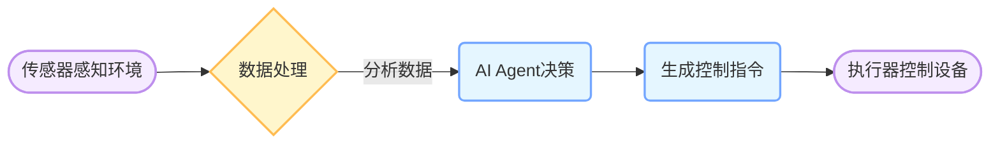

# AI Agent在智能家庭能源管理中的应用

> 关键词：AI Agent、智能家庭能源管理、能源优化、自动化控制、节能策略

> 摘要：本文深入探讨了AI Agent在智能家庭能源管理中的应用。首先介绍了智能家庭能源管理的背景和相关概念，阐述了AI Agent的核心原理及其与能源管理的联系。详细讲解了用于能源管理的核心算法原理，并给出Python代码示例。通过数学模型和公式进一步剖析能源管理的优化过程，并举例说明。在项目实战部分，给出了开发环境搭建步骤、源代码实现及详细解读。同时探讨了AI Agent在智能家庭能源管理中的实际应用场景，推荐了相关的学习资源、开发工具框架和论文著作。最后总结了未来发展趋势与挑战，并提供常见问题解答和扩展阅读参考资料。

## 1. 背景介绍 
### 1.1 目的和范围
随着全球能源需求的不断增长和对可持续发展的关注，智能家庭能源管理变得越来越重要。本文章的目的是研究如何利用AI Agent技术来优化智能家庭的能源使用，提高能源效率，降低能源成本，减少对环境的影响。范围涵盖了AI Agent的基本原理、在能源管理中的应用算法、实际项目开发以及未来发展趋势等方面。

### 1.2 预期读者
本文预期读者包括对人工智能、智能家居、能源管理等领域感兴趣的技术人员、研究人员、学生，以及希望了解智能家庭能源管理解决方案的普通消费者。

### 1.3 文档结构概述
本文首先介绍背景信息，包括目的、预期读者和文档结构。接着阐述核心概念与联系，包括AI Agent和智能家庭能源管理的原理及架构。然后详细讲解核心算法原理和具体操作步骤，并给出Python代码示例。之后通过数学模型和公式进一步分析能源管理过程。在项目实战部分，给出开发环境搭建、源代码实现和代码解读。随后探讨实际应用场景，推荐相关工具和资源。最后总结未来发展趋势与挑战，提供常见问题解答和扩展阅读参考资料。

### 1.4 术语表
#### 1.4.1 核心术语定义
- **AI Agent**：一种能够感知环境、做出决策并采取行动以实现特定目标的智能实体。在智能家庭能源管理中，AI Agent可以根据家庭的能源使用情况、电价信息等做出最优的能源管理决策。
- **智能家庭能源管理**：利用信息技术和自动化控制手段，对家庭中的各种能源设备进行监测、控制和优化，以实现能源的高效利用和成本的降低。
- **能源优化**：通过合理安排能源设备的运行时间和功率，使家庭能源消耗最小化，同时满足家庭的能源需求。

#### 1.4.2 相关概念解释
- **自动化控制**：指通过计算机程序或控制系统自动控制能源设备的开关、调节功率等操作，减少人工干预。
- **节能策略**：为了降低能源消耗而采取的一系列措施，如峰谷电价时段调整设备运行、设备智能休眠等。

#### 1.4.3 缩略词列表
- **IoT**：Internet of Things，物联网，用于连接家庭中的各种智能设备，实现数据的传输和共享。
- **ML**：Machine Learning，机器学习，AI Agent可以利用机器学习算法来学习能源使用模式和优化能源管理策略。

## 2. 核心概念与联系 
### 2.1 AI Agent原理
AI Agent是一种具有自主性、反应性、社会性和主动性的智能实体。它通过传感器感知环境信息，如家庭中的能源设备状态、电价信息、环境温度等。然后根据内部的决策模型对这些信息进行分析和处理，做出最优的决策。最后，通过执行器对能源设备进行控制，如打开或关闭电器、调节空调温度等。

### 2.2 智能家庭能源管理架构
智能家庭能源管理系统主要由以下几个部分组成：
- **传感器层**：负责采集家庭中的各种能源相关数据，如电表读数、设备功率、环境温度等。
- **通信层**：将传感器采集到的数据传输到中央控制器或云端服务器，同时将控制指令传输到执行器。
- **中央控制器**：对采集到的数据进行处理和分析，根据预设的策略或AI Agent的决策，生成控制指令。
- **执行器层**：根据控制指令对能源设备进行控制，实现能源的优化管理。

### 2.3 文本示意图
```plaintext
+----------------+
|   传感器层     |
| （电表、温度传感器等） |
+----------------+
        |
        v
+----------------+
|   通信层       |
| （WiFi、ZigBee等） |
+----------------+
        |
        v
+----------------+
|  中央控制器   |
| （AI Agent）   |
+----------------+
        |
        v
+----------------+
|   执行器层     |
| （智能插座、空调控制器等） |
+----------------+
```

### 2.4 Mermaid流程图


## 3. 核心算法原理 & 具体操作步骤 
### 3.1 基于规则的算法
基于规则的算法是一种简单而有效的能源管理方法。它根据预设的规则对能源设备进行控制。例如，如果当前电价处于高峰时段，且空调的使用时间超过了一定阈值，则自动降低空调的温度设定值。

```python
# 基于规则的能源管理示例代码
class RuleBasedEnergyManager:
    def __init__(self, peak_price_threshold, air_conditioner_usage_threshold):
        self.peak_price_threshold = peak_price_threshold
        self.air_conditioner_usage_threshold = air_conditioner_usage_threshold

    def manage_energy(self, current_price, air_conditioner_usage):
        if current_price > self.peak_price_threshold and air_conditioner_usage > self.air_conditioner_usage_threshold:
            return "Reduce air conditioner temperature"
        else:
            return "No action"

# 使用示例
manager = RuleBasedEnergyManager(1.5, 5)
current_price = 2.0
air_conditioner_usage = 6
action = manager.manage_energy(current_price, air_conditioner_usage)
print(action)
```

### 3.2 机器学习算法
机器学习算法可以通过学习历史能源数据，预测未来的能源需求和电价变化，从而做出更优化的能源管理决策。例如，使用线性回归算法预测未来一天的能源需求，然后根据预测结果调整设备的运行计划。

```python
import numpy as np
from sklearn.linear_model import LinearRegression

# 生成示例数据
X = np.array([[1], [2], [3], [4], [5]])
y = np.array([2, 4, 6, 8, 10])

# 训练线性回归模型
model = LinearRegression()
model.fit(X, y)

# 预测未来能源需求
future_day = np.array([[6]])
predicted_demand = model.predict(future_day)
print("Predicted energy demand:", predicted_demand[0])
```

### 3.3 具体操作步骤
1. **数据采集**：通过传感器采集家庭中的能源数据，如电表读数、设备功率、环境温度等。
2. **数据预处理**：对采集到的数据进行清洗、归一化等处理，以便后续的算法分析。
3. **算法选择和训练**：根据具体的能源管理需求，选择合适的算法（如基于规则的算法、机器学习算法等），并使用历史数据进行训练。
4. **决策生成**：根据实时采集的数据和训练好的模型，生成能源管理决策。
5. **设备控制**：将决策转化为控制指令，通过执行器对能源设备进行控制。

## 4. 数学模型和公式 & 详细讲解 & 举例说明 
### 4.1 能源消耗模型
能源消耗模型可以用来描述家庭中各种能源设备的能源消耗情况。假设家庭中有 $n$ 个能源设备，第 $i$ 个设备的功率为 $P_i$，运行时间为 $t_i$，则家庭的总能源消耗 $E$ 可以表示为：
$$E = \sum_{i=1}^{n} P_i t_i$$

例如，家庭中有一台功率为 $1000$ 瓦的空调，运行了 $3$ 小时，一台功率为 $500$ 瓦的电视，运行了 $2$ 小时，则家庭的总能源消耗为：
$$E = 1000 \times 3 + 500 \times 2 = 3000 + 1000 = 4000 \text{ 瓦时} = 4 \text{ 千瓦时}$$

### 4.2 成本优化模型
成本优化模型的目标是在满足家庭能源需求的前提下，使能源成本最小化。假设电价在不同时段是不同的，第 $j$ 个时段的电价为 $c_j$，家庭在该时段的能源消耗为 $E_j$，则家庭的总能源成本 $C$ 可以表示为：
$$C = \sum_{j=1}^{m} c_j E_j$$

为了降低能源成本，可以通过调整设备的运行时间，使能源消耗尽量集中在电价较低的时段。例如，假设一天分为两个时段，高峰时段（$8:00 - 20:00$）电价为 $1.5$ 元/千瓦时，低谷时段（$20:00 - 8:00$）电价为 $0.5$ 元/千瓦时。家庭需要完成一个总能源消耗为 $10$ 千瓦时的任务。如果全部在高峰时段完成，能源成本为 $1.5 \times 10 = 15$ 元；如果将 $8$ 千瓦时的任务安排在低谷时段，$2$ 千瓦时的任务安排在高峰时段，则能源成本为 $0.5 \times 8 + 1.5 \times 2 = 4 + 3 = 7$ 元。

### 4.3 预测模型
预测模型可以用来预测未来的能源需求和电价变化。例如，使用线性回归模型预测未来一天的能源需求。假设历史能源需求数据为 $y_1, y_2, \cdots, y_n$，对应的时间变量为 $x_1, x_2, \cdots, x_n$，线性回归模型的表达式为：
$$y = \beta_0 + \beta_1 x + \epsilon$$
其中，$\beta_0$ 和 $\beta_1$ 是模型的参数，$\epsilon$ 是误差项。通过最小化误差平方和，可以估计出 $\beta_0$ 和 $\beta_1$ 的值：
$$\hat{\beta}_1 = \frac{\sum_{i=1}^{n} (x_i - \bar{x})(y_i - \bar{y})}{\sum_{i=1}^{n} (x_i - \bar{x})^2}$$
$$\hat{\beta}_0 = \bar{y} - \hat{\beta}_1 \bar{x}$$
其中，$\bar{x}$ 和 $\bar{y}$ 分别是 $x$ 和 $y$ 的均值。

例如，根据历史数据估计出 $\hat{\beta}_0 = 10$，$\hat{\beta}_1 = 2$，则当时间变量 $x = 6$ 时，预测的能源需求为：
$$y = 10 + 2 \times 6 = 22$$

## 5. 项目实战：代码实际案例和详细解释说明 
### 5.1  开发环境搭建
#### 5.1.1 硬件环境
- **传感器**：选择合适的电表、温度传感器、功率传感器等，通过串口、WiFi或ZigBee等方式将数据传输到中央控制器。
- **中央控制器**：可以选择树莓派、Arduino等开发板，安装相应的操作系统（如Raspbian）。
- **执行器**：选择智能插座、空调控制器等，通过网络接口接收控制指令。

#### 5.1.2 软件环境
- **操作系统**：在中央控制器上安装Linux操作系统，如Raspbian。
- **编程语言**：选择Python作为开发语言，安装Python 3.x版本。
- **开发工具**：安装PyCharm、VS Code等开发工具，方便代码编写和调试。
- **相关库**：安装`numpy`、`pandas`、`scikit-learn`等库，用于数据处理和机器学习。

### 5.2  源代码详细实现和代码解读
```python
import numpy as np
import pandas as pd
from sklearn.linear_model import LinearRegression

# 读取历史能源数据
data = pd.read_csv('energy_data.csv')
X = data[['time']]
y = data['energy_demand']

# 训练线性回归模型
model = LinearRegression()
model.fit(X, y)

# 预测未来能源需求
future_time = np.array([[24]])  # 预测第24小时的能源需求
predicted_demand = model.predict(future_time)
print("Predicted energy demand:", predicted_demand[0])

# 根据预测结果进行能源管理决策
if predicted_demand[0] > 10:
    print("Reduce energy consumption")
else:
    print("No action")
```

### 5.3  代码解读与分析
1. **数据读取**：使用`pandas`库读取历史能源数据，将时间作为特征变量 $X$，能源需求作为目标变量 $y$。
2. **模型训练**：使用`sklearn`库中的`LinearRegression`类训练线性回归模型。
3. **预测未来能源需求**：将未来的时间作为输入，使用训练好的模型进行预测。
4. **决策生成**：根据预测结果，判断是否需要采取节能措施。

## 6. 实际应用场景 
### 6.1 峰谷电价时段管理
根据不同时段的电价差异，AI Agent可以自动调整家庭能源设备的运行时间。例如，在电价低谷时段，启动洗衣机、洗碗机等大功率设备；在电价高峰时段，减少不必要的能源消耗，如关闭不必要的电器。

### 6.2 智能温控
AI Agent可以根据室内外温度、人员活动情况等因素，自动调节空调、暖气等温控设备的温度和运行状态。例如，当室内温度过高时，自动降低空调温度；当人员离开房间时，自动将空调设置为节能模式。

### 6.3 太阳能光伏发电管理
如果家庭安装了太阳能光伏发电系统，AI Agent可以实时监测太阳能发电量和家庭能源消耗情况，合理分配电能。例如，当太阳能发电量大于家庭能源消耗时，将多余的电能存储到电池中；当太阳能发电量不足时，自动从电网获取电能。

### 6.4 设备智能休眠
AI Agent可以监测家庭中各种设备的使用频率和状态，对于长时间不使用的设备，自动将其设置为休眠模式，以降低能源消耗。例如，当电视长时间处于待机状态时，自动关闭电视。

## 7. 工具和资源推荐
### 7.1 学习资源推荐
#### 7.1.1 书籍推荐
- 《人工智能：一种现代的方法》：全面介绍了人工智能的基本概念、算法和应用，是学习人工智能的经典教材。
- 《Python机器学习实战》：通过实际案例介绍了Python在机器学习中的应用，适合初学者入门。
- 《智能家居系统设计与实现》：详细介绍了智能家居系统的设计原理和实现方法，对智能家庭能源管理有很好的参考价值。

#### 7.1.2 在线课程
- Coursera上的“人工智能基础”课程：由知名教授授课，系统介绍了人工智能的基本理论和方法。
- edX上的“Python数据科学入门”课程：帮助学习者掌握Python在数据处理和分析中的应用。
- Udemy上的“智能家居开发实战”课程：通过实际项目，介绍了智能家居系统的开发流程和技术。

#### 7.1.3 技术博客和网站
- Medium：上面有很多关于人工智能、智能家居的技术文章和案例分享。
- IEEE Xplore：提供了大量的学术论文和技术报告，对深入研究智能家庭能源管理有很大帮助。
- Hackster.io：分享了很多智能家居项目的开源代码和实现思路。

### 7.2 开发工具框架推荐
#### 7.2.1 IDE和编辑器
- PyCharm：专业的Python集成开发环境，提供了丰富的代码编辑、调试和项目管理功能。
- VS Code：轻量级的代码编辑器，支持多种编程语言，有丰富的插件可以扩展功能。
- Jupyter Notebook：交互式的编程环境，适合进行数据探索和模型训练。

#### 7.2.2 调试和性能分析工具
- PDB：Python自带的调试工具，可以帮助开发者定位代码中的问题。
- cProfile：Python的性能分析工具，可以分析代码的运行时间和内存使用情况。
- TensorBoard：用于可视化深度学习模型的训练过程和性能指标。

#### 7.2.3 相关框架和库
- TensorFlow：开源的深度学习框架，可用于构建和训练各种机器学习模型。
- PyTorch：另一个流行的深度学习框架，具有动态图和易于使用的特点。
- Home Assistant：开源的智能家居平台，提供了丰富的插件和接口，方便开发者进行智能家居系统的开发。

### 7.3 相关论文著作推荐
#### 7.3.1 经典论文
- "Artificial Intelligence for Energy Management in Smart Homes: A Survey"：对智能家庭能源管理中人工智能技术的应用进行了全面的综述。
- "Model Predictive Control for Energy Management in Smart Homes"：介绍了模型预测控制在智能家庭能源管理中的应用。
- "Reinforcement Learning for Home Energy Management: A Review"：对强化学习在家庭能源管理中的应用进行了总结和分析。

#### 7.3.2 最新研究成果
- 关注顶级学术会议如ACM SIGKDD、IEEE ICDM等上关于智能家庭能源管理的最新研究论文。
- 查阅知名学术期刊如《Energy》、《Applied Energy》等上的相关研究成果。

#### 7.3.3 应用案例分析
- 一些实际的智能家庭能源管理项目案例分析，如某小区的智能能源管理系统实施效果评估等，可以在相关的行业报告和技术博客中找到。

## 8. 总结：未来发展趋势与挑战
### 8.1 未来发展趋势
- **多智能体协同**：未来的智能家庭能源管理系统将不再是单个AI Agent的工作，而是多个AI Agent协同工作，如家庭中的不同设备可以有各自的AI Agent，它们之间通过通信和协作，实现更高效的能源管理。
- **与区块链结合**：区块链技术可以为智能家庭能源管理提供更安全、可信的能源交易和数据共享平台。例如，家庭可以通过区块链平台将多余的太阳能电能出售给邻居。
- **深度学习和强化学习的广泛应用**：深度学习和强化学习算法将在智能家庭能源管理中发挥越来越重要的作用。通过更复杂的模型和算法，可以实现更精准的能源需求预测和更优化的能源管理决策。

### 8.2 挑战
- **数据隐私和安全**：智能家庭能源管理系统需要收集和处理大量的家庭能源数据，这些数据涉及到用户的隐私和安全。如何保护这些数据不被泄露和滥用是一个重要的挑战。
- **系统兼容性和互操作性**：家庭中的各种能源设备可能来自不同的厂家，使用不同的通信协议和标准。如何实现这些设备之间的兼容性和互操作性，是智能家庭能源管理系统推广的一个障碍。
- **用户接受度**：一些用户可能对智能家庭能源管理系统的可靠性和稳定性存在疑虑，不愿意接受新的能源管理方式。如何提高用户的接受度，是系统推广的关键。

## 9. 附录：常见问题与解答
### 9.1 如何确保AI Agent的决策是最优的？
可以通过不断优化决策模型和算法，使用更多的历史数据进行训练，同时结合实时的环境信息和用户需求，来提高决策的准确性和最优性。

### 9.2 AI Agent在智能家庭能源管理中会增加能源消耗吗？
一般情况下，AI Agent本身的能源消耗非常小。而且通过优化能源管理策略，它可以帮助家庭降低整体的能源消耗。

### 9.3 智能家庭能源管理系统的成本高吗？
系统的成本取决于所使用的设备和技术。一些简单的系统可以通过使用低成本的传感器和控制器来实现，成本相对较低。而一些复杂的系统可能需要更高的投资，但从长期来看，可以通过节能节省的费用来弥补成本。

### 9.4 如何保障智能家庭能源管理系统的稳定性？
可以通过选择可靠的硬件设备和软件平台，进行充分的测试和验证，建立备份和恢复机制等方式来保障系统的稳定性。

## 10. 扩展阅读 & 参考资料
- 《智能电网技术》
- 《物联网技术与应用》
- IEEE Transactions on Smart Grid期刊文章
- ACM Transactions on Sensor Networks期刊文章

作者：AI天才研究院/AI Genius Institute & 禅与计算机程序设计艺术 /Zen And The Art of Computer Programming