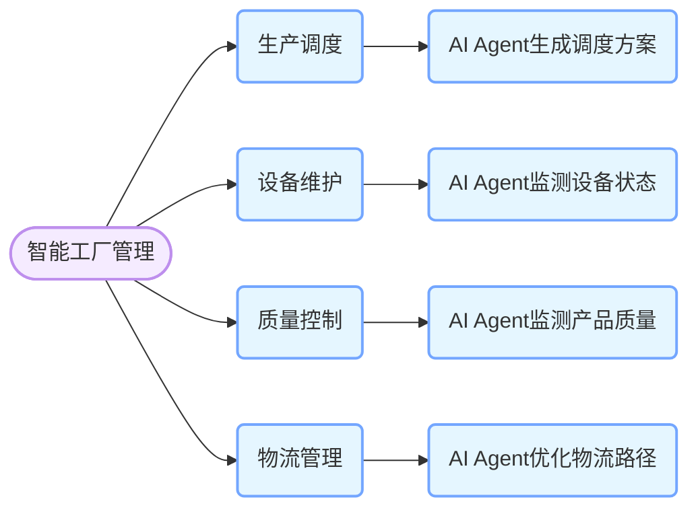

# AI Agent在智能工厂管理中的角色

> 关键词：AI Agent、智能工厂管理、自动化、决策支持、生产优化

> 摘要：本文深入探讨了AI Agent在智能工厂管理中的角色。首先介绍了相关背景知识，包括目的范围、预期读者等内容。接着阐述了AI Agent和智能工厂管理的核心概念及其联系，详细讲解了核心算法原理与具体操作步骤，并给出了相关数学模型和公式。通过项目实战案例，展示了AI Agent在实际应用中的代码实现和详细解读。同时，分析了AI Agent在智能工厂管理中的实际应用场景，推荐了学习资源、开发工具框架和相关论文著作。最后总结了未来发展趋势与挑战，还提供了常见问题解答和扩展阅读参考资料，旨在为读者全面呈现AI Agent在智能工厂管理中的重要作用和应用价值。

## 1. 背景介绍 
### 1.1 目的和范围
随着制造业的快速发展，智能工厂逐渐成为未来制造业的发展方向。智能工厂管理需要处理大量的生产数据、设备状态信息和复杂的生产流程，传统的管理方式已经难以满足高效、精准的管理需求。本文的目的是深入研究AI Agent在智能工厂管理中的角色和应用，探讨如何利用AI Agent提高智能工厂的生产效率、降低成本、提升产品质量。

文章的范围涵盖了AI Agent的基本概念、核心算法原理，以及在智能工厂管理中的具体应用场景，包括生产调度、设备维护、质量控制等方面。同时，还会介绍相关的开发工具、学习资源和研究成果，为读者提供全面的技术参考。

### 1.2 预期读者
本文的预期读者包括智能工厂领域的管理人员、技术研发人员、人工智能领域的研究者和开发者，以及对智能制造感兴趣的学生和爱好者。对于智能工厂管理人员，本文可以帮助他们了解AI Agent如何应用于工厂管理，为决策提供参考；对于技术研发人员和开发者，本文提供了详细的算法原理和代码实现，有助于他们进行实际项目的开发；对于研究者和学生，本文可以作为研究智能工厂管理和AI Agent应用的参考资料。

### 1.3 文档结构概述
本文将按照以下结构进行组织：
1. **背景介绍**：阐述文章的目的和范围、预期读者以及文档结构概述，同时介绍相关术语。
2. **核心概念与联系**：解释AI Agent和智能工厂管理的核心概念，展示它们之间的联系，并通过文本示意图和Mermaid流程图进行说明。
3. **核心算法原理 & 具体操作步骤**：详细讲解AI Agent的核心算法原理，使用Python源代码进行阐述，并给出具体的操作步骤。
4. **数学模型和公式 & 详细讲解 & 举例说明**：介绍AI Agent在智能工厂管理中涉及的数学模型和公式，并进行详细讲解和举例说明。
5. **项目实战：代码实际案例和详细解释说明**：通过一个实际项目案例，展示AI Agent在智能工厂管理中的代码实现和详细解读。
6. **实际应用场景**：分析AI Agent在智能工厂管理中的具体应用场景，如生产调度、设备维护、质量控制等。
7. **工具和资源推荐**：推荐学习AI Agent和智能工厂管理的相关资源，包括书籍、在线课程、技术博客和网站，以及开发工具框架和相关论文著作。
8. **总结：未来发展趋势与挑战**：总结AI Agent在智能工厂管理中的应用现状，分析未来发展趋势和面临的挑战。
9. **附录：常见问题与解答**：解答读者在学习和应用过程中可能遇到的常见问题。
10. **扩展阅读 & 参考资料**：提供相关的扩展阅读资料和参考书目。

### 1.4 术语表
#### 1.4.1 核心术语定义
- **AI Agent（人工智能代理）**：是一种能够感知环境、根据感知信息进行决策并采取行动的智能实体。它可以独立地执行任务，与其他Agent进行交互，以实现特定的目标。
- **智能工厂管理**：指利用先进的信息技术和管理方法，对工厂的生产过程、设备、人员等进行全面、高效的管理，以提高生产效率、降低成本、提升产品质量。
- **生产调度**：根据生产任务和资源状况，合理安排生产设备和人员的工作顺序和时间，以实现生产目标的优化。
- **设备维护**：对生产设备进行定期检查、保养和维修，以确保设备的正常运行，减少设备故障和停机时间。
- **质量控制**：通过对生产过程和产品质量的监测和分析，采取相应的措施来保证产品质量符合标准要求。

#### 1.4.2 相关概念解释
- **多Agent系统（Multi-Agent System，MAS）**：由多个AI Agent组成的系统，这些Agent之间可以相互协作、竞争或通信，以实现共同的或各自的目标。
- **强化学习（Reinforcement Learning）**：一种机器学习方法，Agent通过与环境进行交互，根据环境反馈的奖励信号来学习最优的行为策略。
- **传感器网络**：由多个传感器组成的网络，用于实时监测工厂环境、设备状态和生产过程中的各种参数。

#### 1.4.3 缩略词列表
- **AI**：Artificial Intelligence，人工智能
- **MAS**：Multi-Agent System，多Agent系统
- **RL**：Reinforcement Learning，强化学习

## 2. 核心概念与联系 

### 2.1 AI Agent的核心概念
AI Agent是一个具有自主性、反应性、社会性和适应性的智能实体。自主性意味着Agent能够独立地感知环境、做出决策并采取行动，而不需要人类的直接干预。反应性表示Agent能够对环境中的变化做出及时的响应。社会性指Agent可以与其他Agent或人类进行交互和协作。适应性则表示Agent能够根据环境的变化和自身的经验不断调整自己的行为策略。

AI Agent通常由感知模块、决策模块和执行模块组成。感知模块负责收集环境信息，决策模块根据感知信息和自身的目标进行决策，执行模块则将决策转化为具体的行动。

### 2.2 智能工厂管理的核心概念
智能工厂管理是一个复杂的系统工程，涉及到生产计划、生产调度、设备管理、质量管理、物流管理等多个方面。其核心目标是实现生产过程的自动化、智能化和优化，提高生产效率、降低成本、提升产品质量。

智能工厂管理需要集成多种信息技术，如物联网、大数据、人工智能等，以实现对生产过程的实时监测、分析和决策。通过传感器网络收集生产设备、原材料、人员等方面的信息，利用大数据分析技术对这些信息进行处理和挖掘，为决策提供支持。

### 2.3 AI Agent与智能工厂管理的联系
AI Agent在智能工厂管理中扮演着重要的角色。可以将AI Agent应用于智能工厂管理的各个环节，如生产调度、设备维护、质量控制等。每个AI Agent可以负责特定的任务，通过与其他Agent进行协作，实现智能工厂的整体优化。

例如，在生产调度中，可以使用AI Agent根据订单需求、设备状态和人员情况，自动生成最优的生产计划和调度方案。在设备维护中，AI Agent可以实时监测设备的运行状态，预测设备故障，并及时安排维护人员进行维修。在质量控制中，AI Agent可以对生产过程中的产品质量进行实时监测和分析，发现质量问题及时采取措施进行调整。

### 2.4 文本示意图
```plaintext
智能工厂管理
├── 生产调度
│   └── AI Agent（负责生成最优调度方案）
├── 设备维护
│   └── AI Agent（实时监测设备状态，预测故障）
├── 质量控制
│   └── AI Agent（监测产品质量，发现问题及时调整）
└── 物流管理
    └── AI Agent（优化物流路径，提高物流效率）
```

### 2.5 Mermaid流程图


## 3. 核心算法原理 & 具体操作步骤 

### 3.1 强化学习算法原理
在AI Agent应用于智能工厂管理中，强化学习是一种常用的算法。强化学习的基本思想是Agent通过与环境进行交互，根据环境反馈的奖励信号来学习最优的行为策略。

强化学习的主要要素包括：
- **状态（State）**：表示环境的当前状态，例如设备的运行状态、生产任务的进度等。
- **动作（Action）**：Agent可以采取的行为，例如调整生产速度、安排设备维护等。
- **奖励（Reward）**：环境对Agent采取的动作给予的反馈，用于评价动作的好坏。奖励可以是正数、负数或零。
- **策略（Policy）**：Agent根据当前状态选择动作的规则。

强化学习的目标是找到一个最优策略，使得Agent在长期内获得最大的累积奖励。

### 3.2 Python代码实现强化学习算法
以下是一个简单的基于Q-learning算法的强化学习示例代码，用于解决智能工厂生产调度中的简单问题。

```python
import numpy as np

# 定义环境参数
num_states = 10  # 状态数量
num_actions = 3  # 动作数量
gamma = 0.9  # 折扣因子
alpha = 0.1  # 学习率
episodes = 1000  # 训练回合数

# 初始化Q表
Q = np.zeros((num_states, num_actions))

# 定义奖励函数
def get_reward(state, action):
    # 简单示例：根据状态和动作返回奖励
    if state == 5 and action == 1:
        return 10
    else:
        return -1

# 定义Q-learning算法
def q_learning():
    for episode in range(episodes):
        state = np.random.randint(0, num_states)  # 随机初始化状态
        done = False
        while not done:
            # 根据Q表选择动作
            if np.random.uniform(0, 1) < 0.1:  # 探索率
                action = np.random.randint(0, num_actions)
            else:
                action = np.argmax(Q[state, :])

            # 执行动作，获取奖励和下一个状态
            reward = get_reward(state, action)
            next_state = (state + action) % num_states

            # 更新Q表
            Q[state, action] = Q[state, action] + alpha * (reward + gamma * np.max(Q[next_state, :]) - Q[state, action])

            state = next_state

            # 判断是否结束
            if state == 5 and action == 1:
                done = True

    return Q

# 训练模型
Q = q_learning()

# 输出最终的Q表
print("Final Q-table:")
print(Q)
```

### 3.3 具体操作步骤
1. **定义环境参数**：确定状态数量、动作数量、折扣因子、学习率和训练回合数等参数。
2. **初始化Q表**：Q表是一个二维数组，用于存储每个状态下每个动作的Q值。
3. **定义奖励函数**：根据具体的问题定义奖励函数，用于评价Agent采取的动作的好坏。
4. **执行Q-learning算法**：在每个训练回合中，Agent根据Q表选择动作，执行动作并获取奖励和下一个状态，然后更新Q表。
5. **训练模型**：重复执行Q-learning算法，直到达到指定的训练回合数。
6. **输出结果**：训练结束后，输出最终的Q表，Agent可以根据Q表选择最优的动作。

## 4. 数学模型和公式 & 详细讲解 & 举例说明 

### 4.1 Q-learning算法的数学模型和公式
Q-learning算法是一种无模型的强化学习算法，其核心思想是通过迭代更新Q表来学习最优的行为策略。Q表中的每个元素 $Q(s, a)$ 表示在状态 $s$ 下采取动作 $a$ 的期望累积奖励。

Q-learning算法的更新公式如下：
$$
Q(s_t, a_t) \leftarrow Q(s_t, a_t) + \alpha \left[ r_t + \gamma \max_{a} Q(s_{t+1}, a) - Q(s_t, a_t) \right]
$$
其中：
- $s_t$ 表示当前状态
- $a_t$ 表示当前动作
- $r_t$ 表示执行动作 $a_t$ 后获得的奖励
- $s_{t+1}$ 表示下一个状态
- $\alpha$ 是学习率，控制每次更新的步长
- $\gamma$ 是折扣因子，用于权衡当前奖励和未来奖励

### 4.2 详细讲解
- **学习率 $\alpha$**：学习率 $\alpha$ 控制每次更新Q表的步长。如果 $\alpha$ 过大，Q表的更新会比较快，但可能会导致算法不稳定；如果 $\alpha$ 过小，Q表的更新会比较慢，算法收敛速度会变慢。
- **折扣因子 $\gamma$**：折扣因子 $\gamma$ 用于权衡当前奖励和未来奖励。$\gamma$ 越接近1，表示Agent更看重未来的奖励；$\gamma$ 越接近0，表示Agent更看重当前的奖励。
- **最大Q值 $\max_{a} Q(s_{t+1}, a)$**：表示在下一个状态 $s_{t+1}$ 下所有动作的Q值中的最大值。Agent会选择使得Q值最大的动作作为最优动作。

### 4.3 举例说明
假设智能工厂有一个简单的生产调度问题，状态 $s$ 表示生产任务的进度，有10个状态（$s = 0, 1, \cdots, 9$），动作 $a$ 表示调整生产速度，有3个动作（$a = 0, 1, 2$）。奖励函数定义如下：当状态 $s = 5$ 且动作 $a = 1$ 时，奖励 $r = 10$；否则，奖励 $r = -1$。

初始时，Q表中的所有元素都为0。在第一个训练回合中，Agent随机选择一个状态 $s_0$ 和一个动作 $a_0$，执行动作后获得奖励 $r_0$ 和下一个状态 $s_1$。根据Q-learning更新公式，更新Q表中的元素 $Q(s_0, a_0)$。重复这个过程，直到达到指定的训练回合数。

经过多次训练后，Q表中的元素会逐渐收敛到最优值，Agent可以根据Q表选择最优的动作，以获得最大的累积奖励。

## 5. 项目实战：代码实际案例和详细解释说明 

### 5.1  开发环境搭建
#### 5.1.1 安装Python
首先，需要安装Python环境。可以从Python官方网站（https://www.python.org/downloads/）下载适合自己操作系统的Python版本，并按照安装向导进行安装。

#### 5.1.2 安装必要的库
在本项目中，需要使用NumPy库进行数值计算。可以使用以下命令安装NumPy：
```sh
pip install numpy
```

### 5.2  源代码详细实现和代码解读
以下是一个完整的项目实战代码示例，用于解决智能工厂设备维护中的故障预测问题。

```python
import numpy as np
from sklearn.model_selection import train_test_split
from sklearn.linear_model import LogisticRegression
from sklearn.metrics import accuracy_score

# 生成模拟数据
def generate_data(num_samples, num_features):
    X = np.random.randn(num_samples, num_features)
    y = np.random.randint(0, 2, num_samples)
    return X, y

# 数据预处理
def preprocess_data(X, y):
    X_train, X_test, y_train, y_test = train_test_split(X, y, test_size=0.2, random_state=42)
    return X_train, X_test, y_train, y_test

# 训练模型
def train_model(X_train, y_train):
    model = LogisticRegression()
    model.fit(X_train, y_train)
    return model

# 评估模型
def evaluate_model(model, X_test, y_test):
    y_pred = model.predict(X_test)
    accuracy = accuracy_score(y_test, y_pred)
    return accuracy

# 主函数
def main():
    num_samples = 1000
    num_features = 10
    X, y = generate_data(num_samples, num_features)
    X_train, X_test, y_train, y_test = preprocess_data(X, y)
    model = train_model(X_train, y_train)
    accuracy = evaluate_model(model, X_test, y_test)
    print(f"Model accuracy: {accuracy}")

if __name__ == "__main__":
    main()
```

### 5.3  代码解读与分析
#### 5.3.1 生成模拟数据
`generate_data` 函数用于生成模拟的设备状态数据。`X` 是一个二维数组，表示设备的特征数据；`y` 是一个一维数组，表示设备是否发生故障的标签。

#### 5.3.2 数据预处理
`preprocess_data` 函数使用 `train_test_split` 函数将数据集划分为训练集和测试集，其中测试集占总数据集的20%。

#### 5.3.3 训练模型
`train_model` 函数使用逻辑回归模型对训练集进行训练。逻辑回归是一种常用的分类算法，用于预测设备是否发生故障。

#### 5.3.4 评估模型
`evaluate_model` 函数使用 `accuracy_score` 函数计算模型在测试集上的准确率，用于评估模型的性能。

#### 5.3.5 主函数
`main` 函数调用上述函数，完成数据生成、预处理、模型训练和评估的整个流程，并输出模型的准确率。

通过这个项目实战，我们可以看到如何使用机器学习算法来解决智能工厂设备维护中的故障预测问题。在实际应用中，可以使用真实的设备状态数据来替换模拟数据，以提高模型的准确性和实用性。

## 6. 实际应用场景 
### 6.1 生产调度
在智能工厂中，生产调度是一个关键环节，直接影响到生产效率和成本。AI Agent可以根据订单需求、设备状态、人员情况等信息，自动生成最优的生产计划和调度方案。

例如，AI Agent可以实时监测设备的运行状态，预测设备的故障发生时间，提前安排设备维护，避免设备故障导致的生产中断。同时，AI Agent可以根据订单的优先级和交货期，合理安排生产任务的顺序，提高生产效率。

### 6.2 设备维护
设备维护是保证智能工厂正常运行的重要保障。AI Agent可以实时监测设备的运行状态，收集设备的振动、温度、压力等数据，通过数据分析和机器学习算法，预测设备的故障发生时间和故障类型。

当预测到设备即将发生故障时，AI Agent可以及时通知维护人员进行维修，减少设备故障和停机时间。同时，AI Agent可以根据设备的运行历史数据，制定合理的维护计划，提高设备的可靠性和使用寿命。

### 6.3 质量控制
质量控制是智能工厂管理的核心目标之一。AI Agent可以实时监测生产过程中的产品质量，收集产品的尺寸、外观、性能等数据，通过数据分析和机器学习算法，判断产品是否符合质量标准。

当发现产品质量问题时，AI Agent可以及时调整生产参数，如温度、压力、速度等，以保证产品质量的稳定性。同时，AI Agent可以对质量问题进行追溯和分析，找出问题的根源，采取相应的措施进行改进。

### 6.4 物流管理
物流管理是智能工厂管理的重要组成部分。AI Agent可以优化物流路径，提高物流效率。例如，AI Agent可以根据订单的配送地址、货物重量、运输工具等信息，选择最优的物流路径和运输方式，减少物流成本和运输时间。

同时，AI Agent可以实时监测物流运输过程中的货物状态，如位置、温度、湿度等，确保货物的安全和质量。当发现货物出现异常情况时，AI Agent可以及时通知相关人员进行处理。

## 7. 工具和资源推荐
### 7.1 学习资源推荐
#### 7.1.1 书籍推荐
- 《人工智能：一种现代的方法》（Artificial Intelligence: A Modern Approach）：这是一本经典的人工智能教材，涵盖了人工智能的各个领域，包括搜索算法、知识表示、机器学习、自然语言处理等。
- 《强化学习：原理与Python实现》：详细介绍了强化学习的基本原理和算法，并通过Python代码实现了多个强化学习案例。
- 《智能工厂：原理、技术与应用》：介绍了智能工厂的基本概念、技术架构和应用案例，对于了解智能工厂管理有很大的帮助。

#### 7.1.2 在线课程
- Coursera上的“人工智能基础”（Foundations of Artificial Intelligence）课程：由知名教授授课，系统地介绍了人工智能的基本概念、算法和应用。
- edX上的“强化学习”（Reinforcement Learning）课程：深入讲解了强化学习的理论和实践，包括Q-learning、深度强化学习等内容。
- 中国大学MOOC上的“智能制造技术”课程：介绍了智能制造的相关技术，如物联网、大数据、人工智能等在智能工厂中的应用。

#### 7.1.3 技术博客和网站
- Medium上的人工智能相关博客：有很多人工智能领域的专家和开发者分享他们的研究成果和实践经验。
- 机器之心（https://www.alienstar.cn/）：专注于人工智能领域的技术报道和分析，提供最新的技术动态和研究成果。
- 智东西（https://www.zidongxi.com/）：关注智能科技领域的发展，包括智能工厂、人工智能、物联网等方面的内容。

### 7.2 开发工具框架推荐
#### 7.2.1 IDE和编辑器
- PyCharm：一款专门为Python开发设计的集成开发环境，具有代码编辑、调试、版本控制等功能，非常适合Python项目的开发。
- Visual Studio Code：一款轻量级的代码编辑器，支持多种编程语言，具有丰富的插件生态系统，可以通过安装插件来扩展功能。

#### 7.2.2 调试和性能分析工具
- pdb：Python自带的调试工具，可以在代码中设置断点，逐步执行代码，查看变量的值和程序的执行流程。
- cProfile：Python的性能分析工具，可以分析代码的执行时间和函数调用次数，帮助开发者找出代码中的性能瓶颈。

#### 7.2.3 相关框架和库
- TensorFlow：一个开源的机器学习框架，提供了丰富的工具和库，用于构建和训练深度学习模型。
- PyTorch：另一个流行的深度学习框架，具有简洁的API和动态计算图的特点，适合快速开发和实验。
- Scikit-learn：一个用于机器学习的Python库，提供了多种机器学习算法和工具，如分类、回归、聚类等。

### 7.3 相关论文著作推荐
#### 7.3.1 经典论文
- “Q-learning”（Watkins, C. J. C. H., & Dayan, P. (1992). Q-learning. Machine learning, 8(3-4), 279-292.）：介绍了Q-learning算法的基本原理和实现方法，是强化学习领域的经典论文。
- “Mastering the game of Go with deep neural networks and tree search”（Silver, D., Huang, A., Maddison, C. J., Guez, A., Sifre, L., van den Driessche, G.,... & Dieleman, S. (2016). Mastering the game of Go with deep neural networks and tree search. nature, 529(7587), 484-489.）：介绍了使用深度强化学习算法AlphaGo击败人类围棋冠军的方法，展示了深度强化学习在复杂决策问题中的强大能力。

#### 7.3.2 最新研究成果
- 可以关注顶级学术会议如NeurIPS（神经信息处理系统大会）、ICML（国际机器学习会议）、IJCAI（国际人工智能联合会议）上的相关研究成果，了解AI Agent和智能工厂管理领域的最新进展。

#### 7.3.3 应用案例分析
- 一些知名企业如西门子、博世等会发布他们在智能工厂管理方面的应用案例和研究报告，可以参考这些资料了解AI Agent在实际应用中的效果和经验。

## 8. 总结：未来发展趋势与挑战
### 8.1 未来发展趋势
- **多Agent系统的应用**：未来，智能工厂管理将越来越多地采用多Agent系统，多个AI Agent之间通过协作和通信，实现更复杂的任务和更高效的管理。
- **与其他技术的融合**：AI Agent将与物联网、大数据、区块链等技术深度融合，实现智能工厂的全面智能化和数字化。
- **强化学习的发展**：强化学习算法将不断发展和完善，能够处理更复杂的环境和任务，提高AI Agent的决策能力和学习效率。
- **人机协作**：AI Agent将与人类操作员实现更紧密的协作，人类可以通过与AI Agent的交互，更好地理解和控制生产过程。

### 8.2 挑战
- **数据隐私和安全**：智能工厂管理中涉及大量的生产数据和设备信息，如何保证数据的隐私和安全是一个重要的挑战。
- **算法复杂度和可解释性**：一些复杂的AI算法，如深度学习和强化学习，具有较高的复杂度，且模型的可解释性较差，如何提高算法的可解释性是一个需要解决的问题。
- **系统集成和兼容性**：智能工厂管理需要集成多种信息技术和设备，如何保证系统的集成和兼容性是一个挑战。
- **人才短缺**：AI Agent和智能工厂管理领域需要具备多学科知识的人才，目前相关人才短缺，如何培养和吸引这些人才是一个亟待解决的问题。

## 9. 附录：常见问题与解答
### 9.1 AI Agent与传统软件程序有什么区别？
AI Agent具有自主性、反应性、社会性和适应性等特点，能够独立地感知环境、做出决策并采取行动，而传统软件程序通常是按照预设的规则和流程执行任务，缺乏自主性和适应性。

### 9.2 如何选择适合的强化学习算法？
选择适合的强化学习算法需要考虑问题的复杂度、环境的特点、数据的可用性等因素。对于简单的问题，可以选择Q-learning等经典算法；对于复杂的问题，可以考虑使用深度强化学习算法，如DQN、A3C等。

### 9.3 AI Agent在智能工厂管理中会取代人类吗？
AI Agent在智能工厂管理中可以辅助人类完成一些复杂的任务，提高生产效率和管理水平，但不会完全取代人类。人类在决策、创新、沟通等方面具有独特的优势，与AI Agent实现人机协作是未来的发展方向。

### 9.4 如何保证AI Agent的安全性和可靠性？
保证AI Agent的安全性和可靠性需要从多个方面入手，如数据安全、算法设计、模型验证等。可以采用加密技术保护数据安全，使用鲁棒的算法设计提高Agent的抗干扰能力，通过严格的模型验证确保Agent的性能和可靠性。

## 10. 扩展阅读 & 参考资料
### 10.1 扩展阅读
- 《深度学习》（Deep Learning）：详细介绍了深度学习的基本原理和算法，对于理解AI Agent中的深度学习模型有很大的帮助。
- 《工业4.0：正在发生的未来》：介绍了工业4.0的概念、技术和应用，对于了解智能工厂的发展趋势有一定的参考价值。

### 10.2 参考资料
- 相关学术论文和研究报告，可以从IEEE Xplore、ACM Digital Library等学术数据库中获取。
- 智能工厂管理相关的行业标准和规范，如ISO 9001质量管理体系、ISO 14001环境管理体系等。

作者：AI天才研究院/AI Genius Institute & 禅与计算机程序设计艺术 /Zen And The Art of Computer Programming